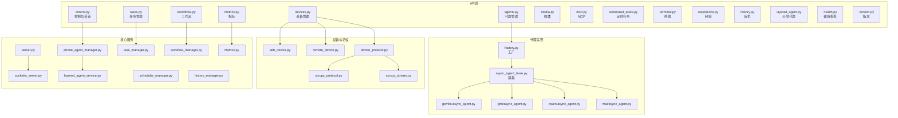
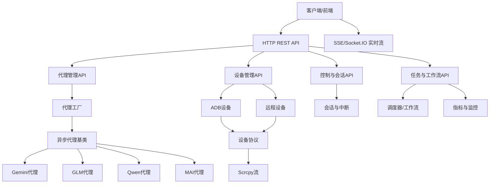
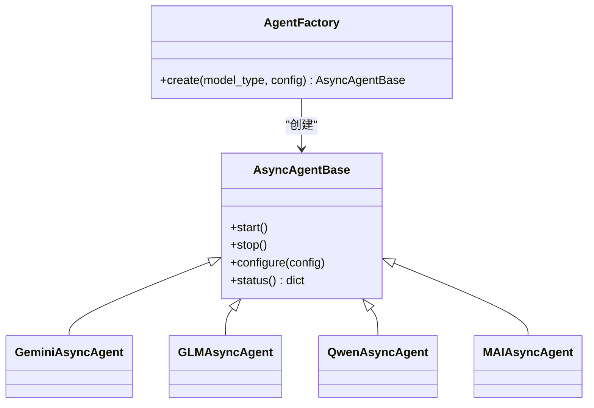
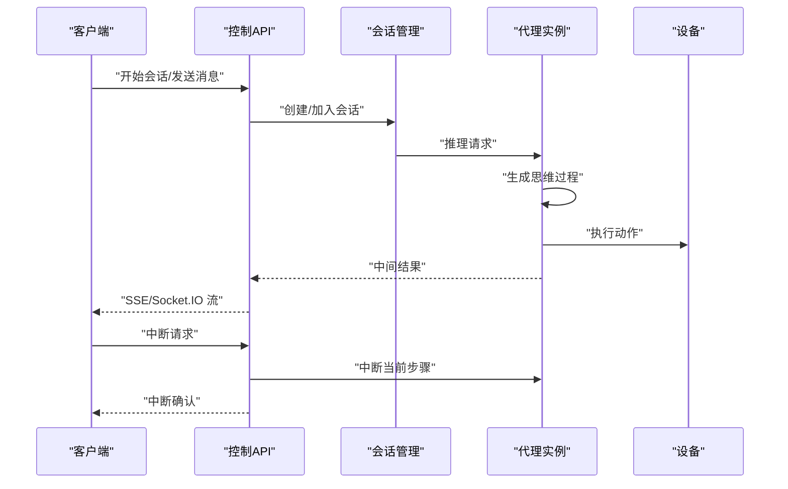
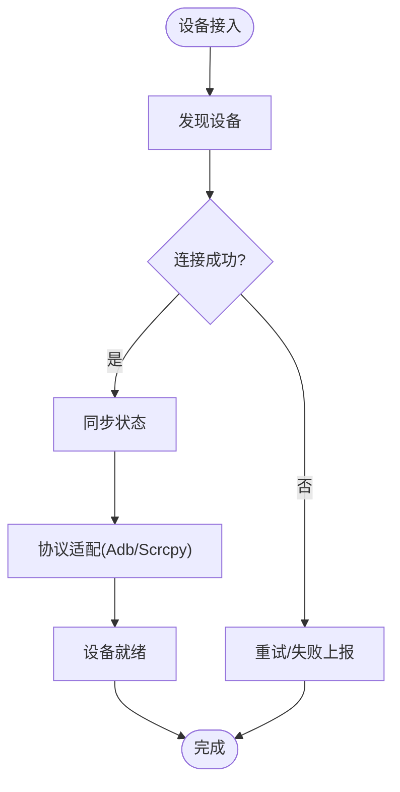
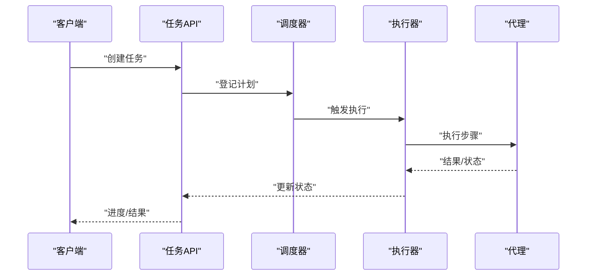
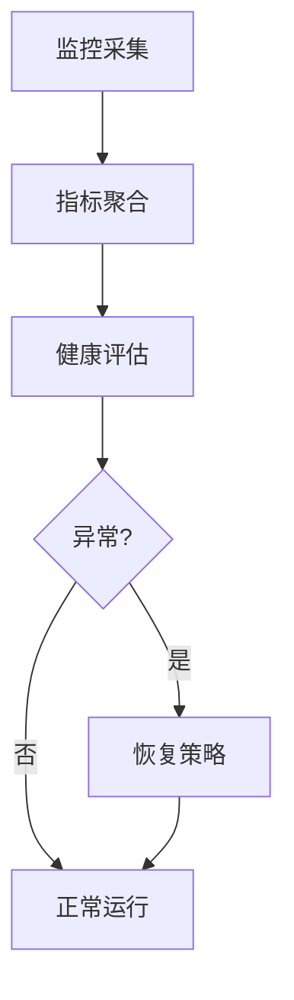
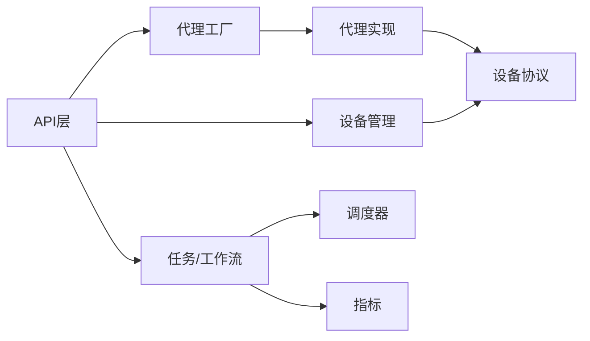

# 代理控制API

<cite>
**本文档引用的文件**
- [api/agents.py](file://AutoGLM_GUI/api/agents.py)
- [api/control.py](file://AutoGLM_GUI/api/control.py)
- [api/devices.py](file://AutoGLM_GUI/api/devices.py)
- [api/experience.py](file://AutoGLM_GUI/api/experience.py)
- [api/health.py](file://AutoGLM_GUI/api/health.py)
- [api/history.py](file://AutoGLM_GUI/api/history.py)
- [api/layered_agent.py](file://AutoGLM_GUI/api/layered_agent.py)
- [api/mcp.py](file://AutoGLM_GUI/api/mcp.py)
- [api/media.py](file://AutoGLM_GUI/api/media.py)
- [api/metrics.py](file://AutoGLM_GUI/api/metrics.py)
- [api/scheduled_tasks.py](file://AutoGLM_GUI/api/scheduled_tasks.py)
- [api/tasks.py](file://AutoGLM_GUI/api/tasks.py)
- [api/terminal.py](file://AutoGLM_GUI/api/terminal.py)
- [api/version.py](file://AutoGLM_GUI/api/version.py)
- [api/workflows.py](file://AutoGLM_GUI/api/workflows.py)
- [agents/factory.py](file://AutoGLM_GUI/agents/factory.py)
- [agents/base/async_agent_base.py](file://AutoGLM_GUI/agents/base/async_agent_base.py)
- [agents/gemini/async_agent.py](file://AutoGLM_GUI/agents/gemini/async_agent.py)
- [agents/glm/async_agent.py](file://AutoGLM_GUI/agents/glm/async_agent.py)
- [agents/qwen/async_agent.py](file://AutoGLM_GUI/agents/qwen/async_agent.py)
- [agents/mai/async_agent.py](file://AutoGLM_GUI/agents/mai/async_agent.py)
- [devices/adb_device.py](file://AutoGLM_GUI/devices/adb_device.py)
- [devices/remote_device.py](file://AutoGLM_GUI/devices/remote_device.py)
- [model/error_details.py](file://AutoGLM_GUI/model/error_details.py)
- [model/message_builder.py](file://AutoGLM_GUI/model/message_builder.py)
- [models/history.py](file://AutoGLM_GUI/models/history.py)
- [models/device_group.py](file://AutoGLM_GUI/models/device_group.py)
- [schemas.py](file://AutoGLM_GUI/schemas.py)
- [types.py](file://AutoGLM_GUI/types.py)
- [server.py](file://AutoGLM_GUI/server.py)
- [socketio_server.py](file://AutoGLM_GUI/socketio_server.py)
- [metrics.py](file://AutoGLM_GUI/metrics.py)
- [device_protocol.py](file://AutoGLM_GUI/device_protocol.py)
- [adb_manager.py](file://AutoGLM_GUI/adb_manager.py)
- [adb_terminal_service.py](file://AutoGLM_GUI/adb_terminal_service.py)
- [task_manager.py](file://AutoGLM_GUI/task_manager.py)
- [workflow_manager.py](file://AutoGLM_GUI/workflow_manager.py)
- [experience_planner.py](file://AutoGLM_GUI/experience_planner.py)
- [scheduler_manager.py](file://AutoGLM_GUI/scheduler_manager.py)
- [phone_agent_manager.py](file://AutoGLM_GUI/phone_agent_manager.py)
- [layered_agent_service.py](file://AutoGLM_GUI/layered_agent_service.py)
- [exceptions.py](file://AutoGLM_GUI/exceptions.py)
- [history_manager.py](file://AutoGLM_GUI/history_manager.py)
- [prompt_config.py](file://AutoGLM_GUI/prompt_config.py)
- [prompts.py](file://AutoGLM_GUI/prompts.py)
- [trace.py](file://AutoGLM_GUI/trace.py)
- [trace_export.py](file://AutoGLM_GUI/trace_export.py)
- [version.py](file://AutoGLM_GUI/version.py)
- [config.py](file://AutoGLM_GUI/config.py)
- [config_manager.py](file://AutoGLM_GUI/config_manager.py)
- [device_metadata_manager.py](file://AutoGLM_GUI/device_metadata_manager.py)
- [device_group_manager.py](file://AutoGLM_GUI/device_group_manager.py)
- [device_manager.py](file://AutoGLM_GUI/device_manager.py)
- [adb_terminal_repl.py](file://AutoGLM_GUI/adb_terminal_repl.py)
- [scrcpy_protocol.py](file://AutoGLM_GUI/scrcpy_protocol.py)
- [scrcpy_stream.py](file://AutoGLM_GUI/scrcpy_stream.py)
- [i18n.py](file://AutoGLM_GUI/i18n.py)
- [platform_utils.py](file://AutoGLM_GUI/platform_utils.py)
- [logger.py](file://AutoGLM_GUI/logger.py)
- [prompt_config.py](file://AutoGLM_GUI/prompt_config.py)
- [prompts.py](file://AutoGLM_GUI/prompts.py)
- [trace.py](file://AutoGLM_GUI/trace.py)
- [trace_export.py](file://AutoGLM_GUI/trace_export.py)
- [version.py](file://AutoGLM_GUI/version.py)
- [config.py](file://AutoGLM_GUI/config.py)
- [config_manager.py](file://AutoGLM_GUI/config_manager.py)
- [device_metadata_manager.py](file://AutoGLM_GUI/device_metadata_manager.py)
- [device_group_manager.py](file://AutoGLM_GUI/device_group_manager.py)
- [device_manager.py](file://AutoGLM_GUI/device_manager.py)
- [adb_terminal_repl.py](file://AutoGLM_GUI/adb_terminal_repl.py)
- [scrcpy_protocol.py](file://AutoGLM_GUI/scrcpy_protocol.py)
- [scrcpy_stream.py](file://AutoGLM_GUI/scrcpy_stream.py)
- [i18n.py](file://AutoGLM_GUI/i18n.py)
- [platform_utils.py](file://AutoGLM_GUI/platform_utils.py)
- [logger.py](file://AutoGLM_GUI/logger.py)
</cite>

## 目录
1. [简介](#简介)
2. [项目结构](#项目结构)
3. [核心组件](#核心组件)
4. [架构总览](#架构总览)
5. [详细组件分析](#详细组件分析)
6. [依赖关系分析](#依赖关系分析)
7. [性能考虑](#性能考虑)
8. [故障排除指南](#故障排除指南)
9. [结论](#结论)
10. [附录](#附录)

## 简介
本文件为AI代理控制API的权威技术文档，覆盖代理实例管理、会话控制、配置更新与状态查询等核心能力。系统支持多模型统一接口（GLM、Gemini、Qwen、MAI），提供代理启动/停止、思维过程输出、动作执行、实时输出流与中断机制，并包含代理与设备交互协议、性能监控、资源统计与故障恢复策略。文档同时提供代理配置模板、会话上下文管理与多轮对话实现示例，帮助开发者快速集成与扩展。

## 项目结构
后端服务采用模块化设计，API层集中于AutoGLM_GUI/api目录，代理实现位于AutoGLM_GUI/agents，设备抽象在AutoGLM_GUI/devices，核心业务逻辑分布在各管理器与服务中。前端通过Socket.IO进行实时通信，后端通过HTTP API提供REST接口。

**图表来源**
- [api/agents.py](file://AutoGLM_GUI/api/agents.py)
- [api/control.py](file://AutoGLM_GUI/api/control.py)
- [api/devices.py](file://AutoGLM_GUI/api/devices.py)
- [agents/factory.py](file://AutoGLM_GUI/agents/factory.py)
- [agents/base/async_agent_base.py](file://AutoGLM_GUI/agents/base/async_agent_base.py)
- [agents/gemini/async_agent.py](file://AutoGLM_GUI/agents/gemini/async_agent.py)
- [agents/glm/async_agent.py](file://AutoGLM_GUI/agents/glm/async_agent.py)
- [agents/qwen/async_agent.py](file://AutoGLM_GUI/agents/qwen/async_agent.py)
- [agents/mai/async_agent.py](file://AutoGLM_GUI/agents/mai/async_agent.py)
- [devices/adb_device.py](file://AutoGLM_GUI/devices/adb_device.py)
- [devices/remote_device.py](file://AutoGLM_GUI/devices/remote_device.py)
- [device_protocol.py](file://AutoGLM_GUI/device_protocol.py)
- [scrcpy_protocol.py](file://AutoGLM_GUI/scrcpy_protocol.py)
- [scrcpy_stream.py](file://AutoGLM_GUI/scrcpy_stream.py)
- [server.py](file://AutoGLM_GUI/server.py)
- [socketio_server.py](file://AutoGLM_GUI/socketio_server.py)
- [phone_agent_manager.py](file://AutoGLM_GUI/phone_agent_manager.py)
- [layered_agent_service.py](file://AutoGLM_GUI/layered_agent_service.py)
- [task_manager.py](file://AutoGLM_GUI/task_manager.py)
- [workflow_manager.py](file://AutoGLM_GUI/workflow_manager.py)
- [scheduler_manager.py](file://AutoGLM_GUI/scheduler_manager.py)
- [history_manager.py](file://AutoGLM_GUI/history_manager.py)
- [metrics.py](file://AutoGLM_GUI/metrics.py)

**章节来源**
- [server.py](file://AutoGLM_GUI/server.py)
- [socketio_server.py](file://AutoGLM_GUI/socketio_server.py)

## 核心组件
- 代理管理API：负责代理实例生命周期、模型选择、配置更新与状态查询。
- 控制与会话API：提供会话控制、多轮对话、中断与取消、实时输出流。
- 设备管理API：设备连接、状态同步、ADB/远程设备抽象与协议适配。
- 任务与工作流API：任务调度、工作流编排、定时任务与经验规划。
- 指标与健康API：性能监控、资源统计、健康检查与故障恢复。
- MCP与媒体API：外部工具集成、媒体数据处理与传输。
- 历史与经验API：对话历史存储、经验回放与报告生成。

**章节来源**
- [api/agents.py](file://AutoGLM_GUI/api/agents.py)
- [api/control.py](file://AutoGLM_GUI/api/control.py)
- [api/devices.py](file://AutoGLM_GUI/api/devices.py)
- [api/tasks.py](file://AutoGLM_GUI/api/tasks.py)
- [api/workflows.py](file://AutoGLM_GUI/api/workflows.py)
- [api/metrics.py](file://AutoGLM_GUI/api/metrics.py)
- [api/health.py](file://AutoGLM_GUI/api/health.py)
- [api/mcp.py](file://AutoGLM_GUI/api/mcp.py)
- [api/media.py](file://AutoGLM_GUI/api/media.py)
- [api/history.py](file://AutoGLM_GUI/api/history.py)
- [api/experience.py](file://AutoGLM_GUI/api/experience.py)

## 架构总览
系统采用“API层-代理层-设备层-协议层”的分层架构。API层提供REST接口与Socket.IO事件；代理层通过工厂模式统一调度不同模型；设备层抽象ADB与远程设备；协议层负责输入输出与实时流。

**图表来源**
- [api/agents.py](file://AutoGLM_GUI/api/agents.py)
- [agents/factory.py](file://AutoGLM_GUI/agents/factory.py)
- [agents/base/async_agent_base.py](file://AutoGLM_GUI/agents/base/async_agent_base.py)
- [agents/gemini/async_agent.py](file://AutoGLM_GUI/agents/gemini/async_agent.py)
- [agents/glm/async_agent.py](file://AutoGLM_GUI/agents/glm/async_agent.py)
- [agents/qwen/async_agent.py](file://AutoGLM_GUI/agents/qwen/async_agent.py)
- [agents/mai/async_agent.py](file://AutoGLM_GUI/agents/mai/async_agent.py)
- [api/devices.py](file://AutoGLM_GUI/api/devices.py)
- [devices/adb_device.py](file://AutoGLM_GUI/devices/adb_device.py)
- [devices/remote_device.py](file://AutoGLM_GUI/devices/remote_device.py)
- [device_protocol.py](file://AutoGLM_GUI/device_protocol.py)
- [scrcpy_protocol.py](file://AutoGLM_GUI/scrcpy_protocol.py)
- [scrcpy_stream.py](file://AutoGLM_GUI/scrcpy_stream.py)
- [api/control.py](file://AutoGLM_GUI/api/control.py)
- [api/tasks.py](file://AutoGLM_GUI/api/tasks.py)
- [scheduler_manager.py](file://AutoGLM_GUI/scheduler_manager.py)
- [metrics.py](file://AutoGLM_GUI/metrics.py)

## 详细组件分析

### 代理管理API（agents.py）
- 功能概述
  - 创建/删除代理实例
  - 切换与配置代理模型（GLM/Gemini/Qwen/MAI）
  - 查询代理状态与运行信息
  - 更新代理配置（提示词、参数、上下文）
- 统一接口规范
  - 模型选择：通过模型标识符统一入口，内部由工厂创建具体代理
  - 参数映射：将通用参数映射到各模型特定参数
  - 上下文管理：支持会话上下文注入与清理
- 错误处理
  - 模型不可用、参数非法、上下文缺失等情况返回标准化错误码与消息

**图表来源**
- [agents/factory.py](file://AutoGLM_GUI/agents/factory.py)
- [agents/base/async_agent_base.py](file://AutoGLM_GUI/agents/base/async_agent_base.py)
- [agents/gemini/async_agent.py](file://AutoGLM_GUI/agents/gemini/async_agent.py)
- [agents/glm/async_agent.py](file://AutoGLM_GUI/agents/glm/async_agent.py)
- [agents/qwen/async_agent.py](file://AutoGLM_GUI/agents/qwen/async_agent.py)
- [agents/mai/async_agent.py](file://AutoGLM_GUI/agents/mai/async_agent.py)

**章节来源**
- [api/agents.py](file://AutoGLM_GUI/api/agents.py)
- [agents/factory.py](file://AutoGLM_GUI/agents/factory.py)
- [agents/base/async_agent_base.py](file://AutoGLM_GUI/agents/base/async_agent_base.py)

### 控制与会话API（control.py）
- 会话控制
  - 开启新会话、加入现有会话、结束会话
  - 多轮对话：上下文累积与截断策略
  - 中断与取消：支持在推理过程中中断当前步骤
- 实时输出流
  - SSE/Socket.IO推送思维过程与动作执行结果
  - 支持流式增量输出与最终汇总
- 错误处理
  - 会话不存在、设备离线、代理阻塞等异常分类处理

**图表来源**
- [api/control.py](file://AutoGLM_GUI/api/control.py)
- [phone_agent_manager.py](file://AutoGLM_GUI/phone_agent_manager.py)
- [layered_agent_service.py](file://AutoGLM_GUI/layered_agent_service.py)

**章节来源**
- [api/control.py](file://AutoGLM_GUI/api/control.py)
- [socketio_server.py](file://AutoGLM_GUI/socketio_server.py)

### 设备管理API（devices.py）
- 设备连接与发现
  - ADB设备自动发现与连接
  - 远程设备注册与心跳
- 设备状态同步
  - 屏幕截图、输入事件、网络状态上报
- 协议适配
  - ADB命令封装、Scrcpy投屏与控制
  - 设备协议抽象，屏蔽底层差异

**图表来源**
- [api/devices.py](file://AutoGLM_GUI/api/devices.py)
- [devices/adb_device.py](file://AutoGLM_GUI/devices/adb_device.py)
- [devices/remote_device.py](file://AutoGLM_GUI/devices/remote_device.py)
- [device_protocol.py](file://AutoGLM_GUI/device_protocol.py)
- [scrcpy_protocol.py](file://AutoGLM_GUI/scrcpy_protocol.py)
- [scrcpy_stream.py](file://AutoGLM_GUI/scrcpy_stream.py)

**章节来源**
- [api/devices.py](file://AutoGLM_GUI/api/devices.py)
- [device_manager.py](file://AutoGLM_GUI/device_manager.py)
- [device_metadata_manager.py](file://AutoGLM_GUI/device_metadata_manager.py)

### 任务与工作流API（tasks.py, workflows.py）
- 任务管理
  - 创建、查询、取消、重试任务
  - 任务状态跟踪与进度上报
- 工作流编排
  - 步骤编排、条件分支、并行执行
  - 终止条件与回滚策略
- 定时任务与调度
  - Cron风格调度、一次性任务
  - 调度器与执行器解耦

**图表来源**
- [api/tasks.py](file://AutoGLM_GUI/api/tasks.py)
- [api/workflows.py](file://AutoGLM_GUI/api/workflows.py)
- [scheduler_manager.py](file://AutoGLM_GUI/scheduler_manager.py)
- [task_manager.py](file://AutoGLM_GUI/task_manager.py)
- [workflow_manager.py](file://AutoGLM_GUI/workflow_manager.py)

**章节来源**
- [api/tasks.py](file://AutoGLM_GUI/api/tasks.py)
- [api/workflows.py](file://AutoGLM_GUI/api/workflows.py)
- [scheduler_manager.py](file://AutoGLM_GUI/scheduler_manager.py)
- [task_manager.py](file://AutoGLM_GUI/task_manager.py)
- [workflow_manager.py](file://AutoGLM_GUI/workflow_manager.py)

### 指标与健康API（metrics.py, health.py）
- 性能监控
  - 代理响应时间、吞吐量、队列长度
  - 设备帧率、CPU/内存占用
- 健康检查
  - 服务可用性、数据库连通性、模型服务连通性
- 故障恢复
  - 自动重启、降级策略、熔断与隔离

**图表来源**
- [api/metrics.py](file://AutoGLM_GUI/api/metrics.py)
- [api/health.py](file://AutoGLM_GUI/api/health.py)
- [metrics.py](file://AutoGLM_GUI/metrics.py)

**章节来源**
- [api/metrics.py](file://AutoGLM_GUI/api/metrics.py)
- [api/health.py](file://AutoGLM_GUI/api/health.py)
- [metrics.py](file://AutoGLM_GUI/metrics.py)

### MCP与媒体API（mcp.py, media.py）
- MCP集成
  - 工具调用、外部API桥接、动作扩展
- 媒体处理
  - 截图、音频、视频的编码、传输与缓存

**章节来源**
- [api/mcp.py](file://AutoGLM_GUI/api/mcp.py)
- [api/media.py](file://AutoGLM_GUI/api/media.py)

### 历史与经验API（history.py, experience.py）
- 历史记录
  - 会话历史、操作轨迹、错误日志
- 经验回放
  - 复现问题场景、优化策略建议

**章节来源**
- [api/history.py](file://AutoGLM_GUI/api/history.py)
- [api/experience.py](file://AutoGLM_GUI/api/experience.py)
- [history_manager.py](file://AutoGLM_GUI/history_manager.py)
- [models/history.py](file://AutoGLM_GUI/models/history.py)

## 依赖关系分析
- 组件耦合
  - API层对代理工厂与设备管理器存在直接依赖
  - 代理层依赖设备协议与输入输出解析器
  - 任务与工作流依赖调度器与执行器
- 外部依赖
  - Socket.IO用于实时通信
  - 数据库用于持久化历史与配置
  - 模型服务（GLM/Gemini/Qwen/MAI）作为外部依赖

**图表来源**
- [api/agents.py](file://AutoGLM_GUI/api/agents.py)
- [api/devices.py](file://AutoGLM_GUI/api/devices.py)
- [api/tasks.py](file://AutoGLM_GUI/api/tasks.py)
- [agents/factory.py](file://AutoGLM_GUI/agents/factory.py)
- [device_protocol.py](file://AutoGLM_GUI/device_protocol.py)
- [scheduler_manager.py](file://AutoGLM_GUI/scheduler_manager.py)
- [metrics.py](file://AutoGLM_GUI/metrics.py)

**章节来源**
- [api/agents.py](file://AutoGLM_GUI/api/agents.py)
- [api/devices.py](file://AutoGLM_GUI/api/devices.py)
- [api/tasks.py](file://AutoGLM_GUI/api/tasks.py)
- [agents/factory.py](file://AutoGLM_GUI/agents/factory.py)
- [device_protocol.py](file://AutoGLM_GUI/device_protocol.py)
- [scheduler_manager.py](file://AutoGLM_GUI/scheduler_manager.py)
- [metrics.py](file://AutoGLM_GUI/metrics.py)

## 性能考虑
- 异步与并发
  - 使用异步代理基类与非阻塞IO提升吞吐
- 缓存与批处理
  - 对频繁查询与重复计算进行缓存
  - 合理批处理设备操作与网络请求
- 资源限制
  - 代理队列长度与超时控制
  - 设备连接池与重用策略
- 监控与告警
  - 关键指标阈值设置与自动扩缩容联动

## 故障排除指南
- 常见错误类型
  - 模型服务不可达：检查模型API连通性与鉴权
  - 设备离线：检查ADB/网络连接与心跳
  - 会话冲突：确保唯一会话标识与幂等操作
- 错误详情与恢复
  - 使用标准化错误详情对象，区分可恢复与不可恢复错误
  - 提供自动重试、熔断与降级策略

**章节来源**
- [model/error_details.py](file://AutoGLM_GUI/model/error_details.py)
- [exceptions.py](file://AutoGLM_GUI/exceptions.py)
- [api/health.py](file://AutoGLM_GUI/api/health.py)

## 结论
本API体系以统一代理接口为核心，结合设备抽象与协议适配，实现了跨模型、跨设备的智能代理控制。通过完善的会话控制、实时流与中断机制，以及全面的监控与恢复策略，能够满足复杂自动化场景的需求。建议在生产环境中配合完善的测试与可观测性体系，持续优化性能与稳定性。

## 附录

### 代理配置模板
- 通用字段
  - 模型类型：GLM/Gemini/Qwen/MAI
  - 提示词模板：系统提示、用户消息、思维过程格式
  - 参数映射：温度、最大生成长度、工具启用等
  - 上下文窗口：历史长度、截断策略
- 特定模型参数
  - Gemini：安全设置、函数调用配置
  - GLM：多模态输入、推理模式
  - Qwen：角色扮演、多轮偏好
  - MAI：轨迹记忆、动作优先级

**章节来源**
- [prompt_config.py](file://AutoGLM_GUI/prompt_config.py)
- [prompts.py](file://AutoGLM_GUI/prompts.py)
- [agents/gemini/async_agent.py](file://AutoGLM_GUI/agents/gemini/async_agent.py)
- [agents/glm/async_agent.py](file://AutoGLM_GUI/agents/glm/async_agent.py)
- [agents/qwen/async_agent.py](file://AutoGLM_GUI/agents/qwen/async_agent.py)
- [agents/mai/async_agent.py](file://AutoGLM_GUI/agents/mai/async_agent.py)

### 会话上下文管理与多轮对话
- 上下文注入：在每次推理前将历史消息与工具状态注入
- 截断策略：基于令牌数或时间窗口的滚动截断
- 多轮一致性：通过消息ID与会话ID保证顺序与去重

**章节来源**
- [api/control.py](file://AutoGLM_GUI/api/control.py)
- [phone_agent_manager.py](file://AutoGLM_GUI/phone_agent_manager.py)

### 代理与设备交互协议
- 输入协议：坐标点击、文本输入、滑动、截图
- 输出协议：屏幕快照、日志流、事件回调
- 实时流：SSE/Socket.IO推送动作执行状态与中间结果

**章节来源**
- [device_protocol.py](file://AutoGLM_GUI/device_protocol.py)
- [scrcpy_protocol.py](file://AutoGLM_GUI/scrcpy_protocol.py)
- [scrcpy_stream.py](file://AutoGLM_GUI/scrcpy_stream.py)
- [socketio_server.py](file://AutoGLM_GUI/socketio_server.py)

### 实时输出流与中断机制
- 流式输出：按思维过程与动作阶段分段推送
- 中断信号：客户端可发送中断请求，代理在安全点停止
- 状态同步：通过Socket.IO事件同步最终结果与错误

**章节来源**
- [api/control.py](file://AutoGLM_GUI/api/control.py)
- [socketio_server.py](file://AutoGLM_GUI/socketio_server.py)

### 性能监控与资源统计
- 指标采集：代理延迟、设备帧率、内存/CPU使用
- 报表生成：历史趋势、异常检测、容量规划
- 告警策略：阈值触发、自愈联动

**章节来源**
- [api/metrics.py](file://AutoGLM_GUI/api/metrics.py)
- [metrics.py](file://AutoGLM_GUI/metrics.py)

### 故障恢复策略
- 代理重启：在连续失败后自动重启并切换备用模型
- 设备重连：ADB断开后自动重连与状态重建
- 会话回滚：在异常状态下回退到上一个稳定状态

**章节来源**
- [api/health.py](file://AutoGLM_GUI/api/health.py)
- [device_manager.py](file://AutoGLM_GUI/device_manager.py)
- [phone_agent_manager.py](file://AutoGLM_GUI/phone_agent_manager.py)