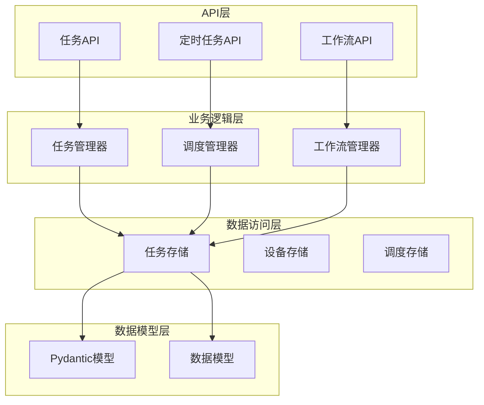
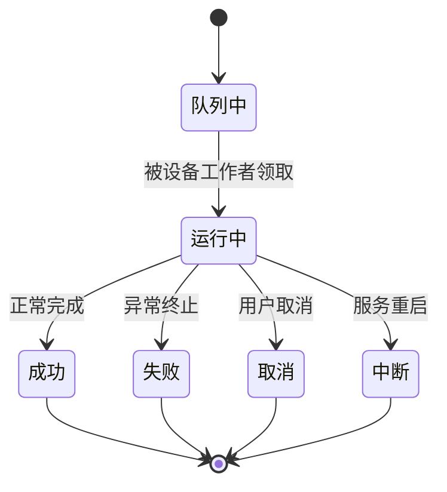
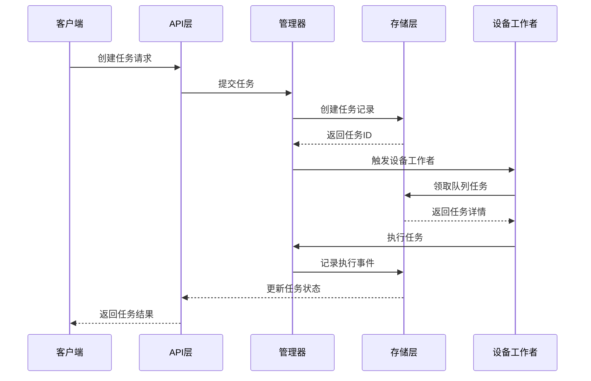
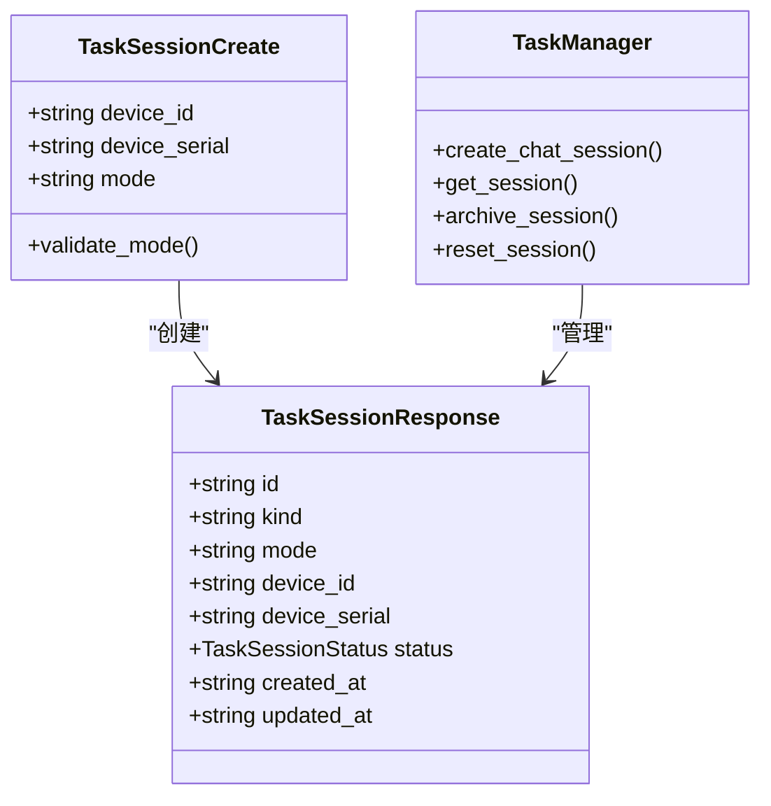
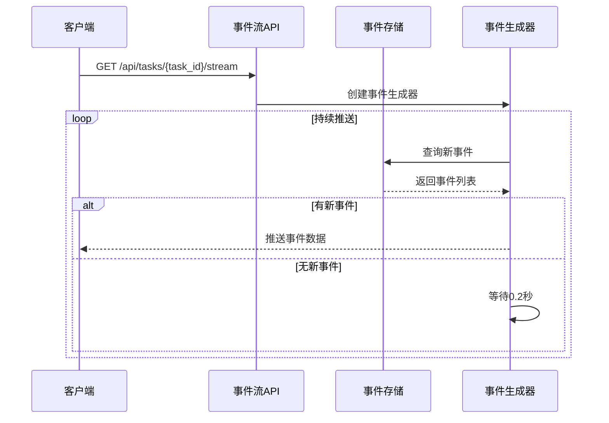
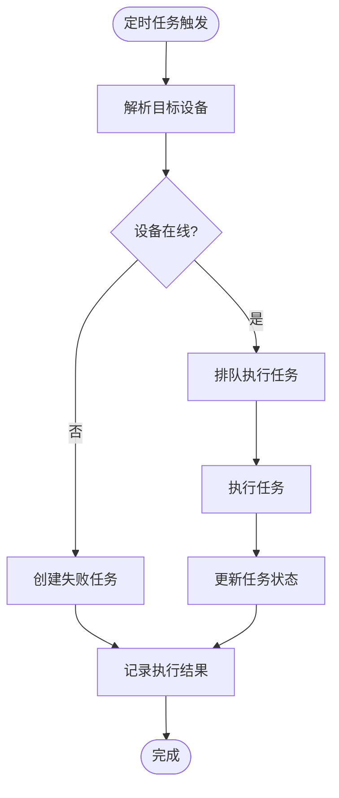
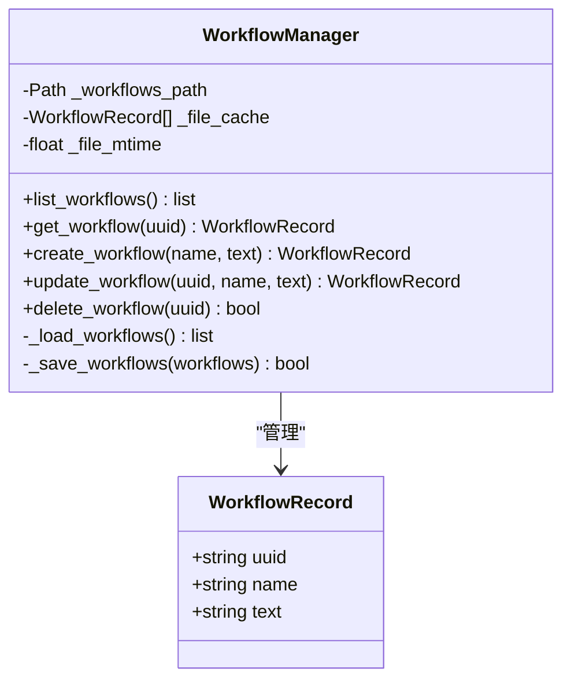
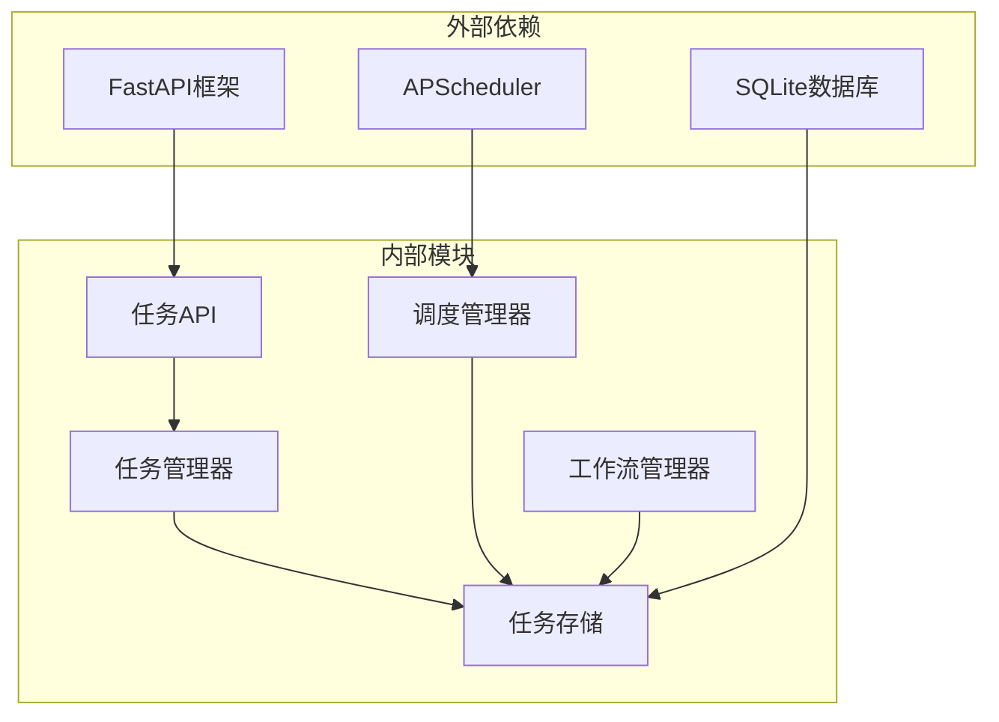

# 任务管理API

<cite>
**本文档引用的文件**
- [AutoGLM_GUI/api/tasks.py](file://AutoGLM_GUI/api/tasks.py)
- [AutoGLM_GUI/api/scheduled_tasks.py](file://AutoGLM_GUI/api/scheduled_tasks.py)
- [AutoGLM_GUI/api/workflows.py](file://AutoGLM_GUI/api/workflows.py)
- [AutoGLM_GUI/task_manager.py](file://AutoGLM_GUI/task_manager.py)
- [AutoGLM_GUI/task_store.py](file://AutoGLM_GUI/task_store.py)
- [AutoGLM_GUI/scheduler_manager.py](file://AutoGLM_GUI/scheduler_manager.py)
- [AutoGLM_GUI/workflow_manager.py](file://AutoGLM_GUI/workflow_manager.py)
- [AutoGLM_GUI/models/scheduled_task.py](file://AutoGLM_GUI/models/scheduled_task.py)
- [AutoGLM_GUI/schemas.py](file://AutoGLM_GUI/schemas.py)
- [tests/test_tasks_api.py](file://tests/test_tasks_api.py)
- [tests/test_scheduler_manager.py](file://tests/test_scheduler_manager.py)
- [tests/test_task_manager.py](file://tests/test_task_manager.py)
</cite>

## 目录
1. [简介](#简介)
2. [项目结构](#项目结构)
3. [核心组件](#核心组件)
4. [架构概览](#架构概览)
5. [详细组件分析](#详细组件分析)
6. [依赖关系分析](#依赖关系分析)
7. [性能考虑](#性能考虑)
8. [故障排除指南](#故障排除指南)
9. [结论](#结论)

## 简介

任务管理API是AutoGLM GUI项目的核心组件，负责管理设备上的自动化任务执行。该系统提供了完整的任务生命周期管理，包括任务创建、执行、监控和管理功能。系统支持多种执行模式（经典模式和分层模式），具备任务队列管理、并发控制、重试机制和失败处理能力。

主要功能特性：
- 实时任务状态跟踪和进度报告
- 任务会话管理和上下文保持
- 支持图片附件和经验报告
- 定时任务调度和执行
- 任务取消和中断机制
- 详细的事件流和SSE实时推送

## 项目结构

任务管理系统采用分层架构设计，主要包含以下核心模块：

**图表来源**
- [AutoGLM_GUI/api/tasks.py:1-365](file://AutoGLM_GUI/api/tasks.py#L1-L365)
- [AutoGLM_GUI/task_manager.py:1-800](file://AutoGLM_GUI/task_manager.py#L1-L800)
- [AutoGLM_GUI/task_store.py:1-800](file://AutoGLM_GUI/task_store.py#L1-L800)

**章节来源**
- [AutoGLM_GUI/api/tasks.py:1-365](file://AutoGLM_GUI/api/tasks.py#L1-L365)
- [AutoGLM_GUI/task_manager.py:1-800](file://AutoGLM_GUI/task_manager.py#L1-L800)
- [AutoGLM_GUI/task_store.py:1-800](file://AutoGLM_GUI/task_store.py#L1-L800)

## 核心组件

### 任务状态管理

系统定义了完整的任务状态生命周期：

**图表来源**
- [AutoGLM_GUI/task_store.py:21-40](file://AutoGLM_GUI/task_store.py#L21-L40)

### 任务执行器

系统支持多种执行器类型：

| 执行器类型 | 描述 | 使用场景 |
|-----------|------|----------|
| classic_chat | 经典聊天执行器 | 标准对话任务 |
| layered_chat | 分层聊天执行器 | 复杂多步骤任务 |
| experience_report | 经验报告执行器 | 体验分析报告生成 |
| scheduled_workflow | 定时工作流执行器 | 计划性任务执行 |

**章节来源**
- [AutoGLM_GUI/task_manager.py:49-55](file://AutoGLM_GUI/task_manager.py#L49-L55)
- [AutoGLM_GUI/task_store.py:21-40](file://AutoGLM_GUI/task_store.py#L21-L40)

## 架构概览

任务管理系统的整体架构采用异步事件驱动模式：

**图表来源**
- [AutoGLM_GUI/api/tasks.py:214-231](file://AutoGLM_GUI/api/tasks.py#L214-L231)
- [AutoGLM_GUI/task_manager.py:615-645](file://AutoGLM_GUI/task_manager.py#L615-L645)
- [AutoGLM_GUI/task_store.py:445-520](file://AutoGLM_GUI/task_store.py#L445-L520)

## 详细组件分析

### 任务API接口

#### 任务会话管理

任务会话是任务执行的上下文容器，支持两种模式：

**经典模式（classic）**：标准对话模式，适合简单任务
**分层模式（layered）**：复杂推理模式，支持多轮对话和思考过程

**图表来源**
- [AutoGLM_GUI/schemas.py:801-834](file://AutoGLM_GUI/schemas.py#L801-L834)
- [AutoGLM_GUI/task_manager.py:89-140](file://AutoGLM_GUI/task_manager.py#L89-L140)

#### 任务提交和执行

任务提交支持多种输入格式：

**基础文本任务**：纯文本指令
**图片附件任务**：支持最多3张图片，总大小不超过12MB
**经验执行任务**：基于预设计划的体验分析任务

**章节来源**
- [AutoGLM_GUI/api/tasks.py:214-231](file://AutoGLM_GUI/api/tasks.py#L214-L231)
- [AutoGLM_GUI/schemas.py:940-969](file://AutoGLM_GUI/schemas.py#L940-L969)

### 任务状态跟踪

#### 实时事件流

系统提供Server-Sent Events (SSE) 实时推送任务执行状态：

**图表来源**
- [AutoGLM_GUI/api/tasks.py:300-341](file://AutoGLM_GUI/api/tasks.py#L300-L341)

#### 任务事件类型

系统支持多种事件类型：

| 事件类型 | 描述 | 数据结构 |
|---------|------|----------|
| user_message | 用户消息 | 包含消息内容和附件 |
| status | 状态变更 | 新状态和时间戳 |
| step | 执行步骤 | 步骤编号和详细信息 |
| done | 任务完成 | 结果和统计信息 |
| error | 错误信息 | 错误描述和堆栈信息 |
| takeover | 任务接管 | 接管状态和说明 |

**章节来源**
- [AutoGLM_GUI/api/tasks.py:309-331](file://AutoGLM_GUI/api/tasks.py#L309-L331)
- [AutoGLM_GUI/task_store.py:597-622](file://AutoGLM_GUI/task_store.py#L597-L622)

### 定时任务管理

#### 调度系统架构

**图表来源**
- [AutoGLM_GUI/scheduler_manager.py:355-467](file://AutoGLM_GUI/scheduler_manager.py#L355-L467)

#### Cron表达式支持

定时任务支持标准Cron表达式格式：
- 分钟（0-59）
- 小时（0-23）  
- 日期（1-31）
- 月份（1-12）
- 星期（0-6）

**章节来源**
- [AutoGLM_GUI/scheduler_manager.py:156-181](file://AutoGLM_GUI/scheduler_manager.py#L156-L181)
- [AutoGLM_GUI/models/scheduled_task.py:1062-1081](file://AutoGLM_GUI/models/scheduled_task.py#L1062-L1081)

### 工作流管理

#### 工作流持久化

工作流采用JSON文件持久化，支持原子写入和缓存机制：

**图表来源**
- [AutoGLM_GUI/workflow_manager.py:33-196](file://AutoGLM_GUI/workflow_manager.py#L33-L196)

**章节来源**
- [AutoGLM_GUI/workflow_manager.py:135-192](file://AutoGLM_GUI/workflow_manager.py#L135-L192)

## 依赖关系分析

### 组件耦合度

**图表来源**
- [AutoGLM_GUI/api/tasks.py:9-33](file://AutoGLM_GUI/api/tasks.py#L9-L33)
- [AutoGLM_GUI/scheduler_manager.py:13-20](file://AutoGLM_GUI/scheduler_manager.py#L13-L20)

### 数据一致性保证

系统通过以下机制确保数据一致性：

1. **事务性操作**：所有数据库操作都在事务中执行
2. **锁机制**：使用线程锁防止并发冲突
3. **原子写入**：文件操作采用临时文件+重命名的方式
4. **状态验证**：执行前验证任务状态的合法性

**章节来源**
- [AutoGLM_GUI/task_store.py:57-80](file://AutoGLM_GUI/task_store.py#L57-L80)
- [AutoGLM_GUI/workflow_manager.py:171-191](file://AutoGLM_GUI/workflow_manager.py#L171-L191)

## 性能考虑

### 并发控制策略

系统采用设备级别的并发控制：

- **设备隔离**：每个设备拥有独立的任务队列
- **FIFO原则**：同设备内任务按先进先出执行
- **并行执行**：不同设备间任务并行执行
- **资源限制**：通过信号量控制特定任务类型的并发度

### 性能优化建议

1. **合理设置执行器**：根据任务复杂度选择合适的执行器类型
2. **批量操作**：对于大量相似任务，考虑使用定时任务批量执行
3. **监控指标**：利用SSE实时监控任务执行状态
4. **资源管理**：及时清理已完成任务的历史数据

## 故障排除指南

### 常见问题诊断

#### 任务无法取消

**症状**：调用取消接口后任务状态未改变
**原因**：任务可能已处于终端状态或正在执行中
**解决方案**：检查任务当前状态，等待执行完成后再尝试

#### 任务长时间无响应

**症状**：任务状态长时间保持运行中
**原因**：设备忙或执行器阻塞
**解决方案**：检查设备状态，查看执行器日志

#### 事件流连接中断

**症状**：SSE连接频繁断开
**原因**：网络不稳定或客户端超时
**解决方案**：检查网络连接，适当增加客户端重连机制

**章节来源**
- [tests/test_task_manager.py:89-143](file://tests/test_task_manager.py#L89-L143)
- [tests/test_scheduler_manager.py:73-109](file://tests/test_scheduler_manager.py#L73-L109)

### 调试工具

系统提供了完善的调试和监控功能：

1. **日志记录**：详细的执行日志和错误信息
2. **性能指标**：任务执行时间和资源使用情况
3. **状态查询**：实时查询任务执行状态
4. **事件追踪**：完整的任务执行事件记录

**章节来源**
- [AutoGLM_GUI/task_manager.py:615-645](file://AutoGLM_GUI/task_manager.py#L615-L645)
- [AutoGLM_GUI/task_store.py:597-622](file://AutoGLM_GUI/task_store.py#L597-L622)

## 结论

任务管理API提供了完整的企业级任务执行和管理解决方案。系统具有以下优势：

1. **高可靠性**：完善的错误处理和恢复机制
2. **高性能**：异步架构和并发控制优化
3. **易扩展**：模块化设计支持功能扩展
4. **可观测性**：全面的日志和监控能力
5. **易用性**：清晰的API设计和丰富的客户端支持

该系统适用于各种复杂的自动化任务场景，能够满足从简单脚本执行到复杂工作流编排的各种需求。通过合理的配置和使用，可以构建高效稳定的自动化任务执行平台。