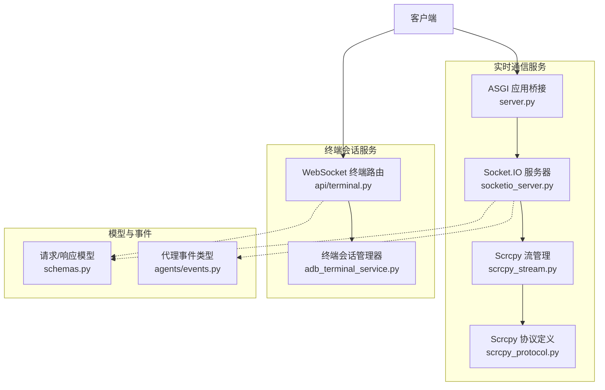
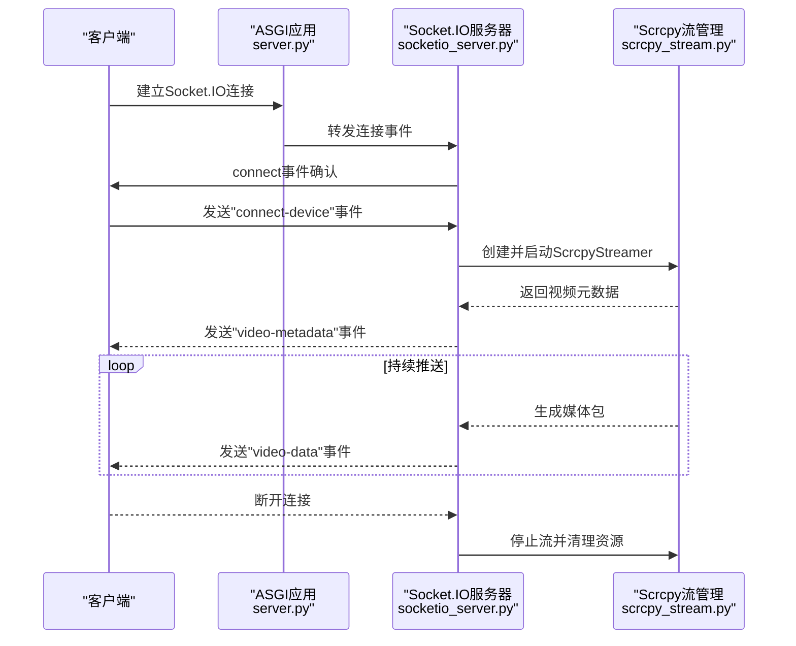
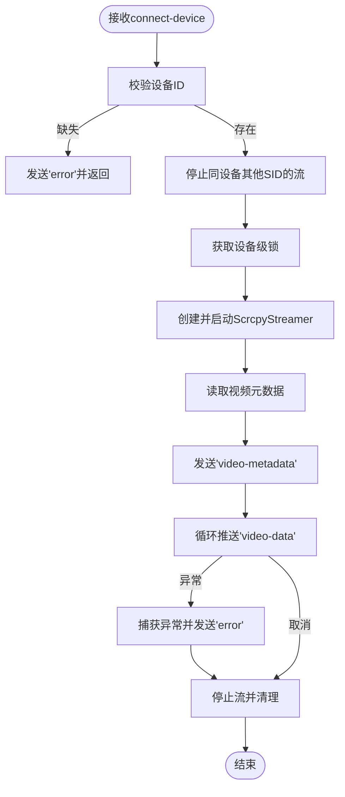
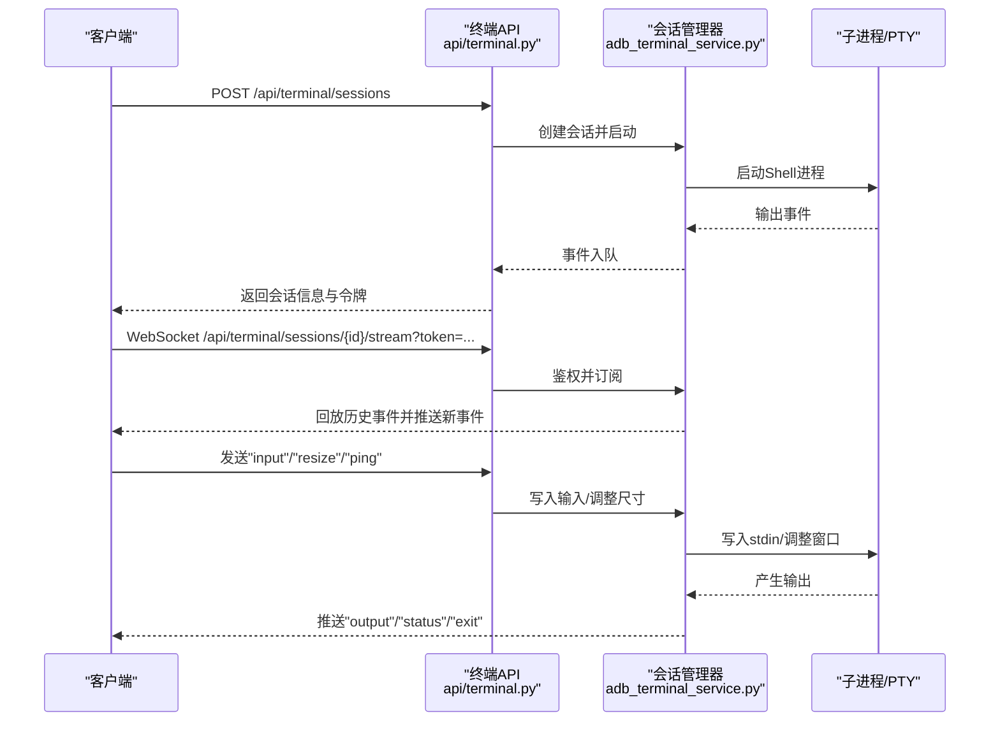
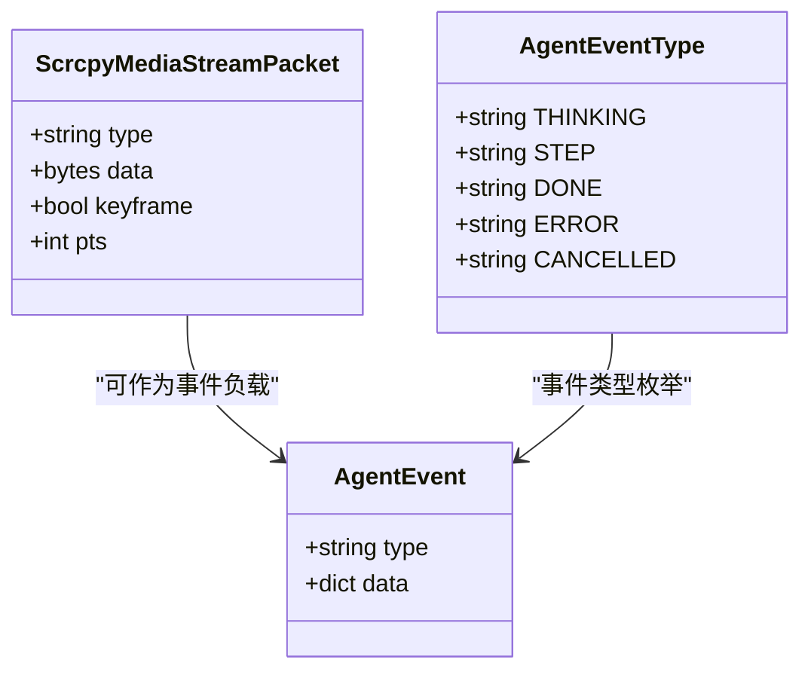
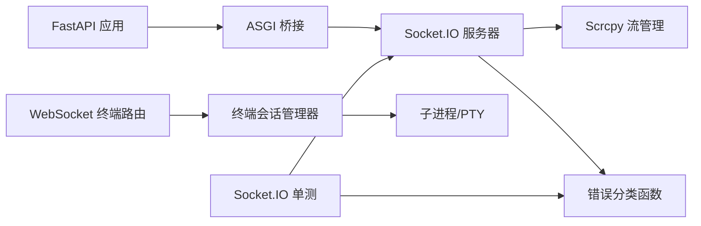

# 实时通信API

<cite>
**本文档引用的文件**
- [socketio_server.py](file://AutoGLM_GUI/socketio_server.py)
- [server.py](file://AutoGLM_GUI/server.py)
- [scrcpy_stream.py](file://AutoGLM_GUI/scrcpy_stream.py)
- [scrcpy_protocol.py](file://AutoGLM_GUI/scrcpy_protocol.py)
- [adb_terminal_service.py](file://AutoGLM_GUI/adb_terminal_service.py)
- [api/terminal.py](file://AutoGLM_GUI/api/terminal.py)
- [schemas.py](file://AutoGLM_GUI/schemas.py)
- [agents/events.py](file://AutoGLM_GUI/agents/events.py)
- [test_socketio_server.py](file://tests/test_socketio_server.py)
</cite>

## 目录
1. [简介](#简介)
2. [项目结构](#项目结构)
3. [核心组件](#核心组件)
4. [架构总览](#架构总览)
5. [详细组件分析](#详细组件分析)
6. [依赖关系分析](#依赖关系分析)
7. [性能考虑](#性能考虑)
8. [故障排除指南](#故障排除指南)
9. [结论](#结论)
10. [附录](#附录)

## 简介
本文件为实时通信API的综合技术文档，覆盖基于Socket.IO的视频流传输、基于WebSocket的ADB终端会话、设备状态与事件推送等实时能力。文档详细说明了连接建立、消息格式、事件类型、状态管理与错误处理流程，并提供客户端接入示例、消息订阅与断线重连建议、安全机制、连接池管理与性能优化策略，以及多客户端并发、消息去重与有序传输的技术实现要点。

## 项目结构
实时通信相关的核心模块分布如下：
- Socket.IO视频流服务：负责Scrcpy视频流的建立、维护与推送
- ASGI应用桥接：将FastAPI与Socket.IO整合为单一ASGI应用
- 终端会话服务：提供基于WebSocket的交互式Shell会话
- 协议与数据模型：定义视频帧包、事件类型与请求/响应模型
- 测试用例：覆盖Socket.IO流控制、错误分类与清理逻辑

**图表来源**
- [socketio_server.py:1-215](file://AutoGLM_GUI/socketio_server.py#L1-L215)
- [server.py:1-13](file://AutoGLM_GUI/server.py#L1-L13)
- [scrcpy_stream.py:1-629](file://AutoGLM_GUI/scrcpy_stream.py#L1-L629)
- [scrcpy_protocol.py:1-46](file://AutoGLM_GUI/scrcpy_protocol.py#L1-L46)
- [api/terminal.py:1-272](file://AutoGLM_GUI/api/terminal.py#L1-L272)
- [adb_terminal_service.py:1-572](file://AutoGLM_GUI/adb_terminal_service.py#L1-L572)
- [schemas.py:1-800](file://AutoGLM_GUI/schemas.py#L1-L800)
- [agents/events.py:1-20](file://AutoGLM_GUI/agents/events.py#L1-L20)

**章节来源**
- [socketio_server.py:1-215](file://AutoGLM_GUI/socketio_server.py#L1-L215)
- [server.py:1-13](file://AutoGLM_GUI/server.py#L1-L13)
- [api/terminal.py:1-272](file://AutoGLM_GUI/api/terminal.py#L1-L272)
- [adb_terminal_service.py:1-572](file://AutoGLM_GUI/adb_terminal_service.py#L1-L572)
- [scrcpy_stream.py:1-629](file://AutoGLM_GUI/scrcpy_stream.py#L1-L629)
- [scrcpy_protocol.py:1-46](file://AutoGLM_GUI/scrcpy_protocol.py#L1-L46)
- [schemas.py:1-800](file://AutoGLM_GUI/schemas.py#L1-L800)
- [agents/events.py:1-20](file://AutoGLM_GUI/agents/events.py#L1-L20)

## 核心组件
- Socket.IO视频流服务：提供视频元数据与媒体数据的实时推送，支持设备级互斥连接与错误分类上报
- ASGI桥接：将FastAPI应用与Socket.IO集成，统一暴露在统一路径下
- Scrcpy流管理：封装ADB端口转发、服务启动、TCP连接与媒体包解析
- WebSocket终端会话：提供双向交互式Shell，支持输出缓冲、背压与会话令牌鉴权
- 模型与事件：定义视频帧包结构、代理事件类型与通用请求/响应模型

**章节来源**
- [socketio_server.py:1-215](file://AutoGLM_GUI/socketio_server.py#L1-L215)
- [server.py:1-13](file://AutoGLM_GUI/server.py#L1-L13)
- [scrcpy_stream.py:1-629](file://AutoGLM_GUI/scrcpy_stream.py#L1-L629)
- [scrcpy_protocol.py:1-46](file://AutoGLM_GUI/scrcpy_protocol.py#L1-L46)
- [api/terminal.py:1-272](file://AutoGLM_GUI/api/terminal.py#L1-L272)
- [adb_terminal_service.py:1-572](file://AutoGLM_GUI/adb_terminal_service.py#L1-L572)
- [schemas.py:1-800](file://AutoGLM_GUI/schemas.py#L1-L800)
- [agents/events.py:1-20](file://AutoGLM_GUI/agents/events.py#L1-L20)

## 架构总览
实时通信采用双通道设计：
- Socket.IO通道：用于Scrcpy视频流的高吞吐实时传输
- WebSocket通道：用于ADB终端会话的双向交互

**图表来源**
- [server.py:1-13](file://AutoGLM_GUI/server.py#L1-L13)
- [socketio_server.py:137-215](file://AutoGLM_GUI/socketio_server.py#L137-L215)
- [scrcpy_stream.py:573-629](file://AutoGLM_GUI/scrcpy_stream.py#L573-L629)

**章节来源**
- [server.py:1-13](file://AutoGLM_GUI/server.py#L1-L13)
- [socketio_server.py:137-215](file://AutoGLM_GUI/socketio_server.py#L137-L215)
- [scrcpy_stream.py:573-629](file://AutoGLM_GUI/scrcpy_stream.py#L573-L629)

## 详细组件分析

### Socket.IO视频流组件
- 事件与消息格式
  - 客户端连接/断开：connect/disconnect
  - 主动事件："connect-device"（携带设备ID、分辨率、码率等参数）
  - 推送事件："video-metadata"（设备名、宽、高、编解码）、"video-data"（类型、数据、时间戳、关键帧标志、PTS）
  - 错误事件："error"（统一错误分类与技术细节）
- 连接与状态管理
  - 设备级锁：防止同一设备被多个连接同时占用
  - 并发替换：新连接会停止旧连接的流
  - 清理：断开或异常时取消任务并停止流
- 错误分类
  - 端口冲突、设备离线、超时、连接失败等场景均有明确分类与用户提示

**图表来源**
- [socketio_server.py:148-215](file://AutoGLM_GUI/socketio_server.py#L148-L215)
- [scrcpy_stream.py:203-245](file://AutoGLM_GUI/scrcpy_stream.py#L203-L245)

**章节来源**
- [socketio_server.py:1-215](file://AutoGLM_GUI/socketio_server.py#L1-L215)
- [scrcpy_stream.py:1-629](file://AutoGLM_GUI/scrcpy_stream.py#L1-L629)
- [scrcpy_protocol.py:23-46](file://AutoGLM_GUI/scrcpy_protocol.py#L23-L46)

### WebSocket终端会话组件
- 路由与鉴权
  - 创建会话：POST /api/terminal/sessions（本地回环默认可用，可通过环境变量启用跨主机）
  - 查询/关闭会话：GET/DELETE /api/terminal/sessions/{session_id}
  - 流式传输：WebSocket /api/terminal/sessions/{session_id}/stream（需有效会话令牌）
- 会话生命周期
  - 令牌鉴权：基于哈希对比，确保会话访问安全
  - 输出缓冲：固定大小队列与字节上限，超过阈值触发关闭
  - 背压：订阅者队列满时丢弃，避免内存膨胀
- 消息类型
  - 输入："input"（写入命令）、"resize"（调整终端尺寸）、"ping"/"pong"（心跳）
  - 输出："status"（状态变更）、"output"（标准输出）、"exit"（进程退出码）、"error"（错误）

**图表来源**
- [api/terminal.py:111-272](file://AutoGLM_GUI/api/terminal.py#L111-L272)
- [adb_terminal_service.py:117-572](file://AutoGLM_GUI/adb_terminal_service.py#L117-L572)

**章节来源**
- [api/terminal.py:1-272](file://AutoGLM_GUI/api/terminal.py#L1-L272)
- [adb_terminal_service.py:1-572](file://AutoGLM_GUI/adb_terminal_service.py#L1-L572)

### 数据模型与事件类型
- 视频帧包模型：包含类型、数据、时间戳、关键帧标志与PTS
- 代理事件类型：think、step、done、error、cancelled（统一事件载体）
- 其他API模型：设备、任务、历史、工作流等（用于状态推送与SSE场景）

**图表来源**
- [scrcpy_protocol.py:31-46](file://AutoGLM_GUI/scrcpy_protocol.py#L31-L46)
- [agents/events.py:5-20](file://AutoGLM_GUI/agents/events.py#L5-L20)

**章节来源**
- [scrcpy_protocol.py:1-46](file://AutoGLM_GUI/scrcpy_protocol.py#L1-L46)
- [agents/events.py:1-20](file://AutoGLM_GUI/agents/events.py#L1-L20)
- [schemas.py:1-800](file://AutoGLM_GUI/schemas.py#L1-L800)

## 依赖关系分析
- Socket.IO服务依赖Scrcpy流管理模块进行设备连接、端口转发与媒体包解析
- ASGI桥接将FastAPI与Socket.IO整合，统一对外提供HTTP与WebSocket服务
- 终端会话服务通过会话管理器与子进程交互，提供稳定的Shell体验
- 错误分类函数与测试用例共同保证异常场景的可预期行为

**图表来源**
- [server.py:1-13](file://AutoGLM_GUI/server.py#L1-L13)
- [socketio_server.py:1-215](file://AutoGLM_GUI/socketio_server.py#L1-L215)
- [scrcpy_stream.py:1-629](file://AutoGLM_GUI/scrcpy_stream.py#L1-L629)
- [api/terminal.py:1-272](file://AutoGLM_GUI/api/terminal.py#L1-L272)
- [adb_terminal_service.py:1-572](file://AutoGLM_GUI/adb_terminal_service.py#L1-L572)
- [test_socketio_server.py:1-340](file://tests/test_socketio_server.py#L1-L340)

**章节来源**
- [server.py:1-13](file://AutoGLM_GUI/server.py#L1-L13)
- [socketio_server.py:1-215](file://AutoGLM_GUI/socketio_server.py#L1-L215)
- [scrcpy_stream.py:1-629](file://AutoGLM_GUI/scrcpy_stream.py#L1-L629)
- [api/terminal.py:1-272](file://AutoGLM_GUI/api/terminal.py#L1-L272)
- [adb_terminal_service.py:1-572](file://AutoGLM_GUI/adb_terminal_service.py#L1-L572)
- [test_socketio_server.py:1-340](file://tests/test_socketio_server.py#L1-L340)

## 性能考虑
- 视频流
  - 设备级锁避免并发抢占，减少资源竞争
  - 异步迭代媒体包并通过Socket.IO直接推送，降低中间层开销
  - 媒体包包含关键帧与PTS信息，便于播放端进行解码与同步
- 终端会话
  - 输出缓冲限制与字节上限控制内存占用
  - 订阅者队列满时丢弃，避免阻塞生产者
  - 令牌鉴权与CORS白名单限制访问源，降低无效连接压力
- 连接与资源
  - 断开即清理：取消任务、停止流、关闭套接字与端口转发
  - Scrcpy启动具备重试与端口释放等待，提升稳定性

[本节为通用性能指导，不涉及具体文件分析]

## 故障排除指南
- 视频流常见问题
  - 端口冲突：系统提示端口占用，通常可自动解决；若持续出现，重启应用或检查其他实例
  - 设备离线：检查USB/Wi-Fi连接状态
  - 超时：检查网络与设备连接，重试
  - 连接失败：检查设备连接与权限
- 终端会话常见问题
  - 令牌无效：重新创建会话获取新令牌
  - 跨域拒绝：确认允许的Origin或在本地回环使用
  - 会话输出过多：达到上限后自动关闭，检查命令输出或缩短会话时长
- 单元测试参考
  - 错误分类、流清理、事件发射与取消传播等均有测试覆盖，可据此定位问题

**章节来源**
- [socketio_server.py:50-87](file://AutoGLM_GUI/socketio_server.py#L50-L87)
- [api/terminal.py:68-109](file://AutoGLM_GUI/api/terminal.py#L68-L109)
- [test_socketio_server.py:43-98](file://tests/test_socketio_server.py#L43-L98)

## 结论
该实时通信API通过Socket.IO与WebSocket实现了高可靠、低延迟的视频流与终端会话能力。通过设备级锁、异步流推送、令牌鉴权与严格的错误分类，系统在多客户端并发场景下保持稳定。配合缓冲与背压策略，终端会话在高输出场景下也能维持可控的资源占用。建议在生产环境中结合CORS白名单、令牌鉴权与监控告警，进一步强化安全性与可观测性。

[本节为总结性内容，不涉及具体文件分析]

## 附录

### API与事件清单
- Socket.IO事件
  - 客户端事件：connect、disconnect、connect-device
  - 服务端事件：video-metadata、video-data、error
- WebSocket终端事件
  - 客户端发送：input、resize、ping
  - 服务端推送：status、output、exit、error、pong

**章节来源**
- [socketio_server.py:137-215](file://AutoGLM_GUI/socketio_server.py#L137-L215)
- [api/terminal.py:181-272](file://AutoGLM_GUI/api/terminal.py#L181-L272)

### 客户端接入与断线重连建议
- Socket.IO
  - 建议监听"error"事件并根据错误类型进行重试或提示
  - 在页面卸载前主动断开，避免资源泄露
- WebSocket终端
  - 建议在收到"exit"或"error"后重建会话
  - 使用心跳"ping"/"pong"维持连接活性

**章节来源**
- [socketio_server.py:111-122](file://AutoGLM_GUI/socketio_server.py#L111-L122)
- [api/terminal.py:245-272](file://AutoGLM_GUI/api/terminal.py#L245-L272)