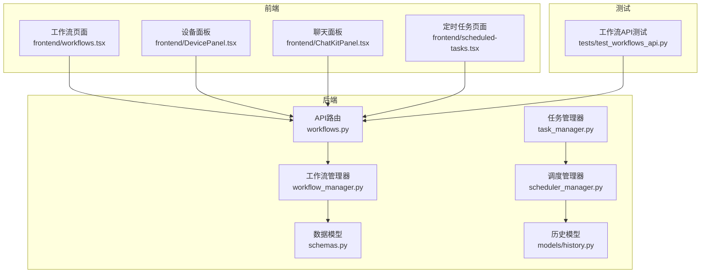
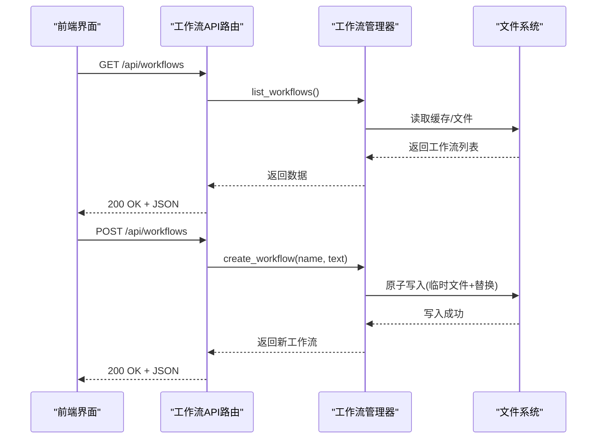
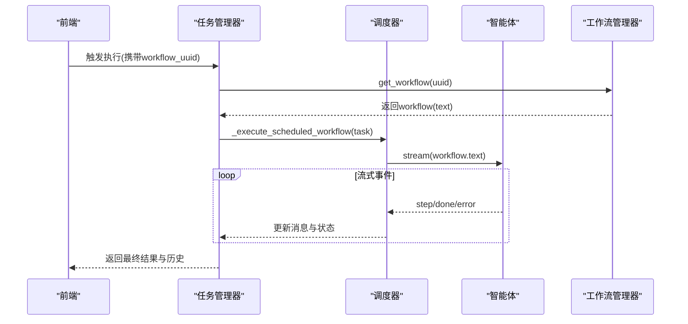
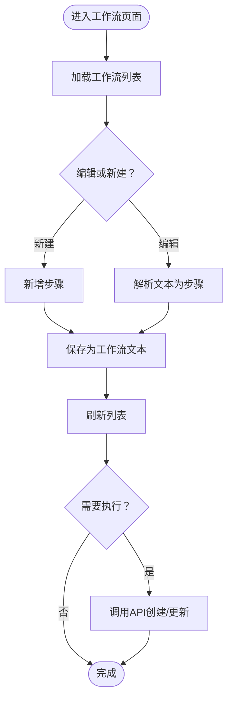
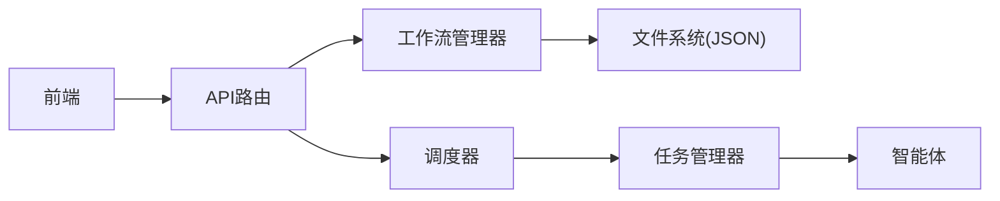

# 工作流API

<cite>
**本文档引用的文件**
- [AutoGLM_GUI/api/workflows.py](file://AutoGLM_GUI/api/workflows.py)
- [AutoGLM_GUI/workflow_manager.py](file://AutoGLM_GUI/workflow_manager.py)
- [AutoGLM_GUI/schemas.py](file://AutoGLM_GUI/schemas.py)
- [AutoGLM_GUI/models/history.py](file://AutoGLM_GUI/models/history.py)
- [AutoGLM_GUI/scheduler_manager.py](file://AutoGLM_GUI/scheduler_manager.py)
- [AutoGLM_GUI/task_manager.py](file://AutoGLM_GUI/task_manager.py)
- [tests/test_workflows_api.py](file://tests/test_workflows_api.py)
- [frontend/src/routes/workflows.tsx](file://frontend/src/routes/workflows.tsx)
- [frontend/src/components/DevicePanel.tsx](file://frontend/src/components/DevicePanel.tsx)
- [frontend/src/components/ChatKitPanel.tsx](file://frontend/src/components/ChatKitPanel.tsx)
- [frontend/src/routes/scheduled-tasks.tsx](file://frontend/src/routes/scheduled-tasks.tsx)
- [docs/docs/features/workflow.md](file://docs/docs/features/workflow.md)
</cite>

## 目录
1. [简介](#简介)
2. [项目结构](#项目结构)
3. [核心组件](#核心组件)
4. [架构总览](#架构总览)
5. [详细组件分析](#详细组件分析)
6. [依赖关系分析](#依赖关系分析)
7. [性能考虑](#性能考虑)
8. [故障排除指南](#故障排除指南)
9. [结论](#结论)
10. [附录](#附录)

## 简介
本文件为工作流API的全面技术文档，覆盖工作流的定义、创建、查询、更新、删除等REST接口；工作流图的构建方法、节点类型、连接关系与执行逻辑；复杂工作流设计模式（并行、条件分支、循环）、异常处理策略；以及工作流状态管理、执行历史与性能监控的API使用方法。同时提供工作流版本控制、模板复用与最佳实践建议。

## 项目结构
工作流功能由后端FastAPI路由、工作流管理器与前端界面三部分组成：
- 后端API路由：提供工作流的CRUD接口
- 工作流管理器：负责数据持久化、缓存与原子写入
- 前端界面：提供工作流编辑、执行与调度入口
- 测试用例：验证API契约与错误处理
- 文档：用户使用指南

**图表来源**
- [AutoGLM_GUI/api/workflows.py:1-74](file://AutoGLM_GUI/api/workflows.py#L1-L74)
- [AutoGLM_GUI/workflow_manager.py:1-196](file://AutoGLM_GUI/workflow_manager.py#L1-L196)
- [AutoGLM_GUI/schemas.py:570-620](file://AutoGLM_GUI/schemas.py#L570-L620)
- [AutoGLM_GUI/models/history.py:164-275](file://AutoGLM_GUI/models/history.py#L164-L275)
- [AutoGLM_GUI/scheduler_manager.py:230-266](file://AutoGLM_GUI/scheduler_manager.py#L230-L266)
- [AutoGLM_GUI/task_manager.py:1405-1428](file://AutoGLM_GUI/task_manager.py#L1405-L1428)
- [frontend/src/routes/workflows.tsx:1-390](file://frontend/src/routes/workflows.tsx#L1-L390)
- [frontend/src/components/DevicePanel.tsx:1409-1438](file://frontend/src/components/DevicePanel.tsx#L1409-L1438)
- [frontend/src/components/ChatKitPanel.tsx:365-493](file://frontend/src/components/ChatKitPanel.tsx#L365-L493)
- [frontend/src/routes/scheduled-tasks.tsx:474-502](file://frontend/src/routes/scheduled-tasks.tsx#L474-L502)
- [tests/test_workflows_api.py:1-156](file://tests/test_workflows_api.py#L1-L156)

**章节来源**
- [AutoGLM_GUI/api/workflows.py:1-74](file://AutoGLM_GUI/api/workflows.py#L1-L74)
- [AutoGLM_GUI/workflow_manager.py:1-196](file://AutoGLM_GUI/workflow_manager.py#L1-L196)
- [AutoGLM_GUI/schemas.py:570-620](file://AutoGLM_GUI/schemas.py#L570-L620)
- [AutoGLM_GUI/models/history.py:164-275](file://AutoGLM_GUI/models/history.py#L164-L275)
- [AutoGLM_GUI/scheduler_manager.py:230-266](file://AutoGLM_GUI/scheduler_manager.py#L230-L266)
- [AutoGLM_GUI/task_manager.py:1405-1428](file://AutoGLM_GUI/task_manager.py#L1405-L1428)
- [frontend/src/routes/workflows.tsx:1-390](file://frontend/src/routes/workflows.tsx#L1-L390)
- [frontend/src/components/DevicePanel.tsx:1409-1438](file://frontend/src/components/DevicePanel.tsx#L1409-L1438)
- [frontend/src/components/ChatKitPanel.tsx:365-493](file://frontend/src/components/ChatKitPanel.tsx#L365-L493)
- [frontend/src/routes/scheduled-tasks.tsx:474-502](file://frontend/src/routes/scheduled-tasks.tsx#L474-L502)
- [tests/test_workflows_api.py:1-156](file://tests/test_workflows_api.py#L1-L156)

## 核心组件
- 工作流API路由：提供列出、查询、创建、更新、删除工作流的标准REST接口
- 工作流管理器：单例模式，基于JSON文件持久化，支持mtime缓存与原子写入
- 数据模型：定义工作流的请求/响应结构与字段校验规则
- 历史模型：记录对话与执行过程中的消息、计时与追踪信息
- 调度与任务执行：通过调度器与任务管理器将工作流文本交给智能体执行
- 前端界面：工作流编辑、快速执行、定时任务绑定与历史查看

**章节来源**
- [AutoGLM_GUI/api/workflows.py:17-74](file://AutoGLM_GUI/api/workflows.py#L17-L74)
- [AutoGLM_GUI/workflow_manager.py:33-196](file://AutoGLM_GUI/workflow_manager.py#L33-L196)
- [AutoGLM_GUI/schemas.py:570-620](file://AutoGLM_GUI/schemas.py#L570-L620)
- [AutoGLM_GUI/models/history.py:164-275](file://AutoGLM_GUI/models/history.py#L164-L275)
- [AutoGLM_GUI/scheduler_manager.py:230-266](file://AutoGLM_GUI/scheduler_manager.py#L230-L266)
- [AutoGLM_GUI/task_manager.py:1405-1428](file://AutoGLM_GUI/task_manager.py#L1405-L1428)

## 架构总览
工作流API采用“路由-管理器-模型-持久化”的分层架构。前端通过HTTP调用后端API，后端将请求参数映射到工作流管理器，管理器负责数据读写与缓存，最终返回标准化的响应模型。

**图表来源**
- [AutoGLM_GUI/api/workflows.py:17-74](file://AutoGLM_GUI/api/workflows.py#L17-L74)
- [AutoGLM_GUI/workflow_manager.py:53-196](file://AutoGLM_GUI/workflow_manager.py#L53-L196)

## 详细组件分析

### 工作流API路由
- GET /api/workflows：返回所有工作流列表
- GET /api/workflows/{workflow_uuid}：按UUID返回单个工作流
- POST /api/workflows：创建新工作流
- PUT /api/workflows/{workflow_uuid}：更新工作流
- DELETE /api/workflows/{workflow_uuid}：删除工作流

错误处理：
- 查询不存在的UUID返回404
- 创建失败抛出异常返回500
- Pydantic校验失败返回422

**章节来源**
- [AutoGLM_GUI/api/workflows.py:17-74](file://AutoGLM_GUI/api/workflows.py#L17-L74)
- [tests/test_workflows_api.py:67-156](file://tests/test_workflows_api.py#L67-L156)

### 工作流管理器
职责：
- 单例模式保证全局唯一实例
- JSON文件持久化，路径位于用户主目录下的配置文件
- 基于文件mtime的缓存机制，避免重复解析
- 原子写入：先写临时文件再替换，防止部分写入
- 提供增删改查操作

关键方法：
- list_workflows/get_workflow/create_workflow/update_workflow/delete_workflow
- _load_workflows/_save_workflows

**章节来源**
- [AutoGLM_GUI/workflow_manager.py:33-196](file://AutoGLM_GUI/workflow_manager.py#L33-L196)

### 数据模型与校验
- WorkflowBase：name与text非空校验
- WorkflowCreate/WorkflowUpdate：继承基础模型
- WorkflowResponse：增加uuid字段
- WorkflowListResponse：包含工作流数组

这些模型确保API请求与响应的数据结构一致，并在FastAPI层进行自动校验。

**章节来源**
- [AutoGLM_GUI/schemas.py:570-620](file://AutoGLM_GUI/schemas.py#L570-L620)

### 历史与性能监控
- 历史模型：记录每条对话的开始/结束时间、步骤数、是否成功、错误信息、消息列表、追踪ID与计时汇总
- 性能监控：通过TraceSummaryRecord与StepTimingRecord统计各阶段耗时

这些模型为工作流执行的历史回溯与性能分析提供基础。

**章节来源**
- [AutoGLM_GUI/models/history.py:164-275](file://AutoGLM_GUI/models/history.py#L164-L275)

### 执行逻辑与调度
- 调度器：将工作流文本作为用户输入交由智能体执行，流式接收step/done/error事件
- 任务管理器：封装调度执行流程，包含设备占用释放、取消处理、状态更新等

**图表来源**
- [AutoGLM_GUI/scheduler_manager.py:230-266](file://AutoGLM_GUI/scheduler_manager.py#L230-L266)
- [AutoGLM_GUI/task_manager.py:1405-1428](file://AutoGLM_GUI/task_manager.py#L1405-L1428)
- [AutoGLM_GUI/workflow_manager.py:61-71](file://AutoGLM_GUI/workflow_manager.py#L61-L71)

**章节来源**
- [AutoGLM_GUI/scheduler_manager.py:230-266](file://AutoGLM_GUI/scheduler_manager.py#L230-L266)
- [AutoGLM_GUI/task_manager.py:1405-1428](file://AutoGLM_GUI/task_manager.py#L1405-L1428)

### 前端集成与使用
- 工作流页面：支持新建、编辑、删除、保存；将步骤列表转换为文本存储
- 设备面板：展示可用工作流并支持一键执行
- 聊天面板：支持快速选择工作流文本填入输入框
- 定时任务页面：可选择工作流UUID绑定到计划任务

**图表来源**
- [frontend/src/routes/workflows.tsx:171-314](file://frontend/src/routes/workflows.tsx#L171-L314)
- [frontend/src/components/DevicePanel.tsx:1409-1438](file://frontend/src/components/DevicePanel.tsx#L1409-L1438)
- [frontend/src/components/ChatKitPanel.tsx:365-493](file://frontend/src/components/ChatKitPanel.tsx#L365-L493)
- [frontend/src/routes/scheduled-tasks.tsx:474-502](file://frontend/src/routes/scheduled-tasks.tsx#L474-L502)

**章节来源**
- [frontend/src/routes/workflows.tsx:1-390](file://frontend/src/routes/workflows.tsx#L1-L390)
- [frontend/src/components/DevicePanel.tsx:1409-1438](file://frontend/src/components/DevicePanel.tsx#L1409-L1438)
- [frontend/src/components/ChatKitPanel.tsx:365-493](file://frontend/src/components/ChatKitPanel.tsx#L365-L493)
- [frontend/src/routes/scheduled-tasks.tsx:474-502](file://frontend/src/routes/scheduled-tasks.tsx#L474-L502)

## 依赖关系分析
- API路由依赖工作流管理器进行业务处理
- 工作流管理器依赖文件系统进行持久化
- 调度与任务执行链路依赖智能体与设备管理器
- 前端通过HTTP与后端交互，不直接依赖后端内部实现

**图表来源**
- [AutoGLM_GUI/api/workflows.py:17-74](file://AutoGLM_GUI/api/workflows.py#L17-L74)
- [AutoGLM_GUI/workflow_manager.py:53-196](file://AutoGLM_GUI/workflow_manager.py#L53-L196)
- [AutoGLM_GUI/scheduler_manager.py:230-266](file://AutoGLM_GUI/scheduler_manager.py#L230-L266)
- [AutoGLM_GUI/task_manager.py:1405-1428](file://AutoGLM_GUI/task_manager.py#L1405-L1428)

**章节来源**
- [AutoGLM_GUI/api/workflows.py:17-74](file://AutoGLM_GUI/api/workflows.py#L17-L74)
- [AutoGLM_GUI/workflow_manager.py:53-196](file://AutoGLM_GUI/workflow_manager.py#L53-L196)
- [AutoGLM_GUI/scheduler_manager.py:230-266](file://AutoGLM_GUI/scheduler_manager.py#L230-L266)
- [AutoGLM_GUI/task_manager.py:1405-1428](file://AutoGLM_GUI/task_manager.py#L1405-L1428)

## 性能考虑
- 缓存策略：基于文件mtime的内存缓存减少重复解析开销
- 原子写入：临时文件+替换避免部分写入导致的数据损坏
- 流式执行：调度器以事件流形式推进，降低一次性处理压力
- 计时统计：通过历史模型的计时字段进行性能分析与优化

[本节为通用指导，无需特定文件来源]

## 故障排除指南
常见问题与处理：
- 404未找到：查询UUID不存在或删除后再次访问
- 422校验失败：name或text为空或格式不符合要求
- 500服务器错误：创建工作流时底层存储异常
- 执行失败：设备忙、智能体初始化失败、任务被取消

定位方法：
- 查看后端日志与异常栈
- 使用测试用例验证API行为
- 在前端确认工作流文本格式与步骤解析

**章节来源**
- [tests/test_workflows_api.py:91-156](file://tests/test_workflows_api.py#L91-L156)
- [AutoGLM_GUI/workflow_manager.py:135-196](file://AutoGLM_GUI/workflow_manager.py#L135-L196)

## 结论
工作流API提供了简洁稳定的CRUD接口，配合工作流管理器的持久化与缓存机制，以及前端的可视化编辑与执行入口，形成了完整的从定义到执行的闭环。结合历史与性能模型，可实现对工作流执行过程的可观测性与优化。

[本节为总结，无需特定文件来源]

## 附录

### API定义与使用示例

- 列出工作流
  - 方法：GET
  - 路径：/api/workflows
  - 响应：WorkflowListResponse
  - 示例用途：工作流页面加载

- 获取单个工作流
  - 方法：GET
  - 路径：/api/workflows/{workflow_uuid}
  - 响应：WorkflowResponse
  - 示例用途：编辑或执行前预览

- 创建工作流
  - 方法：POST
  - 路径：/api/workflows
  - 请求体：WorkflowCreate
  - 响应：WorkflowResponse
  - 示例用途：保存常用任务文本

- 更新工作流
  - 方法：PUT
  - 路径：/api/workflows/{workflow_uuid}
  - 请求体：WorkflowUpdate
  - 响应：WorkflowResponse
  - 示例用途：修改任务文本

- 删除工作流
  - 方法：DELETE
  - 路径：/api/workflows/{workflow_uuid}
  - 响应：成功消息
  - 示例用途：清理不再使用的模板

- 执行工作流
  - 方法：通过定时任务或直接触发
  - 输入：workflow_uuid
  - 输出：历史记录与性能指标
  - 示例用途：自动化执行

**章节来源**
- [AutoGLM_GUI/api/workflows.py:17-74](file://AutoGLM_GUI/api/workflows.py#L17-L74)
- [AutoGLM_GUI/schemas.py:570-620](file://AutoGLM_GUI/schemas.py#L570-L620)
- [AutoGLM_GUI/scheduler_manager.py:230-266](file://AutoGLM_GUI/scheduler_manager.py#L230-L266)
- [AutoGLM_GUI/task_manager.py:1405-1428](file://AutoGLM_GUI/task_manager.py#L1405-L1428)

### 工作流图与执行逻辑
- 工作流图构建：前端将步骤列表转换为带编号与描述的文本，后端以纯文本存储
- 节点类型：步骤节点（标题+描述），描述块用于补充说明、验证点等
- 连接关系：顺序连接，支持条件与循环的文本化表达
- 执行逻辑：调度器将工作流文本作为用户输入，智能体以流式事件逐步推进

**章节来源**
- [frontend/src/routes/workflows.tsx:46-169](file://frontend/src/routes/workflows.tsx#L46-L169)
- [AutoGLM_GUI/scheduler_manager.py:230-266](file://AutoGLM_GUI/scheduler_manager.py#L230-L266)

### 复杂工作流设计模式
- 并行执行：通过多个独立工作流或在智能体侧并行处理不同子任务
- 条件判断：在工作流文本中描述条件分支与决策点
- 循环结构：通过重复步骤或外部调度器重试机制实现
- 异常处理：捕获智能体错误事件，记录失败原因并回退

**章节来源**
- [AutoGLM_GUI/scheduler_manager.py:230-266](file://AutoGLM_GUI/scheduler_manager.py#L230-L266)
- [AutoGLM_GUI/task_manager.py:1405-1428](file://AutoGLM_GUI/task_manager.py#L1405-L1428)

### 版本控制、模板复用与最佳实践
- 版本控制：当前实现为简单文本存储，建议在上层引入版本号字段或分支策略
- 模板复用：通过工作流列表与前端选择器实现模板复用
- 最佳实践：
  - 步骤命名清晰、描述完整
  - 将验证点与预期输出显式写出
  - 使用定时任务进行周期性执行
  - 关注历史与性能指标，持续优化

**章节来源**
- [docs/docs/features/workflow.md:1-32](file://docs/docs/features/workflow.md#L1-L32)
- [frontend/src/routes/scheduled-tasks.tsx:474-502](file://frontend/src/routes/scheduled-tasks.tsx#L474-L502)