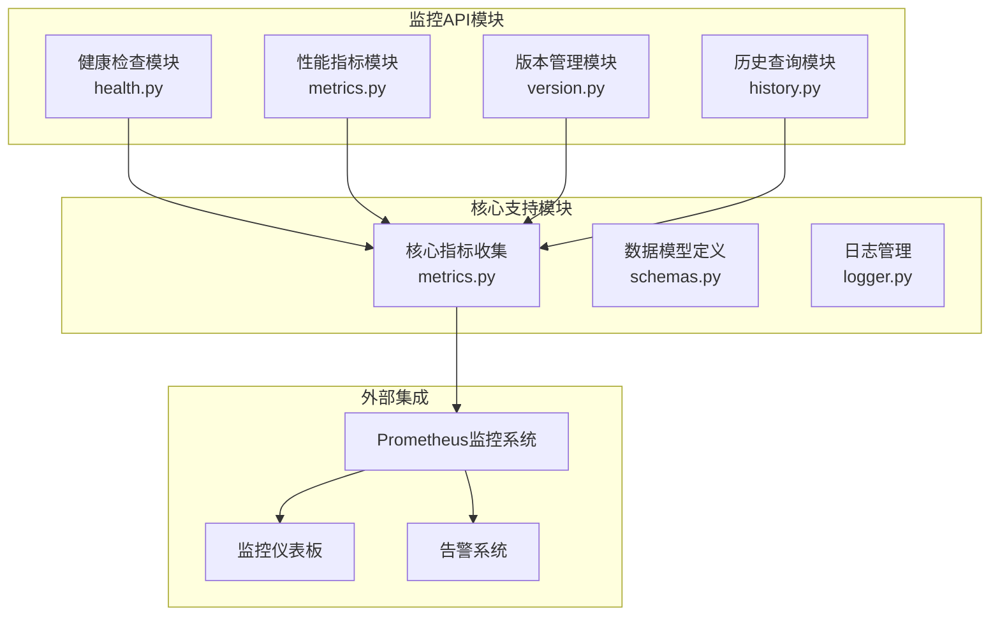
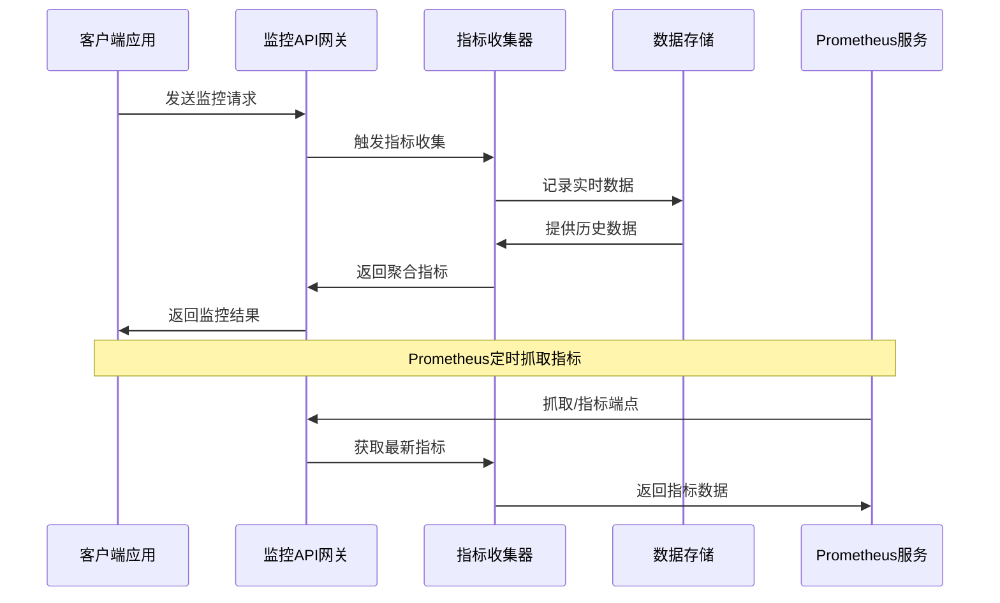
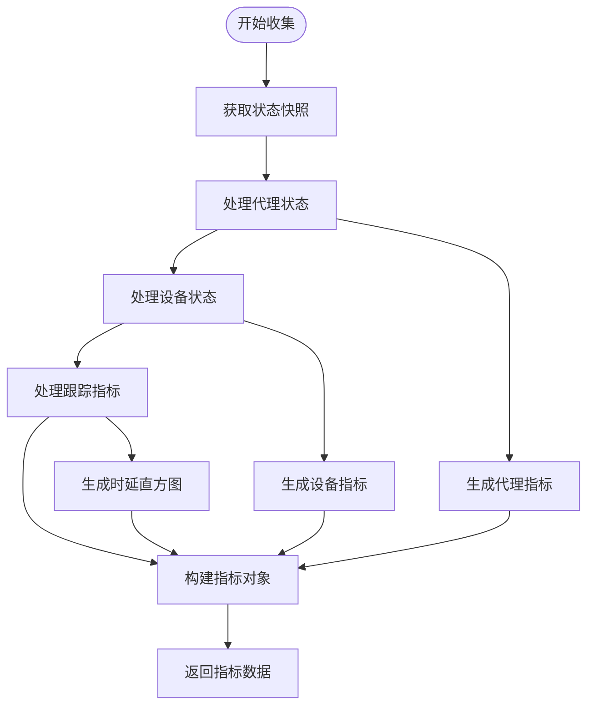
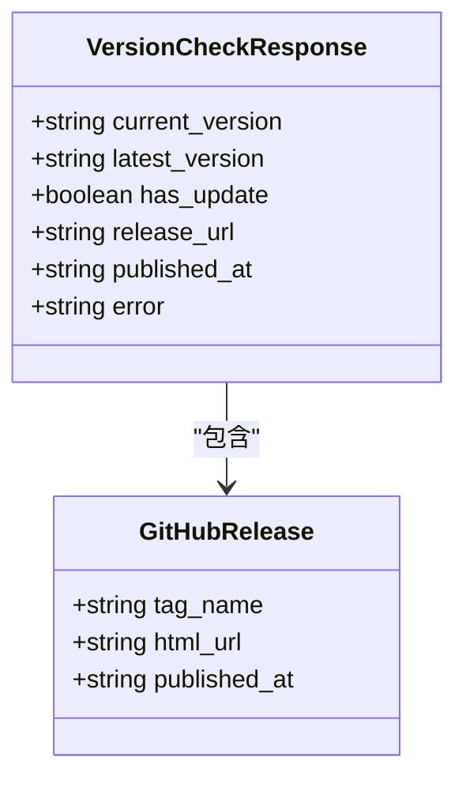
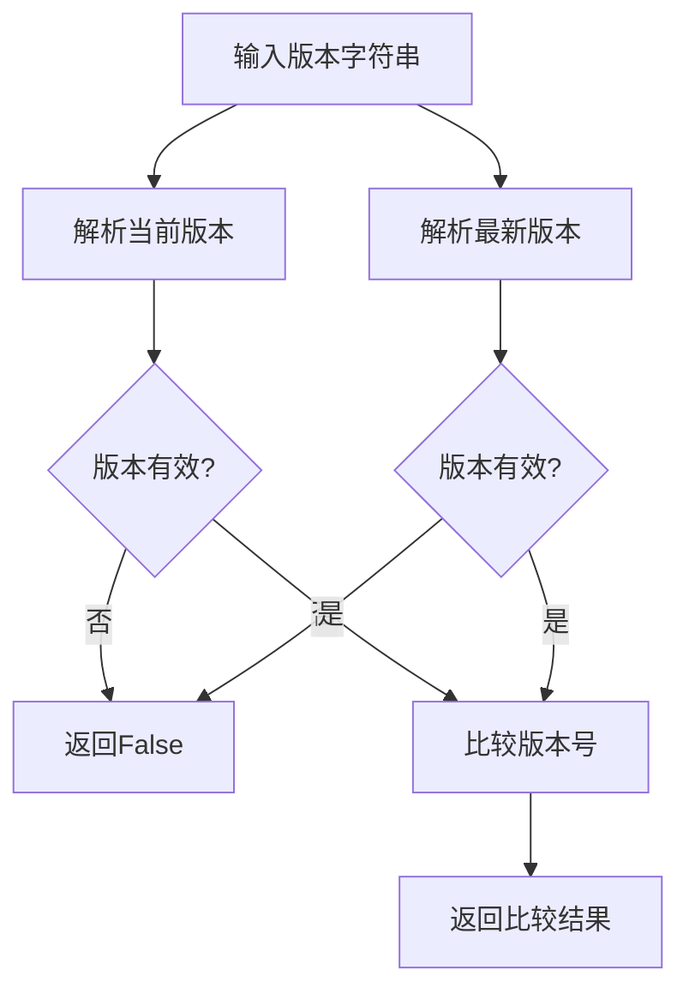
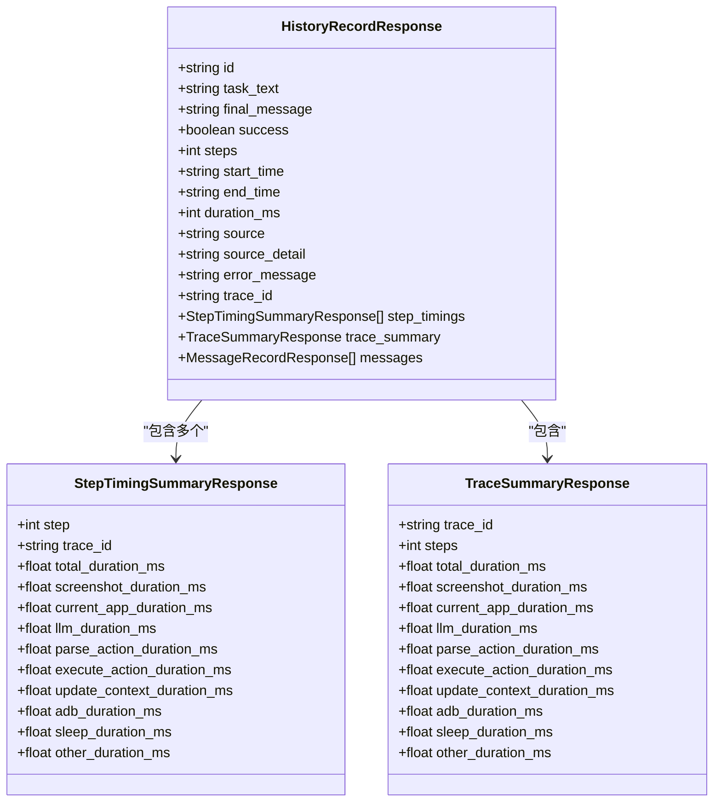
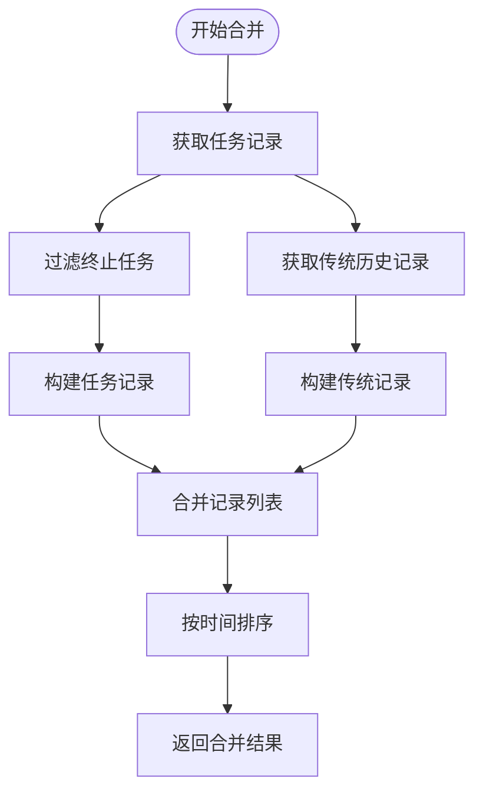
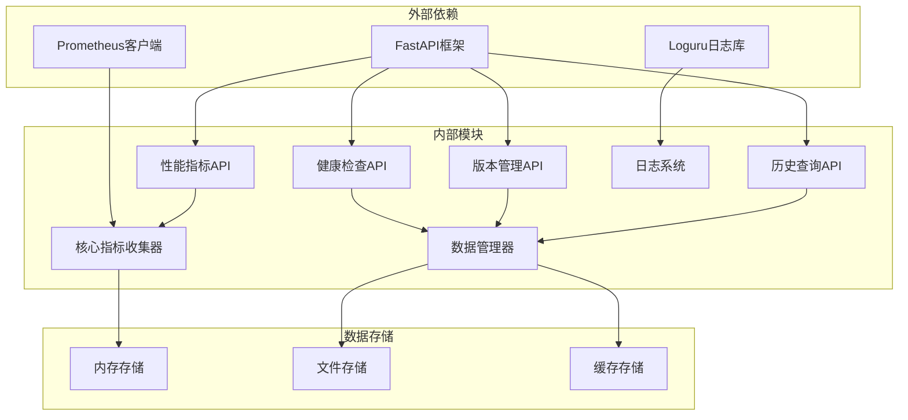
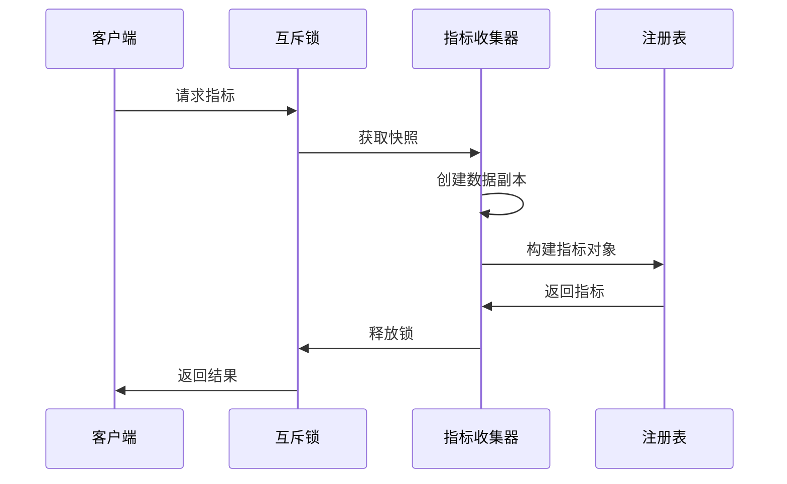

# 系统监控API

<cite>
**本文档引用的文件**
- [health.py](file://AutoGLM_GUI/api/health.py)
- [metrics.py](file://AutoGLM_GUI/api/metrics.py)
- [version.py](file://AutoGLM_GUI/api/version.py)
- [history.py](file://AutoGLM_GUI/api/history.py)
- [metrics.py](file://AutoGLM_GUI/metrics.py)
- [schemas.py](file://AutoGLM_GUI/schemas.py)
- [logger.py](file://AutoGLM_GUI/logger.py)
- [server.py](file://AutoGLM_GUI/server.py)
- [test_metrics.py](file://tests/test_metrics.py)
- [test_version_api.py](file://tests/test_version_api.py)
- [test_health_api.py](file://tests/test_health_api.py)
</cite>

## 目录
1. [简介](#简介)
2. [项目结构](#项目结构)
3. [核心组件](#核心组件)
4. [架构概览](#架构概览)
5. [详细组件分析](#详细组件分析)
6. [依赖关系分析](#依赖关系分析)
7. [性能考虑](#性能考虑)
8. [故障排除指南](#故障排除指南)
9. [结论](#结论)

## 简介

系统监控API是AutoGLM-GUI项目的核心基础设施组件，负责提供全面的系统健康检查、性能指标收集、版本管理和历史数据查询功能。该API基于FastAPI框架构建，集成了Prometheus监控体系，提供了实时监控数据流和历史数据查询能力。

本监控API主要服务于以下目标：
- 提供系统健康状态的实时检查
- 收集和暴露详细的性能指标
- 管理软件版本更新检测
- 查询和管理历史执行记录
- 支持监控仪表板集成和告警配置

## 项目结构

系统监控API位于AutoGLM_GUI项目的api目录中，采用模块化设计，每个监控功能独立为一个模块：



**图表来源**
- [health.py:1-16](file://AutoGLM_GUI/api/health.py#L1-L16)
- [metrics.py:1-37](file://AutoGLM_GUI/api/metrics.py#L1-L37)
- [version.py:1-207](file://AutoGLM_GUI/api/version.py#L1-L207)
- [history.py:1-479](file://AutoGLM_GUI/api/history.py#L1-L479)

**章节来源**
- [health.py:1-16](file://AutoGLM_GUI/api/health.py#L1-L16)
- [metrics.py:1-37](file://AutoGLM_GUI/api/metrics.py#L1-L37)
- [version.py:1-207](file://AutoGLM_GUI/api/version.py#L1-L207)
- [history.py:1-479](file://AutoGLM_GUI/api/history.py#L1-L479)

## 核心组件

系统监控API由四个核心组件构成，每个组件负责特定的监控功能：

### 1. 健康检查组件
提供系统基本健康状态的检查服务，返回系统运行状态和版本信息。

### 2. 性能指标组件  
基于Prometheus框架，收集和暴露详细的系统性能指标，包括设备状态、代理状态、执行时延等。

### 3. 版本管理组件
实现软件版本检查功能，支持GitHub Releases的版本比较和更新通知。

### 4. 历史查询组件
提供历史执行记录的查询、管理和清理功能，支持详细的执行时序分析。

**章节来源**
- [health.py:10-16](file://AutoGLM_GUI/api/health.py#L10-L16)
- [metrics.py:11-37](file://AutoGLM_GUI/api/metrics.py#L11-L37)
- [version.py:135-207](file://AutoGLM_GUI/api/version.py#L135-L207)
- [history.py:438-479](file://AutoGLM_GUI/api/history.py#L438-L479)

## 架构概览

系统监控API采用分层架构设计，实现了监控数据的采集、存储、查询和展示的完整闭环：



**图表来源**
- [server.py:8-12](file://AutoGLM_GUI/server.py#L8-L12)
- [metrics.py:473-489](file://AutoGLM_GUI/metrics.py#L473-L489)

系统架构的关键特点：
- **实时性**：通过内存存储和快速计算确保监控数据的实时性
- **可扩展性**：模块化设计支持新监控指标的添加
- **可靠性**：完善的错误处理和缓存机制保证服务稳定性
- **标准化**：遵循Prometheus指标规范确保与其他监控系统的兼容性

## 详细组件分析

### 健康检查API

健康检查API提供系统基本状态的快速验证，是监控系统中最基础的检查点。

#### 端点定义
- **路径**：`/api/health`
- **方法**：GET
- **功能**：返回系统健康状态和版本信息

#### 响应格式
```json
{
    "status": "healthy",
    "version": "1.5.0"
}
```

#### 实现特点
- 简洁高效的健康检查逻辑
- 包含版本信息便于问题诊断
- 支持快速服务状态验证

**章节来源**
- [health.py:10-16](file://AutoGLM_GUI/api/health.py#L10-L16)
- [test_health_api.py:15-26](file://tests/test_health_api.py#L15-L26)

### 性能指标API

性能指标API基于Prometheus框架，提供详细的系统性能监控数据。

#### 端点定义
- **路径**：`/api/metrics`
- **方法**：GET
- **功能**：返回Prometheus格式的指标数据

#### 指标分类

##### 代理状态指标
| 指标名称 | 类型 | 描述 | 标签 |
|---------|------|------|------|
| `autoglm_agents_total` | Gauge | 按设备和状态的代理数量 | device_id, serial, state |
| `autoglm_agents_busy_count` | Gauge | 忙碌代理的数量 | 无 |
| `autoglm_agent_last_used_timestamp_seconds` | Gauge | 代理最后使用时间戳 | device_id, serial |
| `autoglm_agent_created_timestamp_seconds` | Gauge | 代理创建时间戳 | device_id, serial |

##### 设备状态指标
| 指标名称 | 类型 | 描述 | 标签 |
|---------|------|------|------|
| `autoglm_devices_total` | Gauge | 按状态和连接类型的设备数量 | serial, model, state, connection_type, status |
| `autoglm_devices_online_count` | Gauge | 在线设备数量 | 无 |
| `autoglm_device_connections_total` | Gauge | 按连接类型统计的连接数 | serial, connection_type, status |
| `autoglm_device_unauthorized_connections_total` | Gauge | 未授权连接总数 | 无 |
| `autoglm_device_last_seen_timestamp_seconds` | Gauge | 设备最后在线时间戳 | serial, model |

##### 执行时延指标
| 指标名称 | 类型 | 描述 | 标签 |
|---------|------|------|------|
| `autoglm_trace_task_duration_seconds` | Histogram | 任务执行时长分布 | source |
| `autoglm_trace_step_duration_seconds` | Histogram | 步骤执行时长分布 | source |
| `autoglm_trace_component_duration_seconds` | Histogram | 组件执行时长分布 | source, component |

#### 指标收集流程



**图表来源**
- [metrics.py:194-219](file://AutoGLM_GUI/metrics.py#L194-L219)
- [metrics.py:221-310](file://AutoGLM_GUI/metrics.py#L221-L310)

**章节来源**
- [metrics.py:11-37](file://AutoGLM_GUI/api/metrics.py#L11-L37)
- [metrics.py:179-466](file://AutoGLM_GUI/metrics.py#L179-L466)
- [test_metrics.py:18-43](file://tests/test_metrics.py#L18-L43)

### 版本管理API

版本管理API提供软件版本检查和更新通知功能，基于GitHub Releases实现。

#### 端点定义
- **路径**：`/api/version/latest`
- **方法**：GET
- **功能**：检查最新的GitHub发布版本

#### 缓存机制
- **缓存时间**：3600秒（1小时）
- **缓存策略**：内存缓存减少GitHub API调用
- **降级处理**：网络错误时使用缓存数据

#### 响应模型



**图表来源**
- [schemas.py:507-516](file://AutoGLM_GUI/schemas.py#L507-L516)
- [version.py:18-24](file://AutoGLM_GUI/api/version.py#L18-L24)

#### 版本比较算法



**图表来源**
- [version.py:48-94](file://AutoGLM_GUI/api/version.py#L48-L94)

**章节来源**
- [version.py:135-207](file://AutoGLM_GUI/api/version.py#L135-L207)
- [test_version_api.py:144-185](file://tests/test_version_api.py#L144-L185)

### 历史查询API

历史查询API提供完整的执行历史记录管理功能，支持详细的时序分析。

#### 端点定义

| 端点 | 方法 | 功能 |
|------|------|------|
| `/api/history/{serialno}` | GET | 获取设备历史记录列表 |
| `/api/history/{serialno}/{record_id}` | GET | 获取指定历史记录详情 |
| `/api/history/{serialno}` | DELETE | 清理设备历史记录 |
| `/api/history/{serialno}/{record_id}` | DELETE | 删除指定历史记录 |

#### 数据模型



**图表来源**
- [schemas.py:769-787](file://AutoGLM_GUI/schemas.py#L769-L787)
- [schemas.py:735-750](file://AutoGLM_GUI/schemas.py#L735-L750)
- [schemas.py:752-767](file://AutoGLM_GUI/schemas.py#L752-L767)

#### 历史数据合并逻辑



**图表来源**
- [history.py:293-324](file://AutoGLM_GUI/api/history.py#L293-L324)

**章节来源**
- [history.py:438-479](file://AutoGLM_GUI/api/history.py#L438-L479)
- [schemas.py:723-796](file://AutoGLM_GUI/schemas.py#L723-L796)

## 依赖关系分析

系统监控API的依赖关系体现了清晰的分层架构：



**图表来源**
- [server.py:5-12](file://AutoGLM_GUI/server.py#L5-L12)
- [metrics.py:473-489](file://AutoGLM_GUI/metrics.py#L473-L489)

### 关键依赖特性

1. **模块解耦**：各监控组件相互独立，便于维护和扩展
2. **统一接口**：所有组件遵循FastAPI的标准路由模式
3. **共享资源**：核心指标收集器和日志系统被多个组件共享
4. **异步支持**：充分利用FastAPI的异步特性提升性能

**章节来源**
- [server.py:1-13](file://AutoGLM_GUI/server.py#L1-L13)
- [metrics.py:468-489](file://AutoGLM_GUI/metrics.py#L468-L489)

## 性能考虑

系统监控API在设计时充分考虑了性能优化，采用了多种策略确保高并发场景下的稳定运行。

### 指标收集优化

1. **内存存储**：使用内存存储避免磁盘I/O开销
2. **快照机制**：通过快照减少锁竞争和数据一致性问题
3. **批量处理**：支持批量指标收集和导出
4. **缓存策略**：合理的缓存机制减少重复计算

### 并发处理



**图表来源**
- [metrics.py:194-219](file://AutoGLM_GUI/metrics.py#L194-L219)

### 错误处理和恢复

系统实现了完善的错误处理机制：

1. **网络异常处理**：GitHub API调用失败时使用缓存数据
2. **超时处理**：设置合理的超时时间避免阻塞
3. **降级策略**：关键功能的降级保证系统稳定性
4. **日志记录**：详细的错误日志便于问题诊断

**章节来源**
- [version.py:96-133](file://AutoGLM_GUI/api/version.py#L96-L133)
- [metrics.py:216-219](file://AutoGLM_GUI/metrics.py#L216-L219)

## 故障排除指南

### 常见问题诊断

#### 健康检查失败
- **症状**：`/api/health`返回非200状态码
- **可能原因**：服务启动异常、依赖服务不可用
- **解决方法**：检查服务日志，验证依赖项状态

#### 指标收集异常
- **症状**：`/api/metrics`返回空数据或错误
- **可能原因**：指标收集器异常、数据源不可用
- **解决方法**：重启服务，检查数据源连接

#### 版本检查失败
- **症状**：`/api/version/latest`返回错误信息
- **可能原因**：GitHub API限制、网络连接问题
- **解决方法**：等待缓存过期，检查网络连接

#### 历史查询异常
- **症状**：历史记录查询返回404或500错误
- **可能原因**：记录不存在、数据库连接问题
- **解决方法**：验证参数正确性，检查数据库状态

### 监控仪表板集成

系统监控API支持多种监控仪表板的集成方式：

#### Prometheus集成
```yaml
# Prometheus配置示例
scrape_configs:
  - job_name: 'autoglm-gui'
    scrape_interval: 15s
    static_configs:
      - targets: ['localhost:8000']
    metrics_path: '/api/metrics'
```

#### Grafana仪表板
- 支持通过Prometheus数据源直接查询指标
- 可创建自定义仪表板展示关键指标
- 支持告警规则配置和可视化

### 告警规则配置

基于Prometheus的告警规则配置示例：

```yaml
# 告警规则示例
groups:
  - name: system-health
    rules:
      - alert: SystemUnhealthy
        expr: up{job="autoglm-gui"} == 0
        for: 5m
        labels:
          severity: critical
        annotations:
          summary: "系统不可用超过5分钟"
          
      - alert: HighErrorRate
        expr: rate(http_requests_total{status=~"5.."}[5m]) > 0.05
        for: 10m
        labels:
          severity: warning
        annotations:
          summary: "错误率超过5%"
```

**章节来源**
- [metrics.py:13-29](file://AutoGLM_GUI/api/metrics.py#L13-L29)
- [test_metrics.py:18-43](file://tests/test_metrics.py#L18-L43)

## 结论

系统监控API为AutoGLM-GUI项目提供了全面、可靠的监控解决方案。通过健康检查、性能指标、版本管理和历史查询四大核心功能，实现了对系统运行状态的全方位监控。

### 主要优势

1. **模块化设计**：清晰的功能分离便于维护和扩展
2. **高性能实现**：优化的数据结构和算法确保实时响应
3. **标准化接口**：遵循Prometheus标准便于生态集成
4. **完善监控**：覆盖系统运行的各个方面
5. **易于集成**：支持主流监控工具和仪表板

### 应用场景

- **运维监控**：实时监控系统健康状态和性能指标
- **质量保证**：跟踪软件版本更新和问题修复
- **性能分析**：分析执行时延和资源使用情况
- **故障诊断**：快速定位和解决问题
- **容量规划**：基于历史数据进行容量预测

该监控API为AutoGLM-GUI项目提供了坚实的技术基础，支持系统的稳定运行和持续改进。