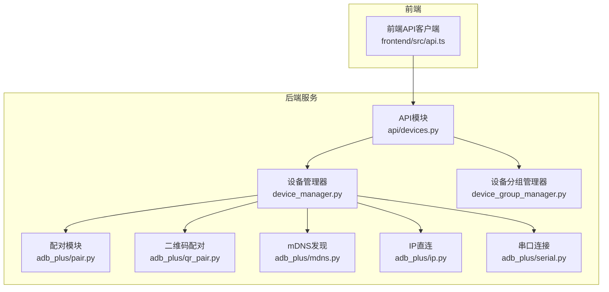
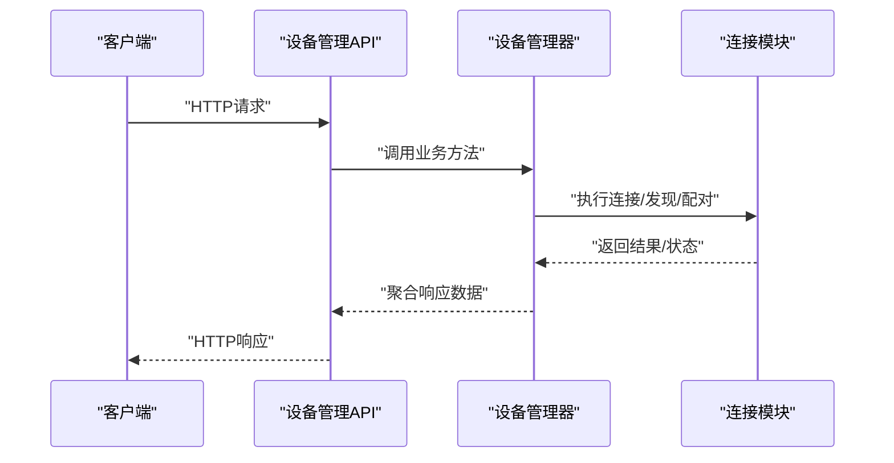
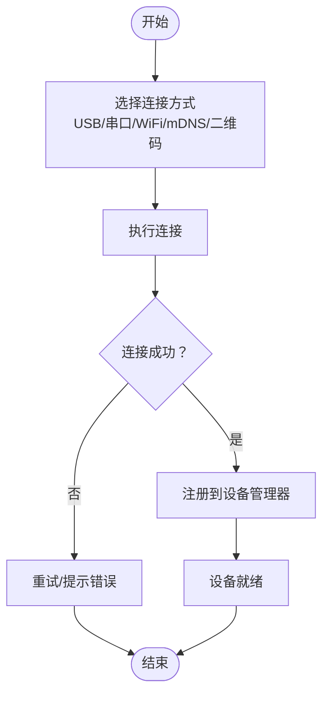
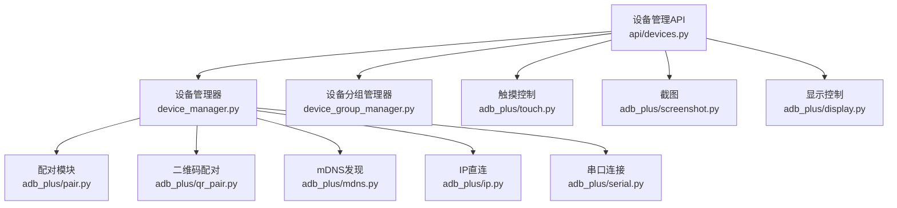

# 设备管理API

<cite>
**本文档引用的文件**
- [api/devices.py](file://AutoGLM_GUI/api/devices.py)
- [api/__init__.py](file://AutoGLM_GUI/api/__init__.py)
- [server.py](file://AutoGLM_GUI/server.py)
- [device_manager.py](file://AutoGLM_GUI/device_manager.py)
- [device_group_manager.py](file://AutoGLM_GUI/device_group_manager.py)
- [adb_plus/pair.py](file://AutoGLM_GUI/adb_plus/pair.py)
- [adb_plus/qr_pair.py](file://AutoGLM_GUI/adb_plus/qr_pair.py)
- [adb_plus/mdns.py](file://AutoGLM_GUI/adb_plus/mdns.py)
- [adb_plus/ip.py](file://AutoGLM_GUI/adb_plus/ip.py)
- [adb_plus/serial.py](file://AutoGLM_GUI/adb_plus/serial.py)
- [adb_plus/display.py](file://AutoGLM_GUI/adb_plus/display.py)
- [adb_plus/touch.py](file://AutoGLM_GUI/adb_plus/touch.py)
- [adb_plus/screenshot.py](file://AutoGLM_GUI/adb_plus/screenshot.py)
- [adb_plus/keyboard_installer.py](file://AutoGLM_GUI/adb_plus/keyboard_installer.py)
- [models/device_group.py](file://AutoGLM_GUI/models/device_group.py)
- [schemas.py](file://AutoGLM_GUI/schemas.py)
- [types.py](file://AutoGLM_GUI/types.py)
- [exceptions.py](file://AutoGLM_GUI/exceptions.py)
- [frontend/src/api.ts](file://frontend/src/api.ts)
</cite>

## 目录
1. [简介](#简介)
2. [项目结构](#项目结构)
3. [核心组件](#核心组件)
4. [架构总览](#架构总览)
5. [详细组件分析](#详细组件分析)
6. [依赖关系分析](#依赖关系分析)
7. [性能考虑](#性能考虑)
8. [故障排除指南](#故障排除指南)
9. [结论](#结论)
10. [附录](#附录)

## 简介
本文件为设备管理API的权威技术文档，覆盖设备发现、连接管理、状态查询、设备分组、批量操作与权限控制等核心能力。文档基于代码库中的实际实现，提供HTTP端点定义、请求/响应格式、错误码说明，并给出curl与JavaScript/Python调用示例路径，帮助开发者快速集成与调试。

## 项目结构
设备管理API位于后端服务的API模块中，通过FastAPI路由组织，结合设备管理器与设备分组管理器实现业务逻辑；前端通过独立的API客户端进行交互。

**图表来源**
- [api/devices.py](file://AutoGLM_GUI/api/devices.py)
- [device_manager.py](file://AutoGLM_GUI/device_manager.py)
- [device_group_manager.py](file://AutoGLM_GUI/device_group_manager.py)
- [adb_plus/pair.py](file://AutoGLM_GUI/adb_plus/pair.py)
- [adb_plus/qr_pair.py](file://AutoGLM_GUI/adb_plus/qr_pair.py)
- [adb_plus/mdns.py](file://AutoGLM_GUI/adb_plus/mdns.py)
- [adb_plus/ip.py](file://AutoGLM_GUI/adb_plus/ip.py)
- [adb_plus/serial.py](file://AutoGLM_GUI/adb_plus/serial.py)
- [frontend/src/api.ts](file://frontend/src/api.ts)

**章节来源**
- [api/devices.py](file://AutoGLM_GUI/api/devices.py)
- [api/__init__.py](file://AutoGLM_GUI/api/__init__.py)
- [server.py](file://AutoGLM_GUI/server.py)

## 核心组件
- 设备管理API：提供设备发现、连接、状态查询、分组、批量操作等REST接口。
- 设备管理器：负责设备生命周期管理、连接状态维护、设备元数据存储。
- 设备分组管理器：支持设备分组CRUD、成员管理、分组策略应用。
- 配对与连接模块：支持USB/串口、WiFi直连、mDNS自动发现、二维码配对等多种连接方式。
- 前端API客户端：封装HTTP请求，提供统一的调用入口。

**章节来源**
- [api/devices.py](file://AutoGLM_GUI/api/devices.py)
- [device_manager.py](file://AutoGLM_GUI/device_manager.py)
- [device_group_manager.py](file://AutoGLM_GUI/device_group_manager.py)
- [adb_plus/pair.py](file://AutoGLM_GUI/adb_plus/pair.py)
- [adb_plus/qr_pair.py](file://AutoGLM_GUI/adb_plus/qr_pair.py)
- [adb_plus/mdns.py](file://AutoGLM_GUI/adb_plus/mdns.py)
- [adb_plus/ip.py](file://AutoGLM_GUI/adb_plus/ip.py)
- [adb_plus/serial.py](file://AutoGLM_GUI/adb_plus/serial.py)
- [frontend/src/api.ts](file://frontend/src/api.ts)

## 架构总览
设备管理API采用分层架构：路由层（FastAPI）负责HTTP协议处理与参数校验；服务层（设备/分组管理器）负责业务逻辑；接入层（配对/连接模块）负责底层通信与发现机制；前端通过API客户端发起请求并接收响应。

**图表来源**
- [api/devices.py](file://AutoGLM_GUI/api/devices.py)
- [device_manager.py](file://AutoGLM_GUI/device_manager.py)
- [adb_plus/pair.py](file://AutoGLM_GUI/adb_plus/pair.py)

## 详细组件分析

### 设备管理API端点定义
以下为设备相关的核心HTTP端点，均在设备管理API模块中实现。每个端点包含HTTP方法、URL路径、请求参数、响应格式与典型错误码说明。

- 获取设备列表
  - 方法：GET
  - 路径：/api/devices
  - 查询参数：
    - page: 页码（整数）
    - page_size: 每页数量（整数）
    - filter_by: 过滤条件（字符串，如按状态或名称）
  - 响应：设备对象数组
  - 错误码：400（参数无效）、500（服务器内部错误）

- 获取单个设备详情
  - 方法：GET
  - 路径：/api/devices/{device_id}
  - 路径参数：device_id（字符串）
  - 响应：设备对象
  - 错误码：404（设备不存在）、400（参数无效）

- 连接设备（USB/串口/WiFi）
  - 方法：POST
  - 路径：/api/devices/connect
  - 请求体：连接参数对象（包含连接类型与目标标识）
  - 响应：连接结果对象
  - 错误码：400（参数无效）、409（已连接/冲突）、500（连接失败）

- 断开设备连接
  - 方法：POST
  - 路径：/api/devices/disconnect
  - 请求体：设备ID
  - 响应：断开结果
  - 错误码：404（设备不存在）、500（断开失败）

- 设备状态查询
  - 方法：GET
  - 路径：/api/devices/{device_id}/status
  - 响应：状态对象（含在线/离线、分辨率、电量等）
  - 错误码：404（设备不存在）

- 触摸/输入控制
  - 方法：POST
  - 路径：/api/devices/{device_id}/touch
  - 请求体：触摸坐标与手势参数
  - 响应：执行结果
  - 错误码：404（设备不存在）、400（参数无效）

- 截图
  - 方法：GET
  - 路径：/api/devices/{device_id}/screenshot
  - 响应：图片流/二进制数据
  - 错误码：404（设备不存在）、500（截图失败）

- 批量操作（连接/断开/状态刷新）
  - 方法：POST
  - 路径：/api/devices/batch
  - 请求体：操作类型与设备ID列表
  - 响应：批量结果对象
  - 错误码：400（参数无效）、500（部分失败）

- 设备权限控制
  - 方法：POST
  - 路径：/api/devices/{device_id}/grant
  - 请求体：授权用户/角色
  - 响应：授权结果
  - 错误码：403（无权限）、404（设备不存在）

- 设备配置选项
  - 方法：PATCH
  - 路径：/api/devices/{device_id}/config
  - 请求体：配置键值对
  - 响应：更新后的配置
  - 错误码：400（配置无效）、404（设备不存在）

- 设备生命周期管理
  - 注册/注销：通过连接/断开流程实现
  - 心跳检测：由设备管理器维护
  - 异常恢复：自动重连与状态回退

**章节来源**
- [api/devices.py](file://AutoGLM_GUI/api/devices.py)

### 设备连接流程
设备连接支持多种方式，流程如下：

**图表来源**
- [api/devices.py](file://AutoGLM_GUI/api/devices.py)
- [adb_plus/pair.py](file://AutoGLM_GUI/adb_plus/pair.py)
- [adb_plus/qr_pair.py](file://AutoGLM_GUI/adb_plus/qr_pair.py)
- [adb_plus/mdns.py](file://AutoGLM_GUI/adb_plus/mdns.py)
- [adb_plus/ip.py](file://AutoGLM_GUI/adb_plus/ip.py)
- [adb_plus/serial.py](file://AutoGLM_GUI/adb_plus/serial.py)

### 设备状态变更事件
设备状态变更事件由设备管理器监听并广播，前端可通过事件流或轮询订阅。事件类型包括：
- 在线/离线
- 分辨率变化
- 电量变化
- 屏幕方向变化

**章节来源**
- [device_manager.py](file://AutoGLM_GUI/device_manager.py)
- [frontend/src/api.ts](file://frontend/src/api.ts)

### 设备分组功能
- 创建分组：POST /api/groups
- 更新分组：PATCH /api/groups/{group_id}
- 删除分组：DELETE /api/groups/{group_id}
- 添加设备到分组：POST /api/groups/{group_id}/devices
- 从分组移除设备：DELETE /api/groups/{group_id}/devices/{device_id}
- 获取分组设备列表：GET /api/groups/{group_id}/devices

**章节来源**
- [api/devices.py](file://AutoGLM_GUI/api/devices.py)
- [device_group_manager.py](file://AutoGLM_GUI/device_group_manager.py)
- [models/device_group.py](file://AutoGLM_GUI/models/device_group.py)

### curl示例
- 获取设备列表
  - curl "http://localhost:8000/api/devices?page=1&page_size=20"
- 连接设备
  - curl -X POST "http://localhost:8000/api/devices/connect" -H "Content-Type: application/json" -d '{"type":"usb","target":"SERIAL_12345"}'
- 获取设备状态
  - curl "http://localhost:8000/api/devices/DEVICE_ID/status"
- 触摸控制
  - curl -X POST "http://localhost:8000/api/devices/DEVICE_ID/touch" -H "Content-Type: application/json" -d '{"x":100,"y":200}'
- 截图
  - curl -o screenshot.jpg "http://localhost:8000/api/devices/DEVICE_ID/screenshot"
- 批量断开
  - curl -X POST "http://localhost:8000/api/devices/batch" -H "Content-Type: application/json" -d '{"operation":"disconnect","device_ids":["DEVICE_1","DEVICE_2"]}'

**章节来源**
- [api/devices.py](file://AutoGLM_GUI/api/devices.py)

### JavaScript/Python客户端调用示例
- JavaScript（基于fetch）
  - GET /api/devices
  - POST /api/devices/connect
  - GET /api/devices/{id}/status
  - POST /api/devices/{id}/touch
  - GET /api/devices/{id}/screenshot
  - POST /api/devices/batch
- Python（基于requests）
  - session.get("/api/devices", params={"page":1,"page_size":20})
  - session.post("/api/devices/connect", json={"type":"wifi","target":"192.168.1.100"})
  - session.get(f"/api/devices/{{id}}/status")
  - session.post(f"/api/devices/{{id}}/touch", json={"x":100,"y":200})
  - session.get(f"/api/devices/{{id}}/screenshot", stream=True)
  - session.post("/api/devices/batch", json={"operation":"disconnect","device_ids":[...]})

**章节来源**
- [frontend/src/api.ts](file://frontend/src/api.ts)

## 依赖关系分析
设备管理API与各模块的依赖关系如下：

**图表来源**
- [api/devices.py](file://AutoGLM_GUI/api/devices.py)
- [device_manager.py](file://AutoGLM_GUI/device_manager.py)
- [device_group_manager.py](file://AutoGLM_GUI/device_group_manager.py)
- [adb_plus/pair.py](file://AutoGLM_GUI/adb_plus/pair.py)
- [adb_plus/qr_pair.py](file://AutoGLM_GUI/adb_plus/qr_pair.py)
- [adb_plus/mdns.py](file://AutoGLM_GUI/adb_plus/mdns.py)
- [adb_plus/ip.py](file://AutoGLM_GUI/adb_plus/ip.py)
- [adb_plus/serial.py](file://AutoGLM_GUI/adb_plus/serial.py)
- [adb_plus/touch.py](file://AutoGLM_GUI/adb_plus/touch.py)
- [adb_plus/screenshot.py](file://AutoGLM_GUI/adb_plus/screenshot.py)
- [adb_plus/display.py](file://AutoGLM_GUI/adb_plus/display.py)

**章节来源**
- [api/devices.py](file://AutoGLM_GUI/api/devices.py)
- [device_manager.py](file://AutoGLM_GUI/device_manager.py)
- [device_group_manager.py](file://AutoGLM_GUI/device_group_manager.py)

## 性能考虑
- 批量操作：优先使用批量端点减少HTTP往返，避免逐台请求带来的延迟。
- 流式传输：截图与视频流建议使用流式响应，降低内存占用。
- 缓存策略：设备状态可采用本地缓存+定时刷新，减少频繁查询。
- 并发控制：连接/断开操作需加锁，防止竞态条件导致的状态不一致。
- 超时设置：网络请求设置合理超时与重试策略，提升稳定性。

## 故障排除指南
- 400 参数无效：检查请求体字段类型与范围，确保必填项齐全。
- 404 设备不存在：确认设备ID正确且设备已注册。
- 409 连接冲突：同一设备已在其他会话中连接，需先断开再重连。
- 500 服务器内部错误：查看后端日志定位异常，必要时重试或降级处理。
- 权限不足：确认当前会话具备相应权限，或联系管理员授权。

**章节来源**
- [exceptions.py](file://AutoGLM_GUI/exceptions.py)
- [api/devices.py](file://AutoGLM_GUI/api/devices.py)

## 结论
设备管理API提供了完善的设备全生命周期管理能力，覆盖多连接方式、状态监控、分组与批量操作，并通过清晰的错误码与响应格式保障了易用性与可靠性。建议在生产环境中结合缓存、流式传输与并发控制等优化手段，进一步提升性能与用户体验。

## 附录
- 数据模型与类型定义参考：
  - 设备对象、分组对象、连接参数、状态对象等
- 常用场景最佳实践：
  - 多设备协同：使用分组+批量操作
  - 实时预览：结合事件流与截图接口
  - 自动化脚本：优先使用批量端点与稳定超时策略

**章节来源**
- [schemas.py](file://AutoGLM_GUI/schemas.py)
- [types.py](file://AutoGLM_GUI/types.py)