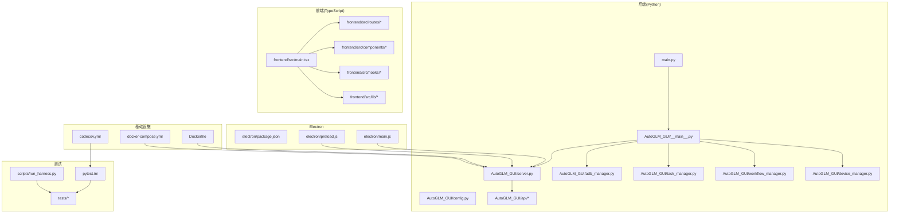
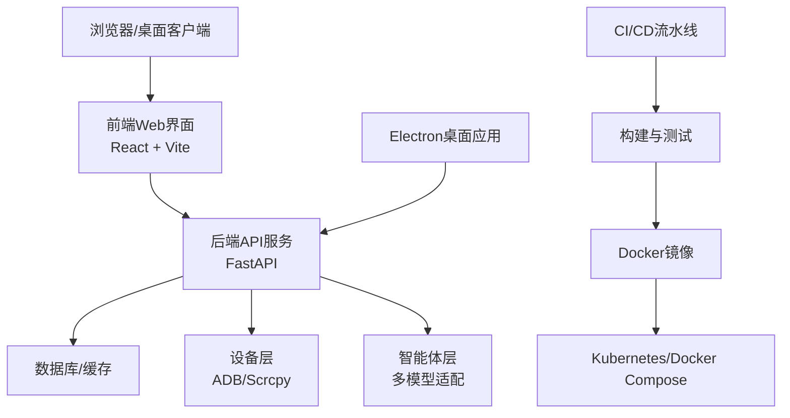
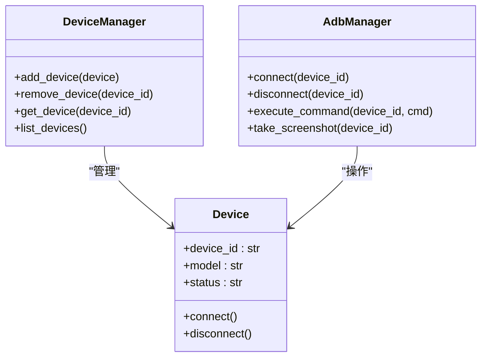
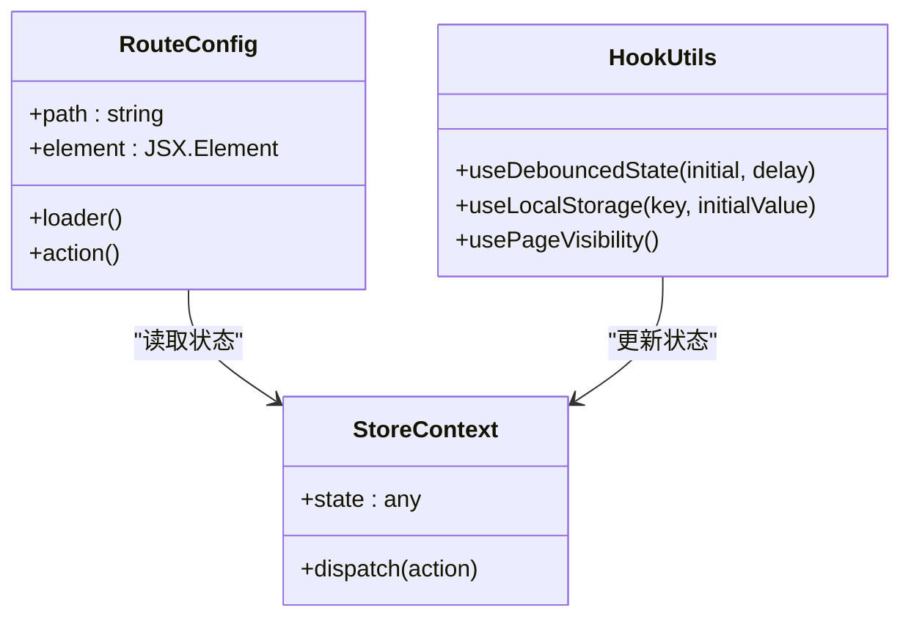
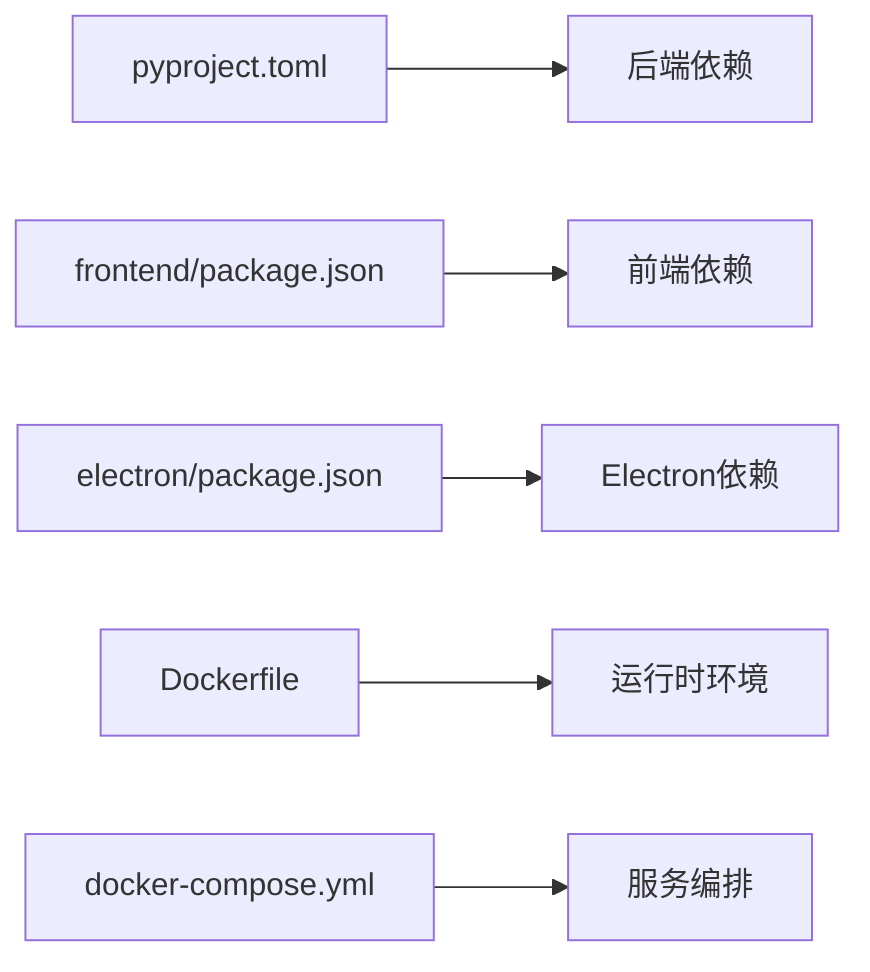

# 代码规范与质量

<cite>
**本文引用的文件**
- [main.py](file://main.py)
- [pyproject.toml](file://pyproject.toml)
- [pytest.ini](file://pytest.ini)
- [codecov.yml](file://codecov.yml)
- [pyrightconfig.json](file://pyrightconfig.json)
- [.claude/commands/lint.md](file://.claude/commands/lint.md)
- [scripts/lint.py](file://scripts/lint.py)
- [frontend/package.json](file://frontend/package.json)
- [frontend/eslint.config.js](file://frontend/eslint.config.js)
- [frontend/prettier.config.js](file://frontend/prettier.config.js)
- [frontend/tsconfig.json](file://frontend/tsconfig.json)
- [frontend/vite.config.js](file://frontend/vite.config.js)
- [frontend/playwright.config.ts](file://frontend/playwright.config.ts)
- [electron/package.json](file://electron/package.json)
- [electron/electron-builder.yml](file://electron/electron-builder.yml)
- [Dockerfile](file://Dockerfile)
- [docker-compose.yml](file://docker-compose.yml)
- [tests/conftest.py](file://tests/conftest.py)
- [tests/test_agent_integration.py](file://tests/test_agent_integration.py)
- [tests/test_local_e2e.py](file://tests/test_local_e2e.py)
- [tests/test_task_system_e2e.py](file://tests/test_task_system_e2e.py)
- [scripts/run_harness.py](file://scripts/run_harness.py)
- [scripts/start_e2e_services.py](file://scripts/start_e2e_services.py)
- [scripts/start_mock_device.py](file://scripts/start_mock_device.py)
- [scripts/start_mock_llm.py](file://scripts/start_mock_llm.py)
- [AutoGLM_GUI/__main__.py](file://AutoGLM_GUI/__main__.py)
- [AutoGLM_GUI/config.py](file://AutoGLM_GUI/config.py)
- [AutoGLM_GUI/logger.py](file://AutoGLM_GUI/logger.py)
- [AutoGLM_GUI/types.py](file://AutoGLM_GUI/types.py)
- [AutoGLM_GUI/schemas.py](file://AutoGLM_GUI/schemas.py)
- [AutoGLM_GUI/exceptions.py](file://AutoGLM_GUI/exceptions.py)
- [AutoGLM_GUI/device_manager.py](file://AutoGLM_GUI/device_manager.py)
- [AutoGLM_GUI/device_group_manager.py](file://AutoGLM_GUI/device_group_manager.py)
- [AutoGLM_GUI/task_manager.py](file://AutoGLM_GUI/task_manager.py)
- [AutoGLM_GUI/workflow_manager.py](file://AutoGLM_GUI/workflow_manager.py)
- [AutoGLM_GUI/adb_manager.py](file://AutoGLM_GUI/adb_manager.py)
- [AutoGLM_GUI/adb/device.py](file://AutoGLM_GUI/adb/device.py)
- [AutoGLM_GUI/adb/connection.py](file://AutoGLM_GUI/adb/connection.py)
- [AutoGLM_GUI/adb/input.py](file://AutoGLM_GUI/adb/input.py)
- [AutoGLM_GUI/adb/screenshot.py](file://AutoGLM_GUI/adb/screenshot.py)
- [AutoGLM_GUI/adb/timing.py](file://AutoGLM_GUI/adb/timing.py)
- [AutoGLM_GUI/adb_plus/device.py](file://AutoGLM_GUI/adb_plus/device.py)
- [AutoGLM_GUI/adb_plus/display.py](file://AutoGLM_GUI/adb_plus/display.py)
- [AutoGLM_GUI/adb_plus/ip.py](file://AutoGLM_GUI/adb_plus/ip.py)
- [AutoGLM_GUI/adb_plus/pair.py](file://AutoGLM_GUI/adb_plus/pair.py)
- [AutoGLM_GUI/adb_plus/qr_pair.py](file://AutoGLM_GUI/adb_plus/qr_pair.py)
- [AutoGLM_GUI/adb_plus/screenshot.py](file://AutoGLM_GUI/adb_plus/screenshot.py)
- [AutoGLM_GUI/adb_plus/serial.py](file://AutoGLM_GUI/adb_plus/serial.py)
- [AutoGLM_GUI/adb_plus/touch.py](file://AutoGLM_GUI/adb_plus/touch.py)
- [AutoGLM_GUI/agents/factory.py](file://AutoGLM_GUI/agents/factory.py)
- [AutoGLM_GUI/agents/base/async_agent_base.py](file://AutoGLM_GUI/agents/base/async_agent_base.py)
- [AutoGLM_GUI/agents/glm/async_agent.py](file://AutoGLM_GUI/agents/glm/async_agent.py)
- [AutoGLM_GUI/agents/glm/parser.py](file://AutoGLM_GUI/agents/glm/parser.py)
- [AutoGLM_GUI/agents/qwen/async_agent.py](file://AutoGLM_GUI/agents/qwen/async_agent.py)
- [AutoGLM_GUI/agents/qwen/parser.py](file://AutoGLM_GUI/agents/qwen/parser.py)
- [AutoGLM_GUI/agents/midscene/async_agent.py](file://AutoGLM_GUI/agents/midscene/async_agent.py)
- [AutoGLM_GUI/agents/midscene/log_parser.py](file://AutoGLM_GUI/agents/midscene/log_parser.py)
- [AutoGLM_GUI/api/agents.py](file://AutoGLM_GUI/api/agents.py)
- [AutoGLM_GUI/api/control.py](file://AutoGLM_GUI/api/control.py)
- [AutoGLM_GUI/api/devices.py](file://AutoGLM_GUI/api/devices.py)
- [AutoGLM_GUI/api/history.py](file://AutoGLM_GUI/api/history.py)
- [AutoGLM_GUI/api/workflows.py](file://AutoGLM_GUI/api/workflows.py)
- [AutoGLM_GUI/api/tasks.py](file://AutoGLM_GUI/api/tasks.py)
- [AutoGLM_GUI/api/terminal.py](file://AutoGLM_GUI/api/terminal.py)
- [AutoGLM_GUI/api/version.py](file://AutoGLM_GUI/api/version.py)
- [AutoGLM_GUI/api/metrics.py](file://AutoGLM_GUI/api/metrics.py)
- [AutoGLM_GUI/api/scheduled_tasks.py](file://AutoGLM_GUI/api/scheduled_tasks.py)
- [AutoGLM_GUI/api/media.py](file://AutoGLM_GUI/api/media.py)
- [AutoGLM_GUI/api/experience.py](file://AutoGLM_GUI/api/experience.py)
- [AutoGLM_GUI/api/health.py](file://AutoGLM_GUI/api/health.py)
- [AutoGLM_GUI/api/mcp.py](file://AutoGLM_GUI/api/mcp.py)
- [AutoGLM_GUI/api/layered_agent.py](file://AutoGLM_GUI/api/layered_agent.py)
- [AutoGLM_GUI/api/terminal.py](file://AutoGLM_GUI/api/terminal.py)
- [AutoGLM_GUI/api/version.py](file://AutoGLM_GUI/api/version.py)
- [AutoGLM_GUI/api/workflows.py](file://AutoGLM_GUI/api/workflows.py)
- [AutoGLM_GUI/api/scheduled_tasks.py](file://AutoGLM_GUI/api/scheduled_tasks.py)
- [AutoGLM_GUI/api/metrics.py](file://AutoGLM_GUI/api/metrics.py)
- [AutoGLM_GUI/api/media.py](file://AutoGLM_GUI/api/media.py)
- [AutoGLM_GUI/api/experience.py](file://AutoGLM_GUI/api/experience.py)
- [AutoGLM_GUI/api/health.py](file://AutoGLM_GUI/api/health.py)
- [AutoGLM_GUI/api/mcp.py](file://AutoGLM_GUI/api/mcp.py)
- [AutoGLM_GUI/api/layered_agent.py](file://AutoGLM_GUI/api/layered_agent.py)
- [AutoGLM_GUI/api/agents.py](file://AutoGLM_GUI/api/agents.py)
- [AutoGLM_GUI/api/control.py](file://AutoGLM_GUI/api/control.py)
- [AutoGLM_GUI/api/devices.py](file://AutoGLM_GUI/api/devices.py)
- [AutoGLM_GUI/api/history.py](file://AutoGLM_GUI/api/history.py)
- [AutoGLM_GUI/api/tasks.py](file://AutoGLM_GUI/api/tasks.py)
- [AutoGLM_GUI/api/terminal.py](file://AutoGLM_GUI/api/terminal.py)
- [AutoGLM_GUI/api/version.py](file://AutoGLM_GUI/api/version.py)
- [AutoGLM_GUI/api/metrics.py](file://AutoGLM_GUI/api/metrics.py)
- [AutoGLM_GUI/api/scheduled_tasks.py](file://AutoGLM_GUI/api/scheduled_tasks.py)
- [AutoGLM_GUI/api/media.py](file://AutoGLM_GUI/api/media.py)
- [AutoGLM_GUI/api/experience.py](file://AutoGLM_GUI/api/experience.py)
- [AutoGLM_GUI/api/health.py](file://AutoGLM_GUI/api/health.py)
- [AutoGLM_GUI/api/mcp.py](file://AutoGLM_GUI/api/mcp.py)
- [AutoGLM_GUI/api/layered_agent.py](file://AutoGLM_GUI/api/layered_agent.py)
- [AutoGLM_GUI/api/agents.py](file://AutoGLM_GUI/api/agents.py)
- [AutoGLM_GUI/api/control.py](file://AutoGLM_GUI/api/control.py)
- [AutoGLM_GUI/api/devices.py](file://AutoGLM_GUI/api/devices.py)
- [AutoGLM_GUI/api/history.py](file://AutoGLM_GUI/api/history.py)
- [AutoGLM_GUI/api/tasks.py](file://AutoGLM_GUI/api/tasks.py)
- [AutoGLM_GUI/api/terminal.py](file://AutoGLM_GUI/api/terminal.py)
- [AutoGLM_GUI/api/version.py](file://AutoGLM_GUI/api/version.py)
- [AutoGLM_GUI/api/metrics.py](file://AutoGLM_GUI/api/metrics.py)
- [AutoGLM_GUI/api/scheduled_tasks.py](file://AutoGLM_GUI/api/scheduled_tasks.py)
- [AutoGLM_GUI/api/media.py](file://AutoGLM_GUI/api/media.py)
- [AutoGLM_GUI/api/experience.py](file://AutoGLM_GUI/api/experience.py)
- [AutoGLM_GUI/api/health.py](file://AutoGLM_GUI/api/health.py)
- [AutoGLM_GUI/api/mcp.py](file://AutoGLM_GUI/api/mcp.py)
- [AutoGLM_GUI/api/layered_agent.py](file://AutoGLM_GUI/api/layered_agent.py)
</cite>

## 目录
1. [引言](#引言)
2. [项目结构](#项目结构)
3. [核心组件](#核心组件)
4. [架构总览](#架构总览)
5. [详细组件分析](#详细组件分析)
6. [依赖分析](#依赖分析)
7. [性能考虑](#性能考虑)
8. [故障排查指南](#故障排查指南)
9. [结论](#结论)
10. [附录](#附录)

## 引言
本文件为AutoGLM-GUI项目的代码规范与质量标准文档，覆盖Python后端、TypeScript前端、Electron桌面应用以及容器化部署的规范要求。内容包括：Python代码风格与类型检查、命名约定与注释标准；TypeScript编码规范、ESLint/Prettier配置；静态分析与格式化策略；代码审查清单与质量门禁；单元测试与覆盖率要求、测试编写规范与持续集成流程；性能优化建议与安全编码最佳实践。

## 项目结构
AutoGLM-GUI采用多模块分层架构：
- 后端服务（Python）：核心业务逻辑、设备管理、任务编排、API接口等
- 前端（TypeScript + React + Vite）：用户界面、状态管理、组件库
- Electron：桌面应用打包与运行时
- 测试：单元测试、集成测试、E2E测试
- 文档：Docusaurus站点
- 脚本：构建、发布、Lint与覆盖率导出

图表来源
- [main.py](file://main.py)
- [AutoGLM_GUI/__main__.py](file://AutoGLM_GUI/__main__.py)
- [AutoGLM_GUI/server.py](file://AutoGLM_GUI/server.py)
- [frontend/src/main.tsx](file://frontend/src/main.tsx)
- [electron/main.js](file://electron/main.js)
- [pytest.ini](file://pytest.ini)
- [Dockerfile](file://Dockerfile)
- [docker-compose.yml](file://docker-compose.yml)
- [codecov.yml](file://codecov.yml)

章节来源
- [main.py](file://main.py)
- [AutoGLM_GUI/__main__.py](file://AutoGLM_GUI/__main__.py)
- [AutoGLM_GUI/server.py](file://AutoGLM_GUI/server.py)
- [frontend/src/main.tsx](file://frontend/src/main.tsx)
- [electron/main.js](file://electron/main.js)
- [pytest.ini](file://pytest.ini)
- [Dockerfile](file://Dockerfile)
- [docker-compose.yml](file://docker-compose.yml)
- [codecov.yml](file://codecov.yml)

## 核心组件
- Python后端核心模块
  - 配置与入口：[AutoGLM_GUI/config.py](file://AutoGLM_GUI/config.py)，[AutoGLM_GUI/__main__.py](file://AutoGLM_GUI/__main__.py)，[main.py](file://main.py)
  - 设备与ADB：[AutoGLM_GUI/device_manager.py](file://AutoGLM_GUI/device_manager.py)，[AutoGLM_GUI/adb_manager.py](file://AutoGLM_GUI/adb_manager.py)，[AutoGLM_GUI/adb/*](file://AutoGLM_GUI/adb/)
  - 任务与工作流：[AutoGLM_GUI/task_manager.py](file://AutoGLM_GUI/task_manager.py)，[AutoGLM_GUI/workflow_manager.py](file://AutoGLM_GUI/workflow_manager.py)
  - API接口：[AutoGLM_GUI/api/*](file://AutoGLM_GUI/api/)
  - 类型与模式：[AutoGLM_GUI/types.py](file://AutoGLM_GUI/types.py)，[AutoGLM_GUI/schemas.py](file://AutoGLM_GUI/schemas.py)
  - 日志与异常：[AutoGLM_GUI/logger.py](file://AutoGLM_GUI/logger.py)，[AutoGLM_GUI/exceptions.py](file://AutoGLM_GUI/exceptions.py)

- TypeScript前端核心模块
  - 应用入口与路由：[frontend/src/main.tsx](file://frontend/src/main.tsx)，[frontend/src/routes/*](file://frontend/src/routes/)
  - 组件库与Hooks：[frontend/src/components/*](file://frontend/src/components/)，[frontend/src/hooks/*](file://frontend/src/hooks/)
  - 工具与国际化：[frontend/src/lib/*](file://frontend/src/lib/)
  - 构建与测试配置：[frontend/vite.config.js](file://frontend/vite.config.js)，[frontend/playwright.config.ts](file://frontend/playwright.config.ts)

- Electron桌面应用
  - 打包与运行时：[electron/package.json](file://electron/package.json)，[electron/electron-builder.yml](file://electron/electron-builder.yml)，[electron/main.js](file://electron/main.js)，[electron/preload.js](file://electron/preload.js)

- 测试与CI
  - 测试框架与覆盖率：[pytest.ini](file://pytest.ini)，[codecov.yml](file://codecov.yml)，[tests/*](file://tests/)
  - 测试运行脚本：[scripts/run_harness.py](file://scripts/run_harness.py)，[scripts/start_e2e_services.py](file://scripts/start_e2e_services.py)，[scripts/start_mock_device.py](file://scripts/start_mock_device.py)，[scripts/start_mock_llm.py](file://scripts/start_mock_llm.py)

章节来源
- [AutoGLM_GUI/config.py](file://AutoGLM_GUI/config.py)
- [AutoGLM_GUI/__main__.py](file://AutoGLM_GUI/__main__.py)
- [main.py](file://main.py)
- [AutoGLM_GUI/device_manager.py](file://AutoGLM_GUI/device_manager.py)
- [AutoGLM_GUI/adb_manager.py](file://AutoGLM_GUI/adb_manager.py)
- [AutoGLM_GUI/adb/*](file://AutoGLM_GUI/adb/)
- [AutoGLM_GUI/task_manager.py](file://AutoGLM_GUI/task_manager.py)
- [AutoGLM_GUI/workflow_manager.py](file://AutoGLM_GUI/workflow_manager.py)
- [AutoGLM_GUI/api/*](file://AutoGLM_GUI/api/)
- [AutoGLM_GUI/types.py](file://AutoGLM_GUI/types.py)
- [AutoGLM_GUI/schemas.py](file://AutoGLM_GUI/schemas.py)
- [AutoGLM_GUI/logger.py](file://AutoGLM_GUI/logger.py)
- [AutoGLM_GUI/exceptions.py](file://AutoGLM_GUI/exceptions.py)
- [frontend/src/main.tsx](file://frontend/src/main.tsx)
- [frontend/src/routes/*](file://frontend/src/routes/)
- [frontend/src/components/*](file://frontend/src/components/)
- [frontend/src/hooks/*](file://frontend/src/hooks/)
- [frontend/src/lib/*](file://frontend/src/lib/)
- [frontend/vite.config.js](file://frontend/vite.config.js)
- [frontend/playwright.config.ts](file://frontend/playwright.config.ts)
- [electron/package.json](file://electron/package.json)
- [electron/electron-builder.yml](file://electron/electron-builder.yml)
- [electron/main.js](file://electron/main.js)
- [electron/preload.js](file://electron/preload.js)
- [pytest.ini](file://pytest.ini)
- [codecov.yml](file://codecov.yml)
- [tests/*](file://tests/)
- [scripts/run_harness.py](file://scripts/run_harness.py)
- [scripts/start_e2e_services.py](file://scripts/start_e2e_services.py)
- [scripts/start_mock_device.py](file://scripts/start_mock_device.py)
- [scripts/start_mock_llm.py](file://scripts/start_mock_llm.py)

## 架构总览
系统采用“后端API + 前端Web + Electron桌面 + 容器化部署”的分层架构。后端通过FastAPI提供REST接口，前端通过React/Vite渲染，Electron封装桌面应用，Docker用于容器化部署与编排。

图表来源
- [AutoGLM_GUI/server.py](file://AutoGLM_GUI/server.py)
- [frontend/src/main.tsx](file://frontend/src/main.tsx)
- [electron/main.js](file://electron/main.js)
- [Dockerfile](file://Dockerfile)
- [docker-compose.yml](file://docker-compose.yml)

## 详细组件分析

### Python后端代码规范与质量标准

- 代码风格与命名约定
  - 模块与类命名：采用PascalCase；模块名小写带下划线；常量全大写
  - 函数与方法：采用snake_case；私有成员以下划线前缀
  - 变量：采用snake_case；避免缩写，必要时使用清晰缩写
  - 异常类：以Error或Exception结尾，继承自标准异常基类
  - 文件组织：按功能域划分目录，如adb、agents、api、devices等

- 注释与文档字符串
  - 模块级：简述用途、作者、版本与变更历史
  - 类与函数：使用Google/NumPy风格docstring，描述参数、返回值、异常与示例
  - 复杂逻辑：在关键分支与算法处添加行内注释，解释设计决策
  - TODO/FIXME：使用统一标记并附带关联Issue或日期

- 类型检查与静态分析
  - 使用pyright进行类型检查，配置参考[pyrightconfig.json](file://pyrightconfig.json)
  - 在关键模块启用严格模式，确保可空性、泛型与协议一致性
  - 对外部依赖与动态调用使用显式类型标注或类型忽略注释，并附带理由

- 错误处理与日志
  - 统一异常体系：定义业务异常基类与具体异常类型，便于捕获与区分
  - 日志记录：使用结构化日志，包含trace_id、level、module、message等字段
  - 资源清理：使用上下文管理器与finally块确保资源释放

- 性能与并发
  - 异步优先：I/O密集场景使用async/await，避免阻塞主线程
  - 连接池：数据库与外部HTTP请求使用连接池
  - 缓存策略：对热点数据使用内存缓存，注意过期与一致性

- 安全编码
  - 输入校验：对所有外部输入进行白名单校验与长度限制
  - 敏感信息：避免硬编码密钥与令牌，使用环境变量与密钥管理服务
  - 权限控制：API鉴权与授权，最小权限原则
  - 路径遍历：禁止任意路径访问，使用白名单与规范化路径

- Lint与格式化
  - 使用flake8、pylint或ruff进行静态检查，结合项目Lint脚本[scripts/lint.py](file://scripts/lint.py)与Claude命令[.claude/commands/lint.md](file://.claude/commands/lint.md)
  - 使用black进行格式化，配合isort进行导入排序
  - 提交前执行完整Lint与格式化流程

章节来源
- [pyrightconfig.json](file://pyrightconfig.json)
- [.claude/commands/lint.md](file://.claude/commands/lint.md)
- [scripts/lint.py](file://scripts/lint.py)
- [AutoGLM_GUI/logger.py](file://AutoGLM_GUI/logger.py)
- [AutoGLM_GUI/exceptions.py](file://AutoGLM_GUI/exceptions.py)
- [AutoGLM_GUI/config.py](file://AutoGLM_GUI/config.py)
- [AutoGLM_GUI/types.py](file://AutoGLM_GUI/types.py)
- [AutoGLM_GUI/schemas.py](file://AutoGLM_GUI/schemas.py)

#### Python类关系图（示例：设备与ADB管理）

图表来源
- [AutoGLM_GUI/device_manager.py](file://AutoGLM_GUI/device_manager.py)
- [AutoGLM_GUI/adb_manager.py](file://AutoGLM_GUI/adb_manager.py)
- [AutoGLM_GUI/adb/device.py](file://AutoGLM_GUI/adb/device.py)

### TypeScript前端编码规范与质量标准

- 代码风格与命名约定
  - 组件：PascalCase；文件名与组件名一致
  - Hooks：useXxx命名；返回值明确解构
  - 工具函数：camelCase；纯函数优先
  - 类型：interface优先于type；联合类型明确边界
  - 样式：CSS Modules命名与组件同名，避免全局污染

- 注释与文档
  - 组件：Props与返回值说明；复杂逻辑添加注释
  - Hooks：参数、返回值与副作用说明
  - 工具函数：输入输出约束与边界条件

- 类型检查与静态分析
  - 使用TypeScript严格模式，开启noImplicitAny、strictNullChecks等
  - ESLint与TS规则结合，确保类型安全与风格一致
  - 对第三方库使用@types补充声明

- 格式化与Lint
  - Prettier统一格式化，忽略文件遵循[frontend/.prettierignore](file://frontend/.prettierignore)
  - ESLint规则参考[frontend/eslint.config.js](file://frontend/eslint.config.js)
  - 提交前执行格式化与ESLint检查

- 组件与状态管理
  - 组件职责单一，避免过度耦合
  - 状态提升与局部状态分离，避免重复请求
  - 错误边界与加载状态处理

- 性能与可访问性
  - 懒加载与分割代码块
  - 图片与媒体资源优化
  - 可访问性：语义化标签、ARIA属性、键盘导航

- 安全编码
  - XSS防护：避免dangerouslySetInnerHTML；对用户输入进行转义
  - CSRF防护：表单提交携带CSRF Token
  - 密码输入：隐藏显示切换与强度提示

章节来源
- [frontend/eslint.config.js](file://frontend/eslint.config.js)
- [frontend/prettier.config.js](file://frontend/prettier.config.js)
- [frontend/tsconfig.json](file://frontend/tsconfig.json)
- [frontend/vite.config.js](file://frontend/vite.config.js)
- [frontend/src/main.tsx](file://frontend/src/main.tsx)
- [frontend/src/components/*](file://frontend/src/components/)
- [frontend/src/hooks/*](file://frontend/src/hooks/)
- [frontend/src/lib/*](file://frontend/src/lib/)

#### TypeScript类关系图（示例：路由与状态）

图表来源
- [frontend/src/routes/*](file://frontend/src/routes/)
- [frontend/src/hooks/useDebouncedState.ts](file://frontend/src/hooks/useDebouncedState.ts)
- [frontend/src/hooks/useLocalStorage.ts](file://frontend/src/hooks/useLocalStorage.ts)
- [frontend/src/hooks/usePageVisibility.ts](file://frontend/src/hooks/usePageVisibility.ts)

### Electron桌面应用规范

- 打包与分发
  - 使用electron-builder配置[electron/electron-builder.yml](file://electron/electron-builder.yml)
  - 平台目标：Windows/macOS/Linux；自动签名与更新
  - 资源与图标：统一资源管理，避免硬编码路径

- 安全与权限
  - NodeIntegration关闭，启用contextIsolation
  - Preload脚本仅暴露必要API，避免直接暴露Node能力
  - CSP策略与内容安全策略

- 性能与稳定性
  - 主进程与渲染进程分离，IPC通信最小化
  - 大文件与长任务异步处理，避免阻塞UI

章节来源
- [electron/electron-builder.yml](file://electron/electron-builder.yml)
- [electron/main.js](file://electron/main.js)
- [electron/preload.js](file://electron/preload.js)

## 依赖分析
- Python后端依赖管理
  - 使用pyproject.toml集中管理依赖与工具链
  - 开发依赖与生产依赖分离，锁定版本范围
  - 使用uv.lock保证可重现构建

- 前端依赖管理
  - package.json管理依赖与脚本
  - ESLint与Prettier作为开发工具
  - Vite作为构建工具，Playwright用于E2E测试

- 容器化依赖
  - Dockerfile定义镜像构建步骤与运行时
  - docker-compose编排服务与环境变量

图表来源
- [pyproject.toml](file://pyproject.toml)
- [frontend/package.json](file://frontend/package.json)
- [electron/package.json](file://electron/package.json)
- [Dockerfile](file://Dockerfile)
- [docker-compose.yml](file://docker-compose.yml)

章节来源
- [pyproject.toml](file://pyproject.toml)
- [frontend/package.json](file://frontend/package.json)
- [electron/package.json](file://electron/package.json)
- [Dockerfile](file://Dockerfile)
- [docker-compose.yml](file://docker-compose.yml)

## 性能考虑
- 后端
  - 异步I/O与事件循环：减少阻塞，提高吞吐
  - 连接池与超时重试：数据库与外部API
  - 缓存策略：Redis/Memory缓存热点数据
  - 监控指标：Prometheus指标与日志追踪

- 前端
  - 代码分割与懒加载：按需加载组件与路由
  - 图片与媒体压缩：WebP、AVIF、视频压缩
  - 请求去重与节流：避免重复请求与频繁刷新

- Electron
  - 主进程轻量化，渲染进程职责单一
  - IPC消息序列化与大小控制
  - 资源释放与内存泄漏检测

- 容器化
  - 多阶段构建减小镜像体积
  - 资源限制与健康检查

## 故障排查指南
- 常见问题定位
  - 后端：查看日志文件与结构化日志字段，定位异常堆栈与请求ID
  - 前端：浏览器开发者工具Network/Console，检查错误边界与状态
  - 设备连接：ADB日志与设备状态轮询，确认IP/端口与防火墙

- 测试辅助
  - 单元测试：pytest运行，关注断言失败与覆盖率报告
  - 集成测试：使用fixtures与mock服务，隔离外部依赖
  - E2E测试：Playwright调试模式，截图与视频录制

- 回归与验证
  - 使用scripts/run_harness.py执行测试套件
  - 使用scripts/start_e2e_services.py启动本地服务与Mock

章节来源
- [AutoGLM_GUI/logger.py](file://AutoGLM_GUI/logger.py)
- [pytest.ini](file://pytest.ini)
- [tests/conftest.py](file://tests/conftest.py)
- [scripts/run_harness.py](file://scripts/run_harness.py)
- [scripts/start_e2e_services.py](file://scripts/start_e2e_services.py)

## 结论
本规范以项目现有配置为基础，结合实际代码结构，制定了Python与TypeScript的编码标准、静态分析与格式化策略、测试与覆盖率要求、以及持续集成流程建议。建议团队在日常开发中严格执行，并通过代码审查与自动化检查保障质量门禁。

## 附录

### 代码审查清单（Python）
- 代码风格与命名是否符合规范
- 类型注解是否完整且准确
- 是否存在未处理的异常与资源泄漏
- 日志是否足够详细且结构化
- 是否引入不必要的第三方依赖
- 是否通过Lint与格式化检查
- 是否有对应的单元测试与覆盖率

章节来源
- [pyrightconfig.json](file://pyrightconfig.json)
- [scripts/lint.py](file://scripts/lint.py)
- [AutoGLM_GUI/logger.py](file://AutoGLM_GUI/logger.py)

### 代码审查清单（TypeScript）
- 类型安全与接口一致性
- ESLint规则是否全部通过
- Prettier格式化是否正确
- 组件职责是否单一
- 是否存在内存泄漏与性能瓶颈
- 是否通过Playwright测试

章节来源
- [frontend/eslint.config.js](file://frontend/eslint.config.js)
- [frontend/prettier.config.js](file://frontend/prettier.config.js)
- [frontend/playwright.config.ts](file://frontend/playwright.config.ts)

### 质量门禁标准
- 必须通过：Python与TypeScript的Lint与格式化
- 必须通过：单元测试与覆盖率阈值（建议≥80%）
- 可选但推荐：E2E测试通过
- 代码审查：至少一名Reviewer批准

章节来源
- [pytest.ini](file://pytest.ini)
- [codecov.yml](file://codecov.yml)
- [tests/*](file://tests/)

### 单元测试与覆盖率
- 测试框架：pytest
- 覆盖率：Codecov集成，生成覆盖率报告
- 测试编写规范：每个模块至少包含对应单元测试，覆盖关键路径与边界条件
- E2E测试：Playwright，覆盖核心用户流程

章节来源
- [pytest.ini](file://pytest.ini)
- [codecov.yml](file://codecov.yml)
- [tests/conftest.py](file://tests/conftest.py)
- [frontend/playwright.config.ts](file://frontend/playwright.config.ts)

### 持续集成流程
- 触发：Push/PR触发CI
- 步骤：安装依赖、运行Lint、格式化检查、单元测试、覆盖率上传、E2E测试（可选）、构建与打包（可选）
- 报告：测试报告与覆盖率报告

章节来源
- [Dockerfile](file://Dockerfile)
- [docker-compose.yml](file://docker-compose.yml)
- [scripts/run_harness.py](file://scripts/run_harness.py)