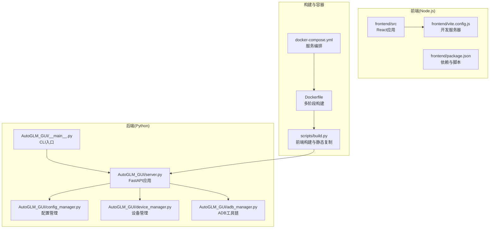
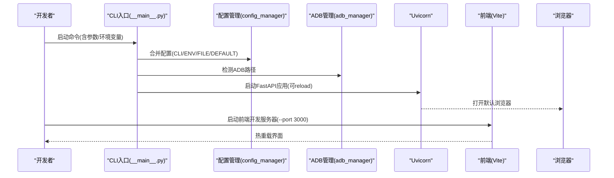
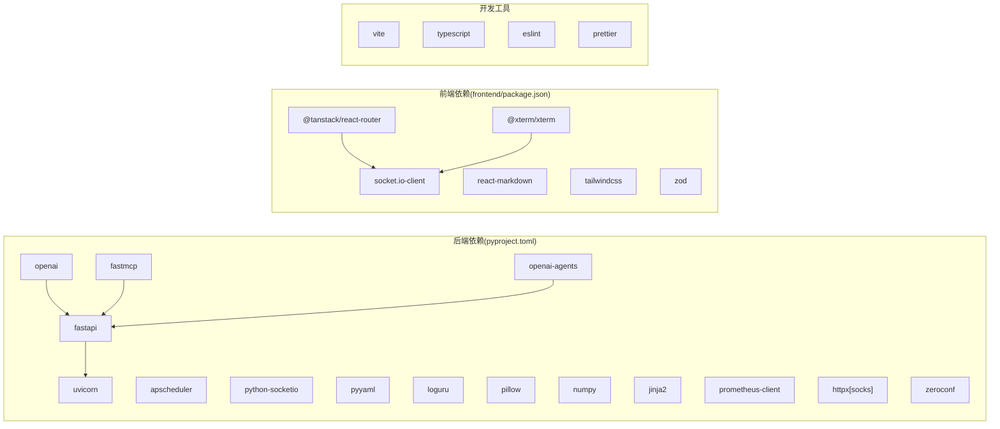

# 开发环境搭建

<cite>
**本文引用的文件**
- [README.md](file://README.md)
- [pyproject.toml](file://pyproject.toml)
- [Dockerfile](file://Dockerfile)
- [docker-compose.yml](file://docker-compose.yml)
- [main.py](file://main.py)
- [frontend/package.json](file://frontend/package.json)
- [scripts/build.py](file://scripts/build.py)
- [scripts/download_adb.py](file://scripts/download_adb.py)
- [scripts/start_e2e_services.py](file://scripts/start_e2e_services.py)
- [AutoGLM_GUI/__main__.py](file://AutoGLM_GUI/__main__.py)
- [AutoGLM_GUI/config.py](file://AutoGLM_GUI/config.py)
- [docs/docs/development.md](file://docs/docs/development.md)
- [docs/docs/configuration.md](file://docs/docs/configuration.md)
- [docs/docs/troubleshooting/common-issues.md](file://docs/docs/troubleshooting/common-issues.md)
- [electron/package.json](file://electron/package.json)
</cite>

## 目录
1. [简介](#简介)
2. [项目结构](#项目结构)
3. [核心组件](#核心组件)
4. [架构总览](#架构总览)
5. [详细组件分析](#详细组件分析)
6. [依赖关系分析](#依赖关系分析)
7. [性能考虑](#性能考虑)
8. [故障排除指南](#故障排除指南)
9. [结论](#结论)
10. [附录](#附录)

## 简介
本指南面向希望在本地搭建 AutoGLM-GUI 开发环境的工程师，覆盖 Python 后端、Node.js 前端、ADB 工具链的安装与配置，并提供 Docker 开发环境的搭建方法。同时给出 IDE 推荐、调试工具设置、开发服务器启动流程、环境变量配置、依赖安装步骤以及常见问题的解决方案。最后总结开发工作流程的最佳实践。

## 项目结构
AutoGLM-GUI 采用前后端分离的多语言混合架构：
- 后端：Python（FastAPI + Uvicorn），入口位于 AutoGLM_GUI 包，提供 Web API、MCP 服务、设备管理等能力
- 前端：React + TypeScript + Vite，位于 frontend 目录，提供 Web 界面与交互
- 构建：scripts/build.py 负责前端构建并将静态资源复制到后端包中
- 容器：Dockerfile 多阶段构建，包含 Node 前端与 Python 后端
- 开发辅助：scripts/download_adb.py、scripts/start_e2e_services.py 等脚本

**图表来源**
- [AutoGLM_GUI/__main__.py:78-305](file://AutoGLM_GUI/__main__.py#L78-L305)
- [frontend/package.json:1-81](file://frontend/package.json#L1-L81)
- [scripts/build.py:1-147](file://scripts/build.py#L1-L147)
- [Dockerfile:1-64](file://Dockerfile#L1-L64)
- [docker-compose.yml:1-32](file://docker-compose.yml#L1-L32)

**章节来源**
- [README.md:555-595](file://README.md#L555-L595)
- [pyproject.toml:1-77](file://pyproject.toml#L1-L77)
- [frontend/package.json:1-81](file://frontend/package.json#L1-L81)
- [scripts/build.py:1-147](file://scripts/build.py#L1-L147)
- [Dockerfile:1-64](file://Dockerfile#L1-L64)
- [docker-compose.yml:1-32](file://docker-compose.yml#L1-L32)

## 核心组件
- CLI 入口与启动流程：解析参数、端口探测、配置合并、ADB 检测、Uvicorn 启动、浏览器打开
- 配置系统：四层优先级（CLI > 环境变量 > 配置文件 > 默认），支持热重载同步
- 设备与 ADB：统一管理 ADB 路径与设备连接，支持模拟器与无线设备
- 前端开发：Vite 热重载、TypeScript 类型检查、ESLint/Prettier 规范
- 构建与打包：前端构建 + 静态资源复制 + Python 包构建（wheel/sdist）

**章节来源**
- [AutoGLM_GUI/__main__.py:78-305](file://AutoGLM_GUI/__main__.py#L78-L305)
- [AutoGLM_GUI/config.py:18-89](file://AutoGLM_GUI/config.py#L18-L89)
- [frontend/package.json:1-81](file://frontend/package.json#L1-L81)
- [scripts/build.py:1-147](file://scripts/build.py#L1-L147)

## 架构总览
开发环境的启动顺序与交互如下：

**图表来源**
- [AutoGLM_GUI/__main__.py:177-305](file://AutoGLM_GUI/__main__.py#L177-L305)
- [frontend/package.json:5-18](file://frontend/package.json#L5-L18)

**章节来源**
- [AutoGLM_GUI/__main__.py:78-305](file://AutoGLM_GUI/__main__.py#L78-L305)
- [docs/docs/development.md:8-26](file://docs/docs/development.md#L8-L26)

## 详细组件分析

### Python 环境与依赖安装
- Python 版本：>=3.11
- 依赖管理：pyproject.toml 定义核心依赖与可选依赖；开发依赖在 dependency-groups.dev 中
- 安装方式：推荐使用 uv（同步依赖、运行命令、构建包）
- 快速安装与运行：README 提供 uv sync 与 uv run 的示例

建议步骤
- 安装 uv（跨平台包/虚拟环境管理工具）
- 在项目根目录执行依赖同步：uv sync
- 如需构建前端静态资源：uv run python scripts/build.py
- 启动后端开发服务器：uv run autoglm-gui --base-url http://localhost:8080/v1 --reload

**章节来源**
- [pyproject.toml:1-77](file://pyproject.toml#L1-L77)
- [README.md:555-574](file://README.md#L555-L574)
- [docs/docs/development.md:8-26](file://docs/docs/development.md#L8-L26)

### Node.js 环境与前端开发
- Node 版本：Dockerfile 使用 node:20.20.2-slim，建议本地也使用相近版本
- 前端脚本：package.json 提供 dev/build/preview/lint/type-check 等脚本
- 开发服务器：默认端口 3000，与后端 8000 端口配合使用
- 类型检查与格式化：TypeScript + ESLint + Prettier

建议步骤
- 在 frontend 目录执行 npm install 安装依赖
- 启动前端开发服务器：cd frontend && npm run dev
- 修改前端代码后，浏览器热重载生效

**章节来源**
- [Dockerfile:7-16](file://Dockerfile#L7-L16)
- [frontend/package.json:5-18](file://frontend/package.json#L5-L18)

### ADB 工具链安装与配置
- 系统依赖：Dockerfile 在后端镜像中安装 adb
- 本地开发：可通过脚本自动下载各平台 ADB 工具至 resources/adb/<platform>/platform-tools
- 使用策略：CLI 启动时会检测 ADB 路径，若不可用则降级提示

建议步骤
- 如需本地 ADB：uv run python scripts/download_adb.py
- 确保 ADB 可执行文件存在于 PATH 或被程序正确识别
- 连接设备：USB 或 WiFi（无线调试），确保同一网络

**章节来源**
- [Dockerfile:28-36](file://Dockerfile#L28-L36)
- [scripts/download_adb.py:1-170](file://scripts/download_adb.py#L1-L170)
- [AutoGLM_GUI/__main__.py:271-282](file://AutoGLM_GUI/__main__.py#L271-L282)

### Docker 开发环境
- 多阶段构建：前端阶段（Node）+ 后端阶段（Python），最终产物包含静态资源
- 系统依赖：apt 安装 adb、curl、ca-certificates
- 端口与健康检查：默认暴露 8000，健康检查访问 /api/health
- 编排：docker-compose.yml 支持 host 网络（推荐）或端口映射；卷挂载配置与日志目录

建议步骤
- 构建镜像：docker build -t autoglm-gui .
- 或使用预构建镜像：docker-compose up -d
- 通过 http://localhost:8000 访问界面；如需预配置模型 API，可在 compose 文件中取消注释 environment 部分

**章节来源**
- [Dockerfile:1-64](file://Dockerfile#L1-L64)
- [docker-compose.yml:1-32](file://docker-compose.yml#L1-L32)
- [README.md:169-218](file://README.md#L169-L218)

### IDE 推荐与调试工具设置
- Python：建议使用 VS Code + Python 扩展，启用 pyright 类型检查
- 前端：VS Code + React/TypeScript 扩展，启用 ESLint/Prettier
- 调试：后端支持 --reload 自动重载；前端使用 Vite 热重载
- 日志：CLI 支持 --log-level/--log-file/--no-log-file 控制日志级别与输出

**章节来源**
- [docs/docs/development.md:8-26](file://docs/docs/development.md#L8-L26)
- [AutoGLM_GUI/__main__.py:86-108](file://AutoGLM_GUI/__main__.py#L86-L108)

### 开发服务器启动流程
- 后端：uv run autoglm-gui --base-url http://localhost:8080/v1 --reload
- 前端：cd frontend && npm run dev
- 端口：后端默认从 8000 开始寻找可用端口；前端默认 3000
- 浏览器：后端启动后自动打开 http://127.0.0.1:端口

**章节来源**
- [AutoGLM_GUI/__main__.py:17-46](file://AutoGLM_GUI/__main__.py#L17-L46)
- [AutoGLM_GUI/__main__.py:293-300](file://AutoGLM_GUI/__main__.py#L293-L300)
- [docs/docs/development.md:8-26](file://docs/docs/development.md#L8-L26)

### 环境变量配置
- 模型配置：AUTOGLM_BASE_URL、AUTOGLM_MODEL_NAME、AUTOGLM_API_KEY
- CORS：AUTOGLM_CORS_ORIGINS（默认 "*"）
- 日志：AUTOGLM_LOG_LEVEL、AUTOGLM_LOG_FILE、AUTOGLM_NO_LOG_FILE
- ADB：AUTOGLM_ADB_PATH、AUTOGLM_SERVER_HOST
- 配置优先级：CLI > 环境变量 > 配置文件 > 默认值

**章节来源**
- [Dockerfile:52-56](file://Dockerfile#L52-L56)
- [AutoGLM_GUI/__main__.py:86-108](file://AutoGLM_GUI/__main__.py#L86-L108)
- [AutoGLM_GUI/__main__.py:213-235](file://AutoGLM_GUI/__main__.py#L213-L235)

### 依赖安装与构建
- 后端依赖：uv sync
- 前端依赖：npm install（在 frontend 目录）
- 构建前端静态资源：uv run python scripts/build.py
- 构建 Python 包：uv run python scripts/build.py --pack

**章节来源**
- [README.md:555-595](file://README.md#L555-L595)
- [scripts/build.py:86-140](file://scripts/build.py#L86-L140)

### 常见环境问题与解决方案
- 任务无法执行：检查模型配置（base_url、model_name、API Key）是否已配置
- 设备未显示：确认设备已连接并开启调试；无线连接需在同一网络
- 定时任务未执行：确认任务已启用且 Cron 表达式格式正确
- 日志无法查看：日志功能仅桌面版可用，Web 版会提示

**章节来源**
- [docs/docs/troubleshooting/common-issues.md:7-26](file://docs/docs/troubleshooting/common-issues.md#L7-L26)

## 依赖关系分析

**图表来源**
- [pyproject.toml:24-40](file://pyproject.toml#L24-L40)
- [frontend/package.json:19-56](file://frontend/package.json#L19-L56)

**章节来源**
- [pyproject.toml:24-40](file://pyproject.toml#L24-L40)
- [frontend/package.json:19-56](file://frontend/package.json#L19-L56)

## 性能考虑
- 端口冲突：CLI 提供端口探测，避免冲突；建议在开发机上预留 8000+ 端口段
- 热重载：后端 --reload 与前端 Vite 热重载配合，提升迭代效率
- 前端构建：构建脚本注入后端版本到前端，便于联调与问题追踪
- 容器健康检查：Dockerfile 中的 HEALTHCHECK 保障服务可用性

**章节来源**
- [AutoGLM_GUI/__main__.py:17-46](file://AutoGLM_GUI/__main__.py#L17-L46)
- [scripts/build.py:55-58](file://scripts/build.py#L55-L58)
- [Dockerfile:58-60](file://Dockerfile#L58-L60)

## 故障排除指南
- 端口占用：后端自动寻找可用端口；若冲突，可手动指定 --port 或释放占用端口
- ADB 未找到：使用 download_adb.py 下载工具；确保可执行文件在 PATH 中
- 前端依赖安装失败：检查 Node 版本与网络；在 frontend 目录执行 npm ci
- Docker 网络问题：推荐 host 网络模式以支持 mDNS/USB；否则使用端口映射
- 配置冲突：CLI 优先级最高；若配置文件与环境变量冲突，以 CLI 为准

**章节来源**
- [AutoGLM_GUI/__main__.py:17-46](file://AutoGLM_GUI/__main__.py#L17-L46)
- [scripts/download_adb.py:53-80](file://scripts/download_adb.py#L53-L80)
- [docker-compose.yml:7-13](file://docker-compose.yml#L7-L13)

## 结论
通过 uv + Vite + FastAPI 的组合，AutoGLM-GUI 提供了高效的本地开发体验。Docker 多阶段构建确保了前后端资源的一致性与可移植性。遵循本文档的环境搭建步骤与最佳实践，可快速完成开发环境配置并投入高效迭代。

## 附录

### 开发工作流程最佳实践
- 后端：使用 --reload 自动重载；合理设置日志级别；通过配置管理器统一配置来源
- 前端：利用 Vite 热重载；保持 ESLint/Prettier 规范；TypeScript 类型检查
- 构建：先构建前端静态资源，再复制到后端包；必要时构建 Python 包
- 测试：使用 E2E 服务脚本启动后端、LLM 与 Agent 服务，配合 Playwright 测试

**章节来源**
- [docs/docs/development.md:8-26](file://docs/docs/development.md#L8-L26)
- [scripts/start_e2e_services.py:77-173](file://scripts/start_e2e_services.py#L77-L173)