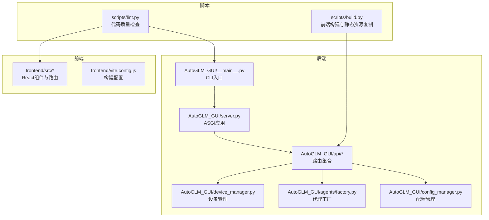
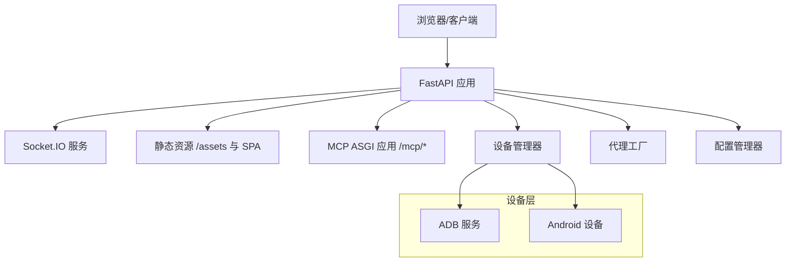
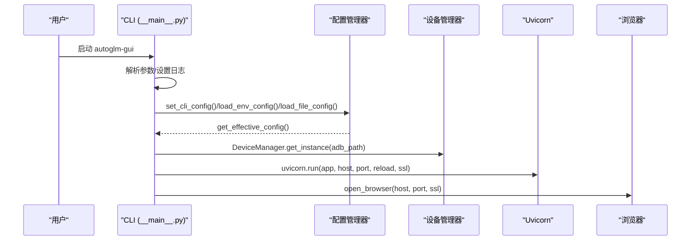
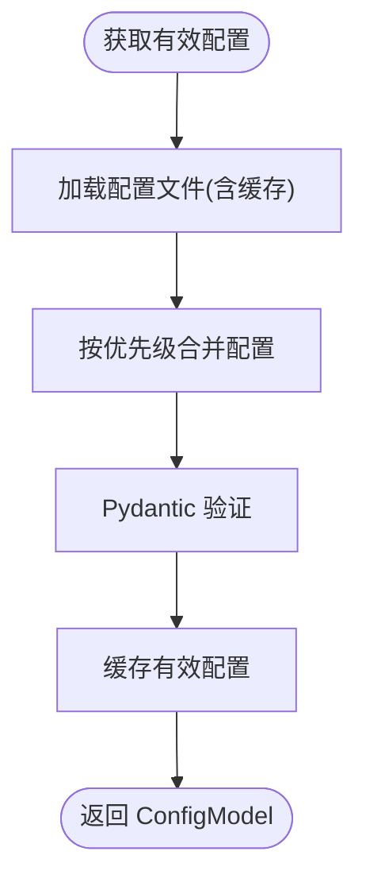
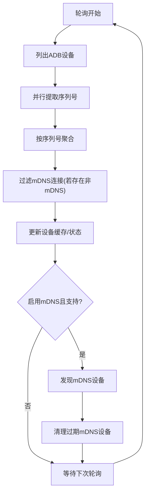
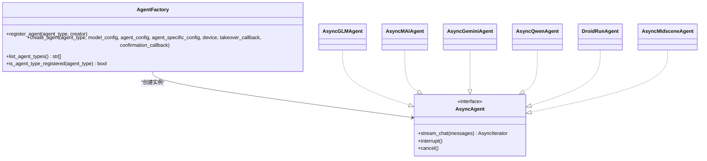
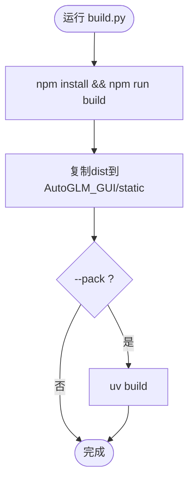
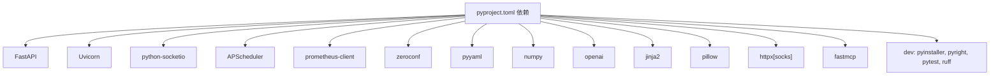

# 开发者指南

<cite>
**本文档引用的文件**
- [main.py](file://main.py)
- [__main__.py](file://AutoGLM_GUI/__main__.py)
- [server.py](file://AutoGLM_GUI/server.py)
- [config_manager.py](file://AutoGLM_GUI/config_manager.py)
- [device_manager.py](file://AutoGLM_GUI/device_manager.py)
- [factory.py](file://AutoGLM_GUI/agents/factory.py)
- [build.py](file://scripts/build.py)
- [pyproject.toml](file://pyproject.toml)
- [development.md](file://docs/docs/development.md)
- [README.md](file://README.md)
- [lint.py](file://scripts/lint.py)
</cite>

## 目录
1. [简介](#简介)
2. [项目结构](#项目结构)
3. [核心组件](#核心组件)
4. [架构总览](#架构总览)
5. [详细组件分析](#详细组件分析)
6. [依赖关系分析](#依赖关系分析)
7. [性能考量](#性能考量)
8. [故障排除指南](#故障排除指南)
9. [结论](#结论)
10. [附录](#附录)

## 简介
本指南面向希望参与 AutoGLM-GUI 项目开发的贡献者，涵盖开发环境搭建、代码规范、调试技巧、贡献流程、测试策略、发布流程以及扩展开发指导。项目采用前后端分离架构：后端基于 FastAPI + Socket.IO，前端基于 Vite + React，支持多设备管理、分层代理模式、MCP 协议集成与 Docker 部署。

## 项目结构
项目采用模块化组织，核心目录与职责如下：
- AutoGLM_GUI：后端核心包，包含 API 路由、设备管理、代理工厂、配置管理、ADB 集成等
- frontend：React/Vite 前端应用，提供设备控制、任务管理、历史记录等界面
- scripts：构建、打包、发布与质量检查脚本
- tests：后端单元与集成测试，包含 E2E 服务启动脚本与场景夹具
- docs：Docusaurus 文档站点，包含用户文档与开发文档
- electron：桌面版打包配置（可选）

**图表来源**
- [__main__.py:78-305](file://AutoGLM_GUI/__main__.py#L78-L305)
- [server.py:1-13](file://AutoGLM_GUI/server.py#L1-L13)
- [config_manager.py:237-296](file://AutoGLM_GUI/config_manager.py#L237-L296)
- [device_manager.py:249-314](file://AutoGLM_GUI/device_manager.py#L249-L314)
- [factory.py:20-103](file://AutoGLM_GUI/agents/factory.py#L20-L103)
- [build.py:36-84](file://scripts/build.py#L36-L84)
- [lint.py:251-295](file://scripts/lint.py#L251-L295)

**章节来源**
- [main.py:1-14](file://main.py#L1-L14)
- [__main__.py:78-305](file://AutoGLM_GUI/__main__.py#L78-L305)
- [server.py:1-13](file://AutoGLM_GUI/server.py#L1-L13)
- [config_manager.py:237-296](file://AutoGLM_GUI/config_manager.py#L237-L296)
- [device_manager.py:249-314](file://AutoGLM_GUI/device_manager.py#L249-L314)
- [factory.py:20-103](file://AutoGLM_GUI/agents/factory.py#L20-L103)
- [build.py:36-84](file://scripts/build.py#L36-L84)
- [lint.py:251-295](file://scripts/lint.py#L251-L295)

## 核心组件
- CLI 入口与启动：提供命令行参数解析、日志配置、端口探测、浏览器自动打开、Uvicorn 运行与配置同步
- ASGI 应用：将 FastAPI 应用与 Socket.IO 服务合并为单一 ASGI 应用
- 配置管理：四层优先级（CLI > 环境变量 > 配置文件 > 默认值），类型安全与热重载
- 设备管理：后台轮询、状态缓存、mDNS 发现、WiFi 连接、ADB 集成
- 代理工厂：注册与创建不同类型的异步代理，支持扩展新代理
- 构建与质量：前端构建、静态资源复制、Ruff/ESLint/TypeScript 检查

**章节来源**
- [__main__.py:78-305](file://AutoGLM_GUI/__main__.py#L78-L305)
- [server.py:1-13](file://AutoGLM_GUI/server.py#L1-L13)
- [config_manager.py:237-747](file://AutoGLM_GUI/config_manager.py#L237-L747)
- [device_manager.py:249-684](file://AutoGLM_GUI/device_manager.py#L249-L684)
- [factory.py:20-283](file://AutoGLM_GUI/agents/factory.py#L20-L283)
- [build.py:36-142](file://scripts/build.py#L36-L142)
- [lint.py:251-295](file://scripts/lint.py#L251-L295)

## 架构总览
后端采用 FastAPI + Socket.IO 的混合架构，静态资源由前端构建产物提供，MCP 服务挂载在 /mcp 路径。应用生命周期中完成设备轮询、任务调度与 MCP 生命周期管理。

**图表来源**
- [server.py:8-10](file://AutoGLM_GUI/server.py#L8-L10)
- [api/__init__.py:154-288](file://AutoGLM_GUI/api/__init__.py#L154-L288)
- [device_manager.py:315-345](file://AutoGLM_GUI/device_manager.py#L315-L345)
- [config_manager.py:676-747](file://AutoGLM_GUI/config_manager.py#L676-L747)

**章节来源**
- [server.py:1-13](file://AutoGLM_GUI/server.py#L1-L13)
- [api/__init__.py:135-293](file://AutoGLM_GUI/api/__init__.py#L135-L293)

## 详细组件分析

### CLI 与启动流程
- 命令行参数：支持模型配置、主机/端口、热重载、日志级别、SSL、分层代理轮次等
- 端口探测：自动寻找可用端口，避免冲突
- 日志配置：支持控制台与文件日志，支持 --no-log-file
- 配置同步：将 CLI/环境变量/配置文件合并为有效配置，并同步到环境变量
- ADB 确认：确保 ADB 可用，失败时降级处理
- 设备管理器单例：预先创建，保证后续模块可用
- 浏览器自动打开：启动后延时打开默认浏览器

**图表来源**
- [__main__.py:78-305](file://AutoGLM_GUI/__main__.py#L78-L305)
- [config_manager.py:299-334](file://AutoGLM_GUI/config_manager.py#L299-L334)
- [config_manager.py:421-520](file://AutoGLM_GUI/config_manager.py#L421-L520)
- [config_manager.py:676-747](file://AutoGLM_GUI/config_manager.py#L676-L747)
- [device_manager.py:306-313](file://AutoGLM_GUI/device_manager.py#L306-L313)

**章节来源**
- [__main__.py:78-305](file://AutoGLM_GUI/__main__.py#L78-L305)

### 配置管理系统
- 四层优先级：CLI > 环境变量 > 配置文件 > 默认值
- 类型安全：Pydantic 验证，字段范围与格式校验
- 热重载：基于文件修改时间缓存，支持 force_reload
- 原子写入：临时文件 + 重命名，防止损坏
- 冲突检测：识别配置文件与 CLI/ENV 的覆盖关系
- 同步到环境变量：支持 --reload 模式下的子进程读取

**图表来源**
- [config_manager.py:421-520](file://AutoGLM_GUI/config_manager.py#L421-L520)
- [config_manager.py:676-747](file://AutoGLM_GUI/config_manager.py#L676-L747)

**章节来源**
- [config_manager.py:237-747](file://AutoGLM_GUI/config_manager.py#L237-L747)

### 设备管理与轮询
- 单例模式：全局设备状态缓存，线程安全
- 后台轮询：每 10 秒轮询一次，指数退避（10-60s）
- mDNS 发现：支持 Android 11+ 二维码配对场景
- 连接优先级：USB > WiFi > Remote，状态优先 device > offline > unauthorized
- WiFi 连接：启用 tcpip、获取 IP、建立 WiFi 连接
- 反向映射：连接端点到设备序列号，兼容旧 API

**图表来源**
- [device_manager.py:435-684](file://AutoGLM_GUI/device_manager.py#L435-L684)
- [device_manager.py:686-791](file://AutoGLM_GUI/device_manager.py#L686-L791)

**章节来源**
- [device_manager.py:249-684](file://AutoGLM_GUI/device_manager.py#L249-L684)

### 代理工厂与扩展
- 注册表：agent_type -> 创建函数，支持扩展新代理类型
- 工厂创建：根据 agent_type 选择创建器，传入模型配置、代理配置、设备与回调
- 内置代理：GLM、MAI、Gemini、Qwen、DroidRun、Midscene
- 扩展指引：通过 register_agent 注册新代理，遵循 AsyncAgent 协议

**图表来源**
- [factory.py:20-283](file://AutoGLM_GUI/agents/factory.py#L20-L283)

**章节来源**
- [factory.py:20-283](file://AutoGLM_GUI/agents/factory.py#L20-L283)

### 构建与质量检查
- 前端构建：安装依赖、构建并复制到包内 static 目录
- 包构建：使用 uv build 生成 wheel/sdist
- 代码质量：Ruff 检查与格式化、ESLint、Prettier、TypeScript 类型检查
- 版本注入：前端构建时注入后端版本号

**图表来源**
- [build.py:36-142](file://scripts/build.py#L36-L142)
- [lint.py:251-295](file://scripts/lint.py#L251-L295)

**章节来源**
- [build.py:36-142](file://scripts/build.py#L36-L142)
- [lint.py:251-295](file://scripts/lint.py#L251-L295)

## 依赖关系分析
- 项目依赖：FastAPI、Uvicorn、Socket.IO、APScheduler、Prometheus、Zeroconf、PyYAML、NumPy、OpenAI、Jinja2、Pillow、HTTPX(SOCKS)、FastMCP 等
- 可选依赖：droidrun
- 开发依赖：PyInstaller、Pyright、pytest、pytest-cov、Ruff
- 前端依赖：Vite、React、TypeScript、TailwindCSS 等（详见 frontend/package.json）

**图表来源**
- [pyproject.toml:24-77](file://pyproject.toml#L24-L77)

**章节来源**
- [pyproject.toml:24-77](file://pyproject.toml#L24-L77)

## 性能考量
- 设备轮询：默认 10 秒间隔，异常时指数退避至 60 秒，降低 ADB 压力
- 并发处理：设备序列号提取使用线程池，限制最大并发
- 静态资源：Vite 构建带内容哈希，可长期缓存；自定义 MIME 类型保证跨环境兼容
- 日志：支持文件与控制台分离，生产环境建议禁用文件日志或降低频率
- ADB 重连：WiFi 连接失败时记录警告并继续，避免阻塞主线程

[本节为通用性能建议，不直接分析具体文件]

## 故障排除指南
- ADB 未找到：CLI 启动时尝试 ensure_adb，失败会降级为 "adb"，后续错误会正常抛出
- 端口占用：自动寻找可用端口（8000-8099），超出范围会抛出异常
- 配置冲突：配置管理器会检测配置文件与 CLI/ENV 的覆盖，建议检查配置来源
- 设备轮询失败：指数退避机制会逐步延长轮询间隔，检查 ADB 环境与权限
- 前端构建失败：确认 Node.js/npm 安装，检查 scripts/build.py 输出
- 代码质量检查失败：使用 scripts/lint.py 提供的检查与修复选项

**章节来源**
- [__main__.py:274-282](file://AutoGLM_GUI/__main__.py#L274-L282)
- [__main__.py:200-207](file://AutoGLM_GUI/__main__.py#L200-L207)
- [config_manager.py:790-800](file://AutoGLM_GUI/config_manager.py#L790-L800)
- [device_manager.py:670-684](file://AutoGLM_GUI/device_manager.py#L670-L684)
- [build.py:40-63](file://scripts/build.py#L40-L63)
- [lint.py:251-295](file://scripts/lint.py#L251-L295)

## 结论
本指南提供了 AutoGLM-GUI 的开发环境、架构、核心组件与扩展开发的完整指引。建议新贡献者从 CLI 启动与配置管理入手，逐步熟悉设备管理与代理工厂，再深入前端与测试体系。遵循代码规范与质量检查流程，确保变更可维护与可测试。

[本节为总结性内容，不直接分析具体文件]

## 附录

### 开发环境搭建
- 安装依赖：使用 uv sync
- 构建前端：uv run python scripts/build.py
- 启动服务：uv run autoglm-gui --base-url http://localhost:8080/v1
- 前端开发：cd frontend && npm run dev

**章节来源**
- [README.md:557-584](file://README.md#L557-L584)
- [development.md:8-27](file://docs/docs/development.md#L8-L27)

### 代码规范与调试
- 后端：Ruff 检查与格式化、Pyright 类型检查
- 前端：ESLint、Prettier、TypeScript 类型检查
- 调试：CLI 支持 --reload 自动重载；日志级别通过 --log-level 控制

**章节来源**
- [lint.py:251-295](file://scripts/lint.py#L251-L295)
- [__main__.py:117-192](file://AutoGLM_GUI/__main__.py#L117-L192)

### 贡献指南
- 提交前：运行代码质量检查与测试
- 分支策略：遵循项目既定分支与 PR 流程
- 代码审查：关注架构一致性、性能影响与安全合规

[本节为通用流程说明，不直接分析具体文件]

### 测试策略
- 后端：pytest + 标记（contract、integration、release_gate）
- 前端：Playwright E2E 测试
- E2E 服务：scripts/start_e2e_services.py 启动 mock LLM/agent/backend
- 场景夹具：tests/integration/fixtures/scenarios/

**章节来源**
- [docs/docs/development-harness.md:1-80](file://docs/docs/development-harness.md#L1-L80)

### 发布流程
- 构建前端并复制静态资源
- 使用 uv build 生成包
- 测试包：uvx --from dist/autoglm_gui-*.whl autoglm-gui
- 发布：uv publish

**章节来源**
- [build.py:86-142](file://scripts/build.py#L86-L142)

### 扩展开发指导
- 新代理：通过 agents/factory.py 的 register_agent 注册，遵循 AsyncAgent 协议
- 设备驱动：扩展 ADB 集成或新增连接类型映射
- 前端组件：在 frontend/src/components/ 下新增组件，遵循现有样式与 hooks
- 插件系统：利用 FastAPI 路由注册与 ASGI 应用挂载扩展功能

**章节来源**
- [factory.py:20-47](file://AutoGLM_GUI/agents/factory.py#L20-L47)
- [api/__init__.py:197-210](file://AutoGLM_GUI/api/__init__.py#L197-L210)

### 安全考虑
- CORS：通过 AUTOGLM_CORS_ORIGINS 环境变量配置
- SSL：支持 --ssl-keyfile 与 --ssl-certfile
- 配置敏感信息：API Key 存储在配置文件中，建议使用文件权限保护
- 日志：生产环境建议禁用文件日志或限制敏感信息输出

**章节来源**
- [api/__init__.py:45-49](file://AutoGLM_GUI/api/__init__.py#L45-L49)
- [__main__.py:173-181](file://AutoGLM_GUI/__main__.py#L173-L181)
- [config_manager.py:521-650](file://AutoGLM_GUI/config_manager.py#L521-L650)