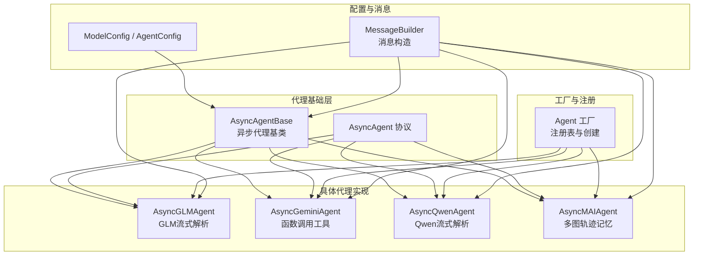
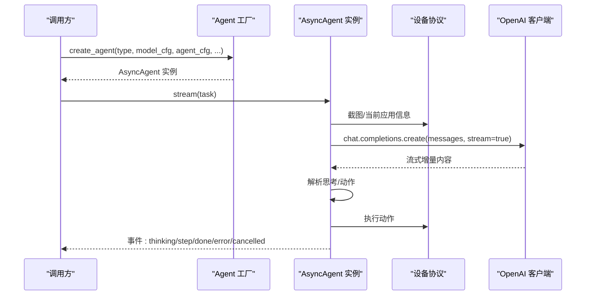
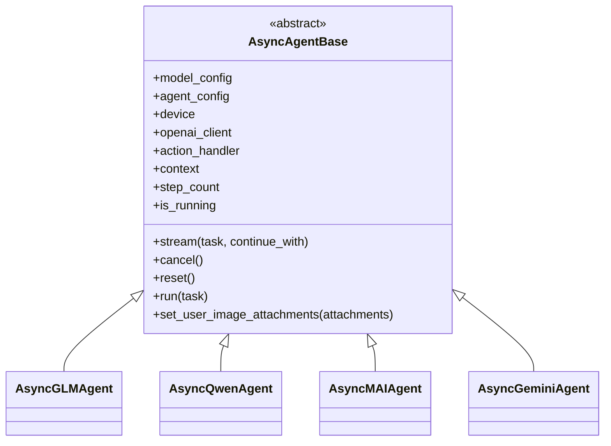
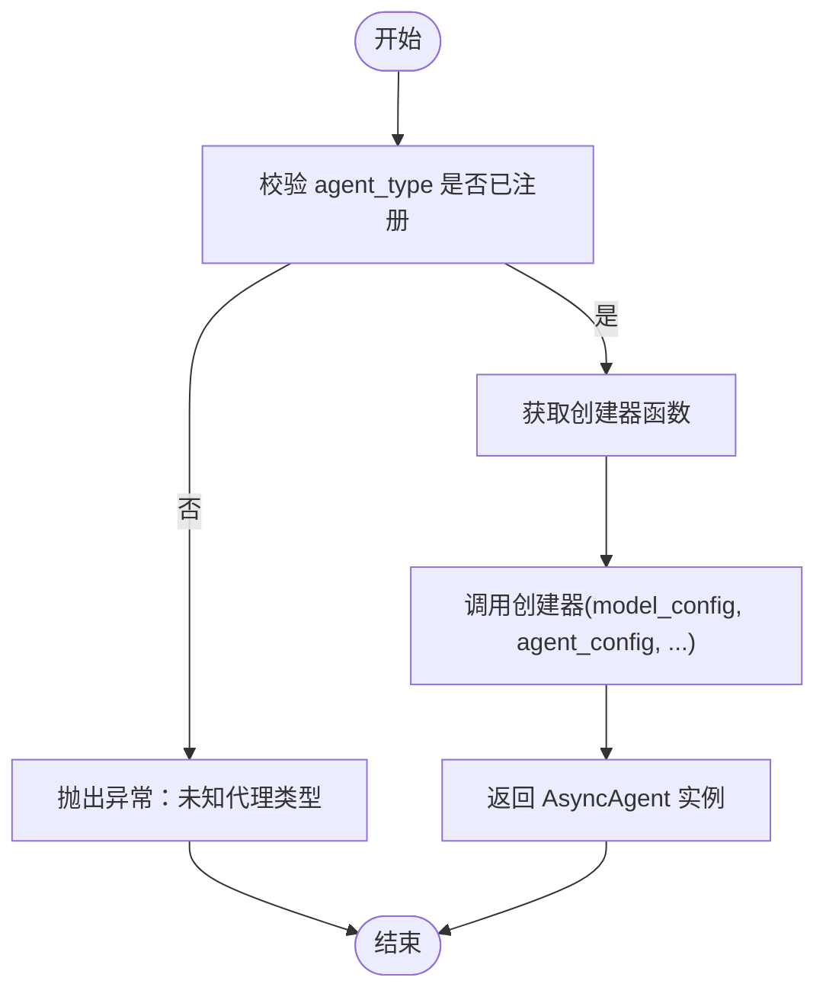
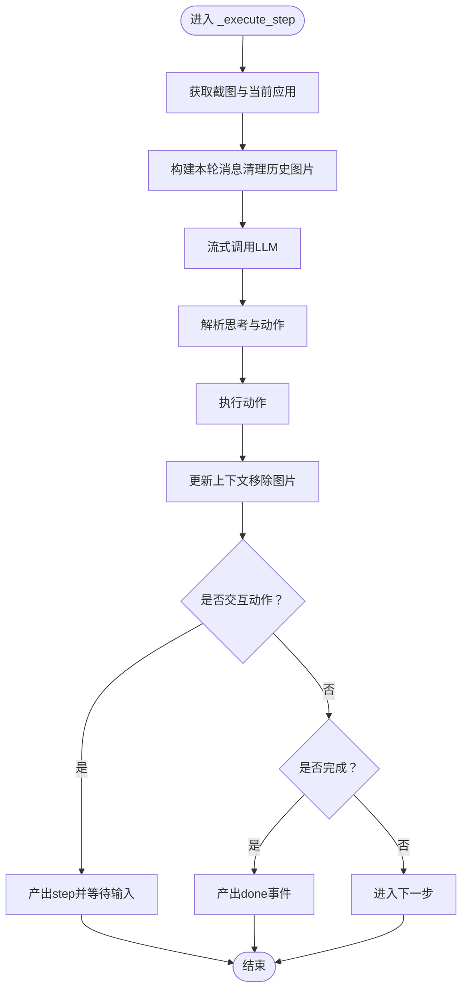
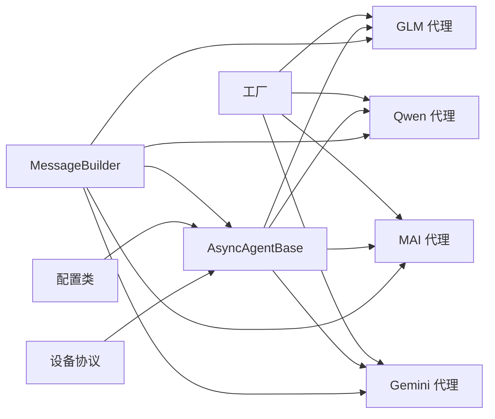

# AI代理扩展

<cite>
**本文引用的文件**
- [async_agent_base.py](file://AutoGLM_GUI/agents/base/async_agent_base.py)
- [factory.py](file://AutoGLM_GUI/agents/factory.py)
- [async_agent.py（GLM）](file://AutoGLM_GUI/agents/glm/async_agent.py)
- [async_agent.py（Gemini）](file://AutoGLM_GUI/agents/gemini/async_agent.py)
- [async_agent.py（Qwen）](file://AutoGLM_GUI/agents/qwen/async_agent.py)
- [async_agent.py（MAI）](file://AutoGLM_GUI/agents/mai/async_agent.py)
- [protocols.py](file://AutoGLM_GUI/agents/protocols.py)
- [config.py](file://AutoGLM_GUI/config.py)
- [message_builder.py](file://AutoGLM_GUI/model/message_builder.py)
- [types.py（actions）](file://AutoGLM_GUI/actions/types.py)
- [AGENTS.md](file://AGENTS.md)
- [__init__.py（agents包）](file://AutoGLM_GUI/agents/__init__.py)
</cite>

## 目录
1. [简介](#简介)
2. [项目结构](#项目结构)
3. [核心组件](#核心组件)
4. [架构总览](#架构总览)
5. [详细组件分析](#详细组件分析)
6. [依赖分析](#依赖分析)
7. [性能考量](#性能考量)
8. [故障排查指南](#故障排查指南)
9. [结论](#结论)
10. [附录](#附录)

## 简介
本指南面向希望扩展与定制AI代理的开发者，围绕AsyncAgentBase基类的设计理念与抽象方法实现要求，系统讲解如何继承该基类创建自定义AI代理；详解_get_default_system_prompt、_prepare_initial_context与_execute_step三个核心方法的职责与实现要点；并提供完整的代理注册流程、工厂模式集成与配置管理方法。文档还结合GLM、Gemini、Qwen、MAI等现有代理实现进行对比分析，总结最佳实践与调试技巧，帮助快速、稳定地开发新的代理。

## 项目结构
AutoGLM-GUI采用分层与按功能域组织的目录结构，其中agents子系统负责不同模型/框架适配的异步代理实现，工厂模式统一创建与注册，配置类解耦模型与代理行为控制。

图表来源
- [async_agent_base.py:32-439](file://AutoGLM_GUI/agents/base/async_agent_base.py#L32-L439)
- [factory.py:20-283](file://AutoGLM_GUI/agents/factory.py#L20-L283)
- [async_agent.py（GLM）:40-428](file://AutoGLM_GUI/agents/glm/async_agent.py#L40-L428)
- [async_agent.py（Gemini）:29-453](file://AutoGLM_GUI/agents/gemini/async_agent.py#L29-L453)
- [async_agent.py（Qwen）:49-463](file://AutoGLM_GUI/agents/qwen/async_agent.py#L49-L463)
- [async_agent.py（MAI）:34-431](file://AutoGLM_GUI/agents/mai/async_agent.py#L34-L431)
- [protocols.py:9-95](file://AutoGLM_GUI/agents/protocols.py#L9-L95)
- [config.py:18-89](file://AutoGLM_GUI/config.py#L18-L89)
- [message_builder.py:6-102](file://AutoGLM_GUI/model/message_builder.py#L6-L102)

章节来源
- [AGENTS.md:1-103](file://AGENTS.md#L1-L103)

## 核心组件
- AsyncAgentBase：异步代理基类，提供OpenAI客户端初始化、ActionHandler初始化、流式主循环、取消/重置/运行、上下文与步数管理等共享能力。
- AsyncAgent协议：定义统一的异步代理接口，支持流式输出、取消、单步执行等。
- 工厂与注册：通过注册表维护agent_type到创建器的映射，支持动态创建与查询。
- 配置类：ModelConfig与AgentConfig分别承载模型参数与代理行为参数。
- 消息构造器：MessageBuilder统一构建多模态消息，确保历史中不残留过期图片。

章节来源
- [async_agent_base.py:32-439](file://AutoGLM_GUI/agents/base/async_agent_base.py#L32-L439)
- [protocols.py:9-95](file://AutoGLM_GUI/agents/protocols.py#L9-L95)
- [factory.py:20-283](file://AutoGLM_GUI/agents/factory.py#L20-L283)
- [config.py:18-89](file://AutoGLM_GUI/config.py#L18-L89)
- [message_builder.py:6-102](file://AutoGLM_GUI/model/message_builder.py#L6-L102)

## 架构总览
下图展示从工厂创建代理到代理执行一次完整流式步骤的调用链路与关键事件类型。

图表来源
- [factory.py:49-98](file://AutoGLM_GUI/agents/factory.py#L49-L98)
- [async_agent_base.py:112-401](file://AutoGLM_GUI/agents/base/async_agent_base.py#L112-L401)
- [async_agent.py（GLM）:81-340](file://AutoGLM_GUI/agents/glm/async_agent.py#L81-L340)
- [async_agent.py（Qwen）:131-399](file://AutoGLM_GUI/agents/qwen/async_agent.py#L131-L399)
- [async_agent.py（MAI）:80-319](file://AutoGLM_GUI/agents/mai/async_agent.py#L80-L319)
- [async_agent.py（Gemini）:70-346](file://AutoGLM_GUI/agents/gemini/async_agent.py#L70-L346)

## 详细组件分析

### AsyncAgentBase 基类设计与抽象方法
- 设计目标
  - 将“设备交互、消息构建、流式执行、取消与限速”等横切关注点下沉至基类，子类仅聚焦于“系统提示词、初始上下文构建、单步执行”三件事。
  - 通过AsyncAgent协议约束统一接口，确保所有代理具备原生流式与取消能力。
- 关键职责
  - 初始化：OpenAI客户端、ActionHandler、设备、回调、系统提示词与上下文。
  - 流式主循环：准备初始状态、循环执行步骤、处理取消/超时/重复动作/无进展看门狗、产出事件。
  - 状态管理：步数、上下文、附件图片、运行状态、取消事件。
- 抽象方法（子类必须实现）
  - _get_default_system_prompt(lang)：返回默认系统提示词。
  - _prepare_initial_context(...)：构建首条用户消息并加入上下文。
  - _execute_step()：单步执行（截图→LLM→解析→动作→更新上下文），以异步生成器逐段产出事件。
- 共享能力
  - set_user_image_attachments：为下一次任务设置用户参考图。
  - cancel/reset/run/context/step_count/is_running：统一的生命周期与状态访问。

图表来源
- [async_agent_base.py:32-439](file://AutoGLM_GUI/agents/base/async_agent_base.py#L32-L439)
- [async_agent.py（GLM）:40-428](file://AutoGLM_GUI/agents/glm/async_agent.py#L40-L428)
- [async_agent.py（Qwen）:49-463](file://AutoGLM_GUI/agents/qwen/async_agent.py#L49-L463)
- [async_agent.py（MAI）:34-431](file://AutoGLM_GUI/agents/mai/async_agent.py#L34-L431)
- [async_agent.py（Gemini）:29-453](file://AutoGLM_GUI/agents/gemini/async_agent.py#L29-L453)

章节来源
- [async_agent_base.py:32-439](file://AutoGLM_GUI/agents/base/async_agent_base.py#L32-L439)
- [protocols.py:9-95](file://AutoGLM_GUI/agents/protocols.py#L9-L95)

### 工厂模式与代理注册
- 注册表：以agent_type为键，映射到创建器函数，便于动态扩展新代理。
- 创建流程：根据agent_type查找创建器，注入ModelConfig、AgentConfig、设备与回调，返回AsyncAgent实例。
- 内置注册：工厂内预注册了GLM、Gemini、Qwen、MAI、DroidRun、Midscene等代理类型。
- 包导出：agents/__init__.py对上层暴露register_agent/create_agent/list_agent_types/is_agent_type_registered等便捷入口。

图表来源
- [factory.py:49-98](file://AutoGLM_GUI/agents/factory.py#L49-L98)
- [__init__.py（agents包）:9-34](file://AutoGLM_GUI/agents/__init__.py#L9-L34)

章节来源
- [factory.py:20-283](file://AutoGLM_GUI/agents/factory.py#L20-L283)
- [__init__.py（agents包）:1-56](file://AutoGLM_GUI/agents/__init__.py#L1-L56)

### 配置管理与消息构建
- 配置类
  - ModelConfig：承载OpenAI兼容API的端点、密钥、模型名、采样参数、附加参数与语言。
  - AgentConfig：承载运行上限（步数/时长/不限）、设备ID、语言、系统提示词覆盖、详细日志开关等。
- 消息构建
  - MessageBuilder：统一创建system/user/assistant消息，支持多图拼接、移除历史图片、构建屏幕信息等，确保历史不携带过期图片。
- 动作结果
  - ActionResult：封装动作执行的成功与否、是否结束、消息与是否需要确认等。

章节来源
- [config.py:18-89](file://AutoGLM_GUI/config.py#L18-L89)
- [message_builder.py:6-102](file://AutoGLM_GUI/model/message_builder.py#L6-L102)
- [types.py（actions）:7-16](file://AutoGLM_GUI/actions/types.py#L7-L16)

### 三大核心方法实现要点

#### _get_default_system_prompt(lang)
- 职责：返回该代理的默认系统提示词，用于在未显式配置system_prompt时作为兜底。
- 实现建议：
  - 语言切换：根据lang返回对应语言的系统提示词。
  - 任务导向：明确角色定位、输出格式、交互边界与安全约束。
  - 可复用：尽量将提示词集中管理，避免散落代码。

章节来源
- [async_agent_base.py:85-88](file://AutoGLM_GUI/agents/base/async_agent_base.py#L85-L88)
- [async_agent.py（GLM）:65-66](file://AutoGLM_GUI/agents/glm/async_agent.py#L65-L66)
- [async_agent.py（Qwen）:74-75](file://AutoGLM_GUI/agents/qwen/async_agent.py#L74-L75)
- [async_agent.py（MAI）:64-65](file://AutoGLM_GUI/agents/mai/async_agent.py#L64-L65)
- [async_agent.py（Gemini）:42-43](file://AutoGLM_GUI/agents/gemini/async_agent.py#L42-L43)

#### _prepare_initial_context(task, screenshot_base64, current_app, reference_images)
- 职责：构建首条用户消息并加入上下文，通常包含任务、当前应用、可选参考图等。
- 实现要点：
  - 清晰的上下文结构：先放屏幕信息/任务说明，再放截图。
  - 参考图处理：通过MessageBuilder构建“用户参考图说明”，避免坐标混淆。
  - 历史清理：确保后续请求不再携带旧截图（由基类在每步末尾移除图片）。

章节来源
- [async_agent_base.py:90-99](file://AutoGLM_GUI/agents/base/async_agent_base.py#L90-L99)
- [async_agent.py（GLM）:68-80](file://AutoGLM_GUI/agents/glm/async_agent.py#L68-L80)
- [async_agent.py（Qwen）:77-90](file://AutoGLM_GUI/agents/qwen/async_agent.py#L77-L90)
- [async_agent.py（MAI）:67-79](file://AutoGLM_GUI/agents/mai/async_agent.py#L67-L79)
- [async_agent.py（Gemini）:45-68](file://AutoGLM_GUI/agents/gemini/async_agent.py#L45-L68)
- [message_builder.py:64-73](file://AutoGLM_GUI/model/message_builder.py#L64-L73)

#### _execute_step()
- 职责：单步执行的核心流程，必须返回异步生成器，逐段产出事件。
- 典型流程（以GLM/Qwen为例）：
  1) 获取截图与当前应用信息。
  2) 构建本轮消息（清理历史图片、加入屏幕信息/任务/参考图、当前截图）。
  3) 流式调用LLM，实时产出思考片段。
  4) 解析动作：从原始响应中抽取思考与动作，必要时做容错与回退。
  5) 执行动作并更新上下文。
  6) 产出step事件；若检测到交互动作（如Take_over/Interact），提前返回等待输入。
- MAI特有：
  - 使用TrajMemory构建多图历史上下文，支持带重试的解析与轨迹记录。
  - 每步重建消息列表而非累积历史，提升稳定性。

图表来源
- [async_agent.py（GLM）:81-340](file://AutoGLM_GUI/agents/glm/async_agent.py#L81-L340)
- [async_agent.py（Qwen）:131-399](file://AutoGLM_GUI/agents/qwen/async_agent.py#L131-L399)
- [async_agent.py（MAI）:80-319](file://AutoGLM_GUI/agents/mai/async_agent.py#L80-L319)

章节来源
- [async_agent_base.py:101-108](file://AutoGLM_GUI/agents/base/async_agent_base.py#L101-L108)
- [async_agent.py（GLM）:81-340](file://AutoGLM_GUI/agents/glm/async_agent.py#L81-L340)
- [async_agent.py（Qwen）:131-399](file://AutoGLM_GUI/agents/qwen/async_agent.py#L131-L399)
- [async_agent.py（MAI）:80-319](file://AutoGLM_GUI/agents/mai/async_agent.py#L80-L319)

### 现有代理实现对比分析

#### GLM 代理（流式解析）
- 特点：基于OpenAI兼容流式接口，解析<think>/answer或finish/do格式；每步清理历史图片，保证每次请求仅含当前截图。
- 优势：解析逻辑清晰，易于调试；支持详细日志与错误序列化。
- 适用场景：对输出格式可控、需要细粒度思考过程的任务。

章节来源
- [async_agent.py（GLM）:40-428](file://AutoGLM_GUI/agents/glm/async_agent.py#L40-L428)

#### Qwen 代理（流式解析 + 调试可视化）
- 特点：支持<thought>/answer格式，内置点击坐标可视化调试（在verbose模式下绘制红点）。
- 优势：便于定位点击位置问题；解析器对格式更宽松。
- 适用场景：需要高精度点击与可视化验证的场景。

章节来源
- [async_agent.py（Qwen）:49-463](file://AutoGLM_GUI/agents/qwen/async_agent.py#L49-L463)

#### MAI 代理（多图历史 + 重试）
- 特点：不使用基类上下文累积，每步通过TrajMemory重建消息；支持多图历史与最多3次解析/模型调用重试。
- 优势：更强的鲁棒性；适合复杂多步骤任务。
- 适用场景：长链路、多步骤、需要稳定性的自动化任务。

章节来源
- [async_agent.py（MAI）:34-431](file://AutoGLM_GUI/agents/mai/async_agent.py#L34-L431)

#### Gemini 代理（函数调用工具）
- 特点：通过OpenAI兼容的function calling接口，将动作映射为工具调用；具备无效工具调用次数限制与错误恢复。
- 优势：与通用视觉模型对接简单；工具schema标准化。
- 适用场景：通用视觉模型（如Gemini、GPT-4o、Claude）统一接入。

章节来源
- [async_agent.py（Gemini）:29-453](file://AutoGLM_GUI/agents/gemini/async_agent.py#L29-L453)

## 依赖分析
- 组件耦合
  - 代理实现依赖AsyncAgentBase与MessageBuilder，耦合度低、内聚度高。
  - 工厂与代理实现通过字符串键解耦，新增代理无需修改既有代码。
- 外部依赖
  - OpenAI兼容API：用于流式对话与工具调用。
  - 设备协议：统一截图与当前应用获取。
  - 日志与追踪：统一的trace_span与错误序列化，便于可观测性。
- 循环依赖
  - 未发现循环导入；工厂与代理通过延迟导入避免循环。

图表来源
- [factory.py:113-282](file://AutoGLM_GUI/agents/factory.py#L113-L282)
- [async_agent_base.py:42-82](file://AutoGLM_GUI/agents/base/async_agent_base.py#L42-L82)
- [message_builder.py:6-102](file://AutoGLM_GUI/model/message_builder.py#L6-L102)
- [config.py:18-89](file://AutoGLM_GUI/config.py#L18-L89)

章节来源
- [factory.py:20-283](file://AutoGLM_GUI/agents/factory.py#L20-L283)
- [async_agent_base.py:32-110](file://AutoGLM_GUI/agents/base/async_agent_base.py#L32-L110)

## 性能考量
- 流式调用：优先使用流式接口，尽早产出thinking片段，降低首卡顿。
- 图片管理：严格遵循“每步仅保留当前截图”的策略，避免历史图片累积导致请求体过大。
- 重试与容错：MAI的多次重试与GLM/Qwen的解析回退，可在不稳定输出时提升成功率。
- 取消与限速：利用基类的取消事件与看门狗（重复动作/无进展）及时止损，避免长时间无效尝试。
- 观测性：开启trace与详细日志，定位耗时瓶颈（截图、LLM、解析、动作执行）。

## 故障排查指南
- 常见问题
  - 设备错误：截图/应用信息获取失败，代理会产出error与step事件，随后结束。
  - LLM错误：捕获异常并序列化错误详情，返回error与step事件。
  - 无效工具调用（Gemini）：超过阈值后终止，避免无限循环。
  - 解析失败（GLM/Qwen/MAI）：触发重试或回退为finish，必要时记录详细日志。
- 调试步骤
  - 复现问题并运行后，从任务接口复制trace_id。
  - 在JSONL追踪文件中过滤该trace_id，查看span名称、父span、耗时与属性。
  - 使用历史中的时间芯片快速定位耗时阶段（截图、应用检测、LLM、解析、动作执行、ADB、sleep等）。
  - 参考AGENTS.md中的调试工作流与追踪覆盖说明。

章节来源
- [AGENTS.md:51-103](file://AGENTS.md#L51-L103)
- [async_agent.py（GLM）:196-239](file://AutoGLM_GUI/agents/glm/async_agent.py#L196-L239)
- [async_agent.py（Qwen）:255-271](file://AutoGLM_GUI/agents/qwen/async_agent.py#L255-L271)
- [async_agent.py（Gemini）:153-181](file://AutoGLM_GUI/agents/gemini/async_agent.py#L153-L181)
- [async_agent.py（MAI）:193-232](file://AutoGLM_GUI/agents/mai/async_agent.py#L193-L232)

## 结论
通过AsyncAgentBase与工厂模式，AutoGLM-GUI实现了高度可扩展的异步代理体系。开发者只需专注于三个核心方法的实现与上下文构建，即可快速接入新模型或新范式。配合完善的配置管理、消息构建与可观测性工具，能够稳定地支撑从简单到复杂的自动化任务。

## 附录

### 新代理开发最佳实践
- 保持最小改动：复用MessageBuilder与基类上下文管理，避免重复造轮子。
- 明确事件语义：在每个关键阶段产出thinking/step/done/error/cancelled，便于前端与上层消费。
- 重视错误与重试：对LLM与解析失败设计合理的重试与回退策略。
- 严格图片管理：确保历史不携带过期图片，避免请求体膨胀与坐标混淆。
- 开启详细日志：在开发阶段启用verbose，便于定位问题。

### 新代理注册与使用流程
- 定义代理类：继承AsyncAgentBase并实现三个抽象方法。
- 定义创建器：编写工厂创建器函数，接收model_config、agent_config、agent_specific_config、device与回调。
- 注册代理：调用register_agent(agent_type, creator)完成注册。
- 使用代理：通过create_agent(agent_type, ...)创建实例，随后调用stream/run/cancel/reset。

章节来源
- [factory.py:24-98](file://AutoGLM_GUI/agents/factory.py#L24-L98)
- [__init__.py（agents包）:9-34](file://AutoGLM_GUI/agents/__init__.py#L9-L34)