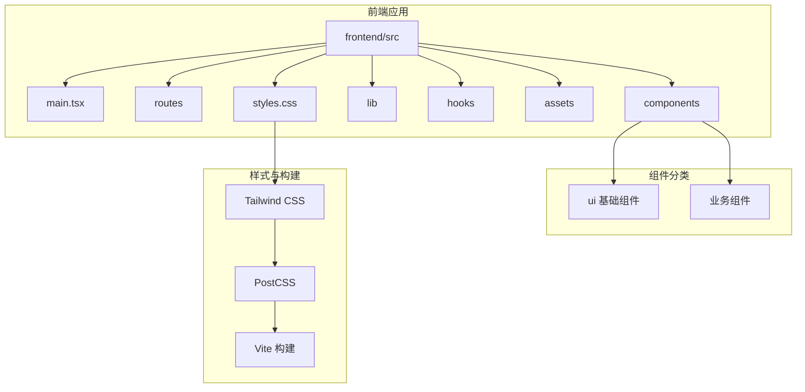
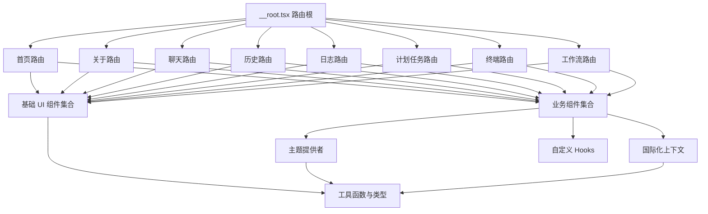
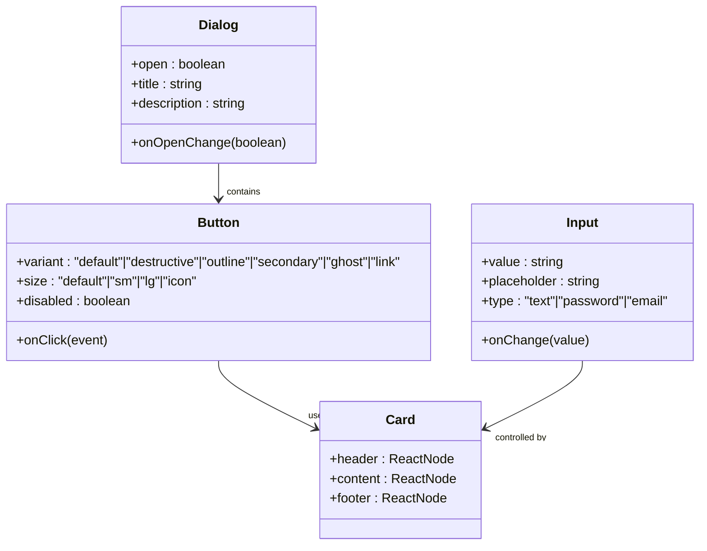
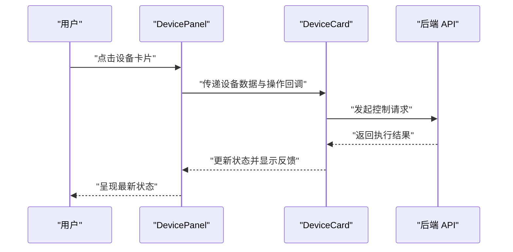
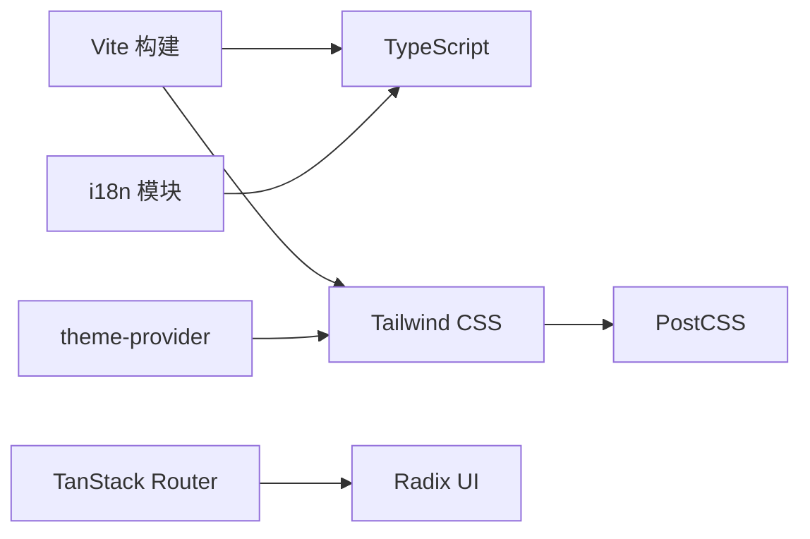

# 前端组件扩展

<cite>
**本文档引用的文件**
- [frontend/src/components/ui/button.tsx](file://frontend/src/components/ui/button.tsx)
- [frontend/src/components/ui/dialog.tsx](file://frontend/src/components/ui/dialog.tsx)
- [frontend/src/components/ui/input.tsx](file://frontend/src/components/ui/input.tsx)
- [frontend/src/components/ui/card.tsx](file://frontend/src/components/ui/card.tsx)
- [frontend/src/components/ui/tabs.tsx](file://frontend/src/components/ui/tabs.tsx)
- [frontend/src/components/ui/select.tsx](file://frontend/src/components/ui/select.tsx)
- [frontend/src/components/ui/textarea.tsx](file://frontend/src/components/ui/textarea.tsx)
- [frontend/src/components/ui/badge.tsx](file://frontend/src/components/ui/badge.tsx)
- [frontend/src/components/ui/switch.tsx](file://frontend/src/components/ui/switch.tsx)
- [frontend/src/components/ui/tooltip.tsx](file://frontend/src/components/ui/tooltip.tsx)
- [frontend/src/components/ui/alert-dialog.tsx](file://frontend/src/components/ui/alert-dialog.tsx)
- [frontend/src/components/ui/dropdown-menu.tsx](file://frontend/src/components/ui/dropdown-menu.tsx)
- [frontend/src/components/ui/popover.tsx](file://frontend/src/components/ui/popover.tsx)
- [frontend/src/components/ui/sheet.tsx](file://frontend/src/components/ui/sheet.tsx)
- [frontend/src/components/ui/sidebar.tsx](file://frontend/src/components/ui/sidebar.tsx)
- [frontend/src/components/ui/scroll-area.tsx](file://frontend/src/components/ui/scroll-area.tsx)
- [frontend/src/components/ui/separator.tsx](file://frontend/src/components/ui/separator.tsx)
- [frontend/src/components/ui/progress.tsx](file://frontend/src/components/ui/progress.tsx)
- [frontend/src/components/ui/skeleton.tsx](file://frontend/src/components/ui/skeleton.tsx)
- [frontend/src/components/ui/collapsible.tsx](file://frontend/src/components/ui/collapsible.tsx)
- [frontend/src/components/ui/image-preview.tsx](file://frontend/src/components/ui/image-preview.tsx)
- [frontend/src/components/ui/label.tsx](file://frontend/src/components/ui/label.tsx)
- [frontend/src/components/DeviceCard.tsx](file://frontend/src/components/DeviceCard.tsx)
- [frontend/src/components/DevicePanel.tsx](file://frontend/src/components/DevicePanel.tsx)
- [frontend/src/components/ChatKitPanel.tsx](file://frontend/src/components/ChatKitPanel.tsx)
- [frontend/src/components/ConfirmDialog.tsx](file://frontend/src/components/ConfirmDialog.tsx)
- [frontend/src/components/GroupManageDialog.tsx](file://frontend/src/components/GroupManageDialog.tsx)
- [frontend/src/components/GroupedDeviceList.tsx](file://frontend/src/components/GroupedDeviceList.tsx)
- [frontend/src/components/HistoryItemCard.tsx](file://frontend/src/components/HistoryItemCard.tsx)
- [frontend/src/components/MarkdownContent.tsx](file://frontend/src/components/MarkdownContent.tsx)
- [frontend/src/components/NavigationSidebar.tsx](file://frontend/src/components/NavigationSidebar.tsx)
- [frontend/src/components/ResizableHandle.tsx](file://frontend/src/components/ResizableHandle.tsx)
- [frontend/src/components/ScrcpyPlayer.tsx](file://frontend/src/components/ScrcpyPlayer.tsx)
- [frontend/src/components/ThemeToggle.tsx](file://frontend/src/components/ThemeToggle.tsx)
- [frontend/src/components/Toast.tsx](file://frontend/src/components/Toast.tsx)
- [frontend/src/components/WidthControl.tsx](file://frontend/src/components/WidthControl.tsx)
- [frontend/src/hooks/use-mobile.ts](file://frontend/src/hooks/use-mobile.ts)
- [frontend/src/hooks/useDebouncedState.ts](file://frontend/src/hooks/useDebouncedState.ts)
- [frontend/src/hooks/useDeviceGroups.ts](file://frontend/src/hooks/useDeviceGroups.ts)
- [frontend/src/hooks/useLocalStorage.ts](file://frontend/src/hooks/useLocalStorage.ts)
- [frontend/src/lib/theme-provider.tsx](file://frontend/src/lib/theme-provider.tsx)
- [frontend/src/lib/utils.ts](file://frontend/src/lib/utils.ts)
- [frontend/src/lib/device-context.tsx](file://frontend/src/lib/device-context.tsx)
- [frontend/src/lib/i18n-context.tsx](file://frontend/src/lib/i18n-context.tsx)
- [frontend/src/lib/i18n.ts](file://frontend/src/lib/i18n.ts)
- [frontend/package.json](file://frontend/package.json)
- [frontend/components.json](file://frontend/components.json)
- [frontend/postcss.config.mjs](file://frontend/postcss.config.mjs)
- [frontend/vite.config.js](file://frontend/vite.config.js)
- [frontend/tsconfig.json](file://frontend/tsconfig.json)
- [frontend/src/styles.css](file://frontend/src/styles.css)
- [frontend/src/main.tsx](file://frontend/src/main.tsx)
- [frontend/src/routes/__root.tsx](file://frontend/src/routes/__root.tsx)
- [frontend/src/api.ts](file://frontend/src/api.ts)
</cite>

## 目录
1. [简介](#简介)
2. [项目结构](#项目结构)
3. [核心组件](#核心组件)
4. [架构总览](#架构总览)
5. [详细组件分析](#详细组件分析)
6. [依赖分析](#依赖分析)
7. [性能考虑](#性能考虑)
8. [故障排除指南](#故障排除指南)
9. [结论](#结论)
10. [附录](#附录)

## 简介
本指南面向需要在现有前端代码库中扩展新组件的开发者，重点覆盖以下方面：
- React 组件架构与设计原则
- Tailwind CSS 样式系统与原子化样式组织方式
- 基础 UI 组件（如 button、dialog、input 等）与业务组件（如 DeviceCard、DevicePanel 等）的实现模式
- Props 接口设计、事件处理机制与状态管理方法
- 组件复用性设计、主题定制与响应式布局
- 组件测试策略、性能优化与无障碍访问支持最佳实践

## 项目结构
前端采用基于功能域的组件组织方式，核心位于 frontend/src/components 目录，按“基础 UI 组件”和“业务组件”分层管理；样式通过 Tailwind CSS 与自定义 CSS 集成；路由使用 TanStack Router；国际化、主题与工具函数分别置于 lib、hooks 目录。

图示来源
- [frontend/src/main.tsx](file://frontend/src/main.tsx)
- [frontend/src/routes/__root.tsx](file://frontend/src/routes/__root.tsx)
- [frontend/src/styles.css](file://frontend/src/styles.css)
- [frontend/postcss.config.mjs](file://frontend/postcss.config.mjs)
- [frontend/vite.config.js](file://frontend/vite.config.js)

章节来源
- [frontend/src/main.tsx](file://frontend/src/main.tsx)
- [frontend/src/routes/__root.tsx](file://frontend/src/routes/__root.tsx)
- [frontend/src/styles.css](file://frontend/src/styles.css)
- [frontend/postcss.config.mjs](file://frontend/postcss.config.mjs)
- [frontend/vite.config.js](file://frontend/vite.config.js)

## 核心组件
本节聚焦基础 UI 组件与业务组件的设计模式与实现要点，帮助你快速理解如何开发新组件。

- 基础 UI 组件（以 button、dialog、input 等为代表）
  - 设计理念：以 Radix UI 为组合器，结合 Tailwind 原子类实现一致的视觉与交互体验
  - 复用性：通过变体（variants）、尺寸（sizes）、颜色（colors）等组合参数，统一风格
  - 可访问性：遵循语义化标签与键盘导航，确保无障碍可用
  - 示例参考路径：
    - [frontend/src/components/ui/button.tsx](file://frontend/src/components/ui/button.tsx)
    - [frontend/src/components/ui/dialog.tsx](file://frontend/src/components/ui/dialog.tsx)
    - [frontend/src/components/ui/input.tsx](file://frontend/src/components/ui/input.tsx)
    - [frontend/src/components/ui/card.tsx](file://frontend/src/components/ui/card.tsx)
    - [frontend/src/components/ui/tabs.tsx](file://frontend/src/components/ui/tabs.tsx)
    - [frontend/src/components/ui/select.tsx](file://frontend/src/components/ui/select.tsx)
    - [frontend/src/components/ui/textarea.tsx](file://frontend/src/components/ui/textarea.tsx)
    - [frontend/src/components/ui/badge.tsx](file://frontend/src/components/ui/badge.tsx)
    - [frontend/src/components/ui/switch.tsx](file://frontend/src/components/ui/switch.tsx)
    - [frontend/src/components/ui/tooltip.tsx](file://frontend/src/components/ui/tooltip.tsx)
    - [frontend/src/components/ui/alert-dialog.tsx](file://frontend/src/components/ui/alert-dialog.tsx)
    - [frontend/src/components/ui/dropdown-menu.tsx](file://frontend/src/components/ui/dropdown-menu.tsx)
    - [frontend/src/components/ui/popover.tsx](file://frontend/src/components/ui/popover.tsx)
    - [frontend/src/components/ui/sheet.tsx](file://frontend/src/components/ui/sheet.tsx)
    - [frontend/src/components/ui/sidebar.tsx](file://frontend/src/components/ui/sidebar.tsx)
    - [frontend/src/components/ui/scroll-area.tsx](file://frontend/src/components/ui/scroll-area.tsx)
    - [frontend/src/components/ui/separator.tsx](file://frontend/src/components/ui/separator.tsx)
    - [frontend/src/components/ui/progress.tsx](file://frontend/src/components/ui/progress.tsx)
    - [frontend/src/components/ui/skeleton.tsx](file://frontend/src/components/ui/skeleton.tsx)
    - [frontend/src/components/ui/collapsible.tsx](file://frontend/src/components/ui/collapsible.tsx)
    - [frontend/src/components/ui/image-preview.tsx](file://frontend/src/components/ui/image-preview.tsx)
    - [frontend/src/components/ui/label.tsx](file://frontend/src/components/ui/label.tsx)

- 业务组件（以 DeviceCard、DevicePanel、ChatKitPanel 等为代表）
  - 设计理念：围绕具体业务场景抽象组件，封装状态、副作用与交互逻辑
  - 数据流：通过上下文或 props 注入数据，内部通过 hooks 管理本地状态
  - 示例参考路径：
    - [frontend/src/components/DeviceCard.tsx](file://frontend/src/components/DeviceCard.tsx)
    - [frontend/src/components/DevicePanel.tsx](file://frontend/src/components/DevicePanel.tsx)
    - [frontend/src/components/ChatKitPanel.tsx](file://frontend/src/components/ChatKitPanel.tsx)
    - [frontend/src/components/ConfirmDialog.tsx](file://frontend/src/components/ConfirmDialog.tsx)
    - [frontend/src/components/GroupManageDialog.tsx](file://frontend/src/components/GroupManageDialog.tsx)
    - [frontend/src/components/GroupedDeviceList.tsx](file://frontend/src/components/GroupedDeviceList.tsx)
    - [frontend/src/components/HistoryItemCard.tsx](file://frontend/src/components/HistoryItemCard.tsx)
    - [frontend/src/components/MarkdownContent.tsx](file://frontend/src/components/MarkdownContent.tsx)
    - [frontend/src/components/NavigationSidebar.tsx](file://frontend/src/components/NavigationSidebar.tsx)
    - [frontend/src/components/ResizableHandle.tsx](file://frontend/src/components/ResizableHandle.tsx)
    - [frontend/src/components/ScrcpyPlayer.tsx](file://frontend/src/components/ScrcpyPlayer.tsx)
    - [frontend/src/components/ThemeToggle.tsx](file://frontend/src/components/ThemeToggle.tsx)
    - [frontend/src/components/Toast.tsx](file://frontend/src/components/Toast.tsx)
    - [frontend/src/components/WidthControl.tsx](file://frontend/src/components/WidthControl.tsx)

章节来源
- [frontend/src/components/ui/button.tsx](file://frontend/src/components/ui/button.tsx)
- [frontend/src/components/ui/dialog.tsx](file://frontend/src/components/ui/dialog.tsx)
- [frontend/src/components/ui/input.tsx](file://frontend/src/components/ui/input.tsx)
- [frontend/src/components/ui/card.tsx](file://frontend/src/components/ui/card.tsx)
- [frontend/src/components/DeviceCard.tsx](file://frontend/src/components/DeviceCard.tsx)
- [frontend/src/components/DevicePanel.tsx](file://frontend/src/components/DevicePanel.tsx)
- [frontend/src/components/ChatKitPanel.tsx](file://frontend/src/components/ChatKitPanel.tsx)

## 架构总览
下图展示了前端应用的组件层次、样式集成与路由关系，帮助你把握整体架构与扩展点。

图示来源
- [frontend/src/routes/__root.tsx](file://frontend/src/routes/__root.tsx)
- [frontend/src/components/ui/button.tsx](file://frontend/src/components/ui/button.tsx)
- [frontend/src/components/DeviceCard.tsx](file://frontend/src/components/DeviceCard.tsx)
- [frontend/src/lib/theme-provider.tsx](file://frontend/src/lib/theme-provider.tsx)
- [frontend/src/lib/i18n-context.tsx](file://frontend/src/lib/i18n-context.tsx)
- [frontend/src/lib/utils.ts](file://frontend/src/lib/utils.ts)

章节来源
- [frontend/src/routes/__root.tsx](file://frontend/src/routes/__root.tsx)
- [frontend/src/lib/theme-provider.tsx](file://frontend/src/lib/theme-provider.tsx)
- [frontend/src/lib/i18n-context.tsx](file://frontend/src/lib/i18n-context.tsx)
- [frontend/src/lib/utils.ts](file://frontend/src/lib/utils.ts)

## 详细组件分析

### 基础 UI 组件模式
- 设计原则
  - 使用 Radix UI 提供可组合的无障碍原语，确保键盘可达与语义正确
  - 通过 Tailwind 原子类实现一致的尺寸、颜色与间距体系
  - 封装变体（如 primary、secondary、ghost）与尺寸（sm、md、lg），提升复用性
- 典型实现模式
  - 组合变体与尺寸：通过组合 className 与条件渲染实现不同外观
  - 事件透传：将 onClick、onKeyDown 等事件向上透传，保持行为一致性
  - 受控/非受控：根据场景选择受控（controlled）或非受控（uncontrolled）模式
- 示例参考路径
  - [frontend/src/components/ui/button.tsx](file://frontend/src/components/ui/button.tsx)
  - [frontend/src/components/ui/dialog.tsx](file://frontend/src/components/ui/dialog.tsx)
  - [frontend/src/components/ui/input.tsx](file://frontend/src/components/ui/input.tsx)
  - [frontend/src/components/ui/card.tsx](file://frontend/src/components/ui/card.tsx)
  - [frontend/src/components/ui/tabs.tsx](file://frontend/src/components/ui/tabs.tsx)
  - [frontend/src/components/ui/select.tsx](file://frontend/src/components/ui/select.tsx)
  - [frontend/src/components/ui/textarea.tsx](file://frontend/src/components/ui/textarea.tsx)
  - [frontend/src/components/ui/badge.tsx](file://frontend/src/components/ui/badge.tsx)
  - [frontend/src/components/ui/switch.tsx](file://frontend/src/components/ui/switch.tsx)
  - [frontend/src/components/ui/tooltip.tsx](file://frontend/src/components/ui/tooltip.tsx)
  - [frontend/src/components/ui/alert-dialog.tsx](file://frontend/src/components/ui/alert-dialog.tsx)
  - [frontend/src/components/ui/dropdown-menu.tsx](file://frontend/src/components/ui/dropdown-menu.tsx)
  - [frontend/src/components/ui/popover.tsx](file://frontend/src/components/ui/popover.tsx)
  - [frontend/src/components/ui/sheet.tsx](file://frontend/src/components/ui/sheet.tsx)
  - [frontend/src/components/ui/sidebar.tsx](file://frontend/src/components/ui/sidebar.tsx)
  - [frontend/src/components/ui/scroll-area.tsx](file://frontend/src/components/ui/scroll-area.tsx)
  - [frontend/src/components/ui/separator.tsx](file://frontend/src/components/ui/separator.tsx)
  - [frontend/src/components/ui/progress.tsx](file://frontend/src/components/ui/progress.tsx)
  - [frontend/src/components/ui/skeleton.tsx](file://frontend/src/components/ui/skeleton.tsx)
  - [frontend/src/components/ui/collapsible.tsx](file://frontend/src/components/ui/collapsible.tsx)
  - [frontend/src/components/ui/image-preview.tsx](file://frontend/src/components/ui/image-preview.tsx)
  - [frontend/src/components/ui/label.tsx](file://frontend/src/components/ui/label.tsx)

图示来源
- [frontend/src/components/ui/button.tsx](file://frontend/src/components/ui/button.tsx)
- [frontend/src/components/ui/dialog.tsx](file://frontend/src/components/ui/dialog.tsx)
- [frontend/src/components/ui/input.tsx](file://frontend/src/components/ui/input.tsx)
- [frontend/src/components/ui/card.tsx](file://frontend/src/components/ui/card.tsx)

章节来源
- [frontend/src/components/ui/button.tsx](file://frontend/src/components/ui/button.tsx)
- [frontend/src/components/ui/dialog.tsx](file://frontend/src/components/ui/dialog.tsx)
- [frontend/src/components/ui/input.tsx](file://frontend/src/components/ui/input.tsx)
- [frontend/src/components/ui/card.tsx](file://frontend/src/components/ui/card.tsx)

### 业务组件模式
- 设计原则
  - 围绕业务场景抽象，封装状态与副作用，避免在父组件中重复实现
  - 通过上下文注入设备、会话、配置等全局信息，降低耦合
  - 事件驱动：通过回调或事件总线传递用户操作结果
- 典型实现模式
  - 设备相关组件：DeviceCard、DevicePanel、DeviceSidebar 等，负责展示设备状态、触发控制动作
  - 交互面板：ChatKitPanel、ScrcpyPlayer 等，承载实时交互与媒体播放
  - 对话与确认：ConfirmDialog、GroupManageDialog 等，统一处理用户确认与输入
- 示例参考路径
  - [frontend/src/components/DeviceCard.tsx](file://frontend/src/components/DeviceCard.tsx)
  - [frontend/src/components/DevicePanel.tsx](file://frontend/src/components/DevicePanel.tsx)
  - [frontend/src/components/ChatKitPanel.tsx](file://frontend/src/components/ChatKitPanel.tsx)
  - [frontend/src/components/ConfirmDialog.tsx](file://frontend/src/components/ConfirmDialog.tsx)
  - [frontend/src/components/GroupManageDialog.tsx](file://frontend/src/components/GroupManageDialog.tsx)
  - [frontend/src/components/GroupedDeviceList.tsx](file://frontend/src/components/GroupedDeviceList.tsx)
  - [frontend/src/components/HistoryItemCard.tsx](file://frontend/src/components/HistoryItemCard.tsx)
  - [frontend/src/components/MarkdownContent.tsx](file://frontend/src/components/MarkdownContent.tsx)
  - [frontend/src/components/NavigationSidebar.tsx](file://frontend/src/components/NavigationSidebar.tsx)
  - [frontend/src/components/ResizableHandle.tsx](file://frontend/src/components/ResizableHandle.tsx)
  - [frontend/src/components/ScrcpyPlayer.tsx](file://frontend/src/components/ScrcpyPlayer.tsx)
  - [frontend/src/components/ThemeToggle.tsx](file://frontend/src/components/ThemeToggle.tsx)
  - [frontend/src/components/Toast.tsx](file://frontend/src/components/Toast.tsx)
  - [frontend/src/components/WidthControl.tsx](file://frontend/src/components/WidthControl.tsx)

图示来源
- [frontend/src/components/DevicePanel.tsx](file://frontend/src/components/DevicePanel.tsx)
- [frontend/src/components/DeviceCard.tsx](file://frontend/src/components/DeviceCard.tsx)
- [frontend/src/api.ts](file://frontend/src/api.ts)

章节来源
- [frontend/src/components/DeviceCard.tsx](file://frontend/src/components/DeviceCard.tsx)
- [frontend/src/components/DevicePanel.tsx](file://frontend/src/components/DevicePanel.tsx)
- [frontend/src/components/ChatKitPanel.tsx](file://frontend/src/components/ChatKitPanel.tsx)
- [frontend/src/api.ts](file://frontend/src/api.ts)

### Props 接口设计与事件处理
- Props 设计
  - 必需字段：明确标识必填属性，减少运行时错误
  - 可选字段：提供默认值或空态处理，保证组件健壮性
  - 事件回调：以 onXxx 命名，统一参数签名，便于组合与测试
- 事件处理
  - 冒泡控制：必要时阻止事件冒泡，避免意外触发父级逻辑
  - 键盘支持：为可交互元素提供键盘可达性（Tab、Enter、Space）
- 状态管理
  - 受控组件：由父组件管理状态，适合表单与多组件联动
  - 非受控组件：内部维护本地状态，适合一次性交互
  - Hooks：利用 useReducer 或自定义 Hooks 管理复杂状态机

章节来源
- [frontend/src/components/ui/button.tsx](file://frontend/src/components/ui/button.tsx)
- [frontend/src/components/ui/dialog.tsx](file://frontend/src/components/ui/dialog.tsx)
- [frontend/src/components/ui/input.tsx](file://frontend/src/components/ui/input.tsx)
- [frontend/src/hooks/useDebouncedState.ts](file://frontend/src/hooks/useDebouncedState.ts)

### 主题定制与响应式布局
- 主题定制
  - 使用主题提供者集中管理明暗主题切换与品牌色系
  - 通过 CSS 变量与 Tailwind 配置扩展主题变量，实现一键换肤
- 响应式布局
  - 基于 Tailwind 断点（sm、md、lg、xl、2xl）适配多端
  - 使用 Flexbox/Grid 实现弹性布局，配合组件容器实现自适应

章节来源
- [frontend/src/lib/theme-provider.tsx](file://frontend/src/lib/theme-provider.tsx)
- [frontend/src/styles.css](file://frontend/src/styles.css)
- [frontend/postcss.config.mjs](file://frontend/postcss.config.mjs)

### 组件复用性设计
- 抽象通用能力：将通用交互（加载、错误、空态）抽象为高阶组件或渲染函数
- 参数化：通过 className、children、asChild 等参数增强可定制性
- 组合优先：优先使用组合而非继承，降低耦合度

章节来源
- [frontend/src/components/ui/card.tsx](file://frontend/src/components/ui/card.tsx)
- [frontend/src/components/ui/button.tsx](file://frontend/src/components/ui/button.tsx)

## 依赖分析
前端依赖与构建配置如下：
- 包管理与脚手架：Vite + TypeScript
- 样式系统：Tailwind CSS + PostCSS
- 路由：TanStack Router
- UI 原语：Radix UI
- 国际化：自研 i18n 模块
- 主题：自研 theme-provider

图示来源
- [frontend/package.json](file://frontend/package.json)
- [frontend/vite.config.js](file://frontend/vite.config.js)
- [frontend/tsconfig.json](file://frontend/tsconfig.json)
- [frontend/postcss.config.mjs](file://frontend/postcss.config.mjs)
- [frontend/components.json](file://frontend/components.json)

章节来源
- [frontend/package.json](file://frontend/package.json)
- [frontend/vite.config.js](file://frontend/vite.config.js)
- [frontend/tsconfig.json](file://frontend/tsconfig.json)
- [frontend/postcss.config.mjs](file://frontend/postcss.config.mjs)
- [frontend/components.json](file://frontend/components.json)

## 性能考虑
- 渲染优化
  - 使用 React.memo 与 useMemo 缓存昂贵计算与子树渲染
  - 避免在渲染期间进行重计算，将逻辑前置到事件回调或 useEffect 中
- 图像与媒体
  - 对图片使用懒加载与合适的尺寸，避免阻塞主线程
  - 媒体播放组件（如 ScrcpyPlayer）应支持暂停/卸载以释放资源
- 样式体积
  - 启用 Purge/Tree-shaking，移除未使用样式
  - 合理拆分样式模块，避免全局污染
- 路由与懒加载
  - 利用 TanStack Router 的路由懒加载减少首屏包体

## 故障排除指南
- 常见问题
  - 样式不生效：检查 Tailwind 配置与 PostCSS 是否正确引入
  - 主题切换异常：确认 theme-provider 的 Provider 层级与状态同步
  - 国际化内容空白：检查 i18n 上下文是否包裹对应组件
- 调试建议
  - 使用浏览器开发者工具检查元素层级与样式来源
  - 在组件中添加日志或断点定位状态变化
  - 对复杂交互使用最小可复现示例隔离问题

章节来源
- [frontend/src/lib/theme-provider.tsx](file://frontend/src/lib/theme-provider.tsx)
- [frontend/src/lib/i18n-context.tsx](file://frontend/src/lib/i18n-context.tsx)
- [frontend/src/styles.css](file://frontend/src/styles.css)

## 结论
通过遵循本指南中的组件设计原则与实现模式，你可以高效地在现有前端代码库中扩展新的 UI 与业务组件。建议从基础 UI 组件入手，逐步过渡到业务组件，并始终关注可访问性、主题定制与响应式布局，以确保组件在不同环境下的稳定表现。

## 附录
- 开发流程建议
  - 新组件开发顺序：先设计 Props 接口，再实现 UI 与交互，最后补充测试与文档
  - 测试策略：单元测试覆盖边界条件，E2E 测试验证端到端流程
  - 文档规范：为每个组件编写使用示例与变更记录