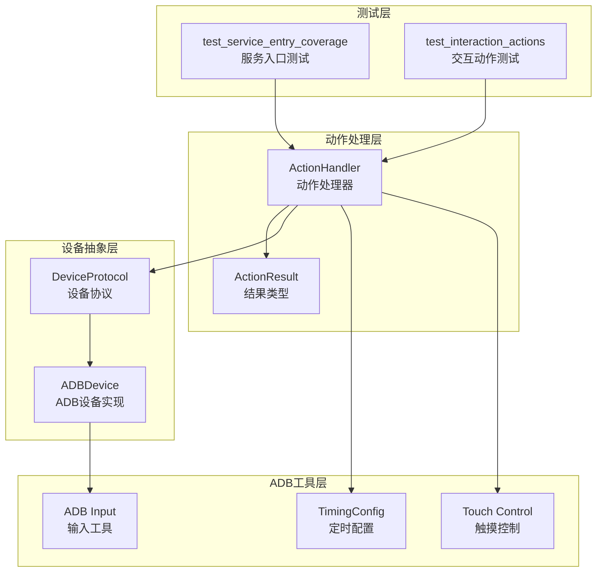
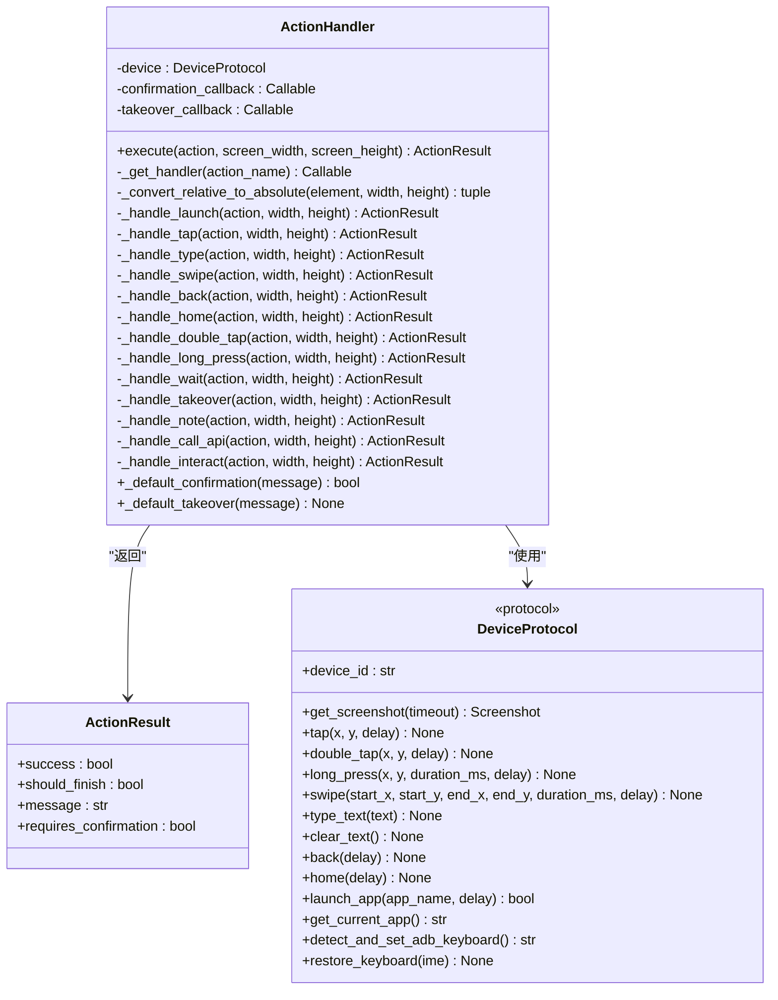
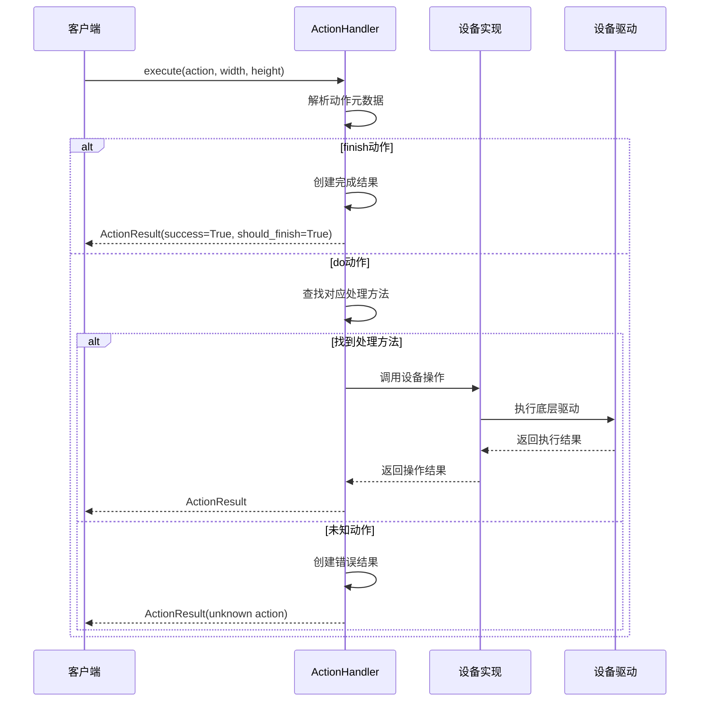
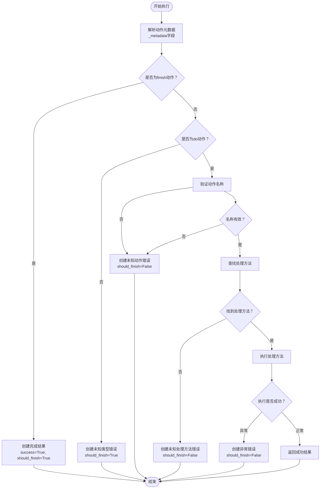
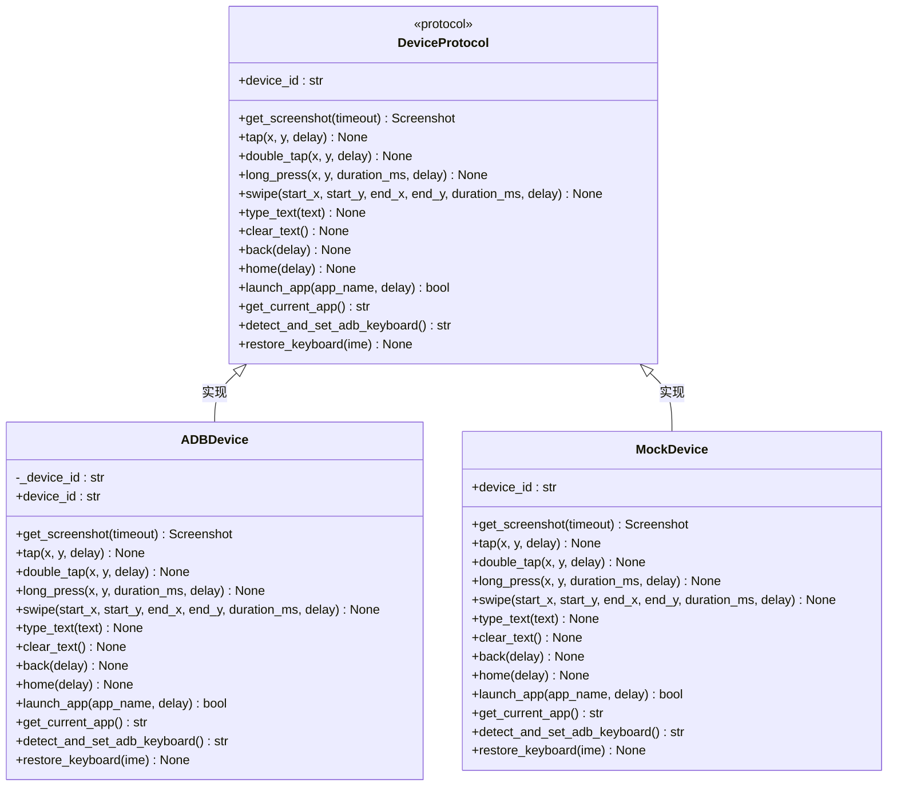
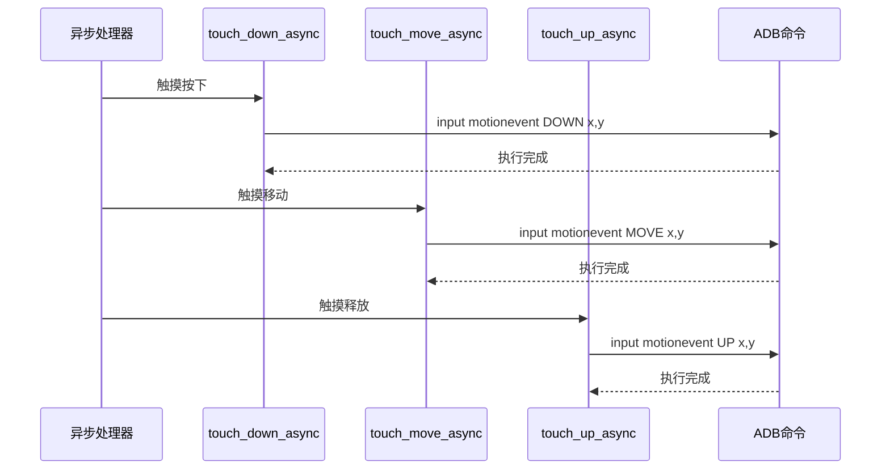
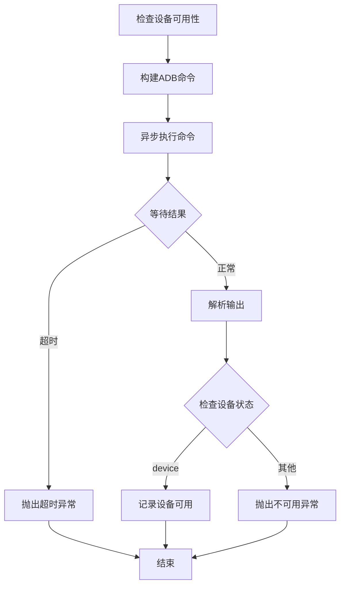
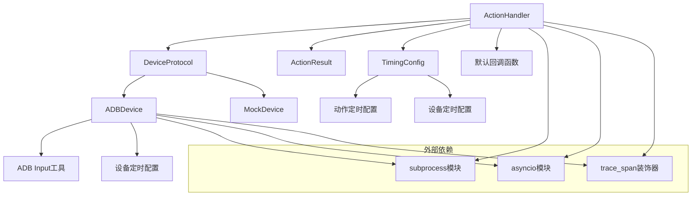

# 动作处理器扩展

<cite>
**本文档引用的文件**
- [AutoGLM_GUI/actions/handler.py](file://AutoGLM_GUI/actions/handler.py)
- [AutoGLM_GUI/actions/types.py](file://AutoGLM_GUI/actions/types.py)
- [AutoGLM_GUI/device_protocol.py](file://AutoGLM_GUI/device_protocol.py)
- [AutoGLM_GUI/devices/adb_device.py](file://AutoGLM_GUI/devices/adb_device.py)
- [AutoGLM_GUI/adb/timing.py](file://AutoGLM_GUI/adb/timing.py)
- [AutoGLM_GUI/adb/input.py](file://AutoGLM_GUI/adb/input.py)
- [AutoGLM_GUI/adb_plus/touch.py](file://AutoGLM_GUI/adb_plus/touch.py)
- [AutoGLM_GUI/adb_plus/device.py](file://AutoGLM_GUI/adb_plus/device.py)
- [tests/test_service_entry_coverage.py](file://tests/test_service_entry_coverage.py)
- [tests/test_interaction_actions.py](file://tests/test_interaction_actions.py)
- [frontend/src/hooks/useTaskSessionConversation.ts](file://frontend/src/hooks/useTaskSessionConversation.ts)
</cite>

## 目录
1. [简介](#简介)
2. [项目结构](#项目结构)
3. [核心组件](#核心组件)
4. [架构概览](#架构概览)
5. [详细组件分析](#详细组件分析)
6. [依赖关系分析](#依赖关系分析)
7. [性能考虑](#性能考虑)
8. [故障排除指南](#故障排除指南)
9. [结论](#结论)
10. [附录](#附录)

## 简介

本指南面向需要扩展动作处理器功能的开发者，详细说明了ActionHandler类的设计架构和动作执行机制。文档涵盖了如何扩展新的动作类型（触摸操作、输入操作、应用控制等），提供了动作参数验证、执行流程控制和错误处理的具体实现示例。同时说明了动作处理器与设备驱动的交互模式、异步执行机制和状态同步方法，并包含新动作类型的注册流程、配置管理和调试技巧。

## 项目结构

Auto_game_play项目采用模块化设计，动作处理器位于AutoGLM_GUI/actions目录下，设备抽象层位于AutoGLM_GUI/devices目录，ADB工具位于AutoGLM_GUI/adb目录。

**图表来源**
- [AutoGLM_GUI/actions/handler.py:13-322](file://AutoGLM_GUI/actions/handler.py#L13-L322)
- [AutoGLM_GUI/device_protocol.py:49-267](file://AutoGLM_GUI/device_protocol.py#L49-L267)
- [AutoGLM_GUI/devices/adb_device.py:14-287](file://AutoGLM_GUI/devices/adb_device.py#L14-L287)

**章节来源**
- [AutoGLM_GUI/actions/handler.py:1-322](file://AutoGLM_GUI/actions/handler.py#L1-L322)
- [AutoGLM_GUI/device_protocol.py:1-267](file://AutoGLM_GUI/device_protocol.py#L1-L267)

## 核心组件

### ActionHandler类架构

ActionHandler是动作处理器的核心类，负责解析和执行各种动作类型。其设计遵循策略模式，通过字典映射将动作名称映射到具体的处理方法。

**图表来源**
- [AutoGLM_GUI/actions/handler.py:13-322](file://AutoGLM_GUI/actions/handler.py#L13-L322)
- [AutoGLM_GUI/actions/types.py:7-16](file://AutoGLM_GUI/actions/types.py#L7-L16)
- [AutoGLM_GUI/device_protocol.py:49-212](file://AutoGLM_GUI/device_protocol.py#L49-L212)

### 支持的动作类型

ActionHandler当前支持以下动作类型：

| 动作类型 | 处理方法 | 参数要求 | 功能描述 |
|---------|---------|---------|----------|
| Launch | _handle_launch | app: 应用名称 | 启动指定应用 |
| Tap | _handle_tap | element: 坐标数组 | 单击屏幕指定位置 |
| Type | _handle_type | text: 文本内容 | 在输入框中输入文本 |
| Type_Name | _handle_type | text: 文本内容 | 输入文本别名 |
| Swipe | _handle_swipe | start: 起始坐标, end: 结束坐标 | 滑动操作 |
| Back | _handle_back | - | 返回上一页 |
| Home | _handle_home | - | 返回主页面 |
| Double Tap | _handle_double_tap | element: 坐标数组 | 双击操作 |
| Long Press | _handle_long_press | element: 坐标数组 | 长按操作 |
| Wait | _handle_wait | duration: 等待秒数 | 等待指定时间 |
| Take_over | _handle_takeover | message: 提示信息 | 请求人工接管 |
| Note | _handle_note | - | 记录操作（无实际效果） |
| Call_API | _handle_call_api | - | API调用占位符 |
| Interact | _handle_interact | - | 请求用户交互 |

**章节来源**
- [AutoGLM_GUI/actions/handler.py:115-134](file://AutoGLM_GUI/actions/handler.py#L115-L134)
- [AutoGLM_GUI/actions/handler.py:145-312](file://AutoGLM_GUI/actions/handler.py#L145-L312)

## 架构概览

动作处理器采用分层架构设计，实现了设备无关的操作接口。

**图表来源**
- [AutoGLM_GUI/actions/handler.py:24-113](file://AutoGLM_GUI/actions/handler.py#L24-L113)
- [AutoGLM_GUI/devices/adb_device.py:63-170](file://AutoGLM_GUI/devices/adb_device.py#L63-L170)

## 详细组件分析

### 动作执行流程

动作处理器的执行流程遵循严格的验证和处理顺序：

**图表来源**
- [AutoGLM_GUI/actions/handler.py:24-113](file://AutoGLM_GUI/actions/handler.py#L24-L113)

### 设备驱动交互模式

设备驱动通过DeviceProtocol接口实现，确保动作处理器与具体设备实现解耦。

**图表来源**
- [AutoGLM_GUI/device_protocol.py:49-212](file://AutoGLM_GUI/device_protocol.py#L49-L212)
- [AutoGLM_GUI/devices/adb_device.py:14-199](file://AutoGLM_GUI/devices/adb_device.py#L14-L199)

**章节来源**
- [AutoGLM_GUI/device_protocol.py:49-212](file://AutoGLM_GUI/device_protocol.py#L49-L212)
- [AutoGLM_GUI/devices/adb_device.py:14-199](file://AutoGLM_GUI/devices/adb_device.py#L14-L199)

### 异步执行机制

系统支持异步触摸控制，用于实时拖拽操作：

**图表来源**
- [AutoGLM_GUI/adb_plus/touch.py:94-143](file://AutoGLM_GUI/adb_plus/touch.py#L94-L143)

**章节来源**
- [AutoGLM_GUI/adb_plus/touch.py:10-143](file://AutoGLM_GUI/adb_plus/touch.py#L10-L143)

### 状态同步方法

设备可用性检查通过异步方式实现，确保操作的可靠性：

**图表来源**
- [AutoGLM_GUI/adb_plus/device.py:10-51](file://AutoGLM_GUI/adb_plus/device.py#L10-L51)

**章节来源**
- [AutoGLM_GUI/adb_plus/device.py:10-51](file://AutoGLM_GUI/adb_plus/device.py#L10-L51)

## 依赖关系分析

动作处理器的依赖关系清晰明确，遵循单一职责原则：

**图表来源**
- [AutoGLM_GUI/actions/handler.py:1-322](file://AutoGLM_GUI/actions/handler.py#L1-L322)
- [AutoGLM_GUI/device_protocol.py:1-267](file://AutoGLM_GUI/device_protocol.py#L1-L267)
- [AutoGLM_GUI/devices/adb_device.py:1-287](file://AutoGLM_GUI/devices/adb_device.py#L1-L287)

**章节来源**
- [AutoGLM_GUI/actions/handler.py:1-322](file://AutoGLM_GUI/actions/handler.py#L1-L322)
- [AutoGLM_GUI/device_protocol.py:1-267](file://AutoGLM_GUI/device_protocol.py#L1-L267)

## 性能考虑

### 定时配置管理

系统提供灵活的定时配置机制，支持环境变量覆盖：

| 配置类别 | 默认值 | 环境变量 | 用途 |
|---------|--------|----------|------|
| 键盘切换延迟 | 1.0秒 | PHONE_AGENT_KEYBOARD_SWITCH_DELAY | 切换ADB键盘后的等待时间 |
| 文本清除延迟 | 1.0秒 | PHONE_AGENT_TEXT_CLEAR_DELAY | 清除文本后的等待时间 |
| 文本输入延迟 | 1.0秒 | PHONE_AGENT_TEXT_INPUT_DELAY | 输入文本后的等待时间 |
| 键盘恢复延迟 | 1.0秒 | PHONE_AGENT_KEYBOARD_RESTORE_DELAY | 恢复原键盘后的等待时间 |

### 批量操作优化

对于需要连续执行多个动作的场景，建议：

1. **合并相似操作**：将连续的相同类型操作合并执行
2. **合理设置延迟**：根据实际设备性能调整定时配置
3. **异步执行**：对非阻塞操作使用异步版本
4. **缓存设备实例**：避免重复创建设备连接

## 故障排除指南

### 常见错误类型及解决方案

| 错误类型 | 触发条件 | 解决方案 |
|---------|---------|---------|
| 未知动作类型 | _metadata不是"do"或"finish" | 检查动作格式，确保使用正确的元数据字段 |
| 未知动作名称 | 动作名称不在映射表中 | 确认动作名称拼写正确，检查是否已注册 |
| 缺少必要参数 | 动作缺少必需参数 | 按照相应动作的参数要求提供完整参数 |
| 设备不可用 | ADB设备未连接或离线 | 检查设备连接状态，重新建立ADB连接 |
| 操作超时 | 设备响应超时 | 增加超时时间，检查网络连接质量 |

### 调试技巧

1. **启用详细日志**：通过trace_span装饰器查看详细的执行跟踪
2. **参数验证**：在动作执行前进行参数完整性检查
3. **状态监控**：定期检查设备状态和连接情况
4. **异常捕获**：使用try-catch捕获并记录异常信息

**章节来源**
- [tests/test_service_entry_coverage.py:80-130](file://tests/test_service_entry_coverage.py#L80-L130)
- [tests/test_interaction_actions.py:226-305](file://tests/test_interaction_actions.py#L226-L305)

## 结论

ActionHandler类通过清晰的架构设计和完善的错误处理机制，为动作扩展提供了良好的基础。其基于协议的设备抽象设计使得系统具有良好的可扩展性和可维护性。通过本文档提供的扩展指南，开发者可以轻松添加新的动作类型，实现复杂的自动化操作需求。

## 附录

### 新动作类型扩展步骤

1. **定义动作处理方法**：在ActionHandler类中添加新的处理方法
2. **更新动作映射**：在_get_handler方法中添加动作名称到处理方法的映射
3. **实现参数验证**：添加必要的参数验证逻辑
4. **集成设备操作**：调用相应的设备操作方法
5. **添加测试用例**：编写对应的单元测试和集成测试
6. **更新文档**：添加新动作类型的使用说明

### 配置管理最佳实践

1. **环境变量配置**：通过环境变量灵活调整运行参数
2. **动态配置更新**：支持运行时更新定时配置
3. **配置验证**：在启动时验证配置的有效性
4. **默认值设置**：为所有配置项提供合理的默认值