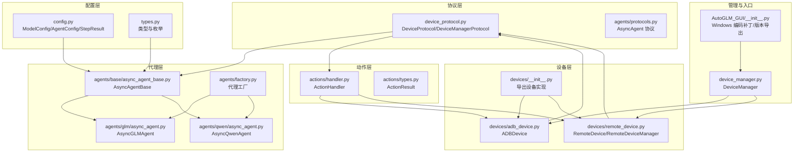
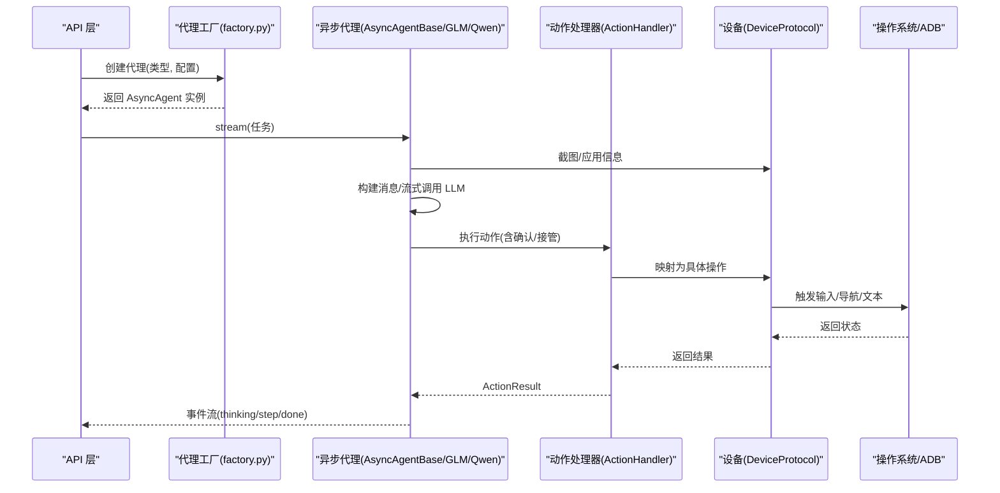
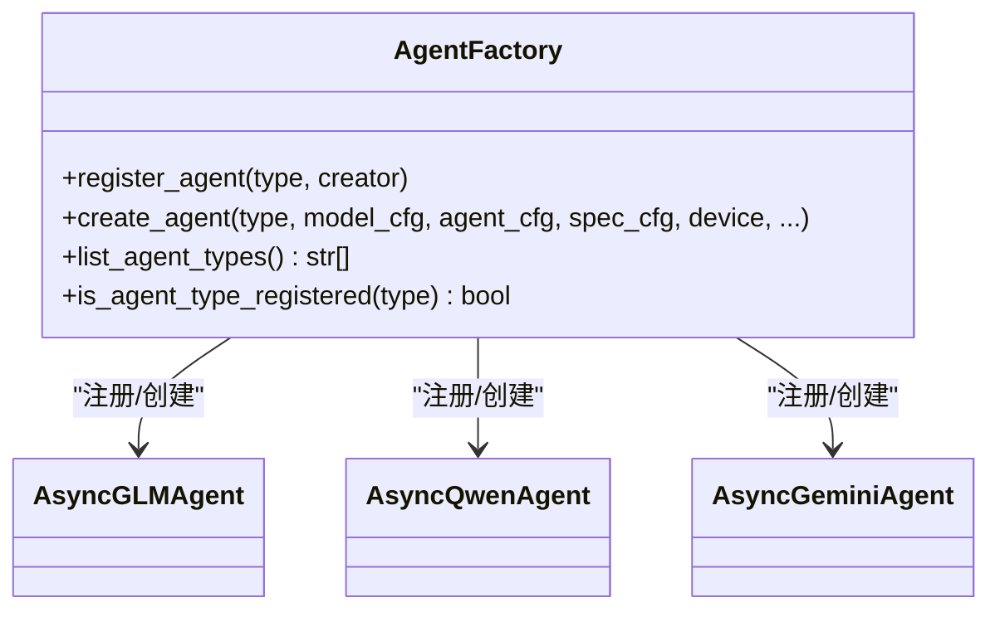
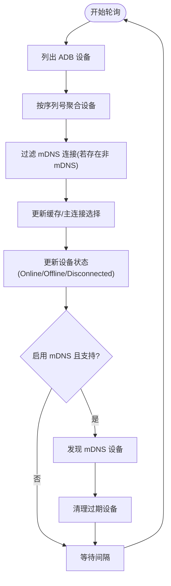
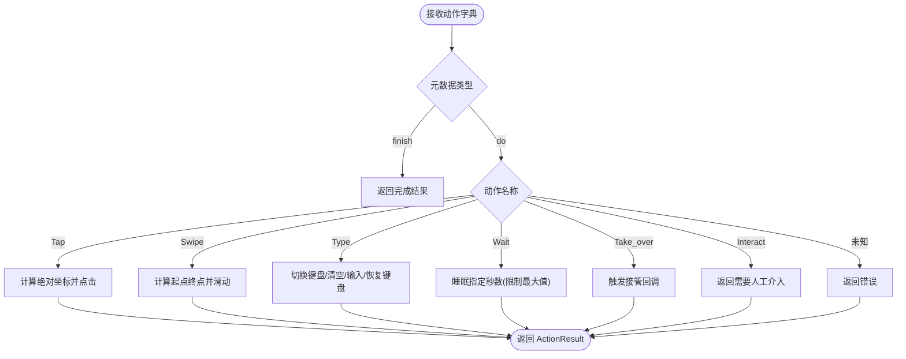
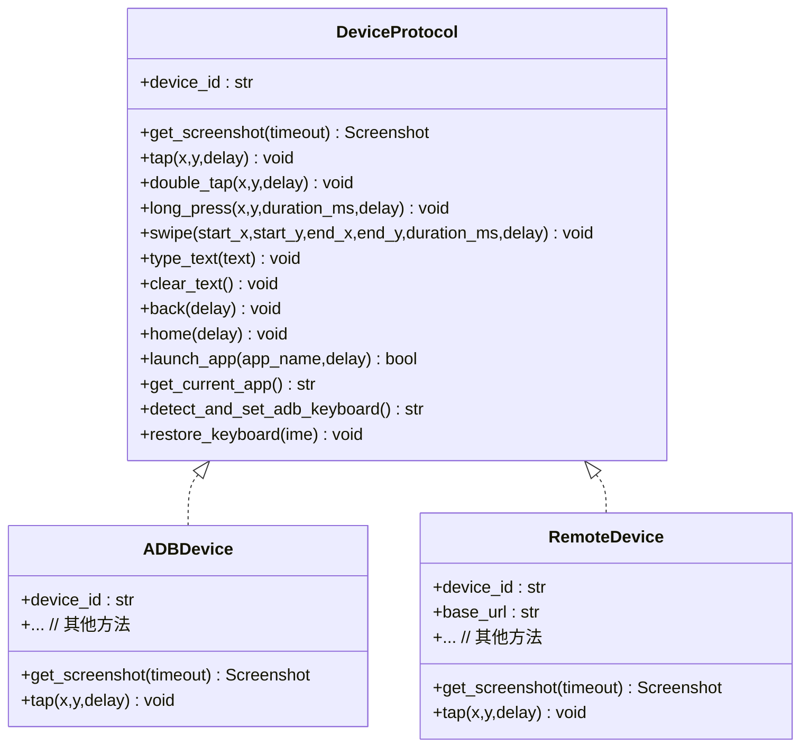
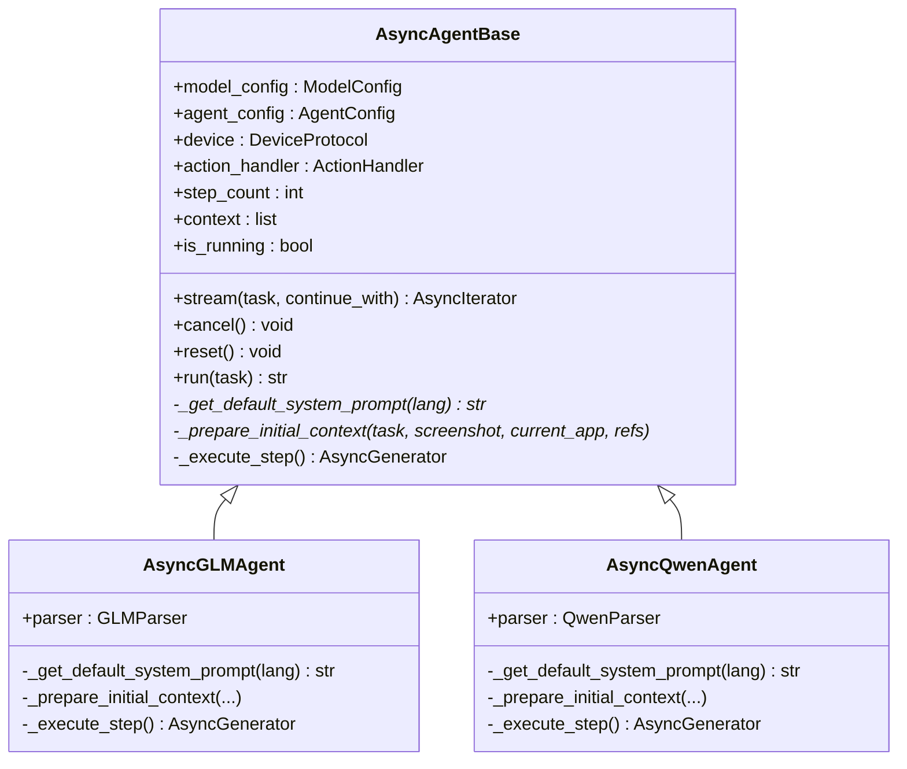
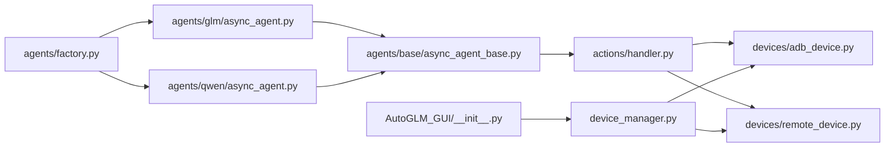

# 扩展开发指南

<cite>
**本文档引用的文件**
- [AutoGLM_GUI/__init__.py](file://AutoGLM_GUI/__init__.py)
- [AutoGLM_GUI/agents/factory.py](file://AutoGLM_GUI/agents/factory.py)
- [AutoGLM_GUI/device_manager.py](file://AutoGLM_GUI/device_manager.py)
- [AutoGLM_GUI/actions/handler.py](file://AutoGLM_GUI/actions/handler.py)
- [AutoGLM_GUI/devices/__init__.py](file://AutoGLM_GUI/devices/__init__.py)
- [AutoGLM_GUI/agents/base/async_agent_base.py](file://AutoGLM_GUI/agents/base/async_agent_base.py)
- [AutoGLM_GUI/agents/protocols.py](file://AutoGLM_GUI/agents/protocols.py)
- [AutoGLM_GUI/device_protocol.py](file://AutoGLM_GUI/device_protocol.py)
- [AutoGLM_GUI/types.py](file://AutoGLM_GUI/types.py)
- [AutoGLM_GUI/config.py](file://AutoGLM_GUI/config.py)
- [AutoGLM_GUI/agents/glm/async_agent.py](file://AutoGLM_GUI/agents/glm/async_agent.py)
- [AutoGLM_GUI/agents/qwen/async_agent.py](file://AutoGLM_GUI/agents/qwen/async_agent.py)
- [AutoGLM_GUI/devices/adb_device.py](file://AutoGLM_GUI/devices/adb_device.py)
- [AutoGLM_GUI/devices/remote_device.py](file://AutoGLM_GUI/devices/remote_device.py)
- [AutoGLM_GUI/actions/types.py](file://AutoGLM_GUI/actions/types.py)
</cite>

## 目录
1. [简介](#简介)
2. [项目结构](#项目结构)
3. [核心组件](#核心组件)
4. [架构总览](#架构总览)
5. [详细组件分析](#详细组件分析)
6. [依赖分析](#依赖分析)
7. [性能考虑](#性能考虑)
8. [故障排除指南](#故障排除指南)
9. [结论](#结论)
10. [附录](#附录)

## 简介
本指南面向希望为 AutoGLM-GUI 扩展开发的工程师，涵盖以下主题：
- 如何开发新的 AI 代理（Agent）、设备驱动程序（Device）与动作处理器（Action Handler）
- 代理工厂扩展、设备管理器扩展与动作处理器扩展的具体实现示例
- 插件系统的架构设计、接口规范与集成方法
- 第三方服务集成、自定义工具开发与 API 扩展的最佳实践
- 完整扩展示例与调试技巧

## 项目结构
AutoGLM-GUI 采用分层清晰的模块化架构：
- 配置层：统一的 ModelConfig、AgentConfig、StepResult 等配置数据类
- 协议层：DeviceProtocol、DeviceManagerProtocol、AsyncAgent 协议定义
- 设备层：ADB 设备、远程设备、Mock 设备等具体实现
- 代理层：基于 AsyncAgentBase 的异步代理基类，以及多种具体代理实现
- 动作层：ActionHandler 将抽象动作映射为设备操作
- 工厂与管理：代理工厂、设备管理器、设备组管理等

**图表来源**
- [AutoGLM_GUI/config.py:1-89](file://AutoGLM_GUI/config.py#L1-L89)
- [AutoGLM_GUI/types.py:1-143](file://AutoGLM_GUI/types.py#L1-L143)
- [AutoGLM_GUI/device_protocol.py:1-267](file://AutoGLM_GUI/device_protocol.py#L1-L267)
- [AutoGLM_GUI/agents/protocols.py:1-95](file://AutoGLM_GUI/agents/protocols.py#L1-L95)
- [AutoGLM_GUI/devices/adb_device.py:1-200](file://AutoGLM_GUI/devices/adb_device.py#L1-L200)
- [AutoGLM_GUI/devices/remote_device.py:1-200](file://AutoGLM_GUI/devices/remote_device.py#L1-L200)
- [AutoGLM_GUI/devices/__init__.py:1-31](file://AutoGLM_GUI/devices/__init__.py#L1-L31)
- [AutoGLM_GUI/agents/base/async_agent_base.py:1-439](file://AutoGLM_GUI/agents/base/async_agent_base.py#L1-L439)
- [AutoGLM_GUI/agents/glm/async_agent.py:1-200](file://AutoGLM_GUI/agents/glm/async_agent.py#L1-L200)
- [AutoGLM_GUI/agents/qwen/async_agent.py:1-200](file://AutoGLM_GUI/agents/qwen/async_agent.py#L1-L200)
- [AutoGLM_GUI/agents/factory.py:1-283](file://AutoGLM_GUI/agents/factory.py#L1-L283)
- [AutoGLM_GUI/actions/handler.py:1-322](file://AutoGLM_GUI/actions/handler.py#L1-L322)
- [AutoGLM_GUI/actions/types.py:1-16](file://AutoGLM_GUI/actions/types.py#L1-L16)
- [AutoGLM_GUI/device_manager.py:1-800](file://AutoGLM_GUI/device_manager.py#L1-L800)
- [AutoGLM_GUI/__init__.py:1-73](file://AutoGLM_GUI/__init__.py#L1-L73)

**章节来源**
- [AutoGLM_GUI/config.py:1-89](file://AutoGLM_GUI/config.py#L1-L89)
- [AutoGLM_GUI/types.py:1-143](file://AutoGLM_GUI/types.py#L1-L143)
- [AutoGLM_GUI/device_protocol.py:1-267](file://AutoGLM_GUI/device_protocol.py#L1-L267)
- [AutoGLM_GUI/agents/protocols.py:1-95](file://AutoGLM_GUI/agents/protocols.py#L1-L95)
- [AutoGLM_GUI/devices/adb_device.py:1-200](file://AutoGLM_GUI/devices/adb_device.py#L1-L200)
- [AutoGLM_GUI/devices/remote_device.py:1-200](file://AutoGLM_GUI/devices/remote_device.py#L1-L200)
- [AutoGLM_GUI/devices/__init__.py:1-31](file://AutoGLM_GUI/devices/__init__.py#L1-L31)
- [AutoGLM_GUI/agents/base/async_agent_base.py:1-439](file://AutoGLM_GUI/agents/base/async_agent_base.py#L1-L439)
- [AutoGLM_GUI/agents/glm/async_agent.py:1-200](file://AutoGLM_GUI/agents/glm/async_agent.py#L1-L200)
- [AutoGLM_GUI/agents/qwen/async_agent.py:1-200](file://AutoGLM_GUI/agents/qwen/async_agent.py#L1-L200)
- [AutoGLM_GUI/agents/factory.py:1-283](file://AutoGLM_GUI/agents/factory.py#L1-L283)
- [AutoGLM_GUI/actions/handler.py:1-322](file://AutoGLM_GUI/actions/handler.py#L1-L322)
- [AutoGLM_GUI/actions/types.py:1-16](file://AutoGLM_GUI/actions/types.py#L1-L16)
- [AutoGLM_GUI/device_manager.py:1-800](file://AutoGLM_GUI/device_manager.py#L1-L800)
- [AutoGLM_GUI/__init__.py:1-73](file://AutoGLM_GUI/__init__.py#L1-L73)

## 核心组件
- 配置系统：ModelConfig、AgentConfig、StepResult 提供统一的参数载体，避免 API 层与业务层直接依赖外部库类型
- 协议系统：DeviceProtocol/DeviceManagerProtocol、AsyncAgent 协议定义了跨实现的抽象边界
- 设备实现：ADBDevice、RemoteDevice、MockDevice 通过 DeviceProtocol 解耦控制逻辑
- 代理基类：AsyncAgentBase 提供统一的流式执行、取消、监控与上下文管理
- 动作处理器：ActionHandler 将抽象动作映射为设备操作，并支持确认与接管回调
- 工厂与管理：代理工厂注册与创建、设备管理器后台轮询与状态缓存

**章节来源**
- [AutoGLM_GUI/config.py:1-89](file://AutoGLM_GUI/config.py#L1-L89)
- [AutoGLM_GUI/device_protocol.py:1-267](file://AutoGLM_GUI/device_protocol.py#L1-L267)
- [AutoGLM_GUI/agents/protocols.py:1-95](file://AutoGLM_GUI/agents/protocols.py#L1-L95)
- [AutoGLM_GUI/agents/base/async_agent_base.py:1-439](file://AutoGLM_GUI/agents/base/async_agent_base.py#L1-L439)
- [AutoGLM_GUI/actions/handler.py:1-322](file://AutoGLM_GUI/actions/handler.py#L1-L322)
- [AutoGLM_GUI/agents/factory.py:1-283](file://AutoGLM_GUI/agents/factory.py#L1-L283)
- [AutoGLM_GUI/device_manager.py:1-800](file://AutoGLM_GUI/device_manager.py#L1-L800)

## 架构总览
下图展示了从 API 到设备的完整调用链路与扩展点：

**图表来源**
- [AutoGLM_GUI/agents/factory.py:1-283](file://AutoGLM_GUI/agents/factory.py#L1-L283)
- [AutoGLM_GUI/agents/base/async_agent_base.py:1-439](file://AutoGLM_GUI/agents/base/async_agent_base.py#L1-L439)
- [AutoGLM_GUI/actions/handler.py:1-322](file://AutoGLM_GUI/actions/handler.py#L1-L322)
- [AutoGLM_GUI/device_protocol.py:1-267](file://AutoGLM_GUI/device_protocol.py#L1-L267)

## 详细组件分析

### 代理工厂扩展（新增代理类型）
- 扩展目标：在不修改现有代码的前提下注册新的代理类型
- 关键点：
  - 使用注册表 AGENT_REGISTRY 存储代理构造器
  - register_agent(agent_type, creator) 注册新代理
  - create_agent(...) 通过类型查找并实例化
  - 支持别名注册（如 "general-vision" 指向 Gemini）

**图表来源**
- [AutoGLM_GUI/agents/factory.py:1-283](file://AutoGLM_GUI/agents/factory.py#L1-L283)

**章节来源**
- [AutoGLM_GUI/agents/factory.py:1-283](file://AutoGLM_GUI/agents/factory.py#L1-L283)

### 设备管理器扩展（多连接与 mDNS 发现）
- 扩展目标：支持新的设备连接方式（如蓝牙、串口、自研协议）
- 关键点：
  - ManagedDevice/DeviceConnection 聚合同一设备的多个连接端点
  - 优先级排序（USB > WiFi > Remote），自动选择主连接
  - mDNS 设备发现与可用性管理
  - 轮询线程与指数退避，异常处理与恢复

**图表来源**
- [AutoGLM_GUI/device_manager.py:435-670](file://AutoGLM_GUI/device_manager.py#L435-L670)

**章节来源**
- [AutoGLM_GUI/device_manager.py:1-800](file://AutoGLM_GUI/device_manager.py#L1-L800)

### 动作处理器扩展（新增动作类型）
- 扩展目标：支持新的交互动作（如滑动方向、系统按钮、长按时长等）
- 关键点：
  - ActionHandler.execute(action, width, height) 将动作元数据映射到处理方法
  - 支持相对坐标到绝对坐标的转换
  - 内置动作集合：Launch/Tap/Swipe/Type/Wait/Back/Home/Double Tap/Long Press/Note/Call_API/Interact
  - 支持确认回调与接管回调

**图表来源**
- [AutoGLM_GUI/actions/handler.py:1-322](file://AutoGLM_GUI/actions/handler.py#L1-L322)
- [AutoGLM_GUI/actions/types.py:1-16](file://AutoGLM_GUI/actions/types.py#L1-L16)

**章节来源**
- [AutoGLM_GUI/actions/handler.py:1-322](file://AutoGLM_GUI/actions/handler.py#L1-L322)
- [AutoGLM_GUI/actions/types.py:1-16](file://AutoGLM_GUI/actions/types.py#L1-L16)

### 设备驱动程序扩展（新增设备实现）
- 扩展目标：实现新的 DeviceProtocol 实现以适配不同硬件或平台
- 接口要求：遵循 DeviceProtocol 的截图、输入、导航、状态查询与键盘管理方法
- 示例参考：
  - ADBDevice：基于本地 ADB 子进程调用
  - RemoteDevice：通过 HTTP 调用远端设备代理
  - 可参考 devices/__init__.py 的导出约定

**图表来源**
- [AutoGLM_GUI/device_protocol.py:1-267](file://AutoGLM_GUI/device_protocol.py#L1-L267)
- [AutoGLM_GUI/devices/adb_device.py:1-200](file://AutoGLM_GUI/devices/adb_device.py#L1-L200)
- [AutoGLM_GUI/devices/remote_device.py:1-200](file://AutoGLM_GUI/devices/remote_device.py#L1-L200)

**章节来源**
- [AutoGLM_GUI/device_protocol.py:1-267](file://AutoGLM_GUI/device_protocol.py#L1-L267)
- [AutoGLM_GUI/devices/adb_device.py:1-200](file://AutoGLM_GUI/devices/adb_device.py#L1-L200)
- [AutoGLM_GUI/devices/remote_device.py:1-200](file://AutoGLM_GUI/devices/remote_device.py#L1-L200)
- [AutoGLM_GUI/devices/__init__.py:1-31](file://AutoGLM_GUI/devices/__init__.py#L1-L31)

### 异步代理基类与具体代理（扩展新模型/解析器）
- 扩展目标：为新的大模型或解析策略提供异步代理实现
- 关键点：
  - AsyncAgentBase 提供统一的流式执行、取消、监控与上下文管理
  - 子类需实现：默认系统提示词、初始上下文准备、单步执行（异步生成器）
  - AsyncGLMAgent 与 AsyncQwenAgent 展示了不同的提示词与解析策略

**图表来源**
- [AutoGLM_GUI/agents/base/async_agent_base.py:1-439](file://AutoGLM_GUI/agents/base/async_agent_base.py#L1-L439)
- [AutoGLM_GUI/agents/glm/async_agent.py:1-200](file://AutoGLM_GUI/agents/glm/async_agent.py#L1-L200)
- [AutoGLM_GUI/agents/qwen/async_agent.py:1-200](file://AutoGLM_GUI/agents/qwen/async_agent.py#L1-L200)

**章节来源**
- [AutoGLM_GUI/agents/base/async_agent_base.py:1-439](file://AutoGLM_GUI/agents/base/async_agent_base.py#L1-L439)
- [AutoGLM_GUI/agents/glm/async_agent.py:1-200](file://AutoGLM_GUI/agents/glm/async_agent.py#L1-L200)
- [AutoGLM_GUI/agents/qwen/async_agent.py:1-200](file://AutoGLM_GUI/agents/qwen/async_agent.py#L1-L200)

### 插件系统架构与接口规范
- 代理工厂：通过 AGENT_REGISTRY 实现插件式注册与创建
- 设备协议：DeviceProtocol/DeviceManagerProtocol 提供统一接口
- 动作类型：PhoneActionType/MAIActionType 等类型定义确保动作一致性
- 配置隔离：ModelConfig/AgentConfig/StepResult 避免外部依赖耦合

**章节来源**
- [AutoGLM_GUI/agents/factory.py:1-283](file://AutoGLM_GUI/agents/factory.py#L1-L283)
- [AutoGLM_GUI/device_protocol.py:1-267](file://AutoGLM_GUI/device_protocol.py#L1-L267)
- [AutoGLM_GUI/types.py:1-143](file://AutoGLM_GUI/types.py#L1-L143)
- [AutoGLM_GUI/config.py:1-89](file://AutoGLM_GUI/config.py#L1-L89)

## 依赖分析
- 松耦合设计：通过协议与工厂实现模块间低耦合
- 可替换性：设备实现、代理实现、动作处理器均可替换
- 外部依赖：HTTPX（远程设备）、OpenAI SDK（异步客户端）、ADB 工具链

**图表来源**
- [AutoGLM_GUI/agents/factory.py:1-283](file://AutoGLM_GUI/agents/factory.py#L1-L283)
- [AutoGLM_GUI/agents/glm/async_agent.py:1-200](file://AutoGLM_GUI/agents/glm/async_agent.py#L1-L200)
- [AutoGLM_GUI/agents/qwen/async_agent.py:1-200](file://AutoGLM_GUI/agents/qwen/async_agent.py#L1-L200)
- [AutoGLM_GUI/agents/base/async_agent_base.py:1-439](file://AutoGLM_GUI/agents/base/async_agent_base.py#L1-L439)
- [AutoGLM_GUI/actions/handler.py:1-322](file://AutoGLM_GUI/actions/handler.py#L1-L322)
- [AutoGLM_GUI/devices/adb_device.py:1-200](file://AutoGLM_GUI/devices/adb_device.py#L1-L200)
- [AutoGLM_GUI/devices/remote_device.py:1-200](file://AutoGLM_GUI/devices/remote_device.py#L1-L200)
- [AutoGLM_GUI/device_manager.py:1-800](file://AutoGLM_GUI/device_manager.py#L1-L800)
- [AutoGLM_GUI/__init__.py:1-73](file://AutoGLM_GUI/__init__.py#L1-L73)

**章节来源**
- [AutoGLM_GUI/agents/factory.py:1-283](file://AutoGLM_GUI/agents/factory.py#L1-L283)
- [AutoGLM_GUI/agents/glm/async_agent.py:1-200](file://AutoGLM_GUI/agents/glm/async_agent.py#L1-L200)
- [AutoGLM_GUI/agents/qwen/async_agent.py:1-200](file://AutoGLM_GUI/agents/qwen/async_agent.py#L1-L200)
- [AutoGLM_GUI/agents/base/async_agent_base.py:1-439](file://AutoGLM_GUI/agents/base/async_agent_base.py#L1-L439)
- [AutoGLM_GUI/actions/handler.py:1-322](file://AutoGLM_GUI/actions/handler.py#L1-L322)
- [AutoGLM_GUI/devices/adb_device.py:1-200](file://AutoGLM_GUI/devices/adb_device.py#L1-L200)
- [AutoGLM_GUI/devices/remote_device.py:1-200](file://AutoGLM_GUI/devices/remote_device.py#L1-L200)
- [AutoGLM_GUI/device_manager.py:1-800](file://AutoGLM_GUI/device_manager.py#L1-L800)
- [AutoGLM_GUI/__init__.py:1-73](file://AutoGLM_GUI/__init__.py#L1-L73)

## 性能考虑
- 异步与取消：代理使用 asyncio 取消机制，可在网络请求层面快速中断
- 轮询与退避：设备管理器采用指数退避，降低 ADB 不可用时的负载
- 线程池：设备轮询使用 ThreadPoolExecutor 并发获取序列号
- 超时与限速：设备操作与 HTTP 请求均设置超时；动作处理器对 Wait 动作设置最大等待时间
- 监控与追踪：trace_span 与 trace_sleep 提供可观测性，便于定位瓶颈

**章节来源**
- [AutoGLM_GUI/agents/base/async_agent_base.py:1-439](file://AutoGLM_GUI/agents/base/async_agent_base.py#L1-L439)
- [AutoGLM_GUI/device_manager.py:1-800](file://AutoGLM_GUI/device_manager.py#L1-L800)
- [AutoGLM_GUI/actions/handler.py:1-322](file://AutoGLM_GUI/actions/handler.py#L1-L322)

## 故障排除指南
- Windows 编码问题：自动替换 subprocess 的默认编码为 UTF-8，避免 ADB 输出乱码
- 设备轮询失败：记录警告并指数退避；必要时检查 ADB 安装与权限
- 动作执行失败：捕获异常并返回 ActionResult，包含错误信息
- 取消与恢复：代理支持即时取消；设备键盘切换失败时有回滚逻辑

**章节来源**
- [AutoGLM_GUI/__init__.py:1-73](file://AutoGLM_GUI/__init__.py#L1-L73)
- [AutoGLM_GUI/device_manager.py:670-684](file://AutoGLM_GUI/device_manager.py#L670-L684)
- [AutoGLM_GUI/actions/handler.py:103-113](file://AutoGLM_GUI/actions/handler.py#L103-L113)
- [AutoGLM_GUI/agents/base/async_agent_base.py:381-396](file://AutoGLM_GUI/agents/base/async_agent_base.py#L381-L396)

## 结论
AutoGLM-GUI 通过协议抽象、工厂模式与异步基类，提供了高度可扩展的框架。开发者可以：
- 通过代理工厂注册新代理
- 通过 DeviceProtocol 实现新设备
- 通过 ActionHandler 扩展动作类型
- 借助配置与类型系统实现稳定的集成

## 附录

### 扩展示例清单（路径指引）
- 新增代理类型
  - 在 agents/factory.py 中注册：[注册函数:24-47](file://AutoGLM_GUI/agents/factory.py#L24-L47)
  - 在 agents/glm/async_agent.py 中参考实现：[GLM 代理:1-200](file://AutoGLM_GUI/agents/glm/async_agent.py#L1-L200)
  - 在 agents/qwen/async_agent.py 中参考实现：[Qwen 代理:1-200](file://AutoGLM_GUI/agents/qwen/async_agent.py#L1-L200)
- 新增设备实现
  - 参考 ADBDevice：[ADB 设备:1-200](file://AutoGLM_GUI/devices/adb_device.py#L1-L200)
  - 参考 RemoteDevice：[远程设备:1-200](file://AutoGLM_GUI/devices/remote_device.py#L1-L200)
  - 在 devices/__init__.py 导出新实现：[导出列表:19-31](file://AutoGLM_GUI/devices/__init__.py#L19-L31)
- 新增动作类型
  - 在 actions/handler.py 的处理器字典中添加映射：[处理器映射:115-134](file://AutoGLM_GUI/actions/handler.py#L115-L134)
  - 定义动作类型与字段：[类型定义:8-53](file://AutoGLM_GUI/types.py#L8-L53)
- 设备管理器扩展
  - 在 device_manager.py 中扩展连接类型与发现逻辑：[轮询与发现:435-670](file://AutoGLM_GUI/device_manager.py#L435-L670)

### 集成最佳实践
- 保持协议不变：新增实现严格遵循 DeviceProtocol/AsyncAgent 协议
- 配置解耦：使用 ModelConfig/AgentConfig/StepResult，避免直接依赖外部库类型
- 异步优先：动作与设备操作尽量使用异步与取消机制
- 可观测性：使用 trace_span/trace_sleep 记录关键路径
- 错误处理：捕获异常并返回结构化结果，避免崩溃传播