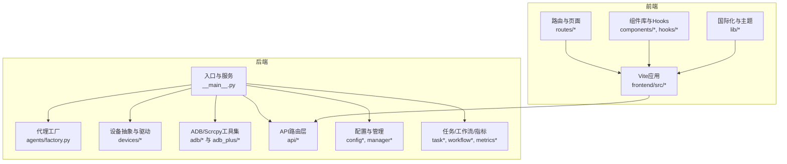
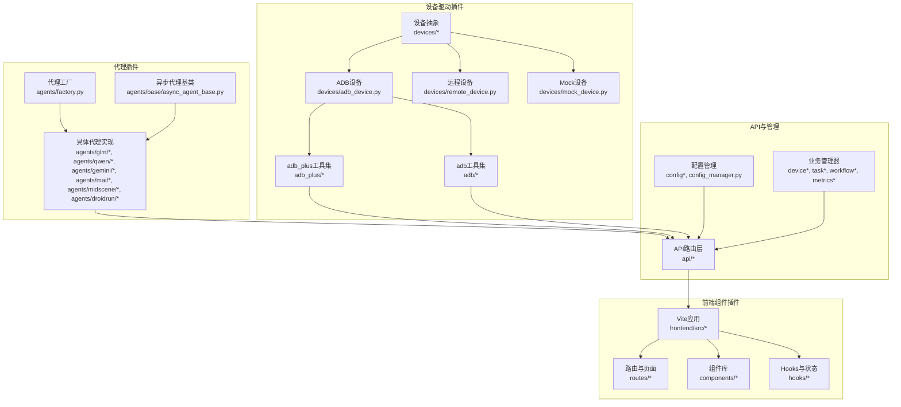
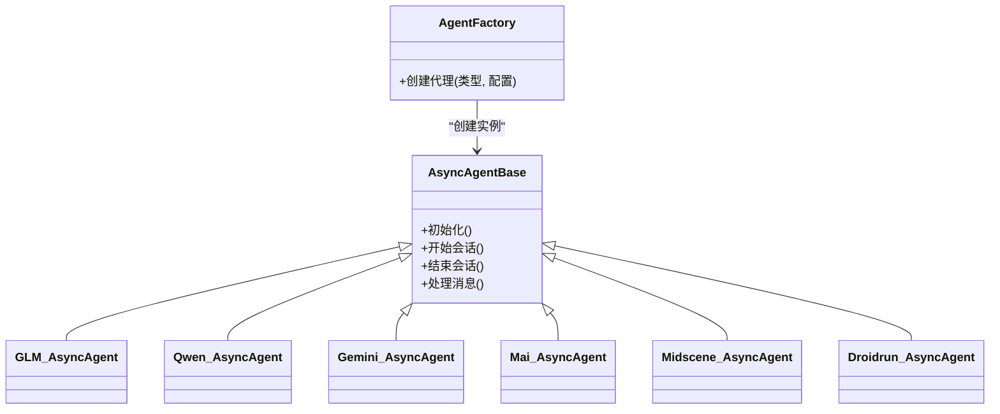
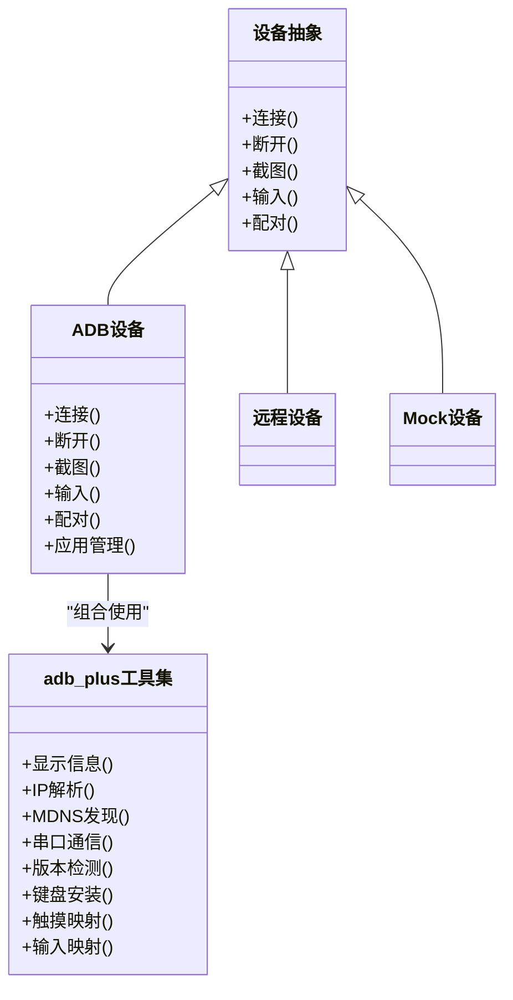
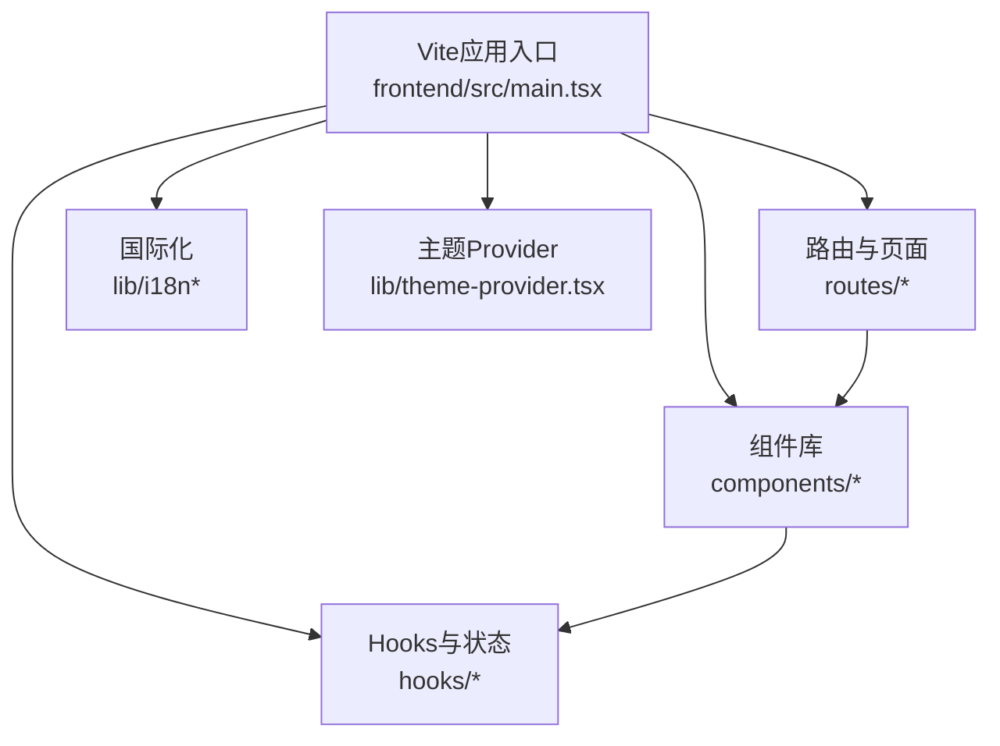
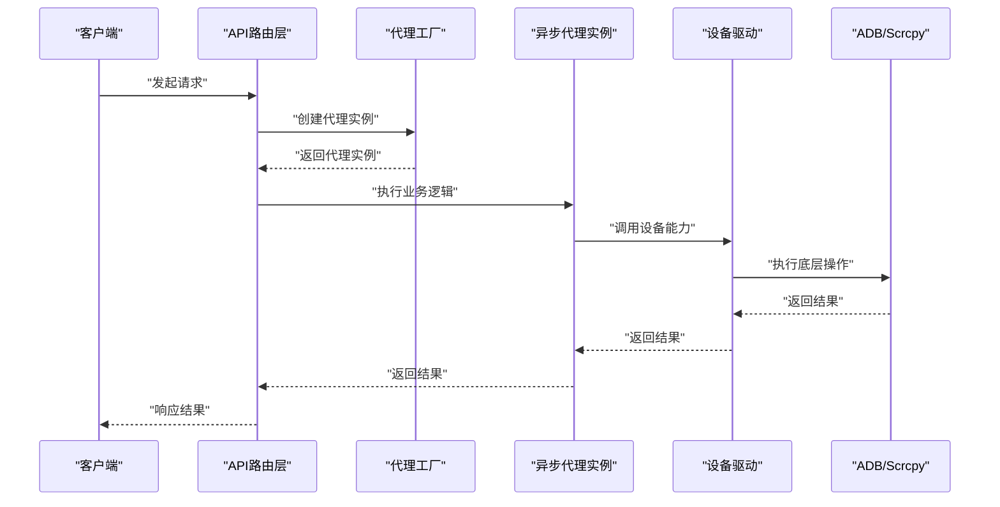
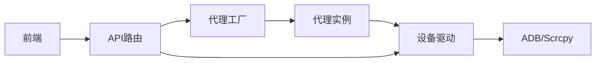

# 插件系统集成

<cite>
**本文档引用的文件**
- [__main__.py](file://AutoGLM_GUI/__main__.py)
- [agents/factory.py](file://AutoGLM_GUI/agents/factory.py)
- [agents/base/async_agent_base.py](file://AutoGLM_GUI/agents/base/async_agent_base.py)
- [devices/__init__.py](file://AutoGLM_GUI/devices/__init__.py)
- [devices/adb_device.py](file://AutoGLM_GUI/devices/adb_device.py)
- [devices/mock_device.py](file://AutoGLM_GUI/devices/mock_device.py)
- [devices/remote_device.py](file://AutoGLM_GUI/devices/remote_device.py)
- [adb_plus/__init__.py](file://AutoGLM_GUI/adb_plus/__init__.py)
- [adb_plus/device.py](file://AutoGLM_GUI/adb_plus/device.py)
- [adb_plus/pair.py](file://AutoGLM_GUI/adb_plus/pair.py)
- [adb_plus/qr_pair.py](file://AutoGLM_GUI/adb_plus/qr_pair.py)
- [adb_plus/touch.py](file://AutoGLM_GUI/adb_plus/touch.py)
- [adb_plus/screenshot.py](file://AutoGLM_GUI/adb_plus/screenshot.py)
- [adb_plus/display.py](file://AutoGLM_GUI/adb_plus/display.py)
- [adb_plus/ip.py](file://AutoGLM_GUI/adb_plus/ip.py)
- [adb_plus/mdns.py](file://AutoGLM_GUI/adb_plus/mdns.py)
- [adb_plus/serial.py](file://AutoGLM_GUI/adb_plus/serial.py)
- [adb_plus/version.py](file://AutoGLM_GUI/adb_plus/version.py)
- [adb_plus/keyboard_installer.py](file://AutoGLM_GUI/adb_plus/keyboard_installer.py)
- [adb_plus/timing.py](file://AutoGLM_GUI/adb_plus/timing.py)
- [adb_plus/input.py](file://AutoGLM_GUI/adb_plus/input.py)
- [adb_plus/apps.py](file://AutoGLM_GUI/adb_plus/apps.py)
- [adb_plus/connection.py](file://AutoGLM_GUI/adb_plus/connection.py)
- [adb_plus/screenshot.py](file://AutoGLM_GUI/adb_plus/screenshot.py)
- [adb_plus/touch.py](file://AutoGLM_GUI/adb_plus/touch.py)
- [adb_plus/display.py](file://AutoGLM_GUI/adb_plus/display.py)
- [adb_plus/ip.py](file://AutoGLM_GUI/adb_plus/ip.py)
- [adb_plus/mdns.py](file://AutoGLM_GUI/adb_plus/mdns.py)
- [adb_plus/serial.py](file://AutoGLM_GUI/adb_plus/serial.py)
- [adb_plus/version.py](file://AutoGLM_GUI/adb_plus/version.py)
- [adb_plus/keyboard_installer.py](file://AutoGLM_GUI/adb_plus/keyboard_installer.py)
- [adb_plus/timing.py](file://AutoGLM_GUI/adb_plus/timing.py)
- [adb_plus/input.py](file://AutoGLM_GUI/adb_plus/input.py)
- [adb_plus/apps.py](file://AutoGLM_GUI/adb_plus/apps.py)
- [adb_plus/connection.py](file://AutoGLM_GUI/adb_plus/connection.py)
- [adb_plus/screenshot.py](file://AutoGLM_GUI/adb_plus/screenshot.py)
- [adb_plus/touch.py](file://AutoGLM_GUI/adb_plus/touch.py)
- [adb_plus/display.py](file://AutoGLM_GUI/adb_plus/display.py)
- [adb_plus/ip.py](file://AutoGLM_GUI/adb_plus/ip.py)
- [adb_plus/mdns.py](file://AutoGLM_GUI/adb_plus/mdns.py)
- [adb_plus/serial.py](file://AutoGLM_GUI/adb_plus/serial.py)
- [adb_plus/version.py](file://AutoGLM_GUI/adb_plus/version.py)
- [adb_plus/keyboard_installer.py](file://AutoGLM_GUI/adb_plus/keyboard_installer.py)
- [adb_plus/timing.py](file://AutoGLM_GUI/adb_plus/timing.py)
- [adb_plus/input.py](file://AutoGLM_GUI/adb_plus/input.py)
- [adb_plus/apps.py](file://AutoGLM_GUI/adb_plus/apps.py)
- [adb_plus/connection.py](file://AutoGLM_GUI/adb_plus/connection.py)
- [api/agents.py](file://AutoGLM_GUI/api/agents.py)
- [api/devices.py](file://AutoGLM_GUI/api/devices.py)
- [api/control.py](file://AutoGLM_GUI/api/control.py)
- [api/workflows.py](file://AutoGLM_GUI/api/workflows.py)
- [api/tasks.py](file://AutoGLM_GUI/api/tasks.py)
- [api/metrics.py](file://AutoGLM_GUI/api/metrics.py)
- [api/history.py](file://AutoGLM_GUI/api/history.py)
- [api/experience.py](file://AutoGLM_GUI/api/experience.py)
- [api/terminal.py](file://AutoGLM_GUI/api/terminal.py)
- [api/layered_agent.py](file://AutoGLM_GUI/api/layered_agent.py)
- [api/mcp.py](file://AutoGLM_GUI/api/mcp.py)
- [api/media.py](file://AutoGLM_GUI/api/media.py)
- [api/scheduled_tasks.py](file://AutoGLM_GUI/api/scheduled_tasks.py)
- [api/version.py](file://AutoGLM_GUI/api/version.py)
- [api/health.py](file://AutoGLM_GUI/api/health.py)
- [api/terminal.py](file://AutoGLM_GUI/api/terminal.py)
- [api/layered_agent.py](file://AutoGLM_GUI/api/layered_agent.py)
- [api/mcp.py](file://AutoGLM_GUI/api/mcp.py)
- [api/media.py](file://AutoGLM_GUI/api/media.py)
- [api/scheduled_tasks.py](file://AutoGLM_GUI/api/scheduled_tasks.py)
- [api/version.py](file://AutoGLM_GUI/api/version.py)
- [api/health.py](file://AutoGLM_GUI/api/health.py)
- [config_manager.py](file://AutoGLM_GUI/config_manager.py)
- [config.py](file://AutoGLM_GUI/config.py)
- [device_manager.py](file://AutoGLM_GUI/device_manager.py)
- [device_group_manager.py](file://AutoGLM_GUI/device_group_manager.py)
- [phone_agent_manager.py](file://AutoGLM_GUI/phone_agent_manager.py)
- [layered_agent_service.py](file://AutoGLM_GUI/layered_agent_service.py)
- [workflow_manager.py](file://AutoGLM_GUI/workflow_manager.py)
- [task_manager.py](file://AutoGLM_GUI/task_manager.py)
- [history_manager.py](file://AutoGLM_GUI/history_manager.py)
- [metrics.py](file://AutoGLM_GUI/metrics.py)
- [experience_report.py](file://AutoGLM_GUI/experience_report.py)
- [scheduler_manager.py](file://AutoGLM_GUI/scheduler_manager.py)
- [socketio_server.py](file://AutoGLM_GUI/socketio_server.py)
- [server.py](file://AutoGLM_GUI/server.py)
- [adb_manager.py](file://AutoGLM_GUI/adb_manager.py)
- [adb_terminal_service.py](file://AutoGLM_GUI/adb_terminal_service.py)
- [adb_terminal_repl.py](file://AutoGLM_GUI/adb_terminal_repl.py)
- [types.py](file://AutoGLM_GUI/types.py)
- [exceptions.py](file://AutoGLM_GUI/exceptions.py)
- [logger.py](file://AutoGLM_GUI/logger.py)
- [version.py](file://AutoGLM_GUI/version.py)
- [prompt_config.py](file://AutoGLM_GUI/prompt_config.py)
- [prompts.py](file://AutoGLM_GUI/prompts.py)
- [i18n.py](file://AutoGLM_GUI/i18n.py)
- [platform_utils.py](file://AutoGLM_GUI/platform_utils.py)
- [trace.py](file://AutoGLM_GUI/trace.py)
- [trace_export.py](file://AutoGLM_GUI/trace_export.py)
- [models/device_group.py](file://AutoGLM_GUI/models/device_group.py)
- [models/history.py](file://AutoGLM_GUI/models/history.py)
- [models/scheduled_task.py](file://AutoGLM_GUI/models/scheduled_task.py)
- [schemas.py](file://AutoGLM_GUI/schemas.py)
- [actions/handler.py](file://AutoGLM_GUI/actions/handler.py)
- [actions/types.py](file://AutoGLM_GUI/actions/types.py)
- [parsers/__init__.py](file://AutoGLM_GUI/parsers/__init__.py)
- [prompts/__init__.py](file://AutoGLM_GUI/prompts/__init__.py)
- [model/error_details.py](file://AutoGLM_GUI/model/error_details.py)
- [model/message_builder.py](file://AutoGLM_GUI/model/message_builder.py)
- [device_protocol.py](file://AutoGLM_GUI/device_protocol.py)
- [scrcpy_protocol.py](file://AutoGLM_GUI/scrcpy_protocol.py)
- [scrcpy_stream.py](file://AutoGLM_GUI/scrcpy_stream.py)
- [device_metadata_manager.py](file://AutoGLM_GUI/device_metadata_manager.py)
- [adb/__init__.py](file://AutoGLM_GUI/adb/__init__.py)
- [adb/device.py](file://AutoGLM_GUI/adb/device.py)
- [adb/connection.py](file://AutoGLM_GUI/adb/connection.py)
- [adb/input.py](file://AutoGLM_GUI/adb/input.py)
- [adb/screenshot.py](file://AutoGLM_GUI/adb/screenshot.py)
- [adb/timing.py](file://AutoGLM_GUI/adb/timing.py)
- [adb/apps.py](file://AutoGLM_GUI/adb/apps.py)
- [adb_plus/__init__.py](file://AutoGLM_GUI/adb_plus/__init__.py)
- [adb_plus/device.py](file://AutoGLM_GUI/adb_plus/device.py)
- [adb_plus/pair.py](file://AutoGLM_GUI/adb_plus/pair.py)
- [adb_plus/qr_pair.py](file://AutoGLM_GUI/adb_plus/qr_pair.py)
- [adb_plus/touch.py](file://AutoGLM_GUI/adb_plus/touch.py)
- [adb_plus/screenshot.py](file://AutoGLM_GUI/adb_plus/screenshot.py)
- [adb_plus/display.py](file://AutoGLM_GUI/adb_plus/display.py)
- [adb_plus/ip.py](file://AutoGLM_GUI/adb_plus/ip.py)
- [adb_plus/mdns.py](file://AutoGLM_GUI/adb_plus/mdns.py)
- [adb_plus/serial.py](file://AutoGLM_GUI/adb_plus/serial.py)
- [adb_plus/version.py](file://AutoGLM_GUI/adb_plus/version.py)
- [adb_plus/keyboard_installer.py](file://AutoGLM_GUI/adb_plus/keyboard_installer.py)
- [adb_plus/timing.py](file://AutoGLM_GUI/adb_plus/timing.py)
- [adb_plus/input.py](file://AutoGLM_GUI/adb_plus/input.py)
- [adb_plus/apps.py](file://AutoGLM_GUI/adb_plus/apps.py)
- [adb_plus/connection.py](file://AutoGLM_GUI/adb_plus/connection.py)
- [adb_plus/screenshot.py](file://AutoGLM_GUI/adb_plus/screenshot.py)
- [adb_plus/touch.py](file://AutoGLM_GUI/adb_plus/touch.py)
- [adb_plus/display.py](file://AutoGLM_GUI/adb_plus/display.py)
- [adb_plus/ip.py](file://AutoGLM_GUI/adb_plus/ip.py)
- [adb_plus/mdns.py](file://AutoGLM_GUI/adb_plus/mdns.py)
- [adb_plus/serial.py](file://AutoGLM_GUI/adb_plus/serial.py)
- [adb_plus/version.py](file://AutoGLM_GUI/adb_plus/version.py)
- [adb_plus/keyboard_installer.py](file://AutoGLM_GUI/adb_plus/keyboard_installer.py)
- [adb_plus/timing.py](file://AutoGLM_GUI/adb_plus/timing.py)
- [adb_plus/input.py](file://AutoGLM_GUI/adb_plus/input.py)
- [adb_plus/apps.py](file://AutoGLM_GUI/adb_plus/apps.py)
- [adb_plus/connection.py](file://AutoGLM_GUI/adb_plus/connection.py)
- [adb_plus/screenshot.py](file://AutoGLM_GUI/adb_plus/screenshot.py)
- [adb_plus/touch.py](file://AutoGLM_GUI/adb_plus/touch.py)
- [adb_plus/display.py](file://AutoGLM_GUI/adb_plus/display.py)
- [adb_plus/ip.py](file://AutoGLM_GUI/adb_plus/ip.py)
- [adb_plus/mdns.py](file://AutoGLM_GUI/adb_plus/mdns.py)
- [adb_plus/serial.py](file://AutoGLM_GUI/adb_plus/serial.py)
- [adb_plus/version.py](file://AutoGLM_GUI/adb_plus/version.py)
- [adb_plus/keyboard_installer.py](file://AutoGLM_GUI/adb_plus/keyboard_installer.py)
- [adb_plus/timing.py](file://AutoGLM_GUI/adb_plus/timing.py)
- [adb_plus/input.py](file://AutoGLM_GUI/adb_plus/input.py)
- [adb_plus/apps.py](file://AutoGLM_GUI/adb_plus/apps.py)
- [adb_plus/connection.py](file://AutoGLM_GUI/adb_plus/connection.py)
- [adb_plus/screenshot.py](file://AutoGLM_GUI/adb_plus/screenshot.py)
- [adb_plus/touch.py](file://AutoGLM_GUI/adb_plus/touch.py)
- [adb_plus/display.py](file://AutoGLM_GUI/adb_plus/display.py)
- [adb_plus/ip.py](file://AutoGLM_GUI/adb_plus/ip.py)
- [adb_plus/mdns.py](file://AutoGLM_GUI/adb_plus/mdns.py)
- [adb_plus/serial.py](file://AutoGLM_GUI/adb_plus/serial.py)
- [adb_plus/version.py](file://AutoGLM_GUI/adb_plus/version.py)
- [adb_plus/keyboard_installer.py](file://AutoGLM_GUI/adb_plus/keyboard_installer.py)
- [adb_plus/timing.py](file://AutoGLM_GUI/adb_plus/timing.py)
- [adb_plus/input.py](file://AutoGLM_GUI/adb_plus/input.py)
- [adb_plus/apps.py](file://AutoGLM_GUI/adb_plus/apps.py)
- [adb_plus/connection.py](file://AutoGLM_GUI/adb_plus/connection.py)
- [adb_plus/screenshot.py](file://AutoGLM_GUI/adb_plus/screenshot.py)
- [adb_plus/touch.py](file://AutoGLM_GUI/adb_plus/touch.py)
- [adb_plus/display.py](file://AutoGLM_GUI/adb_plus/display.py)
- [adb_plus/ip.py](file://AutoGLM_GUI/adb_plus/ip.py)
- [adb_plus/mdns.py](file://AutoGLM_GUI/adb_plus/mdns.py)
- [adb_plus/serial.py](file://AutoGLM_GUI/adb_plus/serial.py)
- [adb_plus/version.py](file://AutoGLM_GUI/adb_plus/version.py)
- [adb_plus/keyboard_installer.py](file://AutoGLM_GUI/adb_plus/keyboard_installer.py)
- [adb_plus/timing.py](file://AutoGLM_GUI/adb_plus/timing.py)
- [adb_plus/input.py](file://AutoGLM_GUI/adb_plus/input.py)
- [adb_plus/apps.py](file://AutoGLM_GUI/adb_plus/apps.py)
- [adb_plus/connection.py](file://AutoGLM_GUI/adb_plus/connection.py)
- [adb_plus/screenshot.py](file://AutoGLM_GUI/adb_plus/screenshot.py)
- [adb_plus/touch.py](file://AutoGLM_GUI/adb_plus/touch.py)
- [adb_plus/display.py](file://AutoGLM_GUI/adb_plus/display.py)
- [adb_plus/ip.py](file://AutoGLM_GUI/adb_plus/ip.py)
- [adb_plus/mdns.py](file://AutoGLM_GUI/adb_plus/mdns.py)
- [adb_plus/serial.py](file://AutoGLM_GUI/adb_plus/serial.py)
- [adb_plus/version.py](file://AutoGLM_GUI/adb_plus/version.py)
- [adb_plus/keyboard_installer.py](file://AutoGLM_GUI/adb_plus/keyboard_installer.py)
- [adb_plus/timing.py](file://AutoGLM_GUI/adb_plus/timing.py)
- [adb_plus/input.py](file://AutoGLM_GUI/adb_plus/input.py)
- [adb_plus/apps.py](file://AutoGLM_GUI/adb_plus/apps.py)
- [adb_plus/connection.py](file://AutoGLM_GUI/adb_plus/connection.py)
- [adb_plus/screenshot.py](file://AutoGLM_GUI/adb_plus/screenshot.py)
- [adb_plus/touch.py](file://AutoGLM_GUI/adb_plus/touch.py)
- [adb_plus/display.py](file://AutoGLM_GUI/adb_plus/display.py)
- [adb_plus/ip.py](file://AutoGLM_GUI/adb_plus/ip.py)
- [adb_plus/mdns.py](file://AutoGLM_GUI/adb_plus/mdns.py)
- [adb_plus/serial.py](file://AutoGLM_GUI/adb_plus/serial.py)
- [adb_plus/version.py](file://AutoGLM_GUI/adb_plus/version.py)
- [adb_plus/keyboard_installer.py](file://AutoGLM_GUI/adb_plus/keyboard_installer.py)
- [adb_plus/timing.py](file://AutoGLM_GUI/adb_plus/timing.py)
- [adb_plus/input.py](file://......
</cite>

## 目录
1. [简介](#简介)
2. [项目结构](#项目结构)
3. [核心组件](#核心组件)
4. [架构总览](#架构总览)
5. [详细组件分析](#详细组件分析)
6. [依赖分析](#依赖分析)
7. [性能考虑](#性能考虑)
8. [故障排除指南](#故障排除指南)
9. [结论](#结论)
10. [附录](#附录)

## 简介
本指南面向希望在AutoGLM-GUI中进行插件化扩展的开发者，目标是帮助你理解现有插件架构的设计思路与扩展点，并提供可操作的集成步骤：包括代理插件、设备驱动插件以及前端组件插件的接入方法；同时覆盖插件注册机制、配置管理、依赖注入、生命周期管理、热加载支持与版本兼容性处理等主题。文档中的所有技术细节均基于仓库中实际存在的源码文件进行分析与总结。

## 项目结构
AutoGLM-GUI采用分层清晰的Python后端与React/Vite前端组合。后端以模块化方式组织，包含设备抽象、代理适配器、API路由、任务与工作流管理、ADB/Scrcpy协议与工具集等。前端通过Vite构建，组件化程度高，具备状态管理与国际化能力。整体上，后端为“插件”提供统一的注册、工厂与服务接口，前端通过API对接实现功能扩展。

图示来源
- [__main__.py](file://AutoGLM_GUI/__main__.py)
- [agents/factory.py](file://AutoGLM_GUI/agents/factory.py)
- [devices/__init__.py](file://AutoGLM_GUI/devices/__init__.py)
- [adb/__init__.py](file://AutoGLM_GUI/adb/__init__.py)
- [adb_plus/__init__.py](file://AutoGLM_GUI/adb_plus/__init__.py)
- [api/agents.py](file://AutoGLM_GUI/api/agents.py)
- [config_manager.py](file://AutoGLM_GUI/config_manager.py)
- [task_manager.py](file://AutoGLM_GUI/task_manager.py)
- [workflow_manager.py](file://AutoGLM_GUI/workflow_manager.py)
- [metrics.py](file://AutoGLM_GUI/metrics.py)
- [frontend/src/main.tsx](file://frontend/src/main.tsx)

章节来源
- [__main__.py](file://AutoGLM_GUI/__main__.py)
- [agents/factory.py](file://AutoGLM_GUI/agents/factory.py)
- [devices/__init__.py](file://AutoGLM_GUI/devices/__init__.py)
- [adb/__init__.py](file://AutoGLM_GUI/adb/__init__.py)
- [adb_plus/__init__.py](file://AutoGLM_GUI/adb_plus/__init__.py)
- [api/agents.py](file://AutoGLM_GUI/api/agents.py)
- [config_manager.py](file://AutoGLM_GUI/config_manager.py)
- [task_manager.py](file://AutoGLM_GUI/task_manager.py)
- [workflow_manager.py](file://AutoGLM_GUI/workflow_manager.py)
- [metrics.py](file://AutoGLM_GUI/metrics.py)
- [frontend/src/main.tsx](file://frontend/src/main.tsx)

## 核心组件
- 代理工厂与适配器
  - 代理工厂负责按类型创建不同模型的异步代理实例，支持多模型并行与动态切换。
  - 异步代理基类提供统一的生命周期钩子与消息处理框架。
- 设备抽象与驱动
  - 设备抽象层屏蔽底层ADB/Scrcpy差异，提供统一的设备接口。
  - 设备驱动通过ADB与adb_plus模块实现连接、截图、输入、配对等功能。
- API路由层
  - API模块将业务能力暴露为REST接口，前端通过这些接口进行交互。
- 配置与管理
  - 配置管理器集中管理运行时配置，设备组、任务、工作流、指标等均有独立管理器。
- 前端应用
  - Vite+React应用，通过路由、组件库与Hooks实现交互式界面与实时数据展示。

章节来源
- [agents/factory.py](file://AutoGLM_GUI/agents/factory.py)
- [agents/base/async_agent_base.py](file://AutoGLM_GUI/agents/base/async_agent_base.py)
- [devices/adb_device.py](file://AutoGLM_GUI/devices/adb_device.py)
- [devices/mock_device.py](file://AutoGLM_GUI/devices/mock_device.py)
- [devices/remote_device.py](file://AutoGLM_GUI/devices/remote_device.py)
- [adb_plus/device.py](file://AutoGLM_GUI/adb_plus/device.py)
- [adb_plus/pair.py](file://AutoGLM_GUI/adb_plus/pair.py)
- [adb_plus/qr_pair.py](file://AutoGLM_GUI/adb_plus/qr_pair.py)
- [adb_plus/touch.py](file://AutoGLM_GUI/adb_plus/touch.py)
- [adb_plus/screenshot.py](file://AutoGLM_GUI/adb_plus/screenshot.py)
- [adb_plus/display.py](file://AutoGLM_GUI/adb_plus/display.py)
- [adb_plus/ip.py](file://AutoGLM_GUI/adb_plus/ip.py)
- [adb_plus/mdns.py](file://AutoGLM_GUI/adb_plus/mdns.py)
- [adb_plus/serial.py](file://AutoGLM_GUI/adb_plus/serial.py)
- [adb_plus/version.py](file://AutoGLM_GUI/adb_plus/version.py)
- [adb_plus/keyboard_installer.py](file://AutoGLM_GUI/adb_plus/keyboard_installer.py)
- [adb_plus/timing.py](file://AutoGLM_GUI/adb_plus/timing.py)
- [adb_plus/input.py](file://AutoGLM_GUI/adb_plus/input.py)
- [adb_plus/apps.py](file://AutoGLM_GUI/adb_plus/apps.py)
- [adb_plus/connection.py](file://AutoGLM_GUI/adb_plus/connection.py)
- [api/agents.py](file://AutoGLM_GUI/api/agents.py)
- [api/devices.py](file://AutoGLM_GUI/api/devices.py)
- [api/control.py](file://AutoGLM_GUI/api/control.py)
- [api/workflows.py](file://AutoGLM_GUI/api/workflows.py)
- [api/tasks.py](file://AutoGLM_GUI/api/tasks.py)
- [api/metrics.py](file://AutoGLM_GUI/api/metrics.py)
- [api/history.py](file://AutoGLM_GUI/api/history.py)
- [api/experience.py](file://AutoGLM_GUI/api/experience.py)
- [api/terminal.py](file://AutoGLM_GUI/api/terminal.py)
- [api/layered_agent.py](file://AutoGLM_GUI/api/layered_agent.py)
- [api/mcp.py](file://AutoGLM_GUI/api/mcp.py)
- [api/media.py](file://AutoGLM_GUI/api/media.py)
- [api/scheduled_tasks.py](file://AutoGLM_GUI/api/scheduled_tasks.py)
- [api/version.py](file://AutoGLM_GUI/api/version.py)
- [api/health.py](file://AutoGLM_GUI/api/health.py)
- [config_manager.py](file://AutoGLM_GUI/config_manager.py)
- [config.py](file://AutoGLM_GUI/config.py)
- [device_manager.py](file://AutoGLM_GUI/device_manager.py)
- [device_group_manager.py](file://AutoGLM_GUI/device_group_manager.py)
- [phone_agent_manager.py](file://AutoGLM_GUI/phone_agent_manager.py)
- [layered_agent_service.py](file://AutoGLM_GUI/layered_agent_service.py)
- [workflow_manager.py](file://AutoGLM_GUI/workflow_manager.py)
- [task_manager.py](file://AutoGLM_GUI/task_manager.py)
- [history_manager.py](file://AutoGLM_GUI/history_manager.py)
- [metrics.py](file://AutoGLM_GUI/metrics.py)
- [experience_report.py](file://AutoGLM_GUI/experience_report.py)
- [scheduler_manager.py](file://AutoGLM_GUI/scheduler_manager.py)
- [socketio_server.py](file://AutoGLM_GUI/socketio_server.py)
- [server.py](file://AutoGLM_GUI/server.py)
- [adb_manager.py](file://AutoGLM_GUI/adb_manager.py)
- [adb_terminal_service.py](file://AutoGLM_GUI/adb_terminal_service.py)
- [adb_terminal_repl.py](file://AutoGLM_GUI/adb_terminal_repl.py)
- [types.py](file://AutoGLM_GUI/types.py)
- [exceptions.py](file://AutoGLM_GUI/exceptions.py)
- [logger.py](file://AutoGLM_GUI/logger.py)
- [version.py](file://AutoGLM_GUI/version.py)
- [prompt_config.py](file://AutoGLM_GUI/prompt_config.py)
- [prompts.py](file://AutoGLM_GUI/prompts.py)
- [i18n.py](file://AutoGLM_GUI/i18n.py)
- [platform_utils.py](file://AutoGLM_GUI/platform_utils.py)
- [trace.py](file://AutoGLM_GUI/trace.py)
- [trace_export.py](file://AutoGLM_GUI/trace_export.py)
- [models/device_group.py](file://AutoGLM_GUI/models/device_group.py)
- [models/history.py](file://AutoGLM_GUI/models/history.py)
- [models/scheduled_task.py](file://AutoGLM_GUI/models/scheduled_task.py)
- [schemas.py](file://AutoGLM_GUI/schemas.py)
- [actions/handler.py](file://AutoGLM_GUI/actions/handler.py)
- [actions/types.py](file://AutoGLM_GUI/actions/types.py)
- [parsers/__init__.py](file://AutoGLM_GUI/parsers/__init__.py)
- [prompts/__init__.py](file://AutoGLM_GUI/prompts/__init__.py)
- [model/error_details.py](file://AutoGLM_GUI/model/error_details.py)
- [model/message_builder.py](file://AutoGLM_GUI/model/message_builder.py)
- [device_protocol.py](file://AutoGLM_GUI/device_protocol.py)
- [scrcpy_protocol.py](file://AutoGLM_GUI/scrcpy_protocol.py)
- [scrcpy_stream.py](file://AutoGLM_GUI/scrcpy_stream.py)
- [device_metadata_manager.py](file://AutoGLM_GUI/device_metadata_manager.py)

## 架构总览
AutoGLM-GUI的插件化架构围绕“工厂 + 抽象 + 路由 + 管理器”的模式展开。后端通过工厂创建代理实例，设备抽象屏蔽底层差异，API路由提供统一入口，管理器负责配置与状态持久化。前端通过HTTP与WebSocket与后端交互，实现设备控制、任务编排与可视化展示。

图示来源
- [agents/factory.py](file://AutoGLM_GUI/agents/factory.py)
- [agents/base/async_agent_base.py](file://AutoGLM_GUI/agents/base/async_agent_base.py)
- [devices/__init__.py](file://AutoGLM_GUI/devices/__init__.py)
- [devices/adb_device.py](file://AutoGLM_GUI/devices/adb_device.py)
- [devices/remote_device.py](file://AutoGLM_GUI/devices/remote_device.py)
- [devices/mock_device.py](file://AutoGLM_GUI/devices/mock_device.py)
- [adb_plus/__init__.py](file://AutoGLM_GUI/adb_plus/__init__.py)
- [adb_plus/device.py](file://AutoGLM_GUI/adb_plus/device.py)
- [adb_plus/pair.py](file://AutoGLM_GUI/adb_plus/pair.py)
- [adb_plus/qr_pair.py](file://AutoGLM_GUI/adb_plus/qr_pair.py)
- [adb_plus/touch.py](file://AutoGLM_GUI/adb_plus/touch.py)
- [adb_plus/screenshot.py](file://AutoGLM_GUI/adb_plus/screenshot.py)
- [adb_plus/display.py](file://AutoGLM_GUI/adb_plus/display.py)
- [adb_plus/ip.py](file://AutoGLM_GUI/adb_plus/ip.py)
- [adb_plus/mdns.py](file://AutoGLM_GUI/adb_plus/mdns.py)
- [adb_plus/serial.py](file://AutoGLM_GUI/adb_plus/serial.py)
- [adb_plus/version.py](file://AutoGLM_GUI/adb_plus/version.py)
- [adb_plus/keyboard_installer.py](file://AutoGLM_GUI/adb_plus/keyboard_installer.py)
- [adb_plus/timing.py](file://AutoGLM_GUI/adb_plus/timing.py)
- [adb_plus/input.py](file://AutoGLM_GUI/adb_plus/input.py)
- [adb_plus/apps.py](file://AutoGLM_GUI/adb_plus/apps.py)
- [adb_plus/connection.py](file://AutoGLM_GUI/adb_plus/connection.py)
- [adb/__init__.py](file://AutoGLM_GUI/adb/__init__.py)
- [adb/device.py](file://AutoGLM_GUI/adb/device.py)
- [adb/connection.py](file://AutoGLM_GUI/adb/connection.py)
- [adb/input.py](file://AutoGLM_GUI/adb/input.py)
- [adb/screenshot.py](file://AutoGLM_GUI/adb/screenshot.py)
- [adb/timing.py](file://AutoGLM_GUI/adb/timing.py)
- [adb/apps.py](file://AutoGLM_GUI/adb/apps.py)
- [api/agents.py](file://AutoGLM_GUI/api/agents.py)
- [api/devices.py](file://AutoGLM_GUI/api/devices.py)
- [api/control.py](file://AutoGLM_GUI/api/control.py)
- [api/workflows.py](file://AutoGLM_GUI/api/workflows.py)
- [api/tasks.py](file://AutoGLM_GUI/api/tasks.py)
- [api/metrics.py](file://AutoGLM_GUI/api/metrics.py)
- [api/history.py](file://AutoGLM_GUI/api/history.py)
- [api/experience.py](file://AutoGLM_GUI/api/experience.py)
- [api/terminal.py](file://AutoGLM_GUI/api/terminal.py)
- [api/layered_agent.py](file://AutoGLM_GUI/api/layered_agent.py)
- [api/mcp.py](file://AutoGLM_GUI/api/mcp.py)
- [api/media.py](file://AutoGLM_GUI/api/media.py)
- [api/scheduled_tasks.py](file://AutoGLM_GUI/api/scheduled_tasks.py)
- [api/version.py](file://AutoGLM_GUI/api/version.py)
- [api/health.py](file://AutoGLM_GUI/api/health.py)
- [config_manager.py](file://AutoGLM_GUI/config_manager.py)
- [config.py](file://AutoGLM_GUI/config.py)
- [device_manager.py](file://AutoGLM_GUI/device_manager.py)
- [device_group_manager.py](file://AutoGLM_GUI/device_group_manager.py)
- [phone_agent_manager.py](file://AutoGLM_GUI/phone_agent_manager.py)
- [layered_agent_service.py](file://AutoGLM_GUI/layered_agent_service.py)
- [workflow_manager.py](file://AutoGLM_GUI/workflow_manager.py)
- [task_manager.py](file://AutoGLM_GUI/task_manager.py)
- [history_manager.py](file://AutoGLM_GUI/history_manager.py)
- [metrics.py](file://AutoGLM_GUI/metrics.py)
- [experience_report.py](file://AutoGLM_GUI/experience_report.py)
- [scheduler_manager.py](file://AutoGLM_GUI/scheduler_manager.py)
- [socketio_server.py](file://AutoGLM_GUI/socketio_server.py)
- [server.py](file://AutoGLM_GUI/server.py)
- [adb_manager.py](file://AutoGLM_GUI/adb_manager.py)
- [adb_terminal_service.py](file://AutoGLM_GUI/adb_terminal_service.py)
- [adb_terminal_repl.py](file://AutoGLM_GUI/adb_terminal_repl.py)
- [frontend/src/main.tsx](file://frontend/src/main.tsx)

## 详细组件分析

### 代理插件体系
- 工厂模式
  - 代理工厂根据配置或请求参数选择具体的代理实现，支持多模型并行与动态切换。
  - 典型调用链：API路由 -> 代理工厂 -> 具体代理实例 -> 设备驱动 -> ADB/Scrcpy。
- 异步代理基类
  - 提供统一的生命周期钩子（如初始化、开始会话、结束会话）与消息处理框架，便于扩展新的代理类型。
- 具体代理实现
  - 包含多种模型的代理实现，分别对应不同的提示词工程、解析器与工具集，满足不同场景需求。

图示来源
- [agents/base/async_agent_base.py](file://AutoGLM_GUI/agents/base/async_agent_base.py)
- [agents/factory.py](file://AutoGLM_GUI/agents/factory.py)
- [agents/glm/async_agent.py](file://AutoGLM_GUI/agents/glm/async_agent.py)
- [agents/qwen/async_agent.py](file://AutoGLM_GUI/agents/qwen/async_agent.py)
- [agents/gemini/async_agent.py](file://AutoGLM_GUI/agents/gemini/async_agent.py)
- [agents/mai/async_agent.py](file://AutoGLM_GUI/agents/mai/async_agent.py)
- [agents/midscene/async_agent.py](file://AutoGLM_GUI/agents/midscene/async_agent.py)
- [agents/droidrun/async_agent.py](file://AutoGLM_GUI/agents/droidrun/async_agent.py)

章节来源
- [agents/factory.py](file://AutoGLM_GUI/agents/factory.py)
- [agents/base/async_agent_base.py](file://AutoGLM_GUI/agents/base/async_agent_base.py)
- [agents/glm/async_agent.py](file://AutoGLM_GUI/agents/glm/async_agent.py)
- [agents/qwen/async_agent.py](file://AutoGLM_GUI/agents/qwen/async_agent.py)
- [agents/gemini/async_agent.py](file://AutoGLM_GUI/agents/gemini/async_agent.py)
- [agents/mai/async_agent.py](file://AutoGLM_GUI/agents/mai/async_agent.py)
- [agents/midscene/async_agent.py](file://AutoGLM_GUI/agents/midscene/async_agent.py)
- [agents/droidrun/async_agent.py](file://AutoGLM_GUI/agents/droidrun/async_agent.py)

### 设备驱动插件体系
- 设备抽象
  - 设备抽象层屏蔽底层差异，提供统一的设备接口，便于替换与扩展。
- ADB设备驱动
  - ADB设备驱动实现连接、截图、输入、配对、应用管理等能力。
- adb_plus工具集
  - 扩展了更多设备能力，如显示信息、IP/MDNS解析、串口通信、版本检测、键盘安装、触摸与输入映射等。
- 远程与Mock设备
  - 支持远程设备与Mock设备，便于测试与离线场景。

图示来源
- [devices/__init__.py](file://AutoGLM_GUI/devices/__init__.py)
- [devices/adb_device.py](file://AutoGLM_GUI/devices/adb_device.py)
- [devices/remote_device.py](file://AutoGLM_GUI/devices/remote_device.py)
- [devices/mock_device.py](file://AutoGLM_GUI/devices/mock_device.py)
- [adb_plus/__init__.py](file://AutoGLM_GUI/adb_plus/__init__.py)
- [adb_plus/device.py](file://AutoGLM_GUI/adb_plus/device.py)
- [adb_plus/pair.py](file://AutoGLM_GUI/adb_plus/pair.py)
- [adb_plus/qr_pair.py](file://AutoGLM_GUI/adb_plus/qr_pair.py)
- [adb_plus/touch.py](file://AutoGLM_GUI/adb_plus/touch.py)
- [adb_plus/screenshot.py](file://AutoGLM_GUI/adb_plus/screenshot.py)
- [adb_plus/display.py](file://AutoGLM_GUI/adb_plus/display.py)
- [adb_plus/ip.py](file://AutoGLM_GUI/adb_plus/ip.py)
- [adb_plus/mdns.py](file://AutoGLM_GUI/adb_plus/mdns.py)
- [adb_plus/serial.py](file://AutoGLM_GUI/adb_plus/serial.py)
- [adb_plus/version.py](file://AutoGLM_GUI/adb_plus/version.py)
- [adb_plus/keyboard_installer.py](file://AutoGLM_GUI/adb_plus/keyboard_installer.py)
- [adb_plus/timing.py](file://AutoGLM_GUI/adb_plus/timing.py)
- [adb_plus/input.py](file://AutoGLM_GUI/adb_plus/input.py)
- [adb_plus/apps.py](file://AutoGLM_GUI/adb_plus/apps.py)
- [adb_plus/connection.py](file://AutoGLM_GUI/adb_plus/connection.py)

章节来源
- [devices/__init__.py](file://AutoGLM_GUI/devices/__init__.py)
- [devices/adb_device.py](file://AutoGLM_GUI/devices/adb_device.py)
- [devices/remote_device.py](file://AutoGLM_GUI/devices/remote_device.py)
- [devices/mock_device.py](file://AutoGLM_GUI/devices/mock_device.py)
- [adb_plus/__init__.py](file://AutoGLM_GUI/adb_plus/__init__.py)
- [adb_plus/device.py](file://AutoGLM_GUI/adb_plus/device.py)
- [adb_plus/pair.py](file://AutoGLM_GUI/adb_plus/pair.py)
- [adb_plus/qr_pair.py](file://AutoGLM_GUI/adb_plus/qr_pair.py)
- [adb_plus/touch.py](file://AutoGLM_GUI/adb_plus/touch.py)
- [adb_plus/screenshot.py](file://AutoGLM_GUI/adb_plus/screenshot.py)
- [adb_plus/display.py](file://AutoGLM_GUI/adb_plus/display.py)
- [adb_plus/ip.py](file://AutoGLM_GUI/adb_plus/ip.py)
- [adb_plus/mdns.py](file://AutoGLM_GUI/adb_plus/mdns.py)
- [adb_plus/serial.py](file://AutoGLM_GUI/adb_plus/serial.py)
- [adb_plus/version.py](file://AutoGLM_GUI/adb_plus/version.py)
- [adb_plus/keyboard_installer.py](file://AutoGLM_GUI/adb_plus/keyboard_installer.py)
- [adb_plus/timing.py](file://AutoGLM_GUI/adb_plus/timing.py)
- [adb_plus/input.py](file://AutoGLM_GUI/adb_plus/input.py)
- [adb_plus/apps.py](file://AutoGLM_GUI/adb_plus/apps.py)
- [adb_plus/connection.py](file://AutoGLM_GUI/adb_plus/connection.py)

### 前端组件插件体系
- 应用入口与路由
  - 前端通过Vite构建，主入口负责挂载应用与路由配置，页面组件承载具体功能。
- 组件库与Hooks
  - 组件库提供通用UI控件与业务组件，Hooks封装状态与副作用逻辑，便于复用与扩展。
- 国际化与主题
  - 国际化与主题提供语言与外观定制能力，便于多语言与多主题场景。

图示来源
- [frontend/src/main.tsx](file://frontend/src/main.tsx)
- [frontend/src/routes/index.tsx](file://frontend/src/routes/index.tsx)
- [frontend/src/components/ui/button.tsx](file://frontend/src/components/ui/button.tsx)
- [frontend/src/hooks/useLocalStorage.ts](file://frontend/src/hooks/useLocalStorage.ts)
- [frontend/src/lib/i18n.ts](file://frontend/src/lib/i18n.ts)
- [frontend/src/lib/theme-provider.tsx](file://frontend/src/lib/theme-provider.tsx)

章节来源
- [frontend/src/main.tsx](file://frontend/src/main.tsx)
- [frontend/src/routes/index.tsx](file://frontend/src/routes/index.tsx)
- [frontend/src/components/ui/button.tsx](file://frontend/src/components/ui/button.tsx)
- [frontend/src/hooks/useLocalStorage.ts](file://frontend/src/hooks/useLocalStorage.ts)
- [frontend/src/lib/i18n.ts](file://frontend/src/lib/i18n.ts)
- [frontend/src/lib/theme-provider.tsx](file://frontend/src/lib/theme-provider.tsx)

### API与管理器
- API路由层
  - API模块将业务能力暴露为REST接口，前端通过这些接口进行交互。
- 配置与管理
  - 配置管理器集中管理运行时配置，设备组、任务、工作流、指标等均有独立管理器。
- 生命周期与事件
  - 通过管理器协调各模块生命周期，确保资源正确初始化与释放。

图示来源
- [api/agents.py](file://AutoGLM_GUI/api/agents.py)
- [agents/factory.py](file://AutoGLM_GUI/agents/factory.py)
- [agents/base/async_agent_base.py](file://AutoGLM_GUI/agents/base/async_agent_base.py)
- [devices/adb_device.py](file://AutoGLM_GUI/devices/adb_device.py)
- [adb_plus/device.py](file://AutoGLM_GUI/adb_plus/device.py)

章节来源
- [api/agents.py](file://AutoGLM_GUI/api/agents.py)
- [agents/factory.py](file://AutoGLM_GUI/agents/factory.py)
- [agents/base/async_agent_base.py](file://AutoGLM_GUI/agents/base/async_agent_base.py)
- [devices/adb_device.py](file://AutoGLM_GUI/devices/adb_device.py)
- [adb_plus/device.py](file://AutoGLM_GUI/adb_plus/device.py)

## 依赖分析
- 模块耦合
  - 代理工厂与具体代理实现之间通过抽象基类解耦，便于新增代理类型。
  - 设备抽象与驱动之间通过组合关系解耦，便于替换底层实现。
  - API路由层与前端通过HTTP接口解耦，便于前后端协作。
- 外部依赖
  - 后端依赖ADB/Scrcpy生态与第三方模型服务；前端依赖Vite与React生态。
- 循环依赖
  - 当前结构未见明显循环依赖，但需注意在新增插件时避免引入循环导入。

图示来源
- [agents/factory.py](file://AutoGLM_GUI/agents/factory.py)
- [agents/base/async_agent_base.py](file://AutoGLM_GUI/agents/base/async_agent_base.py)
- [devices/adb_device.py](file://AutoGLM_GUI/devices/adb_device.py)
- [adb_plus/device.py](file://AutoGLM_GUI/adb_plus/device.py)
- [api/agents.py](file://AutoGLM_GUI/api/agents.py)
- [frontend/src/main.tsx](file://frontend/src/main.tsx)

章节来源
- [agents/factory.py](file://AutoGLM_GUI/agents/factory.py)
- [agents/base/async_agent_base.py](file://AutoGLM_GUI/agents/base/async_agent_base.py)
- [devices/adb_device.py](file://AutoGLM_GUI/devices/adb_device.py)
- [adb_plus/device.py](file://AutoGLM_GUI/adb_plus/device.py)
- [api/agents.py](file://AutoGLM_GUI/api/agents.py)
- [frontend/src/main.tsx](file://frontend/src/main.tsx)

## 性能考虑
- 代理并发与资源池
  - 通过代理工厂与管理器实现代理实例的复用与并发调度，减少重复初始化成本。
- 设备驱动优化
  - 截图与输入操作应尽量批量处理，避免频繁系统调用。
- 前端渲染与状态更新
  - 使用轻量级状态管理与虚拟滚动，减少不必要的重渲染。
- 网络与I/O
  - API层应设置合理的超时与重试策略，避免阻塞主线程。

## 故障排除指南
- 代理异常
  - 检查代理基类的异常捕获与日志记录，定位具体代理实现的问题。
- 设备连接失败
  - 检查ADB/Scrcpy连接状态与权限，确认设备驱动是否正确初始化。
- API错误
  - 查看API路由层的错误处理与状态码返回，结合后端日志定位问题。
- 前端交互异常
  - 检查路由与组件状态，确认WebSocket连接与数据流是否正常。

章节来源
- [exceptions.py](file://AutoGLM_GUI/exceptions.py)
- [logger.py](file://AutoGLM_GUI/logger.py)
- [api/agents.py](file://AutoGLM_GUI/api/agents.py)
- [devices/adb_device.py](file://AutoGLM_GUI/devices/adb_device.py)
- [adb_plus/device.py](file://AutoGLM_GUI/adb_plus/device.py)

## 结论
AutoGLM-GUI的插件化架构以工厂、抽象与路由为核心，提供了清晰的扩展边界。通过代理工厂与设备抽象，可以方便地接入新的代理类型与设备驱动；通过API路由与管理器，可以将业务能力稳定地暴露给前端。建议在新增插件时遵循统一的接口约定、配置管理与日志规范，确保系统的可维护性与稳定性。

## 附录
- 插件开发规范
  - 接口一致性：新代理必须继承异步代理基类，实现必要的生命周期方法。
  - 配置管理：通过配置管理器集中管理插件配置，避免硬编码。
  - 日志与异常：统一的日志输出与异常处理，便于问题排查。
- 测试策略
  - 单元测试：针对代理与设备驱动的关键方法编写单元测试。
  - 集成测试：通过API路由层验证端到端流程。
  - E2E测试：前端与后端联调，覆盖用户常见操作路径。
- 发布流程
  - 版本号管理：遵循语义化版本，明确大版本、小版本与补丁版本。
  - 变更日志：记录破坏性变更与重要修复，便于用户升级。
  - 自动化构建：利用脚本完成打包、签名与发布流程。