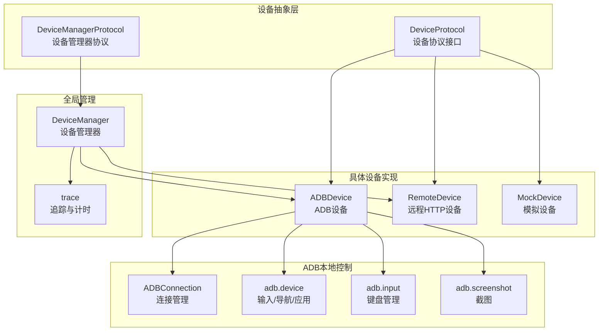
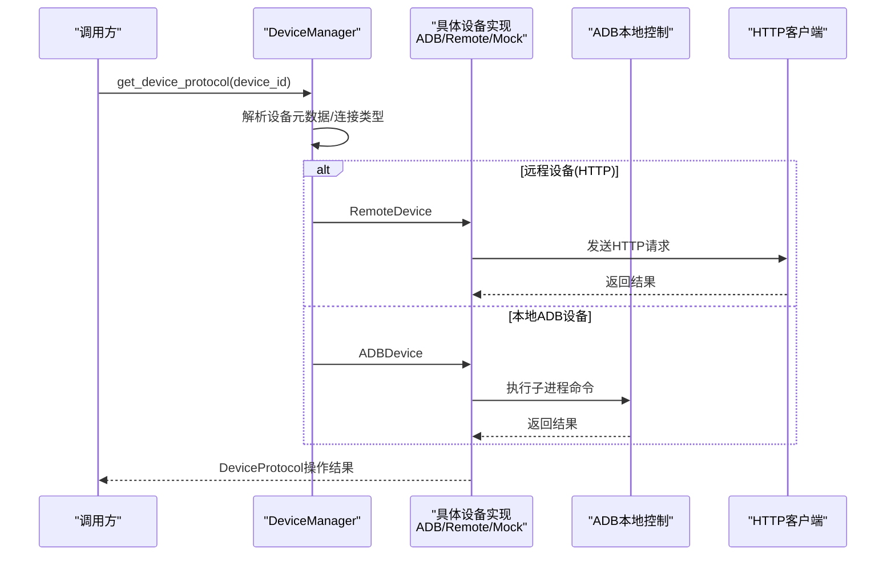
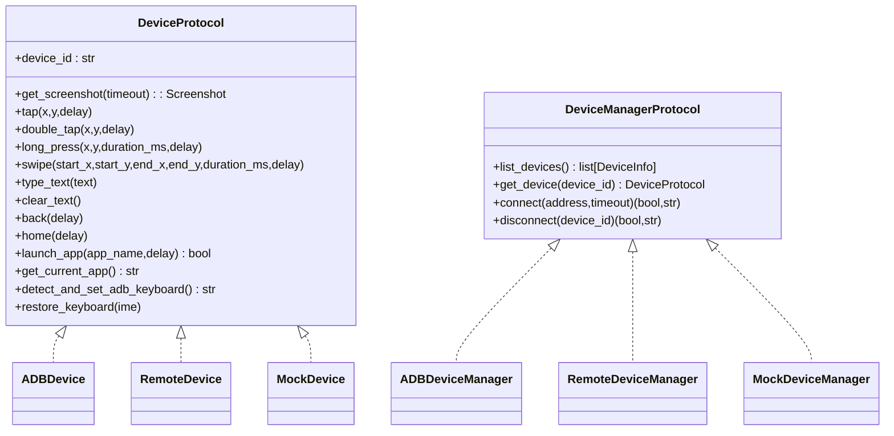
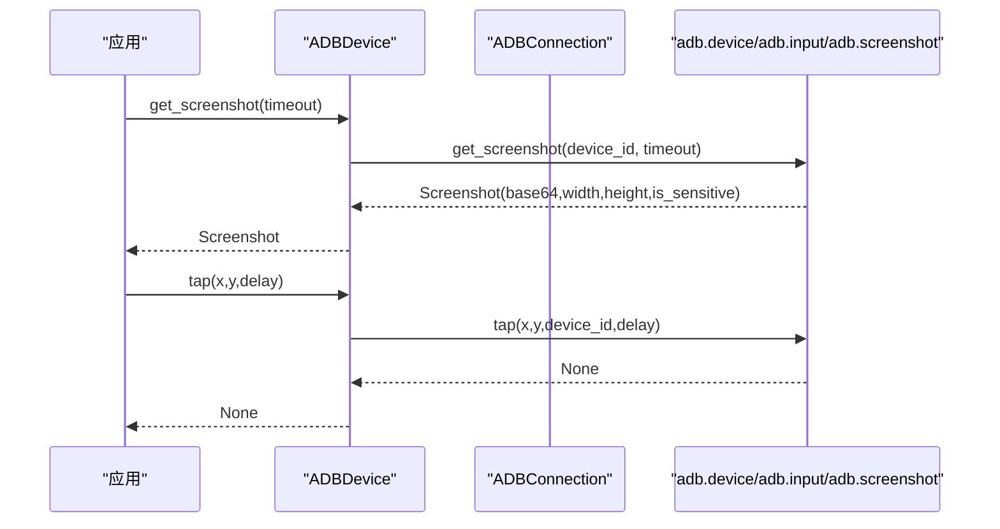
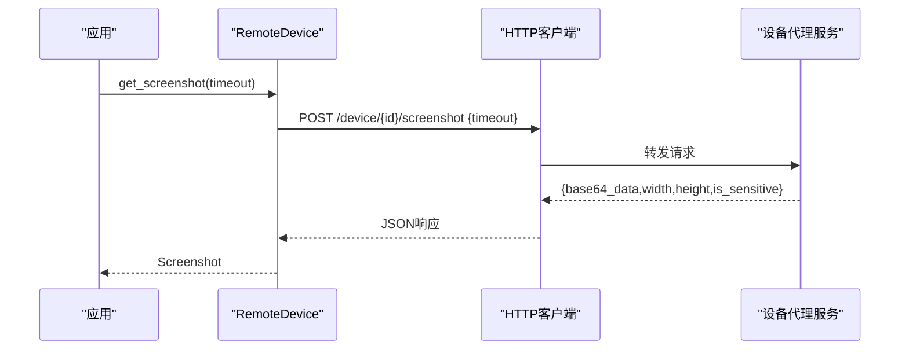
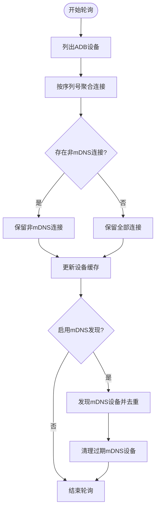
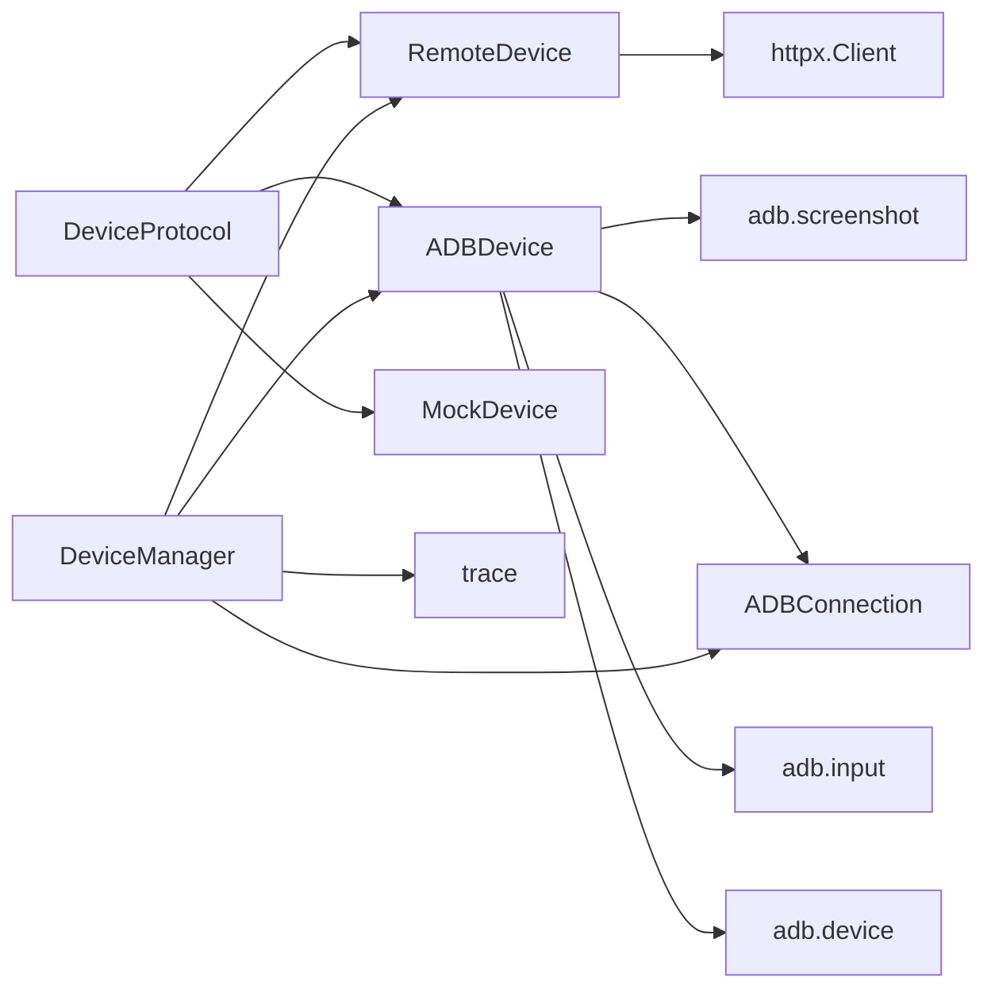

# 设备驱动扩展

<cite>
**本文引用的文件**
- [device_protocol.py](file://AutoGLM_GUI/device_protocol.py)
- [adb_device.py](file://AutoGLM_GUI/devices/adb_device.py)
- [remote_device.py](file://AutoGLM_GUI/devices/remote_device.py)
- [mock_device.py](file://AutoGLM_GUI/devices/mock_device.py)
- [device_manager.py](file://AutoGLM_GUI/device_manager.py)
- [connection.py](file://AutoGLM_GUI/adb/connection.py)
- [device.py](file://AutoGLM_GUI/adb/device.py)
- [input.py](file://AutoGLM_GUI/adb/input.py)
- [screenshot.py](file://AutoGLM_GUI/adb/screenshot.py)
- [__init__.py](file://AutoGLM_GUI/devices/__init__.py)
- [device-management-refactor-todo.md](file://docs/device-management-refactor-todo.md)
- [trace.py](file://AutoGLM_GUI/trace.py)
</cite>

## 目录
1. [引言](#引言)
2. [项目结构](#项目结构)
3. [核心组件](#核心组件)
4. [架构总览](#架构总览)
5. [详细组件分析](#详细组件分析)
6. [依赖分析](#依赖分析)
7. [性能考虑](#性能考虑)
8. [故障排除指南](#故障排除指南)
9. [结论](#结论)
10. [附录](#附录)

## 引言
本指南面向希望扩展和实现新设备驱动的开发者，系统阐述了设备驱动扩展的设计理念、接口规范、抽象层架构以及多设备支持机制。内容覆盖 DeviceProtocol 接口定义、ADB 设备、远程设备与模拟设备的实现模式、设备发现与连接管理、状态监控与操作执行流程、设备协议扩展方法、设备适配器模式与多设备支持、生命周期管理、错误处理与性能优化策略。

## 项目结构
该代码库采用按功能域划分的组织方式，设备驱动相关的核心位于 AutoGLM_GUI/devices 下，设备抽象与协议定义在 AutoGLM_GUI/device_protocol.py 中，ADB 本地控制能力封装在 AutoGLM_GUI/adb 子模块中，全局设备管理器在 AutoGLM_GUI/device_manager.py 中。

**图表来源**
- [device_protocol.py:48-266](file://AutoGLM_GUI/device_protocol.py#L48-L266)
- [adb_device.py:14-286](file://AutoGLM_GUI/devices/adb_device.py#L14-L286)
- [remote_device.py:21-207](file://AutoGLM_GUI/devices/remote_device.py#L21-L207)
- [mock_device.py:22-195](file://AutoGLM_GUI/devices/mock_device.py#L22-L195)
- [connection.py:49-343](file://AutoGLM_GUI/adb/connection.py#L49-L343)
- [device.py:11-277](file://AutoGLM_GUI/adb/device.py#L11-L277)
- [input.py:10-97](file://AutoGLM_GUI/adb/input.py#L10-L97)
- [screenshot.py:10-12](file://AutoGLM_GUI/adb/screenshot.py#L10-L12)
- [device_manager.py:249-1097](file://AutoGLM_GUI/device_manager.py#L249-L1097)
- [trace.py:757-855](file://AutoGLM_GUI/trace.py#L757-L855)

**章节来源**
- [device_protocol.py:1-267](file://AutoGLM_GUI/device_protocol.py#L1-L267)
- [__init__.py:1-30](file://AutoGLM_GUI/devices/__init__.py#L1-L30)

## 核心组件
- 设备协议接口 DeviceProtocol：定义统一的设备操作契约，屏蔽底层实现差异（ADB、远程HTTP、模拟等）。
- 设备管理器协议 DeviceManagerProtocol：统一多设备管理接口，支持列举、获取、连接、断开。
- 具体设备实现：
  - ADBDevice：基于本地 ADB 子进程调用的设备实现。
  - RemoteDevice：通过 HTTP 请求代理到远端设备代理服务的设备实现。
  - MockDevice：基于状态机的测试驱动设备实现。
- ADB 本地控制子模块：adb.connection、adb.device、adb.input、adb.screenshot 提供底层操作封装。
- 全局设备管理器 DeviceManager：负责设备发现、状态缓存、后台轮询、mDNS 发现、WiFi 连接、远程设备管理与适配器注入。

**章节来源**
- [device_protocol.py:48-266](file://AutoGLM_GUI/device_protocol.py#L48-L266)
- [adb_device.py:14-286](file://AutoGLM_GUI/devices/adb_device.py#L14-L286)
- [remote_device.py:21-207](file://AutoGLM_GUI/devices/remote_device.py#L21-L207)
- [mock_device.py:22-195](file://AutoGLM_GUI/devices/mock_device.py#L22-L195)
- [connection.py:49-343](file://AutoGLM_GUI/adb/connection.py#L49-L343)
- [device.py:11-277](file://AutoGLM_GUI/adb/device.py#L11-L277)
- [input.py:10-97](file://AutoGLM_GUI/adb/input.py#L10-L97)
- [screenshot.py:10-12](file://AutoGLM_GUI/adb/screenshot.py#L10-L12)
- [device_manager.py:249-1097](file://AutoGLM_GUI/device_manager.py#L249-L1097)

## 架构总览
设备驱动扩展采用“协议抽象 + 多实现 + 管理器适配”的架构。DeviceProtocol 抽象出设备操作，具体实现（ADBDevice、RemoteDevice、MockDevice）分别对接不同传输与控制通道。DeviceManager 负责设备发现、状态聚合、连接类型判定与适配器注入，统一对外暴露 DeviceProtocol 实例。

**图表来源**
- [device_manager.py:1053-1097](file://AutoGLM_GUI/device_manager.py#L1053-L1097)
- [adb_device.py:14-286](file://AutoGLM_GUI/devices/adb_device.py#L14-L286)
- [remote_device.py:21-207](file://AutoGLM_GUI/devices/remote_device.py#L21-L207)

## 详细组件分析

### 设备协议接口与抽象层设计
- DeviceProtocol 定义了统一的设备操作接口，包括截图、点击、双击、长按、滑动、文本输入、清空文本、返回主页、启动应用、获取当前应用、检测并设置ADB键盘、恢复键盘等。
- DeviceManagerProtocol 定义了设备管理器的统一接口，包括列举设备、获取设备实例、连接与断开。
- 抽象层设计原则：
  - 屏蔽底层实现差异：上层逻辑无需关心设备是本地ADB、远程HTTP还是测试模拟。
  - 明确职责边界：协议只定义接口，具体实现负责执行细节。
  - 可扩展性：新增设备类型只需实现协议接口并接入管理器。

**图表来源**
- [device_protocol.py:48-266](file://AutoGLM_GUI/device_protocol.py#L48-L266)
- [adb_device.py:14-286](file://AutoGLM_GUI/devices/adb_device.py#L14-L286)
- [remote_device.py:21-207](file://AutoGLM_GUI/devices/remote_device.py#L21-L207)
- [mock_device.py:22-195](file://AutoGLM_GUI/devices/mock_device.py#L22-L195)

**章节来源**
- [device_protocol.py:48-266](file://AutoGLM_GUI/device_protocol.py#L48-L266)

### ADB 设备实现模式
- ADBDevice 封装本地 ADB 子进程调用，将 DeviceProtocol 方法映射到 adb.device、adb.input、adb.screenshot 等底层函数。
- 关键特性：
  - 截图：调用 adb.screenshot.get_screenshot 并包装为 Screenshot 数据类。
  - 输入操作：tap、double_tap、long_press、swipe 等均通过 adb.device 的子进程命令执行。
  - 键盘管理：detect_and_set_adb_keyboard 与 restore_keyboard 通过 adb.input 实现。
  - 追踪与计时：所有操作使用 trace_span 和 trace_sleep 记录性能与可观测性。
- ADBDeviceManager 提供 ADB 设备的列举、获取、连接与断开能力，内部维护设备实例缓存。

**图表来源**
- [adb_device.py:43-198](file://AutoGLM_GUI/devices/adb_device.py#L43-L198)
- [connection.py:140-188](file://AutoGLM_GUI/adb/connection.py#L140-L188)
- [device.py:11-277](file://AutoGLM_GUI/adb/device.py#L11-L277)
- [input.py:10-97](file://AutoGLM_GUI/adb/input.py#L10-L97)
- [screenshot.py:10-12](file://AutoGLM_GUI/adb/screenshot.py#L10-L12)

**章节来源**
- [adb_device.py:14-286](file://AutoGLM_GUI/devices/adb_device.py#L14-L286)
- [connection.py:49-343](file://AutoGLM_GUI/adb/connection.py#L49-L343)
- [device.py:11-277](file://AutoGLM_GUI/adb/device.py#L11-L277)
- [input.py:10-97](file://AutoGLM_GUI/adb/input.py#L10-L97)
- [screenshot.py:10-12](file://AutoGLM_GUI/adb/screenshot.py#L10-L12)

### 远程设备实现模式
- RemoteDevice 通过 HTTP 客户端向远端设备代理服务发起请求，代理服务负责实际的设备控制（可为 ADB、无障碍服务或模拟实现）。
- 关键特性：
  - 统一的 HTTP 接口：/screenshot、/tap、/double_tap、/long_press、/swipe、/type_text、/clear_text、/back、/home、/launch_app、/current_app、/detect_keyboard、/restore_keyboard。
  - 资源管理：支持 with 上下文与显式 close，确保 HTTP 客户端正确释放。
  - RemoteDeviceManager 提供远端设备的列举、获取、连接与断开能力。
- 适用场景：跨网络、跨主机的设备控制，或需要集中式设备代理的服务架构。

**图表来源**
- [remote_device.py:77-145](file://AutoGLM_GUI/devices/remote_device.py#L77-L145)

**章节来源**
- [remote_device.py:21-207](file://AutoGLM_GUI/devices/remote_device.py#L21-L207)

### 模拟设备实现模式
- MockDevice 通过状态机驱动，用于测试与验证设备协议的正确性。所有操作最终路由到状态机进行验证与状态推进。
- 关键特性：
  - 截图：从状态机获取当前截图。
  - 输入操作：tap/double_tap/long_press/swipe 等直接传递坐标给状态机。
  - 应用与导航：在测试场景中通常为空操作或占位实现。
  - 键盘管理：返回预设值以满足协议要求。
- MockDeviceManager 提供单个模拟设备的管理能力，便于测试用例编排。

**章节来源**
- [mock_device.py:22-195](file://AutoGLM_GUI/devices/mock_device.py#L22-L195)

### 设备发现、连接管理与状态监控
- 设备发现与轮询：
  - DeviceManager 使用后台线程定期轮询 ADB 设备列表，聚合同一设备的多个连接端点（如 USB、WiFi、mDNS），并选择优先级最高的主连接。
  - 支持 mDNS 设备发现，过滤掉与已有非 mDNS 连接冲突的条目，并清理过期的 mDNS 设备。
- 连接管理：
  - ADB 连接：通过 ADBConnection.connect/disconnect/list_devices 管理本地/远程 ADB 连接。
  - WiFi 连接：支持启用 TCP/IP、自动获取 IP、手动连接与配对连接等多种方式。
  - 远程设备：通过 RemoteDeviceManager 与远端代理服务交互，支持动态添加/移除。
- 状态监控：
  - 设备状态枚举 DeviceState：ONLINE、OFFLINE、DISCONNECTED、AVAILABLE_MDNS。
  - 连接优先级：USB > WiFi > Remote，状态优先级 device > offline > unauthorized。
  - 指数退避：轮询失败时指数退避，最大间隔限制，成功后重置。
- ADB 键盘准备：对本地 ADB 设备尝试安装与启用 ADB Keyboard，提升文本输入稳定性。

**图表来源**
- [device_manager.py:455-669](file://AutoGLM_GUI/device_manager.py#L455-L669)

**章节来源**
- [device_manager.py:249-1097](file://AutoGLM_GUI/device_manager.py#L249-L1097)
- [connection.py:140-188](file://AutoGLM_GUI/adb/connection.py#L140-L188)

### 设备协议扩展方法与适配器模式
- 扩展新设备类型：
  - 实现 DeviceProtocol 接口，提供统一的操作方法。
  - 如需独立管理器，实现 DeviceManagerProtocol，并在 DeviceManager.get_device_protocol 中根据连接类型或设备标识返回相应实现。
- 适配器模式：
  - DeviceManager.get_device_protocol 是统一入口，内部根据设备连接类型自动返回 ADBDevice 或 RemoteDevice，调用方无需感知底层差异。
- 多设备支持：
  - DeviceManager 以设备序列号（serial）为索引存储设备，支持多连接端点（USB/WiFi/mDNS/远程）并选择主连接。
  - 支持同时管理本地与远程设备，统一对外暴露 DeviceProtocol。

**章节来源**
- [device_manager.py:1053-1097](file://AutoGLM_GUI/device_manager.py#L1053-L1097)
- [device_protocol.py:48-266](file://AutoGLM_GUI/device_protocol.py#L48-L266)

### 生命周期管理、错误处理与性能优化
- 生命周期管理：
  - 设备管理器单例化，支持启动/停止后台轮询线程。
  - 远程设备在管理器中缓存，断开连接时清理缓存并关闭 HTTP 客户端。
- 错误处理：
  - 轮询失败采用指数退避策略，避免频繁重试造成资源浪费。
  - ADB 连接错误、HTTP 请求异常均有明确的错误信息返回。
- 性能优化：
  - 截图与输入操作均使用 trace_span/trace_sleep 记录耗时，便于性能分析与优化。
  - ADB 设备操作通过子进程执行，合理设置延迟参数，避免过于频繁的操作导致设备卡顿。
  - 远程设备通过 HTTP 客户端复用与超时配置降低网络开销。

**章节来源**
- [device_manager.py:315-344](file://AutoGLM_GUI/device_manager.py#L315-L344)
- [device_manager.py:670-684](file://AutoGLM_GUI/device_manager.py#L670-L684)
- [trace.py:757-855](file://AutoGLM_GUI/trace.py#L757-L855)

## 依赖分析
- 设备协议层依赖于 Python 协议运行时检查，确保实现类符合接口约定。
- ADB 设备实现依赖 adb 子模块的连接、输入、设备控制与截图功能。
- 远程设备实现依赖 httpx HTTP 客户端与远端代理服务。
- 设备管理器依赖 ADB 连接、ADB 键盘安装器、mDNS 发现工具与设备元数据管理器。

**图表来源**
- [device_protocol.py:48-266](file://AutoGLM_GUI/device_protocol.py#L48-L266)
- [adb_device.py:14-286](file://AutoGLM_GUI/devices/adb_device.py#L14-L286)
- [remote_device.py:21-207](file://AutoGLM_GUI/devices/remote_device.py#L21-L207)
- [connection.py:49-343](file://AutoGLM_GUI/adb/connection.py#L49-L343)
- [device.py:11-277](file://AutoGLM_GUI/adb/device.py#L11-L277)
- [input.py:10-97](file://AutoGLM_GUI/adb/input.py#L10-L97)
- [screenshot.py:10-12](file://AutoGLM_GUI/adb/screenshot.py#L10-L12)
- [device_manager.py:249-1097](file://AutoGLM_GUI/device_manager.py#L249-L1097)
- [trace.py:757-855](file://AutoGLM_GUI/trace.py#L757-L855)

**章节来源**
- [device_protocol.py:48-266](file://AutoGLM_GUI/device_protocol.py#L48-L266)
- [adb_device.py:14-286](file://AutoGLM_GUI/devices/adb_device.py#L14-L286)
- [remote_device.py:21-207](file://AutoGLM_GUI/devices/remote_device.py#L21-L207)
- [mock_device.py:22-195](file://AutoGLM_GUI/devices/mock_device.py#L22-L195)
- [connection.py:49-343](file://AutoGLM_GUI/adb/connection.py#L49-L343)
- [device_manager.py:249-1097](file://AutoGLM_GUI/device_manager.py#L249-L1097)

## 性能考虑
- 轮询策略：默认 10 秒轮询一次，失败时指数退避至最大 60 秒，减少无效请求与资源消耗。
- 操作延迟：输入操作（点击、滑动、长按等）内置延迟参数，避免过于频繁触发导致设备卡顿。
- 追踪与度量：所有关键操作使用 trace_span/trace_sleep 记录耗时，便于定位性能瓶颈。
- 远程设备：HTTP 客户端复用与超时配置，避免连接泄漏与长时间阻塞。

[本节为通用指导，无需特定文件引用]

## 故障排除指南
- ADB 设备无法连接：
  - 检查 ADB 服务器状态与设备授权状态，必要时重启 ADB 服务器。
  - 对于 WiFi 连接，确认设备已启用无线调试并正确获取 IP。
- 远程设备连接失败：
  - 确认远端代理服务地址与端口正确，网络连通性正常。
  - 检查代理服务是否正确实现了设备协议接口。
- 设备状态异常：
  - 观察 DeviceManager 日志中的轮询失败与退避信息，确认设备是否被标记为离线或断开。
  - 清理过期的 mDNS 设备，避免状态污染。

**章节来源**
- [connection.py:288-317](file://AutoGLM_GUI/adb/connection.py#L288-L317)
- [device_manager.py:670-684](file://AutoGLM_GUI/device_manager.py#L670-L684)
- [remote_device.py:188-201](file://AutoGLM_GUI/devices/remote_device.py#L188-L201)

## 结论
本指南系统梳理了设备驱动扩展的接口规范、抽象层设计与实现模式，展示了如何通过 DeviceProtocol 与 DeviceManager 实现多设备统一管理与适配。通过对 ADB、远程与模拟设备的实现分析，开发者可以快速扩展新的设备类型并集成到现有体系中。结合设备管理器的状态监控、错误处理与性能优化策略，可在复杂部署环境中稳定运行。

[本节为总结性内容，无需特定文件引用]

## 附录

### 设备协议接口定义要点
- 截图：返回包含 base64 数据、宽高与敏感标志的数据类。
- 输入操作：统一支持坐标系、持续时间与延迟参数。
- 应用与导航：提供启动应用、返回与主页等常用操作。
- 键盘管理：提供检测/切换/恢复 ADB Keyboard 的能力。

**章节来源**
- [device_protocol.py:27-212](file://AutoGLM_GUI/device_protocol.py#L27-L212)

### 设备管理器重构与术语收敛
- 术语收敛：明确 device_id、serial、primary_device_id 的职责边界，避免连接类型命名歧义。
- 兼容性：逐步清理低价值兼容入口，保持对外 API 行为一致。

**章节来源**
- [device-management-refactor-todo.md:66-75](file://docs/device-management-refactor-todo.md#L66-L75)