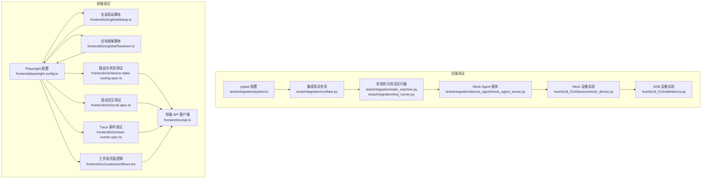
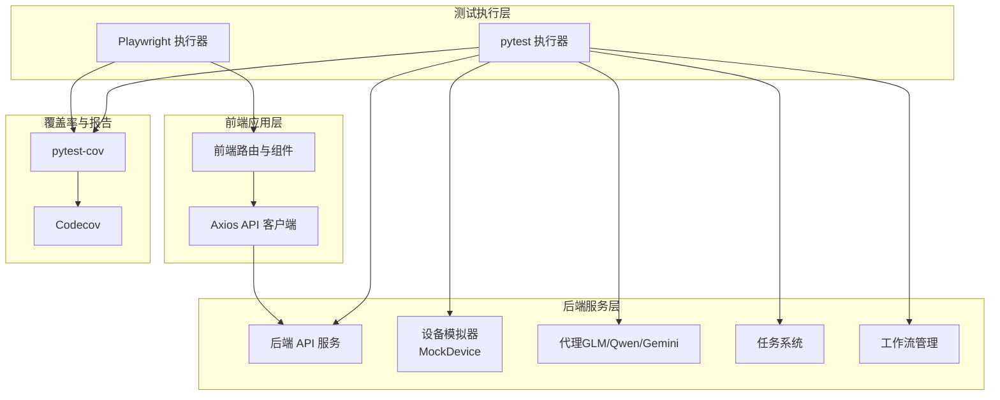
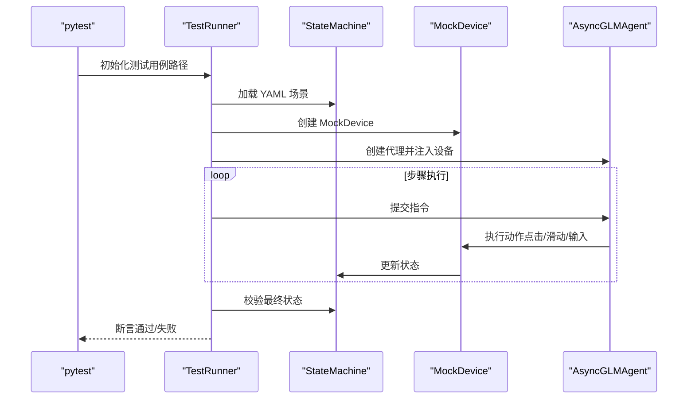
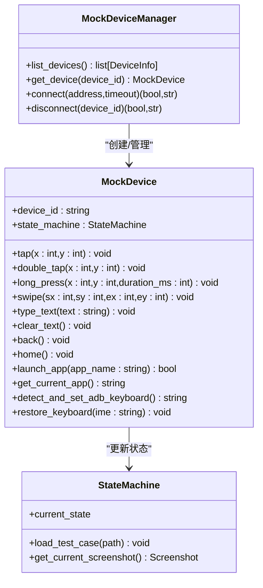
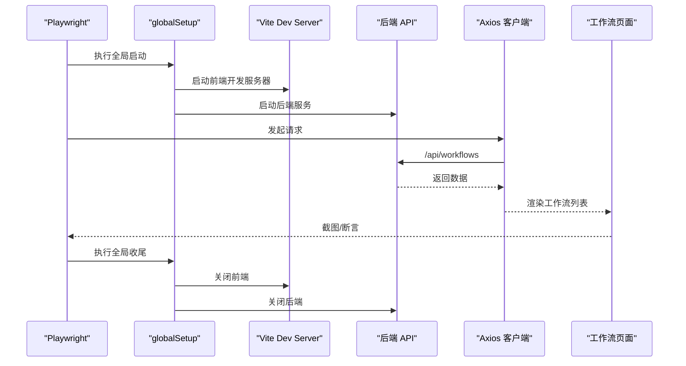
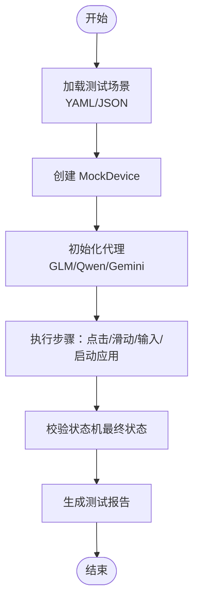
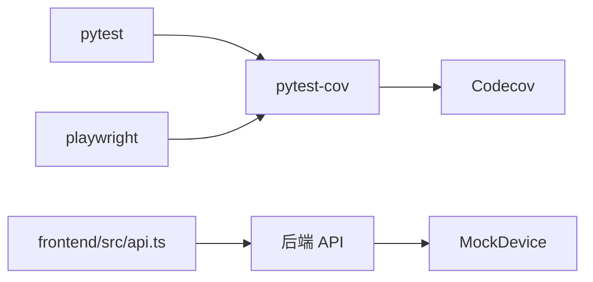

# 测试策略与实践

<cite>
**本文引用的文件**
- [pytest.ini](file://tests/integration/pytest.ini)
- [conftest.py](file://tests/integration/conftest.py)
- [state_machine.py](file://tests/integration/state_machine.py)
- [test_runner.py](file://tests/integration/test_runner.py)
- [mock_agent_server.py](file://tests/integration/device_agent/mock_agent_server.py)
- [mock_device.py](file://AutoGLM_GUI/devices/mock_device.py)
- [device.py](file://AutoGLM_GUI/adb/device.py)
- [playwright.config.ts](file://frontend/playwright.config.ts)
- [globalSetup.ts](file://frontend/e2e/globalSetup.ts)
- [globalTeardown.ts](file://frontend/e2e/globalTeardown.ts)
- [device-state-routing.spec.ts](file://frontend/e2e/device-state-routing.spec.ts)
- [scroll.spec.ts](file://frontend/e2e/scroll.spec.ts)
- [trace-events.spec.ts](file://frontend/e2e/trace-events.spec.ts)
- [api.ts](file://frontend/src/api.ts)
- [workflows.tsx](file://frontend/src/routes/workflows.tsx)
- [codecov.yml](file://codecov.yml)
- [uv.lock](file://uv.lock)
- [test_manager_device_coverage.py](file://tests/test_manager_device_coverage.py)
- [test_gemini_e2e.py](file://tests/test_gemini_e2e.py)
- [test_agent_adapter_coverage.py](file://tests/test_agent_adapter_coverage.py)
- [test_coverage_phase1.py](file://tests/test_coverage_phase1.py)
- [test_hardware_boundary_coverage.py](file://tests/test_hardware_boundary_coverage.py)
- [test_service_entry_coverage.py](file://tests/test_service_entry_coverage.py)
- [test_trace_observability_integration.py](file://tests/test_trace_observability_integration.py)
- [test_task_system_e2e.py](file://tests/test_task_system_e2e.py)
- [test_docker_e2e.py](file://tests/test_docker_e2e.py)
- [test_local_e2e.py](file://tests/test_local_e2e.py)
- [test_trace_replay_e2e.py](file://tests/test_trace_replay_e2e.py)
- [test_mcp_task_tools.py](file://tests/test_mcp_task_tools.py)
- [test_mcp_api.py](file://tests/test_mcp_api.py)
- [test_scheduled_tasks_api.py](file://tests/test_scheduled_tasks_api.py)
- [test_scheduler_manager.py](file://tests/test_scheduler_manager.py)
- [test_terminal_api.py](file://tests/test_terminal_api.py)
- [test_terminal_service.py](file://tests/test_terminal_service.py)
- [test_socketio_server.py](file://tests/test_socketio_server.py)
- [test_media_api.py](file://tests/test_media_api.py)
- [test_metrics.py](file://tests/test_metrics.py)
- [test_model_error_details.py](file://tests/test_model_error_details.py)
- [test_model_connection_check_api.py](file://tests/test_model_connection_check_api.py)
- [test_layered_agent_session_api.py](file://tests/test_layered_agent_session_api.py)
- [test_layered_max_turns_config.py](file://tests/test_layered_max_turns_config.py)
- [test_interaction_actions.py](file://tests/test_interaction_actions.py)
- [test_adb_input.py](file://tests/test_adb_input.py)
- [test_adb_manager.py](file://tests/test_adb_manager.py)
- [test_adb_pair_helpers.py](file://tests/test_adb_pair_helpers.py)
- [test_adb_terminal_repl.py](file://tests/test_adb_terminal_repl.py)
- [test_adb_keyboard_check.py](file://tests/test_adb_keyboard_check.py)
- [test_adb_device.py](file://AutoGLM_GUI/devices/adb_device.py)
- [test_remote_device.py](file://tests/integration/device_agent/test_remote_device.py)
- [test_e2e_with_adapter.py](file://tests/integration/device_agent/test_e2e_with_adapter.py)
- [test_qwen_agent.py](file://tests/test_qwen_agent.py)
- [test_glm_async_agent.py](file://tests/test_glm_async_agent.py)
- [test_gemini_agent.py](file://tests/test_gemini_agent.py)
- [test_phone_agent_manager.py](file://tests/test_phone_agent_manager.py)
- [test_experience_api.py](file://tests/test_experience_api.py)
- [test_experience_report.py](file://tests/test_experience_report.py)
- [test_history_api.py](file://tests/test_history_api.py)
- [test_tasks_api.py](file://tests/test_tasks_api.py)
- [test_agents_api.py](file://tests/test_agents_api.py)
- [test_devices_api.py](file://tests/test_devices_api.py)
- [test_health_api.py](file://tests/test_health_api.py)
- [test_version_api.py](file://tests/test_version_api.py)
- [test_workflows_api.py](file://tests/test_workflows_api.py)
- [test_device_metadata_manager.py](file://tests/test_device_metadata_manager.py)
- [test_device_name_api.py](file://tests/test_device_name_api.py)
- [test_control_api.py](file://tests/test_control_api.py)
- [test_qr_pairing.py](file://tests/test_qr_pairing.py)
- [test_serial_extraction.py](file://tests/test_serial_extraction.py)
- [test_scrcpy_stream_edges.py](file://tests/test_scrcpy_stream_edges.py)
- [test_static_assets_mime.py](file://tests/test_static_assets_mime.py)
- [test_task_api_phase1.py](file://tests/test_task_api_phase1.py)
- [test_task_manager.py](file://tests/test_task_manager.py)
- [test_task_store.py](file://tests/test_task_store.py)
- [test_trace.py](file://tests/test_trace.py)
- [test_cancel_device_release.py](file://tests/test_cancel_device_release.py)
- [test_device_manager_keyboard_init.py](file://tests/test_device_manager_keyboard_init.py)
- [test_agents_chat_config_api.py](file://tests/test_agents_chat_config_api.py)
- [test_glm_module_layout.py](file://tests/test_glm_module_layout.py)
- [test_glm_module_paths.py](file://tests/test_glm_module_paths.py)
- [test_glm_async_agent.py](file://tests/test_glm_async_agent.py)
- [test_glm_async_agent.py](file://AutoGLM_GUI/agents/glm/async_agent.py)
- [test_glm_async_agent.py](file://AutoGLM_GUI/agents/glm/parser.py)
- [test_glm_async_agent.py](file://AutoGLM_GUI/agents/glm/prompts_en.py)
- [test_qwen_agent.py](file://AutoGLM_GUI/agents/qwen/async_agent.py)
- [test_qwen_agent.py](file://AutoGLM_GUI/agents/qwen/parser.py)
- [test_qwen_agent.py](file://AutoGLM_GUI/agents/qwen/prompts_en.py)
- [test_qwen_agent.py](file://AutoGLM_GUI/agents/qwen/prompts_zh.py)
- [test_gemini_agent.py](file://AutoGLM_GUI/agents/gemini/async_agent.py)
- [test_gemini_agent.py](file://AutoGLM_GUI/agents/gemini/action_mapper.py)
- [test_gemini_agent.py](file://AutoGLM_GUI/agents/gemini/models.py)
- [test_gemini_agent.py](file://AutoGLM_GUI/agents/gemini/prompts.py)
- [test_gemini_agent.py](file://AutoGLM_GUI/agents/gemini/tools.py)
- [test_phone_agent_manager.py](file://AutoGLM_GUI/phone_agent_manager.py)
- [test_device_metadata_manager.py](file://AutoGLM_GUI/device_metadata_manager.py)
- [test_device_manager.py](file://AutoGLM_GUI/device_manager.py)
- [test_device_group_manager.py](file://AutoGLM_GUI/device_group_manager.py)
- [test_scheduler_manager.py](file://AutoGLM_GUI/scheduler_manager.py)
- [test_task_manager.py](file://AutoGLM_GUI/task_manager.py)
- [test_task_store.py](file://AutoGLM_GUI/task_store.py)
- [test_workflow_manager.py](file://AutoGLM_GUI/workflow_manager.py)
- [test_experience_planner.py](file://AutoGLM_GUI/experience_planner.py)
- [test_experience_report.py](file://AutoGLM_GUI/experience_report.py)
- [test_history_manager.py](file://AutoGLM_GUI/history_manager.py)
- [test_metrics.py](file://AutoGLM_GUI/metrics.py)
- [test_scrcpy_stream.py](file://AutoGLM_GUI/scrcpy_stream.py)
- [test_scrcpy_protocol.py](file://AutoGLM_GUI/scrcpy_protocol.py)
- [test_socketio_server.py](file://AutoGLM_GUI/socketio_server.py)
- [test_server.py](file://AutoGLM_GUI/server.py)
- [test_layered_agent_service.py](file://AutoGLM_GUI/layered_agent_service.py)
- [test_adb_manager.py](file://AutoGLM_GUI/adb_manager.py)
- [test_adb_terminal_service.py](file://AutoGLM_GUI/adb_terminal_service.py)
- [test_adb_terminal_repl.py](file://AutoGLM_GUI/adb_terminal_repl.py)
- [test_adb_plus_device.py](file://AutoGLM_GUI/adb_plus/device.py)
- [test_adb_plus_display.py](file://AutoGLM_GUI/adb_plus/display.py)
- [test_adb_plus_ip.py](file://AutoGLM_GUI/adb_plus/ip.py)
- [test_adb_plus_keyboard_installer.py](file://AutoGLM_GUI/adb_plus/keyboard_installer.py)
- [test_adb_plus_mdns.py](file://AutoGLM_GUI/adb_plus/mdns.py)
- [test_adb_plus_pair.py](file://AutoGLM_GUI/adb_plus/pair.py)
- [test_adb_plus_qr_pair.py](file://AutoGLM_GUI/adb_plus/qr_pair.py)
- [test_adb_plus_screenshot.py](file://AutoGLM_GUI/adb_plus/screenshot.py)
- [test_adb_plus_serial.py](file://AutoGLM_GUI/adb_plus/serial.py)
- [test_adb_plus_touch.py](file://AutoGLM_GUI/adb_plus/touch.py)
- [test_adb_plus_version.py](file://AutoGLM_GUI/adb_plus/version.py)
</cite>

## 目录
1. 引言
2. 项目结构
3. 核心组件
4. 架构总览
5. 详细组件分析
6. 依赖分析
7. 性能考虑
8. 故障排查指南
9. 结论
10. 附录

## 引言
本文件为 AutoGLM-GUI 项目制定全面的测试策略与实践方案，覆盖单元测试、集成测试、端到端测试的组织结构与实施方法；明确测试用例设计原则、Mock 策略与测试数据管理；提供前端组件测试、API 接口测试与设备模拟测试的具体实施方案；说明测试自动化流程、持续测试集成与性能测试策略；并给出测试覆盖率要求与测试报告生成建议。

## 项目结构
AutoGLM-GUI 的测试体系由后端 Python 单元/集成测试、前端 Playwright 端到端测试以及覆盖度配置组成。后端测试采用 pytest 配置与自定义状态机驱动的设备模拟；前端测试通过 Playwright 在本地开发服务器上运行，并通过全局钩子启动/关闭服务与依赖。

**图表来源**
- [pytest.ini:1-8](file://tests/integration/pytest.ini#L1-L8)
- [conftest.py](file://tests/integration/conftest.py)
- [state_machine.py](file://tests/integration/state_machine.py)
- [test_runner.py:1-43](file://tests/integration/test_runner.py#L1-L43)
- [mock_agent_server.py:44-136](file://tests/integration/device_agent/mock_agent_server.py#L44-L136)
- [mock_device.py:129-194](file://AutoGLM_GUI/devices/mock_device.py#L129-L194)
- [device.py:197-247](file://AutoGLM_GUI/adb/device.py#L197-L247)
- [playwright.config.ts:1-20](file://frontend/playwright.config.ts#L1-L20)
- [globalSetup.ts](file://frontend/e2e/globalSetup.ts)
- [globalTeardown.ts](file://frontend/e2e/globalTeardown.ts)
- [device-state-routing.spec.ts](file://frontend/e2e/device-state-routing.spec.ts)
- [scroll.spec.ts](file://frontend/e2e/scroll.spec.ts)
- [trace-events.spec.ts](file://frontend/e2e/trace-events.spec.ts)
- [api.ts:896-957](file://frontend/src/api.ts#L896-L957)
- [workflows.tsx:133-314](file://frontend/src/routes/workflows.tsx#L133-L314)

**章节来源**
- [pytest.ini:1-8](file://tests/integration/pytest.ini#L1-L8)
- [playwright.config.ts:1-20](file://frontend/playwright.config.ts#L1-L20)

## 核心组件
- 后端测试框架：基于 pytest 的集成测试，使用自定义状态机与 Mock 设备驱动，验证设备交互、任务系统、工作流与代理行为。
- 前端测试框架：基于 Playwright，使用 Vite 开发服务器，通过全局钩子管理服务生命周期，覆盖路由、交互与 Trace 事件。
- 覆盖率与报告：使用 pytest-cov 与 Codecov 配置，设定覆盖率阈值与 PR 注释策略。

**章节来源**
- [pytest.ini:1-8](file://tests/integration/pytest.ini#L1-L8)
- [codecov.yml:1-27](file://codecov.yml#L1-L27)
- [uv.lock:3591-3619](file://uv.lock#L3591-L3619)

## 架构总览
下图展示测试架构中各层之间的关系：后端通过 Mock 设备与状态机驱动 Agent 行为；前端通过 Playwright 访问后端 API 并验证 UI 行为；覆盖率工具贯穿两端以保证质量门禁。

**图表来源**
- [test_runner.py:20-43](file://tests/integration/test_runner.py#L20-L43)
- [mock_device.py:129-194](file://AutoGLM_GUI/devices/mock_device.py#L129-L194)
- [api.ts:896-957](file://frontend/src/api.ts#L896-L957)
- [codecov.yml:1-27](file://codecov.yml#L1-L27)

## 详细组件分析

### 后端单元测试与集成测试组织
- 测试发现规则：通过 pytest.ini 指定类名、函数名前缀与忽略收集警告，确保仅收集有效测试用例。
- 集成测试夹具：conftest.py 提供共享的测试环境初始化与清理逻辑，统一管理 Mock 服务与设备状态。
- 状态机与测试运行器：state_machine.py 定义测试场景的状态转移与截图期望；test_runner.py 将 YAML 场景加载为状态机，驱动 MockDevice 与 Agent 执行指令并校验最终状态。
- Mock Agent 服务：mock_agent_server.py 提供命令记录、设备列表、截图与当前应用查询等接口，支撑端到端与远程设备测试。

**图表来源**
- [test_runner.py:20-43](file://tests/integration/test_runner.py#L20-L43)
- [state_machine.py](file://tests/integration/state_machine.py)
- [mock_device.py:129-194](file://AutoGLM_GUI/devices/mock_device.py#L129-L194)

**章节来源**
- [pytest.ini:1-8](file://tests/integration/pytest.ini#L1-L8)
- [conftest.py](file://tests/integration/conftest.py)
- [state_machine.py](file://tests/integration/state_machine.py)
- [test_runner.py:1-43](file://tests/integration/test_runner.py#L1-L43)
- [mock_agent_server.py:44-136](file://tests/integration/device_agent/mock_agent_server.py#L44-L136)

### 设备模拟与交互测试
- MockDevice 实现：提供点击、双击、长按、滑动、文本输入、返回/主页、应用启动、键盘检测与恢复等方法，并维护内部状态机记录交互历史。
- ADB 设备实现：device.py 中封装了实际 ADB 命令调用与延时控制，用于对比与回归验证。
- 覆盖度测试：test_manager_device_coverage.py 验证 MockDevice 的完整交互路径与异常处理分支。

**图表来源**
- [mock_device.py:129-194](file://AutoGLM_GUI/devices/mock_device.py#L129-L194)
- [state_machine.py](file://tests/integration/state_machine.py)

**章节来源**
- [mock_device.py:129-194](file://AutoGLM_GUI/devices/mock_device.py#L129-L194)
- [device.py:197-247](file://AutoGLM_GUI/adb/device.py#L197-L247)
- [test_manager_device_coverage.py:737-778](file://tests/test_manager_device_coverage.py#L737-L778)

### 前端组件测试与 API 雃测
- Playwright 配置：playwright.config.ts 设置测试目录、超时、重试、并发与 Web 服务器启动参数，确保前端测试在本地开发环境下稳定运行。
- 全局钩子：globalSetup.ts 与 globalTeardown.ts 负责启动/停止 Vite 开发服务器与后端服务，保证测试前后环境一致性。
- 端到端用例：device-state-routing.spec.ts、scroll.spec.ts、trace-events.spec.ts 分别覆盖路由状态、滚动交互与 Trace 事件，确保核心用户路径可用。
- API 客户端与页面逻辑：api.ts 提供工作流与任务相关 API；workflows.tsx 展示工作流 CRUD 逻辑，包括解析/构建工作流文本、表单校验与保存流程。

**图表来源**
- [playwright.config.ts:1-20](file://frontend/playwright.config.ts#L1-L20)
- [globalSetup.ts](file://frontend/e2e/globalSetup.ts)
- [globalTeardown.ts](file://frontend/e2e/globalTeardown.ts)
- [api.ts:896-957](file://frontend/src/api.ts#L896-L957)
- [workflows.tsx:171-314](file://frontend/src/routes/workflows.tsx#L171-L314)

**章节来源**
- [playwright.config.ts:1-20](file://frontend/playwright.config.ts#L1-L20)
- [globalSetup.ts](file://frontend/e2e/globalSetup.ts)
- [globalTeardown.ts](file://frontend/e2e/globalTeardown.ts)
- [device-state-routing.spec.ts](file://frontend/e2e/device-state-routing.spec.ts)
- [scroll.spec.ts](file://frontend/e2e/scroll.spec.ts)
- [trace-events.spec.ts](file://frontend/e2e/trace-events.spec.ts)
- [api.ts:896-957](file://frontend/src/api.ts#L896-L957)
- [workflows.tsx:133-314](file://frontend/src/routes/workflows.tsx#L133-L314)

### API 接口测试与设备模拟测试
- 设备与任务 API：tests 目录下包含设备、任务、工作流、健康、版本等 API 测试文件，覆盖增删改查、状态变更与错误处理。
- 远程设备与适配器端到端：integration/device_agent 下的 test_remote_device.py 与 test_e2e_with_adapter.py 使用 Mock Agent 服务验证远程设备交互与代理适配器行为。
- MCP 与计划任务：test_mcp_api.py、test_mcp_task_tools.py、test_scheduled_tasks_api.py、test_scheduler_manager.py 验证多模态通道与调度能力。
- 终端与媒体：test_terminal_api.py、test_terminal_service.py、test_media_api.py 验证终端会话与媒体资源访问。
- SocketIO 与指标：test_socketio_server.py、test_metrics.py 验证实时通信与指标上报。

**图表来源**
- [test_remote_device.py](file://tests/integration/device_agent/test_remote_device.py)
- [test_e2e_with_adapter.py](file://tests/integration/device_agent/test_e2e_with_adapter.py)
- [mock_agent_server.py:44-136](file://tests/integration/device_agent/mock_agent_server.py#L44-L136)

**章节来源**
- [test_remote_device.py](file://tests/integration/device_agent/test_remote_device.py)
- [test_e2e_with_adapter.py](file://tests/integration/device_agent/test_e2e_with_adapter.py)
- [test_mcp_api.py](file://tests/test_mcp_api.py)
- [test_mcp_task_tools.py](file://tests/test_mcp_task_tools.py)
- [test_scheduled_tasks_api.py](file://tests/test_scheduled_tasks_api.py)
- [test_scheduler_manager.py](file://tests/test_scheduler_manager.py)
- [test_terminal_api.py](file://tests/test_terminal_api.py)
- [test_terminal_service.py](file://tests/test_terminal_service.py)
- [test_media_api.py](file://tests/test_media_api.py)
- [test_socketio_server.py](file://tests/test_socketio_server.py)
- [test_metrics.py](file://tests/test_metrics.py)

## 依赖分析
- 测试依赖：pytest、pytest-cov、playwright 等作为核心测试工具；uv.lock 显示依赖版本锁定。
- 覆盖率与 CI：codecov.yml 配置覆盖率范围、目标与 PR 注释行为，确保合并质量门禁。
- 前后端耦合点：前端通过 Axios 访问后端 API；后端通过 MockDevice 与状态机解耦真实设备。

**图表来源**
- [uv.lock:3591-3619](file://uv.lock#L3591-L3619)
- [codecov.yml:1-27](file://codecov.yml#L1-L27)
- [api.ts:896-957](file://frontend/src/api.ts#L896-L957)

**章节来源**
- [uv.lock:3591-3619](file://uv.lock#L3591-L3619)
- [codecov.yml:1-27](file://codecov.yml#L1-L27)

## 性能考虑
- 测试并发与稳定性：前端 Playwright 配置中设置 workers=1 以避免并发导致的不稳定；可根据 CI 资源调整。
- 延时与等待：后端 ADB 设备实现包含延时控制，集成测试应结合状态机与截图验证减少无谓等待。
- 覆盖率门槛：Codecov 配置 target 自动，建议在 PR 中设置最小覆盖率阈值，防止回归。

[本节为通用指导，不直接分析具体文件]

## 故障排查指南
- 前端测试失败：检查 Playwright 配置与全局钩子是否正确启动/关闭服务；确认 baseURL 与端口一致。
- 后端测试失败：核对 YAML 场景与状态机定义；检查 MockDevice 的交互记录与状态机推进。
- 覆盖率不足：增加单元测试与集成测试用例，特别是边界条件与异常路径；关注未覆盖模块如设备管理、任务存储等。

**章节来源**
- [playwright.config.ts:1-20](file://frontend/playwright.config.ts#L1-L20)
- [globalSetup.ts](file://frontend/e2e/globalSetup.ts)
- [globalTeardown.ts](file://frontend/e2e/globalTeardown.ts)
- [codecov.yml:1-27](file://codecov.yml#L1-L27)

## 结论
本测试策略以 pytest 与 Playwright 为核心，结合 Mock 设备与状态机驱动，覆盖后端代理、任务系统、工作流与前端 UI 的关键路径。通过覆盖率与 CI 配置形成质量门禁，配合端到端测试保障用户体验。建议持续扩展场景覆盖与性能测试，确保在多模型与多设备场景下的稳定性。

[本节为总结性内容，不直接分析具体文件]

## 附录

### 测试用例设计原则
- 可重复性：使用固定种子与 Mock 数据，确保测试可重复。
- 边界与异常：覆盖空输入、超长文本、设备离线、网络抖动等异常场景。
- 可观测性：记录关键事件与截图，便于回溯与定位问题。

[本节为通用指导，不直接分析具体文件]

### Mock 策略
- 后端：使用 MockDevice 与状态机替代真实设备，记录交互历史并校验最终状态。
- 前端：使用 Playwright 的内置 Mock 能力或拦截网络请求，模拟后端响应。

[本节为通用指导，不直接分析具体文件]

### 测试数据管理
- 场景文件：YAML/JSON 场景集中于 tests/integration/fixtures/scenarios，便于维护与复用。
- 截图与 Golden：使用 base64 截图与规范化 JSON 对比，减少视觉差异带来的误判。

[本节为通用指导，不直接分析具体文件]

### 测试自动化与持续测试集成
- CI 集成：在 CI 中分别运行后端与前端测试，上传覆盖率至 Codecov。
- 自动化流程：通过全局钩子在本地与 CI 环境中统一启动/关闭服务。

[本节为通用指导，不直接分析具体文件]

### 性能测试策略
- 前端：使用 Playwright 的性能 API 记录关键指标（首屏、交互延迟），在 CI 中进行趋势监控。
- 后端：对关键路径（代理推理、设备交互）进行基准测试，识别回归。

[本节为通用指导，不直接分析具体文件]

### 测试覆盖率要求与报告生成
- 覆盖率范围：根据 codecov.yml 配置，项目级覆盖率目标为自动评估，建议在 PR 中设置最低阈值。
- 报告生成：pytest-cov 自动生成 XML/HTML 报告，结合 Codecov 生成 PR 注释与覆盖率图表。

**章节来源**
- [codecov.yml:1-27](file://codecov.yml#L1-L27)
- [uv.lock:3607-3619](file://uv.lock#L3607-L3619)