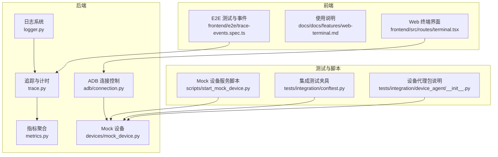
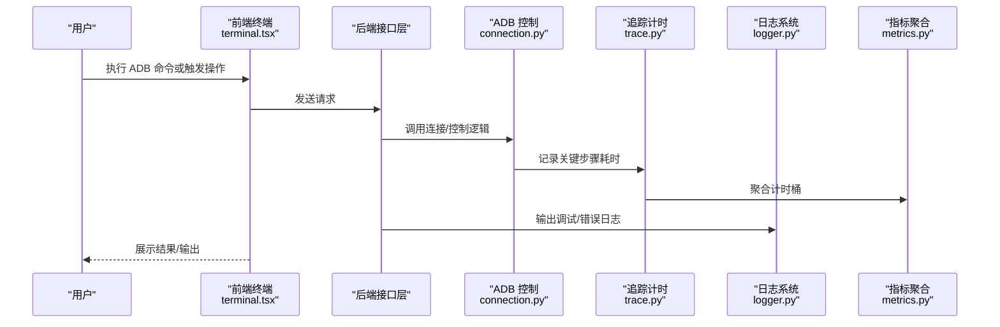
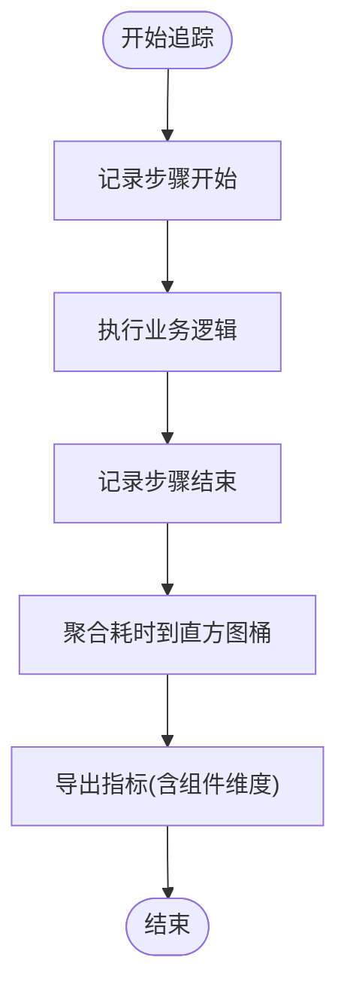
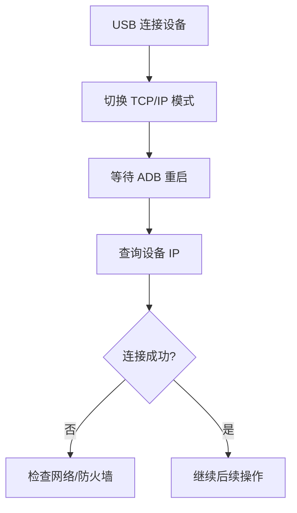
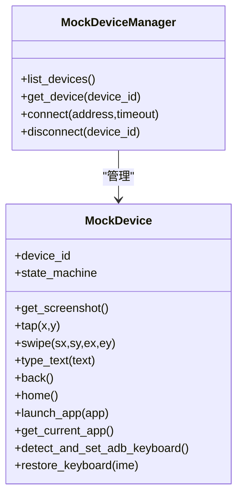
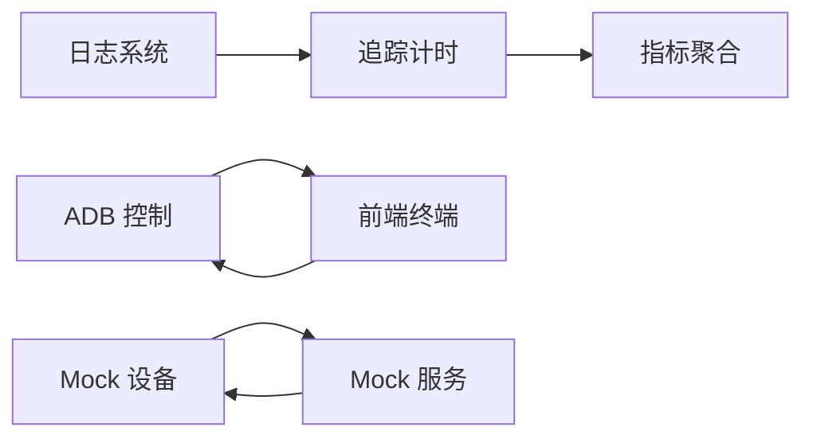

# 调试工具与技巧

<cite>
**本文引用的文件**
- [logger.py](file://AutoGLM_GUI/logger.py)
- [trace.py](file://AutoGLM_GUI/trace.py)
- [metrics.py](file://AutoGLM_GUI/metrics.py)
- [connection.py](file://AutoGLM_GUI/adb/connection.py)
- [terminal.tsx](file://frontend/src/routes/terminal.tsx)
- [web-terminal.md](file://docs/docs/features/web-terminal.md)
- [mock_device.py](file://AutoGLM_GUI/devices/mock_device.py)
- [start_mock_device.py](file://scripts/start_mock_device.py)
- [conftest.py](file://tests/integration/conftest.py)
- [device_agent/__init__.py](file://tests/integration/device_agent/__init__.py)
- [test_manager_device_coverage.py](file://tests/test_manager_device_coverage.py)
- [trace-events.spec.ts](file://frontend/e2e/trace-events.spec.ts)
</cite>

## 目录
1. [简介](#简介)
2. [项目结构](#项目结构)
3. [核心组件](#核心组件)
4. [架构总览](#架构总览)
5. [详细组件分析](#详细组件分析)
6. [依赖关系分析](#依赖关系分析)
7. [性能考量](#性能考量)
8. [故障排查指南](#故障排查指南)
9. [结论](#结论)
10. [附录](#附录)

## 简介
本指南聚焦于 AutoGLM-GUI 的调试工具与实用技巧，覆盖日志系统配置、调试信息收集、性能分析方法；设备连接调试、代理执行跟踪、前端问题排查；Mock 设备与服务的使用、断点调试与远程调试配置；以及常见问题的诊断流程与开发工具链的最佳实践。目标是帮助开发者快速定位问题、优化性能，并稳定地进行多设备与跨模块联调。

## 项目结构
AutoGLM-GUI 的调试能力由后端日志与追踪、指标导出、ADB 连接控制、Web 终端、Mock 设备与服务、以及前端 E2E 测试等组成。下图给出与调试相关的关键模块关系概览：

图表来源
- [logger.py:1-86](file://AutoGLM_GUI/logger.py#L1-L86)
- [trace.py:640-679](file://AutoGLM_GUI/trace.py#L640-L679)
- [metrics.py:58-119](file://AutoGLM_GUI/metrics.py#L58-L119)
- [connection.py:240-342](file://AutoGLM_GUI/adb/connection.py#L240-L342)
- [mock_device.py:129-194](file://AutoGLM_GUI/devices/mock_device.py#L129-L194)
- [terminal.tsx:466-529](file://frontend/src/routes/terminal.tsx#L466-L529)
- [web-terminal.md:140-162](file://docs/docs/features/web-terminal.md#L140-L162)
- [start_mock_device.py:92-144](file://scripts/start_mock_device.py#L92-L144)
- [conftest.py:206-242](file://tests/integration/conftest.py#L206-L242)
- [device_agent/__init__.py:1-5](file://tests/integration/device_agent/__init__.py#L1-L5)
- [trace-events.spec.ts:292-308](file://frontend/e2e/trace-events.spec.ts#L292-L308)

章节来源
- [logger.py:1-86](file://AutoGLM_GUI/logger.py#L1-L86)
- [trace.py:640-679](file://AutoGLM_GUI/trace.py#L640-L679)
- [metrics.py:58-119](file://AutoGLM_GUI/metrics.py#L58-L119)
- [connection.py:240-342](file://AutoGLM_GUI/adb/connection.py#L240-L342)
- [mock_device.py:129-194](file://AutoGLM_GUI/devices/mock_device.py#L129-L194)
- [terminal.tsx:466-529](file://frontend/src/routes/terminal.tsx#L466-L529)
- [web-terminal.md:140-162](file://docs/docs/features/web-terminal.md#L140-L162)
- [start_mock_device.py:92-144](file://scripts/start_mock_device.py#L92-L144)
- [conftest.py:206-242](file://tests/integration/conftest.py#L206-L242)
- [device_agent/__init__.py:1-5](file://tests/integration/device_agent/__init__.py#L1-L5)
- [trace-events.spec.ts:292-308](file://frontend/e2e/trace-events.spec.ts#L292-L308)

## 核心组件
- 日志系统：集中化配置，支持控制台彩色输出与文件轮转，分离错误日志，便于快速定位问题。
- 追踪与计时：为关键动作与步骤打点，生成可聚合的耗时统计，支撑性能分析与瓶颈定位。
- 指标聚合：将追踪数据转换为直方图桶与 Prometheus 兼容格式，便于导出与可视化。
- ADB 连接控制：提供无线模式切换、IP 获取、服务重启等能力，辅助设备连接调试。
- Web 终端：在浏览器内执行 ADB 命令，快速验证设备连通性与基础操作。
- Mock 设备与服务：提供可预测的状态机驱动设备与模拟代理服务，用于离线与回归测试。
- 前端 E2E：通过端到端测试验证命令执行与事件流，辅助前端交互与代理通信问题排查。

章节来源
- [logger.py:16-86](file://AutoGLM_GUI/logger.py#L16-L86)
- [trace.py:640-679](file://AutoGLM_GUI/trace.py#L640-L679)
- [metrics.py:58-119](file://AutoGLM_GUI/metrics.py#L58-L119)
- [connection.py:240-342](file://AutoGLM_GUI/adb/connection.py#L240-L342)
- [terminal.tsx:466-529](file://frontend/src/routes/terminal.tsx#L466-L529)
- [mock_device.py:129-194](file://AutoGLM_GUI/devices/mock_device.py#L129-L194)
- [start_mock_device.py:92-144](file://scripts/start_mock_device.py#L92-L144)
- [trace-events.spec.ts:292-308](file://frontend/e2e/trace-events.spec.ts#L292-L308)

## 架构总览
下图展示从“用户操作/命令”到“设备执行/代理响应”的调试路径，包括日志、追踪、指标与前端终端的协同：

图表来源
- [terminal.tsx:466-529](file://frontend/src/routes/terminal.tsx#L466-L529)
- [connection.py:240-342](file://AutoGLM_GUI/adb/connection.py#L240-L342)
- [trace.py:640-679](file://AutoGLM_GUI/trace.py#L640-L679)
- [metrics.py:58-119](file://AutoGLM_GUI/metrics.py#L58-L119)
- [logger.py:16-86](file://AutoGLM_GUI/logger.py#L16-L86)

## 详细组件分析

### 日志系统配置与使用
- 配置项要点
  - 控制台级别与文件级别可独立设置，便于区分运行时输出与持久化记录。
  - 文件轮转策略（大小/时间）与保留周期可按环境调整，平衡磁盘占用与可追溯性。
  - 错误日志单独落盘并开启回溯与诊断，提升异常定位效率。
- 使用建议
  - 在应用启动阶段尽早调用配置函数，确保全局日志生效。
  - 对关键路径（如设备连接、代理执行、任务调度）增加结构化日志，包含上下文字段（如设备 ID、任务 ID、步骤名）。
  - 生产环境建议提高控制台级别，降低噪声；同时保证文件级别为 DEBUG 或更细粒度以便问题复现。

章节来源
- [logger.py:16-86](file://AutoGLM_GUI/logger.py#L16-L86)

### 追踪与性能分析
- 追踪机制
  - 关键动作与步骤通过打点记录开始/结束时间，形成可聚合的耗时摘要。
  - 支持按任务、步骤、组件维度统计，便于识别热点环节。
- 指标导出
  - 将观测值映射到直方图桶，输出 Prometheus 兼容格式，便于接入监控体系。
- 实践建议
  - 在设备输入、截图、滑动、应用启动等高频动作上启用追踪。
  - 结合日志与指标，定位“慢点”与“异常点”，并建立基线阈值。

图表来源
- [trace.py:640-679](file://AutoGLM_GUI/trace.py#L640-L679)
- [metrics.py:58-119](file://AutoGLM_GUI/metrics.py#L58-L119)

章节来源
- [trace.py:640-679](file://AutoGLM_GUI/trace.py#L640-L679)
- [metrics.py:58-119](file://AutoGLM_GUI/metrics.py#L58-L119)

### 设备连接调试
- 无线模式与 IP 获取
  - 切换到 TCP/IP 模式后等待 ADB 重启，再查询设备 IP，避免立即连接导致失败。
  - 若无法获取 IP，检查网络连通性与防火墙策略。
- 服务重启
  - 异常卡顿时先尝试重启 ADB 服务，减少因服务状态异常导致的失败。
- 快速验证
  - 使用前端“设备列表”与“ADB 设备”按钮快速确认设备在线状态与 ID。

图表来源
- [connection.py:240-342](file://AutoGLM_GUI/adb/connection.py#L240-L342)
- [terminal.tsx:466-529](file://frontend/src/routes/terminal.tsx#L466-L529)

章节来源
- [connection.py:240-342](file://AutoGLM_GUI/adb/connection.py#L240-L342)
- [terminal.tsx:466-529](file://frontend/src/routes/terminal.tsx#L466-L529)

### 代理执行跟踪
- 后端代理
  - 通过 Mock 设备服务与测试夹具，构造稳定的代理执行环境，便于断言命令历史与状态变化。
- 前端 E2E
  - 使用端到端测试验证命令下发与事件流，确保前端与后端代理的交互正确。
- 断点与远程调试
  - 在关键处理函数处设置断点，结合日志与追踪定位问题。
  - 远程调试可通过本地代理转发或容器内端口映射实现，注意安全与隔离。

章节来源
- [start_mock_device.py:92-144](file://scripts/start_mock_device.py#L92-L144)
- [conftest.py:206-242](file://tests/integration/conftest.py#L206-L242)
- [device_agent/__init__.py:1-5](file://tests/integration/device_agent/__init__.py#L1-L5)
- [trace-events.spec.ts:292-308](file://frontend/e2e/trace-events.spec.ts#L292-L308)

### 前端问题排查
- Web 终端
  - 优先使用“设备列表”快捷入口，避免手动输入设备 ID 出错。
  - 注意输出量控制，避免长时间大流量日志影响性能。
  - 调试完成后主动关闭会话，释放资源。
- 交互与事件
  - 通过 E2E 测试验证命令执行与事件流，定位前端渲染或事件绑定问题。

章节来源
- [terminal.tsx:466-529](file://frontend/src/routes/terminal.tsx#L466-L529)
- [web-terminal.md:140-162](file://docs/docs/features/web-terminal.md#L140-L162)
- [trace-events.spec.ts:292-308](file://frontend/e2e/trace-events.spec.ts#L292-L308)

### Mock 设备与服务
- Mock 设备
  - 提供状态机驱动的设备行为，便于离线测试与回归验证。
  - 支持截图、点击、滑动、输入、返回、主页等常用操作。
- Mock 服务
  - 脚本化启动模拟代理服务，提供设备列表、截图、交互等端点，支持场景加载与重置。
  - 可选热更新与日志级别控制，便于联调与问题复现。

图表来源
- [mock_device.py:129-194](file://AutoGLM_GUI/devices/mock_device.py#L129-L194)
- [test_manager_device_coverage.py:737-778](file://tests/test_manager_device_coverage.py#L737-L778)

章节来源
- [mock_device.py:129-194](file://AutoGLM_GUI/devices/mock_device.py#L129-L194)
- [test_manager_device_coverage.py:737-778](file://tests/test_manager_device_coverage.py#L737-L778)
- [start_mock_device.py:92-144](file://scripts/start_mock_device.py#L92-L144)

## 依赖关系分析
- 日志系统与追踪：日志用于记录事件与错误，追踪用于量化性能，二者互补。
- 追踪与指标：追踪数据经聚合后形成指标，便于导出与监控。
- ADB 控制与前端终端：前端通过终端发起 ADB 命令，后端负责实际连接与控制。
- Mock 设备与服务：测试阶段以 Mock 代替真实设备，提升稳定性与可重复性。

图表来源
- [logger.py:16-86](file://AutoGLM_GUI/logger.py#L16-L86)
- [trace.py:640-679](file://AutoGLM_GUI/trace.py#L640-L679)
- [metrics.py:58-119](file://AutoGLM_GUI/metrics.py#L58-L119)
- [connection.py:240-342](file://AutoGLM_GUI/adb/connection.py#L240-L342)
- [terminal.tsx:466-529](file://frontend/src/routes/terminal.tsx#L466-L529)
- [mock_device.py:129-194](file://AutoGLM_GUI/devices/mock_device.py#L129-L194)
- [start_mock_device.py:92-144](file://scripts/start_mock_device.py#L92-L144)

章节来源
- [logger.py:16-86](file://AutoGLM_GUI/logger.py#L16-L86)
- [trace.py:640-679](file://AutoGLM_GUI/trace.py#L640-L679)
- [metrics.py:58-119](file://AutoGLM_GUI/metrics.py#L58-L119)
- [connection.py:240-342](file://AutoGLM_GUI/adb/connection.py#L240-L342)
- [terminal.tsx:466-529](file://frontend/src/routes/terminal.tsx#L466-L529)
- [mock_device.py:129-194](file://AutoGLM_GUI/devices/mock_device.py#L129-L194)
- [start_mock_device.py:92-144](file://scripts/start_mock_device.py#L92-L144)

## 性能考量
- 日志级别与输出量：生产环境降低控制台级别，避免高频日志造成 I/O 压力。
- 文件轮转与压缩：合理设置轮转大小与保留周期，防止磁盘膨胀。
- 追踪采样：对高频动作进行采样或降采样，避免追踪开销过大。
- 指标导出：定期清理过期指标，保持监控系统的响应速度。
- 前端终端：控制输出流大小，避免长时间大流量日志影响页面性能。

## 故障排查指南
- 设备连接失败
  - 检查 USB/WiFi 连接状态与权限；必要时重启 ADB 服务。
  - 使用前端“设备列表”核对设备 ID 与显示名称。
- 代理执行异常
  - 启动 Mock 服务并加载场景，通过命令历史与状态端点核对执行情况。
  - 结合日志与追踪定位具体步骤耗时异常。
- 前端交互问题
  - 使用 E2E 测试验证命令下发与事件流；逐步缩小问题范围。
  - 关注终端输出与网络请求状态码。
- 性能瓶颈
  - 查看指标直方图与组件耗时分布，识别热点步骤并优化。
  - 对高频动作启用采样，对比优化前后差异。

章节来源
- [connection.py:240-342](file://AutoGLM_GUI/adb/connection.py#L240-L342)
- [terminal.tsx:466-529](file://frontend/src/routes/terminal.tsx#L466-L529)
- [start_mock_device.py:92-144](file://scripts/start_mock_device.py#L92-L144)
- [trace-events.spec.ts:292-308](file://frontend/e2e/trace-events.spec.ts#L292-L308)
- [metrics.py:58-119](file://AutoGLM_GUI/metrics.py#L58-L119)

## 结论
通过统一的日志系统、完善的追踪与指标、可控的 ADB 连接、可预测的 Mock 设备与服务，以及前端 E2E 测试，AutoGLM-GUI 形成了覆盖“连接—执行—观测—优化”的闭环调试能力。建议在日常开发中坚持“先日志、后追踪、再指标”的顺序，配合 Mock 与前端测试，快速定位并解决问题，持续提升系统稳定性与可观测性。

## 附录
- 开发工具链最佳实践
  - 统一日志规范与字段命名，便于检索与聚合。
  - 在关键路径添加结构化追踪，形成可比较的性能基线。
  - 使用 Mock 服务进行回归测试，减少对真实设备的依赖。
  - 前端调试遵循“最小变更、快速验证”的原则，配合 E2E 保障端到端一致性。