# 项目结构说明

<cite>
**本文档引用的文件**
- [AutoGLM_GUI/__main__.py](file://AutoGLM_GUI/__main__.py)
- [main.py](file://main.py)
- [AutoGLM_GUI/server.py](file://AutoGLM_GUI/server.py)
- [AutoGLM_GUI/config_manager.py](file://AutoGLM_GUI/config_manager.py)
- [frontend/src/main.tsx](file://frontend/src/main.tsx)
- [electron/main.js](file://electron/main.js)
- [pyproject.toml](file://pyproject.toml)
- [frontend/package.json](file://frontend/package.json)
- [electron/package.json](file://electron/package.json)
</cite>

## 目录
1. [引言](#引言)
2. [项目结构概览](#项目结构概览)
3. [核心组件分析](#核心组件分析)
4. [架构总览](#架构总览)
5. [详细组件分析](#详细组件分析)
6. [依赖关系分析](#依赖关系分析)
7. [性能考虑](#性能考虑)
8. [故障排除指南](#故障排除指南)
9. [结论](#结论)

## 引言

AutoGLM-GUI 是一个基于 Python FastAPI + Socket.IO 的后端服务，配合 TypeScript/React 前端应用，并通过 Electron 打包为桌面应用程序的完整解决方案。该项目实现了 AI 驱动的 Android 设备自动化控制，支持多种代理模型（GLM、Qwen、Gemini、MAI 等），提供分层代理模式、设备管理、任务调度、实时预览等功能。

## 项目结构概览

项目采用三层架构设计：

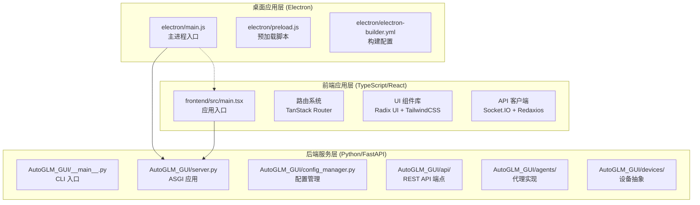

**图表来源**
- [electron/main.js:1-800](file://electron/main.js#L1-L800)
- [frontend/src/main.tsx:1-73](file://frontend/src/main.tsx#L1-L73)
- [AutoGLM_GUI/__main__.py:1-305](file://AutoGLM_GUI/__main__.py#L1-L305)
- [AutoGLM_GUI/server.py:1-13](file://AutoGLM_GUI/server.py#L1-L13)

## 核心组件分析

### 后端核心组件

AutoGLM-GUI 的后端采用模块化设计，主要包含以下核心组件：

#### 1. 配置管理系统
配置系统采用四层优先级架构：
- CLI 参数（最高优先级）
- 环境变量
- 配置文件
- 默认值

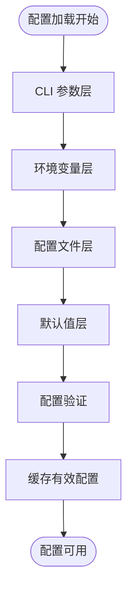

**图表来源**
- [AutoGLM_GUI/config_manager.py:237-747](file://AutoGLM_GUI/config_manager.py#L237-L747)

#### 2. 代理工厂系统
支持多种代理类型的注册和创建，包括 GLM、Qwen、Gemini、MAI 等：

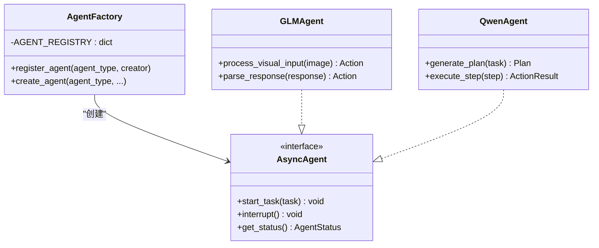

**图表来源**
- [AutoGLM_GUI/agents/factory.py:1-43](file://AutoGLM_GUI/agents/factory.py#L1-L43)

#### 3. 设备管理器
统一管理 Android 设备连接、ADB 通信、屏幕截图等功能：

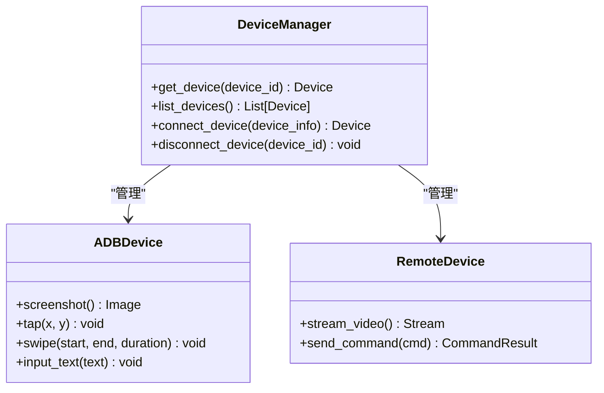

**图表来源**
- [AutoGLM_GUI/device_manager.py](file://AutoGLM_GUI/device_manager.py)
- [AutoGLM_GUI/devices/adb_device.py](file://AutoGLM_GUI/devices/adb_device.py)

### 前端核心组件

前端采用现代 React 技术栈，基于 TanStack Router 实现路由管理：

#### 1. 应用入口和路由系统
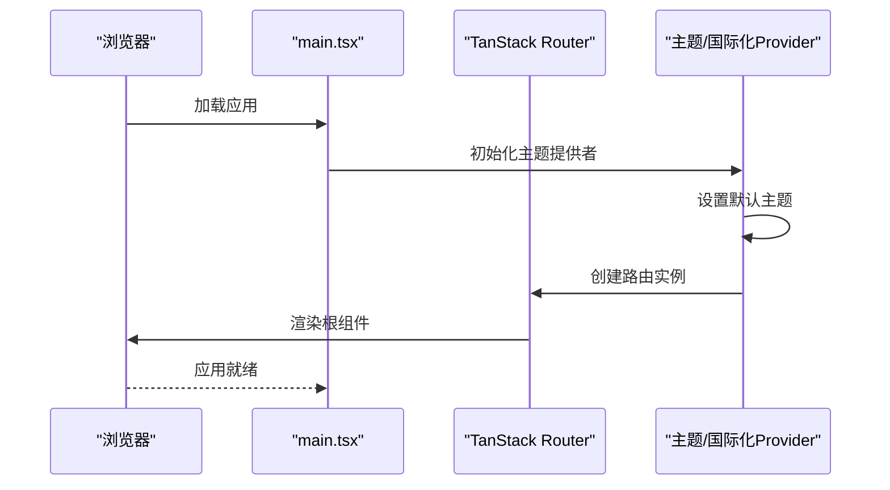

**图表来源**
- [frontend/src/main.tsx:1-73](file://frontend/src/main.tsx#L1-L73)

#### 2. 主题和国际化系统
前端支持深色/浅色主题切换和国际化，通过 Context Provider 实现全局状态管理。

### 桌面应用核心组件

Electron 应用作为后端和前端的容器，提供原生桌面体验：

#### 1. 主进程管理
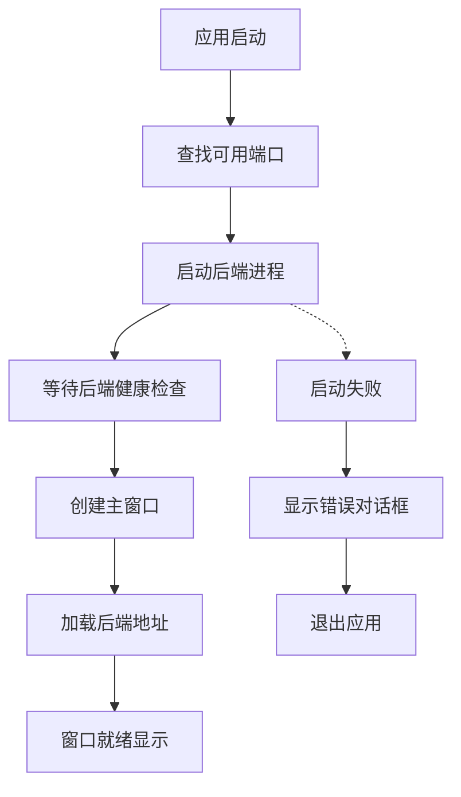

**图表来源**
- [electron/main.js:375-557](file://electron/main.js#L375-L557)

## 架构总览

AutoGLM-GUI 采用分层架构设计，确保各层职责清晰、耦合度低：

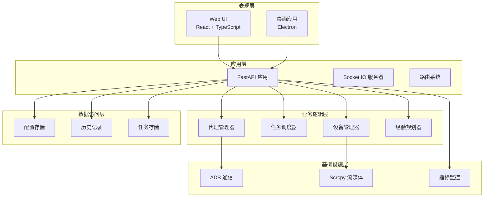

**图表来源**
- [AutoGLM_GUI/server.py:1-13](file://AutoGLM_GUI/server.py#L1-L13)
- [AutoGLM_GUI/__main__.py:271-300](file://AutoGLM_GUI/__main__.py#L271-L300)

## 详细组件分析

### 后端服务启动流程

后端服务启动采用渐进式初始化策略，确保各组件正确加载：

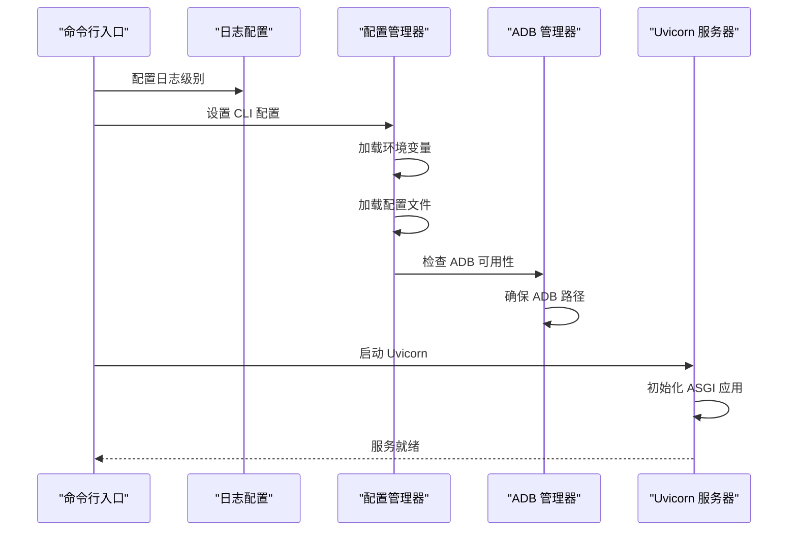

**图表来源**
- [AutoGLM_GUI/__main__.py:78-300](file://AutoGLM_GUI/__main__.py#L78-L300)

### 配置管理器详细分析

配置管理器实现复杂的四层优先级系统，支持热重载和冲突检测：

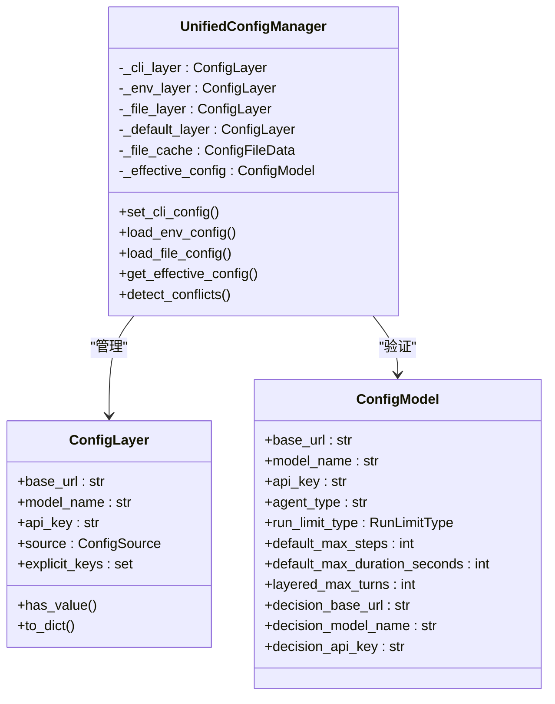

**图表来源**
- [AutoGLM_GUI/config_manager.py:237-800](file://AutoGLM_GUI/config_manager.py#L237-L800)

### 代理系统架构

代理系统采用工厂模式和协议抽象，支持多种 AI 模型：

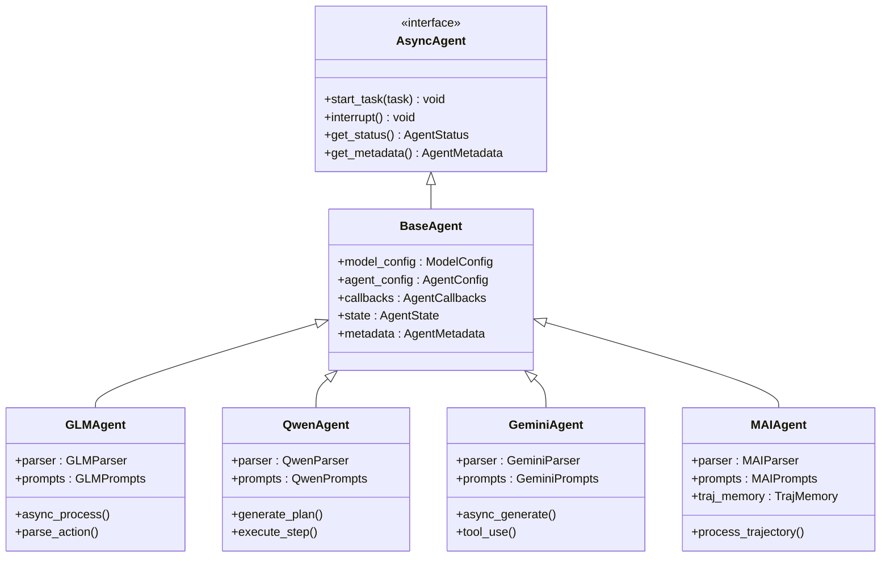

**图表来源**
- [AutoGLM_GUI/agents/base/async_agent_base.py](file://AutoGLM_GUI/agents/base/async_agent_base.py)
- [AutoGLM_GUI/agents/glm/async_agent.py](file://AutoGLM_GUI/agents/glm/async_agent.py)
- [AutoGLM_GUI/agents/qwen/async_agent.py](file://AutoGLM_GUI/agents/qwen/async_agent.py)

### 前端应用架构

前端应用采用模块化设计，支持主题切换、国际化和组件复用：

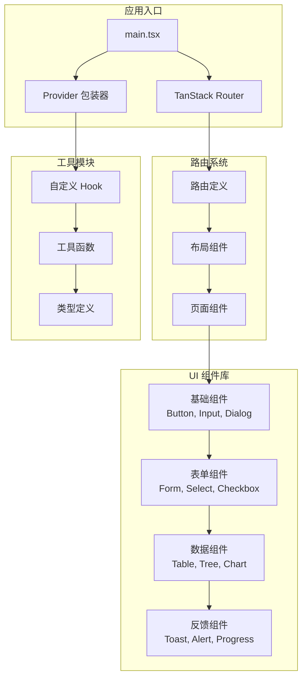

**图表来源**
- [frontend/src/main.tsx:1-73](file://frontend/src/main.tsx#L1-L73)
- [frontend/src/routes/__root.tsx](file://frontend/src/routes/__root.tsx)

### 桌面应用架构

Electron 应用提供原生桌面体验，集成自动更新和日志管理：

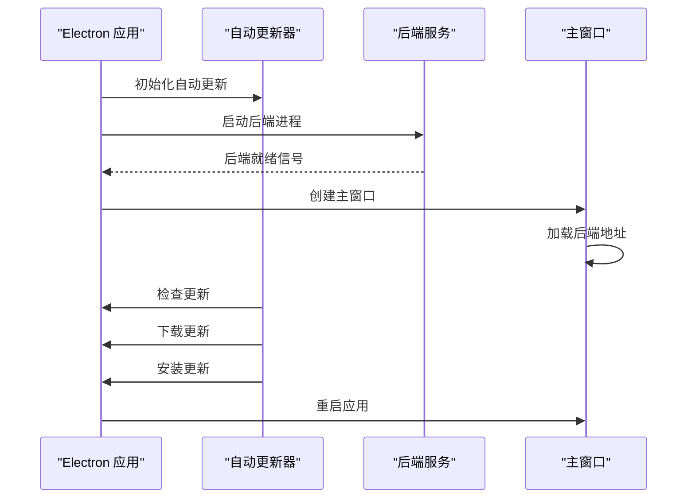

**图表来源**
- [electron/main.js:105-160](file://electron/main.js#L105-L160)
- [electron/main.js:375-557](file://electron/main.js#L375-L557)

## 依赖关系分析

项目采用分层依赖管理，确保模块间松耦合：

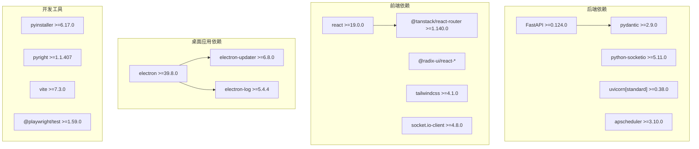

**图表来源**
- [pyproject.toml:24-40](file://pyproject.toml#L24-L40)
- [frontend/package.json:19-56](file://frontend/package.json#L19-L56)
- [electron/package.json:32-39](file://electron/package.json#L32-L39)

## 性能考虑

### 启动性能优化

项目在多个层面进行了性能优化：

1. **延迟加载**: 非关键模块采用按需导入
2. **缓存策略**: 配置文件和静态资源缓存
3. **异步处理**: 大量 I/O 操作采用异步模式
4. **资源池**: 数据库连接和网络请求池化

### 内存管理

- 使用弱引用避免循环引用
- 及时释放大型对象（图像、视频流）
- 进程间通信优化，避免内存泄漏

### 网络性能

- Socket.IO 长连接复用
- 批量数据传输优化
- 压缩算法选择（WebCodecs）

## 故障排除指南

### 常见启动问题

#### 1. ADB 连接失败
**症状**: 后端启动时报 ADB 相关错误
**解决方法**:
1. 检查 ADB 是否正确安装
2. 验证设备连接状态
3. 确认 USB 调试已开启
4. 重新插拔设备

#### 2. 端口占用
**症状**: 应用无法绑定到指定端口
**解决方法**:
1. 使用 `--port` 参数指定其他端口
2. 关闭占用端口的其他程序
3. 检查防火墙设置

#### 3. 代理模型连接失败
**症状**: 代理无法连接到模型 API
**解决方法**:
1. 验证 base_url 格式
2. 检查 API 密钥有效性
3. 确认网络连通性
4. 查看详细错误日志

### 日志分析

项目提供多层次的日志记录：

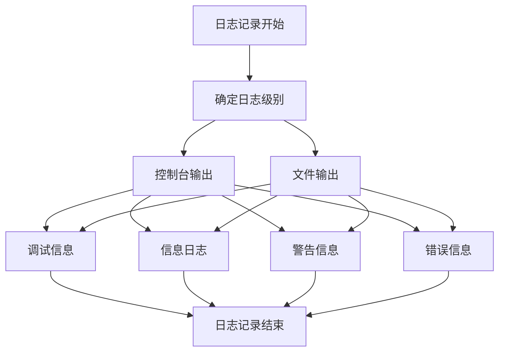

**图表来源**
- [AutoGLM_GUI/logger.py](file://AutoGLM_GUI/logger.py)

## 结论

AutoGLM-GUI 项目展现了现代全栈应用的最佳实践，通过清晰的分层架构、模块化的组件设计和完善的配置管理，实现了高性能、可维护的 AI 驱动设备自动化解决方案。项目的技术选型合理，开发规范完善，为类似项目的开发提供了优秀的参考模板。

项目的成功关键在于：
1. **架构清晰**: 分层设计确保了良好的可维护性
2. **配置灵活**: 多层配置系统适应不同部署场景
3. **扩展性强**: 工厂模式支持新代理类型的快速集成
4. **用户体验**: Electron 桌面应用提供原生体验
5. **开发效率**: 完善的工具链和测试体系