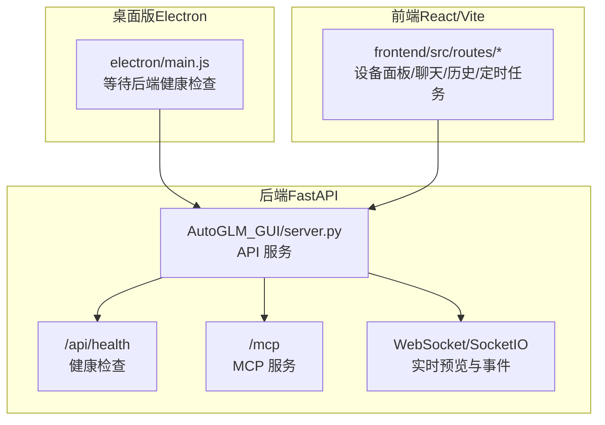
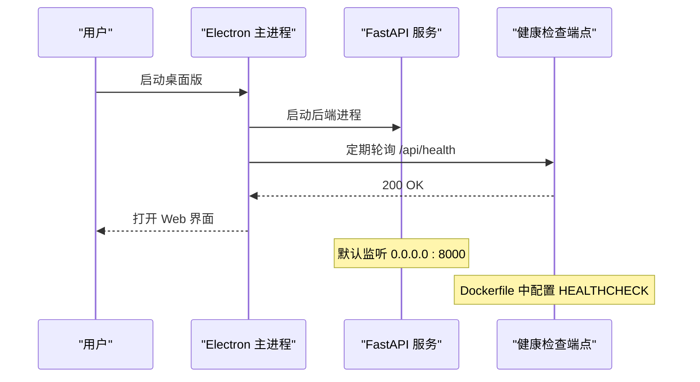
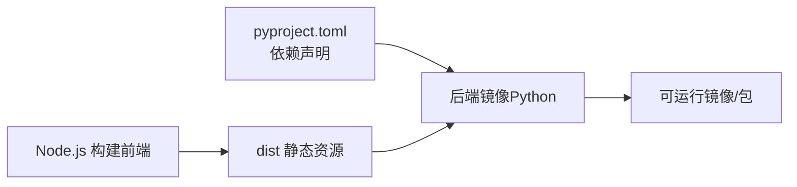

# 快速开始

<cite>
**本文引用的文件**
- [README.md](file://README.md)
- [pyproject.toml](file://pyproject.toml)
- [docker-compose.yml](file://docker-compose.yml)
- [Dockerfile](file://Dockerfile)
- [docs/文档/入门/安装.md](file://docs/docs/getting-started/install.md)
- [docs/文档/入门/首次运行.md](file://docs/docs/getting-started/first-run.md)
- [docs/文档/入门/设备连接.md](file://docs/docs/getting-started/device-connection.md)
- [docs/文档/入门/模型配置.md](file://docs/docs/getting-started/model-config.md)
- [docs/文档/故障排除/常见问题.md](file://docs/docs/troubleshooting/common-issues.md)
- [docs/文档/故障排除/ADB.md](file://docs/docs/troubleshooting/adb.md)
- [scripts/download_adb.py](file://scripts/download_adb.py)
- [electron/main.js](file://electron/main.js)
- [frontend/e2e/globalSetup.ts](file://frontend/e2e/globalSetup.ts)
</cite>

## 目录
1. [简介](#简介)
2. [项目结构](#项目结构)
3. [核心组件](#核心组件)
4. [架构总览](#架构总览)
5. [详细组件分析](#详细组件分析)
6. [依赖关系分析](#依赖关系分析)
7. [性能考虑](#性能考虑)
8. [故障排除指南](#故障排除指南)
9. [结论](#结论)
10. [附录](#附录)

## 简介
本指南面向首次接触 AutoGLM-GUI 的用户，帮助你在最短时间内完成安装、配置与首次运行。项目提供多种部署方式：桌面版（免配置）、Python 包安装、Docker 部署，以及服务端运行。无论你是希望本地快速体验，还是需要在服务器上长期运行，都能根据本指南顺利完成。

## 项目结构
AutoGLM-GUI 采用前后端分离架构：
- 后端：基于 FastAPI 的 Web 服务，提供设备管理、任务调度、MCP 协议、健康检查等能力。
- 前端：React/Vite 构建的 Web 界面，提供设备控制、任务执行、历史记录、定时任务等功能。
- 桌面版：基于 Electron 的桌面应用，内置后端与前端资源，开箱即用。
- Docker：提供预构建镜像与 compose 示例，便于在服务器上长期运行。

图表来源
- [electron/main.js:244-281](file://electron/main.js#L244-L281)
- [Dockerfile:59-63](file://Dockerfile#L59-L63)

章节来源
- [README.md:142-223](file://README.md#L142-L223)
- [docs/文档/入门/安装.md:5-17](file://docs/docs/getting-started/install.md#L5-L17)

## 核心组件
- 模型服务配置：支持 OpenAI 兼容的模型服务（如智谱、ModelScope 或自建 vLLM/SGLang），通过界面或命令行参数配置。
- 设备连接：支持 USB/WiFi/二维码配对，自动发现与连接 Android 设备。
- 任务执行：支持经典模式与分层代理模式，提供 Workflow 与定时任务能力。
- MCP 集成：通过 HTTP + SSE 暴露 MCP 端点，可被 Claude Desktop、Cursor 等客户端调用。

章节来源
- [README.md:224-253](file://README.md#L224-L253)
- [docs/文档/入门/设备连接.md:13-76](file://docs/docs/getting-started/device-connection.md#L13-L76)
- [docs/文档/入门/模型配置.md:7-34](file://docs/docs/getting-started/model-config.md#L7-L34)

## 架构总览
下图展示了从桌面版启动到后端服务就绪的关键流程，以及健康检查与端口暴露的关系。

图表来源
- [electron/main.js:244-281](file://electron/main.js#L244-L281)
- [Dockerfile:59-63](file://Dockerfile#L59-L63)

章节来源
- [README.md:222-223](file://README.md#L222-L223)
- [Dockerfile:59-63](file://Dockerfile#L59-L63)

## 详细组件分析

### 安装方式一：桌面版（免配置，推荐）
- 适用人群：普通用户，希望“下载即用”。
- 支持平台：Windows（x64）、macOS（Apple Silicon）、Linux（AppImage/deb/tar.gz）。
- 首次运行：自动打开界面，仅需完成“设备连接 + 模型配置”。

章节来源
- [README.md:77-109](file://README.md#L77-L109)
- [docs/文档/入门/安装.md:7-13](file://docs/docs/getting-started/install.md#L7-L13)

### 安装方式二：Python 包安装（推荐）
- 环境要求：Python 3.11+。
- 安装与启动：通过 pip 安装后直接启动，或使用 uvx 免安装运行。
- 模型配置：启动时通过参数传入 base-url/model/apikey，或在 Web 界面设置。

章节来源
- [README.md:153-168](file://README.md#L153-L168)
- [pyproject.toml:6](file://pyproject.toml#L6)

### 安装方式三：Docker 部署（推荐生产场景）
- 镜像：使用 ghcr.io/suyiiyii/autoglm-gui:main。
- 网络模式：推荐 host 网络（便于 ADB 与 mDNS），也可使用端口映射。
- 存储：挂载配置与日志目录，确保数据持久化。
- 环境变量：可在 Web 界面中配置，也可在 compose 中预设。

章节来源
- [README.md:169-219](file://README.md#L169-L219)
- [docker-compose.yml:1-32](file://docker-compose.yml#L1-L32)
- [Dockerfile:4-64](file://Dockerfile#L4-L64)

### 首次运行配置流程
- 打开应用，进入「对话」页面。
- 连接设备：点击「添加无线设备」，按引导完成配对或直接连接。
- 配置模型：点击「配置」，填写 Base URL/API Key/模型名称；分层代理还需填写决策模型配置。
- 开始任务：选择设备后在输入框中描述任务，点击发送。

章节来源
- [docs/文档/入门/首次运行.md:7-47](file://docs/docs/getting-started/first-run.md#L7-L47)
- [docs/文档/入门/模型配置.md:7-34](file://docs/docs/getting-started/model-config.md#L7-L34)
- [docs/文档/入门/设备连接.md:13-76](file://docs/docs/getting-started/device-connection.md#L13-L76)

### 设备连接与管理
- 支持三种连接方式：直接连接（IP:端口）、配对码、二维码配对（Android 11+）。
- 设备卡片提供连接/断开、删除、编辑名称、远程设备管理等操作。
- 设备分组：支持新建/编辑/删除分组，便于大规模设备管理。

章节来源
- [docs/文档/入门/设备连接.md:13-76](file://docs/docs/getting-started/device-connection.md#L13-L76)

### 模型服务配置
- 基础模型：Base URL、API Key、模型名称。
- 分层代理：额外配置决策模型的 Base URL/API Key/模型名称。
- 预设配置：界面提供“选择预设配置”“选择决策模型预设”等便捷入口。

章节来源
- [docs/文档/入门/模型配置.md:13-34](file://docs/docs/getting-started/model-config.md#L13-L34)
- [README.md:224-253](file://README.md#L224-L253)

## 依赖关系分析
- Python 依赖：FastAPI、OpenAI 客户端、APScheduler、SocketIO、Prometheus、Uvicorn、Zeroconf 等。
- 可选依赖：droidrun（可选）。
- 前端构建：Node.js + npm，构建产物复制到 Python 包中，最终打包为可运行的桌面版与服务端。
- Docker：多阶段构建，前端在 Node 镜像中构建，后端在 Python 镜像中安装依赖并打包静态资源。

图表来源
- [pyproject.toml:24-40](file://pyproject.toml#L24-L40)
- [Dockerfile:6-47](file://Dockerfile#L6-L47)

章节来源
- [pyproject.toml:24-40](file://pyproject.toml#L24-L40)
- [Dockerfile:6-47](file://Dockerfile#L6-L47)

## 性能考虑
- Docker 建议使用 host 网络模式，以获得更好的 ADB 与 mDNS 支持，避免桥接网络下的多播限制。
- 前端构建产物被打包进 Python 包，减少运行时下载依赖，提升启动速度。
- 健康检查与端口暴露在 Dockerfile 中统一配置，便于容器编排与监控。

章节来源
- [README.md:216-218](file://README.md#L216-L218)
- [Dockerfile:59-63](file://Dockerfile#L59-L63)

## 故障排除指南
- 任务无法执行：检查是否已配置模型（base_url、model_name、API Key）。
- 设备未显示：确认设备已连接并开启调试；无线连接时确保手机与电脑在同一网络。
- 定时任务未执行：确认任务已启用且 Cron 表达式格式正确。
- 日志无法查看：日志功能仅桌面版可用，Web 版会提示“日志仅桌面版可用”。
- WiFi 连接失败：确认 IP 与端口填写正确，且处于同一网络。
- 二维码配对失败：确认 Android 11+ 支持无线调试配对，重新生成二维码并重试。
- 后端启动超时：桌面版会轮询 /api/health，若超时请检查端口占用与依赖安装。

章节来源
- [docs/文档/故障排除/常见问题.md:7-27](file://docs/docs/troubleshooting/common-issues.md#L7-L27)
- [docs/文档/故障排除/ADB.md:5-15](file://docs/docs/troubleshooting/adb.md#L5-L15)
- [electron/main.js:244-281](file://electron/main.js#L244-L281)
- [frontend/e2e/globalSetup.ts:78-118](file://frontend/e2e/globalSetup.ts#L78-L118)

## 结论
通过本指南，你可以根据自身需求选择桌面版、Python 包或 Docker 部署方式快速运行 AutoGLM-GUI。完成设备连接与模型配置后，即可开始使用 AI 自动化能力与 Workflow/定时任务等高级功能。遇到问题时，可参考故障排除章节中的常见问题与解决方案。

## 附录

### A. 安装与验证清单
- 桌面版：下载对应平台的安装包，首次运行后自动打开界面。
- Python 包：安装后启动并访问 http://localhost:8000。
- Docker：使用 compose 启动，访问 http://localhost:8000。
- 验证：访问 /api/health 返回 200，或桌面版健康检查通过。

章节来源
- [README.md:222-223](file://README.md#L222-L223)
- [Dockerfile:59-63](file://Dockerfile#L59-L63)
- [electron/main.js:244-281](file://electron/main.js#L244-L281)

### B. 常用命令速查
- Python 包安装与启动：pip install autoglm-gui；autoglm-gui --base-url ... --model ... --apikey ...
- Docker Compose：curl -O https://.../docker-compose.yml；docker-compose up -d；访问 http://localhost:8000
- uvx 免安装：uvx autoglm-gui --base-url ...

章节来源
- [README.md:157-168](file://README.md#L157-L168)
- [README.md:179-201](file://README.md#L179-L201)