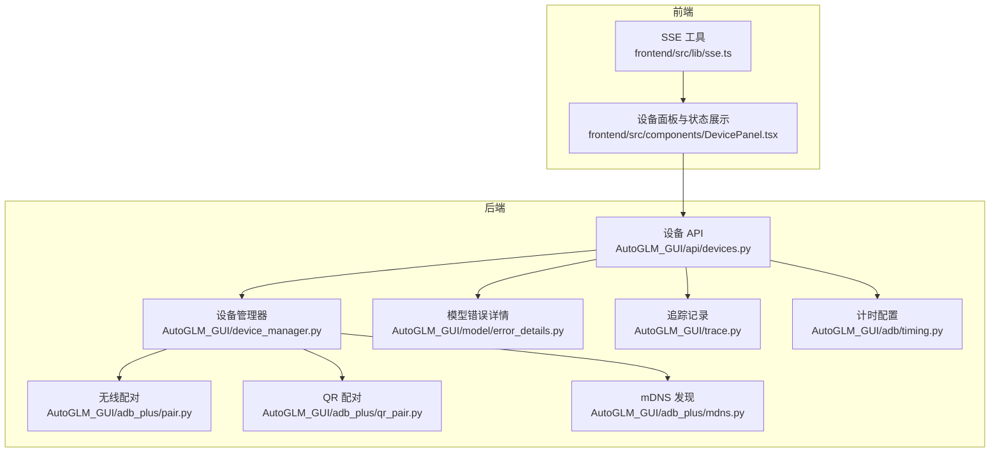
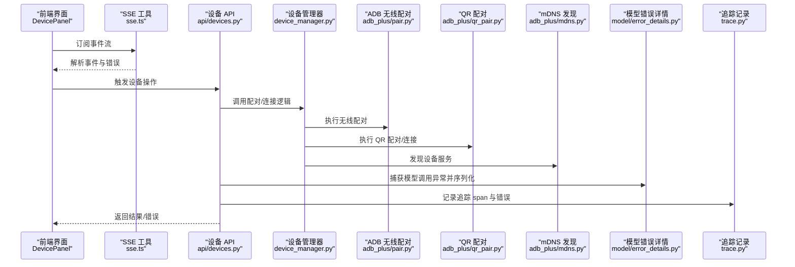
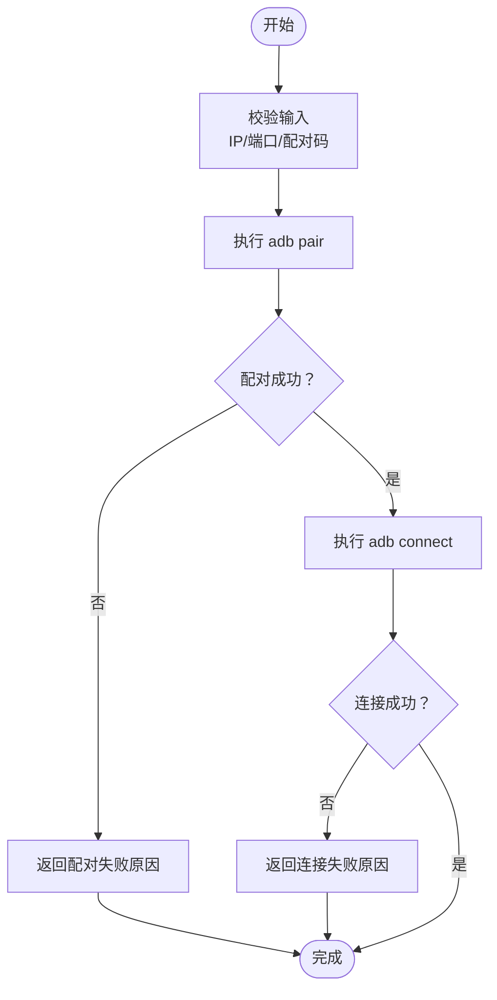
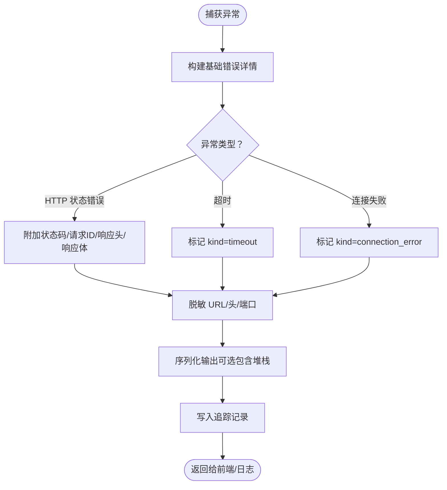
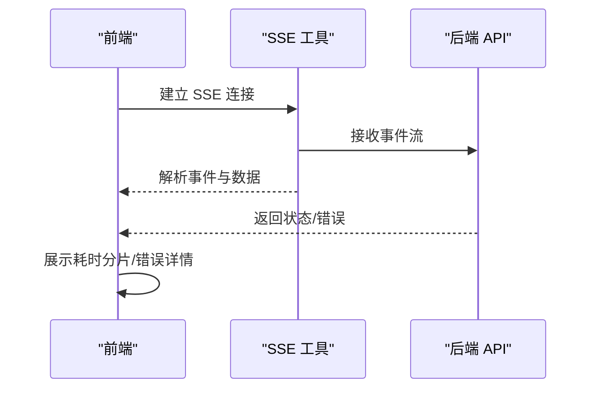
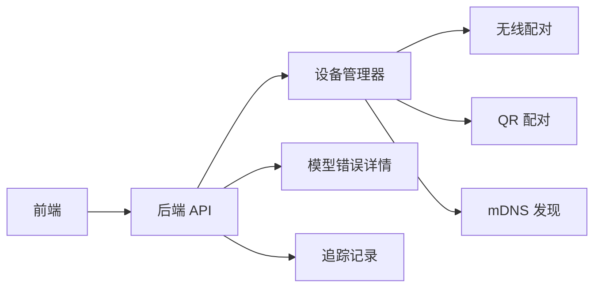

# 故障排除

<cite>
**本文引用的文件**
- [AutoGLM_GUI/adb_plus/pair.py](file://AutoGLM_GUI/adb_plus/pair.py)
- [AutoGLM_GUI/adb_plus/qr_pair.py](file://AutoGLM_GUI/adb_plus/qr_pair.py)
- [AutoGLM_GUI/adb_plus/mdns.py](file://AutoGLM_GUI/adb_plus/mdns.py)
- [AutoGLM_GUI/device_manager.py](file://AutoGLM_GUI/device_manager.py)
- [AutoGLM_GUI/api/devices.py](file://AutoGLM_GUI/api/devices.py)
- [AutoGLM_GUI/model/error_details.py](file://AutoGLM_GUI/model/error_details.py)
- [AutoGLM_GUI/adb/timing.py](file://AutoGLM_GUI/adb/timing.py)
- [AutoGLM_GUI/trace.py](file://AutoGLM_GUI/trace.py)
- [frontend/src/lib/sse.ts](file://frontend/src/lib/sse.ts)
- [frontend/src/components/DevicePanel.tsx](file://frontend/src/components/DevicePanel.tsx)
- [tests/test_model_error_details.py](file://tests/test_model_error_details.py)
- [tests/test_metrics.py](file://tests/test_metrics.py)
- [docs/docs/troubleshooting/common-issues.md](file://docs/docs/troubleshooting/common-issues.md)
- [docs/docs/troubleshooting/adb.md](file://docs/docs/troubleshooting/adb.md)
- [docs/docs/troubleshooting/model-api.md](file://docs/docs/troubleshooting/model-api.md)
- [docs/docs/getting-started/install.md](file://docs/docs/getting-started/install.md)
- [docs/docs/features/logs.md](file://docs/docs/features/logs.md)
- [docs/docs/configuration.md](file://docs/docs/configuration.md)
- [README.md](file://README.md)
- [CONTRIBUTING.md](file://CONTRIBUTING.md)
</cite>

## 目录
1. 引言
2. 项目结构
3. 核心组件
4. 架构总览
5. 详细组件分析
6. 依赖分析
7. 性能考虑
8. 故障排除指南
9. 结论
10. 附录

## 引言
本指南面向使用 AutoGLM-GUI 的用户与运维人员，聚焦于常见问题的识别、诊断与解决。内容覆盖设备连接（USB/WiFi/QR）、模型配置与调用异常、性能瓶颈、跨平台差异、日志与调试工具使用，并提供社区支持与问题报告流程，帮助快速定位与解决问题。

## 项目结构
AutoGLM-GUI 由后端 Python 服务与前端 React 应用组成，核心故障排除涉及以下模块：
- 设备连接与管理：ADB 无线配对、mDNS 发现、QR 扫码配对、设备管理器
- 模型错误详情与追踪：统一错误结构化输出、响应体与头部脱敏、追踪记录
- 前端事件流与界面提示：SSE 解析、设备状态展示、错误消息格式化
- 性能指标与计时：动作/设备/连接计时配置、步骤耗时统计

图表来源
- [frontend/src/lib/sse.ts:1-56](file://frontend/src/lib/sse.ts#L1-L56)
- [frontend/src/components/DevicePanel.tsx:160-211](file://frontend/src/components/DevicePanel.tsx#L160-L211)
- [AutoGLM_GUI/api/devices.py:301-341](file://AutoGLM_GUI/api/devices.py#L301-L341)
- [AutoGLM_GUI/device_manager.py:817-855](file://AutoGLM_GUI/device_manager.py#L817-L855)
- [AutoGLM_GUI/adb_plus/pair.py:1-80](file://AutoGLM_GUI/adb_plus/pair.py#L1-L80)
- [AutoGLM_GUI/adb_plus/qr_pair.py:72-110](file://AutoGLM_GUI/adb_plus/qr_pair.py#L72-L110)
- [AutoGLM_GUI/adb_plus/mdns.py:100-140](file://AutoGLM_GUI/adb_plus/mdns.py#L100-L140)
- [AutoGLM_GUI/model/error_details.py:1-228](file://AutoGLM_GUI/model/error_details.py#L1-L228)
- [AutoGLM_GUI/trace.py:827-855](file://AutoGLM_GUI/trace.py#L827-L855)
- [AutoGLM_GUI/adb/timing.py:89-135](file://AutoGLM_GUI/adb/timing.py#L89-L135)

章节来源
- [AutoGLM_GUI/api/devices.py:301-341](file://AutoGLM_GUI/api/devices.py#L301-L341)
- [AutoGLM_GUI/device_manager.py:817-855](file://AutoGLM_GUI/device_manager.py#L817-L855)
- [AutoGLM_GUI/adb_plus/pair.py:1-80](file://AutoGLM_GUI/adb_plus/pair.py#L1-L80)
- [AutoGLM_GUI/adb_plus/qr_pair.py:72-110](file://AutoGLM_GUI/adb_plus/qr_pair.py#L72-L110)
- [AutoGLM_GUI/adb_plus/mdns.py:100-140](file://AutoGLM_GUI/adb_plus/mdns.py#L100-L140)
- [AutoGLM_GUI/model/error_details.py:1-228](file://AutoGLM_GUI/model/error_details.py#L1-L228)
- [AutoGLM_GUI/trace.py:827-855](file://AutoGLM_GUI/trace.py#L827-L855)
- [AutoGLM_GUI/adb/timing.py:89-135](file://AutoGLM_GUI/adb/timing.py#L89-L135)
- [frontend/src/lib/sse.ts:1-56](file://frontend/src/lib/sse.ts#L1-L56)
- [frontend/src/components/DevicePanel.tsx:160-211](file://frontend/src/components/DevicePanel.tsx#L160-L211)

## 核心组件
- 设备配对与连接
  - 无线配对（Android 11+）：校验 6 位配对码、执行 adb pair 并解析输出，区分“无效配对码”“连接被拒”等场景
  - mDNS 服务发现：解析 adb mdns services 输出，按设备名聚合
  - QR 扫码配对：生成会话、执行 adb pair/connect，记录成功/失败与日志
  - 设备管理器：校验端口与配对码，先配对再连接，失败时返回明确错误
- 模型错误详情
  - 统一结构化输出，区分 HTTP 错误、超时、连接失败；自动脱敏敏感头与 URL 端口；可选包含堆栈
  - 支持同步与异步读取未读响应体，保障错误信息完整性
- 前端事件流与界面
  - SSE 解析工具：标准化错误消息，逐条解析 event/data 行
  - 设备面板：展示耗时分片（总时长、模型推理、截图、应用、动作、睡眠），格式化错误详情
- 追踪与计时
  - 追踪记录：记录 span 状态、开始/结束时间、持续时间、错误类型与摘要
  - 计时配置：通过环境变量或运行时更新动作/设备/连接计时参数

章节来源
- [AutoGLM_GUI/adb_plus/pair.py:1-80](file://AutoGLM_GUI/adb_plus/pair.py#L1-L80)
- [AutoGLM_GUI/adb_plus/mdns.py:100-140](file://AutoGLM_GUI/adb_plus/mdns.py#L100-L140)
- [AutoGLM_GUI/adb_plus/qr_pair.py:72-110](file://AutoGLM_GUI/adb_plus/qr_pair.py#L72-L110)
- [AutoGLM_GUI/device_manager.py:817-855](file://AutoGLM_GUI/device_manager.py#L817-L855)
- [AutoGLM_GUI/model/error_details.py:121-228](file://AutoGLM_GUI/model/error_details.py#L121-L228)
- [frontend/src/lib/sse.ts:1-56](file://frontend/src/lib/sse.ts#L1-L56)
- [frontend/src/components/DevicePanel.tsx:160-211](file://frontend/src/components/DevicePanel.tsx#L160-L211)
- [AutoGLM_GUI/trace.py:827-855](file://AutoGLM_GUI/trace.py#L827-L855)
- [AutoGLM_GUI/adb/timing.py:89-135](file://AutoGLM_GUI/adb/timing.py#L89-L135)

## 架构总览
下图展示从前端到后端的关键交互路径，以及错误与追踪如何贯穿系统：

图表来源
- [frontend/src/components/DevicePanel.tsx:160-211](file://frontend/src/components/DevicePanel.tsx#L160-L211)
- [frontend/src/lib/sse.ts:1-56](file://frontend/src/lib/sse.ts#L1-L56)
- [AutoGLM_GUI/api/devices.py:301-341](file://AutoGLM_GUI/api/devices.py#L301-L341)
- [AutoGLM_GUI/device_manager.py:817-855](file://AutoGLM_GUI/device_manager.py#L817-L855)
- [AutoGLM_GUI/adb_plus/pair.py:1-80](file://AutoGLM_GUI/adb_plus/pair.py#L1-L80)
- [AutoGLM_GUI/adb_plus/qr_pair.py:72-110](file://AutoGLM_GUI/adb_plus/qr_pair.py#L72-L110)
- [AutoGLM_GUI/adb_plus/mdns.py:100-140](file://AutoGLM_GUI/adb_plus/mdns.py#L100-L140)
- [AutoGLM_GUI/model/error_details.py:121-228](file://AutoGLM_GUI/model/error_details.py#L121-L228)
- [AutoGLM_GUI/trace.py:827-855](file://AutoGLM_GUI/trace.py#L827-L855)

## 详细组件分析

### 设备配对与连接流程（无线/WiFi）
- 输入校验：IP/端口范围、6 位配对码
- 无线配对：执行 adb pair，解析输出判断“成功/失败/无效配对码/连接被拒”
- mDNS 发现：解析服务列表，按设备名聚合
- QR 配对：生成会话、执行 adb pair/connect，记录日志
- 设备管理器：先配对后连接，失败时返回明确错误

图表来源
- [AutoGLM_GUI/device_manager.py:817-855](file://AutoGLM_GUI/device_manager.py#L817-L855)
- [AutoGLM_GUI/adb_plus/pair.py:1-80](file://AutoGLM_GUI/adb_plus/pair.py#L1-L80)
- [AutoGLM_GUI/adb_plus/qr_pair.py:72-110](file://AutoGLM_GUI/adb_plus/qr_pair.py#L72-L110)
- [AutoGLM_GUI/adb_plus/mdns.py:100-140](file://AutoGLM_GUI/adb_plus/mdns.py#L100-L140)

章节来源
- [AutoGLM_GUI/device_manager.py:817-855](file://AutoGLM_GUI/device_manager.py#L817-L855)
- [AutoGLM_GUI/adb_plus/pair.py:1-80](file://AutoGLM_GUI/adb_plus/pair.py#L1-L80)
- [AutoGLM_GUI/adb_plus/qr_pair.py:72-110](file://AutoGLM_GUI/adb_plus/qr_pair.py#L72-L110)
- [AutoGLM_GUI/adb_plus/mdns.py:100-140](file://AutoGLM_GUI/adb_plus/mdns.py#L100-L140)

### 模型错误详情与追踪
- 结构化输出：包含 kind（模型错误/HTTP/超时/连接失败）、异常类型、消息、模型名、基础 URL、调用位置
- 脱敏策略：URL 中主机与端口规范化，敏感头（如授权、API Key、Cookie）脱敏
- 响应体处理：同步/异步读取未读响应体，避免丢失错误正文
- 追踪记录：记录 span 状态、起止时间、持续时间、错误类型与摘要

图表来源
- [AutoGLM_GUI/model/error_details.py:121-228](file://AutoGLM_GUI/model/error_details.py#L121-L228)
- [AutoGLM_GUI/trace.py:827-855](file://AutoGLM_GUI/trace.py#L827-L855)

章节来源
- [AutoGLM_GUI/model/error_details.py:121-228](file://AutoGLM_GUI/model/error_details.py#L121-L228)
- [AutoGLM_GUI/trace.py:827-855](file://AutoGLM_GUI/trace.py#L827-L855)
- [tests/test_model_error_details.py:70-154](file://tests/test_model_error_details.py#L70-L154)

### 前端事件流与界面提示
- SSE 解析：标准化 HTTP 错误消息，逐行解析 event/data，解析失败时记录日志
- 设备面板：展示耗时分片（总时长、模型、截图、应用、动作、睡眠），格式化错误详情

图表来源
- [frontend/src/lib/sse.ts:1-56](file://frontend/src/lib/sse.ts#L1-L56)
- [frontend/src/components/DevicePanel.tsx:160-211](file://frontend/src/components/DevicePanel.tsx#L160-L211)

章节来源
- [frontend/src/lib/sse.ts:1-56](file://frontend/src/lib/sse.ts#L1-L56)
- [frontend/src/components/DevicePanel.tsx:160-211](file://frontend/src/components/DevicePanel.tsx#L160-L211)

## 依赖分析
- 前端依赖后端 API，API 再依赖设备管理器与错误详情模块
- 设备管理器依赖 ADB 无线配对、QR 配对与 mDNS 发现
- 错误详情与追踪贯穿前后端，用于诊断与可观测性

图表来源
- [AutoGLM_GUI/api/devices.py:301-341](file://AutoGLM_GUI/api/devices.py#L301-L341)
- [AutoGLM_GUI/device_manager.py:817-855](file://AutoGLM_GUI/device_manager.py#L817-L855)
- [AutoGLM_GUI/adb_plus/pair.py:1-80](file://AutoGLM_GUI/adb_plus/pair.py#L1-L80)
- [AutoGLM_GUI/adb_plus/qr_pair.py:72-110](file://AutoGLM_GUI/adb_plus/qr_pair.py#L72-L110)
- [AutoGLM_GUI/adb_plus/mdns.py:100-140](file://AutoGLM_GUI/adb_plus/mdns.py#L100-L140)
- [AutoGLM_GUI/model/error_details.py:121-228](file://AutoGLM_GUI/model/error_details.py#L121-L228)
- [AutoGLM_GUI/trace.py:827-855](file://AutoGLM_GUI/trace.py#L827-L855)

章节来源
- [AutoGLM_GUI/api/devices.py:301-341](file://AutoGLM_GUI/api/devices.py#L301-L341)
- [AutoGLM_GUI/device_manager.py:817-855](file://AutoGLM_GUI/device_manager.py#L817-L855)
- [AutoGLM_GUI/adb_plus/pair.py:1-80](file://AutoGLM_GUI/adb_plus/pair.py#L1-L80)
- [AutoGLM_GUI/adb_plus/qr_pair.py:72-110](file://AutoGLM_GUI/adb_plus/qr_pair.py#L72-L110)
- [AutoGLM_GUI/adb_plus/mdns.py:100-140](file://AutoGLM_GUI/adb_plus/mdns.py#L100-L140)
- [AutoGLM_GUI/model/error_details.py:121-228](file://AutoGLM_GUI/model/error_details.py#L121-L228)
- [AutoGLM_GUI/trace.py:827-855](file://AutoGLM_GUI/trace.py#L827-L855)

## 性能考虑
- 计时配置：通过环境变量或运行时更新动作/设备/连接计时参数，便于在不同设备/网络条件下优化
- 步骤耗时统计：前端展示总时长与各阶段耗时（模型、截图、应用、动作、睡眠），辅助定位瓶颈
- 指标导出：测试中演示了追踪延迟指标的注册与导出，可用于性能监控

章节来源
- [AutoGLM_GUI/adb/timing.py:89-135](file://AutoGLM_GUI/adb/timing.py#L89-L135)
- [frontend/src/components/DevicePanel.tsx:160-211](file://frontend/src/components/DevicePanel.tsx#L160-L211)
- [tests/test_metrics.py:92-126](file://tests/test_metrics.py#L92-L126)

## 故障排除指南

### 一、设备连接问题
- USB 连接失败
  - 症状：设备列表为空或连接报错
  - 排查要点：确认已启用开发者选项中的 USB 调试；检查驱动安装与线缆；尝试更换端口/设备
  - 参考：[安装与首次运行文档](file://docs/docs/getting-started/install.md)
- WiFi 无线调试配对失败
  - 症状：配对码无效、连接被拒、超时
  - 排查要点：确保 Android 11+；输入正确的 6 位配对码；确认无线调试已开启；检查端口范围（1–65535）
  - 处理流程：先执行无线配对，再执行连接；若失败，查看日志与返回消息
  - 参考：[无线配对实现:1-80](file://AutoGLM_GUI/adb_plus/pair.py#L1-L80)、[设备管理器流程:817-855](file://AutoGLM_GUI/device_manager.py#L817-L855)
- mDNS 设备发现异常
  - 症状：无法发现设备
  - 排查要点：检查网络连通性；确认 ADB mdns 服务输出；按设备名聚合显示
  - 参考：[mDNS 实现:100-140](file://AutoGLM_GUI/adb_plus/mdns.py#L100-L140)
- QR 扫码配对失败
  - 症状：扫码后无响应或连接失败
  - 排查要点：确认会话有效；检查 adb pair/connect 输出；查看日志
  - 参考：[QR 配对实现:72-110](file://AutoGLM_GUI/adb_plus/qr_pair.py#L72-L110)、[设备 API 状态消息:330-341](file://AutoGLM_GUI/api/devices.py#L330-L341)

章节来源
- [AutoGLM_GUI/adb_plus/pair.py:1-80](file://AutoGLM_GUI/adb_plus/pair.py#L1-L80)
- [AutoGLM_GUI/device_manager.py:817-855](file://AutoGLM_GUI/device_manager.py#L817-L855)
- [AutoGLM_GUI/adb_plus/mdns.py:100-140](file://AutoGLM_GUI/adb_plus/mdns.py#L100-L140)
- [AutoGLM_GUI/adb_plus/qr_pair.py:72-110](file://AutoGLM_GUI/adb_plus/qr_pair.py#L72-L110)
- [AutoGLM_GUI/api/devices.py:330-341](file://AutoGLM_GUI/api/devices.py#L330-L341)
- [docs/docs/getting-started/install.md](file://docs/docs/getting-started/install.md)

### 二、模型配置与调用问题
- 常见错误类型
  - HTTP 状态错误：检查状态码、请求 ID、响应头与响应体
  - 超时：调整超时阈值或网络环境
  - 连接失败：检查网络连通性、代理设置、证书与域名
- 错误详情与脱敏
  - 错误详情包含 kind、异常类型、消息、模型名、基础 URL、调用位置
  - URL 与敏感头会被脱敏，避免泄露
- 日志与追踪
  - 后端记录 span 状态、起止时间、持续时间、错误类型与摘要
  - 前端展示错误详情与耗时分片，辅助定位问题阶段
- 参考
  - [模型错误详情实现:121-228](file://AutoGLM_GUI/model/error_details.py#L121-L228)
  - [追踪记录实现:827-855](file://AutoGLM_GUI/trace.py#L827-L855)
  - [前端错误详情展示:205-211](file://frontend/src/components/DevicePanel.tsx#L205-L211)

章节来源
- [AutoGLM_GUI/model/error_details.py:121-228](file://AutoGLM_GUI/model/error_details.py#L121-L228)
- [AutoGLM_GUI/trace.py:827-855](file://AutoGLM_GUI/trace.py#L827-L855)
- [frontend/src/components/DevicePanel.tsx:205-211](file://frontend/src/components/DevicePanel.tsx#L205-L211)
- [tests/test_model_error_details.py:70-154](file://tests/test_model_error_details.py#L70-L154)

### 三、性能问题
- 定位步骤
  - 查看前端耗时分片：总时长、模型、截图、应用、动作、睡眠
  - 调整计时配置：通过环境变量或运行时更新动作/设备/连接计时参数
  - 导出指标：参考测试用例中指标注册与导出流程
- 参考
  - [计时配置实现:89-135](file://AutoGLM_GUI/adb/timing.py#L89-L135)
  - [前端耗时展示:160-211](file://frontend/src/components/DevicePanel.tsx#L160-L211)
  - [指标导出示例:92-126](file://tests/test_metrics.py#L92-L126)

章节来源
- [AutoGLM_GUI/adb/timing.py:89-135](file://AutoGLM_GUI/adb/timing.py#L89-L135)
- [frontend/src/components/DevicePanel.tsx:160-211](file://frontend/src/components/DevicePanel.tsx#L160-L211)
- [tests/test_metrics.py:92-126](file://tests/test_metrics.py#L92-L126)

### 四、跨平台与环境差异
- Windows/macOS/Linux
  - ADB 路径与权限：确保 adb 可执行且具备必要权限；必要时设置环境变量或指定路径
  - 网络与防火墙：确保无线调试端口开放；代理与企业网络可能影响连接
  - 依赖与版本：遵循安装文档中的依赖要求
- 参考
  - [安装文档](file://docs/docs/getting-started/install.md)
  - [配置文档](file://docs/docs/configuration.md)

章节来源
- [docs/docs/getting-started/install.md](file://docs/docs/getting-started/install.md)
- [docs/docs/configuration.md](file://docs/docs/configuration.md)

### 五、日志与调试工具使用
- 日志位置与内容
  - 后端：关注设备配对/连接日志、错误详情序列化、追踪记录
  - 前端：关注 SSE 错误消息、事件解析日志
- 调试技巧
  - 使用耗时分片定位瓶颈阶段
  - 对照错误详情中的 kind 与状态码，快速缩小范围
  - 在测试中参考指标导出流程，验证性能指标采集
- 参考
  - [前端 SSE 工具:1-56](file://frontend/src/lib/sse.ts#L1-L56)
  - [设备面板耗时展示:160-211](file://frontend/src/components/DevicePanel.tsx#L160-L211)
  - [追踪记录:827-855](file://AutoGLM_GUI/trace.py#L827-L855)
  - [指标导出示例:92-126](file://tests/test_metrics.py#L92-L126)

章节来源
- [frontend/src/lib/sse.ts:1-56](file://frontend/src/lib/sse.ts#L1-L56)
- [frontend/src/components/DevicePanel.tsx:160-211](file://frontend/src/components/DevicePanel.tsx#L160-L211)
- [AutoGLM_GUI/trace.py:827-855](file://AutoGLM_GUI/trace.py#L827-L855)
- [tests/test_metrics.py:92-126](file://tests/test_metrics.py#L92-L126)

### 六、社区支持与问题报告流程
- 社区资源
  - Issues 页面：查找与认领任务、提问与反馈
  - 贡献指南：了解如何报告问题与提交修复
- 问题报告建议
  - 包含：系统环境、ADB 版本、设备型号与系统版本、复现步骤、日志片段（注意脱敏敏感信息）
  - 优先查看置顶 Issue 与标签为“good first issue”的任务
- 参考
  - [README 社区入口](file://README.md)
  - [贡献指南](file://CONTRIBUTING.md)

章节来源
- [README.md](file://README.md)
- [CONTRIBUTING.md](file://CONTRIBUTING.md)

## 结论
通过结合设备连接流程、模型错误详情与追踪、前端事件流与耗时分片、计时配置与指标导出，以及社区支持与问题报告流程，用户与运维人员可以系统化地定位与解决 AutoGLM-GUI 使用过程中的各类问题。建议在排查过程中优先使用日志与追踪信息，配合前端耗时分片进行定位，并依据错误详情的 kind 与状态码快速缩小范围。

## 附录
- 快速参考
  - 设备连接：USB/无线/WiFi/QR；校验端口与配对码；查看日志与返回消息
  - 模型错误：区分 kind（HTTP/超时/连接失败）；关注状态码与请求 ID；脱敏敏感信息
  - 性能：查看耗时分片；调整计时配置；导出指标验证
  - 文档与支持：安装/配置/故障排除文档；Issues 页面；贡献指南