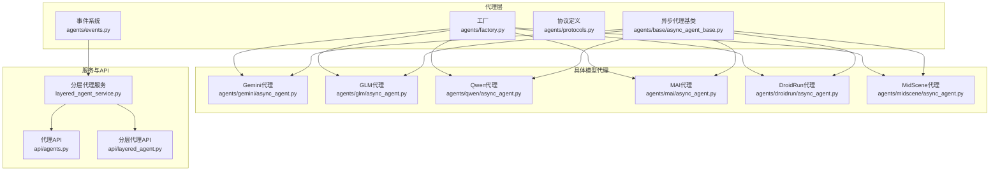
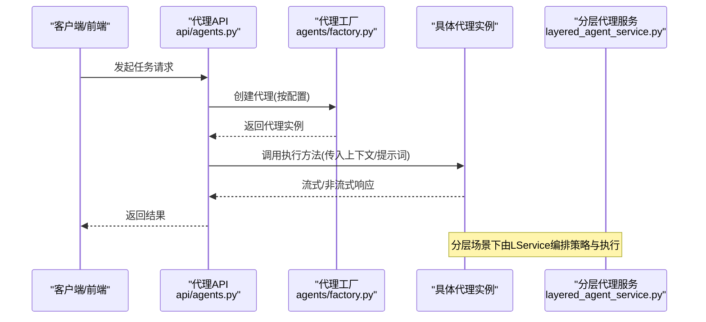
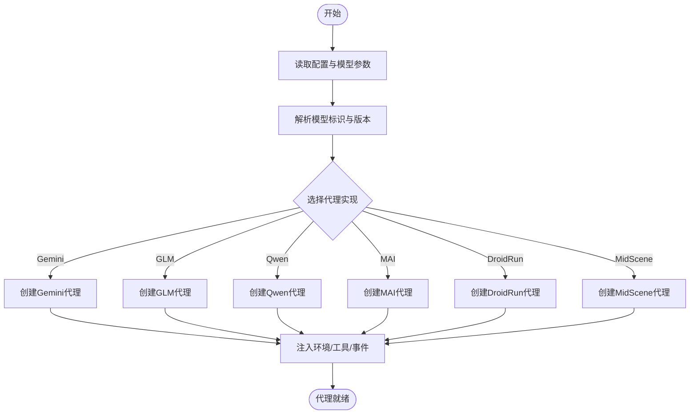
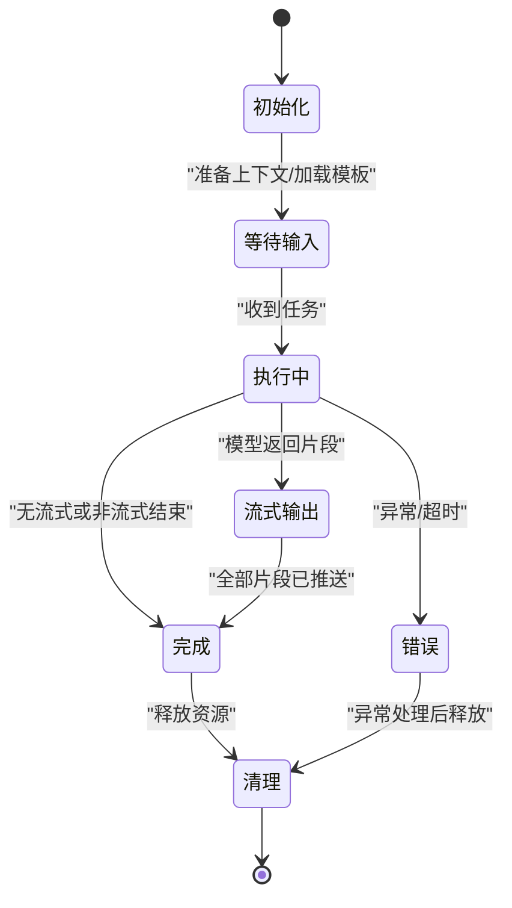
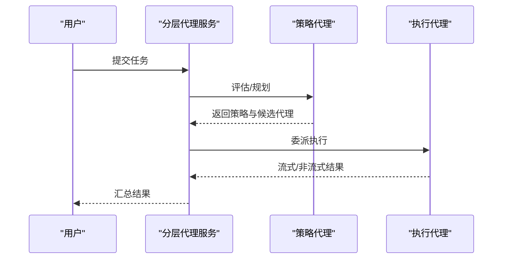
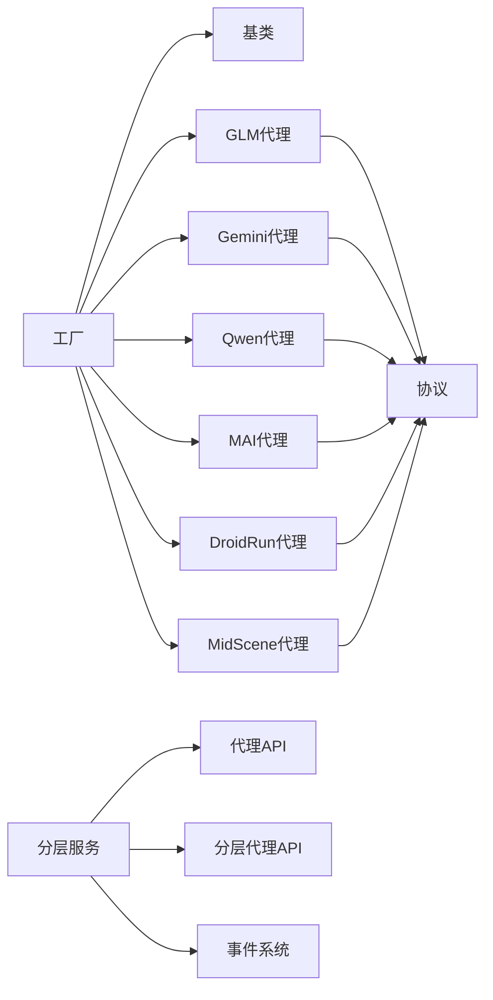

# AI代理系统

<cite>
**本文引用的文件**
- [factory.py](file://AutoGLM_GUI/agents/factory.py)
- [async_agent_base.py](file://AutoGLM_GUI/agents/base/async_agent_base.py)
- [protocols.py](file://AutoGLM_GUI/agents/protocols.py)
- [layered_agent_service.py](file://AutoGLM_GUI/layered_agent_service.py)
- [gemini/async_agent.py](file://AutoGLM_GUI/agents/gemini/async_agent.py)
- [glm/async_agent.py](file://AutoGLM_GUI/agents/glm/async_agent.py)
- [qwen/async_agent.py](file://AutoGLM_GUI/agents/qwen/async_agent.py)
- [mai/async_agent.py](file://AutoGLM_GUI/agents/mai/async_agent.py)
- [droidrun/async_agent.py](file://AutoGLM_GUI/agents/droidrun/async_agent.py)
- [midscene/async_agent.py](file://AutoGLM_GUI/agents/midscene/async_agent.py)
- [events.py](file://AutoGLM_GUI/agents/events.py)
- [error_details.py](file://AutoGLM_GUI/model/error_details.py)
- [message_builder.py](file://AutoGLM_GUI/model/message_builder.py)
- [config.py](file://AutoGLM_GUI/config.py)
- [config_manager.py](file://AutoGLM_GUI/config_manager.py)
- [exceptions.py](file://AutoGLM_GUI/exceptions.py)
- [api/agents.py](file://AutoGLM_GUI/api/agents.py)
- [api/layered_agent.py](file://AutoGLM_GUI/api/layered_agent.py)
- [test_glm_async_agent.py](file://tests/test_glm_async_agent.py)
- [test_gemini_agent.py](file://tests/test_gemini_agent.py)
- [test_qwen_agent.py](file://tests/test_qwen_agent.py)
</cite>

## 目录
1. [引言](#引言)
2. [项目结构](#项目结构)
3. [核心组件](#核心组件)
4. [架构总览](#架构总览)
5. [详细组件分析](#详细组件分析)
6. [依赖分析](#依赖分析)
7. [性能考虑](#性能考虑)
8. [故障排查指南](#故障排查指南)
9. [结论](#结论)
10. [附录](#附录)

## 引言
本文件面向AutoGLM-GUI的AI代理系统，系统性阐述代理工厂模式、多模型支持、任务执行流程与分层代理架构的设计与实现。重点覆盖GLM、Gemini、Qwen、MAI等不同AI模型的集成方式、代理生命周期管理、流式响应处理、错误恢复机制，并给出常见问题（模型连接失败、响应超时、内存泄漏）的诊断与修复建议。文档兼顾初学者可读性与资深开发者所需的技术深度。

## 项目结构
AutoGLM-GUI的AI代理系统位于AutoGLM_GUI/agents目录下，采用“按模型分模块”的组织方式，每个模型一个子包，统一通过工厂创建与调度；同时提供抽象基类与协议定义，确保扩展性与一致性。分层代理服务位于顶层，负责会话编排与跨代理协作。

图示来源
- [factory.py](file://AutoGLM_GUI/agents/factory.py)
- [async_agent_base.py](file://AutoGLM_GUI/agents/base/async_agent_base.py)
- [protocols.py](file://AutoGLM_GUI/agents/protocols.py)
- [gemini/async_agent.py](file://AutoGLM_GUI/agents/gemini/async_agent.py)
- [glm/async_agent.py](file://AutoGLM_GUI/agents/glm/async_agent.py)
- [qwen/async_agent.py](file://AutoGLM_GUI/agents/qwen/async_agent.py)
- [mai/async_agent.py](file://AutoGLM_GUI/agents/mai/async_agent.py)
- [droidrun/async_agent.py](file://AutoGLM_GUI/agents/droidrun/async_agent.py)
- [midscene/async_agent.py](file://AutoGLM_GUI/agents/midscene/async_agent.py)
- [layered_agent_service.py](file://AutoGLM_GUI/layered_agent_service.py)
- [api/agents.py](file://AutoGLM_GUI/api/agents.py)
- [api/layered_agent.py](file://AutoGLM_GUI/api/layered_agent.py)

章节来源
- [factory.py](file://AutoGLM_GUI/agents/factory.py)
- [async_agent_base.py](file://AutoGLM_GUI/agents/base/async_agent_base.py)
- [protocols.py](file://AutoGLM_GUI/agents/protocols.py)
- [layered_agent_service.py](file://AutoGLM_GUI/layered_agent_service.py)

## 核心组件
- 代理工厂：集中创建与配置具体模型代理，屏蔽模型差异，提供统一入口。
- 异步代理基类：定义通用生命周期、消息处理、流式输出、错误传播等接口契约。
- 协议与事件：定义代理间通信协议与事件模型，支撑分层代理协作。
- 分层代理服务：编排高层策略与底层执行代理，实现“策略-执行”解耦。
- 模型代理实现：各模型独立适配器，封装API调用、提示词工程、解析器与工具集。
- 错误与消息构建：统一错误详情与消息格式，便于调试与前端展示。

章节来源
- [factory.py](file://AutoGLM_GUI/agents/factory.py)
- [async_agent_base.py](file://AutoGLM_GUI/agents/base/async_agent_base.py)
- [protocols.py](file://AutoGLM_GUI/agents/protocols.py)
- [events.py](file://AutoGLM_GUI/agents/events.py)
- [error_details.py](file://AutoGLM_GUI/model/error_details.py)
- [message_builder.py](file://AutoGLM_GUI/model/message_builder.py)

## 架构总览
系统采用“工厂+基类+协议+分层服务”的分层设计。工厂根据配置选择具体模型代理；基类提供一致的异步接口；协议定义跨代理交互；分层服务在上层进行策略决策，在下层委派具体代理执行。

图示来源
- [api/agents.py](file://AutoGLM_GUI/api/agents.py)
- [factory.py](file://AutoGLM_GUI/agents/factory.py)
- [layered_agent_service.py](file://AutoGLM_GUI/layered_agent_service.py)

## 详细组件分析

### 工厂模式与代理创建
- 设计要点
  - 工厂依据配置选择模型类型，构造对应代理实例。
  - 统一注入配置、日志、事件与工具集合，保证各代理行为一致。
  - 支持延迟初始化与资源复用，降低冷启动成本。
- 关键流程
  - 读取配置与模型参数
  - 解析模型标识与版本
  - 实例化代理并绑定运行环境
  - 注册事件监听与错误回调
- 典型调用链
  - 配置加载 → 工厂创建 → 代理初始化 → 任务执行 → 结果回传

图示来源
- [factory.py](file://AutoGLM_GUI/agents/factory.py)

章节来源
- [factory.py](file://AutoGLM_GUI/agents/factory.py)

### 异步代理基类与生命周期
- 生命周期
  - 初始化：注册事件、准备会话上下文、加载提示词模板
  - 执行：接收输入，构建消息序列，调用模型API
  - 流式输出：逐块推送中间结果，支持中断与恢复
  - 清理：释放资源、关闭连接、记录统计
- 接口契约
  - 异步执行方法：支持取消、超时控制
  - 流式回调：定义数据块、完成、错误三类事件
  - 错误传播：标准化异常包装与重试策略
- 复杂度与性能
  - IO密集型，关注并发安全与背压处理
  - 建议使用异步队列与限流策略

图示来源
- [async_agent_base.py](file://AutoGLM_GUI/agents/base/async_agent_base.py)

章节来源
- [async_agent_base.py](file://AutoGLM_GUI/agents/base/async_agent_base.py)

### 协议与事件系统
- 协议定义
  - 任务输入/输出结构
  - 流式数据帧格式
  - 错误码与重试策略
- 事件系统
  - 任务开始、进度更新、完成、错误
  - 代理状态变更与资源占用
- 作用
  - 规范跨代理通信
  - 支撑分层代理编排与可观测性

章节来源
- [protocols.py](file://AutoGLM_GUI/agents/protocols.py)
- [events.py](file://AutoGLM_GUI/agents/events.py)

### 分层代理服务
- 设计理念
  - 上层策略代理负责规划与决策
  - 下层执行代理负责具体动作与对话
  - 通过协议与事件解耦，支持动态替换与组合
- 关键能力
  - 会话编排：维护历史、上下文与优先级
  - 动态路由：根据任务类型选择最优代理
  - 资源池化：共享连接与缓存，降低开销
- 与API对接
  - 提供统一的会话与任务接口
  - 支持中断、暂停与恢复

图示来源
- [layered_agent_service.py](file://AutoGLM_GUI/layered_agent_service.py)
- [api/layered_agent.py](file://AutoGLM_GUI/api/layered_agent.py)

章节来源
- [layered_agent_service.py](file://AutoGLM_GUI/layered_agent_service.py)
- [api/layered_agent.py](file://AutoGLM_GUI/api/layered_agent.py)

### 模型代理实现概览
- Gemini代理
  - 适配Google AI接口，支持多模态与函数调用
  - 行为：构建提示词→调用模型→解析响应→触发工具
- GLM代理
  - 适配智谱AI接口，支持中文与复杂指令
  - 行为：提示词工程→流式解析→动作映射→反馈循环
- Qwen代理
  - 适配通义千问接口，支持多语言与长上下文
  - 行为：提示词模板→工具调用→结构化解析→结果汇总
- MAI代理
  - 适配特定移动端智能体接口，强调轨迹记忆与连续交互
  - 行为：轨迹记忆→上下文压缩→策略生成→动作执行
- DroidRun/MidScene代理
  - 面向设备控制与日志分析的专用代理
  - 行为：设备截图/日志→结构化提取→决策与反馈

章节来源
- [gemini/async_agent.py](file://AutoGLM_GUI/agents/gemini/async_agent.py)
- [glm/async_agent.py](file://AutoGLM_GUI/agents/glm/async_agent.py)
- [qwen/async_agent.py](file://AutoGLM_GUI/agents/qwen/async_agent.py)
- [mai/async_agent.py](file://AutoGLM_GUI/agents/mai/async_agent.py)
- [droidrun/async_agent.py](file://AutoGLM_GUI/agents/droidrun/async_agent.py)
- [midscene/async_agent.py](file://AutoGLM_GUI/agents/midscene/async_agent.py)

### 流式响应处理与错误恢复
- 流式处理
  - 代理在执行过程中持续推送中间结果，前端可实时渲染
  - 支持中断：取消当前任务，清理资源，保持代理可用
- 错误恢复
  - 统一错误包装：区分网络、鉴权、语义、超时等类别
  - 自动重试：指数退避与最大重试次数
  - 回退策略：切换备用模型或降级路径
- 可观测性
  - 记录事件与指标，便于定位瓶颈与异常

章节来源
- [async_agent_base.py](file://AutoGLM_GUI/agents/base/async_agent_base.py)
- [error_details.py](file://AutoGLM_GUI/model/error_details.py)
- [message_builder.py](file://AutoGLM_GUI/model/message_builder.py)

## 依赖分析
- 内部依赖
  - 代理实现依赖基类与协议，确保行为一致性
  - 工厂依赖配置与事件系统，驱动代理创建与生命周期
  - 分层服务依赖代理API与事件系统，实现编排与监控
- 外部依赖
  - 各模型SDK/HTTP客户端
  - 设备控制与截图库
  - 日志与指标采集库

图示来源
- [factory.py](file://AutoGLM_GUI/agents/factory.py)
- [async_agent_base.py](file://AutoGLM_GUI/agents/base/async_agent_base.py)
- [protocols.py](file://AutoGLM_GUI/agents/protocols.py)
- [layered_agent_service.py](file://AutoGLM_GUI/layered_agent_service.py)
- [api/agents.py](file://AutoGLM_GUI/api/agents.py)
- [api/layered_agent.py](file://AutoGLM_GUI/api/layered_agent.py)

章节来源
- [factory.py](file://AutoGLM_GUI/agents/factory.py)
- [async_agent_base.py](file://AutoGLM_GUI/agents/base/async_agent_base.py)
- [protocols.py](file://AutoGLM_GUI/agents/protocols.py)
- [layered_agent_service.py](file://AutoGLM_GUI/layered_agent_service.py)

## 性能考虑
- 并发与背压
  - 使用异步队列与限流，避免过载
  - 对高延迟模型启用预热与连接池
- 缓存与复用
  - 复用会话上下文与工具调用结果
  - 缩短提示词长度与压缩历史
- 资源管理
  - 明确生命周期清理，防止句柄泄露
  - 监控内存与CPU，及时回收无用对象

## 故障排查指南
- 模型连接失败
  - 检查鉴权参数与网络连通性
  - 查看错误详情与重试日志
  - 切换备用模型或IP
- 响应超时
  - 增加超时阈值或优化提示词
  - 启用自动重试与指数退避
- 内存泄漏
  - 确认代理清理逻辑与资源释放
  - 使用弱引用避免循环引用
- 常见测试用例参考
  - GLM异步代理测试
  - Gemini代理测试
  - Qwen代理测试

章节来源
- [error_details.py](file://AutoGLM_GUI/model/error_details.py)
- [exceptions.py](file://AutoGLM_GUI/exceptions.py)
- [test_glm_async_agent.py](file://tests/test_glm_async_agent.py)
- [test_gemini_agent.py](file://tests/test_gemini_agent.py)
- [test_qwen_agent.py](file://tests/test_qwen_agent.py)

## 结论
AutoGLM-GUI的AI代理系统以工厂模式为核心，结合异步基类、协议与事件系统，实现了对多模型的统一接入与分层编排。通过标准化的生命周期、流式处理与错误恢复机制，系统在易用性与可扩展性之间取得平衡。建议在生产环境中强化资源治理与可观测性，持续完善回退与重试策略，以提升稳定性与用户体验。

## 附录
- 配置与参数
  - 模型类型与版本
  - 超时与重试策略
  - 连接池大小与预热
- 接口与返回值
  - 任务提交/查询/取消
  - 流式数据帧与完成标记
  - 错误码与错误详情
- 最佳实践
  - 优先使用分层代理处理复杂任务
  - 在代理内实现幂等与可恢复逻辑
  - 通过事件系统实现端到端追踪