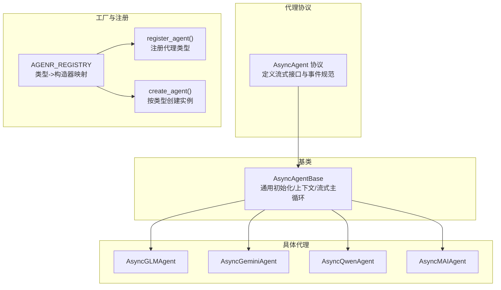
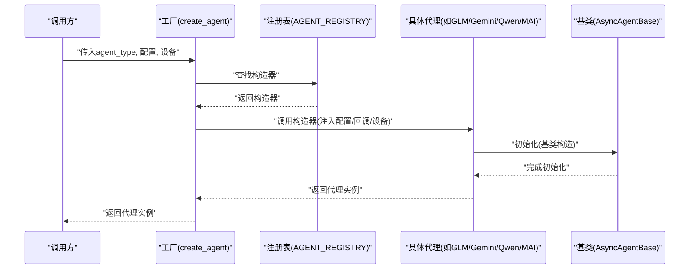
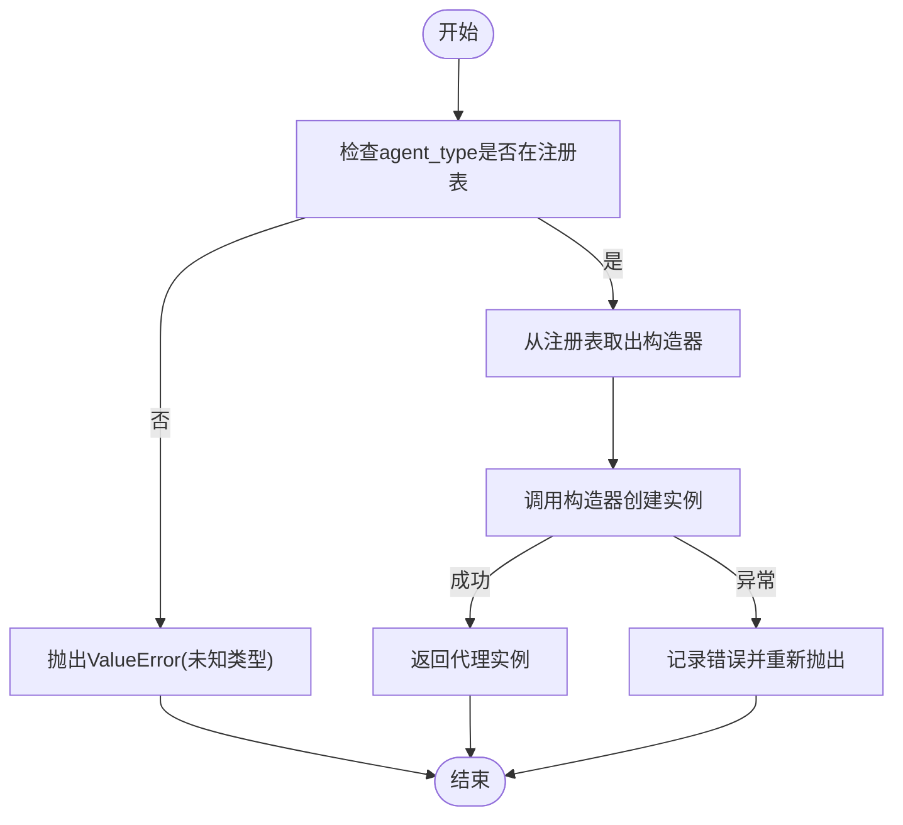
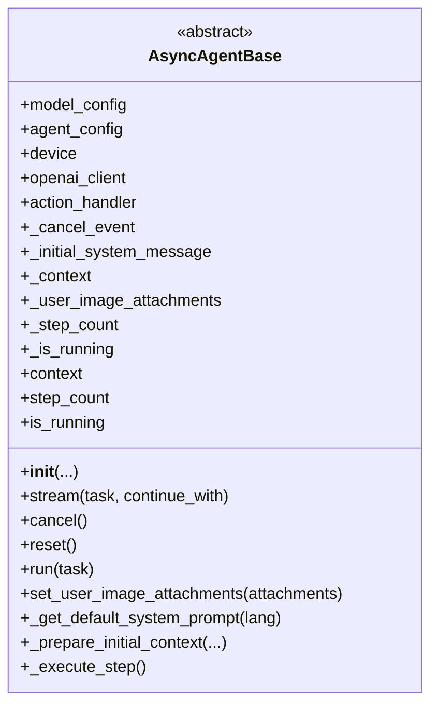
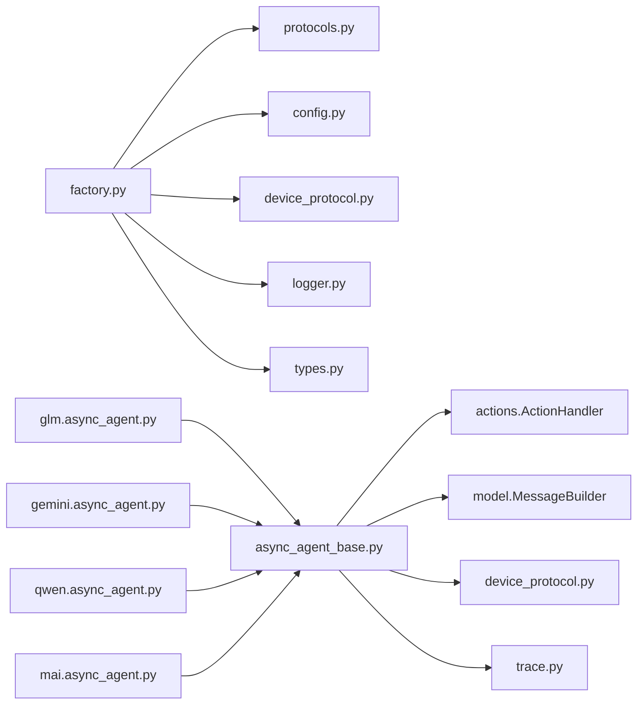

# 代理工厂与创建

<cite>
**本文引用的文件**
- [factory.py](file://AutoGLM_GUI/agents/factory.py)
- [__init__.py](file://AutoGLM_GUI/agents/__init__.py)
- [protocols.py](file://AutoGLM_GUI/agents/protocols.py)
- [events.py](file://AutoGLM_GUI/agents/events.py)
- [async_agent_base.py](file://AutoGLM_GUI/agents/base/async_agent_base.py)
- [async_agent.py (GLM)](file://AutoGLM_GUI/agents/glm/async_agent.py)
- [async_agent.py (Gemini)](file://AutoGLM_GUI/agents/gemini/async_agent.py)
- [async_agent.py (Qwen)](file://AutoGLM_GUI/agents/qwen/async_agent.py)
- [async_agent.py (MAI)](file://AutoGLM_GUI/agents/mai/async_agent.py)
</cite>

## 目录
1. [引言](#引言)
2. [项目结构](#项目结构)
3. [核心组件](#核心组件)
4. [架构总览](#架构总览)
5. [详细组件分析](#详细组件分析)
6. [依赖分析](#依赖分析)
7. [性能考虑](#性能考虑)
8. [故障排查指南](#故障排查指南)
9. [结论](#结论)
10. [附录](#附录)

## 引言
本文件围绕“AI代理工厂与创建”模块，系统阐述代理工厂模式的设计理念、代理创建流程、代理生命周期管理等核心概念。文档从工厂类实现细节入手，逐步展开到代理实例化过程、配置参数传递机制；并通过具体代理实现（GLM、Gemini、Qwen、MAI）展示如何扩展新类型的AI代理；最后总结代理基类AsyncAgentBase的设计模式、抽象方法定义与通用功能实现，并给出性能优化、内存管理与并发安全等方面的实践建议。

## 项目结构
本模块位于AutoGLM_GUI/agents目录下，采用“协议+工厂+基类+具体实现”的分层组织方式：
- 协议层：定义AsyncAgent接口，约束所有代理的公共行为（流式执行、取消、重置等）
- 工厂层：提供注册与创建能力，支持按类型动态创建代理实例
- 基类层：AsyncAgentBase抽取通用逻辑（设备交互、上下文管理、流式主循环、看门狗等）
- 具体实现层：各模型厂商或特定范式的代理实现，继承基类并实现抽象方法

图表来源
- [factory.py:20-107](file://AutoGLM_GUI/agents/factory.py#L20-L107)
- [protocols.py:9-95](file://AutoGLM_GUI/agents/protocols.py#L9-L95)
- [async_agent_base.py:32-109](file://AutoGLM_GUI/agents/base/async_agent_base.py#L32-L109)

章节来源
- [factory.py:1-283](file://AutoGLM_GUI/agents/factory.py#L1-L283)
- [__init__.py:1-56](file://AutoGLM_GUI/agents/__init__.py#L1-L56)
- [protocols.py:1-95](file://AutoGLM_GUI/agents/protocols.py#L1-L95)
- [async_agent_base.py:1-439](file://AutoGLM_GUI/agents/base/async_agent_base.py#L1-L439)

## 核心组件
- 代理协议AsyncAgent：定义统一的流式接口、取消与重置能力，确保上层调用一致性
- 工厂与注册表：通过注册表维护“代理类型->构造器”的映射，支持动态扩展
- 代理基类AsyncAgentBase：封装通用逻辑（设备交互、ActionHandler、上下文管理、流式主循环、看门狗、取消与重置）
- 具体代理实现：GLM、Gemini、Qwen、MAI等，各自实现抽象方法并复用基类能力

章节来源
- [protocols.py:9-95](file://AutoGLM_GUI/agents/protocols.py#L9-L95)
- [factory.py:20-107](file://AutoGLM_GUI/agents/factory.py#L20-L107)
- [async_agent_base.py:32-109](file://AutoGLM_GUI/agents/base/async_agent_base.py#L32-L109)

## 架构总览
代理工厂与创建的整体架构如下：

图表来源
- [factory.py:49-98](file://AutoGLM_GUI/agents/factory.py#L49-L98)
- [async_agent_base.py:42-82](file://AutoGLM_GUI/agents/base/async_agent_base.py#L42-L82)

章节来源
- [factory.py:49-98](file://AutoGLM_GUI/agents/factory.py#L49-L98)
- [async_agent_base.py:42-82](file://AutoGLM_GUI/agents/base/async_agent_base.py#L42-L82)

## 详细组件分析

### 工厂与注册机制
- 注册表：全局字典维护“代理类型字符串->构造器函数”的映射
- 注册：register_agent(agent_type, creator) 将构造器绑定到类型，重复注册会发出警告并覆盖
- 创建：create_agent(agent_type, ...) 根据类型查找构造器并调用，异常时记录错误并抛出
- 内置构造器：工厂内已注册多种代理类型（如“glm-async”“mai”“gemini”“general-vision”“qwen”“droidrun”“midscene”），并提供别名映射
- 查询：list_agent_types()/is_agent_type_registered()用于查询可用类型与注册状态

图表来源
- [factory.py:76-97](file://AutoGLM_GUI/agents/factory.py#L76-L97)

章节来源
- [factory.py:24-107](file://AutoGLM_GUI/agents/factory.py#L24-L107)
- [factory.py:113-282](file://AutoGLM_GUI/agents/factory.py#L113-L282)

### 代理基类AsyncAgentBase设计与实现
- 初始化：接收ModelConfig、AgentConfig、DeviceProtocol，并创建AsyncOpenAI客户端、ActionHandler；准备初始系统消息；初始化状态（上下文、附件图片、步数、运行状态、取消事件）
- 抽象方法：
  - _get_default_system_prompt(lang)：返回默认system prompt
  - _prepare_initial_context(...)：构建首条用户消息并加入上下文
  - _execute_step()：单步执行（截图→LLM→动作执行），需返回异步生成器
- 共享逻辑：
  - stream(task, continue_with=None)：流式主循环，支持取消、继续执行、看门狗（重复动作/无进展检测）、事件产出（thinking/step/done/cancelled/error）
  - cancel/reset/run/context/step_count/is_running等属性与方法

图表来源
- [async_agent_base.py:32-109](file://AutoGLM_GUI/agents/base/async_agent_base.py#L32-L109)
- [async_agent_base.py:112-439](file://AutoGLM_GUI/agents/base/async_agent_base.py#L112-L439)

章节来源
- [async_agent_base.py:32-109](file://AutoGLM_GUI/agents/base/async_agent_base.py#L32-L109)
- [async_agent_base.py:112-439](file://AutoGLM_GUI/agents/base/async_agent_base.py#L112-L439)

### 具体代理实现要点

#### GLM代理（AsyncGLMAgent）
- 继承关系：AsyncGLMAgent(AsyncAgentBase, AsyncAgent)
- 特性：自定义格式解析<think>/<answer>，流式解析思考片段，支持参考图片与屏幕信息拼接
- 关键点：_prepare_initial_context仅暂存任务与参考图；_execute_step中每步构建用户消息（仅当前截图），调用_openai_client.chat.completions.create并流式读取；解析后交由ActionHandler执行；更新上下文时移除图片避免累积膨胀
- 取消与错误：在LLM流式阶段检测取消事件并关闭连接；异常序列化并上报

章节来源
- [async_agent.py (GLM):40-340](file://AutoGLM_GUI/agents/glm/async_agent.py#L40-L340)
- [async_agent.py (GLM):341-428](file://AutoGLM_GUI/agents/glm/async_agent.py#L341-L428)

#### Gemini代理（AsyncGeminiAgent）
- 继承关系：AsyncGeminiAgent(AsyncAgentBase)
- 特性：OpenAI兼容function calling，要求tools与tool_choice="required"；支持reasoning_content提取；工具调用失败有连续错误计数与上限控制
- 关键点：_prepare_initial_context拼装任务与当前app信息；_execute_step中调用工具函数，转换为动作；错误时写入工具交换消息并决定是否终止；支持verbose日志与trace标注

章节来源
- [async_agent.py (Gemini):29-346](file://AutoGLM_GUI/agents/gemini/async_agent.py#L29-L346)
- [async_agent.py (Gemini):347-453](file://AutoGLM_GUI/agents/gemini/async_agent.py#L347-L453)

#### Qwen代理（AsyncQwenAgent）
- 继承关系：AsyncQwenAgent(AsyncAgentBase, AsyncAgent)
- 特性：自定义<thought>/<answer>格式解析；支持reasoning输出；verbose模式下在截图上绘制点击位置调试图
- 关键点：_prepare_initial_context暂存任务与参考图；_execute_step中构建消息、流式LLM、解析思考与动作；ActionHandler执行；更新上下文；支持交互动作（Take_over/Interact）触发接管

章节来源
- [async_agent.py (Qwen):49-398](file://AutoGLM_GUI/agents/qwen/async_agent.py#L49-L398)
- [async_agent.py (Qwen):399-463](file://AutoGLM_GUI/agents/qwen/async_agent.py#L399-L463)

#### MAI代理（AsyncMAIAgent）
- 继承关系：AsyncMAIAgent(AsyncAgentBase)
- 特性：不累积消息，使用TrajMemory维护多图历史上下文；XML风格<thinking>...</thinking>与动作输出；带重试机制（最多3次）；支持verbose调试
- 关键点：_prepare_initial_context仅记录任务目标；_execute_step中每步重建消息列表（含历史N张截图与对应思考/动作）；流式解析后写入TrajMemory；ActionHandler执行；支持交互动作与完成判定

章节来源
- [async_agent.py (MAI):34-318](file://AutoGLM_GUI/agents/mai/async_agent.py#L34-L318)
- [async_agent.py (MAI):320-431](file://AutoGLM_GUI/agents/mai/async_agent.py#L320-L431)

### 代理事件与类型
- 事件类型：AgentEventType枚举包含thinking、step、done、error、cancelled
- 事件结构：AgentEvent为统一事件字典，包含type与data字段
- 事件来源：各代理在执行过程中按阶段产出事件，供上层消费（如前端SSE）

章节来源
- [events.py:1-20](file://AutoGLM_GUI/agents/events.py#L1-L20)

## 依赖分析
- 工厂依赖：工厂模块依赖协议、配置、设备协议、日志与类型定义
- 基类依赖：基类依赖ActionHandler、MessageBuilder、设备协议、Trace标注与超时配置
- 具体代理依赖：各代理依赖自身解析器、提示词、工具集与消息构建器；部分代理依赖PIL进行调试绘图

图表来源
- [factory.py:12-17](file://AutoGLM_GUI/agents/factory.py#L12-L17)
- [async_agent_base.py:20-25](file://AutoGLM_GUI/agents/base/async_agent_base.py#L20-L25)

章节来源
- [factory.py:12-17](file://AutoGLM_GUI/agents/factory.py#L12-L17)
- [async_agent_base.py:20-25](file://AutoGLM_GUI/agents/base/async_agent_base.py#L20-L25)

## 性能考虑
- 流式处理与取消：代理通过异步生成器与取消事件实现低延迟、可中断的执行链路，避免阻塞主线程
- 上下文与图片管理：基类在每步结束后清理消息中的图片，防止上下文无限增长；GLM/Qwen/MAI均在更新上下文时移除图片
- 截图与设备调用：通过线程池包装设备调用，避免阻塞事件循环
- 看门狗保护：重复动作与无进展检测避免死循环，保障系统稳定性
- 重试机制：MAI在解析失败时自动重试，提升鲁棒性
- 并发安全：取消事件使用asyncio.Event，确保跨协程可见；ActionHandler执行在独立线程中进行

章节来源
- [async_agent_base.py:112-401](file://AutoGLM_GUI/agents/base/async_agent_base.py#L112-L401)
- [async_agent.py (MAI):142-232](file://AutoGLM_GUI/agents/mai/async_agent.py#L142-L232)

## 故障排查指南
- 未知代理类型：当agent_type未注册时，工厂会抛出异常并列出可用类型，便于快速定位问题
- 设备错误：在获取截图或应用信息失败时，代理会产出error事件并结束当前步骤
- LLM错误：捕获模型调用异常并序列化错误详情，同时在verbose模式下输出堆栈
- 取消行为：用户取消会触发CancelledError，代理会产出cancelled事件并清理状态
- 工具调用失败（Gemini）：连续无效工具调用超过阈值会终止任务，避免无效轮询

章节来源
- [factory.py:76-97](file://AutoGLM_GUI/agents/factory.py#L76-L97)
- [async_agent.py (GLM):196-239](file://AutoGLM_GUI/agents/glm/async_agent.py#L196-L239)
- [async_agent.py (Gemini):204-282](file://AutoGLM_GUI/agents/gemini/async_agent.py#L204-L282)
- [async_agent_base.py:381-396](file://AutoGLM_GUI/agents/base/async_agent_base.py#L381-L396)

## 结论
本模块通过“协议+工厂+基类+实现”的清晰分层，实现了高扩展性的AI代理体系。工厂负责类型注册与实例化，基类提供通用能力，具体代理聚焦于各自的推理范式与解析策略。配合流式执行、取消机制、看门狗与上下文清理等设计，既保证了易用性，也兼顾了性能与稳定性。对于新增代理类型，只需实现基类抽象方法并注册到工厂即可无缝接入。

## 附录

### 如何创建不同类型的AI代理
- 使用工厂创建：传入agent_type与配置（ModelConfig、AgentConfig、AgentSpecificConfig、DeviceProtocol），以及可选回调（takeover_callback、confirmation_callback）
- 常见类型：glm-async/async-glm、mai、gemini/general-vision、qwen、droidrun、midscene
- 查询可用类型：list_agent_types()

章节来源
- [factory.py:49-107](file://AutoGLM_GUI/agents/factory.py#L49-L107)
- [__init__.py:15-46](file://AutoGLM_GUI/agents/__init__.py#L15-L46)

### 代理生命周期管理
- 初始化：工厂创建→基类初始化→ActionHandler与OpenAI客户端就绪
- 执行：stream()主循环→每步_get_execute_step()→ActionHandler执行→上下文更新
- 取消：cancel()设置取消事件→抛出CancelledError→产出cancelled事件
- 重置：reset()清空上下文与状态，保留初始系统消息

章节来源
- [async_agent_base.py:42-439](file://AutoGLM_GUI/agents/base/async_agent_base.py#L42-L439)