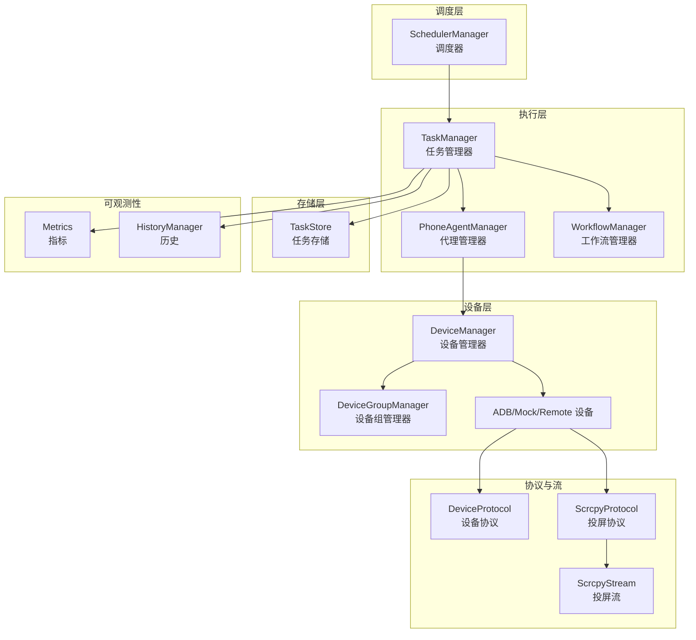
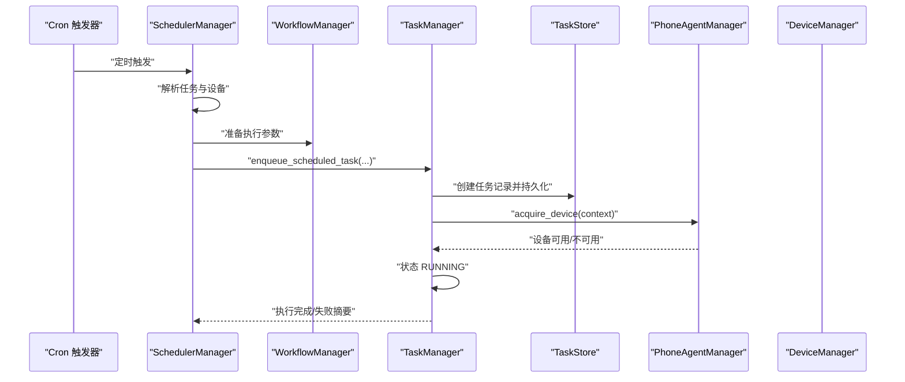
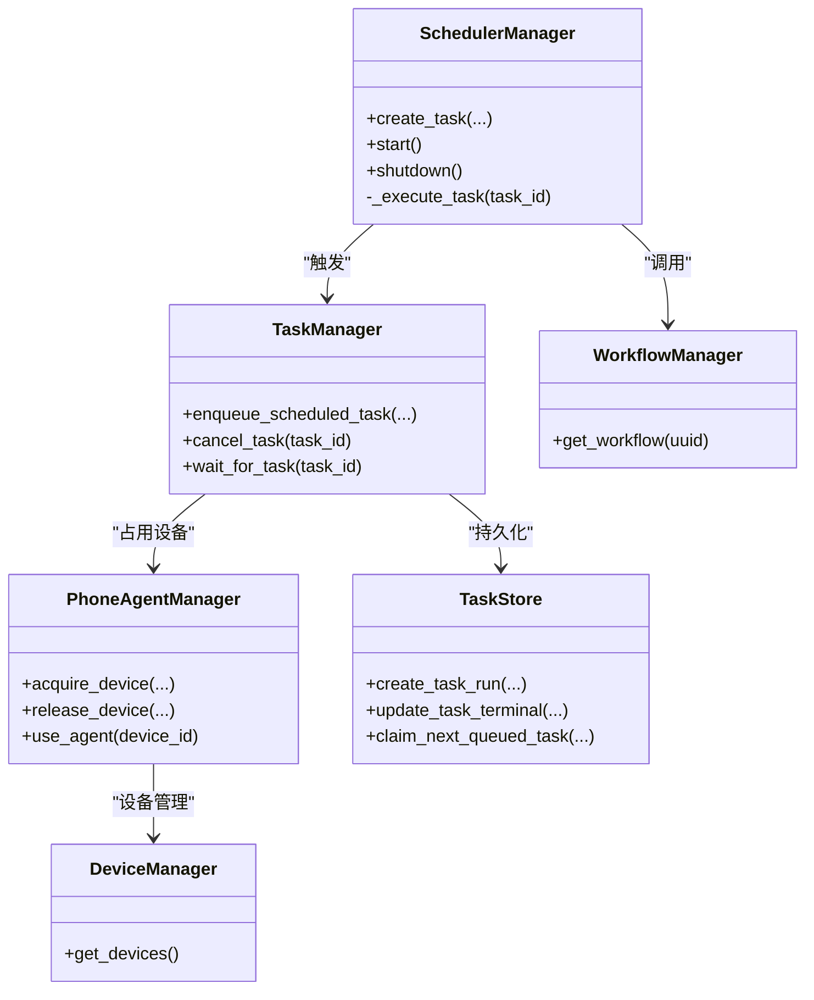

# 任务执行引擎

<cite>
**本文引用的文件**
- [task_manager.py](file://AutoGLM_GUI/task_manager.py)
- [scheduler_manager.py](file://AutoGLM_GUI/scheduler_manager.py)
- [task_store.py](file://AutoGLM_GUI/task_store.py)
- [phone_agent_manager.py](file://AutoGLM_GUI/phone_agent_manager.py)
- [workflow_manager.py](file://AutoGLM_GUI/workflow_manager.py)
- [devices.py](file://AutoGLM_GUI/devices/__init__.py)
- [adb_device.py](file://AutoGLM_GUI/devices/adb_device.py)
- [mock_device.py](file://AutoGLM_GUI/devices/mock_device.py)
- [remote_device.py](file://AutoGLM_GUI/devices/remote_device.py)
- [device_manager.py](file://AutoGLM_GUI/device_manager.py)
- [device_group_manager.py](file://AutoGLM_GUI/device_group_manager.py)
- [device_metadata_manager.py](file://AutoGLM_GUI/device_metadata_manager.py)
- [device_protocol.py](file://AutoGLM_GUI/device_protocol.py)
- [scrcpy_protocol.py](file://AutoGLM_GUI/scrcpy_protocol.py)
- [scrcpy_stream.py](file://AutoGLM_GUI/scrcpy_stream.py)
- [metrics.py](file://AutoGLM_GUI/metrics.py)
- [history_manager.py](file://AutoGLM_GUI/history_manager.py)
- [experience_planner.py](file://AutoGLM_GUI/experience_planner.py)
- [experience_report.py](file://AutoGLM_GUI/experience_report.py)
- [exceptions.py](file://AutoGLM_GUI/exceptions.py)
- [types.py](file://AutoGLM_GUI/types.py)
- [schemas.py](file://AutoGLM_GUI/schemas.py)
- [test_task_manager.py](file://tests/test_task_manager.py)
- [test_scheduler_manager.py](file://tests/test_scheduler_manager.py)
- [test_scheduled_tasks_api.py](file://tests/test_scheduled_tasks_api.py)
- [test_cancel_device_release.py](file://tests/test_cancel_device_release.py)
- [test_phone_agent_manager.py](file://tests/test_phone_agent_manager.py)
- [test_manager_device_coverage.py](file://tests/test_manager_device_coverage.py)
- [test_layered_agent_session_api.py](file://tests/test_layered_agent_session_api.py)
</cite>

## 目录
1. [引言](#引言)
2. [项目结构](#项目结构)
3. [核心组件](#核心组件)
4. [架构总览](#架构总览)
5. [详细组件分析](#详细组件分析)
6. [依赖关系分析](#依赖关系分析)
7. [性能考量](#性能考量)
8. [故障排查指南](#故障排查指南)
9. [结论](#结论)
10. [附录](#附录)

## 引言
本文件系统性梳理任务执行引擎模块，覆盖任务调度、动作执行顺序、状态跟踪与结果反馈等关键流程；解释并发控制、错误恢复与重试机制；并结合测试用例与实际代码路径，给出可操作的实现参考。目标是帮助初学者快速上手，同时为资深开发者提供足够的技术深度。

## 项目结构
任务执行引擎由以下子系统协同工作：
- 调度器：负责周期性任务的创建、启停与触发
- 任务管理器：负责任务入队、执行、取消、状态更新与持久化
- 设备与设备组：负责设备发现、分组与分配
- 工作流管理器：负责工作流解析与执行
- 代理管理器：负责设备占用、状态机与并发控制
- 存储层：负责任务记录、调度摘要与历史数据持久化
- 协议与设备抽象：负责设备通信协议与输入输出处理
- 指标与历史：负责运行指标采集与历史回放

图表来源
- [scheduler_manager.py:48-94](file://AutoGLM_GUI/scheduler_manager.py#L48-L94)
- [task_manager.py](file://AutoGLM_GUI/task_manager.py)
- [phone_agent_manager.py:52-107](file://AutoGLM_GUI/phone_agent_manager.py#L52-L107)
- [workflow_manager.py](file://AutoGLM_GUI/workflow_manager.py)
- [task_store.py:633-671](file://AutoGLM_GUI/task_store.py#L633-L671)
- [device_manager.py](file://AutoGLM_GUI/device_manager.py)
- [device_group_manager.py](file://AutoGLM_GUI/device_group_manager.py)
- [device_protocol.py](file://AutoGLM_GUI/device_protocol.py)
- [scrcpy_protocol.py](file://AutoGLM_GUI/scrcpy_protocol.py)
- [scrcpy_stream.py](file://AutoGLM_GUI/scrcpy_stream.py)
- [metrics.py](file://AutoGLM_GUI/metrics.py)
- [history_manager.py](file://AutoGLM_GUI/history_manager.py)

章节来源
- [scheduler_manager.py:48-94](file://AutoGLM_GUI/scheduler_manager.py#L48-L94)
- [task_manager.py](file://AutoGLM_GUI/task_manager.py)
- [phone_agent_manager.py:52-107](file://AutoGLM_GUI/phone_agent_manager.py#L52-L107)
- [workflow_manager.py](file://AutoGLM_GUI/workflow_manager.py)
- [task_store.py:633-671](file://AutoGLM_GUI/task_store.py#L633-L671)
- [device_manager.py](file://AutoGLM_GUI/device_manager.py)
- [device_group_manager.py](file://AutoGLM_GUI/device_group_manager.py)
- [device_protocol.py](file://AutoGLM_GUI/device_protocol.py)
- [scrcpy_protocol.py](file://AutoGLM_GUI/scrcpy_protocol.py)
- [scrcpy_stream.py](file://AutoGLM_GUI/scrcpy_stream.py)
- [metrics.py](file://AutoGLM_GUI/metrics.py)
- [history_manager.py](file://AutoGLM_GUI/history_manager.py)

## 核心组件
- 调度器（SchedulerManager）
  - 负责加载、启停与触发周期性任务；支持按设备或设备组执行；支持经典与分层两种执行模式。
  - 关键能力：任务创建、更新、启用/禁用、Cron解析、设备解析、执行摘要统计。
  - 参考路径：[create_task:60-86](file://AutoGLM_GUI/scheduler_manager.py#L60-L86)、[_execute_task:355-366](file://AutoGLM_GUI/scheduler_manager.py#L355-L366)、[device group resolution:334-353](file://AutoGLM_GUI/scheduler_manager.py#L334-L353)

- 任务管理器（TaskManager）
  - 负责任务生命周期管理：入队、抢占、执行、取消、归档、状态持久化。
  - 关键能力：队列声明、抢占式领取、状态流转、取消与中断、等待完成、会话归档。
  - 参考路径：[claim_next_queued_task:633-671](file://AutoGLM_GUI/task_store.py#L633-L671)、[cancel_task](file://AutoGLM_GUI/task_manager.py)、[wait_for_task](file://AutoGLM_GUI/task_manager.py)

- 代理管理器（PhoneAgentManager）
  - 负责设备占用、状态机（IDLE/BUSY/ERROR/INITIALIZING）与并发控制；提供上下文化的自动初始化与释放。
  - 关键能力：单例、原子状态转换、异步获取/释放、连接切换检测、热配置。
  - 参考路径：[PhoneAgentManager:52-107](file://AutoGLM_GUI/phone_agent_manager.py#L52-L107)

- 工作流管理器（WorkflowManager）
  - 负责工作流解析与执行；在分层模式下作为调度器的执行后端。
  - 参考路径：[workflow_manager](file://AutoGLM_GUI/workflow_manager.py)

- 设备与设备组
  - 设备管理器负责设备发现与状态；设备组管理器负责设备分组与分配。
  - 参考路径：[device_manager.py](file://AutoGLM_GUI/device_manager.py)、[device_group_manager.py](file://AutoGLM_GUI/device_group_manager.py)

- 存储层（TaskStore）
  - 提供任务记录的持久化、查询、状态更新与事务一致性保障。
  - 参考路径：[claim_next_queued_task:633-671](file://AutoGLM_GUI/task_store.py#L633-L671)

- 协议与设备抽象
  - 设备协议与投屏协议支撑设备交互与实时预览。
  - 参考路径：[device_protocol.py](file://AutoGLM_GUI/device_protocol.py)、[scrcpy_protocol.py](file://AutoGLM_GUI/scrcpy_protocol.py)、[scrcpy_stream.py](file://AutoGLM_GUI/scrcpy_stream.py)

章节来源
- [scheduler_manager.py:60-86](file://AutoGLM_GUI/scheduler_manager.py#L60-L86)
- [scheduler_manager.py:355-366](file://AutoGLM_GUI/scheduler_manager.py#L355-L366)
- [scheduler_manager.py:334-353](file://AutoGLM_GUI/scheduler_manager.py#L334-L353)
- [task_store.py:633-671](file://AutoGLM_GUI/task_store.py#L633-L671)
- [phone_agent_manager.py:52-107](file://AutoGLM_GUI/phone_agent_manager.py#L52-L107)
- [workflow_manager.py](file://AutoGLM_GUI/workflow_manager.py)
- [device_manager.py](file://AutoGLM_GUI/device_manager.py)
- [device_group_manager.py](file://AutoGLM_GUI/device_group_manager.py)
- [device_protocol.py](file://AutoGLM_GUI/device_protocol.py)
- [scrcpy_protocol.py](file://AutoGLM_GUI/scrcpy_protocol.py)
- [scrcpy_stream.py](file://AutoGLM_GUI/scrcpy_stream.py)

## 架构总览
任务执行引擎采用“调度-执行-存储-设备”分层架构，通过事件驱动与异步协程实现高并发与低耦合。调度器根据Cron表达式触发任务，任务管理器负责队列与执行，代理管理器保证设备占用安全，存储层持久化状态，设备层提供统一协议抽象。

图表来源
- [scheduler_manager.py:355-366](file://AutoGLM_GUI/scheduler_manager.py#L355-L366)
- [test_scheduler_manager.py:39-120](file://tests/test_scheduler_manager.py#L39-L120)

章节来源
- [scheduler_manager.py:355-366](file://AutoGLM_GUI/scheduler_manager.py#L355-L366)
- [test_scheduler_manager.py:39-120](file://tests/test_scheduler_manager.py#L39-L120)

## 详细组件分析

### 调度器（SchedulerManager）
- 任务创建与启停
  - 支持设置任务名称、工作流UUID、设备序列号列表或设备组ID、Cron表达式、启用状态与执行模式（classic/layered）。
  - 启用的任务会注册到apscheduler中，按Cron周期触发。
  - 参考路径：[create_task:60-86](file://AutoGLM_GUI/scheduler_manager.py#L60-L86)、[start:48-54](file://AutoGLM_GUI/scheduler_manager.py#L48-L54)

- 设备解析策略
  - 若指定设备组ID：
    - default：返回未被其他分组占用的所有在线设备
    - 其他：返回该分组内设备集合
  - 若未指定设备组：直接使用设备序列号列表
  - 参考路径：[device group resolution:334-353](file://AutoGLM_GUI/scheduler_manager.py#L334-L353)

- 执行摘要与统计
  - 对每个任务的每次触发，生成调度摘要，记录最后运行状态、成功数与总数，并持久化到任务存储。
  - 参考路径：[test_scheduler_manager.py:100-120](file://tests/test_scheduler_manager.py#L100-L120)

- 分层执行模式
  - 当任务模式为layered时，调度器以特定executor_key触发分层工作流执行。
  - 参考路径：[layered mode trigger:122-186](file://tests/test_scheduler_manager.py#L122-L186)

章节来源
- [scheduler_manager.py:48-54](file://AutoGLM_GUI/scheduler_manager.py#L48-L54)
- [scheduler_manager.py:60-86](file://AutoGLM_GUI/scheduler_manager.py#L60-L86)
- [scheduler_manager.py:334-353](file://AutoGLM_GUI/scheduler_manager.py#L334-L353)
- [test_scheduler_manager.py:100-120](file://tests/test_scheduler_manager.py#L100-L120)
- [test_scheduler_manager.py:122-186](file://tests/test_scheduler_manager.py#L122-L186)

### 任务管理器（TaskManager）
- 队列与抢占
  - 使用数据库乐观锁与原子更新，确保同一设备同一时刻仅有一个任务处于RUNNING状态。
  - 参考路径：[claim_next_queued_task:633-671](file://AutoGLM_GUI/task_store.py#L633-L671)

- 取消与中断
  - 支持取消进行中的任务，任务状态转为CANCELLED；若任务未开始则标记INTERRUPTED。
  - 参考路径：[cancel_task](file://AutoGLM_GUI/task_manager.py)、[wait_for_task](file://AutoGLM_GUI/task_manager.py)

- 等待与归档
  - 提供等待任务完成的接口；分层会话支持归档。
  - 参考路径：[wait_for_task](file://AutoGLM_GUI/task_manager.py)、[archive_session:137-149](file://tests/test_layered_agent_session_api.py#L137-L149)

- 测试验证
  - 验证取消后设备释放、错误状态不被释放覆盖、队列取消与worker清理等行为。
  - 参考路径：[test_cancel_device_release.py:127-277](file://tests/test_cancel_device_release.py#L127-L277)、[test_manager_device_coverage.py:331-357](file://tests/test_manager_device_coverage.py#L331-L357)

章节来源
- [task_store.py:633-671](file://AutoGLM_GUI/task_store.py#L633-L671)
- [task_manager.py](file://AutoGLM_GUI/task_manager.py)
- [test_cancel_device_release.py:127-277](file://tests/test_cancel_device_release.py#L127-L277)
- [test_manager_device_coverage.py:331-357](file://tests/test_manager_device_coverage.py#L331-L357)
- [test_layered_agent_session_api.py:137-149](file://tests/test_layered_agent_session_api.py#L137-L149)

### 代理管理器（PhoneAgentManager）
- 并发控制与状态机
  - 单例、线程安全；使用单一RLock保护所有状态转换；支持上下文化占用与自动初始化。
  - 参考路径：[PhoneAgentManager:52-107](file://AutoGLM_GUI/phone_agent_manager.py#L52-L107)

- 设备占用与释放
  - acquire_device_async在取消时仍能正确释放设备，避免悬挂占用。
  - 参考路径：[test_phone_agent_manager.py:17-56](file://tests/test_phone_agent_manager.py#L17-L56)

- 错误状态保持
  - 设置错误状态后，释放设备不会覆盖ERROR状态。
  - 参考路径：[test_cancel_device_release.py:285-305](file://tests/test_cancel_device_release.py#L285-L305)

章节来源
- [phone_agent_manager.py:52-107](file://AutoGLM_GUI/phone_agent_manager.py#L52-L107)
- [test_phone_agent_manager.py:17-56](file://tests/test_phone_agent_manager.py#L17-L56)
- [test_cancel_device_release.py:285-305](file://tests/test_cancel_device_release.py#L285-L305)

### 工作流管理器（WorkflowManager）
- 分层执行
  - 在调度器选择layered模式时，由工作流管理器解析并执行复杂工作流。
  - 参考路径：[workflow_manager](file://AutoGLM_GUI/workflow_manager.py)

- 与调度器协作
  - 通过调度器传入的executor_key区分执行路径。
  - 参考路径：[test_scheduler_manager.py:122-186](file://tests/test_scheduler_manager.py#L122-L186)

章节来源
- [workflow_manager.py](file://AutoGLM_GUI/workflow_manager.py)
- [test_scheduler_manager.py:122-186](file://tests/test_scheduler_manager.py#L122-L186)

### 存储层（TaskStore）
- 任务记录与状态
  - 提供任务创建、查询、状态更新、调度摘要写入等能力；使用事务与锁保障一致性。
  - 参考路径：[claim_next_queued_task:633-671](file://AutoGLM_GUI/task_store.py#L633-L671)

- 调度摘要
  - 记录每次调度的汇总信息，便于统计与审计。
  - 参考路径：[test_scheduled_tasks_api.py:76-120](file://tests/test_scheduled_tasks_api.py#L76-L120)

章节来源
- [task_store.py:633-671](file://AutoGLM_GUI/task_store.py#L633-L671)
- [test_scheduled_tasks_api.py:76-120](file://tests/test_scheduled_tasks_api.py#L76-L120)

### 设备与协议
- 设备抽象
  - ADB/Mock/Remote设备统一接口，支持不同环境下的设备接入。
  - 参考路径：[devices.py](file://AutoGLM_GUI/devices/__init__.py)、[adb_device.py](file://AutoGLM_GUI/devices/adb_device.py)、[mock_device.py](file://AutoGLM_GUI/devices/mock_device.py)、[remote_device.py](file://AutoGLM_GUI/devices/remote_device.py)

- 协议与流
  - 设备协议与投屏协议支撑设备交互与实时预览。
  - 参考路径：[device_protocol.py](file://AutoGLM_GUI/device_protocol.py)、[scrcpy_protocol.py](file://AutoGLM_GUI/scrcpy_protocol.py)、[scrcpy_stream.py](file://AutoGLM_GUI/scrcpy_stream.py)

章节来源
- [devices.py](file://AutoGLM_GUI/devices/__init__.py)
- [adb_device.py](file://AutoGLM_GUI/devices/adb_device.py)
- [mock_device.py](file://AutoGLM_GUI/devices/mock_device.py)
- [remote_device.py](file://AutoGLM_GUI/devices/remote_device.py)
- [device_protocol.py](file://AutoGLM_GUI/device_protocol.py)
- [scrcpy_protocol.py](file://AutoGLM_GUI/scrcpy_protocol.py)
- [scrcpy_stream.py](file://AutoGLM_GUI/scrcpy_stream.py)

## 依赖关系分析
- 组件耦合
  - SchedulerManager依赖WorkflowManager与DeviceManager；TaskManager依赖TaskStore与PhoneAgentManager；PhoneAgentManager依赖DeviceManager。
- 外部依赖
  - apscheduler用于Cron调度；SQLite用于任务持久化；设备协议栈用于设备交互。
- 循环依赖
  - 通过接口与服务注入避免循环依赖；各模块职责清晰。

图表来源
- [scheduler_manager.py:60-86](file://AutoGLM_GUI/scheduler_manager.py#L60-L86)
- [task_manager.py](file://AutoGLM_GUI/task_manager.py)
- [phone_agent_manager.py:52-107](file://AutoGLM_GUI/phone_agent_manager.py#L52-L107)
- [workflow_manager.py](file://AutoGLM_GUI/workflow_manager.py)
- [task_store.py:633-671](file://AutoGLM_GUI/task_store.py#L633-L671)
- [device_manager.py](file://AutoGLM_GUI/device_manager.py)

章节来源
- [scheduler_manager.py:60-86](file://AutoGLM_GUI/scheduler_manager.py#L60-L86)
- [task_manager.py](file://AutoGLM_GUI/task_manager.py)
- [phone_agent_manager.py:52-107](file://AutoGLM_GUI/phone_agent_manager.py#L52-L107)
- [workflow_manager.py](file://AutoGLM_GUI/workflow_manager.py)
- [task_store.py:633-671](file://AutoGLM_GUI/task_store.py#L633-L671)
- [device_manager.py](file://AutoGLM_GUI/device_manager.py)

## 性能考量
- 并发控制
  - 使用RLock与原子更新，避免长时间持有锁；设备占用采用CAS操作，降低竞争开销。
- 队列与抢占
  - 数据库乐观锁确保任务领取的原子性，减少冲突与回滚成本。
- 调度与批处理
  - Cron触发批量设备任务时，建议按设备组分批执行，避免瞬时峰值。
- 指标与监控
  - 通过Metrics与HistoryManager采集执行耗时、成功率与错误分布，辅助容量规划与优化。
- I/O与协议
  - 投屏与ADB交互应设置合理超时与重试，避免阻塞主线程。

## 故障排查指南
- 任务无法取消
  - 检查TaskManager的cancel_task实现与wait_for_task逻辑；确认任务状态是否正确流转至CANCELLED。
  - 参考路径：[test_cancel_device_release.py:127-277](file://tests/test_cancel_device_release.py#L127-L277)

- 设备占用未释放
  - 确认PhoneAgentManager在异常路径仍能释放设备；避免ERROR状态被覆盖。
  - 参考路径：[test_cancel_device_release.py:285-305](file://tests/test_cancel_device_release.py#L285-L305)、[test_phone_agent_manager.py:17-56](file://tests/test_phone_agent_manager.py#L17-L56)

- 调度摘要异常
  - 检查SchedulerManager在任务启用/禁用/Cron变更时是否正确更新next_run_times与摘要。
  - 参考路径：[test_scheduled_tasks_api.py:76-120](file://tests/test_scheduled_tasks_api.py#L76-L120)

- 分层执行未生效
  - 确认任务执行模式为layered且executor_key正确传递给工作流管理器。
  - 参考路径：[test_scheduler_manager.py:122-186](file://tests/test_scheduler_manager.py#L122-L186)

章节来源
- [test_cancel_device_release.py:127-277](file://tests/test_cancel_device_release.py#L127-L277)
- [test_cancel_device_release.py:285-305](file://tests/test_cancel_device_release.py#L285-L305)
- [test_phone_agent_manager.py:17-56](file://tests/test_phone_agent_manager.py#L17-L56)
- [test_scheduled_tasks_api.py:76-120](file://tests/test_scheduled_tasks_api.py#L76-L120)
- [test_scheduler_manager.py:122-186](file://tests/test_scheduler_manager.py#L122-L186)

## 结论
任务执行引擎通过调度器、任务管理器、代理管理器与存储层的协同，实现了高可靠、可扩展的任务执行体系。其核心优势在于：
- 明确的状态机与并发控制，确保设备占用安全
- 基于Cron的灵活调度与设备组支持
- 原子化的队列抢占与事务性持久化
- 分层执行模式与可观测性指标

建议在生产环境中结合监控指标与告警策略，持续优化调度粒度与资源分配。

## 附录
- 术语
  - 任务：一次具体的执行单元，包含来源、目标设备、输入文本、状态与结果
  - 调度任务：周期性任务，由Cron触发
  - 分层执行：通过工作流管理器执行复杂流程
- 最佳实践
  - 将设备按业务域分组，减少跨域争用
  - 为长任务设置合理的超时与重试策略
  - 使用Metrics与HistoryManager进行持续观测与回归分析