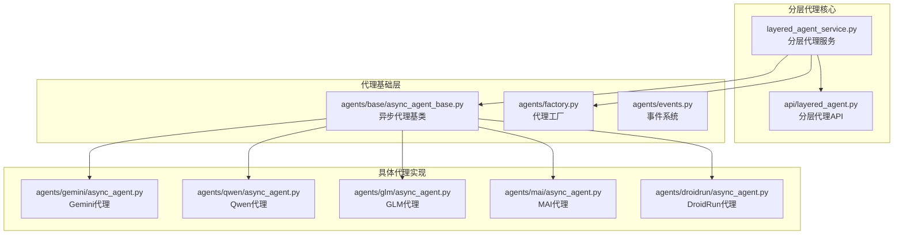
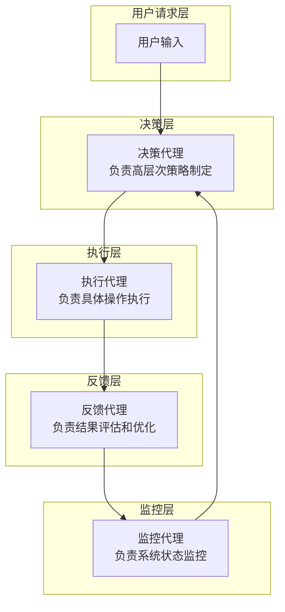
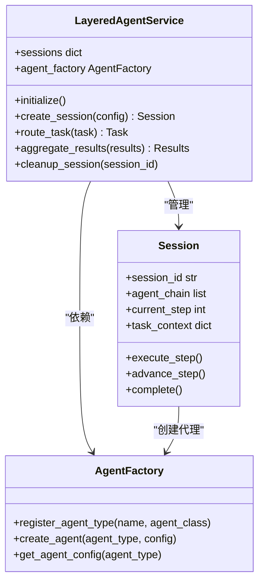
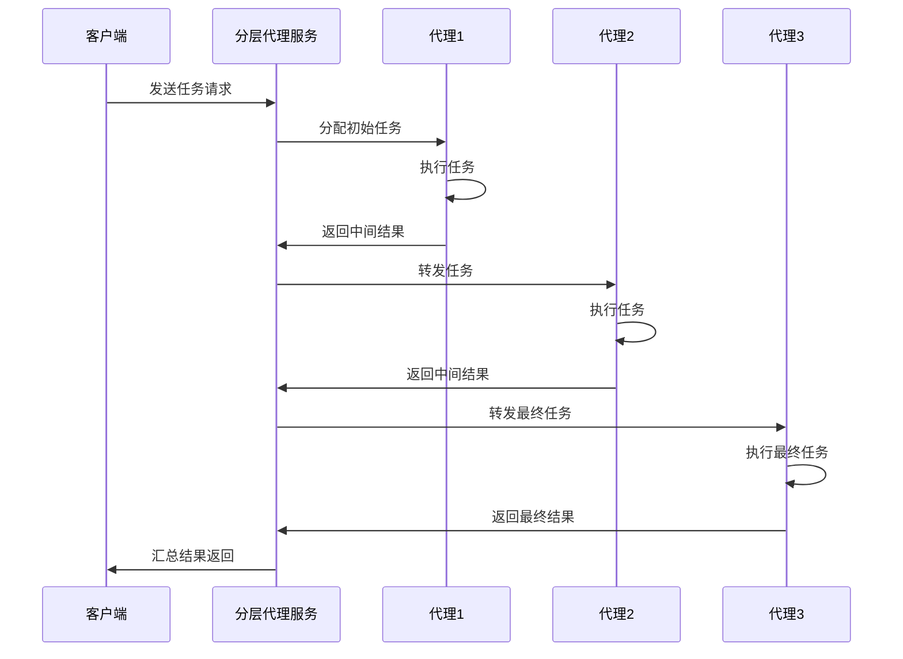
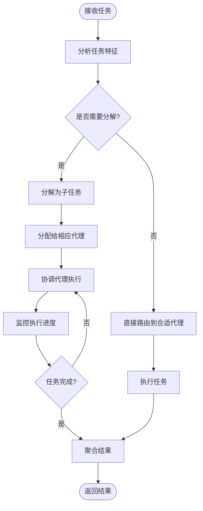
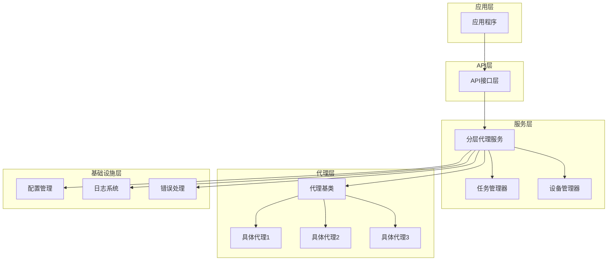

# 分层代理架构

<cite>
**本文档引用的文件**
- [layered_agent_service.py](file://AutoGLM_GUI/layered_agent_service.py)
- [api/layered_agent.py](file://AutoGLM_GUI/api/layered_agent.py)
- [agents/base/async_agent_base.py](file://AutoGLM_GUI/agents/base/async_agent_base.py)
- [agents/factory.py](file://AutoGLM_GUI/agents/factory.py)
- [agents/events.py](file://AutoGLM_GUI/agents/events.py)
- [agents/gemini/async_agent.py](file://AutoGLM_GUI/agents/gemini/async_agent.py)
- [agents/qwen/async_agent.py](file://AutoGLM_GUI/agents/qwen/async_agent.py)
- [agents/glm/async_agent.py](file://AutoGLM_GUI/agents/glm/async_agent.py)
- [agents/mai/async_agent.py](file://AutoGLM_GUI/agents/mai/async_agent.py)
- [agents/droidrun/async_agent.py](file://AutoGLM_GUI/agents/droidrun/async_agent.py)
- [test_layered_agent_session_api.py](file://tests/test_layered_agent_session_api.py)
- [test_layered_max_turns_config.py](file://tests/test_layered_max_turns_config.py)
</cite>

## 目录
1. [引言](#引言)
2. [项目结构](#项目结构)
3. [核心组件](#核心组件)
4. [架构概览](#架构概览)
5. [详细组件分析](#详细组件分析)
6. [依赖关系分析](#依赖关系分析)
7. [性能考虑](#性能考虑)
8. [故障排除指南](#故障排除指南)
9. [结论](#结论)

## 引言

分层代理架构是AutoGLM GUI项目中的一个创新设计，它通过构建多层代理系统来实现复杂的任务处理和决策机制。该架构的核心理念是将复杂任务分解为多个层次，每个层次负责特定类型的决策和执行，通过代理间的协作实现端到端的任务完成。

这种设计模式具有以下优势：
- **模块化设计**：每层代理专注于特定领域知识
- **可扩展性**：可以轻松添加新的代理层级
- **容错性**：单个代理失败不会影响整个系统
- **专业化**：不同层级可以针对特定任务类型优化

## 项目结构

分层代理架构在项目中的组织结构如下：

**图表来源**
- [layered_agent_service.py](file://AutoGLM_GUI/layered_agent_service.py)
- [api/layered_agent.py](file://AutoGLM_GUI/api/layered_agent.py)
- [agents/base/async_agent_base.py](file://AutoGLM_GUI/agents/base/async_agent_base.py)
- [agents/factory.py](file://AutoGLM_GUI/agents/factory.py)

**章节来源**
- [layered_agent_service.py](file://AutoGLM_GUI/layered_agent_service.py)
- [api/layered_agent.py](file://AutoGLM_GUI/api/layered_agent.py)
- [agents/base/async_agent_base.py](file://AutoGLM_GUI/agents/base/async_agent_base.py)

## 核心组件

### 分层代理服务 (Layered Agent Service)

分层代理服务是整个架构的核心控制器，负责管理代理层级的生命周期、任务分配和结果聚合。

**主要职责**：
- 管理代理层级的初始化和配置
- 协调跨层级的任务传递
- 处理代理间的通信和数据交换
- 实现任务的分解和路由
- 提供统一的结果汇总和输出

### 异步代理基类 (Async Agent Base)

所有具体代理实现的基础抽象类，定义了代理的标准接口和行为规范。

**核心特性**：
- 异步执行模型支持
- 标准化的代理生命周期管理
- 统一的错误处理机制
- 代理间通信协议

### 代理工厂 (Agent Factory)

负责创建和管理不同类型的代理实例，提供代理的注册和发现机制。

**功能特性**：
- 动态代理创建
- 代理类型注册
- 代理实例池管理
- 代理配置解析

**章节来源**
- [layered_agent_service.py](file://AutoGLM_GUI/layered_agent_service.py)
- [agents/base/async_agent_base.py](file://AutoGLM_GUI/agents/base/async_agent_base.py)
- [agents/factory.py](file://AutoGLM_GUI/agents/factory.py)

## 架构概览

分层代理架构采用多层决策机制，每一层都有特定的专业能力和职责分工：

**图表来源**
- [layered_agent_service.py](file://AutoGLM_GUI/layered_agent_service.py)
- [agents/base/async_agent_base.py](file://AutoGLM_GUI/agents/base/async_agent_base.py)

### 代理协作模式

分层代理采用多种协作模式来实现复杂的任务处理：

1. **流水线协作**：任务按顺序经过多个代理层级处理
2. **并行协作**：多个代理同时处理相关任务
3. **反馈协作**：代理间通过反馈机制进行信息交换
4. **自适应协作**：根据任务特点动态调整协作方式

## 详细组件分析

### 分层代理服务实现

分层代理服务是整个架构的核心控制器，负责管理代理层级的完整生命周期：

**图表来源**
- [layered_agent_service.py](file://AutoGLM_GUI/layered_agent_service.py)
- [agents/factory.py](file://AutoGLM_GUI/agents/factory.py)

### 代理层级通信机制

代理间的通信采用消息传递和事件驱动的方式：

**图表来源**
- [layered_agent_service.py](file://AutoGLM_GUI/layered_agent_service.py)
- [api/layered_agent.py](file://AutoGLM_GUI/api/layered_agent.py)

### 任务分解与协调策略

分层代理实现了智能的任务分解和协调机制：

**图表来源**
- [layered_agent_service.py](file://AutoGLM_GUI/layered_agent_service.py)
- [agents/base/async_agent_base.py](file://AutoGLM_GUI/agents/base/async_agent_base.py)

**章节来源**
- [layered_agent_service.py](file://AutoGLM_GUI/layered_agent_service.py)
- [api/layered_agent.py](file://AutoGLM_GUI/api/layered_agent.py)

### 具体代理实现分析

#### Gemini代理
Gemini代理专注于高级推理和决策任务，具备强大的语言理解和逻辑分析能力。

#### Qwen代理  
Qwen代理提供多语言支持和广泛的知识覆盖，适用于国际化应用场景。

#### GLM代理
GLM代理专注于中文场景和本地化需求，提供优质的中文理解和生成能力。

#### MAI代理
MAI代理专注于多模态交互和复杂任务处理，支持图像识别和语音处理。

#### DroidRun代理
DroidRun代理专门处理Android设备控制和自动化任务。

**章节来源**
- [agents/gemini/async_agent.py](file://AutoGLM_GUI/agents/gemini/async_agent.py)
- [agents/qwen/async_agent.py](file://AutoGLM_GUI/agents/qwen/async_agent.py)
- [agents/glm/async_agent.py](file://AutoGLM_GUI/agents/glm/async_agent.py)
- [agents/mai/async_agent.py](file://AutoGLM_GUI/agents/mai/async_agent.py)
- [agents/droidrun/async_agent.py](file://AutoGLM_GUI/agents/droidrun/async_agent.py)

## 依赖关系分析

分层代理架构的依赖关系体现了清晰的层次化设计：

**图表来源**
- [layered_agent_service.py](file://AutoGLM_GUI/layered_agent_service.py)
- [agents/base/async_agent_base.py](file://AutoGLM_GUI/agents/base/async_agent_base.py)

**章节来源**
- [layered_agent_service.py](file://AutoGLM_GUI/layered_agent_service.py)
- [agents/base/async_agent_base.py](file://AutoGLM_GUI/agents/base/async_agent_base.py)

## 性能考虑

分层代理架构在设计时充分考虑了性能优化：

### 并行处理优化
- 代理实例池管理，支持并发执行
- 异步任务调度，避免阻塞等待
- 内存缓存机制，减少重复计算

### 资源管理
- 代理生命周期管理，及时释放资源
- 连接池复用，降低连接开销
- 内存使用监控，防止内存泄漏

### 扩展性设计
- 插件化代理架构，支持动态加载
- 配置驱动的代理选择，灵活调整
- 水平扩展支持，多实例部署

## 故障排除指南

### 常见问题及解决方案

**代理初始化失败**
- 检查代理配置参数
- 验证代理依赖项完整性
- 查看代理日志获取详细错误信息

**任务执行超时**
- 检查网络连接状态
- 验证代理服务可用性
- 调整超时配置参数

**内存使用过高**
- 检查代理实例数量
- 验证资源释放机制
- 优化代理配置参数

**章节来源**
- [test_layered_agent_session_api.py](file://tests/test_layered_agent_session_api.py)
- [test_layered_max_turns_config.py](file://tests/test_layered_max_turns_config.py)

## 结论

分层代理架构通过其模块化、可扩展和容错的设计理念，为复杂的任务处理提供了优雅的解决方案。该架构不仅提高了系统的可维护性和可扩展性，还通过代理间的协作实现了智能化的任务处理能力。

### 主要优势
- **模块化设计**：清晰的职责分离和接口定义
- **可扩展性**：支持动态添加新的代理类型和功能
- **容错性**：多层防护和故障隔离机制
- **智能化**：基于任务特征的自适应代理选择

### 适用场景
- 复杂业务流程自动化
- 多模态任务处理
- 实时决策支持系统
- 分布式任务协调

### 发展方向
- 更智能的代理选择算法
- 更高效的资源利用机制
- 更完善的监控和诊断工具
- 更强大的扩展能力