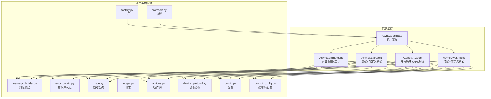
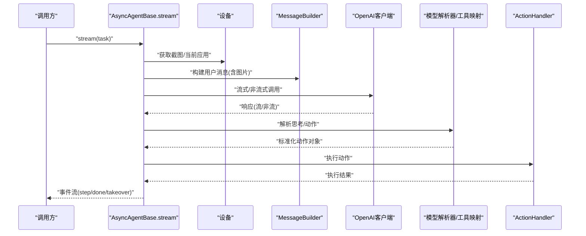
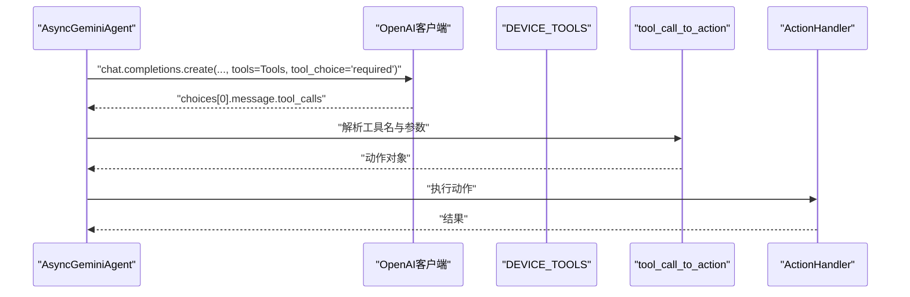
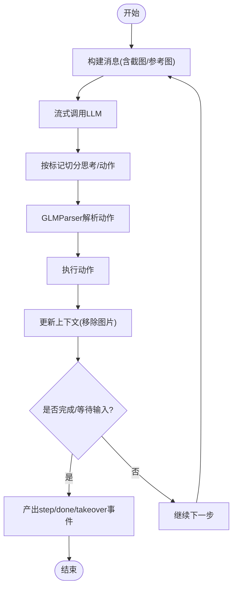
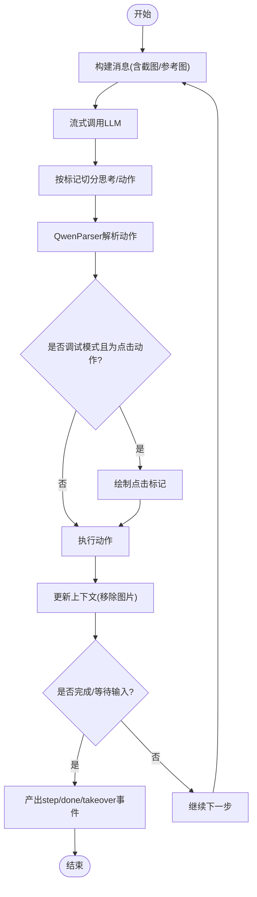
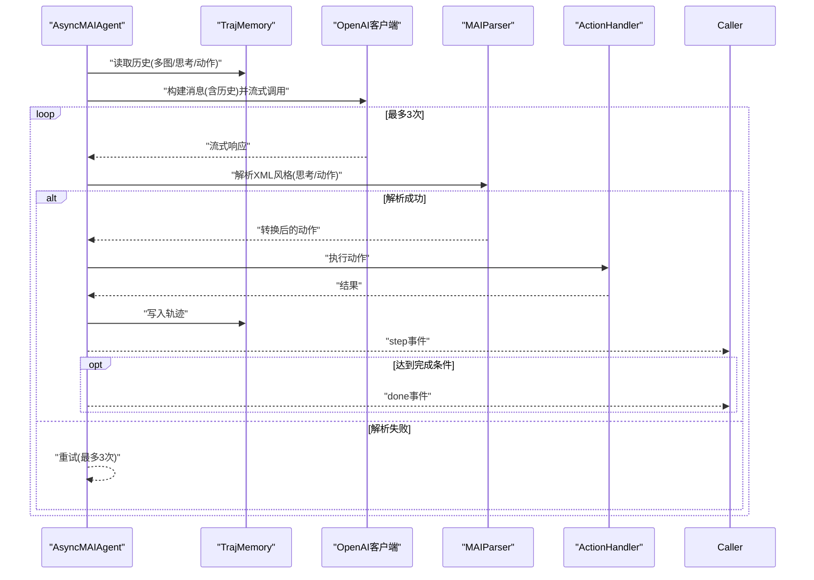
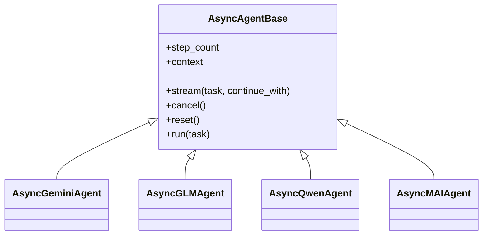

# 多模型适配器

<cite>
**本文引用的文件**
- [agents/gemini/async_agent.py](file://AutoGLM_GUI/agents/gemini/async_agent.py)
- [agents/gemini/action_mapper.py](file://AutoGLM_GUI/agents/gemini/action_mapper.py)
- [agents/gemini/prompts.py](file://AutoGLM_GUI/agents/gemini/prompts.py)
- [agents/gemini/tools.py](file://AutoGLM_GUI/agents/gemini/tools.py)
- [agents/glm/async_agent.py](file://AutoGLM_GUI/agents/glm/async_agent.py)
- [agents/glm/parser.py](file://AutoGLM_GUI/agents/glm/parser.py)
- [agents/qwen/async_agent.py](file://AutoGLM_GUI/agents/qwen/async_agent.py)
- [agents/qwen/parser.py](file://AutoGLM_GUI/agents/qwen/parser.py)
- [agents/qwen/prompts_en.py](file://AutoGLM_GUI/agents/qwen/prompts_en.py)
- [agents/qwen/prompts_zh.py](file://AutoGLM_GUI/agents/qwen/prompts_zh.py)
- [agents/mai/async_agent.py](file://AutoGLM_GUI/agents/mai/async_agent.py)
- [agents/mai/parser.py](file://AutoGLM_GUI/agents/mai/parser.py)
- [agents/mai/traj_memory.py](file://AutoGLM_GUI/agents/mai/traj_memory.py)
- [agents/base/async_agent_base.py](file://AutoGLM_GUI/agents/base/async_agent_base.py)
- [agents/factory.py](file://AutoGLM_GUI/agents/factory.py)
- [agents/protocols.py](file://AutoGLM_GUI/agents/protocols.py)
- [model/message_builder.py](file://AutoGLM_GUI/model/message_builder.py)
- [model/error_details.py](file://AutoGLM_GUI/model/error_details.py)
- [config.py](file://AutoGLM_GUI/config.py)
- [prompt_config.py](file://AutoGLM_GUI/prompt_config.py)
- [logger.py](file://AutoGLM_GUI/logger.py)
- [trace.py](file://AutoGLM_GUI/trace.py)
- [actions.py](file://AutoGLM_GUI/actions.py)
- [device_protocol.py](file://AutoGLM_GUI/device_protocol.py)
</cite>

## 目录
1. [引言](#引言)
2. [项目结构](#项目结构)
3. [核心组件](#核心组件)
4. [架构总览](#架构总览)
5. [详细组件分析](#详细组件分析)
6. [依赖关系分析](#依赖关系分析)
7. [性能与资源考量](#性能与资源考量)
8. [故障排查指南](#故障排查指南)
9. [结论](#结论)
10. [附录](#附录)

## 引言
本文件面向“多模型适配器”模块，系统梳理 GLM、Gemini、Qwen、MAI 等不同 AI 模型的适配器实现，解释其统一接口设计、模型特定集成方式、参数映射规则、响应解析机制与错误处理策略，并结合实际代码路径给出可操作的配置与使用建议。目标是帮助初学者快速上手，同时为有经验的开发者提供足够的技术深度。

## 项目结构
多模型适配器位于 AutoGLM_GUI/agents 下，按模型拆分目录，每个模型适配器均继承自统一的异步基类，复用设备交互、消息构建、错误序列化、追踪埋点等通用能力；同时通过各自的解析器与提示词策略实现差异化行为。

图表来源
- [agents/base/async_agent_base.py:32-109](file://AutoGLM_GUI/agents/base/async_agent_base.py#L32-L109)
- [agents/gemini/async_agent.py:29-453](file://AutoGLM_GUI/agents/gemini/async_agent.py#L29-L453)
- [agents/glm/async_agent.py:40-428](file://AutoGLM_GUI/agents/glm/async_agent.py#L40-L428)
- [agents/qwen/async_agent.py:49-463](file://AutoGLM_GUI/agents/qwen/async_agent.py#L49-L463)
- [agents/mai/async_agent.py:34-431](file://AutoGLM_GUI/agents/mai/async_agent.py#L34-L431)
- [agents/factory.py](file://AutoGLM_GUI/agents/factory.py)
- [agents/protocols.py](file://AutoGLM_GUI/agents/protocols.py)
- [model/message_builder.py](file://AutoGLM_GUI/model/message_builder.py)
- [model/error_details.py](file://AutoGLM_GUI/model/error_details.py)
- [trace.py](file://AutoGLM_GUI/trace.py)
- [logger.py](file://AutoGLM_GUI/logger.py)
- [actions.py](file://AutoGLM_GUI/actions.py)
- [device_protocol.py](file://AutoGLM_GUI/device_protocol.py)
- [config.py](file://AutoGLM_GUI/config.py)
- [prompt_config.py](file://AutoGLM_GUI/prompt_config.py)

章节来源
- [agents/base/async_agent_base.py:1-439](file://AutoGLM_GUI/agents/base/async_agent_base.py#L1-L439)
- [agents/factory.py](file://AutoGLM_GUI/agents/factory.py)
- [agents/protocols.py](file://AutoGLM_GUI/agents/protocols.py)

## 核心组件
- 统一基类 AsyncAgentBase：封装 OpenAI 客户端初始化、设备与动作处理器注入、流式主循环、取消/重置、运行限制与看门狗、事件产出等通用逻辑。
- 模型适配器：
  - Gemini：通过 OpenAI 兼容 API 使用函数调用（tool call），直接解析工具名与参数，无需自定义格式。
  - GLM/Qwen：采用流式输出，按预设标记切分“思考”与“动作”，再由各自解析器转为标准动作对象。
  - MAI：维护多图历史上下文，带自动重试与 XML 风格思考/动作解析。
- 工厂与协议：根据配置选择具体适配器类型，确保外部调用一致。

章节来源
- [agents/base/async_agent_base.py:32-109](file://AutoGLM_GUI/agents/base/async_agent_base.py#L32-L109)
- [agents/gemini/async_agent.py:29-453](file://AutoGLM_GUI/agents/gemini/async_agent.py#L29-L453)
- [agents/glm/async_agent.py:40-428](file://AutoGLM_GUI/agents/glm/async_agent.py#L40-L428)
- [agents/qwen/async_agent.py:49-463](file://AutoGLM_GUI/agents/qwen/async_agent.py#L49-L463)
- [agents/mai/async_agent.py:34-431](file://AutoGLM_GUI/agents/mai/async_agent.py#L34-L431)

## 架构总览
下图展示从任务输入到动作执行的统一流程，以及各模型适配器的关键差异点。

图表来源
- [agents/base/async_agent_base.py:112-396](file://AutoGLM_GUI/agents/base/async_agent_base.py#L112-L396)
- [model/message_builder.py](file://AutoGLM_GUI/model/message_builder.py)
- [actions.py](file://AutoGLM_GUI/actions.py)

## 详细组件分析

### Gemini 适配器（函数调用 + 工具）
- 统一接口：继承 AsyncAgentBase，实现 _get_default_system_prompt/_prepare_initial_context/_execute_step。
- 关键差异：
  - 使用 OpenAI 兼容 API 的 tool 能力，要求服务端支持 function calling。
  - 解析阶段直接从 tool_calls 中提取函数名与 JSON 参数，不依赖自定义格式。
  - 对无效工具调用进行计数与限次保护，超过阈值则终止。
- 参数映射与提示词：
  - 通过 prompts 模块提供系统提示词；工具集合由 tools 模块集中定义，action_mapper 将工具名映射为内部动作。
- 错误处理：
  - LLM 调用异常通过 error_details 序列化并回传；设备采集异常直接产出错误事件。
- 性能与稳定性：
  - 无流式解析负担，但需确保上游支持工具调用；对连续无效工具调用有限制，避免死循环。

图表来源
- [agents/gemini/async_agent.py:70-345](file://AutoGLM_GUI/agents/gemini/async_agent.py#L70-L345)
- [agents/gemini/action_mapper.py](file://AutoGLM_GUI/agents/gemini/action_mapper.py)
- [agents/gemini/tools.py](file://AutoGLM_GUI/agents/gemini/tools.py)
- [agents/gemini/prompts.py](file://AutoGLM_GUI/agents/gemini/prompts.py)

章节来源
- [agents/gemini/async_agent.py:29-453](file://AutoGLM_GUI/agents/gemini/async_agent.py#L29-L453)
- [agents/gemini/action_mapper.py](file://AutoGLM_GUI/agents/gemini/action_mapper.py)
- [agents/gemini/tools.py](file://AutoGLM_GUI/agents/gemini/tools.py)
- [agents/gemini/prompts.py](file://AutoGLM_GUI/agents/gemini/prompts.py)

### GLM 适配器（流式 + 自定义格式）
- 统一接口：继承 AsyncAgentBase，实现 _get_default_system_prompt/_prepare_initial_context/_execute_step。
- 关键差异：
  - 通过流式输出逐步拼接“思考”片段，遇到预设标记后进入“动作”阶段。
  - 使用 GLMParser 解析“<think>...<answer>...”或“do(...) / finish(...)”等格式。
  - 首步消息合并任务与参考图，后续每步仅附加当前截图。
- 参数映射与提示词：
  - 系统提示词来自 prompt_config；消息构建通过 MessageBuilder。
- 错误处理：
  - LLM 异常序列化；解析失败时按“完成”处理，避免阻塞。
- 用户交互：
  - 当动作类型为 Take_over/Interact 时，产出等待输入事件，支持接管。

图表来源
- [agents/glm/async_agent.py:81-339](file://AutoGLM_GUI/agents/glm/async_agent.py#L81-L339)
- [agents/glm/parser.py](file://AutoGLM_GUI/agents/glm/parser.py)
- [prompt_config.py](file://AutoGLM_GUI/prompt_config.py)

章节来源
- [agents/glm/async_agent.py:40-428](file://AutoGLM_GUI/agents/glm/async_agent.py#L40-L428)
- [agents/glm/parser.py](file://AutoGLM_GUI/agents/glm/parser.py)
- [prompt_config.py](file://AutoGLM_GUI/prompt_config.py)

### Qwen 适配器（流式 + 自定义格式）
- 统一接口：继承 AsyncAgentBase，实现 _get_default_system_prompt/_prepare_initial_context/_execute_step。
- 关键差异：
  - 类似 GLM 的流式解析，但标记与格式略有不同，解析器为 QwenParser。
  - 首步支持任务与参考图；提供点击位置可视化调试（在 verbose 模式下绘制红点）。
- 参数映射与提示词：
  - 系统提示词按语言选择 EN/ZH；消息构建通过 MessageBuilder。
- 错误处理：
  - LLM 异常直接回传；解析失败按“完成”处理。
- 用户交互：
  - 同样支持 Take_over/Interact 的接管流程。

图表来源
- [agents/qwen/async_agent.py:131-398](file://AutoGLM_GUI/agents/qwen/async_agent.py#L131-L398)
- [agents/qwen/parser.py](file://AutoGLM_GUI/agents/qwen/parser.py)
- [agents/qwen/prompts_en.py](file://AutoGLM_GUI/agents/qwen/prompts_en.py)
- [agents/qwen/prompts_zh.py](file://AutoGLM_GUI/agents/qwen/prompts_zh.py)

章节来源
- [agents/qwen/async_agent.py:49-463](file://AutoGLM_GUI/agents/qwen/async_agent.py#L49-L463)
- [agents/qwen/parser.py](file://AutoGLM_GUI/agents/qwen/parser.py)
- [agents/qwen/prompts_en.py](file://AutoGLM_GUI/agents/qwen/prompts_en.py)
- [agents/qwen/prompts_zh.py](file://AutoGLM_GUI/agents/qwen/prompts_zh.py)

### MAI 适配器（多图历史 + XML 解析 + 自动重试）
- 统一接口：继承 AsyncAgentBase，实现 _get_default_system_prompt/_prepare_initial_context/_execute_step。
- 关键差异：
  - 不使用基类的累积上下文，而是通过 TrajMemory 在每步动态重建包含多图历史的消息列表。
  - 使用 MAIParser 解析 XML 风格的思考/动作；失败时自动重试最多 3 次。
  - 采用“999 坐标系”归一化，便于跨分辨率设备。
- 参数映射与提示词：
  - 系统提示词为移动端专用；消息构建通过 MessageBuilder。
- 错误处理：
  - 解析/模型异常均会重试；达到上限仍未成功则终止并回传错误。
- 用户交互：
  - 支持 Take_over/Interact 的接管流程。

图表来源
- [agents/mai/async_agent.py:80-318](file://AutoGLM_GUI/agents/mai/async_agent.py#L80-L318)
- [agents/mai/parser.py](file://AutoGLM_GUI/agents/mai/parser.py)
- [agents/mai/traj_memory.py](file://AutoGLM_GUI/agents/mai/traj_memory.py)

章节来源
- [agents/mai/async_agent.py:34-431](file://AutoGLM_GUI/agents/mai/async_agent.py#L34-L431)
- [agents/mai/parser.py](file://AutoGLM_GUI/agents/mai/parser.py)
- [agents/mai/traj_memory.py](file://AutoGLM_GUI/agents/mai/traj_memory.py)

### 统一基类与工厂/协议
- AsyncAgentBase：
  - 提供 OpenAI 客户端、ActionHandler、设备协议注入；统一的流式主循环、取消/重置、运行限制与看门狗。
  - 产出事件类型：error、thinking、step、done、takeover、cancelled。
- 工厂与协议：
  - 工厂根据配置选择具体适配器类型；协议定义对外暴露的接口契约，确保替换模型时无需修改上层调用。

章节来源
- [agents/base/async_agent_base.py:32-439](file://AutoGLM_GUI/agents/base/async_agent_base.py#L32-L439)
- [agents/factory.py](file://AutoGLM_GUI/agents/factory.py)
- [agents/protocols.py](file://AutoGLM_GUI/agents/protocols.py)

## 依赖关系分析

图表来源
- [agents/base/async_agent_base.py:32-109](file://AutoGLM_GUI/agents/base/async_agent_base.py#L32-L109)
- [agents/gemini/async_agent.py:29-453](file://AutoGLM_GUI/agents/gemini/async_agent.py#L29-L453)
- [agents/glm/async_agent.py:40-428](file://AutoGLM_GUI/agents/glm/async_agent.py#L40-L428)
- [agents/qwen/async_agent.py:49-463](file://AutoGLM_GUI/agents/qwen/async_agent.py#L49-L463)
- [agents/mai/async_agent.py:34-431](file://AutoGLM_GUI/agents/mai/async_agent.py#L34-L431)

章节来源
- [agents/base/async_agent_base.py:32-109](file://AutoGLM_GUI/agents/base/async_agent_base.py#L32-L109)
- [agents/gemini/async_agent.py:29-453](file://AutoGLM_GUI/agents/gemini/async_agent.py#L29-L453)
- [agents/glm/async_agent.py:40-428](file://AutoGLM_GUI/agents/glm/async_agent.py#L40-L428)
- [agents/qwen/async_agent.py:49-463](file://AutoGLM_GUI/agents/qwen/async_agent.py#L49-L463)
- [agents/mai/async_agent.py:34-431](file://AutoGLM_GUI/agents/mai/async_agent.py#L34-L431)

## 性能与资源考量
- 流式 vs 非流式：
  - GLM/Qwen/MAI 采用流式输出，可边生成边解析，降低首字延迟；Gemini 依赖工具调用，通常无需流式解析。
- 图像处理与上下文长度：
  - MAI 支持多图历史，消息长度随步数增长；GLM/Qwen/MAI 在每步都会清理历史图片，仅保留当前截图，控制上下文大小。
- 取消与看门狗：
  - 基类提供取消事件与重复动作/无进展看门狗，防止长时间无效循环。
- 超时与重试：
  - OpenAI 客户端默认超时；MAI 在解析失败时自动重试最多 3 次；Gemini 对无效工具调用进行限次保护。

章节来源
- [agents/base/async_agent_base.py:28-439](file://AutoGLM_GUI/agents/base/async_agent_base.py#L28-L439)
- [agents/mai/async_agent.py:136-232](file://AutoGLM_GUI/agents/mai/async_agent.py#L136-L232)
- [agents/gemini/async_agent.py:32-41](file://AutoGLM_GUI/agents/gemini/async_agent.py#L32-L41)

## 故障排查指南
- 设备采集异常：
  - 截图/当前应用获取失败会直接产出错误事件并终止；检查设备连接与权限。
- LLM 调用异常：
  - 使用 error_details 序列化错误信息，包含模型名称、消息数量、错误类型等；根据错误详情定位上游问题。
- 解析失败：
  - GLM/Qwen/MAI 在解析失败时通常按“完成”处理；Gemini 对无效工具调用进行限次保护，超过阈值会终止。
- 超时与取消：
  - 基类内置取消事件；如出现长时间无响应，检查网络与上游服务状态。
- 日志与追踪：
  - 使用 trace_span 包裹关键步骤，便于定位耗时与错误来源；开启 verbose 模式可获得更详细的中间结果。

章节来源
- [agents/gemini/async_agent.py:153-181](file://AutoGLM_GUI/agents/gemini/async_agent.py#L153-L181)
- [agents/glm/async_agent.py:213-239](file://AutoGLM_GUI/agents/glm/async_agent.py#L213-L239)
- [agents/qwen/async_agent.py:255-271](file://AutoGLM_GUI/agents/qwen/async_agent.py#L255-L271)
- [agents/mai/async_agent.py:193-231](file://AutoGLM_GUI/agents/mai/async_agent.py#L193-L231)
- [model/error_details.py](file://AutoGLM_GUI/model/error_details.py)
- [trace.py](file://AutoGLM_GUI/trace.py)

## 结论
多模型适配器通过统一基类与工厂/协议，实现了对 GLM、Gemini、Qwen、MAI 等模型的灵活接入。各模型在消息构建、响应解析与错误处理上各有侧重：Gemini 依赖工具调用，GLM/Qwen 采用流式自定义格式，MAI 则引入多图历史与自动重试。统一的事件流与追踪埋点为调试与优化提供了坚实基础。

## 附录

### 配置与使用要点
- 连接配置：
  - 通过 ModelConfig 提供 base_url 与 api_key；AgentConfig 控制温度、top_p、频率惩罚、最大 tokens、语言、系统提示词等。
- API 密钥管理：
  - 建议通过环境变量或安全配置中心注入，避免硬编码。
- 网络超时与重试：
  - OpenAI 客户端默认超时已设定；如需调整可在基类初始化处扩展。
- 版本兼容性：
  - Gemini 依赖工具调用；GLM/Qwen/MAI 依赖流式输出；确保上游服务端支持相应能力。
- 模型切换：
  - 通过工厂按配置选择适配器类型，保持上层调用一致。

章节来源
- [config.py](file://AutoGLM_GUI/config.py)
- [agents/base/async_agent_base.py:53-57](file://AutoGLM_GUI/agents/base/async_agent_base.py#L53-L57)
- [agents/factory.py](file://AutoGLM_GUI/agents/factory.py)
- [agents/protocols.py](file://AutoGLM_GUI/agents/protocols.py)