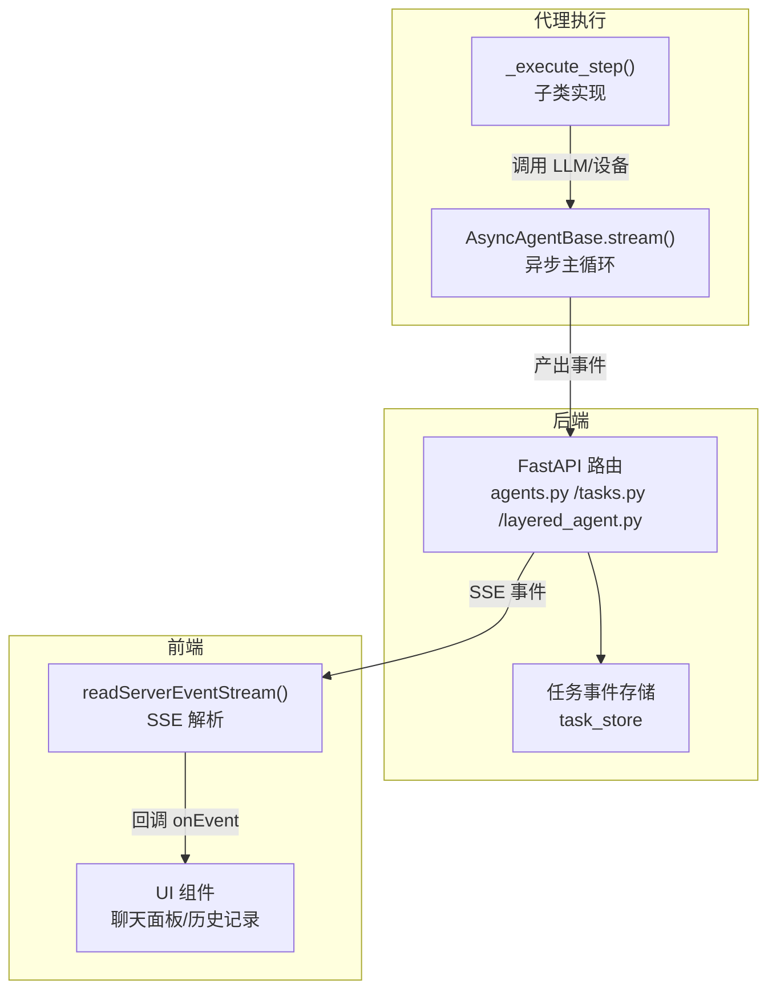
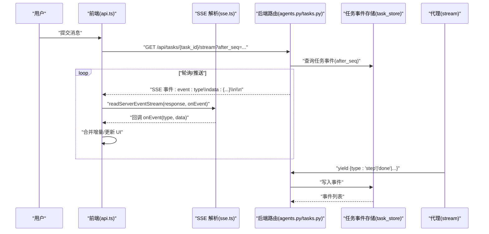
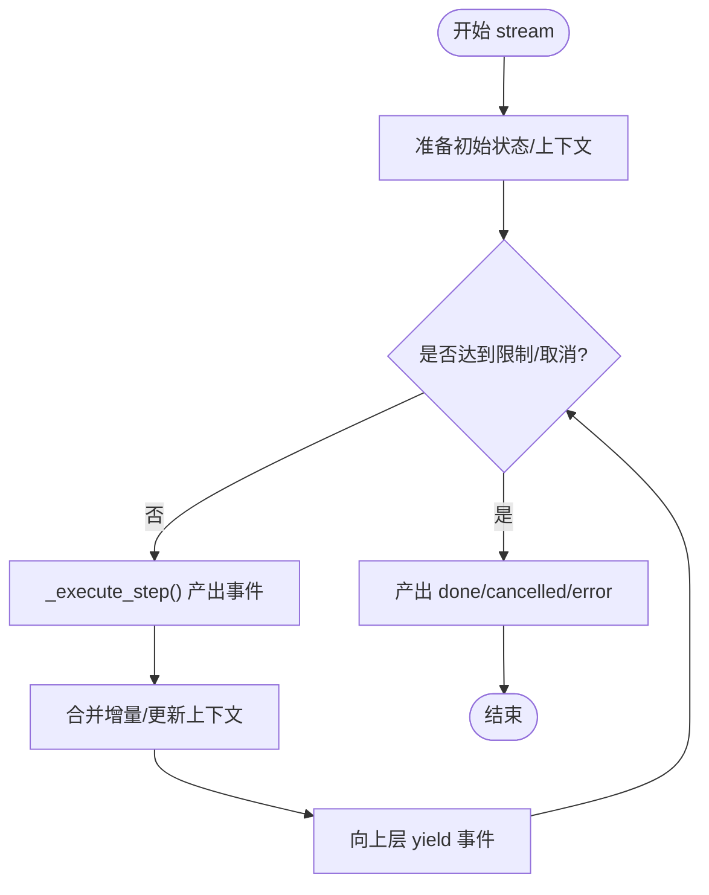
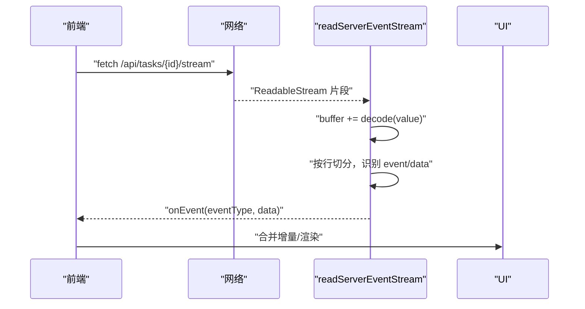
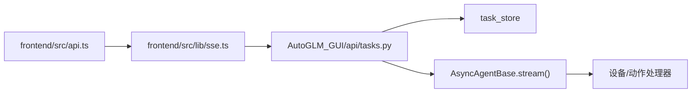

# 流式响应处理

<cite>
**本文引用的文件**
- [async_agent_base.py](file://AutoGLM_GUI/agents/base/async_agent_base.py)
- [agents.py](file://AutoGLM_GUI/api/agents.py)
- [tasks.py](file://AutoGLM_GUI/api/tasks.py)
- [layered_agent.py](file://AutoGLM_GUI/api/layered_agent.py)
- [sse.ts](file://frontend/src/lib/sse.ts)
- [api.ts](file://frontend/src/api.ts)
- [test_agents_chat_config_api.py](file://tests/test_agents_chat_config_api.py)
- [test_agent_adapter_coverage.py](file://tests/test_agent_adapter_coverage.py)
- [test_interaction_actions.py](file://tests/test_interaction_actions.py)
</cite>

## 目录
1. [简介](#简介)
2. [项目结构](#项目结构)
3. [核心组件](#核心组件)
4. [架构总览](#架构总览)
5. [组件详解](#组件详解)
6. [依赖关系分析](#依赖关系分析)
7. [性能与稳定性考量](#性能与稳定性考量)
8. [故障排查指南](#故障排查指南)
9. [结论](#结论)
10. [附录](#附录)

## 简介
本文件系统化阐述本项目的“流式响应处理”能力，覆盖从后端事件生成、SSE 推送、前端解析到 UI 实时更新的全链路。重点包括：
- 流式事件的接收机制与实时处理流程
- 增量输出的解析与合并策略
- 实时进度反馈与错误处理
- 取消与中断控制
- 性能优化、内存管理与网络稳定性
- 断线重连与数据完整性校验思路

## 项目结构
围绕流式响应的关键路径由三部分组成：
- 后端 API 层：负责将任务事件转换为标准 SSE 输出
- 代理执行层：负责产生“思考/步骤/完成/取消/错误”等事件
- 前端 SSE 解析层：负责按行解析事件、合并增量、驱动 UI 更新

图表来源
- [agents.py:85-128](file://AutoGLM_GUI/api/agents.py#L85-L128)
- [tasks.py:300-341](file://AutoGLM_GUI/api/tasks.py#L300-L341)
- [layered_agent.py:125-147](file://AutoGLM_GUI/api/layered_agent.py#L125-L147)
- [async_agent_base.py:112-401](file://AutoGLM_GUI/agents/base/async_agent_base.py#L112-L401)
- [sse.ts:16-56](file://frontend/src/lib/sse.ts#L16-L56)

章节来源
- [agents.py:85-128](file://AutoGLM_GUI/api/agents.py#L85-L128)
- [tasks.py:300-341](file://AutoGLM_GUI/api/tasks.py#L300-L341)
- [layered_agent.py:125-147](file://AutoGLM_GUI/api/layered_agent.py#L125-L147)
- [async_agent_base.py:112-401](file://AutoGLM_GUI/agents/base/async_agent_base.py#L112-L401)
- [sse.ts:16-56](file://frontend/src/lib/sse.ts#L16-L56)

## 核心组件
- 后端 SSE 路由
  - /api/chat/stream：兼容旧版聊天流，基于任务事件存储输出 SSE
  - /api/tasks/{task_id}/stream：直接输出指定任务的事件流
  - /api/layered-agent/stream：分层代理任务事件流
- 代理执行器
  - AsyncAgentBase.stream()：统一的异步主循环，产出标准化事件
  - _execute_step()：子类实现每步执行（可多次 yield）
- 前端 SSE 解析
  - readServerEventStream()：逐行解析 event/data 行，触发回调
  - api.ts 中的流式订阅与错误处理

章节来源
- [agents.py:85-128](file://AutoGLM_GUI/api/agents.py#L85-L128)
- [tasks.py:300-341](file://AutoGLM_GUI/api/tasks.py#L300-L341)
- [layered_agent.py:125-147](file://AutoGLM_GUI/api/layered_agent.py#L125-L147)
- [async_agent_base.py:112-401](file://AutoGLM_GUI/agents/base/async_agent_base.py#L112-L401)
- [sse.ts:16-56](file://frontend/src/lib/sse.ts#L16-L56)
- [api.ts:1112-1141](file://frontend/src/api.ts#L1112-L1141)

## 架构总览
下图展示了从“发送消息”到“UI 实时更新”的端到端序列：

图表来源
- [tasks.py:300-341](file://AutoGLM_GUI/api/tasks.py#L300-L341)
- [agents.py:85-128](file://AutoGLM_GUI/api/agents.py#L85-L128)
- [sse.ts:16-56](file://frontend/src/lib/sse.ts#L16-L56)
- [api.ts:1112-1141](file://frontend/src/api.ts#L1112-L1141)

## 组件详解

### 后端 SSE 路由与事件生成
- /api/chat/stream
  - 将聊天请求转为任务，再通过任务事件存储以 SSE 形式输出
  - 使用“event: 类型”和“data: JSON”行进行事件编码
- /api/tasks/{task_id}/stream
  - 基于 after_seq 分页拉取事件，避免重复与遗漏
  - 对内部事件类型进行过滤，仅对外暴露公共事件
- /api/layered-agent/stream
  - 适配分层代理的事件负载，保持与通用事件格式一致

章节来源
- [agents.py:85-128](file://AutoGLM_GUI/api/agents.py#L85-L128)
- [tasks.py:300-341](file://AutoGLM_GUI/api/tasks.py#L300-L341)
- [layered_agent.py:125-147](file://AutoGLM_GUI/api/layered_agent.py#L125-L147)

### 代理执行与事件产出
- AsyncAgentBase.stream()
  - 统一的异步主循环，支持取消、上限控制（步数/时长）、看门狗检测
  - 在每步执行前、后、完成、取消、错误等节点产出标准化事件
  - 事件类型包括 step、done、cancelled、error、takeover 等
- _execute_step()
  - 子类实现，可多次 yield，用于表达“思考/中间结果/动作”等阶段
  - 事件数据中可携带“thinking/step/action/finished/success/message”等字段

图表来源
- [async_agent_base.py:112-401](file://AutoGLM_GUI/agents/base/async_agent_base.py#L112-L401)

章节来源
- [async_agent_base.py:112-401](file://AutoGLM_GUI/agents/base/async_agent_base.py#L112-L401)

### 前端 SSE 解析与 UI 更新
- readServerEventStream()
  - 逐行解析 event/data 行，维护 eventType 与缓冲区
  - 对 data 行进行 JSON 解析，异常时记录错误并继续
- api.ts 中的流式订阅
  - 通过 fetch + readServerEventStream 订阅 SSE
  - 支持 AbortController 中止请求
  - onEvent 回调中合并事件数据并更新 UI

图表来源
- [sse.ts:16-56](file://frontend/src/lib/sse.ts#L16-L56)
- [api.ts:1112-1141](file://frontend/src/api.ts#L1112-L1141)

章节来源
- [sse.ts:16-56](file://frontend/src/lib/sse.ts#L16-L56)
- [api.ts:1112-1141](file://frontend/src/api.ts#L1112-L1141)

### 增量输出与事件合并策略
- 事件类型与语义
  - step：单步执行，可包含 thinking、action、finished、success 等
  - done：任务完成，包含 message、steps、success、stop_reason
  - cancelled/error/takeover：终止/错误/接管信号
- 前端合并建议
  - 对于“thinking/step”等中间态，采用“追加/替换”策略，避免闪烁
  - 对于“done”，停止增量更新并进入最终态
  - 对于“error/cancelled/takeover”，清理增量并提示用户

章节来源
- [async_agent_base.py:228-295](file://AutoGLM_GUI/agents/base/async_agent_base.py#L228-L295)
- [agents.py:31-36](file://AutoGLM_GUI/api/agents.py#L31-L36)
- [tasks.py:317-324](file://AutoGLM_GUI/api/tasks.py#L317-L324)

### 实时进度反馈与取消控制
- 进度反馈
  - 通过 step 事件中的“thinking/step/action”等字段驱动 UI 进度
  - done 事件提供最终总结与步骤计数
- 取消控制
  - 前端通过 AbortController 中止请求
  - 后端路由在任务完成后自然结束
  - 代理侧通过 asyncio.CancelledError 传播取消信号

章节来源
- [api.ts:1138-1141](file://frontend/src/api.ts#L1138-L1141)
- [async_agent_base.py:381-396](file://AutoGLM_GUI/agents/base/async_agent_base.py#L381-L396)
- [agents.py:180-200](file://AutoGLM_GUI/api/agents.py#L180-L200)

### 断线重连与数据完整性
- 断线重连
  - 前端基于 after_seq 参数续传，避免重复与遗漏
  - SSE 采用 keep-alive 头，后端轮询拉取事件
- 数据完整性
  - 事件行以空行结尾，保证边界清晰
  - 服务端对内部事件过滤，仅对外暴露公共事件

章节来源
- [tasks.py:309-331](file://AutoGLM_GUI/api/tasks.py#L309-L331)
- [agents.py:103-118](file://AutoGLM_GUI/api/agents.py#L103-L118)

## 依赖关系分析
- 后端依赖
  - FastAPI 路由依赖任务事件存储（task_store）进行事件持久化与查询
  - 代理执行依赖设备协议与动作处理器，产出事件写入存储
- 前端依赖
  - axios/redaxios 作为 HTTP 客户端
  - 自定义 SSE 解析器负责事件行解析与错误处理

图表来源
- [api.ts:1112-1141](file://frontend/src/api.ts#L1112-L1141)
- [sse.ts:16-56](file://frontend/src/lib/sse.ts#L16-L56)
- [tasks.py:300-341](file://AutoGLM_GUI/api/tasks.py#L300-L341)
- [async_agent_base.py:112-401](file://AutoGLM_GUI/agents/base/async_agent_base.py#L112-L401)

## 性能与稳定性考量
- 后端
  - 使用 asyncio.to_thread 将阻塞操作（查询事件存储）移出主线程
  - SSE 响应头设置“no-cache/keep-alive/X-Accel-Buffering=no”以降低缓存与缓冲影响
  - 轮询间隔 0.2 秒，平衡延迟与资源占用
- 前端
  - 使用 AbortController 控制长连接生命周期
  - SSE 解析器按行解码，避免一次性大块解析带来的卡顿
- 代理执行
  - 限制步数/时长与看门狗检测，防止无限循环
  - 事件粒度细，便于前端增量渲染

章节来源
- [agents.py:120-128](file://AutoGLM_GUI/api/agents.py#L120-L128)
- [tasks.py:333-341](file://AutoGLM_GUI/api/tasks.py#L333-L341)
- [async_agent_base.py:201-380](file://AutoGLM_GUI/agents/base/async_agent_base.py#L201-L380)

## 故障排查指南
- 常见问题与定位
  - SSE 内容类型不符：确认后端返回 content-type 为 text/event-stream
  - 事件缺失：检查 after_seq 参数与事件过滤逻辑
  - 解析异常：查看前端控制台错误日志，定位 JSON 解析失败的 data 行
  - 取消无效：确认前端 AbortController 是否正确关闭，后端是否捕获取消
- 关键测试参考
  - SSE 事件类型与内容断言
  - 错误事件与初始化失败场景
  - 取消与取消事件行为

章节来源
- [test_agents_chat_config_api.py:431-473](file://tests/test_agents_chat_config_api.py#L431-L473)
- [test_agents_chat_config_api.py:472-506](file://tests/test_agents_chat_config_api.py#L472-L506)
- [test_agent_adapter_coverage.py:402-739](file://tests/test_agent_adapter_coverage.py#L402-L739)
- [test_interaction_actions.py:394-432](file://tests/test_interaction_actions.py#L394-L432)

## 结论
本项目通过“任务事件存储 + SSE 输出 + 前端增量解析”的架构，实现了稳定、可控、可观测的流式响应能力。后端提供统一的事件生成与过滤，代理层提供细粒度的事件产出，前端提供可靠的增量渲染与错误处理。配合取消控制、看门狗与轮询策略，整体具备良好的性能与可靠性。

## 附录

### 事件类型与字段速查
- step
  - 字段示例：thinking、action、finished、success、message、step
- done
  - 字段示例：message、steps、success、stop_reason
- cancelled
  - 字段示例：message、stop_reason
- error
  - 字段示例：message
- takeover
  - 字段示例：message、steps、success、stop_reason

章节来源
- [async_agent_base.py:228-295](file://AutoGLM_GUI/agents/base/async_agent_base.py#L228-L295)
- [agents.py:31-36](file://AutoGLM_GUI/api/agents.py#L31-L36)