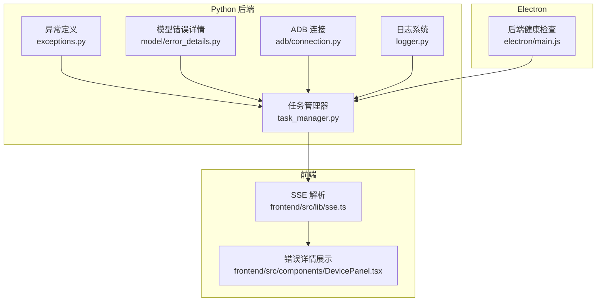
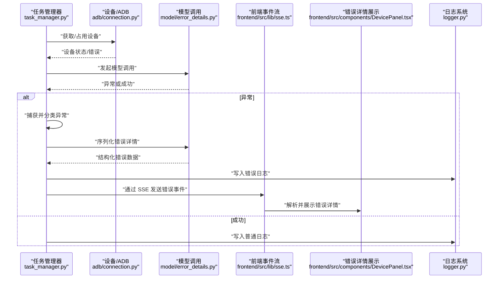
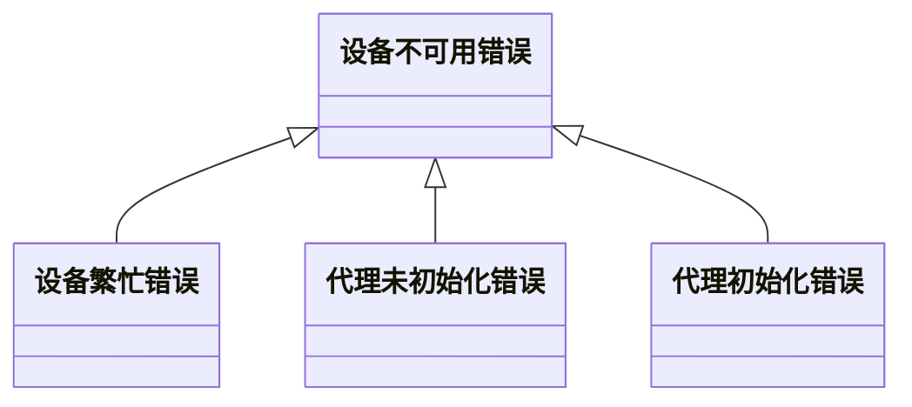
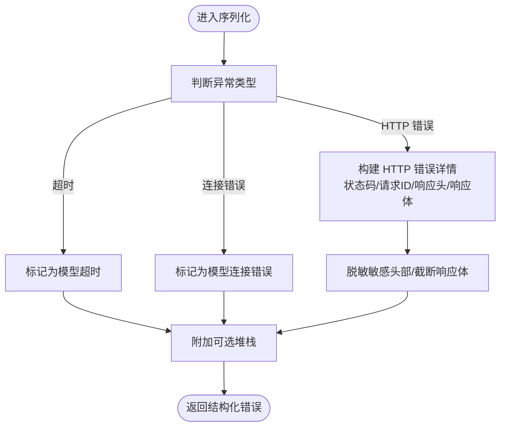
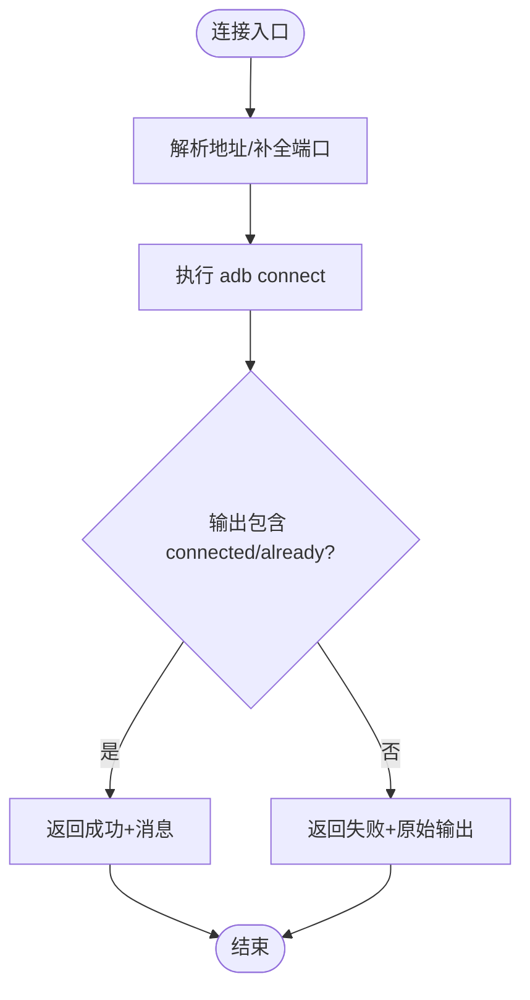
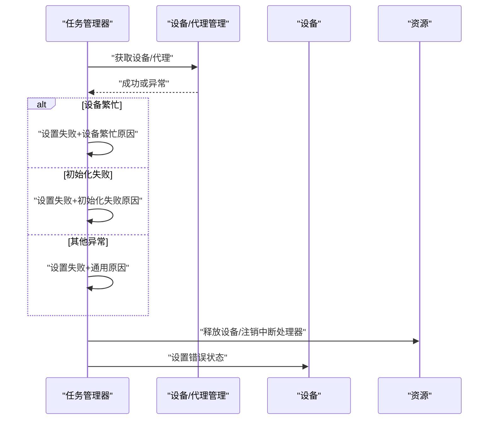
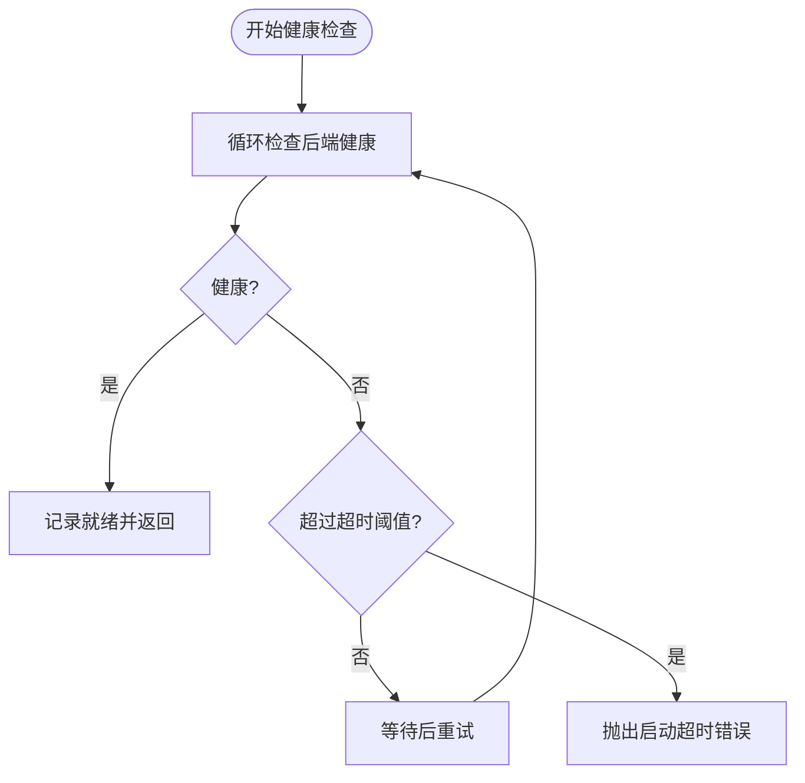
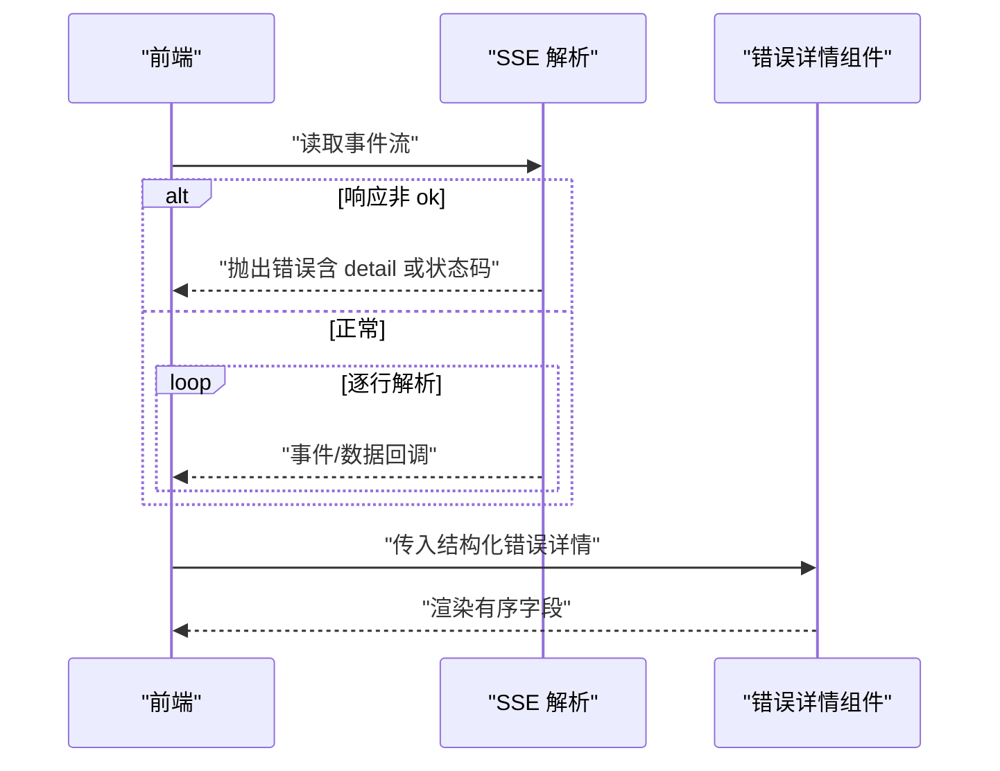
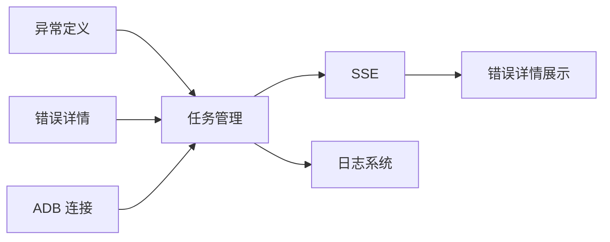

# 错误处理与恢复

<cite>
**本文引用的文件**
- [exceptions.py](file://AutoGLM_GUI/exceptions.py)
- [error_details.py](file://AutoGLM_GUI/model/error_details.py)
- [task_manager.py](file://AutoGLM_GUI/task_manager.py)
- [connection.py](file://AutoGLM_GUI/adb/connection.py)
- [logger.py](file://AutoGLM_GUI/logger.py)
- [main.js](file://electron/main.js)
- [sse.ts](file://frontend/src/lib/sse.ts)
- [DevicePanel.tsx](file://frontend/src/components/DevicePanel.tsx)
- [test_model_error_details.py](file://tests/test_model_error_details.py)
- [test_agent_adapter_coverage.py](file://tests/test_agent_adapter_coverage.py)
</cite>

## 目录
1. [简介](#简介)
2. [项目结构](#项目结构)
3. [核心组件](#核心组件)
4. [架构总览](#架构总览)
5. [详细组件分析](#详细组件分析)
6. [依赖关系分析](#依赖关系分析)
7. [性能考量](#性能考量)
8. [故障排查指南](#故障排查指南)
9. [结论](#结论)
10. [附录](#附录)

## 简介
本章节系统化阐述 AutoGLM-GUI 的错误处理与恢复体系，覆盖错误分类、异常捕获、错误信息采集与分析、自动恢复策略、重试与降级、用户通知、日志与监控告警、以及故障诊断与修复建议。文档以代码为依据，结合真实测试用例与前端展示逻辑，帮助初学者快速上手，同时为资深开发者提供技术深度与实现细节。

## 项目结构
围绕“错误处理与恢复”的关键模块分布如下：
- 异常定义：统一的业务异常类型，便于上层分支处理与用户提示
- 模型错误详情：结构化输出模型调用失败的上下文信息，支持 UI 展示与追踪
- 设备与 ADB 连接：设备可用性检测、连接/断开、重启 ADB 服务器等
- 任务管理：任务执行中的异常捕获、状态标记、错误归档
- 日志系统：结构化日志与错误分离日志，支持轮转与诊断
- 前端 SSE 与错误展示：事件流解析、错误消息提取与 UI 呈现
- Electron 后端健康检查：启动阶段的健康检查与超时处理

图表来源
- [exceptions.py:1-98](file://AutoGLM_GUI/exceptions.py#L1-L98)
- [error_details.py:1-250](file://AutoGLM_GUI/model/error_details.py#L1-L250)
- [task_manager.py:944-1676](file://AutoGLM_GUI/task_manager.py#L944-L1676)
- [connection.py:49-342](file://AutoGLM_GUI/adb/connection.py#L49-L342)
- [logger.py:49-86](file://AutoGLM_GUI/logger.py#L49-L86)
- [sse.ts:1-56](file://frontend/src/lib/sse.ts#L1-L56)
- [DevicePanel.tsx:203-233](file://frontend/src/components/DevicePanel.tsx#L203-L233)
- [main.js:238-281](file://electron/main.js#L238-L281)

章节来源
- [exceptions.py:1-98](file://AutoGLM_GUI/exceptions.py#L1-L98)
- [error_details.py:1-250](file://AutoGLM_GUI/model/error_details.py#L1-L250)
- [task_manager.py:944-1676](file://AutoGLM_GUI/task_manager.py#L944-L1676)
- [connection.py:49-342](file://AutoGLM_GUI/adb/connection.py#L49-L342)
- [logger.py:49-86](file://AutoGLM_GUI/logger.py#L49-L86)
- [sse.ts:1-56](file://frontend/src/lib/sse.ts#L1-L56)
- [DevicePanel.tsx:203-233](file://frontend/src/components/DevicePanel.tsx#L203-L233)
- [main.js:238-281](file://electron/main.js#L238-L281)

## 核心组件
- 自定义异常体系：用于区分设备不可用、设备繁忙、代理未初始化等场景，便于上层进行差异化处理与用户提示
- 模型错误详情序列化：将模型调用失败的异常、HTTP 状态码、请求头、响应体、请求 ID、基础 URL 等结构化输出，支持 UI 展示与追踪
- 设备连接与可用性：封装 ADB 连接、断开、设备列表、服务器重启等操作，提供统一的错误返回与提示
- 任务执行错误处理：在任务执行过程中捕获各类异常，设置最终状态、停止原因与错误信息，并进行资源释放与状态归档
- 日志与错误分离：结构化日志与独立错误日志文件，支持轮转、保留与诊断
- 健康检查与超时：Electron 启动阶段对后端健康检查，超时抛出明确错误
- 前端事件流与错误展示：SSE 流解析与错误消息提取，错误详情组件按字段顺序化展示

章节来源
- [exceptions.py:1-98](file://AutoGLM_GUI/exceptions.py#L1-L98)
- [error_details.py:168-229](file://AutoGLM_GUI/model/error_details.py#L168-L229)
- [connection.py:74-140](file://AutoGLM_GUI/adb/connection.py#L74-L140)
- [task_manager.py:952-965](file://AutoGLM_GUI/task_manager.py#L952-L965)
- [logger.py:49-86](file://AutoGLM_GUI/logger.py#L49-L86)
- [main.js:244-281](file://electron/main.js#L244-L281)
- [sse.ts:1-56](file://frontend/src/lib/sse.ts#L1-L56)
- [DevicePanel.tsx:206-233](file://frontend/src/components/DevicePanel.tsx#L206-L233)

## 架构总览
下图展示了从任务执行到错误捕获、序列化、前端展示与日志落盘的整体流程。

图表来源
- [task_manager.py:952-965](file://AutoGLM_GUI/task_manager.py#L952-L965)
- [connection.py:74-140](file://AutoGLM_GUI/adb/connection.py#L74-L140)
- [error_details.py:168-229](file://AutoGLM_GUI/model/error_details.py#L168-L229)
- [sse.ts:16-56](file://frontend/src/lib/sse.ts#L16-L56)
- [DevicePanel.tsx:206-233](file://frontend/src/components/DevicePanel.tsx#L206-L233)
- [logger.py:49-86](file://AutoGLM_GUI/logger.py#L49-L86)

## 详细组件分析

### 异常分类与处理机制
- 设备不可用：当设备离线、ADB 可执行文件缺失、命令超时等情况触发，上层应提示用户检查设备与 ADB 环境
- 设备繁忙：同一设备被其他任务占用，可采用阻塞、非阻塞或超时模式处理
- 代理未初始化：在未显式初始化或未启用自动初始化的情况下访问代理，需引导用户先初始化或使用自动初始化接口
- 代理初始化失败：通常由配置错误、网络问题、设备未连接或模型配置无效导致，需引导用户检查配置与网络

图表来源
- [exceptions.py:4-35](file://AutoGLM_GUI/exceptions.py#L4-L35)
- [exceptions.py:38-64](file://AutoGLM_GUI/exceptions.py#L38-L64)
- [exceptions.py:10-35](file://AutoGLM_GUI/exceptions.py#L10-L35)
- [exceptions.py:67-97](file://AutoGLM_GUI/exceptions.py#L67-L97)

章节来源
- [exceptions.py:1-98](file://AutoGLM_GUI/exceptions.py#L1-L98)

### 模型错误详情与序列化
- 结构化字段：包括错误类型、消息、模型名、基础 URL、调用位置、HTTP 状态码、请求 ID、响应头、响应体、可选的堆栈跟踪
- 安全与脱敏：对敏感头部（如鉴权头）进行脱敏；对响应体进行截断摘要，避免泄露敏感信息
- 异步与同步：提供同步与异步两种序列化函数，适配不同调用场景
- UI 展示：前端组件按固定顺序组织字段，确保一致性与可读性

图表来源
- [error_details.py:168-229](file://AutoGLM_GUI/model/error_details.py#L168-L229)
- [error_details.py:137-151](file://AutoGLM_GUI/model/error_details.py#L137-L151)
- [error_details.py:46-88](file://AutoGLM_GUI/model/error_details.py#L46-L88)
- [DevicePanel.tsx:206-233](file://frontend/src/components/DevicePanel.tsx#L206-L233)

章节来源
- [error_details.py:1-250](file://AutoGLM_GUI/model/error_details.py#L1-L250)
- [DevicePanel.tsx:203-233](file://frontend/src/components/DevicePanel.tsx#L203-L233)

### 设备连接与可用性
- 连接：支持默认端口补全、超时控制、错误返回与已连接判断
- 断开：支持断开指定或全部设备
- 列表：解析设备列表，识别连接类型（USB/远程），过滤离线设备
- 服务器重启：安全地重启 ADB 服务器，包含延时与异常处理
- 可用性检测：在测试中验证离线、超时、缺失 ADB 可执行文件等场景下的异常抛出

图表来源
- [connection.py:74-114](file://AutoGLM_GUI/adb/connection.py#L74-L114)
- [connection.py:115-140](file://AutoGLM_GUI/adb/connection.py#L115-L140)
- [connection.py:288-318](file://AutoGLM_GUI/adb/connection.py#L288-L318)

章节来源
- [connection.py:49-342](file://AutoGLM_GUI/adb/connection.py#L49-L342)
- [test_hardware_boundary_coverage.py:298-378](file://tests/test_hardware_boundary_coverage.py#L298-L378)

### 任务执行中的错误捕获与恢复
- 统一捕获：在任务执行主循环中捕获设备繁忙、代理初始化失败等业务异常，设置最终状态与停止原因
- 资源释放：无论是否失败，均在 finally 中释放设备与注销中断处理器
- 错误状态归档：失败时设置设备错误状态，便于前端展示与历史记录
- 取消处理：区分用户取消与正常退出，必要时覆盖为取消状态

图表来源
- [task_manager.py:952-965](file://AutoGLM_GUI/task_manager.py#L952-L965)
- [task_manager.py:1646-1676](file://AutoGLM_GUI/task_manager.py#L1646-L1676)

章节来源
- [task_manager.py:944-1676](file://AutoGLM_GUI/task_manager.py#L944-L1676)

### 健康检查与启动超时
- 后端健康检查：以固定间隔轮询后端健康状态，记录检查次数与耗时
- 超时处理：超过阈值仍未健康则抛出明确错误，便于前端与用户感知

图表来源
- [main.js:244-281](file://electron/main.js#L244-L281)

章节来源
- [main.js:238-281](file://electron/main.js#L238-L281)

### 前端事件流与错误展示
- SSE 解析：对非 ok 响应提取错误详情；解析事件与数据，异常时记录解析错误
- 错误详情展示：按固定顺序组织字段，保证一致的可读性与可比性

图表来源
- [sse.ts:1-56](file://frontend/src/lib/sse.ts#L1-L56)
- [DevicePanel.tsx:206-233](file://frontend/src/components/DevicePanel.tsx#L206-L233)

章节来源
- [sse.ts:1-56](file://frontend/src/lib/sse.ts#L1-L56)
- [DevicePanel.tsx:203-233](file://frontend/src/components/DevicePanel.tsx#L203-L233)

### 日志记录与监控告警
- 结构化日志：统一格式，包含时间、级别、模块、函数、行号与消息
- 错误分离日志：独立的错误日志文件，开启回溯与诊断，支持轮转与保留
- 使用建议：在异常捕获处写入错误日志，便于后续检索与定位

章节来源
- [logger.py:49-86](file://AutoGLM_GUI/logger.py#L49-L86)

## 依赖关系分析
- 低耦合高内聚：异常定义、错误详情、任务管理、设备连接、日志与前端模块边界清晰
- 关键依赖链：
  - 任务管理依赖异常定义与错误详情，用于状态设置与错误序列化
  - 设备连接为任务执行前置条件，其结果影响任务生命周期
  - 前端通过 SSE 接收后端事件，错误详情经由 UI 组件展示
  - 日志系统贯穿所有模块，提供统一的可观测性

图表来源
- [exceptions.py:1-98](file://AutoGLM_GUI/exceptions.py#L1-L98)
- [error_details.py:1-250](file://AutoGLM_GUI/model/error_details.py#L1-L250)
- [task_manager.py:944-1676](file://AutoGLM_GUI/task_manager.py#L944-L1676)
- [connection.py:49-342](file://AutoGLM_GUI/adb/connection.py#L49-L342)
- [logger.py:49-86](file://AutoGLM_GUI/logger.py#L49-L86)
- [sse.ts:1-56](file://frontend/src/lib/sse.ts#L1-L56)
- [DevicePanel.tsx:203-233](file://frontend/src/components/DevicePanel.tsx#L203-L233)

章节来源
- [exceptions.py:1-98](file://AutoGLM_GUI/exceptions.py#L1-L98)
- [error_details.py:1-250](file://AutoGLM_GUI/model/error_details.py#L1-L250)
- [task_manager.py:944-1676](file://AutoGLM_GUI/task_manager.py#L944-L1676)
- [connection.py:49-342](file://AutoGLM_GUI/adb/connection.py#L49-L342)
- [logger.py:49-86](file://AutoGLM_GUI/logger.py#L49-L86)
- [sse.ts:1-56](file://frontend/src/lib/sse.ts#L1-L56)
- [DevicePanel.tsx:203-233](file://frontend/src/components/DevicePanel.tsx#L203-L233)

## 性能考量
- 序列化开销：错误详情序列化包含响应体摘要与可选堆栈，建议仅在需要时开启堆栈记录
- 日志轮转：合理配置轮转大小与保留天数，避免磁盘压力
- ADB 操作：连接/断开/重启服务器存在系统调用与网络交互，建议在高频场景下合并操作并缓存结果
- 前端解析：SSE 解析为流式处理，注意内存与解析异常的容错

## 故障排查指南
- 设备不可用
  - 现象：抛出设备不可用异常，提示离线/超时/缺少 ADB
  - 处理：检查 ADB 是否安装、设备是否在线、USB/WiFi 连接是否正确
  - 参考路径
    - [异常定义:4-7](file://AutoGLM_GUI/exceptions.py#L4-L7)
    - [设备可用性测试:298-318](file://tests/test_hardware_boundary_coverage.py#L298-L318)
- 设备繁忙
  - 现象：同一设备被占用，可采用阻塞/非阻塞/超时模式
  - 处理：稍后再试或调整并发策略
  - 参考路径
    - [异常定义:38-64](file://AutoGLM_GUI/exceptions.py#L38-L64)
    - [任务异常捕获:952-965](file://AutoGLM_GUI/task_manager.py#L952-L965)
- 代理未初始化/初始化失败
  - 现象：访问未初始化代理或初始化过程失败
  - 处理：启用自动初始化或先完成初始化；检查配置与网络
  - 参考路径
    - [异常定义:10-35](file://AutoGLM_GUI/exceptions.py#L10-L35)
    - [异常定义:67-97](file://AutoGLM_GUI/exceptions.py#L67-L97)
    - [任务异常捕获:956-961](file://AutoGLM_GUI/task_manager.py#L956-L961)
- 模型调用错误
  - 现象：HTTP 错误、超时、连接错误
  - 处理：根据 kind 字段采取重试/降级/切换模型
  - 参考路径
    - [错误详情序列化:168-229](file://AutoGLM_GUI/model/error_details.py#L168-L229)
    - [前端错误详情展示:206-233](file://frontend/src/components/DevicePanel.tsx#L206-L233)
    - [SSE 错误提取:1-14](file://frontend/src/lib/sse.ts#L1-L14)
    - [测试用例：模型错误事件:783-792](file://tests/test_agent_adapter_coverage.py#L783-L792)
- 启动超时
  - 现象：Electron 等待后端健康检查超时
  - 处理：检查后端日志、端口占用、防火墙与健康检查接口
  - 参考路径
    - [健康检查:244-281](file://electron/main.js#L244-L281)
- 日志与诊断
  - 建议：在异常捕获处写入错误日志，结合 trace_id 与请求 ID 进行关联查询
  - 参考路径
    - [日志配置:49-86](file://AutoGLM_GUI/logger.py#L49-L86)

章节来源
- [exceptions.py:1-98](file://AutoGLM_GUI/exceptions.py#L1-L98)
- [task_manager.py:952-965](file://AutoGLM_GUI/task_manager.py#L952-L965)
- [error_details.py:168-229](file://AutoGLM_GUI/model/error_details.py#L168-L229)
- [DevicePanel.tsx:206-233](file://frontend/src/components/DevicePanel.tsx#L206-L233)
- [sse.ts:1-14](file://frontend/src/lib/sse.ts#L1-L14)
- [test_agent_adapter_coverage.py:783-792](file://tests/test_agent_adapter_coverage.py#L783-L792)
- [main.js:244-281](file://electron/main.js#L244-L281)
- [logger.py:49-86](file://AutoGLM_GUI/logger.py#L49-L86)

## 结论
本体系通过“异常分类—错误序列化—前端展示—日志落盘—健康检查”的闭环设计，实现了从底层设备连接到上层任务执行的全面可观测与可恢复能力。建议在生产环境中：
- 明确错误分类与处理策略，优先采用非阻塞与超时模式
- 对模型错误进行分级重试与降级（如切换模型/减少并发）
- 在关键路径增加健康检查与告警联动
- 保持错误详情字段的最小暴露原则，配合脱敏与截断

## 附录
- 实际用例参考
  - [模型错误详情测试:28-71](file://tests/test_model_error_details.py#L28-L71)
  - [代理错误事件测试:765-792](file://tests/test_agent_adapter_coverage.py#L765-L792)