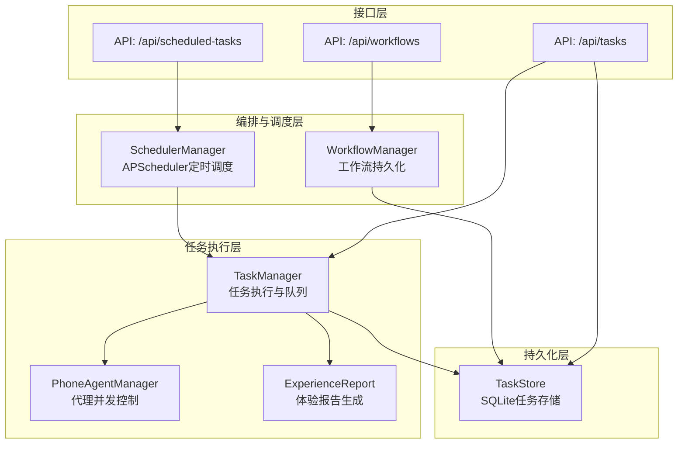
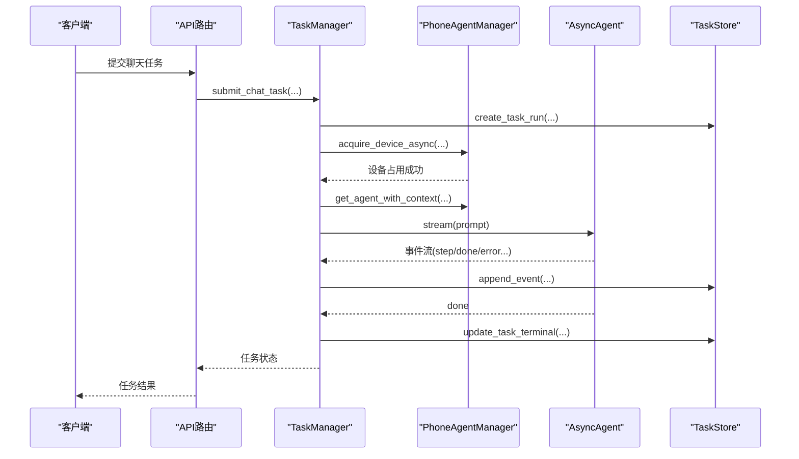
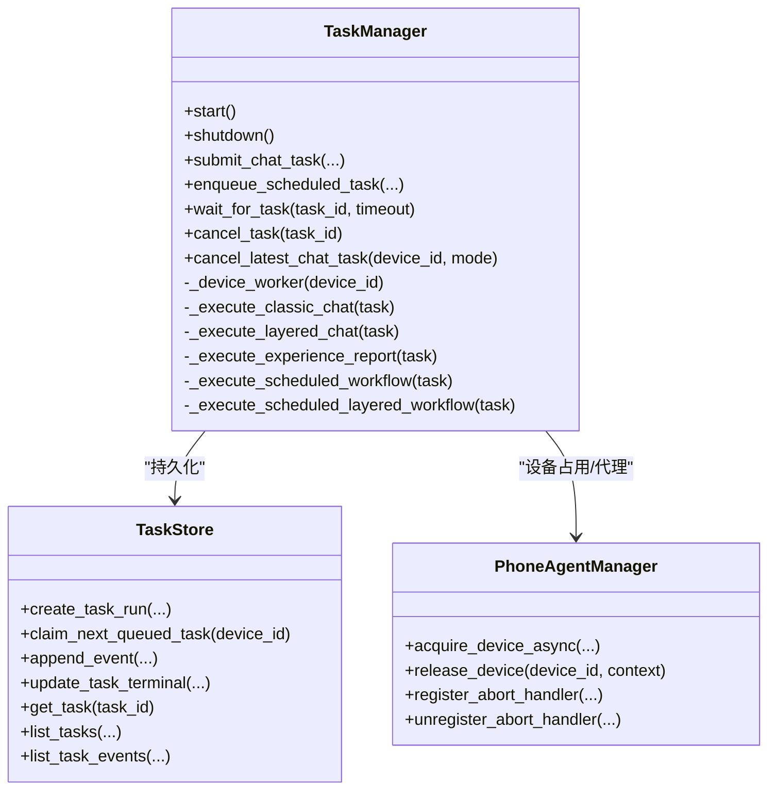
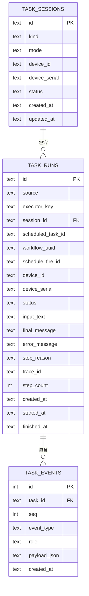
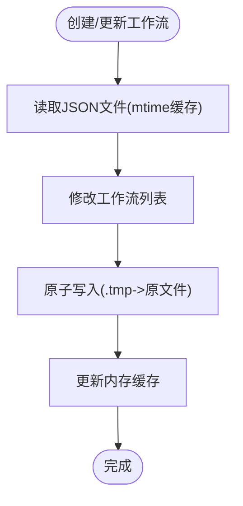
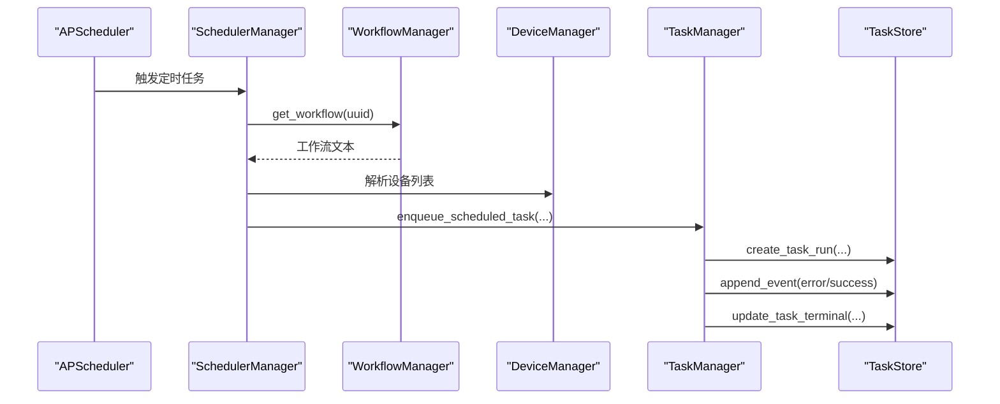
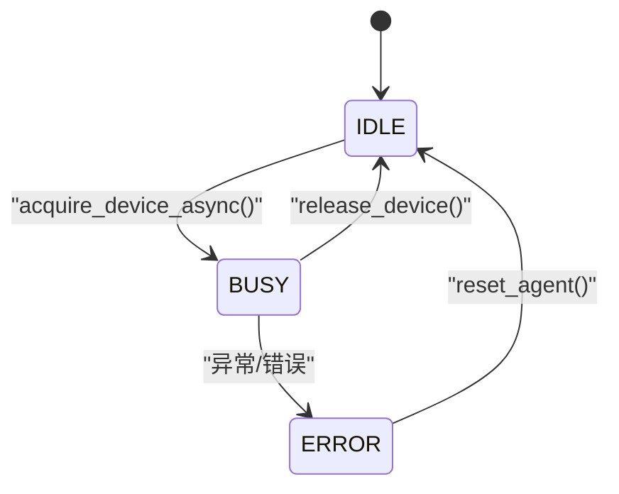
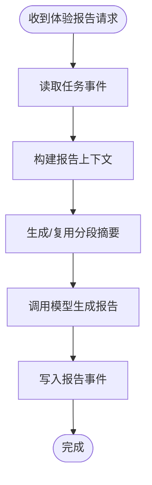
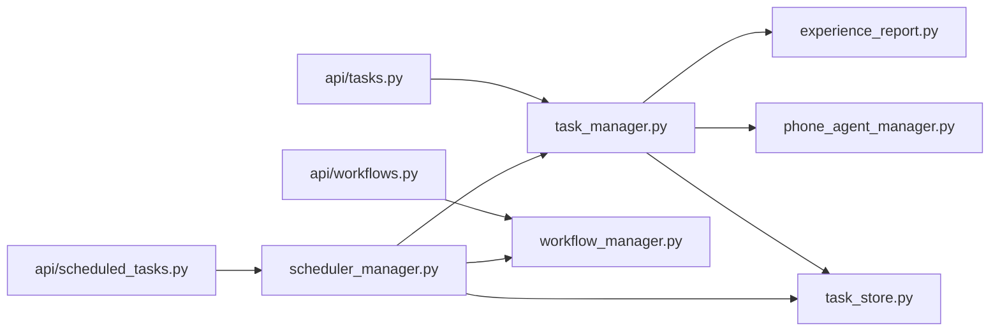

# 任务与工作流系统

<cite>
**本文档引用的文件**
- [task_manager.py](file://AutoGLM_GUI/task_manager.py)
- [workflow_manager.py](file://AutoGLM_GUI/workflow_manager.py)
- [scheduler_manager.py](file://AutoGLM_GUI/scheduler_manager.py)
- [task_store.py](file://AutoGLM_GUI/task_store.py)
- [api/tasks.py](file://AutoGLM_GUI/api/tasks.py)
- [api/workflows.py](file://AutoGLM_GUI/api/workflows.py)
- [api/scheduled_tasks.py](file://AutoGLM_GUI/api/scheduled_tasks.py)
- [phone_agent_manager.py](file://AutoGLM_GUI/phone_agent_manager.py)
- [experience_report.py](file://AutoGLM_GUI/experience_report.py)
- [schemas.py](file://AutoGLM_GUI/schemas.py)
- [test_task_manager.py](file://tests/test_task_manager.py)
- [test_scheduler_manager.py](file://tests/test_scheduler_manager.py)
</cite>

## 目录
1. [简介](#简介)
2. [项目结构](#项目结构)
3. [核心组件](#核心组件)
4. [架构总览](#架构总览)
5. [详细组件分析](#详细组件分析)
6. [依赖关系分析](#依赖关系分析)
7. [性能考虑](#性能考虑)
8. [故障排查指南](#故障排查指南)
9. [结论](#结论)
10. [附录](#附录)

## 简介
本文件面向AutoGLM-GUI的任务与工作流系统，系统性阐述任务管理、工作流编排、定时调度等核心能力的实现细节、调用关系、接口与使用模式。文档以代码库为依据，结合测试用例与API路由，帮助初学者快速上手，同时为资深开发者提供深入的技术参考。

## 项目结构
AutoGLM-GUI采用模块化设计，任务与工作流相关的核心代码集中在以下模块：
- 任务执行与队列：task_manager.py
- 任务持久化：task_store.py
- 工作流管理：workflow_manager.py
- 定时调度：scheduler_manager.py
- 代理并发控制：phone_agent_manager.py
- 报告生成：experience_report.py
- API路由：api/tasks.py、api/workflows.py、api/scheduled_tasks.py
- 数据模型：schemas.py

**图表来源**
- [task_manager.py:1-1737](file://AutoGLM_GUI/task_manager.py#L1-L1737)
- [task_store.py:1-1053](file://AutoGLM_GUI/task_store.py#L1-L1053)
- [workflow_manager.py:1-196](file://AutoGLM_GUI/workflow_manager.py#L1-L196)
- [scheduler_manager.py:1-523](file://AutoGLM_GUI/scheduler_manager.py#L1-L523)
- [phone_agent_manager.py:1-799](file://AutoGLM_GUI/phone_agent_manager.py#L1-L799)
- [experience_report.py:1-784](file://AutoGLM_GUI/experience_report.py#L1-L784)
- [api/tasks.py:1-365](file://AutoGLM_GUI/api/tasks.py#L1-L365)
- [api/workflows.py:1-74](file://AutoGLM_GUI/api/workflows.py#L1-L74)
- [api/scheduled_tasks.py:1-137](file://AutoGLM_GUI/api/scheduled_tasks.py#L1-L137)

**章节来源**
- [task_manager.py:1-1737](file://AutoGLM_GUI/task_manager.py#L1-L1737)
- [task_store.py:1-1053](file://AutoGLM_GUI/task_store.py#L1-L1053)
- [workflow_manager.py:1-196](file://AutoGLM_GUI/workflow_manager.py#L1-L196)
- [scheduler_manager.py:1-523](file://AutoGLM_GUI/scheduler_manager.py#L1-L523)
- [phone_agent_manager.py:1-799](file://AutoGLM_GUI/phone_agent_manager.py#L1-L799)
- [experience_report.py:1-784](file://AutoGLM_GUI/experience_report.py#L1-L784)
- [api/tasks.py:1-365](file://AutoGLM_GUI/api/tasks.py#L1-L365)
- [api/workflows.py:1-74](file://AutoGLM_GUI/api/workflows.py#L1-L74)
- [api/scheduled_tasks.py:1-137](file://AutoGLM_GUI/api/scheduled_tasks.py#L1-L137)

## 核心组件
- 任务执行引擎（TaskManager）：负责任务队列、执行器注册、任务生命周期管理、取消与中断处理、事件回放与追踪集成。
- 任务持久化（TaskStore）：基于SQLite的线程安全存储，维护任务、会话、事件三类实体，提供查询、索引与事务保障。
- 工作流管理（WorkflowManager）：JSON文件持久化的工作流仓库，支持增删改查、mtime缓存与原子写入。
- 定时调度（SchedulerManager）：基于APScheduler的定时任务管理，支持Cron表达式、设备选择、执行模式（classic/layered）与运行统计。
- 代理并发控制（PhoneAgentManager）：设备级并发控制与代理生命周期管理，提供原子CAS获取/释放、上下文隔离、取消处理器注册。
- 体验报告（ExperienceReport）：基于任务事件的分段摘要与最终报告生成，支持截图引用与LLM生成。

**章节来源**
- [task_manager.py:30-120](file://AutoGLM_GUI/task_manager.py#L30-L120)
- [task_store.py:48-155](file://AutoGLM_GUI/task_store.py#L48-L155)
- [workflow_manager.py:33-196](file://AutoGLM_GUI/workflow_manager.py#L33-L196)
- [scheduler_manager.py:31-123](file://AutoGLM_GUI/scheduler_manager.py#L31-L123)
- [phone_agent_manager.py:52-106](file://AutoGLM_GUI/phone_agent_manager.py#L52-L106)
- [experience_report.py:47-675](file://AutoGLM_GUI/experience_report.py#L47-L675)

## 架构总览
系统采用“接口层-编排层-执行层-持久化层”的分层架构：
- 接口层：FastAPI路由提供REST API，封装业务语义与数据模型。
- 编排层：WorkflowManager与SchedulerManager分别负责工作流与定时任务的编排与触发。
- 执行层：TaskManager协调PhoneAgentManager完成设备占用、代理调用与事件回放；ExperienceReport在需要时生成体验报告。
- 持久化层：TaskStore统一管理任务状态、事件与会话，保证一致性与可观测性。

**图表来源**
- [api/tasks.py:214-231](file://AutoGLM_GUI/api/tasks.py#L214-L231)
- [task_manager.py:141-207](file://AutoGLM_GUI/task_manager.py#L141-L207)
- [phone_agent_manager.py:473-516](file://AutoGLM_GUI/phone_agent_manager.py#L473-L516)
- [task_store.py:445-520](file://AutoGLM_GUI/task_store.py#L445-L520)

**章节来源**
- [api/tasks.py:133-231](file://AutoGLM_GUI/api/tasks.py#L133-L231)
- [task_manager.py:141-207](file://AutoGLM_GUI/task_manager.py#L141-L207)
- [phone_agent_manager.py:473-516](file://AutoGLM_GUI/phone_agent_manager.py#L473-L516)
- [task_store.py:445-520](file://AutoGLM_GUI/task_store.py#L445-L520)

## 详细组件分析

### 任务执行引擎（TaskManager）
- 角色与职责
  - 以设备为粒度的队列驱动执行器，支持经典对话与分层对话两种执行模式。
  - 维护任务生命周期：创建、排队、运行、完成/失败/取消/中断。
  - 事件回放与追踪集成：将事件写入TaskStore并生成回放数据。
  - 体验报告触发：当检测到“报告请求”时，自动切换到体验报告执行器。
- 关键接口
  - start/shutdown：启动/关闭任务执行循环，恢复运行中任务状态。
  - submit_chat_task：提交聊天任务，自动选择执行器（classic/layered/experience_report）。
  - enqueue_scheduled_task：定时任务触发后入队。
  - cancel_task/cancel_latest_chat_task：取消队列中的任务或正在运行的任务。
  - wait_for_task：等待任务完成或超时。
- 并发与取消
  - 使用字典维护每个任务的完成事件，支持多路等待。
  - 对运行中任务通过注册的取消处理器触发取消，避免资源泄漏。
- 体验报告集成
  - 基于任务事件构建报告上下文，生成分段摘要并最终生成报告。
  - 支持后台生成分段摘要，限制并发。

**图表来源**
- [task_manager.py:30-120](file://AutoGLM_GUI/task_manager.py#L30-L120)
- [task_manager.py:615-809](file://AutoGLM_GUI/task_manager.py#L615-L809)
- [task_store.py:445-733](file://AutoGLM_GUI/task_store.py#L445-L733)
- [phone_agent_manager.py:473-540](file://AutoGLM_GUI/phone_agent_manager.py#L473-L540)

**章节来源**
- [task_manager.py:60-87](file://AutoGLM_GUI/task_manager.py#L60-L87)
- [task_manager.py:141-207](file://AutoGLM_GUI/task_manager.py#L141-L207)
- [task_manager.py:378-402](file://AutoGLM_GUI/task_manager.py#L378-L402)
- [task_manager.py:404-444](file://AutoGLM_GUI/task_manager.py#L404-L444)
- [task_manager.py:615-809](file://AutoGLM_GUI/task_manager.py#L615-L809)

### 任务持久化（TaskStore）
- 数据模型
  - 任务会话（task_sessions）：按设备与模式维护会话状态。
  - 任务运行（task_runs）：记录任务元数据、状态、计数与追踪ID。
  - 任务事件（task_events）：按序号记录事件，支持过滤与回放。
- 关键能力
  - 线程安全：使用RLock与WAL模式提升并发与可靠性。
  - 索引优化：针对设备、会话、序列号建立索引，加速查询。
  - 状态机：支持QUEUED/RUNNING/SUCCEEDED/FAILED/CANCELLED/INTERRUPTED。
- API要点
  - create_task_run/claim_next_queued_task/update_task_terminal：贯穿任务生命周期。
  - append_event/find_event_by_payload_fields：事件写入与查找。
  - list_tasks/list_task_events/get_task：查询与分页。

**图表来源**
- [task_store.py:80-145](file://AutoGLM_GUI/task_store.py#L80-L145)
- [task_store.py:445-520](file://AutoGLM_GUI/task_store.py#L445-L520)
- [task_store.py:597-622](file://AutoGLM_GUI/task_store.py#L597-L622)

**章节来源**
- [task_store.py:21-40](file://AutoGLM_GUI/task_store.py#L21-L40)
- [task_store.py:80-155](file://AutoGLM_GUI/task_store.py#L80-L155)
- [task_store.py:445-733](file://AutoGLM_GUI/task_store.py#L445-L733)

### 工作流管理（WorkflowManager）
- 功能特性
  - 单例模式：确保全局唯一实例。
  - JSON文件持久化：工作流列表以JSON存储，支持mtime缓存与原子写入。
  - CRUD操作：创建、读取、更新、删除工作流。
- 使用场景
  - 定时任务绑定工作流文本，执行时由调度器拉取并入队执行。

**图表来源**
- [workflow_manager.py:135-191](file://AutoGLM_GUI/workflow_manager.py#L135-L191)

**章节来源**
- [workflow_manager.py:33-196](file://AutoGLM_GUI/workflow_manager.py#L33-L196)

### 定时调度（SchedulerManager）
- 核心能力
  - 基于APScheduler的Cron调度，支持启用/禁用、更新Cron表达式。
  - 设备选择：支持指定设备序列号或设备分组。
  - 执行模式：classic/layered两种执行器选择。
  - 运行统计：记录最近一次运行状态、成功数、消息摘要。
- 执行流程
  - 解析Cron表达式，注册作业。
  - 触发时解析目标设备列表，遍历在线设备执行。
  - 对离线设备创建失败任务并记录错误。
  - 将工作流文本入队到TaskManager，由TaskManager创建任务并开始执行。

**图表来源**
- [scheduler_manager.py:156-181](file://AutoGLM_GUI/scheduler_manager.py#L156-L181)
- [scheduler_manager.py:355-467](file://AutoGLM_GUI/scheduler_manager.py#L355-L467)
- [api/scheduled_tasks.py:76-93](file://AutoGLM_GUI/api/scheduled_tasks.py#L76-L93)

**章节来源**
- [scheduler_manager.py:31-123](file://AutoGLM_GUI/scheduler_manager.py#L31-L123)
- [scheduler_manager.py:156-181](file://AutoGLM_GUI/scheduler_manager.py#L156-L181)
- [scheduler_manager.py:355-467](file://AutoGLM_GUI/scheduler_manager.py#L355-L467)
- [api/scheduled_tasks.py:70-137](file://AutoGLM_GUI/api/scheduled_tasks.py#L70-L137)

### 代理并发控制（PhoneAgentManager）
- 设计原则
  - 单例管理：全局唯一实例，线程安全。
  - 设备级并发：使用原子CAS（IDLE↔BUSY）控制设备占用。
  - 上下文隔离：支持device_id:context键空间，避免跨会话干扰。
  - 取消处理：注册/注销取消处理器，支持同步/异步处理器。
- 关键接口
  - acquire_device_async/release_device：异步获取/释放设备。
  - register_abort_handler/unregister_abort_handler：注册/注销取消处理器。
  - get_agent_with_context/reset_agent/destroy_agent：代理生命周期管理。

**图表来源**
- [phone_agent_manager.py:26-50](file://AutoGLM_GUI/phone_agent_manager.py#L26-L50)
- [phone_agent_manager.py:414-540](file://AutoGLM_GUI/phone_agent_manager.py#L414-L540)

**章节来源**
- [phone_agent_manager.py:52-106](file://AutoGLM_GUI/phone_agent_manager.py#L52-L106)
- [phone_agent_manager.py:414-540](file://AutoGLM_GUI/phone_agent_manager.py#L414-L540)

### 体验报告（ExperienceReport）
- 能力概述
  - 从任务事件中提取轨迹与截图，生成分段摘要与最终报告。
  - 支持分段大小控制、上下文截断、截图引用与LLM生成。
- 关键流程
  - ensure_experience_segment_summaries：按步长生成/复用分段摘要。
  - build_experience_report_context：构建报告上下文文本与截图。
  - generate_experience_report：调用模型生成最终报告。

**图表来源**
- [experience_report.py:527-598](file://AutoGLM_GUI/experience_report.py#L527-L598)
- [experience_report.py:601-674](file://AutoGLM_GUI/experience_report.py#L601-L674)
- [experience_report.py:690-784](file://AutoGLM_GUI/experience_report.py#L690-L784)

**章节来源**
- [experience_report.py:47-675](file://AutoGLM_GUI/experience_report.py#L47-L675)

## 依赖关系分析
- 组件耦合
  - TaskManager依赖TaskStore（持久化）、PhoneAgentManager（设备/代理）、ExperienceReport（报告）。
  - SchedulerManager依赖WorkflowManager（工作流文本）、TaskManager（入队）、TaskStore（运行统计）。
  - API路由依赖各管理器与TaskStore，提供HTTP接口。
- 外部依赖
  - APScheduler：定时调度。
  - SQLite：任务持久化。
  - OpenAI兼容客户端：体验报告LLM生成。

**图表来源**
- [api/tasks.py:1-365](file://AutoGLM_GUI/api/tasks.py#L1-L365)
- [api/workflows.py:1-74](file://AutoGLM_GUI/api/workflows.py#L1-L74)
- [api/scheduled_tasks.py:1-137](file://AutoGLM_GUI/api/scheduled_tasks.py#L1-L137)
- [task_manager.py:1-120](file://AutoGLM_GUI/task_manager.py#L1-L120)
- [scheduler_manager.py:1-123](file://AutoGLM_GUI/scheduler_manager.py#L1-L123)

**章节来源**
- [api/tasks.py:1-365](file://AutoGLM_GUI/api/tasks.py#L1-L365)
- [api/workflows.py:1-74](file://AutoGLM_GUI/api/workflows.py#L1-L74)
- [api/scheduled_tasks.py:1-137](file://AutoGLM_GUI/api/scheduled_tasks.py#L1-L137)
- [task_manager.py:1-120](file://AutoGLM_GUI/task_manager.py#L1-L120)
- [scheduler_manager.py:1-123](file://AutoGLM_GUI/scheduler_manager.py#L1-L123)

## 性能考虑
- 并发与锁
  - TaskStore使用RLock与WAL模式，减少锁竞争与写放大。
  - PhoneAgentManager使用单锁保护状态机，CAS操作微秒级，避免长时间持有锁。
- 查询与索引
  - 针对设备、会话、序列号建立索引，提升高频查询性能。
- 背景任务与限流
  - 体验报告分段摘要生成使用全局信号量限制并发，避免过度占用资源。
- I/O与网络
  - 定时任务执行时对离线设备创建失败任务，避免阻塞在线设备执行。
  - LLM调用设置超时，防止阻塞主线程。

[本节为通用指导，不直接分析具体文件]

## 故障排查指南
- 任务卡死
  - 现象：任务长时间处于RUNNING且无法完成。
  - 排查：检查代理是否正确注册取消处理器；查看TaskManager的_abort_handlers与PhoneAgentManager的abort_handler。
  - 处理：调用cancel_task触发取消；若服务重启，TaskStore会将RUNNING标记为INTERRUPTED。
- 调度冲突
  - 现象：多个定时任务同时触发导致设备争用。
  - 排查：确认设备列表与分组配置；检查SchedulerManager的设备解析逻辑。
  - 处理：为不同任务分配独立设备或分组；调整Cron表达式错峰。
- 资源竞争
  - 现象：多设备并发导致代理初始化失败或设备忙。
  - 排查：查看PhoneAgentManager的acquire_device_async返回值与DeviceBusyError。
  - 处理：增加设备数量或降低并发；优化任务批处理策略。
- 报告生成失败
  - 现象：体验报告LLM调用报错或超时。
  - 排查：检查模型配置（base_url/model_name）；查看错误序列化与trace信息。
  - 处理：修正模型配置；适当增大超时或减少上下文长度。

**章节来源**
- [task_manager.py:420-444](file://AutoGLM_GUI/task_manager.py#L420-L444)
- [phone_agent_manager.py:414-540](file://AutoGLM_GUI/phone_agent_manager.py#L414-L540)
- [experience_report.py:447-525](file://AutoGLM_GUI/experience_report.py#L447-L525)

## 结论
AutoGLM-GUI的任务与工作流系统通过清晰的分层设计与严格的并发控制，实现了高可靠的任务执行、灵活的工作流编排与稳定的定时调度。TaskStore提供一致的持久化与可观测性，TaskManager与PhoneAgentManager协同保障任务执行与设备资源的安全使用，ExperienceReport进一步提升了自动化体验的闭环价值。配合完善的API与测试用例，系统具备良好的扩展性与可维护性。

[本节为总结性内容，不直接分析具体文件]

## 附录

### API定义与使用模式
- 任务API
  - 创建会话、提交任务、取消任务、流式事件监听。
  - 参考：[api/tasks.py:133-365](file://AutoGLM_GUI/api/tasks.py#L133-L365)
- 工作流API
  - 列出/创建/更新/删除工作流。
  - 参考：[api/workflows.py:17-74](file://AutoGLM_GUI/api/workflows.py#L17-L74)
- 定时任务API
  - 列出/创建/更新/删除定时任务，启用/禁用。
  - 参考：[api/scheduled_tasks.py:70-137](file://AutoGLM_GUI/api/scheduled_tasks.py#L70-L137)

**章节来源**
- [api/tasks.py:133-365](file://AutoGLM_GUI/api/tasks.py#L133-L365)
- [api/workflows.py:17-74](file://AutoGLM_GUI/api/workflows.py#L17-L74)
- [api/scheduled_tasks.py:70-137](file://AutoGLM_GUI/api/scheduled_tasks.py#L70-L137)

### 测试用例要点
- 任务队列与取消
  - FIFO顺序、跨设备并行、队列与运行中任务取消。
  - 参考：[test_task_manager.py:14-86](file://tests/test_task_manager.py#L14-L86)、[test_task_manager.py:89-143](file://tests/test_task_manager.py#L89-L143)、[test_task_manager.py:146-196](file://tests/test_task_manager.py#L146-L196)
- 中断恢复
  - 服务重启后运行中任务标记为INTERRUPTED。
  - 参考：[test_task_manager.py:199-222](file://tests/test_task_manager.py#L199-L222)
- 分层任务与步骤统计
  - 分层任务合并内部步骤，跳过历史记录。
  - 参考：[test_task_manager.py:225-324](file://tests/test_task_manager.py#L225-L324)
- 定时任务执行
  - 离线设备统计与分层执行器选择。
  - 参考：[test_scheduler_manager.py:18-120](file://tests/test_scheduler_manager.py#L18-L120)、[test_scheduler_manager.py:122-187](file://tests/test_scheduler_manager.py#L122-L187)

**章节来源**
- [test_task_manager.py:14-86](file://tests/test_task_manager.py#L14-L86)
- [test_task_manager.py:89-143](file://tests/test_task_manager.py#L89-L143)
- [test_task_manager.py:146-196](file://tests/test_task_manager.py#L146-L196)
- [test_task_manager.py:199-222](file://tests/test_task_manager.py#L199-L222)
- [test_task_manager.py:225-324](file://tests/test_task_manager.py#L225-L324)
- [test_scheduler_manager.py:18-120](file://tests/test_scheduler_manager.py#L18-L120)
- [test_scheduler_manager.py:122-187](file://tests/test_scheduler_manager.py#L122-L187)