# 任务存储与持久化

<cite>
**本文档引用的文件**
- [task_store.py](file://AutoGLM_GUI/task_store.py)
- [task_manager.py](file://AutoGLM_GUI/task_manager.py)
- [tasks.py](file://AutoGLM_GUI/api/tasks.py)
- [schemas.py](file://AutoGLM_GUI/schemas.py)
- [test_task_store.py](file://tests/test_task_store.py)
- [test_tasks_api.py](file://tests/test_tasks_api.py)
- [test_task_manager.py](file://tests/test_task_manager.py)
- [scheduler_manager.py](file://AutoGLM_GUI/scheduler_manager.py)
- [history.py](file://AutoGLM_GUI/api/history.py)
- [history_manager.py](file://AutoGLM_GUI/history_manager.py)
</cite>

## 目录
1. [简介](#简介)
2. [项目结构](#项目结构)
3. [核心组件](#核心组件)
4. [架构概览](#架构概览)
5. [详细组件分析](#详细组件分析)
6. [依赖关系分析](#依赖关系分析)
7. [性能考虑](#性能考虑)
8. [故障排除指南](#故障排除指南)
9. [结论](#结论)
10. [附录](#附录)

## 简介

AutoGLM-GUI 的任务存储与持久化模块是一个基于 SQLite 的轻量级存储系统，专门设计用于支持多设备、多会话的自动化任务执行。该模块提供了完整的任务生命周期管理，包括任务创建、状态跟踪、事件日志记录、会话管理等功能。

本模块的核心价值在于：
- **线程安全**：通过 RLock 确保并发访问的安全性
- **事务完整性**：使用 SQLite 事务保证数据一致性
- **查询优化**：精心设计的索引策略提升查询性能
- **扩展性**：支持多种任务类型和执行器
- **可观测性**：完整的事件追踪和性能监控

## 项目结构

AutoGLM-GUI 任务存储模块位于 `AutoGLM_GUI/task_store.py` 文件中，采用模块化设计，主要包含以下组件：

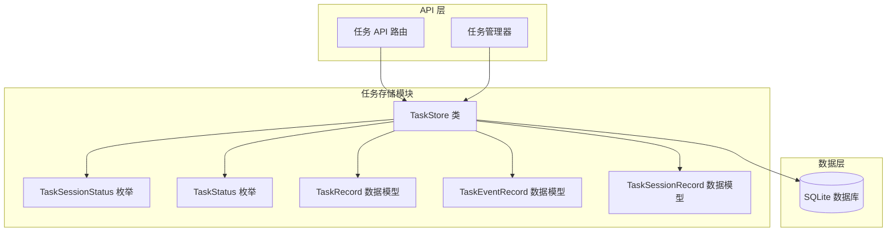

**图表来源**
- [task_store.py:48-1053](file://AutoGLM_GUI/task_store.py#L48-L1053)
- [tasks.py:1-365](file://AutoGLM_GUI/api/tasks.py#L1-L365)
- [task_manager.py:95-1829](file://AutoGLM_GUI/task_manager.py#L95-L1829)

**章节来源**
- [task_store.py:1-1053](file://AutoGLM_GUI/task_store.py#L1-L1053)
- [tasks.py:1-365](file://AutoGLM_GUI/api/tasks.py#L1-L365)
- [task_manager.py:1-800](file://AutoGLM_GUI/task_manager.py#L1-L800)

## 核心组件

### TaskStore 类

TaskStore 是整个任务存储系统的核心，提供了完整的 CRUD 操作和高级查询功能。其设计特点包括：

#### 数据模型定义

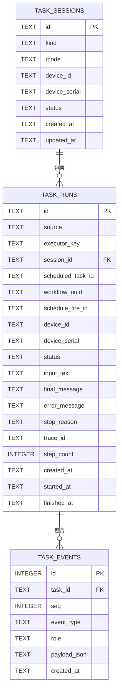

**图表来源**
- [task_store.py:84-144](file://AutoGLM_GUI/task_store.py#L84-L144)

#### 状态管理

系统支持多种任务状态，包括：
- **QUEUED**: 排队中
- **RUNNING**: 执行中  
- **SUCCEEDED**: 成功完成
- **FAILED**: 执行失败
- **CANCELLED**: 用户取消
- **INTERRUPTED**: 服务中断

#### 会话管理

TaskStore 提供了完整的会话生命周期管理：
- 会话创建和查询
- 会话状态更新和归档
- 会话级别的任务查询
- 会话隔离和并发控制

**章节来源**
- [task_store.py:21-46](file://AutoGLM_GUI/task_store.py#L21-L46)
- [task_store.py:184-293](file://AutoGLM_GUI/task_store.py#L184-L293)

### 数据库设计

#### 表结构设计

数据库采用三层结构设计：

1. **task_sessions**: 存储任务会话信息
2. **task_runs**: 存储具体任务执行记录  
3. **task_events**: 存储任务事件日志

#### 索引策略

系统实现了多层次的索引策略来优化查询性能：

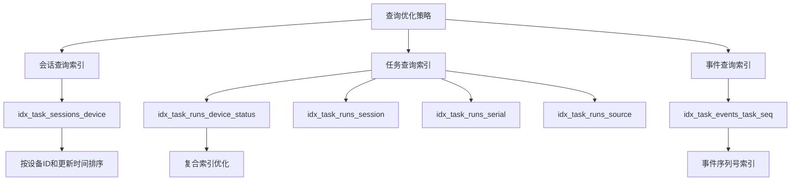

**图表来源**
- [task_store.py:128-143](file://AutoGLM_GUI/task_store.py#L128-L143)

**章节来源**
- [task_store.py:80-154](file://AutoGLM_GUI/task_store.py#L80-L154)

## 架构概览

### 整体架构设计

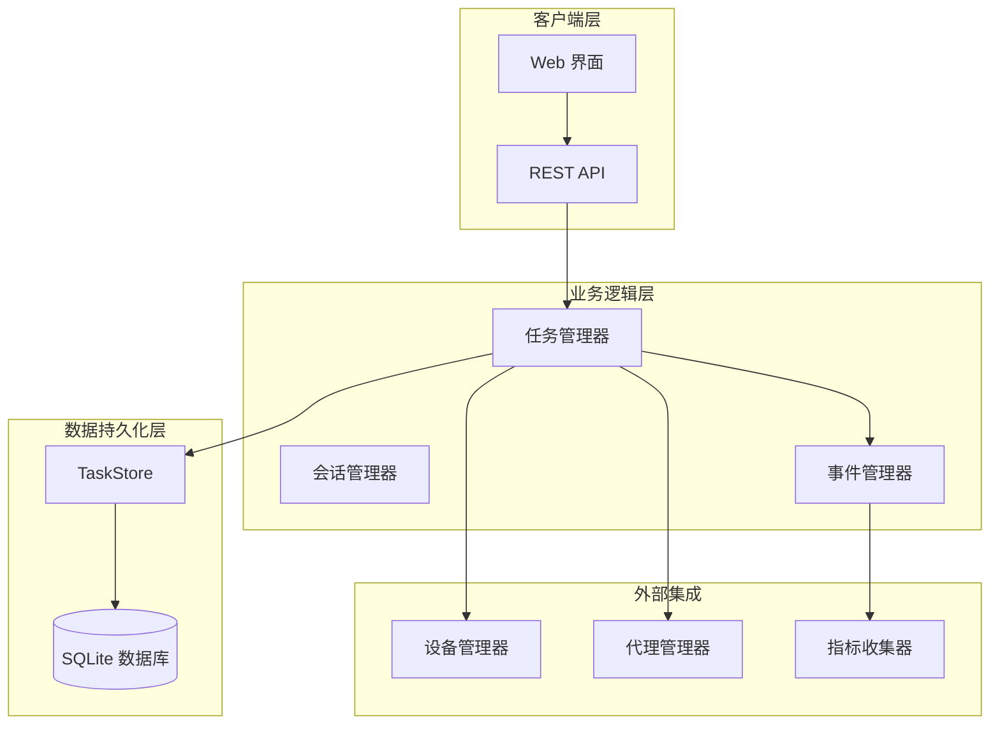

**图表来源**
- [task_manager.py:95-1829](file://AutoGLM_GUI/task_manager.py#L95-L1829)
- [tasks.py:133-365](file://AutoGLM_GUI/api/tasks.py#L133-L365)

### 任务执行流程

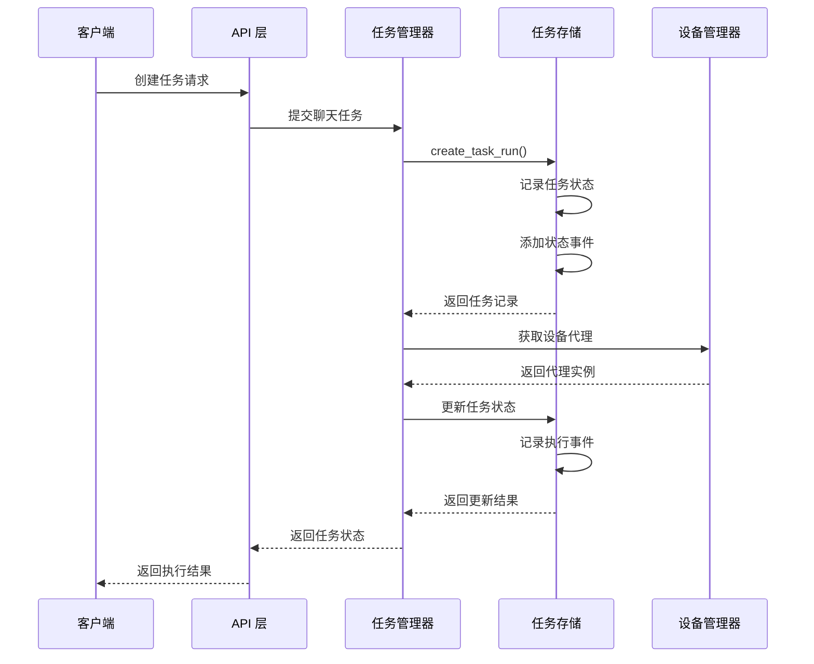

**图表来源**
- [task_manager.py:206-274](file://AutoGLM_GUI/task_manager.py#L206-L274)
- [task_store.py:445-521](file://AutoGLM_GUI/task_store.py#L445-L521)

**章节来源**
- [task_manager.py:95-800](file://AutoGLM_GUI/task_manager.py#L95-L800)
- [tasks.py:133-365](file://AutoGLM_GUI/api/tasks.py#L133-L365)

## 详细组件分析

### 任务状态持久化

#### 状态转换机制

系统实现了严格的任务状态转换控制，确保状态变更的原子性和一致性：

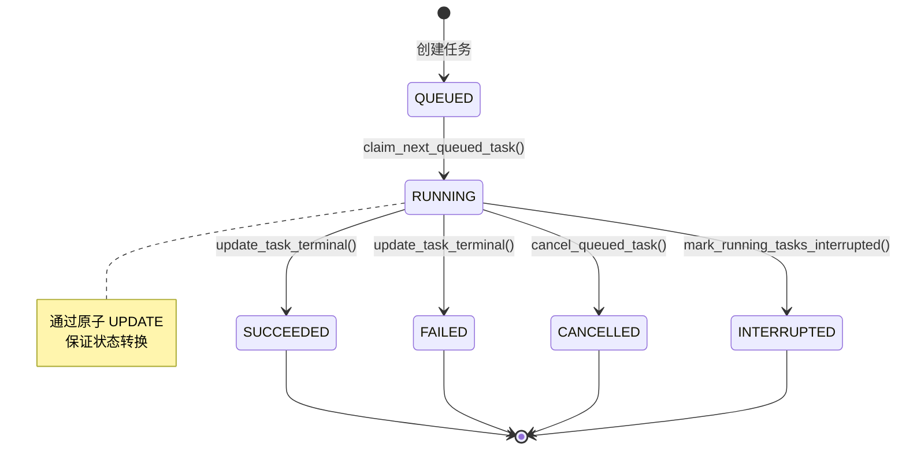

**图表来源**
- [task_store.py:633-733](file://AutoGLM_GUI/task_store.py#L633-L733)

#### 状态查询优化

系统提供了多种状态查询接口，针对不同场景进行了优化：

**章节来源**
- [task_store.py:633-844](file://AutoGLM_GUI/task_store.py#L633-L844)

### 事件日志存储

#### 事件模型设计

事件系统采用序列化设计，确保事件的有序性和可追溯性：

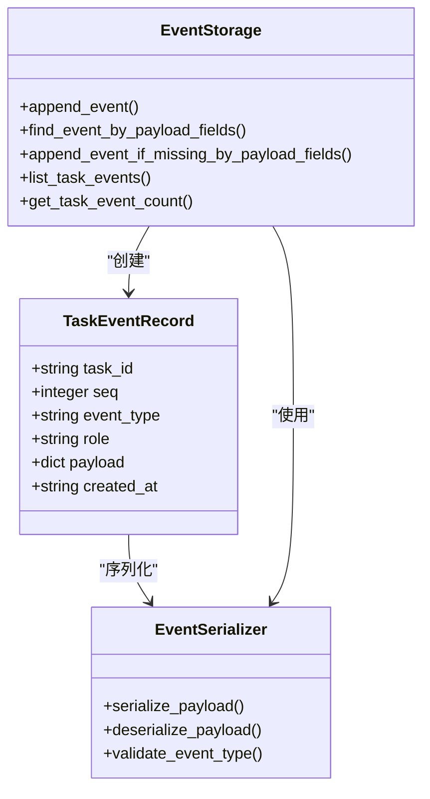

**图表来源**
- [task_store.py:294-443](file://AutoGLM_GUI/task_store.py#L294-L443)

#### 事件查询策略

系统支持多种事件查询模式：

1. **按任务查询**: `list_task_events(task_id)`
2. **按类型查询**: `find_event_by_payload_fields()`
3. **增量查询**: 基于序列号的增量获取
4. **条件查询**: 基于负载字段的精确匹配

**章节来源**
- [task_store.py:294-632](file://AutoGLM_GUI/task_store.py#L294-L632)

### 会话管理

#### 会话生命周期

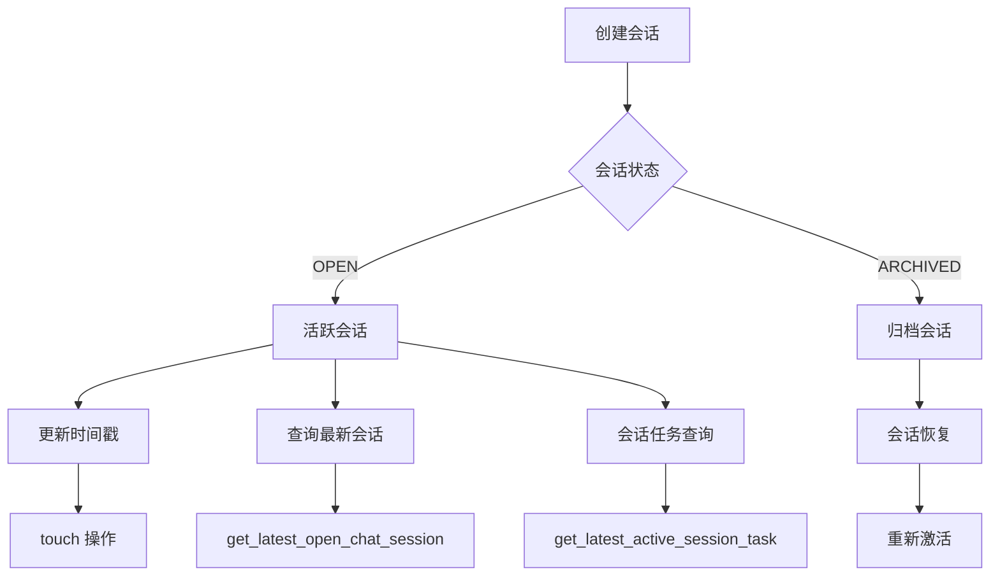

**图表来源**
- [task_store.py:184-293](file://AutoGLM_GUI/task_store.py#L184-L293)

#### 会话隔离机制

系统通过组合键确保会话的严格隔离：
- `device_id + device_serial + mode` 组合作为会话标识
- 支持同一设备的多模式并行会话
- 自动清理过期会话资源

**章节来源**
- [task_store.py:254-293](file://AutoGLM_GUI/task_store.py#L254-L293)

### 事务管理

#### 事务边界设计

系统采用细粒度事务管理，确保每个操作的原子性：

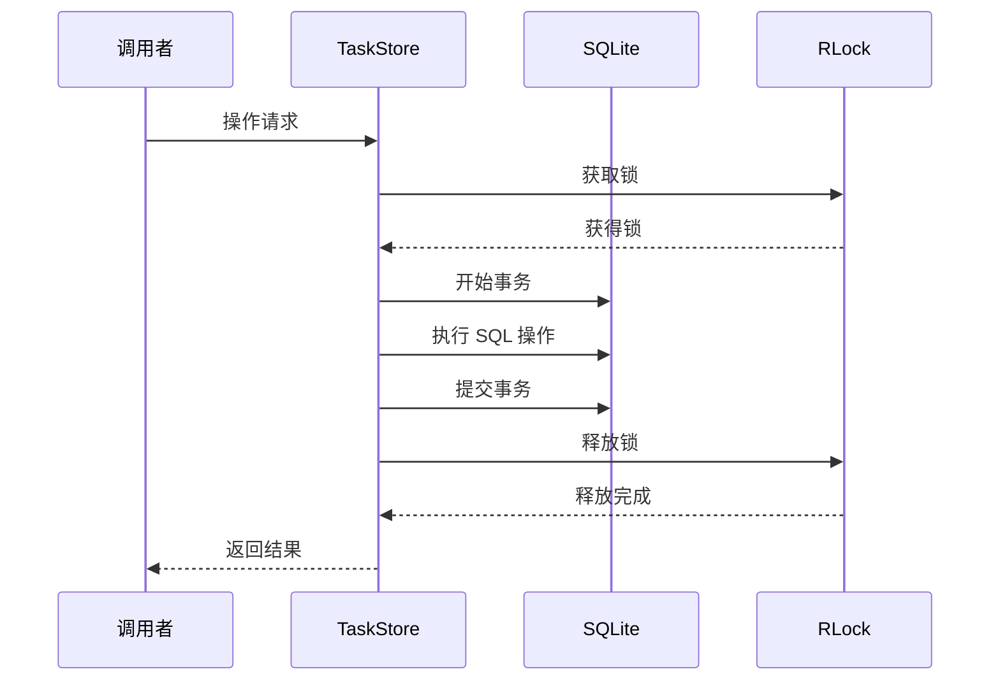

**图表来源**
- [task_store.py:57-79](file://AutoGLM_GUI/task_store.py#L57-L79)

#### 锁机制实现

系统使用 RLock（可重入锁）确保：
- 同一线程内的递归调用不会死锁
- 异常情况下的锁自动释放
- 性能开销最小化的并发控制

**章节来源**
- [task_store.py:51-56](file://AutoGLM_GUI/task_store.py#L51-L56)

## 依赖关系分析

### 组件耦合度

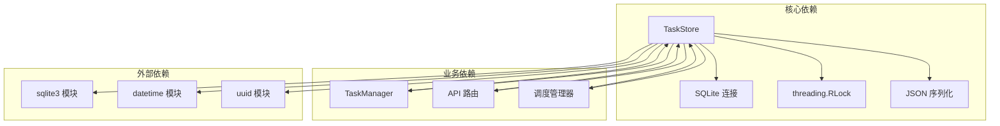

**图表来源**
- [task_store.py:3-14](file://AutoGLM_GUI/task_store.py#L3-L14)

### 外部接口依赖

系统对外部接口的依赖主要体现在：
- **FastAPI**: Web API 框架
- **SQLite**: 数据存储引擎
- **Pydantic**: 数据验证和序列化
- **Asyncio**: 异步任务管理

**章节来源**
- [tasks.py:1-365](file://AutoGLM_GUI/api/tasks.py#L1-L365)
- [task_manager.py:1-800](file://AutoGLM_GUI/task_manager.py#L1-L800)

## 性能考虑

### 查询性能优化

#### 索引策略分析

系统实现了针对性的索引策略来优化常见查询模式：

| 索引名称 | 查询场景 | 性能收益 |
|---------|---------|---------|
| idx_task_sessions_device | 按设备查询会话 | O(log N) 查询时间 |
| idx_task_runs_device_status | 设备状态过滤 | 复合索引优化 |
| idx_task_runs_session | 会话任务查询 | 快速定位任务 |
| idx_task_runs_serial | 设备序列号查询 | 实时任务追踪 |
| idx_task_events_task_seq | 事件序列查询 | 有序事件检索 |

#### 查询优化技巧

1. **参数化查询**: 防止 SQL 注入，提高缓存命中率
2. **LIMIT/OFFSET**: 支持大数据集的分页查询
3. **UNIQUE 约束**: 确保事件序列的唯一性
4. **FOREIGN KEY**: 维护数据完整性

### 存储性能优化

#### WAL 模式优势

系统采用 Write-Ahead Logging (WAL) 模式：
- **并发读写**: 支持多读写并发操作
- **减少锁竞争**: 降低写操作阻塞
- **崩溃恢复**: 提供更好的数据安全性

#### 内存管理

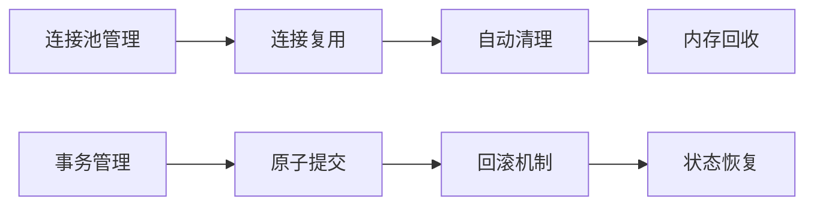

**图表来源**
- [task_store.py:63-68](file://AutoGLM_GUI/task_store.py#L63-L68)

**章节来源**
- [task_store.py:80-154](file://AutoGLM_GUI/task_store.py#L80-L154)

## 故障排除指南

### 常见问题诊断

#### 数据库连接问题

**症状**: 操作超时或连接失败
**可能原因**:
1. 数据库文件被其他进程锁定
2. 磁盘空间不足
3. 文件权限问题
4. SQLite 版本兼容性

**解决方案**:
1. 检查数据库文件锁定状态
2. 清理磁盘空间
3. 验证文件权限设置
4. 更新 SQLite 版本

#### 并发访问冲突

**症状**: 事务冲突或数据不一致
**可能原因**:
1. 多线程同时访问
2. 长时间持有锁
3. 死锁情况

**解决方案**:
1. 检查锁持有时间
2. 优化事务范围
3. 实现重试机制

#### 查询性能问题

**症状**: 查询响应缓慢
**可能原因**:
1. 缺少必要的索引
2. 查询条件不优化
3. 数据量过大

**解决方案**:
1. 分析执行计划
2. 添加复合索引
3. 实施分页查询

### 调试工具和方法

#### 日志记录

系统提供了详细的日志记录机制：
- **操作审计**: 记录所有重要操作
- **性能监控**: 跟踪查询执行时间
- **错误追踪**: 捕获异常详情

#### 调试接口

```python
# 获取数据库路径
db_path = task_store.db_path

# 查看表结构
cursor = conn.execute("PRAGMA table_info(table_name)")
schema = cursor.fetchall()

# 分析查询计划
cursor = conn.execute("EXPLAIN QUERY PLAN SELECT ...")
plan = cursor.fetchall()
```

**章节来源**
- [task_store.py:70-79](file://AutoGLM_GUI/task_store.py#L70-L79)

## 结论

AutoGLM-GUI 的任务存储与持久化模块展现了优秀的工程实践，通过精心设计的数据模型、完善的索引策略和严格的事务管理，为复杂的多设备任务执行系统提供了可靠的数据基础。

### 主要优势

1. **架构清晰**: 模块化设计便于维护和扩展
2. **性能优异**: 针对性的索引和查询优化
3. **可靠性高**: 事务保证和错误处理机制
4. **可扩展性强**: 支持多种任务类型和执行器
5. **可观测性完善**: 事件追踪和性能监控

### 技术亮点

- **线程安全**: 使用 RLock 确保并发访问安全
- **事务完整性**: 原子性操作保证数据一致性
- **查询优化**: 多层次索引策略提升性能
- **状态管理**: 严格的任务状态转换控制
- **事件系统**: 完整的事件追踪和日志记录

该模块为 AutoGLM-GUI 提供了坚实的数据持久化基础，支持从简单聊天任务到复杂自动化工作流的各种应用场景。

## 附录

### API 使用示例

#### 创建任务会话
```python
# Python 代码示例路径
# AutoGLM_GUI/task_store.py:184-229
```

#### 提交任务执行
```python
# Python 代码示例路径
# AutoGLM_GUI/task_store.py:445-521
```

#### 查询任务状态
```python
# Python 代码示例路径
# AutoGLM_GUI/task_store.py:537-590
```

#### 记录任务事件
```python
# Python 代码示例路径
# AutoGLM_GUI/task_store.py:294-360
```

### 测试用例参考

#### 基本功能测试
```python
# Python 代码示例路径
# tests/test_task_store.py:10-40
```

#### 状态管理测试
```python
# Python 代码示例路径
# tests/test_task_store.py:192-219
```

#### API 集成测试
```python
# Python 代码示例路径
# tests/test_tasks_api.py:235-272
```

### 配置选项

#### 数据库配置
- **journal_mode**: WAL 模式提升并发性能
- **foreign_keys**: 启用外键约束保证数据完整性
- **check_same_thread**: 禁用线程检查支持多线程访问

#### 性能调优参数
- **索引策略**: 根据查询模式定制索引
- **事务大小**: 控制事务范围避免长时间锁定
- **连接池**: 复用数据库连接减少开销