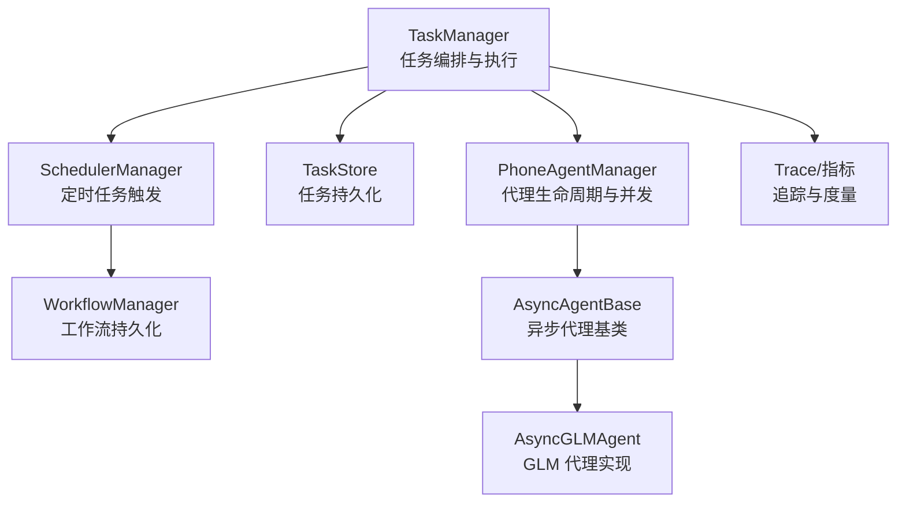
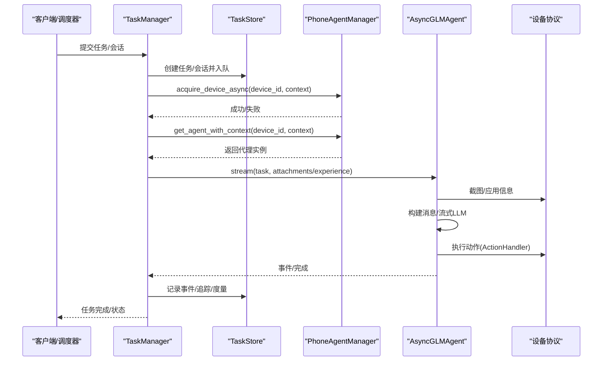
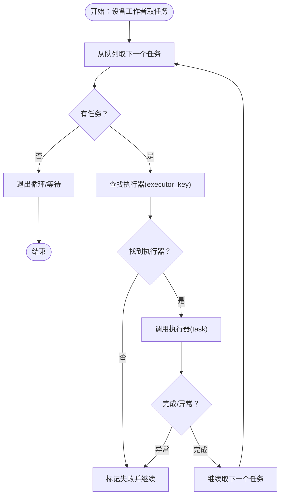
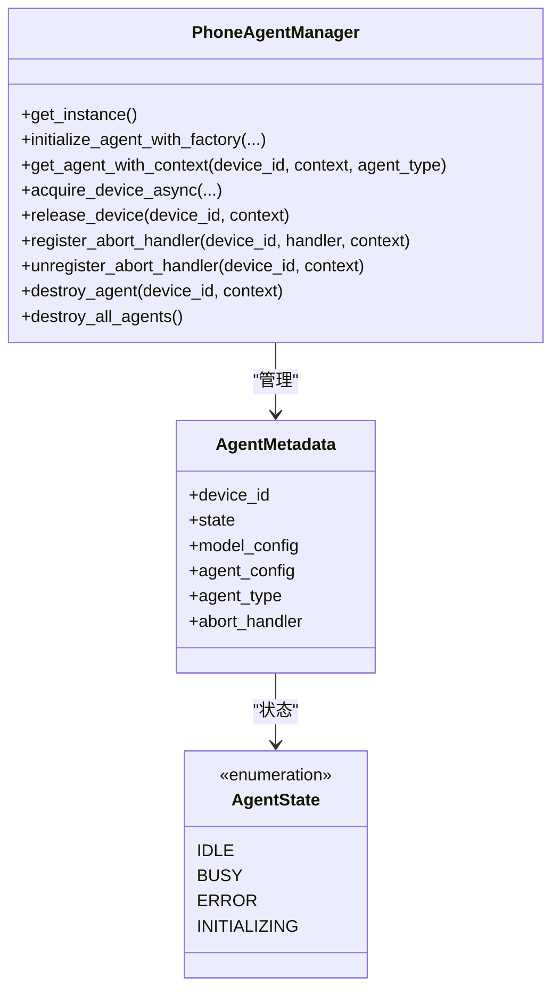
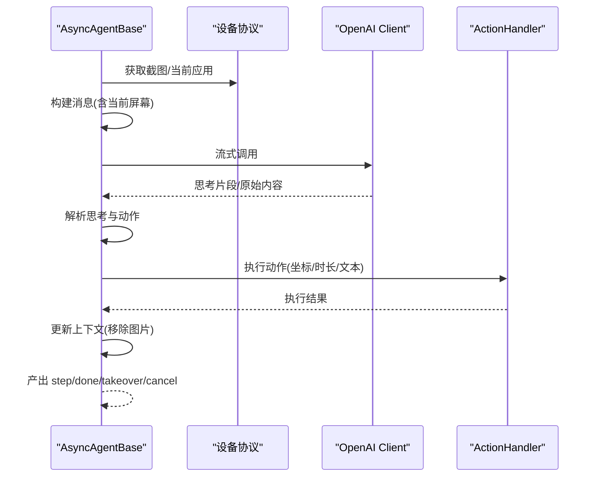
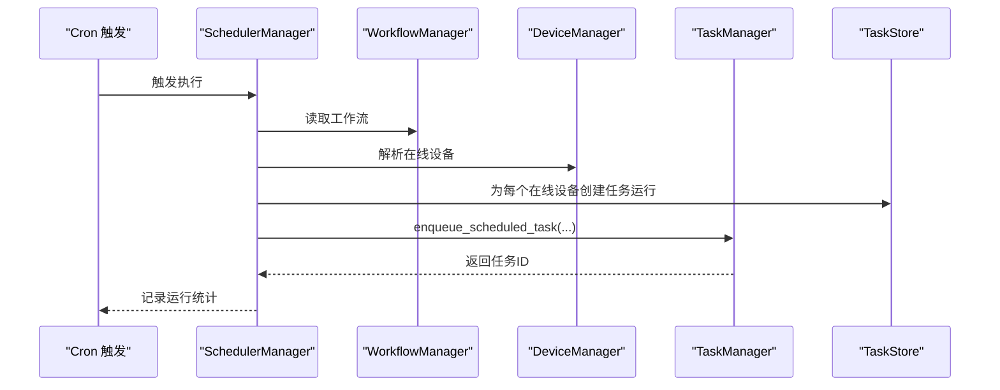
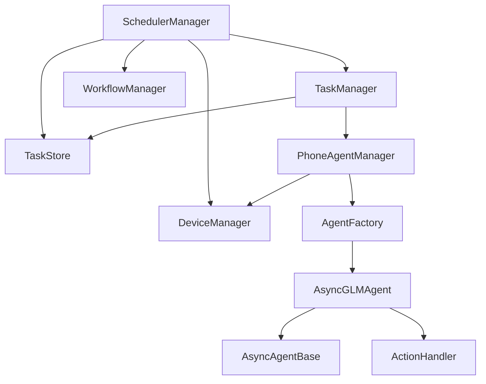

# 任务执行引擎

<cite>
**本文引用的文件**
- [task_manager.py](file://AutoGLM_GUI/task_manager.py)
- [workflow_manager.py](file://AutoGLM_GUI/workflow_manager.py)
- [scheduler_manager.py](file://AutoGLM_GUI/scheduler_manager.py)
- [async_agent_base.py](file://AutoGLM_GUI/agents/base/async_agent_base.py)
- [async_agent.py](file://AutoGLM_GUI/agents/glm/async_agent.py)
- [phone_agent_manager.py](file://AutoGLM_GUI/phone_agent_manager.py)
- [task_store.py](file://AutoGLM_GUI/task_store.py)
</cite>

## 目录
1. [引言](#引言)
2. [项目结构](#项目结构)
3. [核心组件](#核心组件)
4. [架构总览](#架构总览)
5. [详细组件分析](#详细组件分析)
6. [依赖分析](#依赖分析)
7. [性能考虑](#性能考虑)
8. [故障排查指南](#故障排查指南)
9. [结论](#结论)
10. [附录](#附录)

## 引言
本文件系统性阐述 AutoGLM-GUI 的任务执行引擎，聚焦任务编排、执行器模式、异步处理、并发控制与资源管理。文档以代码为依据，结合序列图与流程图，解释经典聊天、分层聊天、体验报告与定时工作流等典型执行路径，说明执行引擎如何与 AI 代理系统集成、如何进行性能监控与资源回收，以及常见问题（如执行超时、资源竞争、状态同步）的解决方案。

## 项目结构
任务执行引擎由三大支柱构成：
- 任务编排与执行：TaskManager 负责队列、调度、执行器分发、取消与完成事件。
- 代理系统：PhoneAgentManager 管理设备级代理生命周期与并发，AsyncAgentBase 定义异步代理通用行为，具体模型（如 GLM）实现解析与动作执行。
- 计划与工作流：SchedulerManager 管理定时任务与工作流触发，WorkflowManager 提供工作流持久化与读取。

图表来源
- [task_manager.py](file://AutoGLM_GUI/task_manager.py)
- [phone_agent_manager.py](file://AutoGLM_GUI/phone_agent_manager.py)
- [async_agent_base.py](file://AutoGLM_GUI/agents/base/async_agent_base.py)
- [async_agent.py](file://AutoGLM_GUI/agents/glm/async_agent.py)
- [scheduler_manager.py](file://AutoGLM_GUI/scheduler_manager.py)
- [workflow_manager.py](file://AutoGLM_GUI/workflow_manager.py)
- [task_store.py](file://AutoGLM_GUI/task_store.py)

章节来源
- [task_manager.py](file://AutoGLM_GUI/task_manager.py)
- [phone_agent_manager.py](file://AutoGLM_GUI/phone_agent_manager.py)
- [async_agent_base.py](file://AutoGLM_GUI/agents/base/async_agent_base.py)
- [async_agent.py](file://AutoGLM_GUI/agents/glm/async_agent.py)
- [scheduler_manager.py](file://AutoGLM_GUI/scheduler_manager.py)
- [workflow_manager.py](file://AutoGLM_GUI/workflow_manager.py)
- [task_store.py](file://AutoGLM_GUI/task_store.py)

## 核心组件
- TaskManager：按设备维度的 per-device 工作者，注册多种执行器（经典聊天、分层聊天、体验报告、定时工作流），负责任务入队、取消、完成事件、追踪与度量。
- PhoneAgentManager：设备级代理生命周期与并发控制，提供原子状态机（IDLE↔BUSY）、自动初始化、取消处理器注册/注销、上下文隔离（device:context）。
- AsyncAgentBase：异步代理抽象，统一流式执行主循环、取消/重置、上下文管理、看门狗限制（重复动作/无进展）。
- AsyncGLMAgent：GLM 代理实现，基于流式响应解析思考与动作，执行设备动作并更新上下文。
- SchedulerManager：基于 APScheduler 的定时任务管理，解析 cron 触发、解析设备集合、批量派发任务。
- WorkflowManager：工作流 JSON 文件持久化、mtime 缓存、原子写入。
- TaskStore：任务状态、事件、会话与追踪 ID 的持久化存储。

章节来源
- [task_manager.py](file://AutoGLM_GUI/task_manager.py)
- [phone_agent_manager.py](file://AutoGLM_GUI/phone_agent_manager.py)
- [async_agent_base.py](file://AutoGLM_GUI/agents/base/async_agent_base.py)
- [async_agent.py](file://AutoGLM_GUI/agents/glm/async_agent.py)
- [scheduler_manager.py](file://AutoGLM_GUI/scheduler_manager.py)
- [workflow_manager.py](file://AutoGLM_GUI/workflow_manager.py)
- [task_store.py](file://AutoGLM_GUI/task_store.py)

## 架构总览
任务执行引擎采用“任务编排 + 代理执行 + 并发控制 + 追踪度量”的分层设计。TaskManager 作为中枢，按设备拉取任务并委派给对应执行器；执行器通过 PhoneAgentManager 获取/初始化代理，代理基于 AsyncAgentBase 的流式循环与 ActionHandler 执行设备动作；SchedulerManager 与 WorkflowManager 提供计划与工作流支撑；TaskStore 提供一致的状态与事件持久化。

图表来源
- [task_manager.py](file://AutoGLM_GUI/task_manager.py)
- [phone_agent_manager.py](file://AutoGLM_GUI/phone_agent_manager.py)
- [async_agent_base.py](file://AutoGLM_GUI/agents/base/async_agent_base.py)
- [async_agent.py](file://AutoGLM_GUI/agents/glm/async_agent.py)
- [task_store.py](file://AutoGLM_GUI/task_store.py)

## 详细组件分析

### TaskManager：任务编排与执行
- 设备工作者：为每个设备维护一个后台任务，循环从 TaskStore 中抢占下一个排队任务，按 executor_key 分发到具体执行器。
- 执行器注册：内置“经典聊天”“分层聊天”“体验报告”“定时工作流”“定时分层工作流”等执行器键。
- 任务生命周期：提交任务、记录用户消息事件、等待完成事件、取消处理、异常兜底、完成归档清理上下文代理。
- 追踪与度量：为每个任务创建 trace_id，写入回放数据，收集步骤耗时与总体耗时，记录延迟指标。
- 体验报告：根据用户请求关键词与最近可报告任务，自动切换到体验报告执行器，并注入体验上下文。

图表来源
- [task_manager.py](file://AutoGLM_GUI/task_manager.py)

章节来源
- [task_manager.py](file://AutoGLM_GUI/task_manager.py)

### PhoneAgentManager：代理生命周期与并发控制
- 上下文隔离：通过 device_id:context 复合键隔离不同会话/场景下的代理实例，避免跨会话污染。
- 原子状态机：IDLE↔BUSY 瞬间 CAS 转换，避免长时间持有锁；支持 acquire_device_async 的取消清理。
- 自动初始化：首次访问时按全局配置创建代理，避免外部强耦合。
- 取消处理器：注册/注销取消处理器（支持同步 Event/函数/异步函数），用于中断代理流式执行。
- 资源回收：destroy_agent 与 destroy_all_agents 支持按需与全量销毁，防止内存泄漏。

图表来源
- [phone_agent_manager.py](file://AutoGLM_GUI/phone_agent_manager.py)

章节来源
- [phone_agent_manager.py](file://AutoGLM_GUI/phone_agent_manager.py)

### AsyncAgentBase：异步代理基类
- 流式主循环：准备初始状态（截图/应用信息）→ 循环执行步骤（截图→LLM→解析→动作→更新上下文）→ 结束/取消/看门狗终止。
- 取消与重置：支持取消事件、重置上下文与步数、清空附件。
- 看门狗保护：重复动作阈值与无进展阈值，避免死循环。
- 上下文与图片：每步仅携带当前屏幕截图，避免历史冗余；支持用户参考图注入。

图表来源
- [async_agent_base.py](file://AutoGLM_GUI/agents/base/async_agent_base.py)

章节来源
- [async_agent_base.py](file://AutoGLM_GUI/agents/base/async_agent_base.py)

### AsyncGLMAgent：GLM 代理实现
- 解析策略：从流式响应中切分“思考”与“动作”，支持多种标记风格；解析失败时按“完成”处理。
- 动作执行：通过 ActionHandler 将动作映射为设备操作，返回成功/完成标志。
- 图片管理：每步仅保留当前屏幕图片，避免上下文膨胀；支持用户参考图一次性注入。
- 错误序列化：模型错误序列化与追踪属性记录，便于诊断。

章节来源
- [async_agent.py](file://AutoGLM_GUI/agents/glm/async_agent.py)

### SchedulerManager：定时任务与工作流触发
- cron 触发：解析表达式，注册 APScheduler 作业；支持启停、更新、移除。
- 设备解析：支持指定设备列表或设备分组，默认分组为未分配设备。
- 批量派发：遍历在线设备，为每个设备创建任务运行记录并入队；离线设备记录失败事件。
- 执行模式：根据任务模式选择“经典工作流”或“分层工作流”。

图表来源
- [scheduler_manager.py](file://AutoGLM_GUI/scheduler_manager.py)
- [workflow_manager.py](file://AutoGLM_GUI/workflow_manager.py)

章节来源
- [scheduler_manager.py](file://AutoGLM_GUI/scheduler_manager.py)
- [workflow_manager.py](file://AutoGLM_GUI/workflow_manager.py)

### WorkflowManager：工作流持久化
- 单例模式：确保全局唯一实例。
- JSON 文件：用户工作流持久化至 ~/.config/autoglm/workflows.json，支持 mtime 缓存与原子写入。
- CRUD：列出、获取、创建、更新、删除工作流。

章节来源
- [workflow_manager.py](file://AutoGLM_GUI/workflow_manager.py)

### TaskStore：任务状态与事件持久化
- 任务记录、事件记录、会话记录、终端状态集、追踪 ID 绑定。
- 任务生命周期：创建、入队、抢占、取消、完成、归档。
- 事件扩展：支持用户消息、体验报告来源、追踪摘要等事件类型。

章节来源
- [task_store.py](file://AutoGLM_GUI/task_store.py)

## 依赖分析
- TaskManager 依赖 TaskStore 进行任务与事件持久化，依赖 PhoneAgentManager 获取/初始化代理，依赖追踪模块写入回放与度量。
- PhoneAgentManager 依赖 DeviceManager 获取设备协议，依赖工厂创建具体代理类型，内部使用 RLock 保证状态机原子性。
- AsyncAgentBase 依赖 ActionHandler 执行动作，依赖设备协议获取截图与应用信息，依赖 MessageBuilder 构造消息。
- AsyncGLMAgent 继承 AsyncAgentBase，实现解析与流式 LLM 调用。
- SchedulerManager 依赖 WorkflowManager 读取工作流，依赖 DeviceManager 与 TaskManager/TaskStore 派发任务。
- WorkflowManager 与 TaskStore 为独立持久化模块，分别服务于工作流与任务。

图表来源
- [task_manager.py](file://AutoGLM_GUI/task_manager.py)
- [phone_agent_manager.py](file://AutoGLM_GUI/phone_agent_manager.py)
- [async_agent_base.py](file://AutoGLM_GUI/agents/base/async_agent_base.py)
- [async_agent.py](file://AutoGLM_GUI/agents/glm/async_agent.py)
- [scheduler_manager.py](file://AutoGLM_GUI/scheduler_manager.py)
- [workflow_manager.py](file://AutoGLM_GUI/workflow_manager.py)
- [task_store.py](file://AutoGLM_GUI/task_store.py)

章节来源
- [task_manager.py](file://AutoGLM_GUI/task_manager.py)
- [phone_agent_manager.py](file://AutoGLM_GUI/phone_agent_manager.py)
- [async_agent_base.py](file://AutoGLM_GUI/agents/base/async_agent_base.py)
- [async_agent.py](file://AutoGLM_GUI/agents/glm/async_agent.py)
- [scheduler_manager.py](file://AutoGLM_GUI/scheduler_manager.py)
- [workflow_manager.py](file://AutoGLM_GUI/workflow_manager.py)
- [task_store.py](file://AutoGLM_GUI/task_store.py)

## 性能考虑
- 异步与并发
  - TaskManager 为每个设备维护独立工作者，避免跨设备阻塞；执行器均在事件循环中运行，I/O 通过 asyncio.to_thread 与异步接口解耦。
  - PhoneAgentManager 的 acquire_device_async 使用 shield 与 done 回调清理，避免取消导致的锁泄漏。
- 资源管理
  - 每个会话结束后清理上下文代理，防止长期占用内存。
  - 代理每步仅保留当前屏幕图片，减少上下文体积与序列化开销。
- 追踪与度量
  - 为每个任务创建 trace_id，记录步骤耗时与总体耗时，写入回放事件，便于性能分析与问题复现。
- 限流与看门狗
  - AsyncAgentBase 设置重复动作与无进展阈值，避免长时间无效循环；支持按步数或时长上限的运行限制。

章节来源
- [task_manager.py](file://AutoGLM_GUI/task_manager.py)
- [phone_agent_manager.py](file://AutoGLM_GUI/phone_agent_manager.py)
- [async_agent_base.py](file://AutoGLM_GUI/agents/base/async_agent_base.py)
- [async_agent.py](file://AutoGLM_GUI/agents/glm/async_agent.py)

## 故障排查指南
- 执行超时
  - 现象：任务长时间无进展或达到最大步数/时长。
  - 排查：检查 AsyncAgentBase 的看门狗阈值与运行限制配置；查看 TaskManager 的等待超时与取消逻辑。
  - 处理：调整运行限制参数或优化代理解析策略。
- 资源竞争
  - 现象：设备被占用导致无法获取代理锁。
  - 排查：确认 PhoneAgentManager 的 acquire_device_async 是否被正确释放；检查是否存在未清理的取消处理器。
  - 处理：确保 finally 中调用 release_device；必要时调用 destroy_agent 清理。
- 状态同步
  - 现象：取消后状态未及时更新或事件丢失。
  - 排查：确认 TaskManager 的取消请求集合与完成事件；检查 TaskStore 的状态更新顺序。
  - 处理：在取消路径中设置取消事件并在 finally 中标记完成。
- 代理初始化失败
  - 现象：自动初始化时报错（如缺少 base_url）。
  - 排查：检查全局配置与环境变量；确认 DeviceManager 可获取设备协议。
  - 处理：完善配置后重试初始化或手动初始化代理。

章节来源
- [task_manager.py](file://AutoGLM_GUI/task_manager.py)
- [phone_agent_manager.py](file://AutoGLM_GUI/phone_agent_manager.py)
- [async_agent_base.py](file://AutoGLM_GUI/agents/base/async_agent_base.py)

## 结论
AutoGLM-GUI 的任务执行引擎以 TaskManager 为核心，结合 PhoneAgentManager 的设备级并发控制与 AsyncAgentBase 的统一代理框架，实现了高可靠、可观测、可扩展的任务执行体系。通过工作流与定时任务模块，系统支持多样化的执行策略与自动化场景。遵循本文的并发控制、资源管理与故障排查建议，可在复杂设备与代理环境下保持稳定与高性能。

## 附录
- 经典聊天任务执行流程
  - 提交消息 → 创建任务/会话 → 注册执行器（经典聊天）→ 获取/初始化代理 → 流式执行 → 记录事件与追踪 → 完成。
- 分层聊天任务执行流程
  - 提交消息 → 创建任务/会话 → 注册执行器（分层聊天）→ 获取/初始化代理 → 流式执行 → 记录事件与追踪 → 完成。
- 体验报告任务执行流程
  - 用户请求“报告/总结/评测” → 匹配最近可报告任务 → 注入体验上下文 → 注册执行器（体验报告）→ 流式执行 → 生成报告。
- 定时工作流任务执行流程
  - Cron 触发 → 读取工作流 → 解析在线设备 → 为每个设备创建任务运行 → 入队 → 执行器派发 → 记录运行统计。

章节来源
- [task_manager.py](file://AutoGLM_GUI/task_manager.py)
- [scheduler_manager.py](file://AutoGLM_GUI/scheduler_manager.py)
- [workflow_manager.py](file://AutoGLM_GUI/workflow_manager.py)
- [phone_agent_manager.py](file://AutoGLM_GUI/phone_agent_manager.py)
- [async_agent_base.py](file://AutoGLM_GUI/agents/base/async_agent_base.py)
- [async_agent.py](file://AutoGLM_GUI/agents/glm/async_agent.py)