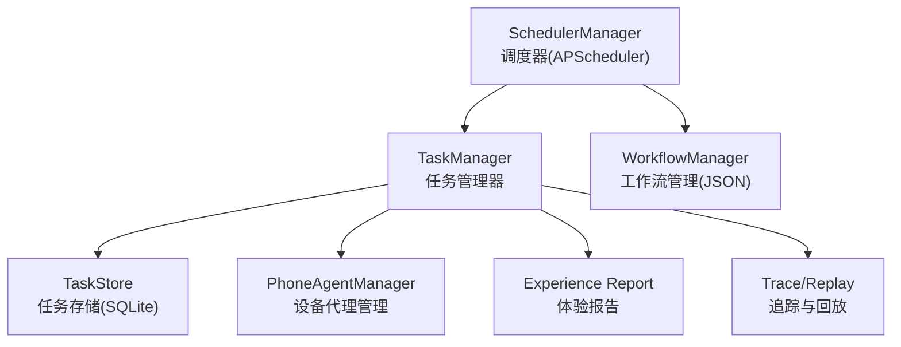
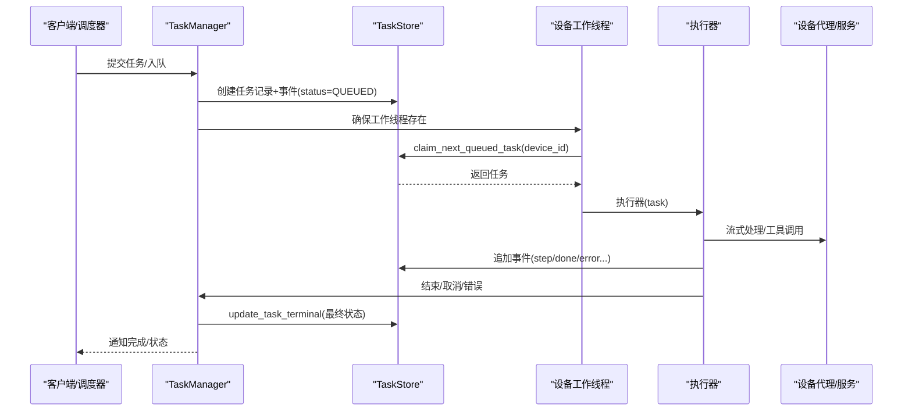
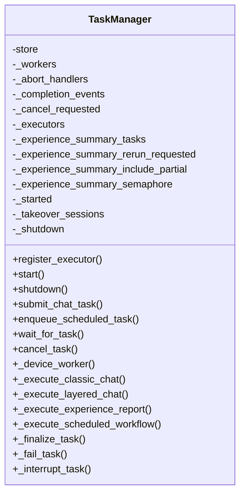
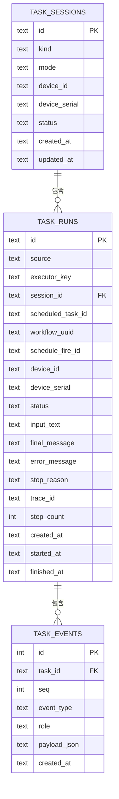
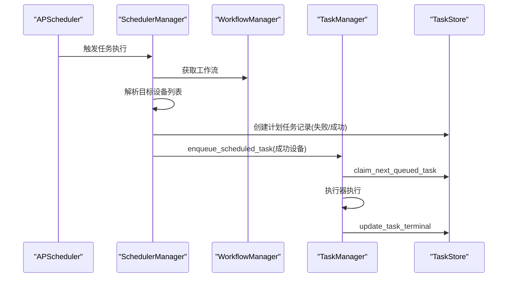
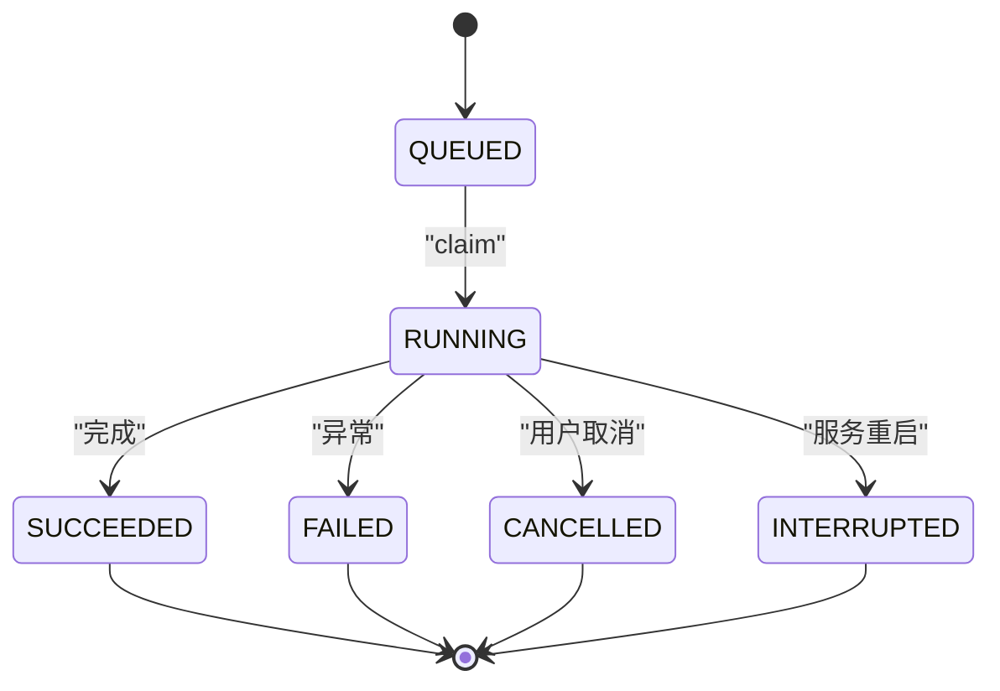
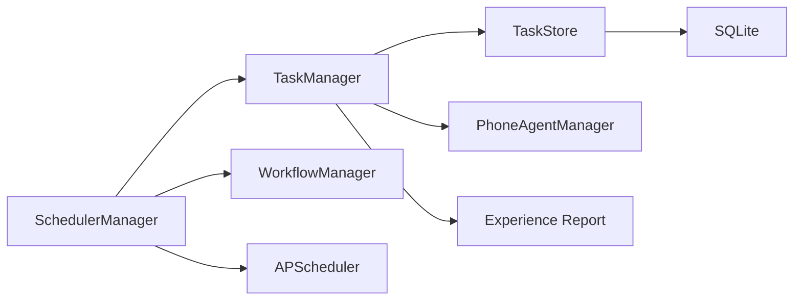

# 任务管理器核心

<cite>
**本文档引用的文件**
- [task_manager.py](file://AutoGLM_GUI/task_manager.py)
- [task_store.py](file://AutoGLM_GUI/task_store.py)
- [scheduler_manager.py](file://AutoGLM_GUI/scheduler_manager.py)
- [workflow_manager.py](file://AutoGLM_GUI/workflow_manager.py)
- [test_task_manager.py](file://tests/test_task_manager.py)
- [test_task_store.py](file://tests/test_task_store.py)
</cite>

## 目录
1. [简介](#简介)
2. [项目结构](#项目结构)
3. [核心组件](#核心组件)
4. [架构总览](#架构总览)
5. [详细组件分析](#详细组件分析)
6. [依赖关系分析](#依赖关系分析)
7. [性能考量](#性能考量)
8. [故障排查指南](#故障排查指南)
9. [结论](#结论)
10. [附录](#附录)

## 简介
本文件面向AutoGLM-GUI的任务管理器核心模块，系统性阐述TaskManager类的实现细节与运行机制，包括任务生命周期管理、执行器注册机制、设备工作线程管理、任务队列与并发控制、任务状态跟踪与事件记录、异常处理与性能监控等。文档通过代码级分析与图示，帮助初学者快速上手，同时为有经验的开发者提供深入的技术参考。

## 项目结构
任务管理器核心位于AutoGLM_GUI目录下，主要由以下模块组成：
- 任务管理器：负责任务调度、执行器分发、设备工作线程、取消与完成通知、体验摘要后台生成等
- 任务存储：基于SQLite的线程安全持久化层，提供任务、会话、事件的CRUD与查询
- 调度器：基于APScheduler的计划任务管理，将计划任务转换为普通任务并入队
- 工作流：工作流定义与持久化，供调度器与任务管理器引用

图表来源
- [task_manager.py:30-80](file://AutoGLM_GUI/task_manager.py#L30-L80)
- [task_store.py:48-80](file://AutoGLM_GUI/task_store.py#L48-L80)
- [scheduler_manager.py:31-55](file://AutoGLM_GUI/scheduler_manager.py#L31-L55)
- [workflow_manager.py:33-52](file://AutoGLM_GUI/workflow_manager.py#L33-L52)

章节来源
- [task_manager.py:30-80](file://AutoGLM_GUI/task_manager.py#L30-L80)
- [task_store.py:48-80](file://AutoGLM_GUI/task_store.py#L48-L80)
- [scheduler_manager.py:31-55](file://AutoGLM_GUI/scheduler_manager.py#L31-L55)
- [workflow_manager.py:33-52](file://AutoGLM_GUI/workflow_manager.py#L33-L52)

## 核心组件
- TaskManager：任务编排与执行的核心，维护每设备一个工作协程，支持多种执行器（经典对话、分层对话、体验报告、计划工作流），提供任务提交、等待、取消、完成通知、体验摘要后台生成等功能。
- TaskStore：线程安全的SQLite存储，提供任务、会话、事件的持久化与查询，支持任务状态变更、事件追加、追踪ID管理、计划任务聚合统计等。
- SchedulerManager：基于APScheduler的计划任务管理器，负责任务的周期触发、设备选择、任务入队与执行结果记录。
- WorkflowManager：工作流的JSON持久化管理，提供增删改查与原子写入。

章节来源
- [task_manager.py:30-80](file://AutoGLM_GUI/task_manager.py#L30-L80)
- [task_store.py:48-80](file://AutoGLM_GUI/task_store.py#L48-L80)
- [scheduler_manager.py:31-55](file://AutoGLM_GUI/scheduler_manager.py#L31-L55)
- [workflow_manager.py:33-52](file://AutoGLM_GUI/workflow_manager.py#L33-L52)

## 架构总览
任务管理器采用“队列驱动 + 设备工作线程”的架构：每个设备拥有独立的工作协程，从队列中取出任务并交由对应执行器执行；执行过程中持续向任务存储追加事件，最终以统一的收尾逻辑完成任务并发出完成信号。

图表来源
- [task_manager.py:615-646](file://AutoGLM_GUI/task_manager.py#L615-L646)
- [task_manager.py:1607-1697](file://AutoGLM_GUI/task_manager.py#L1607-L1697)
- [task_store.py:633-681](file://AutoGLM_GUI/task_store.py#L633-L681)

## 详细组件分析

### TaskManager 类详解
- 角色与职责
  - 维护每设备一个工作协程，按设备隔离任务执行
  - 注册与分发执行器（经典对话、分层对话、体验报告、计划工作流）
  - 任务生命周期管理：创建、入队、claim、执行、事件记录、收尾、完成通知
  - 取消与中断：支持取消排队任务与运行中任务，服务重启时标记运行中任务为中断
  - 体验摘要：按步进边界异步生成体验片段摘要，支持并发限制与重跑
  - 追踪与回放：为任务生成trace_id，记录步骤计时与指标，写入回放数据

- 关键字段与结构
  - store：任务存储实例
  - _workers：设备ID到工作协程的映射
  - _abort_handlers：任务ID到中止处理器的映射
  - _completion_events：任务ID到完成事件的映射
  - _executors：执行器键到执行函数的映射
  - _experience_summary_*：体验摘要并发控制与重跑请求
  - _cancel_requested：请求取消的任务集合
  - _shutdown/_started：启动/关闭状态

- 启动与关闭
  - start：恢复中断任务、扫描队列并为每个设备确保工作协程
  - shutdown：取消所有工作协程与摘要任务，清理状态

- 任务提交与执行
  - submit_chat_task：根据会话模式选择执行器，创建任务并追加用户消息事件
  - enqueue_scheduled_task：计划任务入队
  - _device_worker：循环claim任务并调用对应执行器
  - _execute_classic_chat/_execute_layered_chat/_execute_scheduled_workflow/_execute_experience_report：具体执行器实现

- 取消与完成
  - cancel_task：支持取消排队或运行中的任务，运行中任务通过abort_handler触发
  - _finalize_task/_fail_task/_interrupt_task：统一收尾逻辑，避免重复事件，写入最终状态与回放事件
  - _mark_task_complete：设置完成事件，唤醒等待者

- 体验摘要与并发控制
  - _schedule_experience_summary_for_progress：按步进边界触发摘要生成
  - _ensure_experience_summaries_ready：保证摘要可用，必要时等待后台任务
  - _run_experience_summary_worker：后台摘要生成，受全局信号量限制

- 追踪与指标
  - _record_trace_artifacts：收集步骤计时与总体耗时，写入trace摘要事件并上报指标
  - _finalize_traced_task：在trace上下文中完成收尾并清理trace数据

章节来源
- [task_manager.py:30-80](file://AutoGLM_GUI/task_manager.py#L30-L80)
- [task_manager.py:60-87](file://AutoGLM_GUI/task_manager.py#L60-L87)
- [task_manager.py:141-207](file://AutoGLM_GUI/task_manager.py#L141-L207)
- [task_manager.py:378-402](file://AutoGLM_GUI/task_manager.py#L378-L402)
- [task_manager.py:404-444](file://AutoGLM_GUI/task_manager.py#L404-L444)
- [task_manager.py:456-465](file://AutoGLM_GUI/task_manager.py#L456-L465)
- [task_manager.py:491-530](file://AutoGLM_GUI/task_manager.py#L491-L530)
- [task_manager.py:531-577](file://AutoGLM_GUI/task_manager.py#L531-L577)
- [task_manager.py:579-614](file://AutoGLM_GUI/task_manager.py#L579-L614)
- [task_manager.py:615-646](file://AutoGLM_GUI/task_manager.py#L615-L646)
- [task_manager.py:647-957](file://AutoGLM_GUI/task_manager.py#L647-L957)
- [task_manager.py:959-1108](file://AutoGLM_GUI/task_manager.py#L959-L1108)
- [task_manager.py:1110-1224](file://AutoGLM_GUI/task_manager.py#L1110-L1224)
- [task_manager.py:1226-1281](file://AutoGLM_GUI/task_manager.py#L1226-L1281)
- [task_manager.py:1283-1371](file://AutoGLM_GUI/task_manager.py#L1283-L1371)
- [task_manager.py:1372-1403](file://AutoGLM_GUI/task_manager.py#L1372-L1403)
- [task_manager.py:1405-1605](file://AutoGLM_GUI/task_manager.py#L1405-L1605)
- [task_manager.py:1607-1697](file://AutoGLM_GUI/task_manager.py#L1607-L1697)
- [task_manager.py:1698-1734](file://AutoGLM_GUI/task_manager.py#L1698-L1734)

#### 类关系图

图表来源
- [task_manager.py:30-80](file://AutoGLM_GUI/task_manager.py#L30-L80)
- [task_manager.py:615-646](file://AutoGLM_GUI/task_manager.py#L615-L646)
- [task_manager.py:647-957](file://AutoGLM_GUI/task_manager.py#L647-L957)
- [task_manager.py:959-1108](file://AutoGLM_GUI/task_manager.py#L959-L1108)
- [task_manager.py:1110-1224](file://AutoGLM_GUI/task_manager.py#L1110-L1224)
- [task_manager.py:1405-1605](file://AutoGLM_GUI/task_manager.py#L1405-L1605)
- [task_manager.py:1607-1697](file://AutoGLM_GUI/task_manager.py#L1607-L1697)

### TaskStore 存储层详解
- 角色与职责
  - 任务、会话、事件的CRUD与查询
  - 任务状态枚举与终端状态集合
  - claim_next_queued_task：原子性地将任务置为RUNNING并追加状态事件
  - update_task_terminal：统一收尾，写入最终状态、错误信息、停止原因、步骤数、追踪ID
  - append_event/find_event_by_payload_fields：事件持久化与按负载字段查找
  - mark_running_tasks_interrupted：服务重启时将RUNNING标记为INTERRUPTED
  - 计划任务聚合：统计最近一次调度批次的成功/失败数量与状态

- 并发与一致性
  - 使用RLock保护数据库连接
  - WAL模式与外键开启提升并发与完整性
  - 事务内原子性更新与事件追加

- 索引与查询优化
  - 为会话、任务、事件建立复合索引，加速按设备、状态、时间的查询

章节来源
- [task_store.py:21-40](file://AutoGLM_GUI/task_store.py#L21-L40)
- [task_store.py:48-80](file://AutoGLM_GUI/task_store.py#L48-L80)
- [task_store.py:184-228](file://AutoGLM_GUI/task_store.py#L184-L228)
- [task_store.py:332-360](file://AutoGLM_GUI/task_store.py#L332-L360)
- [task_store.py:445-520](file://AutoGLM_GUI/task_store.py#L445-L520)
- [task_store.py:633-681](file://AutoGLM_GUI/task_store.py#L633-L681)
- [task_store.py:683-780](file://AutoGLM_GUI/task_store.py#L683-L780)
- [task_store.py:782-800](file://AutoGLM_GUI/task_store.py#L782-L800)

#### 数据模型图

图表来源
- [task_store.py:80-145](file://AutoGLM_GUI/task_store.py#L80-L145)

### 调度器与工作流
- SchedulerManager
  - 单例模式，基于APScheduler的Cron触发
  - 加载/保存计划任务JSON，动态增删改任务
  - 解析目标设备（单设备或设备组），在线设备才入队
  - 将计划任务转换为普通任务并入队，记录执行结果

- WorkflowManager
  - 工作流JSON持久化，支持原子写入与mtime缓存
  - 提供增删改查与UUID生成

章节来源
- [scheduler_manager.py:31-55](file://AutoGLM_GUI/scheduler_manager.py#L31-L55)
- [scheduler_manager.py:355-467](file://AutoGLM_GUI/scheduler_manager.py#L355-L467)
- [workflow_manager.py:33-52](file://AutoGLM_GUI/workflow_manager.py#L33-L52)
- [workflow_manager.py:53-134](file://AutoGLM_GUI/workflow_manager.py#L53-L134)

#### 调度执行序列图

图表来源
- [scheduler_manager.py:355-467](file://AutoGLM_GUI/scheduler_manager.py#L355-L467)
- [task_manager.py:378-402](file://AutoGLM_GUI/task_manager.py#L378-L402)
- [task_store.py:633-681](file://AutoGLM_GUI/task_store.py#L633-L681)

### 任务生命周期与状态流转
- 生命周期阶段
  - 创建：create_task_run，初始状态QUEUED，追加status事件
  - 入队：等待设备工作线程claim
  - 运行：claim后置为RUNNING，开始执行器
  - 执行：流式事件（thinking/step/done/error/cancelled等）
  - 收尾：_finalize_task写入最终状态、错误信息、停止原因、步骤数、追踪ID
  - 完成：设置_completion_events，唤醒等待者

- 状态枚举与终端状态
  - QUEUED/RUNNING/SUCCEEDED/FAILED/CANCELLED/INTERRUPTED
  - 终端状态用于等待逻辑与历史归档

- 取消与中断
  - 取消排队：直接标记CANCELLED
  - 取消运行：通过abort_handler触发，最终状态为CANCELLED
  - 服务重启：RUNNING标记为INTERRUPTED

章节来源
- [task_store.py:21-40](file://AutoGLM_GUI/task_store.py#L21-L40)
- [task_store.py:445-520](file://AutoGLM_GUI/task_store.py#L445-L520)
- [task_store.py:633-681](file://AutoGLM_GUI/task_store.py#L633-L681)
- [task_store.py:683-780](file://AutoGLM_GUI/task_store.py#L683-L780)
- [task_manager.py:1607-1697](file://AutoGLM_GUI/task_manager.py#L1607-L1697)

#### 状态机图

图表来源
- [task_store.py:21-40](file://AutoGLM_GUI/task_store.py#L21-L40)
- [task_store.py:633-681](file://AutoGLM_GUI/task_store.py#L633-L681)
- [task_store.py:683-780](file://AutoGLM_GUI/task_store.py#L683-L780)

### 任务队列管理与并发控制
- 队列与工作线程
  - 每设备一个工作协程，FIFO顺序执行该设备的任务
  - start时扫描队列并为每个设备确保工作协程
  - shutdown时取消所有工作协程

- 并发控制
  - 体验摘要生成受全局信号量限制（最大并发=1）
  - _experience_summary_rerun_requested用于重跑请求合并
  - _experience_summary_include_partial用于包含不完整片段的请求

- 事件与等待
  - _completion_events用于任务完成通知
  - wait_for_task支持超时等待终端状态

章节来源
- [task_manager.py:60-87](file://AutoGLM_GUI/task_manager.py#L60-L87)
- [task_manager.py:456-465](file://AutoGLM_GUI/task_manager.py#L456-L465)
- [task_manager.py:1329-1334](file://AutoGLM_GUI/task_manager.py#L1329-L1334)
- [task_manager.py:1310-1327](file://AutoGLM_GUI/task_manager.py#L1310-L1327)
- [task_manager.py:404-418](file://AutoGLM_GUI/task_manager.py#L404-L418)

### 任务状态跟踪与事件记录
- 事件类型
  - status：状态变更事件
  - user_message：用户输入与附件、体验负载
  - thinking/step/done/error/cancelled：执行过程事件
  - trace_summary：追踪摘要事件
  - experience_*：体验相关事件（保留、片段摘要、报告）

- 事件持久化
  - append_event：原子性追加事件，自动分配seq
  - find_event_by_payload_fields：按负载字段查找事件，避免重复
  - 追踪回放：写入replay_task_start/replay_event

- 性能监控
  - 步骤计时与总体耗时计算
  - 指标上报（trace latency metrics）

章节来源
- [task_store.py:294-360](file://AutoGLM_GUI/task_store.py#L294-L360)
- [task_store.py:362-443](file://AutoGLM_GUI/task_store.py#L362-L443)
- [task_manager.py:491-530](file://AutoGLM_GUI/task_manager.py#L491-L530)
- [task_manager.py:531-577](file://AutoGLM_GUI/task_manager.py#L531-L577)
- [task_manager.py:579-614](file://AutoGLM_GUI/task_manager.py#L579-L614)

### 异常处理与容错
- 任务异常
  - _fail_task：追加error事件并收尾为FAILED
  - _interrupt_task：追加error事件并收尾为INTERRUPTED
  - _finalize_task：避免重复事件，写入最终状态与回放事件

- 设备与代理异常
  - DeviceBusyError：标记为FAILED并设置设备错误状态
  - AgentInitializationError：标记为FAILED并提示配置检查

- 取消语义
  - 排队任务：直接取消
  - 运行中任务：通过abort_handler触发，最终状态为CANCELLED
  - 服务关闭：工作协程收到CancelledError时区分用户取消与服务中断

章节来源
- [task_manager.py:1698-1734](file://AutoGLM_GUI/task_manager.py#L1698-L1734)
- [task_manager.py:860-886](file://AutoGLM_GUI/task_manager.py#L860-L886)
- [task_manager.py:1561-1581](file://AutoGLM_GUI/task_manager.py#L1561-L1581)

### 实际使用流程示例（路径引用）
- 提交聊天任务并等待完成
  - 提交：[task_manager.py:141-207](file://AutoGLM_GUI/task_manager.py#L141-L207)
  - 等待：[task_manager.py:404-418](file://AutoGLM_GUI/task_manager.py#L404-L418)
  - 经典执行器：[task_manager.py:647-957](file://AutoGLM_GUI/task_manager.py#L647-L957)
  - 分层执行器：[task_manager.py:959-1108](file://AutoGLM_GUI/task_manager.py#L959-L1108)

- 取消排队任务
  - 取消：[task_manager.py:420-444](file://AutoGLM_GUI/task_manager.py#L420-L444)
  - 存储取消：[task_store.py:735-780](file://AutoGLM_GUI/task_store.py#L735-L780)

- 服务重启恢复
  - 标记中断：[task_store.py:782-800](file://AutoGLM_GUI/task_store.py#L782-L800)
  - 恢复逻辑：[task_manager.py:64-66](file://AutoGLM_GUI/task_manager.py#L64-L66)

- 计划任务入队
  - 入队：[task_manager.py:378-402](file://AutoGLM_GUI/task_manager.py#L378-L402)
  - 调度执行：[scheduler_manager.py:355-467](file://AutoGLM_GUI/scheduler_manager.py#L355-L467)

章节来源
- [task_manager.py:141-207](file://AutoGLM_GUI/task_manager.py#L141-L207)
- [task_manager.py:404-418](file://AutoGLM_GUI/task_manager.py#L404-L418)
- [task_manager.py:647-957](file://AutoGLM_GUI/task_manager.py#L647-L957)
- [task_manager.py:959-1108](file://AutoGLM_GUI/task_manager.py#L959-L1108)
- [task_manager.py:420-444](file://AutoGLM_GUI/task_manager.py#L420-L444)
- [task_store.py:735-780](file://AutoGLM_GUI/task_store.py#L735-L780)
- [task_store.py:782-800](file://AutoGLM_GUI/task_store.py#L782-L800)
- [task_manager.py:378-402](file://AutoGLM_GUI/task_manager.py#L378-L402)
- [scheduler_manager.py:355-467](file://AutoGLM_GUI/scheduler_manager.py#L355-L467)

## 依赖关系分析
- 组件耦合
  - TaskManager依赖TaskStore进行持久化，依赖PhoneAgentManager进行设备代理操作，依赖Experience Report模块生成体验摘要
  - SchedulerManager依赖WorkflowManager获取工作流，依赖TaskManager将计划任务入队
  - TaskStore为所有模块提供统一的数据访问层

- 外部依赖
  - APScheduler：计划任务调度
  - SQLite：本地持久化
  - asyncio：异步并发与事件循环

图表来源
- [task_manager.py:30-80](file://AutoGLM_GUI/task_manager.py#L30-L80)
- [scheduler_manager.py:31-55](file://AutoGLM_GUI/scheduler_manager.py#L31-L55)
- [task_store.py:48-80](file://AutoGLM_GUI/task_store.py#L48-L80)

章节来源
- [task_manager.py:30-80](file://AutoGLM_GUI/task_manager.py#L30-L80)
- [scheduler_manager.py:31-55](file://AutoGLM_GUI/scheduler_manager.py#L31-L55)
- [task_store.py:48-80](file://AutoGLM_GUI/task_store.py#L48-L80)

## 性能考量
- 并发与吞吐
  - 每设备串行执行，跨设备并行，满足设备资源独占需求
  - 体验摘要生成受全局信号量限制，避免过度占用资源

- I/O与存储
  - SQLite WAL模式提升并发写入性能
  - 事件追加与任务收尾均在事务内完成，保证一致性

- 追踪与指标
  - 步骤计时与总体耗时计算，便于性能分析与瓶颈定位
  - 指标上报与trace回放支持离线分析

[本节为通用性能讨论，无需特定文件引用]

## 故障排查指南
- 任务卡死
  - 现象：任务长时间处于RUNNING且无事件
  - 排查：检查abort_handler是否正确注册与注销，确认代理流式处理是否正常结束
  - 参考：[task_manager.py:707-720](file://AutoGLM_GUI/task_manager.py#L707-L720)，[task_manager.py:1068-1074](file://AutoGLM_GUI/task_manager.py#L1068-L1074)

- 内存泄漏
  - 现象：会话结束后资源未释放
  - 处理：archive_session时清理上下文代理，避免残留引用
  - 参考：[task_manager.py:120-139](file://AutoGLM_GUI/task_manager.py#L120-L139)

- 资源竞争
  - 现象：多任务同时访问设备导致冲突
  - 处理：每设备单工作线程串行执行，避免并发冲突
  - 参考：[task_manager.py:615-646](file://AutoGLM_GUI/task_manager.py#L615-L646)

- 体验摘要异常
  - 现象：摘要生成失败或延迟
  - 处理：检查全局信号量与重跑请求，确认后台任务状态
  - 参考：[task_manager.py:1336-1371](file://AutoGLM_GUI/task_manager.py#L1336-L1371)，[task_manager.py:1372-1403](file://AutoGLM_GUI/task_manager.py#L1372-L1403)

- 服务重启后任务状态异常
  - 现象：RUNNING任务未完成
  - 处理：start时自动标记为INTERRUPTED并追加错误事件
  - 参考：[task_store.py:782-800](file://AutoGLM_GUI/task_store.py#L782-L800)，[task_manager.py:64-66](file://AutoGLM_GUI/task_manager.py#L64-L66)

章节来源
- [task_manager.py:120-139](file://AutoGLM_GUI/task_manager.py#L120-L139)
- [task_manager.py:615-646](file://AutoGLM_GUI/task_manager.py#L615-L646)
- [task_manager.py:1336-1371](file://AutoGLM_GUI/task_manager.py#L1336-L1371)
- [task_manager.py:1372-1403](file://AutoGLM_GUI/task_manager.py#L1372-L1403)
- [task_store.py:782-800](file://AutoGLM_GUI/task_store.py#L782-L800)
- [task_manager.py:64-66](file://AutoGLM_GUI/task_manager.py#L64-L66)

## 结论
TaskManager通过队列驱动与设备工作线程实现了高可靠的任务编排，结合TaskStore的强一致存储与事件记录机制，提供了完整的任务生命周期管理能力。配合调度器与工作流管理，系统能够稳定地处理交互式任务与计划任务。通过并发控制、异常处理与追踪回放，系统在可维护性与可观测性方面具备良好工程实践。

[本节为总结性内容，无需特定文件引用]

## 附录
- 测试用例参考
  - 任务队列与取消语义：[test_task_manager.py:14-86](file://tests/test_task_manager.py#L14-L86)，[test_task_manager.py:89-143](file://tests/test_task_manager.py#L89-L143)，[test_task_manager.py:146-196](file://tests/test_task_manager.py#L146-L196)
  - 任务存储与聚合：[test_task_store.py:10-40](file://tests/test_task_store.py#L10-L40)，[test_task_store.py:192-219](file://tests/test_task_store.py#L192-L219)，[test_task_store.py:221-265](file://tests/test_task_store.py#L221-L265)

章节来源
- [test_task_manager.py:14-86](file://tests/test_task_manager.py#L14-L86)
- [test_task_manager.py:89-143](file://tests/test_task_manager.py#L89-L143)
- [test_task_manager.py:146-196](file://tests/test_task_manager.py#L146-L196)
- [test_task_store.py:10-40](file://tests/test_task_store.py#L10-L40)
- [test_task_store.py:192-219](file://tests/test_task_store.py#L192-L219)
- [test_task_store.py:221-265](file://tests/test_task_store.py#L221-L265)