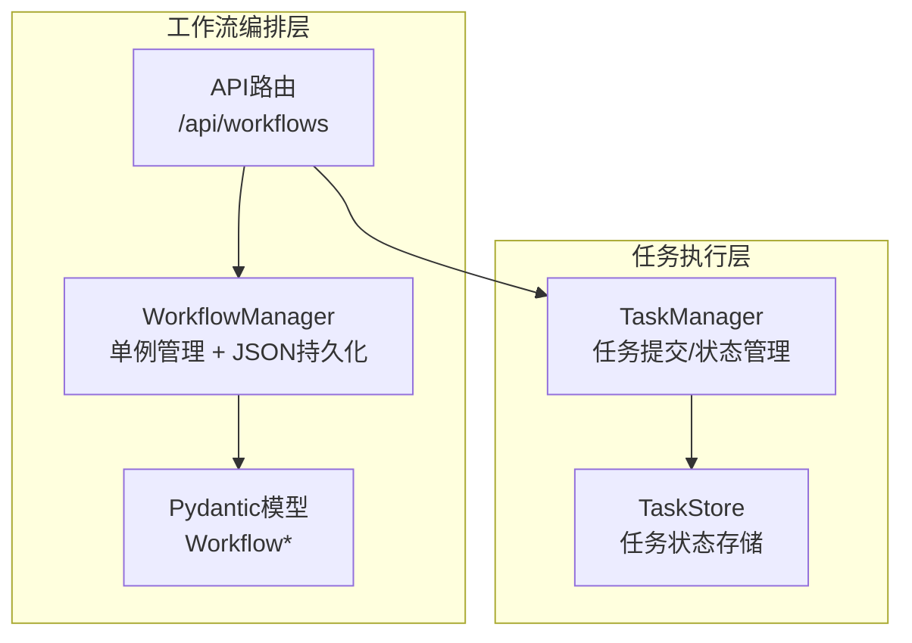
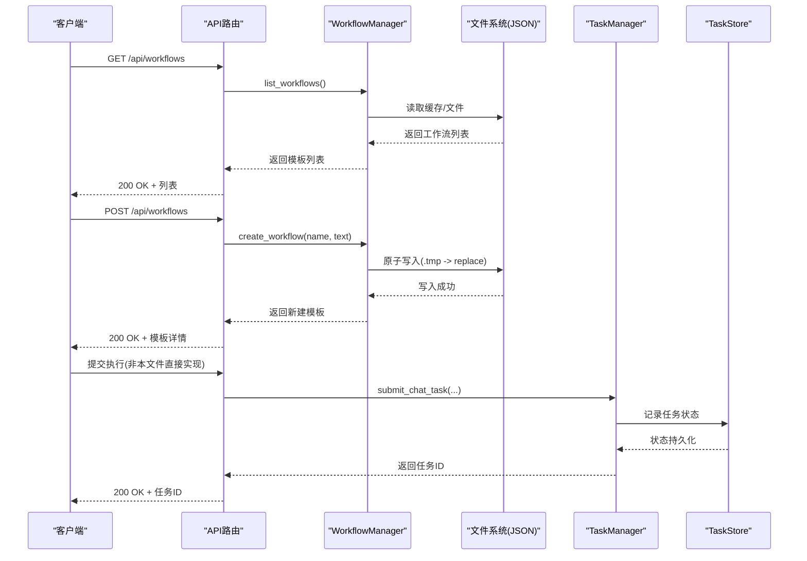
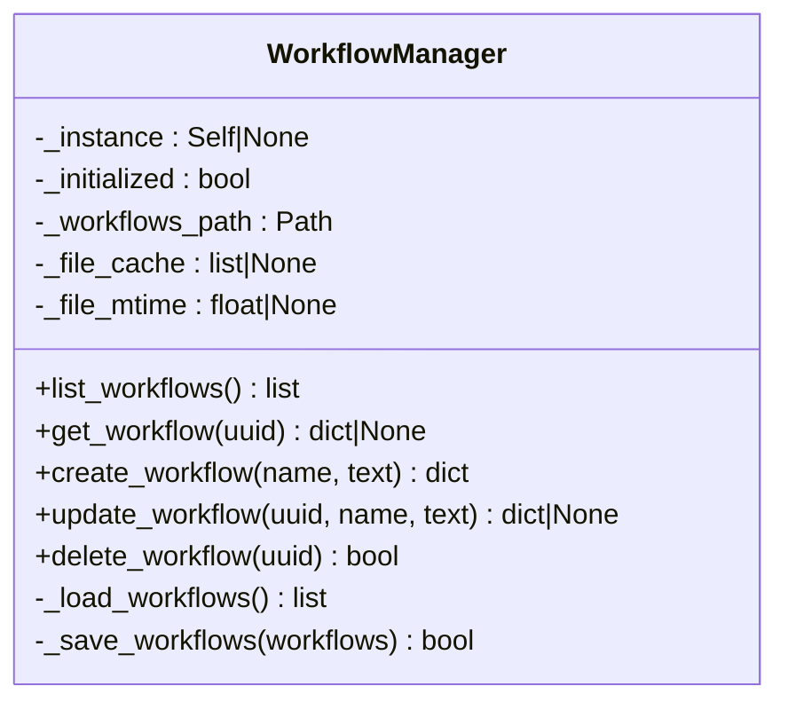
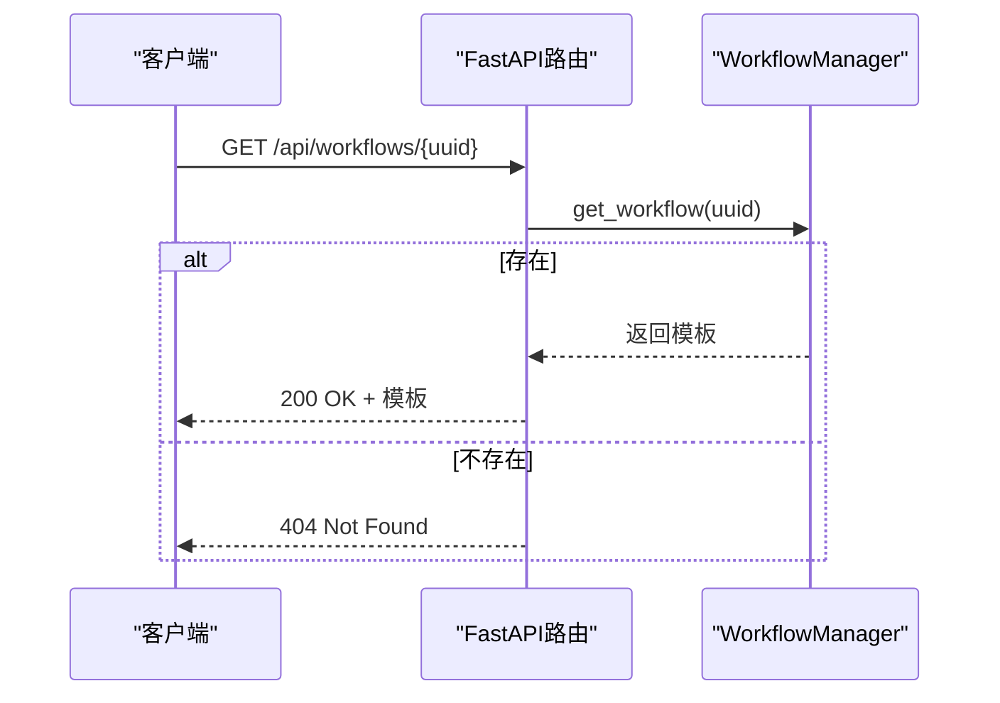
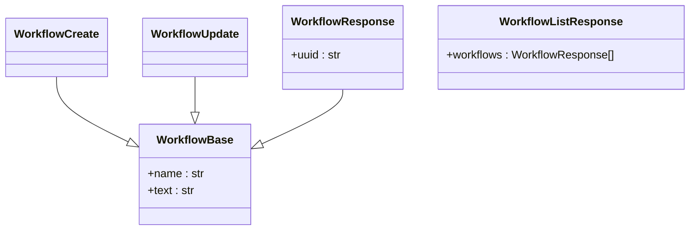
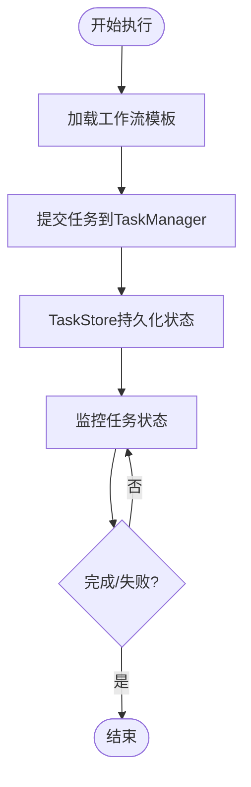
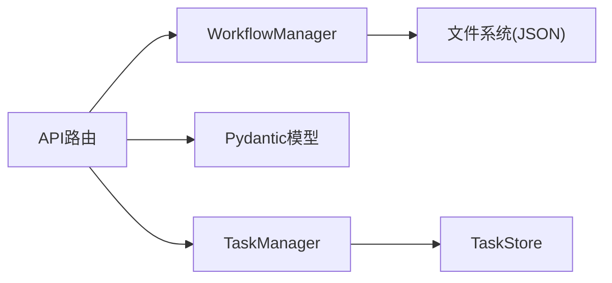

# 工作流编排系统

<cite>
**本文引用的文件**
- [workflow_manager.py](file://AutoGLM_GUI/workflow_manager.py)
- [workflows.py](file://AutoGLM_GUI/api/workflows.py)
- [schemas.py](file://AutoGLM_GUI/schemas.py)
- [task_manager.py](file://AutoGLM_GUI/task_manager.py)
- [task_store.py](file://AutoGLM_GUI/task_store.py)
- [test_workflows_api.py](file://tests/test_workflows_api.py)
</cite>

## 目录
1. [简介](#简介)
2. [项目结构](#项目结构)
3. [核心组件](#核心组件)
4. [架构总览](#架构总览)
5. [详细组件分析](#详细组件分析)
6. [依赖关系分析](#依赖关系分析)
7. [性能考量](#性能考量)
8. [故障排查指南](#故障排查指南)
9. [结论](#结论)
10. [附录](#附录)

## 简介
本文件面向AutoGLM-GUI的工作流编排系统，聚焦WorkflowManager类的实现细节、工作流定义语法、步骤编排机制、条件分支处理等核心功能，并结合实际代码库中的具体实现，解释工作流模板管理、动态执行引擎、状态机转换、错误恢复机制等实现原理。文档同时涵盖工作流与任务系统的集成方式、数据传递机制、并发控制策略等技术细节，并提供常见问题如死锁预防、资源清理、性能优化等解决方案，力求对初学者友好，同时为有经验的开发者提供足够的技术深度。

## 项目结构
工作流编排系统主要由以下模块构成：
- WorkflowManager：工作流模板的持久化存储与单例管理
- API路由：对外暴露REST接口，供前端或外部系统调用
- Pydantic模型：定义工作流的输入输出数据结构
- 任务系统：与工作流执行解耦，通过任务提交与状态管理实现动态执行

图表来源
- [workflow_manager.py:33-196](file://AutoGLM_GUI/workflow_manager.py#L33-L196)
- [workflows.py:17-74](file://AutoGLM_GUI/api/workflows.py#L17-L74)
- [schemas.py:573-618](file://AutoGLM_GUI/schemas.py#L573-L618)
- [task_manager.py](file://AutoGLM_GUI/task_manager.py)
- [task_store.py](file://AutoGLM_GUI/task_store.py)

章节来源
- [workflow_manager.py:33-196](file://AutoGLM_GUI/workflow_manager.py#L33-L196)
- [workflows.py:17-74](file://AutoGLM_GUI/api/workflows.py#L17-L74)
- [schemas.py:573-618](file://AutoGLM_GUI/schemas.py#L573-L618)

## 核心组件
- WorkflowManager：负责工作流模板的增删改查、基于mtime的缓存、原子写入、UUID生成与日志记录
- API路由：提供REST接口，封装WorkflowManager的业务逻辑，并进行HTTP状态码与异常处理
- Pydantic模型：定义工作流的创建、更新、查询与列表响应的数据结构
- 任务系统：通过TaskManager与TaskStore实现任务的提交、跟踪与状态持久化，与工作流模板解耦

章节来源
- [workflow_manager.py:33-196](file://AutoGLM_GUI/workflow_manager.py#L33-L196)
- [workflows.py:17-74](file://AutoGLM_GUI/api/workflows.py#L17-L74)
- [schemas.py:573-618](file://AutoGLM_GUI/schemas.py#L573-L618)

## 架构总览
工作流编排系统采用“模板管理 + 动态执行”的双层架构：
- 模板层：以JSON文件持久化工作流模板，支持单例访问、缓存与原子写入
- 执行层：通过任务系统提交工作流模板对应的执行任务，任务状态在TaskStore中持久化，便于追踪与恢复

图表来源
- [workflows.py:17-74](file://AutoGLM_GUI/api/workflows.py#L17-L74)
- [workflow_manager.py:53-191](file://AutoGLM_GUI/workflow_manager.py#L53-L191)
- [task_manager.py](file://AutoGLM_GUI/task_manager.py)
- [task_store.py](file://AutoGLM_GUI/task_store.py)

## 详细组件分析

### WorkflowManager：模板管理与持久化
- 单例模式：通过私有实例变量保证全局唯一
- JSON持久化：模板存储在用户主目录下的配置路径，使用UTF-8编码
- 基于mtime的缓存：避免重复读取，提升性能
- 原子写入：先写临时文件，再rename替换，防止部分写入导致的数据损坏
- UUID生成：为每个模板分配唯一标识符
- 日志记录：对创建、更新、删除、加载、保存等操作进行日志记录，便于审计与排障

图表来源
- [workflow_manager.py:33-196](file://AutoGLM_GUI/workflow_manager.py#L33-L196)

章节来源
- [workflow_manager.py:33-196](file://AutoGLM_GUI/workflow_manager.py#L33-L196)

### API路由：工作流模板的REST接口
- GET /api/workflows：列出所有工作流模板
- GET /api/workflows/{workflow_uuid}：按UUID获取单个工作流模板
- POST /api/workflows：创建新的工作流模板
- PUT /api/workflows/{workflow_uuid}：更新指定UUID的工作流模板
- DELETE /api/workflows/{workflow_uuid}：删除指定UUID的工作流模板
- 异常处理：未找到模板时返回404，内部错误返回500

图表来源
- [workflows.py:27-35](file://AutoGLM_GUI/api/workflows.py#L27-L35)
- [workflow_manager.py:61-71](file://AutoGLM_GUI/workflow_manager.py#L61-L71)

章节来源
- [workflows.py:17-74](file://AutoGLM_GUI/api/workflows.py#L17-L74)

### Pydantic模型：工作流数据结构
- WorkflowBase：包含name与text字段，提供基础校验（非空、长度限制等）
- WorkflowCreate：创建请求模型
- WorkflowUpdate：更新请求模型
- WorkflowResponse：响应模型，包含uuid
- WorkflowListResponse：列表响应模型

图表来源
- [schemas.py:573-618](file://AutoGLM_GUI/schemas.py#L573-L618)

章节来源
- [schemas.py:573-618](file://AutoGLM_GUI/schemas.py#L573-L618)

### 任务系统集成：工作流与执行引擎
- 工作流模板与任务系统解耦：模板仅负责定义，执行通过任务系统完成
- 任务提交：通过TaskManager提交任务，返回任务ID
- 状态持久化：TaskStore记录任务状态，便于追踪与恢复
- 会话管理：与聊天会话、分层代理等场景结合，统一通过任务系统调度

图表来源
- [task_manager.py](file://AutoGLM_GUI/task_manager.py)
- [task_store.py](file://AutoGLM_GUI/task_store.py)

章节来源
- [task_manager.py](file://AutoGLM_GUI/task_manager.py)
- [task_store.py](file://AutoGLM_GUI/task_store.py)

## 依赖关系分析
- WorkflowManager依赖文件系统与日志模块，提供模板的增删改查与持久化能力
- API路由依赖WorkflowManager与Pydantic模型，负责接口层的参数解析与异常处理
- 任务系统独立于模板层，通过TaskManager与TaskStore实现任务生命周期管理

图表来源
- [workflows.py:17-74](file://AutoGLM_GUI/api/workflows.py#L17-L74)
- [workflow_manager.py:33-196](file://AutoGLM_GUI/workflow_manager.py#L33-L196)
- [schemas.py:573-618](file://AutoGLM_GUI/schemas.py#L573-L618)
- [task_manager.py](file://AutoGLM_GUI/task_manager.py)
- [task_store.py](file://AutoGLM_GUI/task_store.py)

章节来源
- [workflows.py:17-74](file://AutoGLM_GUI/api/workflows.py#L17-L74)
- [workflow_manager.py:33-196](file://AutoGLM_GUI/workflow_manager.py#L33-L196)
- [schemas.py:573-618](file://AutoGLM_GUI/schemas.py#L573-L618)

## 性能考量
- 基于mtime的缓存：减少频繁读取文件的开销，提升列表与查询性能
- 原子写入：避免部分写入导致的数据损坏，提高可靠性
- 单例模式：避免重复实例带来的资源浪费
- 任务系统异步化：通过任务队列与状态持久化，降低执行阻塞风险

## 故障排查指南
- 模板加载失败：检查JSON文件是否损坏或权限不足；查看日志中的警告信息
- 模板保存失败：确认磁盘空间与写权限；关注原子写入过程中的异常
- 接口返回404：确认UUID是否存在；核对模板名称与文本是否符合校验规则
- 接口返回500：检查后端异常堆栈与日志；定位WorkflowManager的保存流程

章节来源
- [workflow_manager.py:158-160](file://AutoGLM_GUI/workflow_manager.py#L158-L160)
- [workflows.py:48-49](file://AutoGLM_GUI/api/workflows.py#L48-L49)

## 结论
AutoGLM-GUI的工作流编排系统通过WorkflowManager实现了模板的可靠持久化与高效缓存，配合API路由与Pydantic模型提供了清晰的REST接口与数据校验。执行层面通过任务系统与TaskStore实现解耦与异步化，具备良好的扩展性与可维护性。建议在生产环境中结合日志监控与异常告警，确保模板与任务的稳定性。

## 附录
- 测试用例参考：可通过测试文件验证工作流API的行为与边界条件

章节来源
- [test_workflows_api.py](file://tests/test_workflows_api.py)