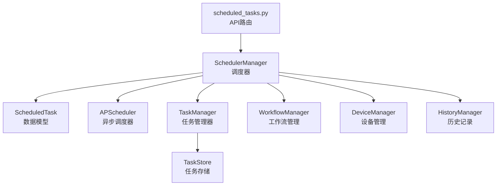
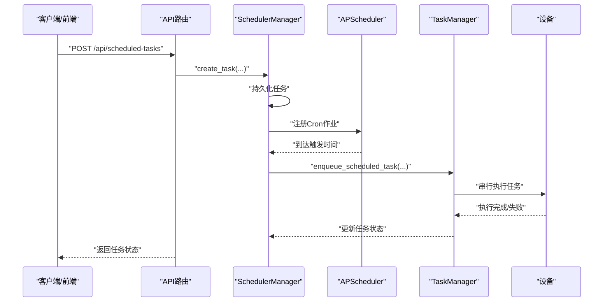
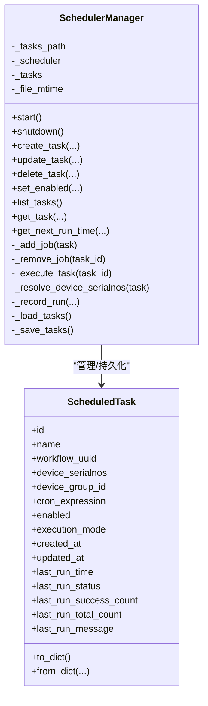
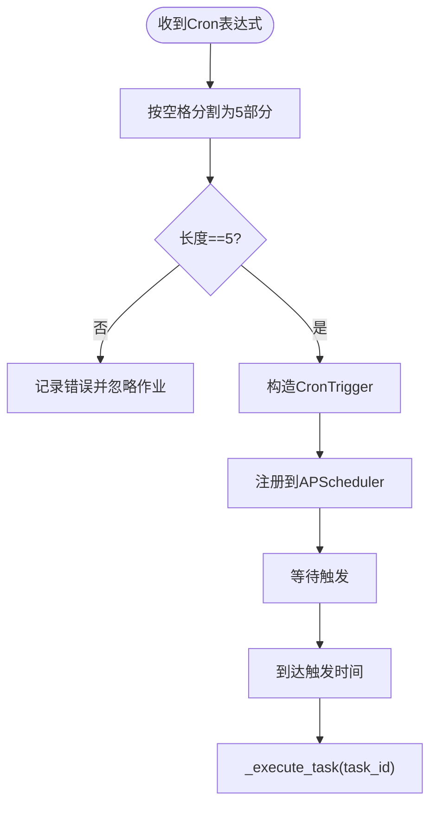
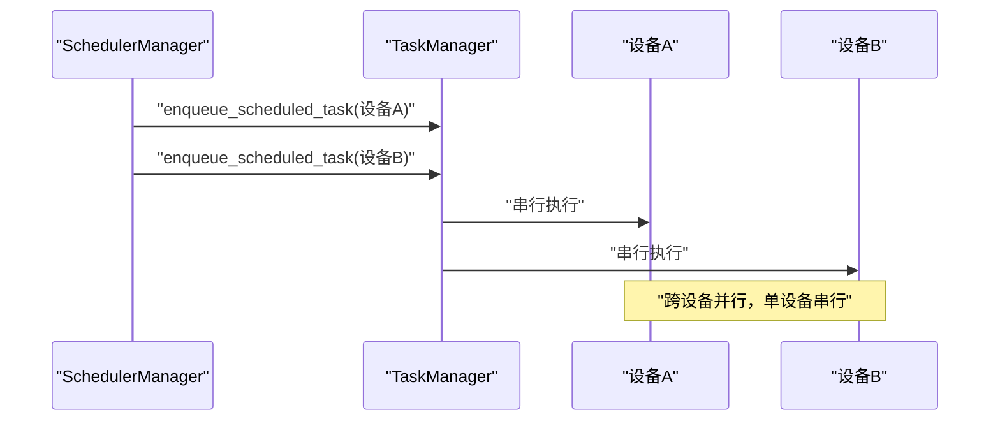
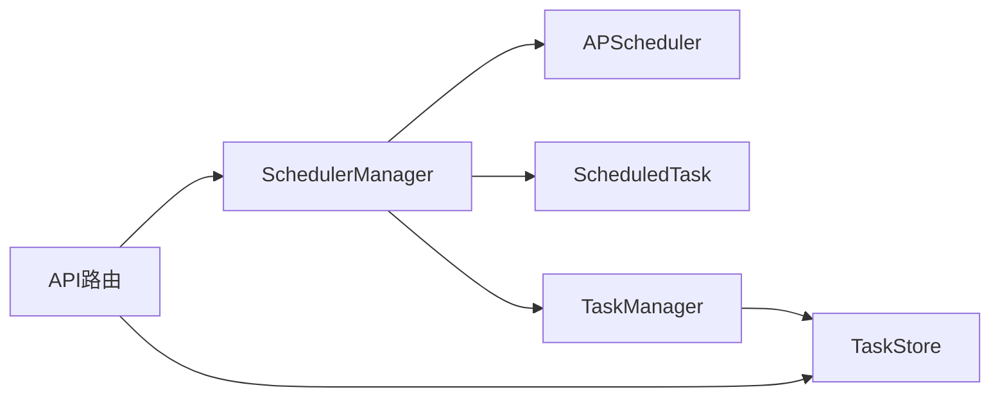

# 调度管理系统

<cite>
**本文引用的文件**
- [scheduler_manager.py](file://AutoGLM_GUI/scheduler_manager.py)
- [scheduled_task.py](file://AutoGLM_GUI/models/scheduled_task.py)
- [task_manager.py](file://AutoGLM_GUI/task_manager.py)
- [scheduled_tasks.py](file://AutoGLM_GUI/api/scheduled_tasks.py)
- [test_scheduler_manager.py](file://tests/test_scheduler_manager.py)
</cite>

## 目录
1. [简介](#简介)
2. [项目结构](#项目结构)
3. [核心组件](#核心组件)
4. [架构总览](#架构总览)
5. [详细组件分析](#详细组件分析)
6. [依赖关系分析](#依赖关系分析)
7. [性能考量](#性能考量)
8. [故障排查指南](#故障排查指南)
9. [结论](#结论)
10. [附录](#附录)

## 简介
本文件面向AutoGLM-GUI的调度管理系统，聚焦SchedulerManager类的实现与工作机制，系统性阐述定时任务调度算法、任务队列管理、调度策略、cron表达式解析、时间计算逻辑、任务优先级与并发控制、调度精度与一致性保障、以及与任务管理器的协作机制。文档同时给出从创建、修改、删除到执行监控的完整流程示例，并讨论时区处理、系统重启恢复、调度延迟等常见问题及解决方案。

## 项目结构
调度系统由以下关键模块组成：
- 调度器：SchedulerManager，负责任务持久化、APScheduler集成、cron解析与作业注册、执行结果记录
- 数据模型：ScheduledTask，描述任务元数据、最近运行统计与序列化
- 任务管理：TaskManager，负责设备级队列、执行器注册、任务派发与生命周期管理
- API层：scheduled_tasks.py，提供REST接口用于任务的增删改查与启停
- 测试：test_scheduler_manager.py，验证调度行为与边界条件

图表来源
- [scheduler_manager.py:31-523](file://AutoGLM_GUI/scheduler_manager.py#L31-L523)
- [scheduled_task.py:30-121](file://AutoGLM_GUI/models/scheduled_task.py#L30-L121)
- [task_manager.py:96-122](file://AutoGLM_GUI/task_manager.py#L96-L122)
- [scheduled_tasks.py:1-137](file://AutoGLM_GUI/api/scheduled_tasks.py#L1-L137)

章节来源
- [scheduler_manager.py:31-523](file://AutoGLM_GUI/scheduler_manager.py#L31-L523)
- [scheduled_task.py:30-121](file://AutoGLM_GUI/models/scheduled_task.py#L30-L121)
- [task_manager.py:96-122](file://AutoGLM_GUI/task_manager.py#L96-L122)
- [scheduled_tasks.py:1-137](file://AutoGLM_GUI/api/scheduled_tasks.py#L1-L137)

## 核心组件
- SchedulerManager：单例调度器，负责任务的创建、更新、删除、启停、持久化、APScheduler作业注册与执行触发
- ScheduledTask：任务数据模型，包含任务元信息、cron表达式、启用状态、执行模式、最近运行统计等
- TaskManager：设备级任务队列与执行器，负责将调度触发的任务派发到具体设备执行
- API层：提供定时任务的REST接口，与调度器交互并返回最新运行摘要

章节来源
- [scheduler_manager.py:31-523](file://AutoGLM_GUI/scheduler_manager.py#L31-L523)
- [scheduled_task.py:30-121](file://AutoGLM_GUI/models/scheduled_task.py#L30-L121)
- [task_manager.py:96-122](file://AutoGLM_GUI/task_manager.py#L96-L122)
- [scheduled_tasks.py:1-137](file://AutoGLM_GUI/api/scheduled_tasks.py#L1-L137)

## 架构总览
调度系统采用“调度器+任务管理器+存储+设备管理”的分层架构。SchedulerManager通过APScheduler在指定时刻触发任务执行；执行时，调度器解析目标设备集合，将任务封装为标准任务并交由TaskManager派发至对应设备；设备侧由TaskManager的设备工作线程串行消费队列并执行具体动作；执行结果写入历史与任务存储，供API查询与前端展示。

图表来源
- [scheduled_tasks.py:76-93](file://AutoGLM_GUI/api/scheduled_tasks.py#L76-L93)
- [scheduler_manager.py:48-58](file://AutoGLM_GUI/scheduler_manager.py#L48-L58)
- [scheduler_manager.py:355-467](file://AutoGLM_GUI/scheduler_manager.py#L355-L467)
- [task_manager.py:467-491](file://AutoGLM_GUI/task_manager.py#L467-L491)

## 详细组件分析

### SchedulerManager：调度器核心
- 单例模式：确保全局唯一调度器实例，避免重复启动与资源竞争
- 任务持久化：使用JSON文件保存任务列表，支持原子写入（临时文件+替换），并记录文件修改时间用于增量加载
- APScheduler集成：使用AsyncIOScheduler，基于CronTrigger解析cron表达式，注册/移除作业
- 任务生命周期管理：创建、更新、删除、启停；更新时自动处理启用状态变更与cron表达式变更导致的作业重建
- 设备解析：支持按设备序列号或设备分组选择目标设备；默认分组表示未分配到其他分组的在线设备
- 执行触发：在触发时刻，解析目标设备、构建执行上下文、派发到TaskManager；记录本次运行统计
- 运行统计：记录最近运行时间、成功/部分/失败状态、成功数量、总数量、消息摘要

图表来源
- [scheduler_manager.py:31-523](file://AutoGLM_GUI/scheduler_manager.py#L31-L523)
- [scheduled_task.py:30-121](file://AutoGLM_GUI/models/scheduled_task.py#L30-L121)

章节来源
- [scheduler_manager.py:31-523](file://AutoGLM_GUI/scheduler_manager.py#L31-L523)
- [scheduled_task.py:30-121](file://AutoGLM_GUI/models/scheduled_task.py#L30-L121)

### ScheduledTask：任务数据模型
- 字段设计：任务标识、名称、关联工作流、目标设备序列号或分组、cron表达式、启用状态、执行模式、创建/更新时间、最近运行统计
- 序列化：to_dict/from_dict支持持久化与版本兼容（向后兼容旧字段）
- 规范化：设备序列号规范化处理，去除重复与空值

章节来源
- [scheduled_task.py:30-121](file://AutoGLM_GUI/models/scheduled_task.py#L30-L121)

### TaskManager：任务队列与执行
- 设备级工作线程：每个设备维护独立工作线程，保证串行执行，避免设备资源竞争
- 执行器注册：支持经典对话与分层对话两种执行器键，调度器按执行模式选择
- 任务派发：enqueue_scheduled_task将调度触发的任务写入存储并唤醒对应设备的工作线程
- 生命周期管理：支持取消、中断、完成事件通知、异常兜底

章节来源
- [task_manager.py:96-122](file://AutoGLM_GUI/task_manager.py#L96-L122)
- [task_manager.py:467-491](file://AutoGLM_GUI/task_manager.py#L467-L491)

### API层：定时任务REST接口
- 列表/创建/查询/更新/删除/启停：提供完整的定时任务管理接口
- 运行摘要：结合调度器与任务存储返回最近运行统计与下次运行时间

章节来源
- [scheduled_tasks.py:1-137](file://AutoGLM_GUI/api/scheduled_tasks.py#L1-L137)

### cron表达式解析与时间计算
- 解析方式：将cron表达式按空格分割为5部分（分钟、小时、日、月、周），构造CronTrigger
- 触发时机：APScheduler在下一匹配时刻调用调度器的执行函数
- 时间精度：调度精度取决于APScheduler的最小粒度与时钟同步；建议使用UTC统一时区以减少歧义

图表来源
- [scheduler_manager.py:156-181](file://AutoGLM_GUI/scheduler_manager.py#L156-L181)
- [scheduler_manager.py:355-366](file://AutoGLM_GUI/scheduler_manager.py#L355-L366)

章节来源
- [scheduler_manager.py:156-181](file://AutoGLM_GUI/scheduler_manager.py#L156-L181)
- [scheduler_manager.py:355-366](file://AutoGLM_GUI/scheduler_manager.py#L355-L366)

### 任务队列管理与调度策略
- 队列模型：TaskManager按设备维度维护队列，设备工作线程串行消费
- 并发控制：单设备单工作线程，避免设备资源争用；跨设备并行
- 优先级：调度器不设置额外优先级；设备队列遵循先进先出
- 负载均衡：通过设备分组与默认分组策略，将任务分散到不同设备集合

图表来源
- [task_manager.py:545-553](file://AutoGLM_GUI/task_manager.py#L545-L553)
- [scheduler_manager.py:403-467](file://AutoGLM_GUI/scheduler_manager.py#L403-L467)

章节来源
- [task_manager.py:545-553](file://AutoGLM_GUI/task_manager.py#L545-L553)
- [scheduler_manager.py:403-467](file://AutoGLM_GUI/scheduler_manager.py#L403-L467)

### 调度器与任务管理器的协作机制
- 触发链路：APScheduler触发SchedulerManager的执行函数，后者解析设备并派发到TaskManager
- 执行器选择：根据任务执行模式选择经典或分层执行器键
- 结果回写：执行完成后记录历史与任务状态，供API查询

章节来源
- [scheduler_manager.py:355-467](file://AutoGLM_GUI/scheduler_manager.py#L355-L467)
- [task_manager.py:115-121](file://AutoGLM_GUI/task_manager.py#L115-L121)

### 故障转移与容错
- 设备离线：调度器检测到离线设备时，记录失败并继续处理其他设备
- 设备忙碌：尝试占用设备失败时，记录失败并释放锁
- 异常兜底：执行过程异常捕获并记录错误，保证不影响调度器稳定性

章节来源
- [scheduler_manager.py:397-463](file://AutoGLM_GUI/scheduler_manager.py#L397-L463)

### 时区处理、系统重启恢复与调度延迟
- 时区：内部统一使用UTC时间戳；下次运行时间查询时移除时区信息以便显示
- 恢复：启动时加载持久化任务并重新注册启用的任务作业
- 延迟：若系统存在瞬时延迟，APScheduler会在后续时刻继续触发；可通过任务存储中的运行摘要进行事后校验

章节来源
- [scheduler_manager.py:48-58](file://AutoGLM_GUI/scheduler_manager.py#L48-L58)
- [scheduler_manager.py:150-154](file://AutoGLM_GUI/scheduler_manager.py#L150-L154)
- [scheduler_manager.py:491-520](file://AutoGLM_GUI/scheduler_manager.py#L491-L520)

## 依赖关系分析
- SchedulerManager依赖APScheduler进行时间触发，依赖ScheduledTask进行数据建模，依赖TaskManager进行任务派发，依赖设备管理与工作流管理获取设备与工作流信息
- TaskManager依赖TaskStore进行任务持久化与队列管理
- API层依赖SchedulerManager与TaskStore提供查询与运行摘要

图表来源
- [scheduler_manager.py:13-17](file://AutoGLM_GUI/scheduler_manager.py#L13-L17)
- [task_manager.py:13-21](file://AutoGLM_GUI/task_manager.py#L13-L21)
- [scheduled_tasks.py:7-15](file://AutoGLM_GUI/api/scheduled_tasks.py#L7-L15)

章节来源
- [scheduler_manager.py:13-17](file://AutoGLM_GUI/scheduler_manager.py#L13-L17)
- [task_manager.py:13-21](file://AutoGLM_GUI/task_manager.py#L13-L21)
- [scheduled_tasks.py:7-15](file://AutoGLM_GUI/api/scheduled_tasks.py#L7-L15)

## 性能考量
- IO与CPU分离：调度器与执行器均通过异步与线程池配合，避免阻塞事件循环
- 原子写入：任务持久化采用临时文件+替换，降低损坏风险
- 串行化执行：设备级串行避免资源争用，提高稳定性
- 增量加载：通过文件mtime判断是否需要重载任务

章节来源
- [scheduler_manager.py:505-520](file://AutoGLM_GUI/scheduler_manager.py#L505-L520)
- [task_manager.py:126-135](file://AutoGLM_GUI/task_manager.py#L126-L135)

## 故障排查指南
- cron表达式无效：检查表达式是否为5段且合法；查看调度器日志中的错误提示
- 任务未触发：确认任务已启用；检查系统时钟与时区；查看任务存储中的运行摘要
- 设备离线/忙碌：确认设备在线状态；调整任务目标设备或等待设备空闲
- 启动后任务丢失：检查任务持久化文件是否存在与可读；确认文件权限
- API返回为空：确认任务ID正确；检查任务存储中是否存在对应任务

章节来源
- [scheduler_manager.py:156-181](file://AutoGLM_GUI/scheduler_manager.py#L156-L181)
- [scheduler_manager.py:491-520](file://AutoGLM_GUI/scheduler_manager.py#L491-L520)
- [scheduled_tasks.py:70-73](file://AutoGLM_GUI/api/scheduled_tasks.py#L70-L73)

## 结论
SchedulerManager通过APScheduler实现了高可靠、易扩展的定时任务调度能力，结合TaskManager的设备级串行执行与任务存储，提供了从创建到执行监控的完整闭环。系统在时区统一、持久化可靠性、设备资源隔离等方面具备良好工程实践，适合在多设备自动化场景中稳定运行。

## 附录

### 完整流程示例（创建-修改-删除-执行监控）
- 创建任务：通过API提交任务请求，调度器创建ScheduledTask并持久化，若启用则注册APScheduler作业
- 修改任务：更新cron表达式或启用状态，调度器自动重建作业或移除旧作业
- 删除任务：从内存与存储中移除任务，并移除对应的APScheduler作业
- 执行监控：通过API查询任务列表与运行摘要，或查询任务的下次运行时间

章节来源
- [scheduled_tasks.py:76-136](file://AutoGLM_GUI/api/scheduled_tasks.py#L76-L136)
- [scheduler_manager.py:60-148](file://AutoGLM_GUI/scheduler_manager.py#L60-L148)
- [scheduler_manager.py:150-154](file://AutoGLM_GUI/scheduler_manager.py#L150-L154)