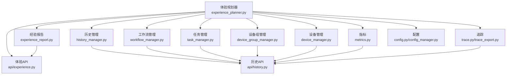
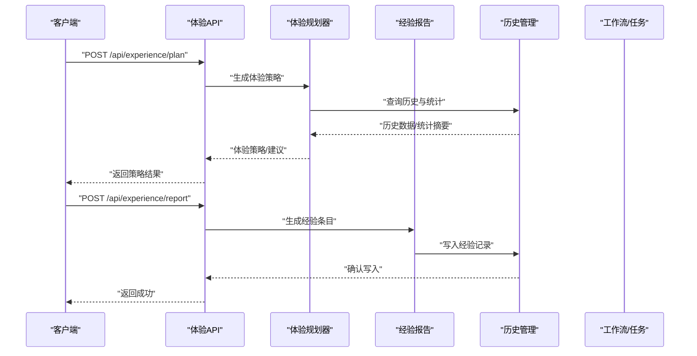
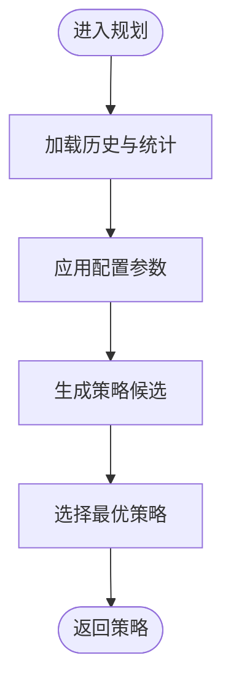
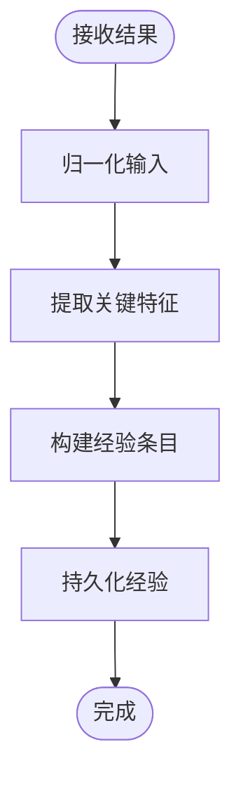
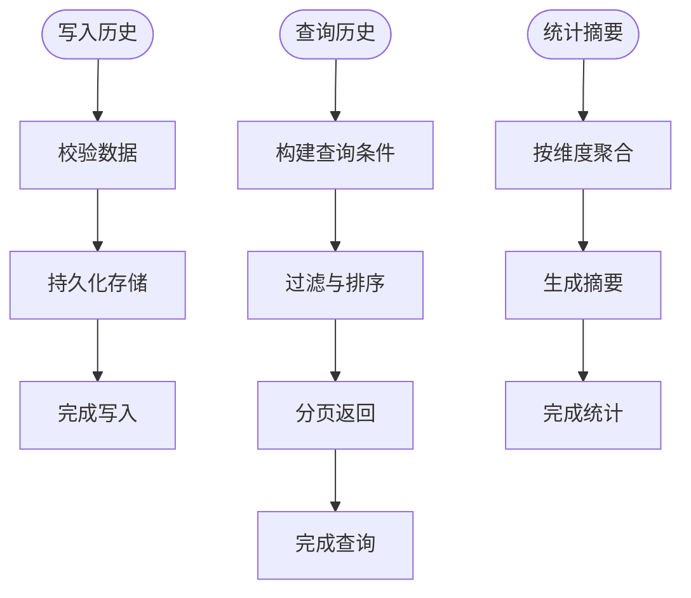
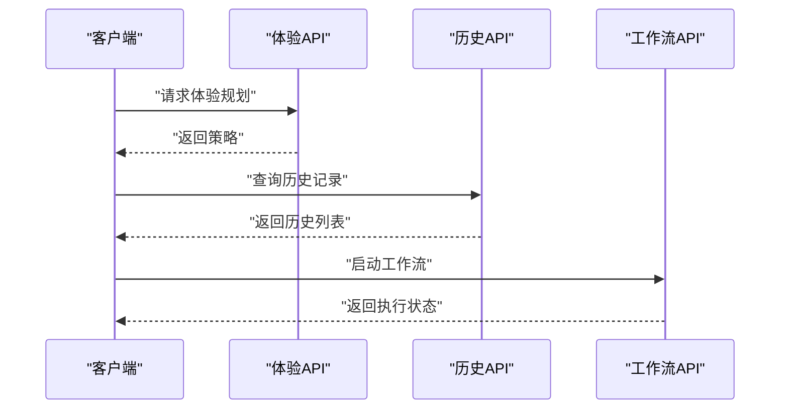
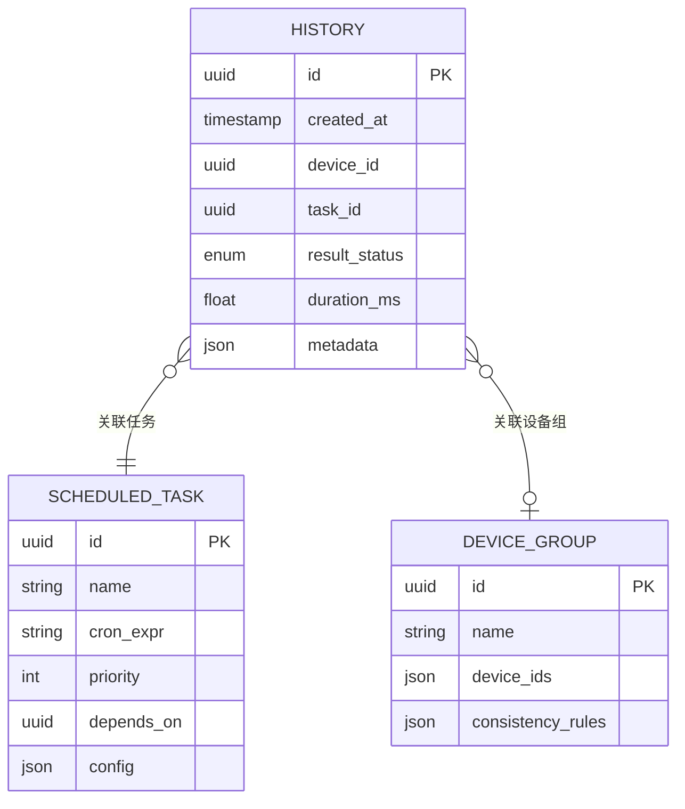
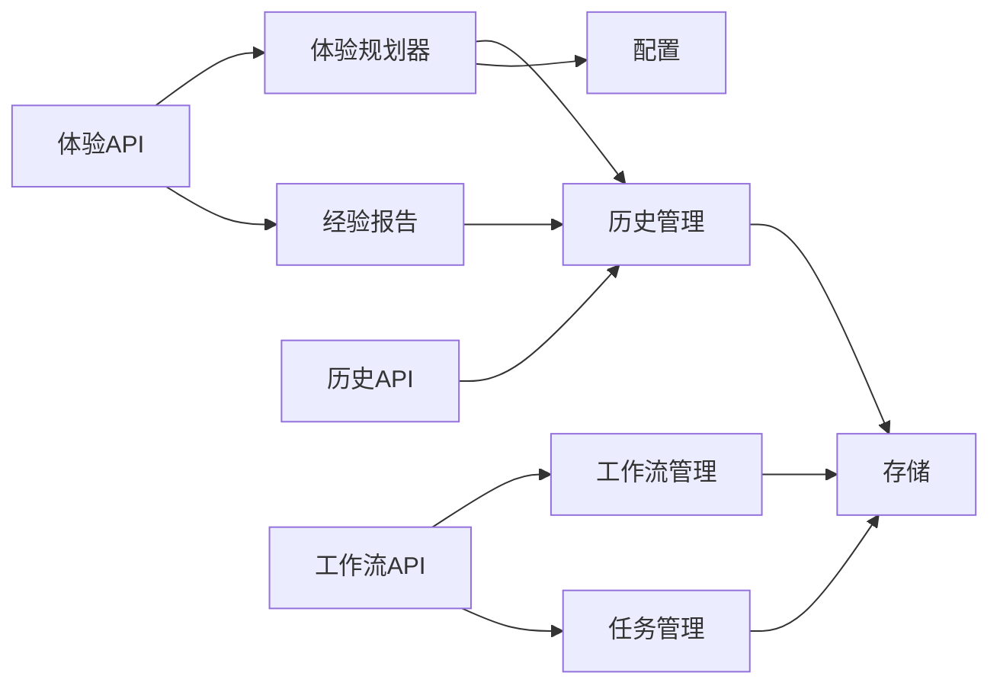

# 体验规划系统

<cite>
**本文档引用的文件**
- [experience_planner.py](file://AutoGLM_GUI/experience_planner.py)
- [experience_report.py](file://AutoGLM_GUI/experience_report.py)
- [history_manager.py](file://AutoGLM_GUI/history_manager.py)
- [models/history.py](file://AutoGLM_GUI/models/history.py)
- [api/experience.py](file://AutoGLM_GUI/api/experience.py)
- [api/history.py](file://AutoGLM_GUI/api/history.py)
- [api/workflows.py](file://AutoGLM_GUI/api/workflows.py)
- [workflow_manager.py](file://AutoGLM_GUI/workflow_manager.py)
- [task_manager.py](file://AutoGLM_GUI/task_manager.py)
- [models/scheduled_task.py](file://AutoGLM_GUI/models/scheduled_task.py)
- [models/device_group.py](file://AutoGLM_GUI/models/device_group.py)
- [device_group_manager.py](file://AutoGLM_GUI/device_group_manager.py)
- [device_manager.py](file://AutoGLM_GUI/device_manager.py)
- [metrics.py](file://AutoGLM_GUI/metrics.py)
- [trace.py](file://AutoGLM_GUI/trace.py)
- [trace_export.py](file://AutoGLM_GUI/trace_export.py)
- [logger.py](file://AutoGLM_GUI/logger.py)
- [exceptions.py](file://AutoGLM_GUI/exceptions.py)
- [schemas.py](file://AutoGLM_GUI/schemas.py)
- [config.py](file://AutoGLM_GUI/config.py)
- [config_manager.py](file://AutoGLM_GUI/config_manager.py)
</cite>

## 目录
1. [简介](#简介)
2. [项目结构](#项目结构)
3. [核心组件](#核心组件)
4. [架构总览](#架构总览)
5. [详细组件分析](#详细组件分析)
6. [依赖关系分析](#依赖关系分析)
7. [性能考虑](#性能考虑)
8. [故障排除指南](#故障排除指南)
9. [结论](#结论)
10. [附录](#附录)

## 简介
本文件面向AutoGLM-GUI的体验规划系统，系统性阐述用户体验规划、经验报告生成与历史记录管理三大核心能力的设计与实现。文档从架构视角出发，结合代码级依赖关系图与流程图，解释算法逻辑、接口契约、数据流与错误处理策略，并给出针对数据丢失、分析偏差、性能瓶颈等常见问题的解决方案。内容兼顾初学者可读性与资深开发者所需的技术深度。

## 项目结构
体验规划系统围绕以下关键模块组织：
- 体验规划器：负责基于历史与上下文生成体验驱动的交互策略
- 经验报告：负责将交互过程与结果转化为可复用的经验条目
- 历史管理：负责历史数据的持久化、检索与统计分析
- 工作流与任务：负责将体验规划转化为可执行的任务序列
- 设备与设备组：负责多设备场景下的体验一致性与分组调度
- 指标与追踪：负责运行时指标采集与事件追踪
- 配置与异常：负责系统参数化与错误处理

图表来源
- [experience_planner.py](file://AutoGLM_GUI/experience_planner.py)
- [experience_report.py](file://AutoGLM_GUI/experience_report.py)
- [history_manager.py](file://AutoGLM_GUI/history_manager.py)
- [api/experience.py](file://AutoGLM_GUI/api/experience.py)
- [api/history.py](file://AutoGLM_GUI/api/history.py)
- [workflow_manager.py](file://AutoGLM_GUI/workflow_manager.py)
- [task_manager.py](file://AutoGLM_GUI/task_manager.py)
- [device_group_manager.py](file://AutoGLM_GUI/device_group_manager.py)
- [device_manager.py](file://AutoGLM_GUI/device_manager.py)
- [metrics.py](file://AutoGLM_GUI/metrics.py)
- [trace.py](file://AutoGLM_GUI/trace.py)
- [trace_export.py](file://AutoGLM_GUI/trace_export.py)
- [config.py](file://AutoGLM_GUI/config.py)
- [config_manager.py](file://AutoGLM_GUI/config_manager.py)

章节来源
- [experience_planner.py](file://AutoGLM_GUI/experience_planner.py)
- [experience_report.py](file://AutoGLM_GUI/experience_report.py)
- [history_manager.py](file://AutoGLM_GUI/history_manager.py)
- [api/experience.py](file://AutoGLM_GUI/api/experience.py)
- [api/history.py](file://AutoGLM_GUI/api/history.py)
- [workflow_manager.py](file://AutoGLM_GUI/workflow_manager.py)
- [task_manager.py](file://AutoGLM_GUI/task_manager.py)
- [device_group_manager.py](file://AutoGLM_GUI/device_group_manager.py)
- [device_manager.py](file://AutoGLM_GUI/device_manager.py)
- [metrics.py](file://AutoGLM_GUI/metrics.py)
- [trace.py](file://AutoGLM_GUI/trace.py)
- [trace_export.py](file://AutoGLM_GUI/trace_export.py)
- [config.py](file://AutoGLM_GUI/config.py)
- [config_manager.py](file://AutoGLM_GUI/config_manager.py)

## 核心组件
- 体验规划器（experience_planner.py）
  - 职责：聚合历史数据、设备状态、任务上下文与指标，输出体验驱动的交互策略与建议
  - 关键输入：历史记录、设备信息、任务会话、指标统计、配置参数
  - 关键输出：体验策略、建议动作、优先级排序、风险评估
- 经验报告（experience_report.py）
  - 职责：将单次交互或任务会话转化为标准化的经验条目，支持后续检索与复用
  - 关键输入：交互轨迹、结果标签、失败原因、耗时统计
  - 关键输出：经验条目对象、归一化的经验模板
- 历史管理（history_manager.py）
  - 职责：维护历史记录的增删改查、统计分析、分页检索与导出
  - 关键输入：历史实体、查询条件、过滤器、排序规则
  - 关键输出：历史列表、统计摘要、分页元数据
- API层
  - 体验API（api/experience.py）：对外暴露体验规划与经验报告的REST接口
  - 历史API（api/history.py）：对外暴露历史记录的CRUD与查询接口
  - 工作流API（api/workflows.py）：与工作流管理器协作，驱动体验规划的执行
- 数据模型
  - 历史模型（models/history.py）：定义历史记录的数据结构与字段约束
  - 计划任务模型（models/scheduled_task.py）：定义定时任务与体验相关的调度项
  - 设备组模型（models/device_group.py）：定义设备分组与体验一致性要求
- 运行支撑
  - 指标与追踪（metrics.py, trace.py, trace_export.py）：采集运行时指标与事件追踪，为体验规划提供数据依据
  - 配置与异常（config.py, config_manager.py, exceptions.py）：统一参数化与错误处理

章节来源
- [experience_planner.py](file://AutoGLM_GUI/experience_planner.py)
- [experience_report.py](file://AutoGLM_GUI/experience_report.py)
- [history_manager.py](file://AutoGLM_GUI/history_manager.py)
- [models/history.py](file://AutoGLM_GUI/models/history.py)
- [api/experience.py](file://AutoGLM_GUI/api/experience.py)
- [api/history.py](file://AutoGLM_GUI/api/history.py)
- [api/workflows.py](file://AutoGLM_GUI/api/workflows.py)
- [models/scheduled_task.py](file://AutoGLM_GUI/models/scheduled_task.py)
- [models/device_group.py](file://AutoGLM_GUI/models/device_group.py)
- [metrics.py](file://AutoGLM_GUI/metrics.py)
- [trace.py](file://AutoGLM_GUI/trace.py)
- [trace_export.py](file://AutoGLM_GUI/trace_export.py)
- [config.py](file://AutoGLM_GUI/config.py)
- [config_manager.py](file://AutoGLM_GUI/config_manager.py)
- [exceptions.py](file://AutoGLM_GUI/exceptions.py)

## 架构总览
体验规划系统采用“策略-执行-反馈”闭环架构：
- 规划阶段：体验规划器基于历史与上下文生成策略
- 执行阶段：工作流与任务管理器将策略转化为具体动作
- 反馈阶段：历史管理器收集结果，经验报告模块沉淀经验
- 分析阶段：指标与追踪模块提供量化依据，优化下一轮规划

图表来源
- [api/experience.py](file://AutoGLM_GUI/api/experience.py)
- [experience_planner.py](file://AutoGLM_GUI/experience_planner.py)
- [experience_report.py](file://AutoGLM_GUI/experience_report.py)
- [history_manager.py](file://AutoGLM_GUI/history_manager.py)
- [api/workflows.py](file://AutoGLM_GUI/api/workflows.py)
- [workflow_manager.py](file://AutoGLM_GUI/workflow_manager.py)
- [task_manager.py](file://AutoGLM_GUI/task_manager.py)

## 详细组件分析

### 体验规划器（experience_planner.py）
- 功能要点
  - 输入融合：设备状态、任务上下文、历史统计、指标趋势、配置参数
  - 策略生成：基于规则与统计阈值输出优先级、动作建议、风险评估
  - 输出格式：结构化策略对象，便于工作流与任务管理器消费
- 关键流程
  - 加载历史与统计摘要
  - 应用配置参数与阈值
  - 生成策略候选集
  - 选择最优策略并返回
- 复杂度与优化
  - 查询复杂度主要受历史记录数量影响，建议按时间窗口与维度索引优化
  - 策略生成可缓存热点场景，减少重复计算

图表来源
- [experience_planner.py](file://AutoGLM_GUI/experience_planner.py)

章节来源
- [experience_planner.py](file://AutoGLM_GUI/experience_planner.py)

### 经验报告（experience_report.py）
- 功能要点
  - 将交互轨迹与结果归一化为经验条目
  - 支持失败原因分类、耗时统计、成功率计算
  - 提供经验模板，便于后续检索与复用
- 关键流程
  - 接收交互结果与上下文
  - 归一化输入，提取关键特征
  - 生成经验条目并持久化
- 复杂度与优化
  - 归一化与模板匹配为O(n)级别，建议建立轻量索引提升检索效率

图表来源
- [experience_report.py](file://AutoGLM_GUI/experience_report.py)

章节来源
- [experience_report.py](file://AutoGLM_GUI/experience_report.py)

### 历史管理（history_manager.py）
- 功能要点
  - 增删改查：提供历史记录的CRUD与批量操作
  - 查询与统计：支持按时间、设备、任务类型、结果状态等维度查询与统计
  - 分页与导出：支持分页检索与导出用于分析
- 关键流程
  - 写入：校验数据完整性，写入存储
  - 查询：构建查询条件，执行过滤与排序
  - 统计：按维度聚合，生成摘要
  - 导出：序列化为标准格式
- 复杂度与优化
  - 查询复杂度与索引设计密切相关，建议在常用查询维度上建立索引
  - 导出可异步化，避免阻塞主线程

图表来源
- [history_manager.py](file://AutoGLM_GUI/history_manager.py)
- [models/history.py](file://AutoGLM_GUI/models/history.py)

章节来源
- [history_manager.py](file://AutoGLM_GUI/history_manager.py)
- [models/history.py](file://AutoGLM_GUI/models/history.py)

### API层（api/experience.py, api/history.py, api/workflows.py）
- 体验API
  - 提供体验规划与经验报告的HTTP接口
  - 参数校验与错误处理遵循统一规范
- 历史API
  - 提供历史记录的CRUD、查询、统计与导出接口
  - 支持分页与过滤参数
- 工作流API
  - 与工作流管理器协作，驱动体验规划的执行
  - 提供任务启动、状态查询与取消控制

图表来源
- [api/experience.py](file://AutoGLM_GUI/api/experience.py)
- [api/history.py](file://AutoGLM_GUI/api/history.py)
- [api/workflows.py](file://AutoGLM_GUI/api/workflows.py)

章节来源
- [api/experience.py](file://AutoGLM_GUI/api/experience.py)
- [api/history.py](file://AutoGLM_GUI/api/history.py)
- [api/workflows.py](file://AutoGLM_GUI/api/workflows.py)

### 数据模型（models/history.py, models/scheduled_task.py, models/device_group.py）
- 历史模型
  - 定义历史记录字段、主键与外键关系
  - 支持时间戳、设备ID、任务ID、结果状态、耗时等字段
- 计划任务模型
  - 定义定时任务与体验相关的调度项
  - 支持周期、优先级、依赖关系等字段
- 设备组模型
  - 定义设备分组与体验一致性要求
  - 支持组内设备同步与一致性检查

图表来源
- [models/history.py](file://AutoGLM_GUI/models/history.py)
- [models/scheduled_task.py](file://AutoGLM_GUI/models/scheduled_task.py)
- [models/device_group.py](file://AutoGLM_GUI/models/device_group.py)

章节来源
- [models/history.py](file://AutoGLM_GUI/models/history.py)
- [models/scheduled_task.py](file://AutoGLM_GUI/models/scheduled_task.py)
- [models/device_group.py](file://AutoGLM_GUI/models/device_group.py)

### 运行支撑（metrics.py, trace.py, trace_export.py, config.py, config_manager.py, exceptions.py）
- 指标与追踪
  - 指标模块：采集关键性能指标，如成功率、平均耗时、错误率
  - 追踪模块：记录事件与调用链，支持导出与可视化
- 配置与异常
  - 配置模块：集中管理系统参数，支持热更新
  - 异常模块：统一异常类型与错误码，便于前端展示与日志定位

章节来源
- [metrics.py](file://AutoGLM_GUI/metrics.py)
- [trace.py](file://AutoGLM_GUI/trace.py)
- [trace_export.py](file://AutoGLM_GUI/trace_export.py)
- [config.py](file://AutoGLM_GUI/config.py)
- [config_manager.py](file://AutoGLM_GUI/config_manager.py)
- [exceptions.py](file://AutoGLM_GUI/exceptions.py)

## 依赖关系分析
- 组件耦合
  - 体验规划器依赖历史管理器与配置模块，耦合度适中
  - 经验报告依赖历史管理器进行持久化，低耦合高内聚
  - API层作为门面，协调各模块交互，避免业务层直连底层存储
- 外部依赖
  - 存储层：历史记录持久化依赖数据库或文件系统
  - 日志与监控：依赖统一的日志与指标系统
- 循环依赖
  - 当前设计避免了循环依赖，模块间通过接口契约解耦

图表来源
- [api/experience.py](file://AutoGLM_GUI/api/experience.py)
- [api/history.py](file://AutoGLM_GUI/api/history.py)
- [api/workflows.py](file://AutoGLM_GUI/api/workflows.py)
- [experience_planner.py](file://AutoGLM_GUI/experience_planner.py)
- [experience_report.py](file://AutoGLM_GUI/experience_report.py)
- [history_manager.py](file://AutoGLM_GUI/history_manager.py)
- [workflow_manager.py](file://AutoGLM_GUI/workflow_manager.py)
- [task_manager.py](file://AutoGLM_GUI/task_manager.py)
- [config.py](file://AutoGLM_GUI/config.py)

章节来源
- [api/experience.py](file://AutoGLM_GUI/api/experience.py)
- [api/history.py](file://AutoGLM_GUI/api/history.py)
- [api/workflows.py](file://AutoGLM_GUI/api/workflows.py)
- [experience_planner.py](file://AutoGLM_GUI/experience_planner.py)
- [experience_report.py](file://AutoGLM_GUI/experience_report.py)
- [history_manager.py](file://AutoGLM_GUI/history_manager.py)
- [workflow_manager.py](file://AutoGLM_GUI/workflow_manager.py)
- [task_manager.py](file://AutoGLM_GUI/task_manager.py)
- [config.py](file://AutoGLM_GUI/config.py)

## 性能考虑
- 查询优化
  - 在历史记录的关键字段（如设备ID、任务ID、时间戳、结果状态）建立索引
  - 对高频查询增加缓存层，降低数据库压力
- 写入优化
  - 批量写入历史记录，减少事务开销
  - 异步化非关键路径（如指标上报、追踪导出）
- 计算优化
  - 策略生成可缓存热点场景，定期清理过期缓存
  - 统计聚合尽量在存储层完成，减少应用层数据搬运
- 并发与锁
  - 历史写入与查询并发控制，避免写放大
  - 使用无锁队列或批处理提升吞吐

## 故障排除指南
- 数据丢失
  - 症状：历史记录缺失、统计不准确
  - 排查：检查写入日志、存储连接状态、事务提交情况
  - 解决：启用重试与补偿机制，确保幂等写入
- 分析偏差
  - 症状：策略推荐不合理、成功率统计失真
  - 排查：核对配置参数、阈值设置、时间窗口范围
  - 解决：引入A/B验证与回滚机制，逐步调整参数
- 性能瓶颈
  - 症状：查询超时、写入延迟上升
  - 排查：监控慢查询、索引命中率、CPU与内存占用
  - 解决：优化索引、拆分表、引入缓存与异步处理
- 错误处理
  - 统一异常类型与错误码，前端友好提示
  - 记录详细上下文与追踪ID，便于定位问题

章节来源
- [exceptions.py](file://AutoGLM_GUI/exceptions.py)
- [logger.py](file://AutoGLM_GUI/logger.py)
- [trace.py](file://AutoGLM_GUI/trace.py)
- [trace_export.py](file://AutoGLM_GUI/trace_export.py)

## 结论
体验规划系统通过“策略-执行-反馈”的闭环设计，将历史数据与实时指标转化为可执行的体验策略，并以经验报告沉淀知识，形成持续优化的机制。通过合理的索引、缓存与异步化策略，系统可在保证准确性的同时满足性能需求。建议在生产环境中配合监控与告警体系，持续迭代配置参数与算法阈值，以获得更佳的用户体验与AI决策质量。

## 附录
- 使用模式
  - 体验规划：通过体验API发起规划请求，接收策略后交由工作流/任务管理器执行
  - 经验报告：在任务完成后生成经验条目，写入历史管理器
  - 历史查询：通过历史API进行检索、统计与导出，支持分页与过滤
- 配置选项
  - 时间窗口：用于限制历史数据的分析范围
  - 阈值参数：用于策略生成的触发条件与权重
  - 缓存策略：用于热点数据的缓存与失效策略
- 返回值
  - 规划结果：包含策略、建议动作、优先级与风险评估
  - 报告结果：包含经验条目ID、模板与统计摘要
  - 查询结果：包含历史列表、统计摘要与分页元数据