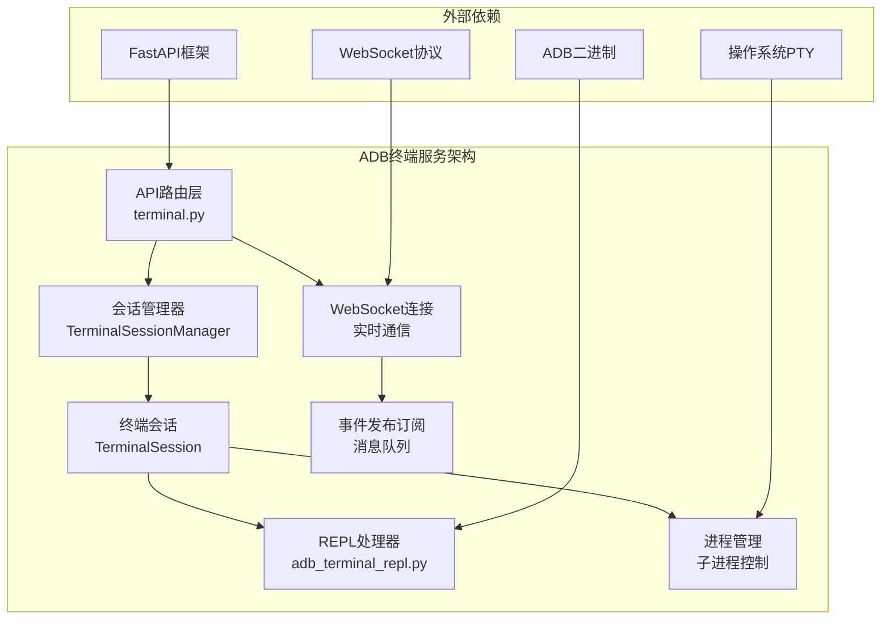
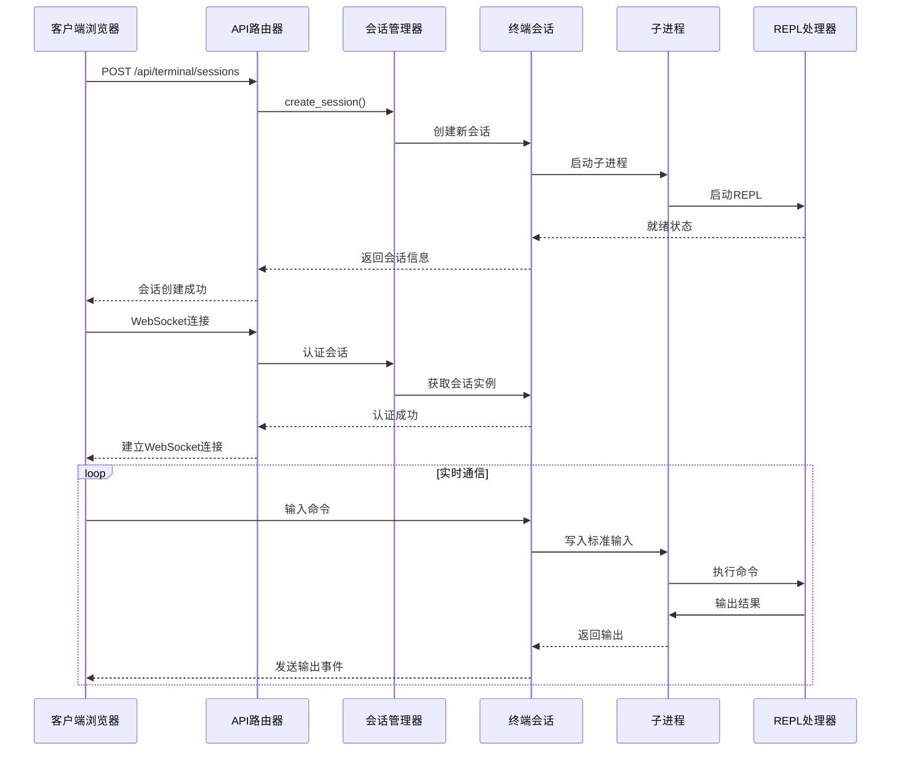
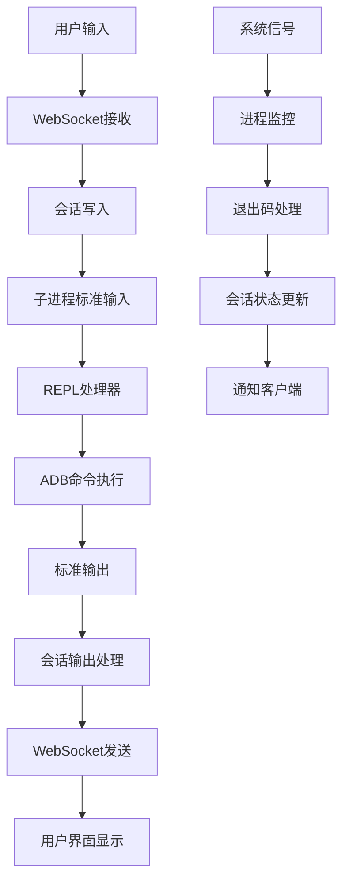
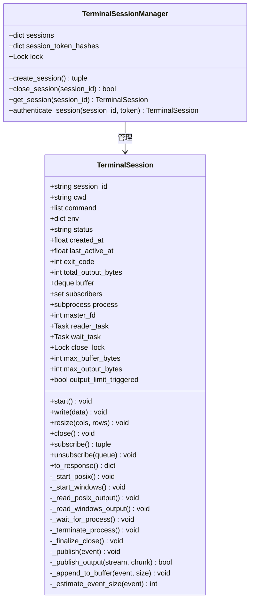
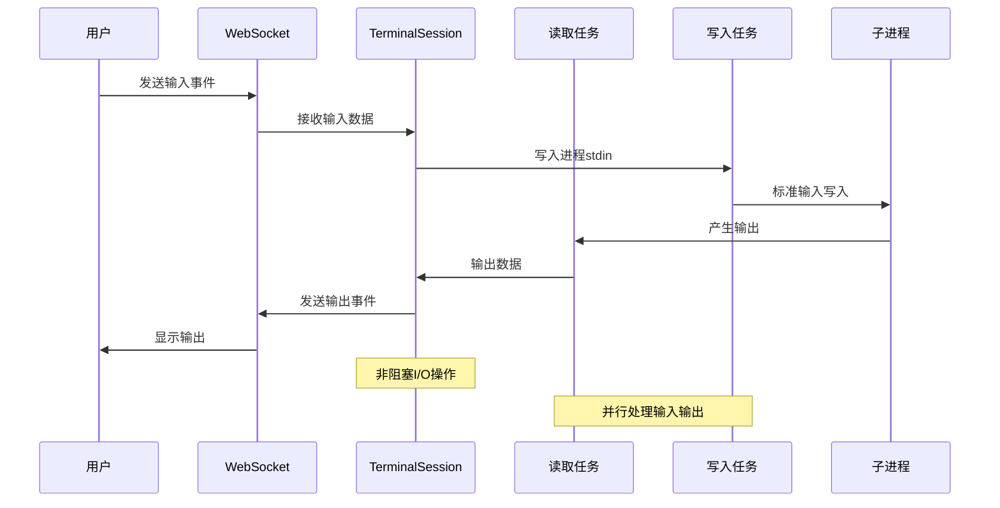
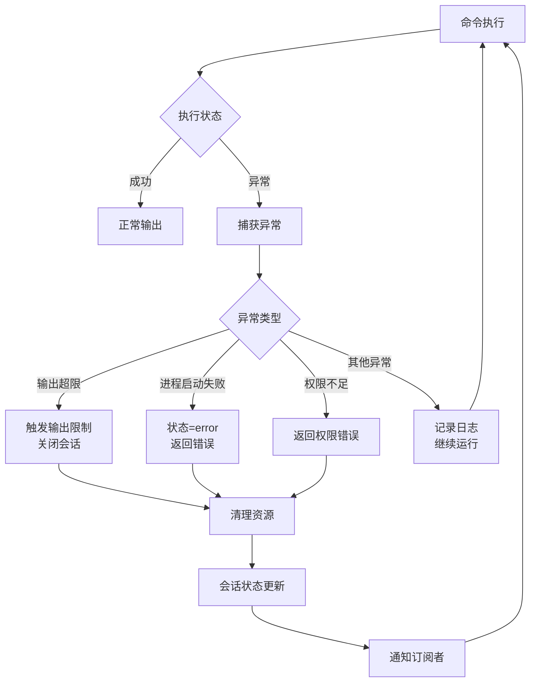
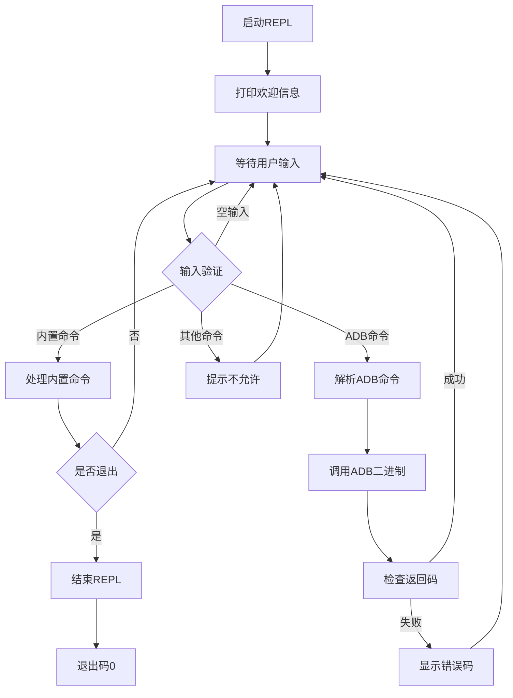
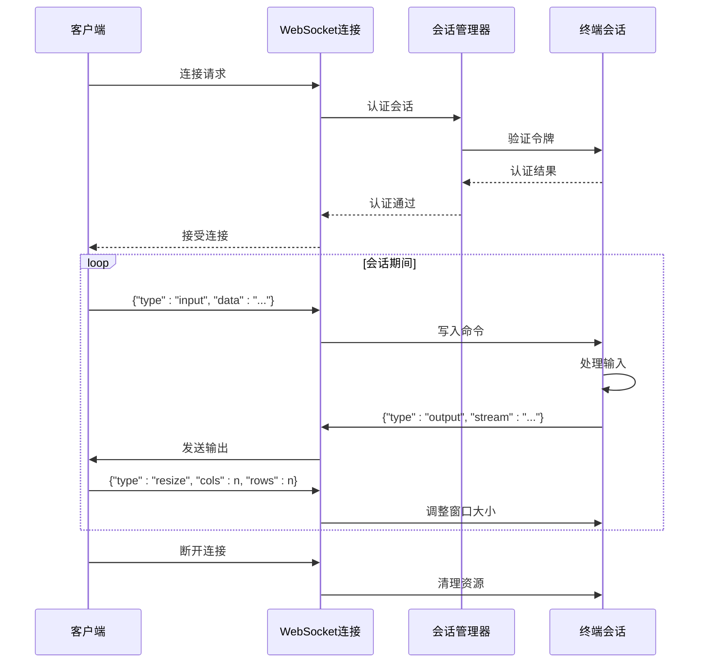
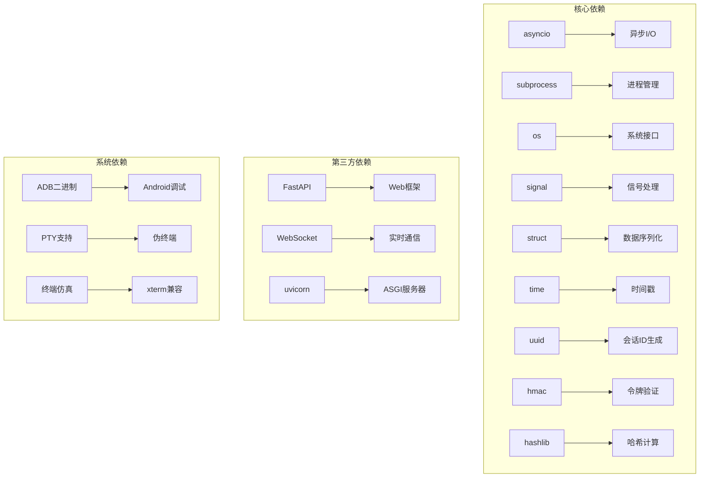

# ADB终端服务

<cite>
**本文档引用的文件**
- [adb_terminal_service.py](file://AutoGLM_GUI/adb_terminal_service.py)
- [adb_terminal_repl.py](file://AutoGLM_GUI/adb_terminal_repl.py)
- [terminal.py](file://AutoGLM_GUI/api/terminal.py)
- [test_terminal_service.py](file://tests/test_terminal_service.py)
- [test_adb_terminal_repl.py](file://tests/test_adb_terminal_repl.py)
- [test_terminal_api.py](file://tests/test_terminal_api.py)
</cite>

## 目录
1. [简介](#简介)
2. [项目结构](#项目结构)
3. [核心组件](#核心组件)
4. [架构概览](#架构概览)
5. [详细组件分析](#详细组件分析)
6. [依赖关系分析](#依赖关系分析)
7. [性能考虑](#性能考虑)
8. [故障排除指南](#故障排除指南)
9. [结论](#结论)
10. [附录](#附录)

## 简介

ADB终端服务是AutoGLM GUI项目中的一个关键组件，它提供了基于Web的ADB（Android Debug Bridge）终端访问能力。该服务允许用户通过浏览器界面与Android设备进行交互，执行ADB命令并实时查看输出结果。

该服务采用异步架构设计，支持跨平台运行（Windows和POSIX系统），具有完善的会话管理、命令解析、输出处理和错误处理机制。服务的核心特性包括：

- **ADB-only模式**：限制用户只能执行ADB相关命令，确保安全性
- **Web终端接口**：通过WebSocket提供实时双向通信
- **会话管理**：支持多用户并发会话，每个会话独立运行
- **输出缓冲**：智能的输出缓冲和内存管理
- **安全认证**：基于令牌的会话认证机制
- **环境隔离**：为每个会话创建独立的执行环境

## 项目结构

ADB终端服务主要由三个核心模块组成：



**图表来源**
- [terminal.py:1-272](file://AutoGLM_GUI/api/terminal.py#L1-L272)
- [adb_terminal_service.py:117-572](file://AutoGLM_GUI/adb_terminal_service.py#L117-L572)
- [adb_terminal_repl.py:1-90](file://AutoGLM_GUI/adb_terminal_repl.py#L1-L90)

**章节来源**
- [adb_terminal_service.py:1-572](file://AutoGLM_GUI/adb_terminal_service.py#L1-L572)
- [terminal.py:1-272](file://AutoGLM_GUI/api/terminal.py#L1-L272)
- [adb_terminal_repl.py:1-90](file://AutoGLM_GUI/adb_terminal_repl.py#L1-L90)

## 核心组件

### 终端会话管理器 (TerminalSessionManager)

TerminalSessionManager是整个终端服务的核心控制器，负责管理所有活跃的终端会话。它提供了以下关键功能：

- **会话创建**：为新请求创建独立的终端会话
- **会话认证**：验证会话令牌的有效性
- **会话生命周期管理**：处理会话的创建、运行、关闭过程
- **并发控制**：使用锁机制确保线程安全

### 终端会话 (TerminalSession)

TerminalSession代表单个用户的终端会话，包含以下核心属性和方法：

- **会话标识**：唯一标识符和所有者令牌哈希
- **进程管理**：启动、监控和终止子进程
- **输入输出处理**：处理用户输入和命令输出
- **状态跟踪**：维护会话状态和活动时间
- **缓冲机制**：管理输出缓冲区和内存使用

### REPL处理器 (adb_terminal_repl)

REPL处理器实现了ADB-only的交互式命令行界面，具有以下特性：

- **命令解析**：使用shlex库安全地解析命令行参数
- **内置命令支持**：支持help、clear、exit、quit等内置命令
- **ADB命令过滤**：只允许执行以"adb"开头的命令
- **错误处理**：优雅处理各种异常情况

**章节来源**
- [adb_terminal_service.py:477-572](file://AutoGLM_GUI/adb_terminal_service.py#L477-L572)
- [adb_terminal_service.py:117-475](file://AutoGLM_GUI/adb_terminal_service.py#L117-L475)
- [adb_terminal_repl.py:1-90](file://AutoGLM_GUI/adb_terminal_repl.py#L1-L90)

## 架构概览

ADB终端服务采用分层架构设计，从上到下分为API层、业务逻辑层和系统集成层：



**图表来源**
- [terminal.py:111-272](file://AutoGLM_GUI/api/terminal.py#L111-L272)
- [adb_terminal_service.py:184-207](file://AutoGLM_GUI/adb_terminal_service.py#L184-L207)
- [adb_terminal_service.py:300-350](file://AutoGLM_GUI/adb_terminal_service.py#L300-L350)

### 数据流架构

服务的数据流遵循严格的单向原则，确保系统的稳定性和可预测性：



**图表来源**
- [terminal.py:245-272](file://AutoGLM_GUI/api/terminal.py#L245-L272)
- [adb_terminal_service.py:419-441](file://AutoGLM_GUI/adb_terminal_service.py#L419-L441)

## 详细组件分析

### 终端会话类 (TerminalSession)

TerminalSession类是服务的核心实现，采用了面向对象的设计模式：



**图表来源**
- [adb_terminal_service.py:117-475](file://AutoGLM_GUI/adb_terminal_service.py#L117-L475)
- [adb_terminal_service.py:477-572](file://AutoGLM_GUI/adb_terminal_service.py#L477-L572)

#### 异步命令处理机制

服务实现了高效的异步命令处理机制，通过事件驱动的方式处理用户输入和系统输出：



**图表来源**
- [adb_terminal_service.py:300-350](file://AutoGLM_GUI/adb_terminal_service.py#L300-L350)
- [adb_terminal_service.py:208-227](file://AutoGLM_GUI/adb_terminal_service.py#L208-L227)

#### 错误处理和恢复机制

服务实现了多层次的错误处理和自动恢复机制：



**图表来源**
- [adb_terminal_service.py:200-206](file://AutoGLM_GUI/adb_terminal_service.py#L200-L206)
- [adb_terminal_service.py:419-441](file://AutoGLM_GUI/adb_terminal_service.py#L419-L441)

**章节来源**
- [adb_terminal_service.py:117-475](file://AutoGLM_GUI/adb_terminal_service.py#L117-L475)
- [adb_terminal_service.py:300-350](file://AutoGLM_GUI/adb_terminal_service.py#L300-L350)
- [adb_terminal_service.py:419-441](file://AutoGLM_GUI/adb_terminal_service.py#L419-L441)

### REPL交互机制

REPL处理器实现了ADB-only的交互式命令行界面：



**图表来源**
- [adb_terminal_repl.py:66-89](file://AutoGLM_GUI/adb_terminal_repl.py#L66-L89)
- [adb_terminal_repl.py:34-64](file://AutoGLM_GUI/adb_terminal_repl.py#L34-L64)

#### 命令解析和验证

REPL处理器使用shlex库进行安全的命令解析，并实现了严格的命令过滤机制：

**章节来源**
- [adb_terminal_repl.py:15-64](file://AutoGLM_GUI/adb_terminal_repl.py#L15-L64)
- [test_adb_terminal_repl.py:38-52](file://tests/test_adb_terminal_repl.py#L38-L52)

### WebSocket通信协议

API层定义了完整的WebSocket通信协议，支持双向实时通信：



**图表来源**
- [terminal.py:181-232](file://AutoGLM_GUI/api/terminal.py#L181-L232)
- [terminal.py:245-272](file://AutoGLM_GUI/api/terminal.py#L245-L272)

**章节来源**
- [terminal.py:181-272](file://AutoGLM_GUI/api/terminal.py#L181-L272)

## 依赖关系分析

ADB终端服务的依赖关系相对简单，主要依赖于Python标准库和FastAPI框架：



**图表来源**
- [adb_terminal_service.py:1-25](file://AutoGLM_GUI/adb_terminal_service.py#L1-L25)
- [terminal.py:10-18](file://AutoGLM_GUI/api/terminal.py#L10-L18)

### 环境变量配置

服务支持多种环境变量配置，用于控制行为和功能：

| 环境变量 | 默认值 | 描述 | 作用域 |
|---------|--------|------|--------|
| AUTOGLM_ENABLE_WEB_TERMINAL | "0" | 启用Web终端功能 | 全局 |
| AUTOGLM_SERVER_HOST | "127.0.0.1" | 服务器主机地址 | 全局 |
| AUTOGLM_CORS_ORIGINS | "http://localhost:3000" | CORS允许的源列表 | 全局 |
| AUTOGLM_ADB_PATH | "adb" | ADB二进制路径 | 会话级 |
| AUTOGLM_PROJECT_ROOT | 自动检测 | 项目根目录 | 会话级 |

**章节来源**
- [terminal.py:32-61](file://AutoGLM_GUI/api/terminal.py#L32-L61)
- [adb_terminal_service.py:82-109](file://AutoGLM_GUI/adb_terminal_service.py#L82-L109)

## 性能考虑

### 内存管理优化

服务实现了智能的内存管理策略，防止内存泄漏和过度占用：

- **输出缓冲限制**：默认最大输出字节数为5MB，超过后自动关闭会话
- **缓冲区大小控制**：默认保留最近200条事件，总大小不超过256KB
- **自动清理机制**：会话关闭时自动释放所有资源

### 并发处理优化

服务采用异步编程模型，支持高并发场景：

- **非阻塞I/O**：使用asyncio实现高效的异步I/O操作
- **任务调度**：合理分配CPU资源给不同的处理任务
- **连接池管理**：避免频繁创建和销毁连接

### 网络传输优化

WebSocket通信经过专门优化，确保低延迟和高吞吐量：

- **事件压缩**：对重复事件进行去重处理
- **批量发送**：将多个小事件合并发送
- **心跳机制**：定期发送ping/pong保持连接活跃

## 故障排除指南

### 常见问题及解决方案

#### ADB二进制找不到

**问题描述**：REPL处理器无法找到ADB二进制文件

**可能原因**：
- ADB未安装或未添加到PATH
- AUTOGLM_ADB_PATH环境变量设置错误
- 权限不足无法执行ADB二进制

**解决方案**：
1. 检查ADB是否正确安装
2. 设置AUTOGLM_ADB_PATH环境变量指向正确的ADB路径
3. 确保ADB二进制具有执行权限

#### 会话创建失败

**问题描述**：无法创建新的终端会话

**可能原因**：
- 工作目录不存在或权限不足
- 系统资源不足
- ADB-only模式限制自定义命令

**解决方案**：
1. 验证工作目录存在且可访问
2. 检查系统资源使用情况
3. 使用默认的ADB命令，不要尝试自定义命令

#### WebSocket连接被拒绝

**问题描述**：客户端无法建立WebSocket连接

**可能原因**：
- 非本地主机访问被阻止
- CORS配置不正确
- 会话令牌无效

**解决方案**：
1. 在本地主机运行客户端或设置AUTOGLM_ENABLE_WEB_TERMINAL=1
2. 配置AUTOGLM_CORS_ORIGINS允许的源
3. 确保使用有效的会话令牌

#### 输出超限错误

**问题描述**：会话因输出过多而自动关闭

**可能原因**：
- 单个命令产生大量输出
- 无限循环或递归命令
- 系统资源限制

**解决方案**：
1. 分批处理大量数据的命令
2. 使用管道和过滤器减少输出
3. 增加max_output_bytes配置（谨慎使用）

**章节来源**
- [test_terminal_service.py:212-233](file://tests/test_terminal_service.py#L212-L233)
- [test_adb_terminal_repl.py:87-104](file://tests/test_adb_terminal_repl.py#L87-L104)
- [terminal.py:79-99](file://AutoGLM_GUI/api/terminal.py#L79-L99)

### 调试和监控

#### 日志记录

服务提供了详细的日志记录机制，便于问题诊断：

- **会话创建和关闭**：记录会话生命周期事件
- **命令执行**：记录命令执行状态和结果
- **错误处理**：记录异常和错误信息
- **性能指标**：记录资源使用情况

#### 性能监控

建议监控以下关键指标：
- 活跃会话数量
- 平均响应时间
- 内存使用率
- CPU使用率
- 错误率统计

## 结论

ADB终端服务是一个设计精良的异步终端管理系统，具有以下突出特点：

**技术优势**：
- **安全性**：ADB-only模式确保了命令执行的安全性
- **可靠性**：完善的错误处理和恢复机制
- **可扩展性**：模块化的架构设计支持功能扩展
- **易用性**：简洁的API和清晰的错误信息

**适用场景**：
- Android设备调试和测试
- 移动应用开发辅助工具
- 远程设备管理和监控
- 自动化脚本执行平台

**未来发展建议**：
- 增加更多的会话管理功能
- 支持更复杂的命令组合
- 提供更丰富的监控和报告功能
- 优化大文件传输和处理能力

该服务为AutoGLM GUI项目提供了强大的终端访问能力，是移动设备开发和测试的重要工具。

## 附录

### API参考

#### 终端会话管理API

| 端点 | 方法 | 功能 | 认证要求 |
|------|------|------|----------|
| /api/terminal/sessions | POST | 创建新会话 | 本地主机或启用标志 |
| /api/terminal/sessions/{session_id} | GET | 获取会话信息 | 会话令牌 |
| /api/terminal/sessions/{session_id} | DELETE | 关闭会话 | 会话令牌 |
| /api/terminal/sessions/{session_id}/stream | WebSocket | 实时通信 | 会话令牌 |

#### WebSocket消息格式

**输入消息**：
```json
{
  "type": "input",
  "data": "adb devices\n"
}
```

**输出消息**：
```json
{
  "type": "output",
  "stream": "stdout",
  "data": "List of devices attached\n"
}
```

**状态消息**：
```json
{
  "type": "status",
  "status": "running"
}
```

### 配置选项

#### 环境变量

- `AUTOGLM_ENABLE_WEB_TERMINAL`: 启用Web终端功能
- `AUTOGLM_SERVER_HOST`: 服务器监听地址
- `AUTOGLM_CORS_ORIGINS`: 允许的CORS源
- `AUTOGLM_ADB_PATH`: ADB二进制路径
- `AUTOGLM_PROJECT_ROOT`: 项目根目录

#### 会话参数

- `cwd`: 工作目录（默认项目根目录）
- `command`: 命令数组（ADB-only模式固定为默认ADB命令）
- `created_by`: 创建者信息
- `origin`: 请求来源