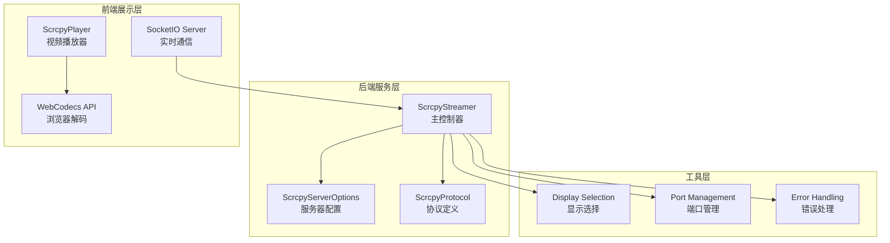
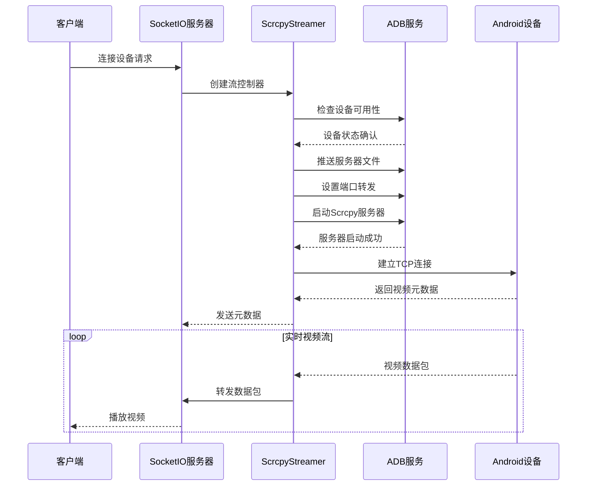
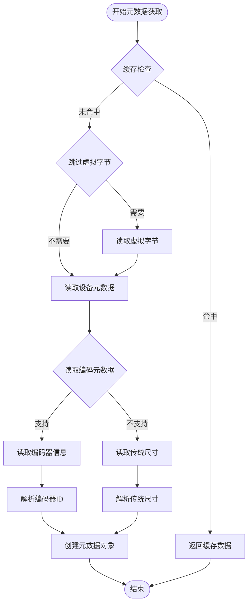
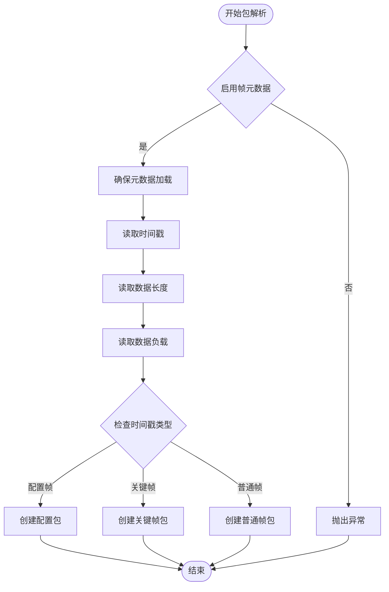
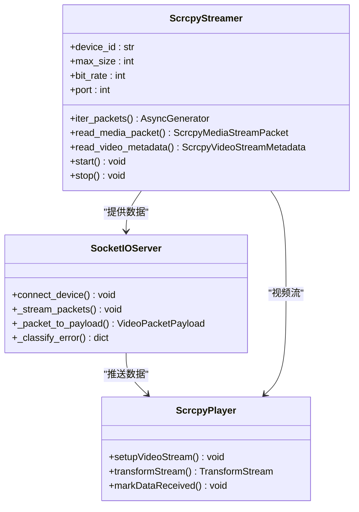
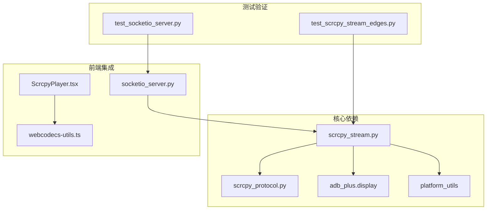

# Scrcpy视频流传输

<cite>
**本文档引用的文件**
- [scrcpy_stream.py](file://AutoGLM_GUI/scrcpy_stream.py)
- [scrcpy_protocol.py](file://AutoGLM_GUI/scrcpy_protocol.py)
- [socketio_server.py](file://AutoGLM_GUI/socketio_server.py)
- [ScrcpyPlayer.tsx](file://frontend/src/components/ScrcpyPlayer.tsx)
- [webcodecs-utils.ts](file://frontend/src/lib/webcodecs-utils.ts)
- [test_scrcpy_stream_edges.py](file://tests/test_scrcpy_stream_edges.py)
- [test_socketio_server.py](file://tests/test_socketio_server.py)
</cite>

## 目录
1. [简介](#简介)
2. [项目结构](#项目结构)
3. [核心组件](#核心组件)
4. [架构概览](#架构概览)
5. [详细组件分析](#详细组件分析)
6. [依赖关系分析](#依赖关系分析)
7. [性能考虑](#性能考虑)
8. [故障排除指南](#故障排除指南)
9. [结论](#结论)

## 简介

Scrcpy视频流传输系统是一个基于Scrcpy协议的实时视频流传输解决方案，专门用于Android设备的屏幕镜像和控制。该系统通过ADB（Android Debug Bridge）建立设备连接，启动Scrcpy服务器进程，然后通过TCP套接字传输视频数据包。

本系统实现了完整的视频流生命周期管理，包括设备检测、服务器启动、端口转发、连接建立、数据解析和资源清理等核心功能。系统支持多种视频编码格式（H.264、H.265、AV1），可配置的分辨率和比特率，以及智能的错误处理和重试机制。

## 项目结构

Scrcpy视频流传输系统主要由以下核心模块组成：

**图表来源**
- [scrcpy_stream.py:119-156](file://AutoGLM_GUI/scrcpy_stream.py#L119-L156)
- [scrcpy_protocol.py:23-45](file://AutoGLM_GUI/scrcpy_protocol.py#L23-L45)
- [socketio_server.py:148-214](file://AutoGLM_GUI/socketio_server.py#L148-L214)

**章节来源**
- [scrcpy_stream.py:1-629](file://AutoGLM_GUI/scrcpy_stream.py#L1-L629)
- [scrcpy_protocol.py:1-46](file://AutoGLM_GUI/scrcpy_protocol.py#L1-L46)

## 核心组件

### ScrcpyStreamer类

ScrcpyStreamer是整个系统的核心控制器，负责管理Scrcpy服务器的完整生命周期。该类实现了异步操作，确保在高并发环境下仍能稳定运行。

**主要职责：**
- 设备可用性检查和显示选择
- Scrcpy服务器进程管理和清理
- ADB端口转发设置
- TCP套接字连接和数据读取
- 视频元数据解析和媒体包处理
- 资源清理和异常处理

**关键特性：**
- 智能重试机制：支持多次启动尝试和端口冲突处理
- 异步I/O：使用asyncio进行非阻塞网络操作
- 缓冲管理：内置读取缓冲区优化内存使用
- 错误分类：统一的错误类型识别和处理

**章节来源**
- [scrcpy_stream.py:119-156](file://AutoGLM_GUI/scrcpy_stream.py#L119-L156)
- [scrcpy_stream.py:203-245](file://AutoGLM_GUI/scrcpy_stream.py#L203-L245)

### Scrcpy协议定义

系统采用标准化的Scrcpy协议，定义了视频流的数据格式和传输规范。

**协议要素：**
- **编码格式支持**：H.264、H.265、AV1三种主流视频编码
- **时间戳格式**：64位时间戳，支持配置帧和关键帧标记
- **数据包结构**：统一的头部格式，包含类型、长度和负载
- **元数据格式**：设备信息、分辨率、编码参数等

**章节来源**
- [scrcpy_protocol.py:7-21](file://AutoGLM_GUI/scrcpy_protocol.py#L7-L21)
- [scrcpy_protocol.py:23-45](file://AutoGLM_GUI/scrcpy_protocol.py#L23-L45)

## 架构概览

系统采用分层架构设计，确保各组件职责清晰、耦合度低。

**图表来源**
- [socketio_server.py:148-214](file://AutoGLM_GUI/socketio_server.py#L148-L214)
- [scrcpy_stream.py:203-245](file://AutoGLM_GUI/scrcpy_stream.py#L203-L245)

## 详细组件分析

### 视频元数据获取机制

系统实现了灵活的视频元数据获取策略，支持多种数据格式和兼容性处理。

**图表来源**
- [scrcpy_stream.py:496-539](file://AutoGLM_GUI/scrcpy_stream.py#L496-L539)

**章节来源**
- [scrcpy_stream.py:496-539](file://AutoGLM_GUI/scrcpy_stream.py#L496-L539)
- [test_scrcpy_stream_edges.py:256-283](file://tests/test_scrcpy_stream_edges.py#L256-L283)

### 媒体包解析流程

系统实现了高效的媒体包解析机制，支持配置帧和数据帧的区分处理。

**图表来源**
- [scrcpy_stream.py:541-571](file://AutoGLM_GUI/scrcpy_stream.py#L541-L571)

**章节来源**
- [scrcpy_stream.py:541-571](file://AutoGLM_GUI/scrcpy_stream.py#L541-L571)

### 异步数据流处理

系统采用异步编程模型，确保高并发场景下的稳定性和性能。

**图表来源**
- [scrcpy_stream.py:119-156](file://AutoGLM_GUI/scrcpy_stream.py#L119-L156)
- [socketio_server.py:125-214](file://AutoGLM_GUI/socketio_server.py#L125-L214)
- [ScrcpyPlayer.tsx:226-247](file://frontend/src/components/ScrcpyPlayer.tsx#L226-L247)

**章节来源**
- [socketio_server.py:125-214](file://AutoGLM_GUI/socketio_server.py#L125-L214)
- [ScrcpyPlayer.tsx:226-247](file://frontend/src/components/ScrcpyPlayer.tsx#L226-L247)

### 错误分类机制

系统实现了完善的错误分类和处理机制，能够准确识别和处理各种异常情况。

**错误类型分类：**
- **端口冲突**：Address already in use
- **设备离线**：Device not found
- **连接超时**：Connection timeout
- **启动失败**：Server startup error
- **未知错误**：其他未识别错误

**章节来源**
- [test_socketio_server.py:43-63](file://tests/test_socketio_server.py#L43-L63)
- [scrcpy_stream.py:396-423](file://AutoGLM_GUI/scrcpy_stream.py#L396-L423)

## 依赖关系分析

系统采用模块化设计，各组件之间的依赖关系清晰明确。

**图表来源**
- [scrcpy_stream.py:14-30](file://AutoGLM_GUI/scrcpy_stream.py#L14-L30)
- [socketio_server.py:148-214](file://AutoGLM_GUI/socketio_server.py#L148-L214)

**章节来源**
- [scrcpy_stream.py:14-30](file://AutoGLM_GUI/scrcpy_stream.py#L14-L30)
- [socketio_server.py:148-214](file://AutoGLM_GUI/socketio_server.py#L148-L214)

## 性能考虑

### 内存管理优化

系统实现了高效的内存管理策略，包括：
- **缓冲区复用**：使用bytearray减少内存分配
- **异步I/O**：避免阻塞操作影响整体性能
- **连接池管理**：合理管理TCP连接生命周期

### 网络传输优化

- **套接字缓冲区**：动态调整接收缓冲区大小
- **指数退避**：连接失败时采用指数退避策略
- **超时控制**：合理的超时设置平衡响应速度和稳定性

### 解码性能优化

前端使用WebCodecs API进行硬件加速解码，支持：
- **自动硬件加速**：优先使用GPU解码
- **错误恢复**：解码失败时的自动重试机制
- **性能监控**：实时监控解码性能指标

## 故障排除指南

### 常见问题及解决方案

**端口冲突问题**
- **症状**：启动时提示端口被占用
- **原因**：已有Scrcpy实例在运行
- **解决方案**：执行清理程序或更换端口号

**设备离线问题**
- **症状**：无法检测到Android设备
- **原因**：USB连接断开或驱动问题
- **解决方案**：重新连接设备或安装正确驱动

**连接超时问题**
- **症状**：建立连接时超时
- **原因**：网络延迟或设备处理能力不足
- **解决方案**：增加超时时间或降低视频质量

**章节来源**
- [scrcpy_stream.py:396-423](file://AutoGLM_GUI/scrcpy_stream.py#L396-L423)
- [test_socketio_server.py:43-63](file://tests/test_socketio_server.py#L43-L63)

### 调试技巧

1. **启用详细日志**：查看系统日志了解具体错误信息
2. **检查网络连接**：确保ADB服务正常运行
3. **验证设备权限**：确认设备已授权调试权限
4. **监控资源使用**：观察内存和CPU使用情况

## 结论

Scrcpy视频流传输系统是一个功能完整、架构清晰的实时视频传输解决方案。系统通过模块化设计实现了高度的可维护性和扩展性，同时通过异步编程和优化的算法确保了良好的性能表现。

系统的主要优势包括：
- **完整的生命周期管理**：从设备检测到资源清理的全流程自动化
- **灵活的配置选项**：支持多种编码格式和参数调整
- **强大的错误处理**：完善的错误分类和恢复机制
- **优秀的性能表现**：高效的内存管理和网络传输优化

对于初学者，系统提供了清晰的API接口和详细的文档说明；对于经验丰富的开发者，系统展示了现代异步编程的最佳实践和企业级软件的设计理念。