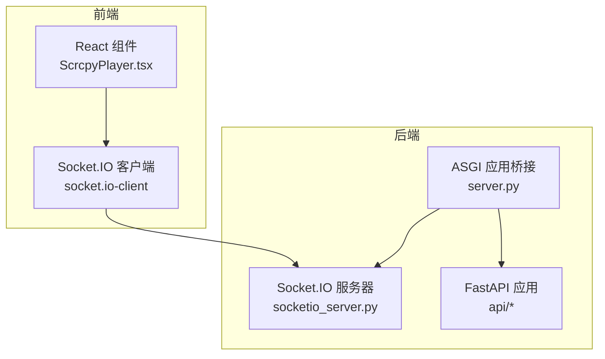
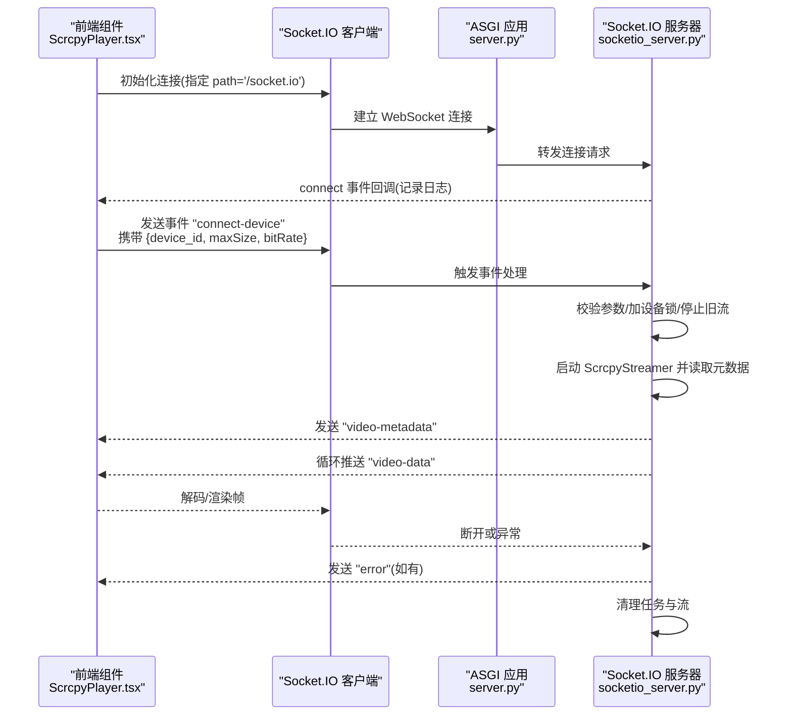
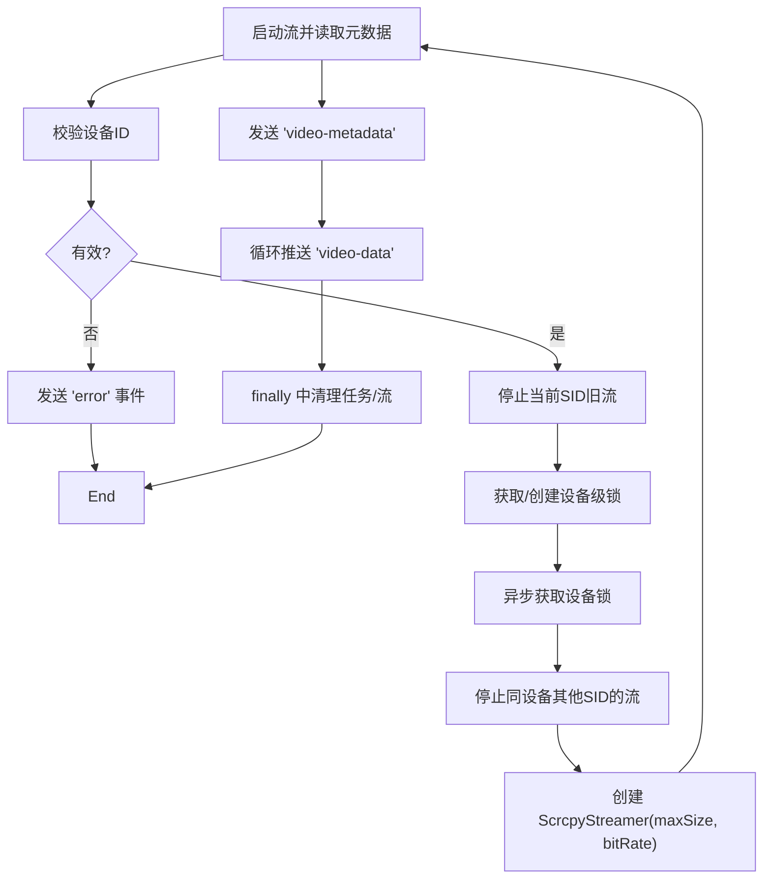
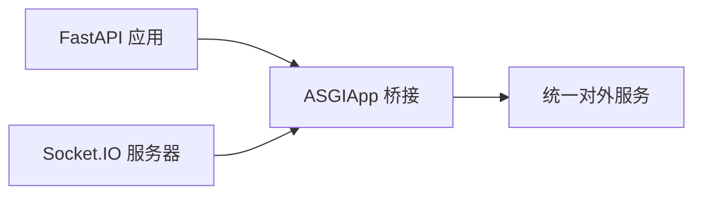
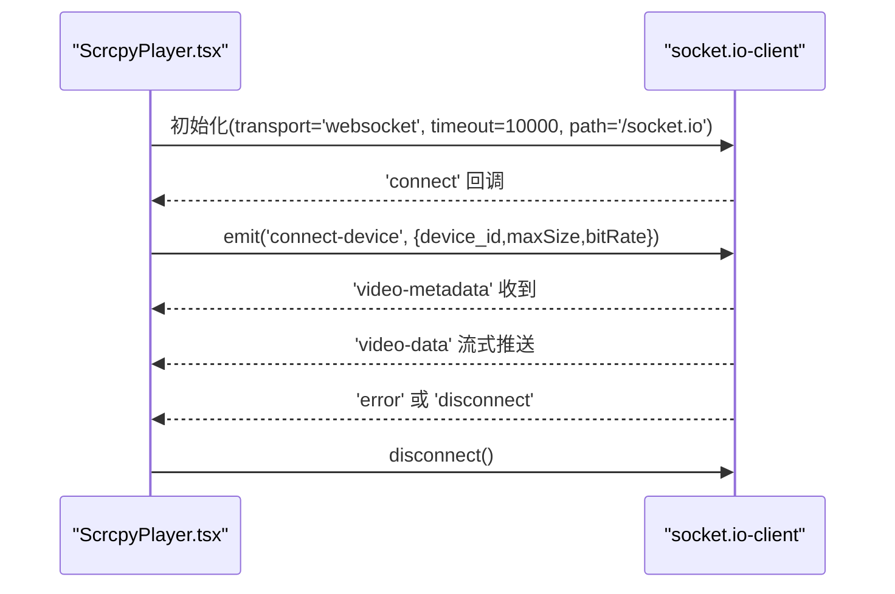
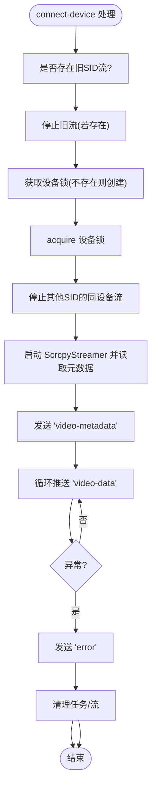
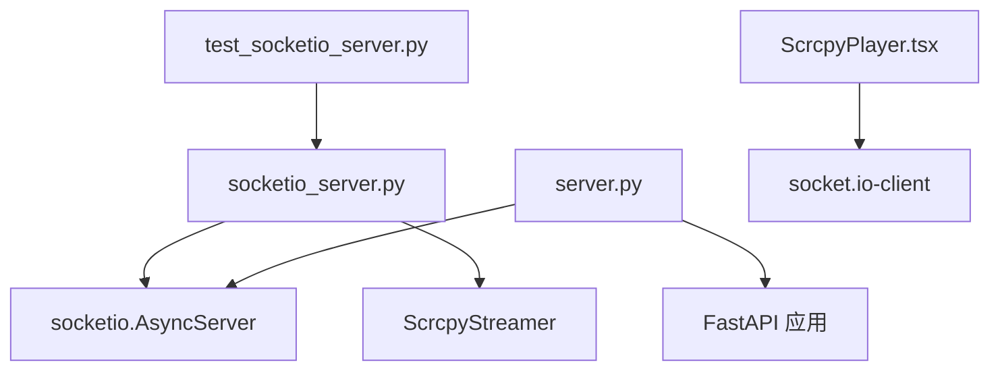

# Socket.IO服务器与客户端

<cite>
**本文引用的文件**
- [socketio_server.py](file://AutoGLM_GUI/socketio_server.py)
- [server.py](file://AutoGLM_GUI/server.py)
- [ScrcpyPlayer.tsx](file://frontend/src/components/ScrcpyPlayer.tsx)
- [test_socketio_server.py](file://tests/test_socketio_server.py)
- [terminal.py](file://AutoGLM_GUI/api/terminal.py)
</cite>

## 目录
1. [引言](#引言)
2. [项目结构](#项目结构)
3. [核心组件](#核心组件)
4. [架构总览](#架构总览)
5. [详细组件分析](#详细组件分析)
6. [依赖关系分析](#依赖关系分析)
7. [性能考虑](#性能考虑)
8. [故障排查指南](#故障排查指南)
9. [结论](#结论)
10. [附录](#附录)

## 引言
本文件围绕基于 Socket.IO 的视频流通信机制进行深入解析，重点覆盖以下主题：
- AsyncServer 配置与 CORS 设置
- 连接生命周期管理（建立、断开、事件监听）
- 客户端连接建立、断开处理、事件监听模式
- 会话与并发连接控制、设备锁机制
- 常见问题（连接超时、CORS 限制、会话管理）及解决方案
- 实际代码示例路径与最佳实践

目标是让初学者快速上手，同时为有经验的开发者提供足够的技术深度。

## 项目结构
Socket.IO 服务位于 Python 后端，前端通过 React 组件发起连接与事件交互，二者通过 ASGI 应用桥接。

图表来源
- [socketio_server.py:1-31](file://AutoGLM_GUI/socketio_server.py#L1-L31)
- [server.py:8-10](file://AutoGLM_GUI/server.py#L8-L10)
- [ScrcpyPlayer.tsx:369-431](file://frontend/src/components/ScrcpyPlayer.tsx#L369-L431)

章节来源
- [socketio_server.py:1-31](file://AutoGLM_GUI/socketio_server.py#L1-L31)
- [server.py:1-12](file://AutoGLM_GUI/server.py#L1-L12)

## 核心组件
- Socket.IO AsyncServer：异步事件驱动的视频流服务，支持跨域与自定义路径。
- ASGI 桥接应用：将 FastAPI 与 Socket.IO 组合为单一 ASGI 应用。
- 前端 ScrcpyPlayer：负责建立连接、发送 connect-device 事件、接收视频数据与错误事件。
- 测试用例：验证错误分类、并发替换、参数传递等行为。

章节来源
- [socketio_server.py:27-37](file://AutoGLM_GUI/socketio_server.py#L27-L37)
- [server.py:8-10](file://AutoGLM_GUI/server.py#L8-L10)
- [ScrcpyPlayer.tsx:369-431](file://frontend/src/components/ScrcpyPlayer.tsx#L369-L431)
- [test_socketio_server.py:43-63](file://tests/test_socketio_server.py#L43-L63)

## 架构总览
Socket.IO 服务器以异步模式运行，通过 ASGIApp 将其挂载到 FastAPI 应用下，统一暴露在 /socket.io 路径。前端通过 socket.io-client 连接该路径并发送自定义事件。

图表来源
- [server.py:8-10](file://AutoGLM_GUI/server.py#L8-L10)
- [socketio_server.py:137-145](file://AutoGLM_GUI/socketio_server.py#L137-L145)
- [socketio_server.py:148-215](file://AutoGLM_GUI/socketio_server.py#L148-L215)
- [ScrcpyPlayer.tsx:369-431](file://frontend/src/components/ScrcpyPlayer.tsx#L369-L431)

## 详细组件分析

### Socket.IO 服务器（AsyncServer）
- 异步模式与路径配置
  - 使用异步模式与自定义 socketio_path="/socket.io"，确保与前端一致。
  - CORS 允许所有来源（生产环境建议收紧）。
- 连接生命周期
  - connect：记录连接 SID。
  - disconnect：清理对应 SID 的流与任务。
- 事件处理
  - connect-device：校验设备 ID，解析分辨率与码率参数，按设备粒度加锁，替换同设备其他 SID 的流，启动 ScrcpyStreamer 并推送元数据与视频数据。
- 错误分类
  - 对端口占用、设备离线、超时、连接失败等进行统一分类与用户友好提示。
- 数据包封装
  - 将底层媒体包转换为包含类型、二进制数据、时间戳以及可选关键帧与 PTS 的负载。

图表来源
- [socketio_server.py:148-215](file://AutoGLM_GUI/socketio_server.py#L148-L215)
- [socketio_server.py:106-123](file://AutoGLM_GUI/socketio_server.py#L106-L123)
- [socketio_server.py:125-134](file://AutoGLM_GUI/socketio_server.py#L125-L134)

章节来源
- [socketio_server.py:27-31](file://AutoGLM_GUI/socketio_server.py#L27-L31)
- [socketio_server.py:137-145](file://AutoGLM_GUI/socketio_server.py#L137-L145)
- [socketio_server.py:148-215](file://AutoGLM_GUI/socketio_server.py#L148-L215)
- [socketio_server.py:50-87](file://AutoGLM_GUI/socketio_server.py#L50-L87)
- [socketio_server.py:125-134](file://AutoGLM_GUI/socketio_server.py#L125-L134)

### ASGI 应用桥接
- 将 FastAPI 应用与 Socket.IO 服务器组合为单一 ASGI 应用，统一暴露在 /socket.io 路径，便于部署与反向代理。

图表来源
- [server.py:8-10](file://AutoGLM_GUI/server.py#L8-L10)

章节来源
- [server.py:1-12](file://AutoGLM_GUI/server.py#L1-L12)

### 前端 Socket.IO 客户端（ScrcpyPlayer）
- 连接建立
  - 指定 path: '/socket.io'，传输协议优先 WebSocket，设置连接超时。
- 事件监听
  - 监听 'video-data'、'error'、'disconnect'，分别用于渲染、错误提示与断开处理。
- 事件发送
  - 连接成功后发送 'connect-device'，包含设备 ID、最大尺寸与码率。
- 断开流程
  - 主动断开连接，清理解码器、画布与定时器，重置状态与错误信息。

图表来源
- [ScrcpyPlayer.tsx:369-431](file://frontend/src/components/ScrcpyPlayer.tsx#L369-L431)
- [ScrcpyPlayer.tsx:290-310](file://frontend/src/components/ScrcpyPlayer.tsx#L290-L310)

章节来源
- [ScrcpyPlayer.tsx:369-431](file://frontend/src/components/ScrcpyPlayer.tsx#L369-L431)
- [ScrcpyPlayer.tsx:290-310](file://frontend/src/components/ScrcpyPlayer.tsx#L290-L310)

### 错误分类与统一处理
- 分类维度：端口冲突、设备离线、超时、连接失败、未知错误。
- 输出格式：包含用户友好消息、错误类型与技术详情，便于前端展示与日志追踪。

章节来源
- [socketio_server.py:50-87](file://AutoGLM_GUI/socketio_server.py#L50-L87)
- [test_socketio_server.py:43-63](file://tests/test_socketio_server.py#L43-L63)

### 并发连接与设备锁机制
- 设备级锁：为每个 device_id 维护一个 asyncio.Lock，确保同一设备不会被多个 SID 并发连接。
- 替换策略：当新连接到来时，停止同设备其他 SID 的流，避免资源竞争。
- 会话清理：disconnect 或异常时，取消任务并停止流，释放资源。

图表来源
- [socketio_server.py:166-184](file://AutoGLM_GUI/socketio_server.py#L166-L184)
- [socketio_server.py:186-215](file://AutoGLM_GUI/socketio_server.py#L186-L215)
- [socketio_server.py:40-48](file://AutoGLM_GUI/socketio_server.py#L40-L48)

章节来源
- [socketio_server.py:33-37](file://AutoGLM_GUI/socketio_server.py#L33-L37)
- [socketio_server.py:166-184](file://AutoGLM_GUI/socketio_server.py#L166-L184)
- [socketio_server.py:186-215](file://AutoGLM_GUI/socketio_server.py#L186-L215)

## 依赖关系分析
- 后端依赖
  - socketio.AsyncServer：异步事件驱动。
  - ScrcpyStreamer：视频流生成与元数据读取。
  - ASGIApp：与 FastAPI 组合。
- 前端依赖
  - socket.io-client：WebSocket 客户端库。
- 测试依赖
  - pytest-asyncio：异步测试支持。

图表来源
- [socketio_server.py:12-16](file://AutoGLM_GUI/socketio_server.py#L12-L16)
- [server.py:3-6](file://AutoGLM_GUI/server.py#L3-L6)
- [ScrcpyPlayer.tsx:369-374](file://frontend/src/components/ScrcpyPlayer.tsx#L369-L374)
- [test_socketio_server.py:1-20](file://tests/test_socketio_server.py#L1-L20)

章节来源
- [socketio_server.py:12-16](file://AutoGLM_GUI/socketio_server.py#L12-L16)
- [server.py:3-6](file://AutoGLM_GUI/server.py#L3-L6)
- [ScrcpyPlayer.tsx:369-374](file://frontend/src/components/ScrcpyPlayer.tsx#L369-L374)
- [test_socketio_server.py:1-20](file://tests/test_socketio_server.py#L1-L20)

## 性能考虑
- 异步 I/O：使用 asyncio 与异步 Socket.IO，降低阻塞风险，提升并发能力。
- 设备锁：避免多连接争用同一设备资源，减少失败重试与资源竞争。
- 流控与参数：通过 maxSize 与 bitRate 控制视频质量与带宽占用，平衡清晰度与流畅性。
- 任务清理：异常与断开时及时取消任务与停止流，防止内存泄漏与僵尸进程。

## 故障排查指南
- 连接超时
  - 现象：前端收到 'error'，类型为 timeout。
  - 排查：检查设备连接状态、网络延迟、防火墙；适当提高前端连接超时。
  - 参考：[socketio_server.py:70-75](file://AutoGLM_GUI/socketio_server.py#L70-L75)
- CORS 限制
  - 现象：浏览器控制台报跨域错误。
  - 排查：确认前端 path 与后端 socketio_path 一致；生产环境收紧 cors_allowed_origins。
  - 参考：[socketio_server.py:29](file://AutoGLM_GUI/socketio_server.py#L29)
- 设备离线
  - 现象：错误类型为 device_offline。
  - 排查：检查 USB/WiFi 连接、设备是否被系统识别。
  - 参考：[socketio_server.py:62-69](file://AutoGLM_GUI/socketio_server.py#L62-L69)
- 端口冲突
  - 现象：错误类型为 port_conflict。
  - 排查：关闭占用端口的进程或重启应用。
  - 参考：[socketio_server.py:54-61](file://AutoGLM_GUI/socketio_server.py#L54-L61)
- 会话管理
  - 现象：断开后仍有残留流。
  - 排查：确认 disconnect 事件触发与 _stop_stream_for_sid 是否执行。
  - 参考：[socketio_server.py:143-145](file://AutoGLM_GUI/socketio_server.py#L143-L145)

章节来源
- [socketio_server.py:50-87](file://AutoGLM_GUI/socketio_server.py#L50-L87)
- [socketio_server.py:29](file://AutoGLM_GUI/socketio_server.py#L29)
- [socketio_server.py:143-145](file://AutoGLM_GUI/socketio_server.py#L143-L145)

## 结论
该 Socket.IO 通信方案通过异步事件驱动与设备级锁机制，实现了稳定高效的视频流传输。前端以最小化配置即可完成连接与事件交互，后端提供统一的错误分类与资源清理策略。生产环境中建议收紧 CORS、合理设置超时与流参数，并监控设备锁与并发连接情况，以获得更佳的稳定性与性能。

## 附录
- 关键实现路径参考
  - AsyncServer 配置与 CORS：[socketio_server.py:27-31](file://AutoGLM_GUI/socketio_server.py#L27-L31)
  - 连接生命周期：[socketio_server.py:137-145](file://AutoGLM_GUI/socketio_server.py#L137-L145)
  - connect-device 事件处理：[socketio_server.py:148-215](file://AutoGLM_GUI/socketio_server.py#L148-L215)
  - 视频数据封装：[socketio_server.py:125-134](file://AutoGLM_GUI/socketio_server.py#L125-L134)
  - ASGI 桥接：[server.py:8-10](file://AutoGLM_GUI/server.py#L8-L10)
  - 前端连接与事件：[ScrcpyPlayer.tsx:369-431](file://frontend/src/components/ScrcpyPlayer.tsx#L369-L431)
  - 错误分类测试：[test_socketio_server.py:43-63](file://tests/test_socketio_server.py#L43-L63)