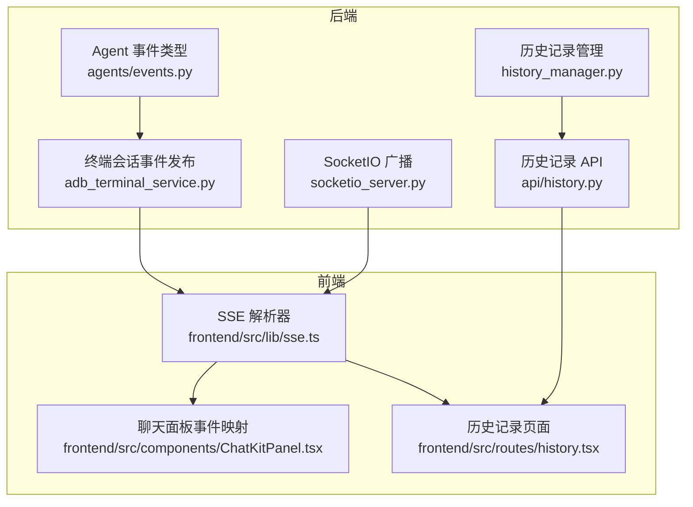
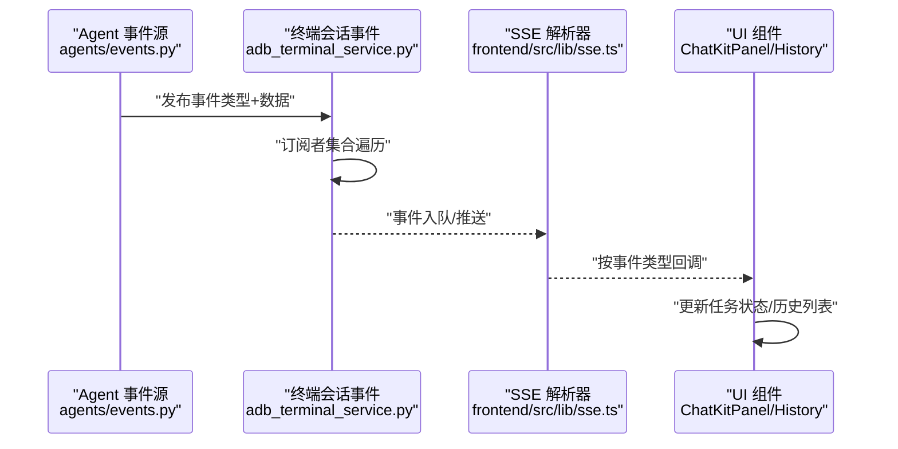
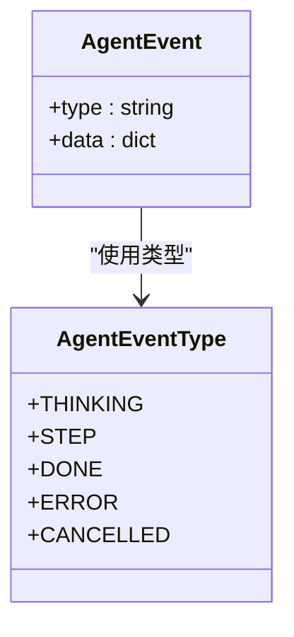
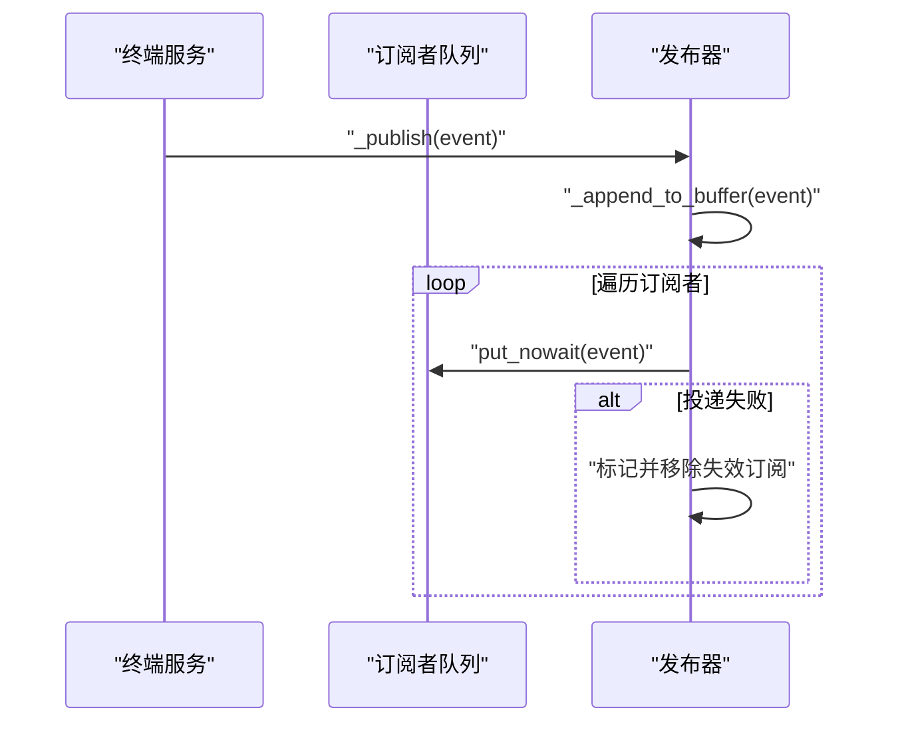
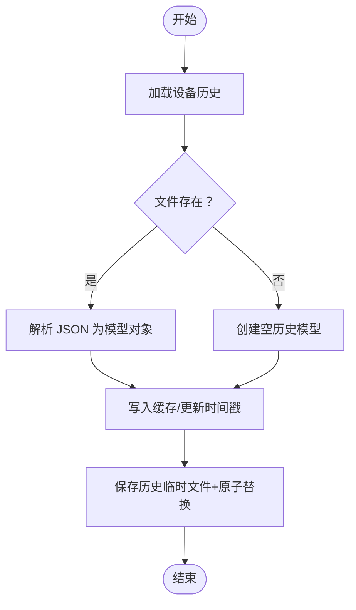
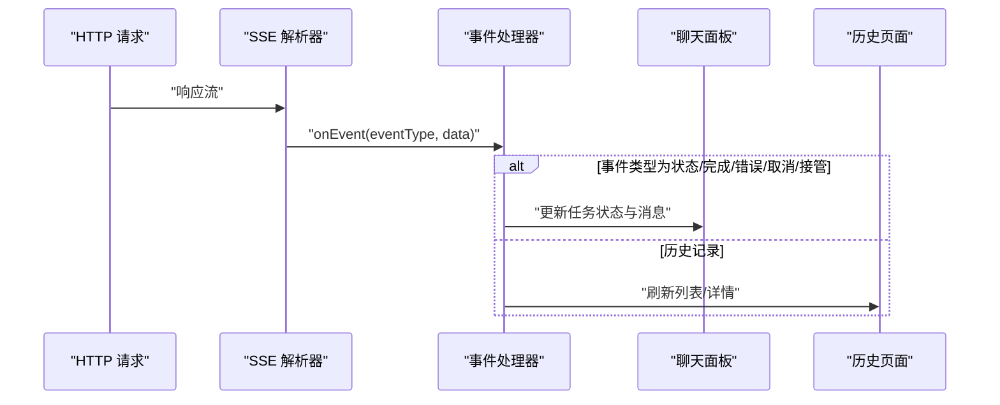
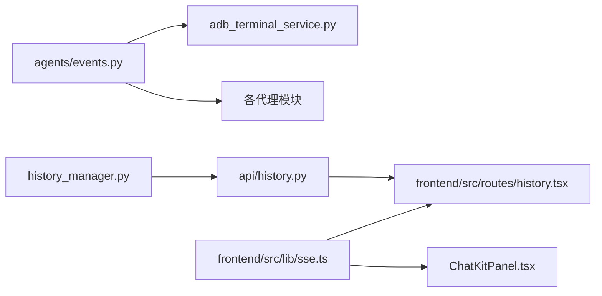

# 事件通知机制

<cite>
**本文引用的文件**
- [agents/events.py](file://AutoGLM_GUI/agents/events.py)
- [adb_terminal_service.py](file://AutoGLM_GUI/adb_terminal_service.py)
- [socketio_server.py](file://AutoGLM_GUI/socketio_server.py)
- [history_manager.py](file://AutoGLM_GUI/history_manager.py)
- [api/history.py](file://AutoGLM_GUI/api/history.py)
- [models/history.py](file://AutoGLM_GUI/models/history.py)
- [frontend/src/lib/sse.ts](file://frontend/src/lib/sse.ts)
- [frontend/src/components/ChatKitPanel.tsx](file://frontend/src/components/ChatKitPanel.tsx)
- [frontend/src/routes/history.tsx](file://frontend/src/routes/history.tsx)
- [tests/test_terminal_service.py](file://tests/test_terminal_service.py)
</cite>

## 目录
1. [简介](#简介)
2. [项目结构](#项目结构)
3. [核心组件](#核心组件)
4. [架构总览](#架构总览)
5. [详细组件分析](#详细组件分析)
6. [依赖关系分析](#依赖关系分析)
7. [性能考量](#性能考量)
8. [故障排查指南](#故障排查指南)
9. [结论](#结论)
10. [附录](#附录)

## 简介
本文件系统性梳理事件通知机制在设备管理与任务执行中的实现，覆盖设备状态变化通知、历史记录事件、系统错误通知等核心功能。文档从事件类型定义、消息格式规范、订阅机制到分发与广播策略进行逐层展开，并结合前端 SSE 处理与后端终端会话事件模型，给出可操作的排障建议与最佳实践。

## 项目结构
事件通知机制横跨后端服务与前端交互两部分：
- 后端：终端会话事件发布、SocketIO 广播、历史记录持久化与查询接口
- 前端：SSE 流解析、事件类型映射与界面更新

图表来源
- [agents/events.py:1-19](file://AutoGLM_GUI/agents/events.py#L1-L19)
- [adb_terminal_service.py:148-181](file://AutoGLM_GUI/adb_terminal_service.py#L148-L181)
- [socketio_server.py](file://AutoGLM_GUI/socketio_server.py)
- [history_manager.py:75-199](file://AutoGLM_GUI/history_manager.py#L75-L199)
- [api/history.py:37-447](file://AutoGLM_GUI/api/history.py#L37-L447)
- [frontend/src/lib/sse.ts:16-56](file://frontend/src/lib/sse.ts#L16-L56)
- [frontend/src/components/ChatKitPanel.tsx:105-142](file://frontend/src/components/ChatKitPanel.tsx#L105-L142)
- [frontend/src/routes/history.tsx:55-86](file://frontend/src/routes/history.tsx#L55-L86)

章节来源
- [agents/events.py:1-19](file://AutoGLM_GUI/agents/events.py#L1-L19)
- [adb_terminal_service.py:148-181](file://AutoGLM_GUI/adb_terminal_service.py#L148-L181)
- [socketio_server.py](file://AutoGLM_GUI/socketio_server.py)
- [history_manager.py:75-199](file://AutoGLM_GUI/history_manager.py#L75-L199)
- [api/history.py:37-447](file://AutoGLM_GUI/api/history.py#L37-L447)
- [frontend/src/lib/sse.ts:16-56](file://frontend/src/lib/sse.ts#L16-L56)
- [frontend/src/components/ChatKitPanel.tsx:105-142](file://frontend/src/components/ChatKitPanel.tsx#L105-L142)
- [frontend/src/routes/history.tsx:55-86](file://frontend/src/routes/history.tsx#L55-L86)

## 核心组件
- 事件类型与消息格式
  - 统一事件类型：Agent 事件类型枚举定义了思考、步骤、完成、错误、取消等事件类别，便于前后端一致识别与处理。
  - 事件消息格式：统一为包含类型与数据载荷的对象，前端通过 SSE 解析器按事件类型分发回调。
- 订阅与分发
  - 终端会话事件：维护订阅者集合，向每个订阅队列异步投递事件；自动清理失效订阅。
  - SocketIO 广播：面向实时场景的多客户端广播通道。
  - 历史记录：通过管理器持久化与查询，API 提供列表、详情、删除等接口。
- 前端消费
  - SSE 解析器：逐行解析事件与数据，调用回调函数。
  - 事件映射：聊天面板根据事件类型更新任务状态与消息。

章节来源
- [agents/events.py:1-19](file://AutoGLM_GUI/agents/events.py#L1-L19)
- [frontend/src/lib/sse.ts:16-56](file://frontend/src/lib/sse.ts#L16-L56)
- [frontend/src/components/ChatKitPanel.tsx:105-142](file://frontend/src/components/ChatKitPanel.tsx#L105-L142)
- [adb_terminal_service.py:148-181](file://AutoGLM_GUI/adb_terminal_service.py#L148-L181)
- [socketio_server.py](file://AutoGLM_GUI/socketio_server.py)
- [history_manager.py:75-199](file://AutoGLM_GUI/history_manager.py#L75-L199)
- [api/history.py:37-447](file://AutoGLM_GUI/api/history.py#L37-L447)

## 架构总览
事件流从后端产生，经由订阅/广播通道到达前端，再由前端解析器与组件映射进行状态更新与界面渲染。

图表来源
- [agents/events.py:1-19](file://AutoGLM_GUI/agents/events.py#L1-L19)
- [adb_terminal_service.py:406-417](file://AutoGLM_GUI/adb_terminal_service.py#L406-L417)
- [frontend/src/lib/sse.ts:16-56](file://frontend/src/lib/sse.ts#L16-L56)
- [frontend/src/components/ChatKitPanel.tsx:105-142](file://frontend/src/components/ChatKitPanel.tsx#L105-L142)

## 详细组件分析

### Agent 事件类型与消息格式
- 事件类型：统一枚举定义，确保前后端一致性。
- 消息格式：包含事件类型与数据载荷，便于前端按类型分支处理。

图表来源
- [agents/events.py:5-19](file://AutoGLM_GUI/agents/events.py#L5-L19)

章节来源
- [agents/events.py:1-19](file://AutoGLM_GUI/agents/events.py#L1-L19)

### 终端会话事件发布与订阅
- 订阅机制：维护订阅者集合，支持订阅与退订。
- 发布流程：估算事件大小并写入缓冲，向所有订阅者投递；捕获运行时错误并移除失效订阅。
- 缓冲与限流：限制缓冲字节数，避免内存膨胀。

图表来源
- [adb_terminal_service.py:148-181](file://AutoGLM_GUI/adb_terminal_service.py#L148-L181)
- [adb_terminal_service.py:406-417](file://AutoGLM_GUI/adb_terminal_service.py#L406-L417)
- [adb_terminal_service.py:442-454](file://AutoGLM_GUI/adb_terminal_service.py#L442-L454)

章节来源
- [adb_terminal_service.py:148-181](file://AutoGLM_GUI/adb_terminal_service.py#L148-L181)
- [adb_terminal_service.py:406-417](file://AutoGLM_GUI/adb_terminal_service.py#L406-L417)
- [adb_terminal_service.py:442-454](file://AutoGLM_GUI/adb_terminal_service.py#L442-L454)
- [tests/test_terminal_service.py:266-298](file://tests/test_terminal_service.py#L266-L298)

### 历史记录事件与持久化
- 数据模型：设备历史与对话记录模型定义，支持序列化/反序列化。
- 管理器：负责加载、保存、删除、清空历史记录，带缓存与时间戳管理。
- API：提供历史记录列表、详情、删除等接口，兼容新旧记录合并。

图表来源
- [history_manager.py:75-119](file://AutoGLM_GUI/history_manager.py#L75-L119)
- [models/history.py](file://AutoGLM_GUI/models/history.py)
- [api/history.py:37-447](file://AutoGLM_GUI/api/history.py#L37-L447)

章节来源
- [history_manager.py:75-119](file://AutoGLM_GUI/history_manager.py#L75-L119)
- [history_manager.py:178-199](file://AutoGLM_GUI/history_manager.py#L178-L199)
- [models/history.py](file://AutoGLM_GUI/models/history.py)
- [api/history.py:37-447](file://AutoGLM_GUI/api/history.py#L37-L447)

### 前端 SSE 解析与事件映射
- SSE 解析：逐行解析事件头与数据行，JSON 反序列化后回调给上层。
- 事件映射：聊天面板根据事件类型更新任务状态、最终消息与错误信息。
- 历史页面：分页加载历史记录，支持删除与查看详情。

图表来源
- [frontend/src/lib/sse.ts:16-56](file://frontend/src/lib/sse.ts#L16-L56)
- [frontend/src/components/ChatKitPanel.tsx:105-142](file://frontend/src/components/ChatKitPanel.tsx#L105-L142)
- [frontend/src/routes/history.tsx:55-86](file://frontend/src/routes/history.tsx#L55-L86)

章节来源
- [frontend/src/lib/sse.ts:16-56](file://frontend/src/lib/sse.ts#L16-L56)
- [frontend/src/components/ChatKitPanel.tsx:105-142](file://frontend/src/components/ChatKitPanel.tsx#L105-L142)
- [frontend/src/routes/history.tsx:55-86](file://frontend/src/routes/history.tsx#L55-L86)

## 依赖关系分析
- 后端内部依赖
  - 事件类型被终端服务与各代理模块复用，保证事件语义一致。
  - 历史管理器依赖模型定义与文件系统，API 层负责对外暴露。
- 前后端依赖
  - 前端通过 SSE 解析器消费后端事件流，事件类型需保持前后一致。
  - 历史页面依赖后端历史 API，实现分页与删除等操作。

图表来源
- [agents/events.py:1-19](file://AutoGLM_GUI/agents/events.py#L1-L19)
- [adb_terminal_service.py:148-181](file://AutoGLM_GUI/adb_terminal_service.py#L148-L181)
- [history_manager.py:75-199](file://AutoGLM_GUI/history_manager.py#L75-L199)
- [api/history.py:37-447](file://AutoGLM_GUI/api/history.py#L37-L447)
- [frontend/src/lib/sse.ts:16-56](file://frontend/src/lib/sse.ts#L16-L56)
- [frontend/src/components/ChatKitPanel.tsx:105-142](file://frontend/src/components/ChatKitPanel.tsx#L105-L142)
- [frontend/src/routes/history.tsx:55-86](file://frontend/src/routes/history.tsx#L55-L86)

章节来源
- [agents/events.py:1-19](file://AutoGLM_GUI/agents/events.py#L1-L19)
- [adb_terminal_service.py:148-181](file://AutoGLM_GUI/adb_terminal_service.py#L148-L181)
- [history_manager.py:75-199](file://AutoGLM_GUI/history_manager.py#L75-L199)
- [api/history.py:37-447](file://AutoGLM_GUI/api/history.py#L37-L447)
- [frontend/src/lib/sse.ts:16-56](file://frontend/src/lib/sse.ts#L16-L56)
- [frontend/src/components/ChatKitPanel.tsx:105-142](file://frontend/src/components/ChatKitPanel.tsx#L105-L142)
- [frontend/src/routes/history.tsx:55-86](file://frontend/src/routes/history.tsx#L55-L86)

## 性能考量
- 事件缓冲与大小估算：通过事件大小估算与缓冲字节上限控制内存占用，避免过量事件导致内存压力。
- 订阅者清理：对投递失败的订阅者进行清理，减少无效投递开销。
- 历史记录写入：采用临时文件写入与原子替换，降低并发写入风险与数据损坏概率。
- 分页加载：历史记录页面使用分页加载，避免一次性传输大量数据。

章节来源
- [adb_terminal_service.py:442-454](file://AutoGLM_GUI/adb_terminal_service.py#L442-L454)
- [adb_terminal_service.py:406-417](file://AutoGLM_GUI/adb_terminal_service.py#L406-L417)
- [history_manager.py:102-119](file://AutoGLM_GUI/history_manager.py#L102-L119)
- [frontend/src/routes/history.tsx:70-86](file://frontend/src/routes/history.tsx#L70-L86)

## 故障排查指南
- 事件丢失
  - 检查订阅者集合是否正确添加与移除；确认事件发布前已建立有效订阅。
  - 关注投递失败路径，确保失效订阅被及时清理。
- 重复通知
  - 避免重复订阅同一队列；在组件卸载或会话关闭时正确退订。
- 消息格式错误
  - 前端解析器对每条数据行进行 JSON 解析，若格式错误会记录日志；检查后端事件载荷结构与类型。
- 历史记录异常
  - 文件解析失败或不存在时会回退为空历史；检查文件权限与编码；确认保存流程的原子替换是否成功。

章节来源
- [tests/test_terminal_service.py:266-298](file://tests/test_terminal_service.py#L266-L298)
- [frontend/src/lib/sse.ts:44-53](file://frontend/src/lib/sse.ts#L44-L53)
- [history_manager.py:98-100](file://AutoGLM_GUI/history_manager.py#L98-L100)

## 结论
该事件通知机制以统一的事件类型与消息格式为基础，结合终端会话事件发布、SocketIO 广播以及历史记录持久化与 API，形成从前端到后端的闭环。通过缓冲与订阅者清理、原子写入与分页加载等策略，兼顾了实时性与稳定性。建议在扩展新事件类型时保持前后端一致，并完善异常处理与监控告警，以进一步提升可靠性。

## 附录
- 事件类型与消息格式参考路径
  - [agents/events.py:1-19](file://AutoGLM_GUI/agents/events.py#L1-L19)
- 终端会话事件发布与订阅参考路径
  - [adb_terminal_service.py:148-181](file://AutoGLM_GUI/adb_terminal_service.py#L148-L181)
  - [adb_terminal_service.py:406-417](file://AutoGLM_GUI/adb_terminal_service.py#L406-L417)
  - [adb_terminal_service.py:442-454](file://AutoGLM_GUI/adb_terminal_service.py#L442-L454)
- 历史记录管理与 API 参考路径
  - [history_manager.py:75-119](file://AutoGLM_GUI/history_manager.py#L75-L119)
  - [history_manager.py:178-199](file://AutoGLM_GUI/history_manager.py#L178-L199)
  - [api/history.py:37-447](file://AutoGLM_GUI/api/history.py#L37-L447)
- 前端 SSE 解析与事件映射参考路径
  - [frontend/src/lib/sse.ts:16-56](file://frontend/src/lib/sse.ts#L16-L56)
  - [frontend/src/components/ChatKitPanel.tsx:105-142](file://frontend/src/components/ChatKitPanel.tsx#L105-L142)
  - [frontend/src/routes/history.tsx:55-86](file://frontend/src/routes/history.tsx#L55-L86)