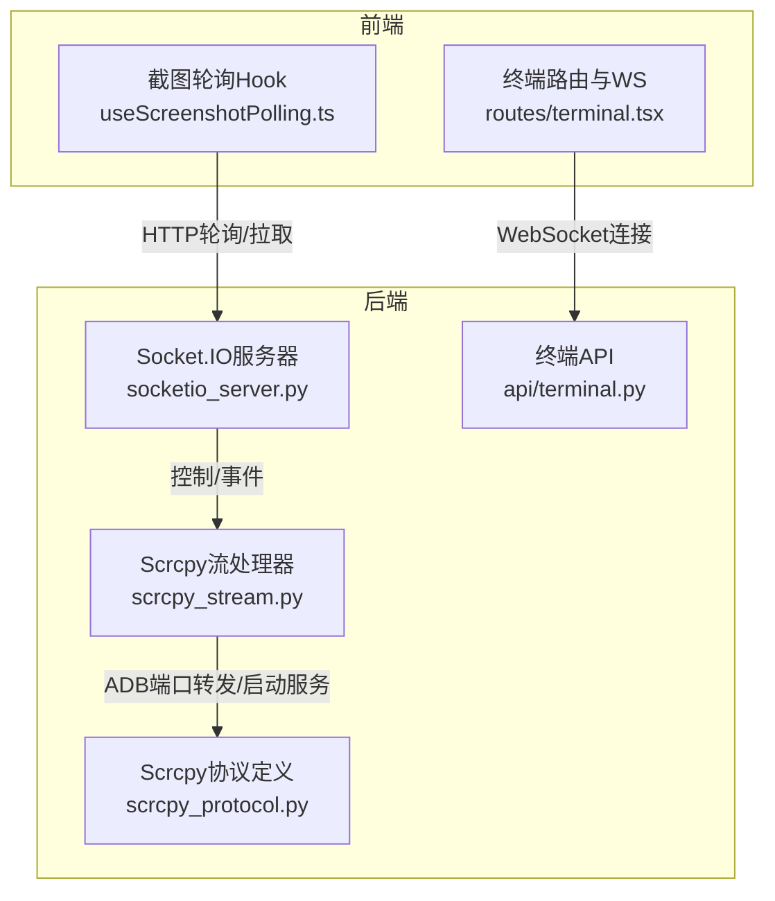
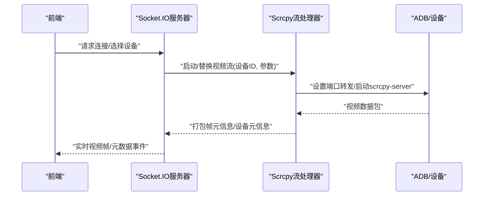
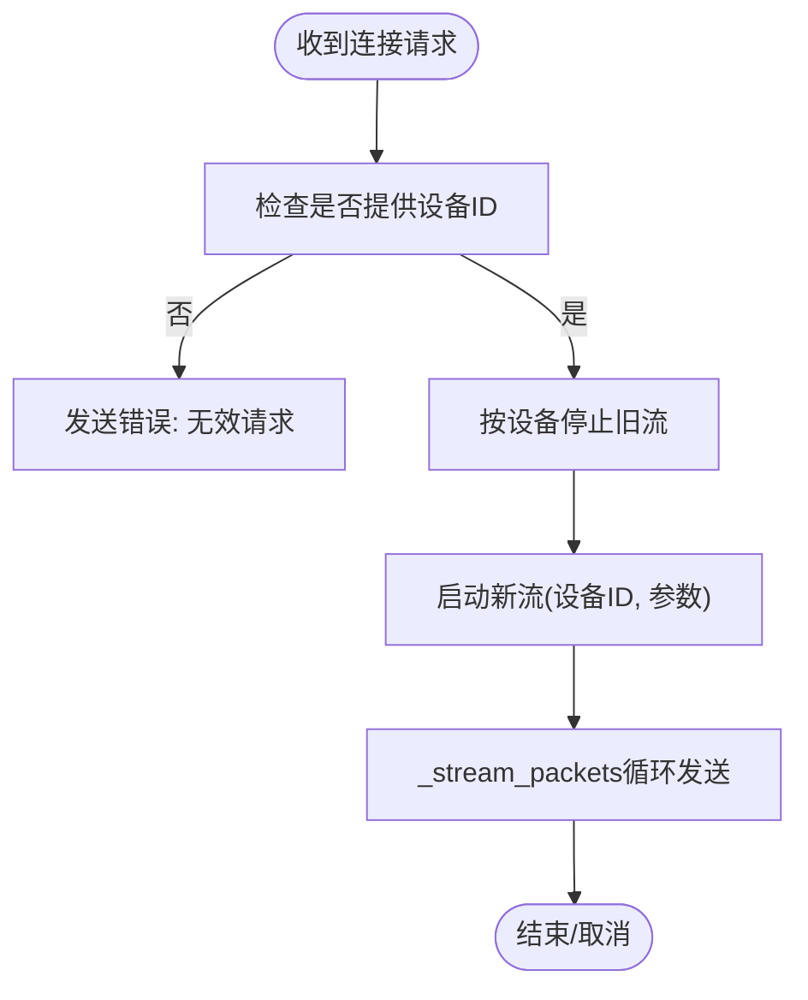
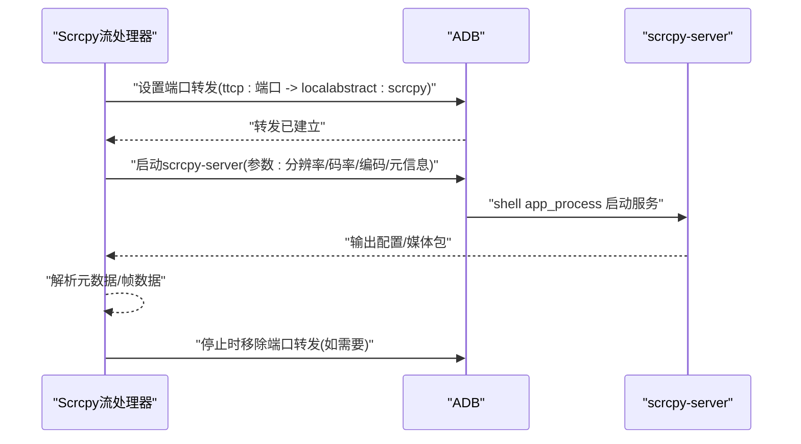
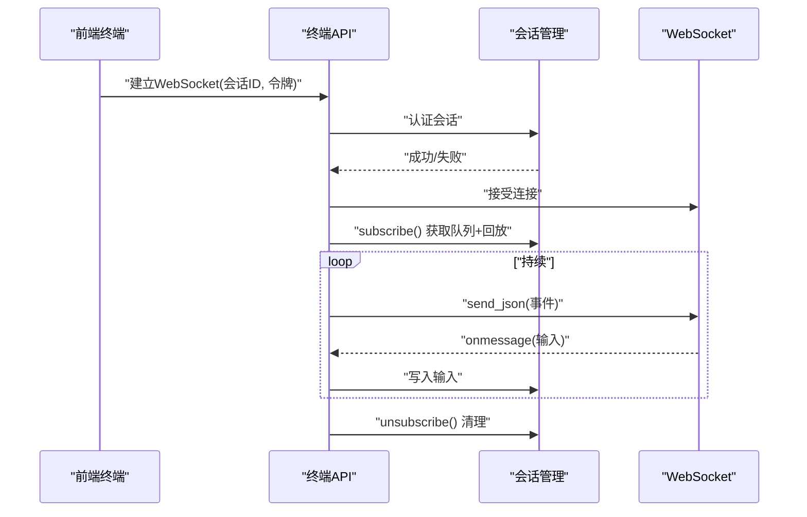
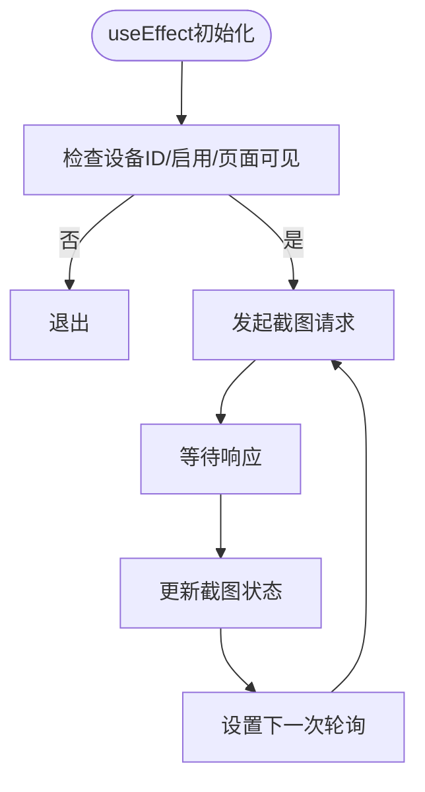
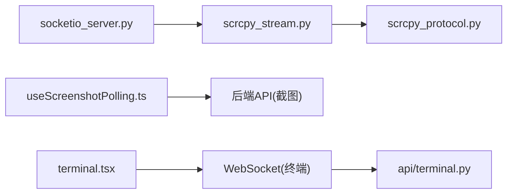

# 实时通信系统

<cite>
**本文引用的文件**
- [socketio_server.py](file://AutoGLM_GUI/socketio_server.py)
- [scrcpy_stream.py](file://AutoGLM_GUI/scrcpy_stream.py)
- [scrcpy_protocol.py](file://AutoGLM_GUI/scrcpy_protocol.py)
- [terminal.py](file://AutoGLM_GUI/api/terminal.py)
- [useScreenshotPolling.ts](file://frontend/src/hooks/useScreenshotPolling.ts)
- [test_socketio_server.py](file://tests/test_socketio_server.py)
- [test_scrcpy_stream_edges.py](file://tests/test_scrcpy_stream_edges.py)
- [test_hardware_boundary_coverage.py](file://tests/test_hardware_boundary_coverage.py)
- [terminal.tsx](file://frontend/src/routes/terminal.tsx)
</cite>

## 目录
1. [简介](#简介)
2. [项目结构](#项目结构)
3. [核心组件](#核心组件)
4. [架构总览](#架构总览)
5. [详细组件分析](#详细组件分析)
6. [依赖分析](#依赖分析)
7. [性能考虑](#性能考虑)
8. [故障排查指南](#故障排查指南)
9. [结论](#结论)
10. [附录](#附录)

## 简介
本文件面向AutoGLM-GUI的实时通信系统，系统性阐述Socket.IO集成、WebSocket连接、实时预览（scrcpy视频流）、ADB终端服务、屏幕截图轮询与事件广播机制。文档以实际代码库为依据，结合测试用例与前端Hook，解释后端与前端之间的消息格式、调用关系、配置参数与返回值，并提供常见问题（连接中断、延迟高、带宽占用）的诊断与优化建议。

## 项目结构
实时通信相关的关键位置如下：
- 后端Socket.IO服务器：负责设备连接、流媒体会话管理与事件广播
- scrcpy视频流：通过ADB端口转发与scrcpy-server建立视频流
- 终端服务：基于WebSocket的交互式ADB终端
- 前端Hook与路由：截图轮询、终端WebSocket连接与事件处理
- 测试用例：覆盖错误分类、流停止过滤、连接校验、边缘场景等

**图表来源**
- [socketio_server.py](file://AutoGLM_GUI/socketio_server.py)
- [scrcpy_stream.py](file://AutoGLM_GUI/scrcpy_stream.py)
- [scrcpy_protocol.py](file://AutoGLM_GUI/scrcpy_protocol.py)
- [terminal.py](file://AutoGLM_GUI/api/terminal.py)
- [useScreenshotPolling.ts](file://frontend/src/hooks/useScreenshotPolling.ts)
- [terminal.tsx](file://frontend/src/routes/terminal.tsx)

**章节来源**
- [socketio_server.py](file://AutoGLM_GUI/socketio_server.py)
- [scrcpy_stream.py](file://AutoGLM_GUI/scrcpy_stream.py)
- [scrcpy_protocol.py](file://AutoGLM_GUI/scrcpy_protocol.py)
- [terminal.py](file://AutoGLM_GUI/api/terminal.py)
- [useScreenshotPolling.ts](file://frontend/src/hooks/useScreenshotPolling.ts)
- [terminal.tsx](file://frontend/src/routes/terminal.tsx)

## 核心组件
- Socket.IO服务器：维护设备到SID的映射、流任务管理、错误分类与广播
- Scrcpy流处理器：封装ADB命令、端口转发、scrcpy-server启动与媒体包解析
- 终端API：基于FastAPI WebSocket，鉴权后双向事件流
- 前端截图轮询Hook：按策略定时轮询截图
- 前端终端路由：WebSocket连接、消息解析与输出渲染

**章节来源**
- [socketio_server.py](file://AutoGLM_GUI/socketio_server.py)
- [scrcpy_stream.py](file://AutoGLM_GUI/scrcpy_stream.py)
- [terminal.py](file://AutoGLM_GUI/api/terminal.py)
- [useScreenshotPolling.ts](file://frontend/src/hooks/useScreenshotPolling.ts)
- [terminal.tsx](file://frontend/src/routes/terminal.tsx)

## 架构总览
后端通过Socket.IO统一管理设备会话与事件；scrcpy视频流由ADB驱动并通过本地端口转发提供给客户端；终端服务通过独立的WebSocket通道提供交互式Shell能力；前端通过Hook与路由分别进行截图轮询与终端交互。

**图表来源**
- [socketio_server.py](file://AutoGLM_GUI/socketio_server.py)
- [scrcpy_stream.py](file://AutoGLM_GUI/scrcpy_stream.py)

## 详细组件分析

### Socket.IO服务器与事件广播
- 设备连接与鉴权
  - 连接时要求提供设备ID，缺失则返回“无效请求”错误
  - 支持按设备ID停止对应流，避免资源泄漏
- 错误分类
  - 将常见异常归类为端口冲突、设备离线、超时、连接失败或未知错误
- 流管理
  - 维护SID到流处理器的映射，以及任务到设备的映射
  - 取消流时清理状态，确保资源回收

**图表来源**
- [socketio_server.py](file://AutoGLM_GUI/socketio_server.py)
- [test_socketio_server.py](file://tests/test_socketio_server.py)

**章节来源**
- [socketio_server.py](file://AutoGLM_GUI/socketio_server.py)
- [test_socketio_server.py](file://tests/test_socketio_server.py)

### Scrcpy视频流传输
- 端口转发
  - 使用ADB为本地TCP端口与设备抽象socket建立转发
- 服务器启动
  - 通过shell进程启动scrcpy-server，传入关键参数（最大分辨率、码率、最大帧率、视频编码、元信息开关等）
- 元数据与媒体包
  - 解析配置包与数据包，支持设备元信息、帧元信息、编解码器元信息与占位字节
- 生命周期与清理
  - 记录转发清理需求，在停止时移除端口转发

**图表来源**
- [scrcpy_stream.py](file://AutoGLM_GUI/scrcpy_stream.py)
- [scrcpy_protocol.py](file://AutoGLM_GUI/scrcpy_protocol.py)
- [test_scrcpy_stream_edges.py](file://tests/test_scrcpy_stream_edges.py)
- [test_hardware_boundary_coverage.py](file://tests/test_hardware_boundary_coverage.py)

**章节来源**
- [scrcpy_stream.py](file://AutoGLM_GUI/scrcpy_stream.py)
- [scrcpy_protocol.py](file://AutoGLM_GUI/scrcpy_protocol.py)
- [test_scrcpy_stream_edges.py](file://tests/test_scrcpy_stream_edges.py)
- [test_hardware_boundary_coverage.py](file://tests/test_hardware_boundary_coverage.py)

### ADB终端服务（WebSocket）
- 鉴权与会话
  - 通过会话ID与令牌鉴权，非法则拒绝连接
- 事件流
  - 订阅会话事件队列，先回放历史事件，再持续推送新事件
  - 支持双向：事件发送与输入接收
- 断开与清理
  - 任一方向断开或取消均清理订阅

**图表来源**
- [terminal.py](file://AutoGLM_GUI/api/terminal.py)
- [terminal.tsx](file://frontend/src/routes/terminal.tsx)

**章节来源**
- [terminal.py](file://AutoGLM_GUI/api/terminal.py)
- [terminal.tsx](file://frontend/src/routes/terminal.tsx)

### 屏幕截图轮询（前端Hook）
- 轮询策略
  - 在页面可见且启用时，按设定间隔发起HTTP请求获取截图
  - 防止并发重复请求，使用标志位与定时器
- 失败处理
  - 捕获异常并记录日志，避免中断轮询
- 生命周期
  - 组件卸载时取消未完成的请求与定时器

**图表来源**
- [useScreenshotPolling.ts](file://frontend/src/hooks/useScreenshotPolling.ts)

**章节来源**
- [useScreenshotPolling.ts](file://frontend/src/hooks/useScreenshotPolling.ts)

## 依赖分析
- 后端耦合
  - Socket.IO服务器依赖流处理器与设备会话管理
  - 流处理器依赖ADB命令与scrcpy协议定义
- 前端耦合
  - Hook依赖API模块与页面可见性检测
  - 终端路由依赖WebSocket工具与会话管理
- 外部依赖
  - ADB与scrcpy-server二进制
  - FastAPI与Socket.IO运行时

**图表来源**
- [socketio_server.py](file://AutoGLM_GUI/socketio_server.py)
- [scrcpy_stream.py](file://AutoGLM_GUI/scrcpy_stream.py)
- [scrcpy_protocol.py](file://AutoGLM_GUI/scrcpy_protocol.py)
- [terminal.py](file://AutoGLM_GUI/api/terminal.py)
- [useScreenshotPolling.ts](file://frontend/src/hooks/useScreenshotPolling.ts)
- [terminal.tsx](file://frontend/src/routes/terminal.tsx)

**章节来源**
- [socketio_server.py](file://AutoGLM_GUI/socketio_server.py)
- [scrcpy_stream.py](file://AutoGLM_GUI/scrcpy_stream.py)
- [scrcpy_protocol.py](file://AutoGLM_GUI/scrcpy_protocol.py)
- [terminal.py](file://AutoGLM_GUI/api/terminal.py)
- [useScreenshotPolling.ts](file://frontend/src/hooks/useScreenshotPolling.ts)
- [terminal.tsx](file://frontend/src/routes/terminal.tsx)

## 性能考虑
- 视频流参数
  - 通过最大分辨率、码率与最大帧率控制带宽占用；在低带宽网络下调小码率与分辨率可显著降低延迟
  - 关闭音频与控制通道可减少额外开销
- 元信息开关
  - 仅在需要时开启帧/设备/编解码器元信息，避免不必要的数据传输
- 轮询策略
  - 截图轮询应根据UI刷新需求调整间隔，避免频繁请求导致服务器压力
- 端口转发与进程管理
  - 启动/停止时注意端口占用与残留进程，确保资源回收

[本节为通用指导，无需列出章节来源]

## 故障排查指南
- 连接中断
  - 检查设备是否在线、端口转发是否建立、scrcpy-server是否正常启动
  - 查看Socket.IO错误分类，定位是端口冲突、设备离线还是连接失败
- 延迟过高
  - 降低分辨率/码率/帧率；关闭非必要元信息；确认网络质量
- 带宽占用大
  - 减小码率与分辨率；关闭音频与控制；限制轮询频率
- 终端无响应
  - 确认WebSocket握手成功、会话令牌有效、队列订阅正常；检查断开与清理逻辑

**章节来源**
- [socketio_server.py](file://AutoGLM_GUI/socketio_server.py)
- [scrcpy_stream.py](file://AutoGLM_GUI/scrcpy_stream.py)
- [terminal.py](file://AutoGLM_GUI/api/terminal.py)
- [test_socketio_server.py](file://tests/test_socketio_server.py)
- [test_hardware_boundary_coverage.py](file://tests/test_hardware_boundary_coverage.py)

## 结论
该实时通信系统以Socket.IO为核心，结合scrcpy视频流与ADB终端WebSocket，实现了从设备到前端的低延迟、可配置的实时预览与交互能力。通过清晰的错误分类、严格的流生命周期管理与前端轮询策略，系统在易用性与稳定性之间取得平衡。针对不同网络与设备条件，可通过参数调优进一步优化体验。

[本节为总结，无需列出章节来源]

## 附录
- 关键配置项（示例）
  - 视频流：最大分辨率、码率、最大帧率、视频编码、元信息开关
  - 端口转发：本地TCP端口
  - 终端：会话ID与令牌
- 前后端消息格式（示例）
  - Socket.IO事件：连接/断开/错误/媒体包/元数据
  - WebSocket事件：输出/状态/退出码等

[本节为概览，无需列出章节来源]