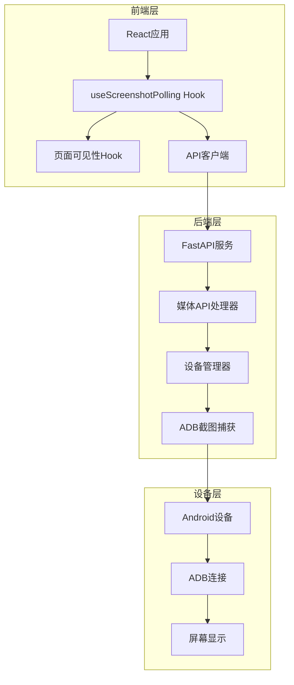
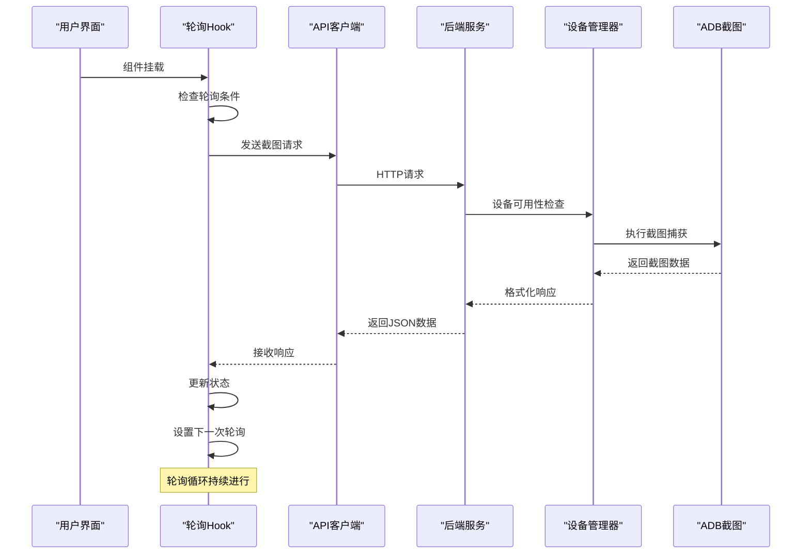
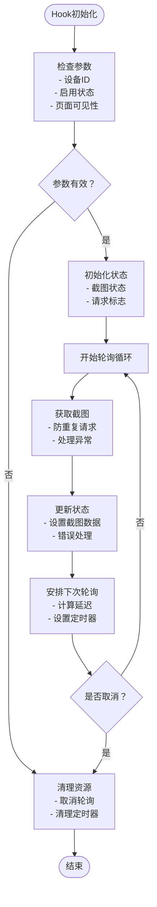
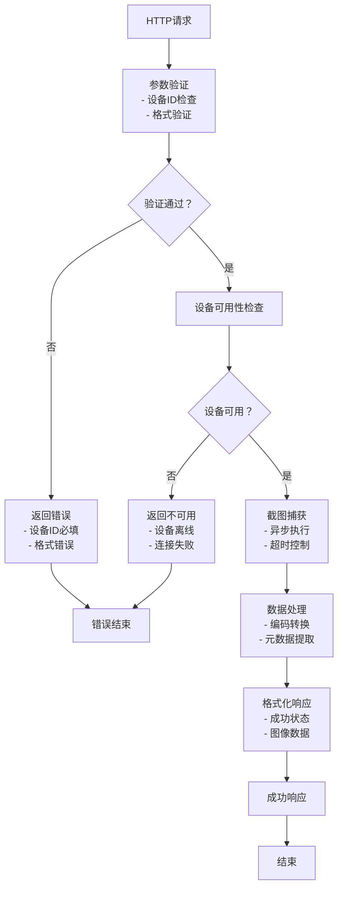
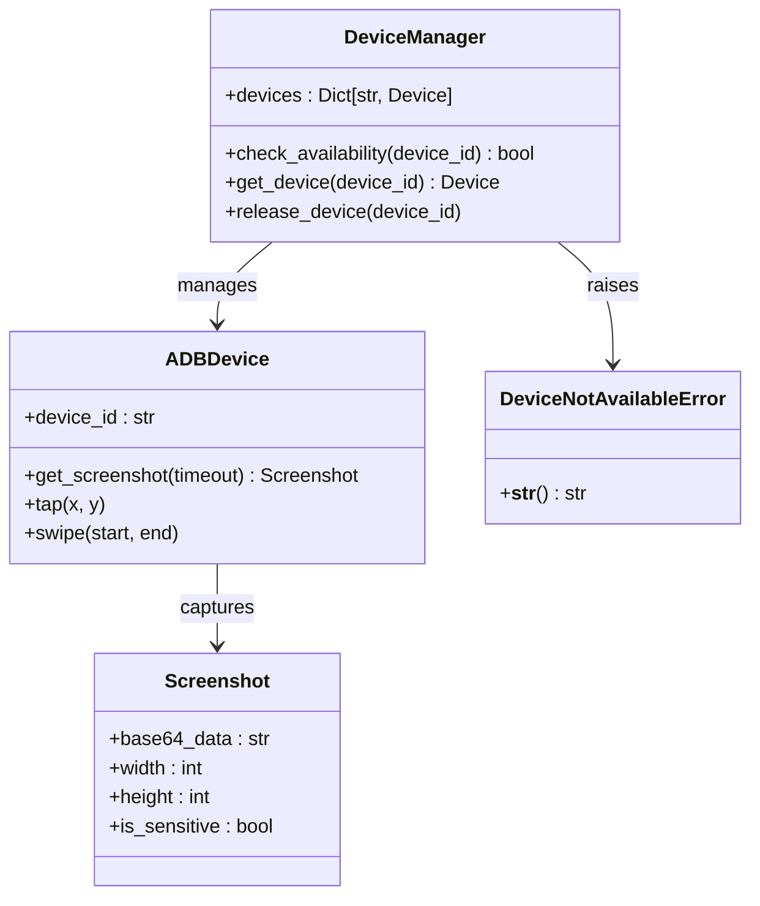
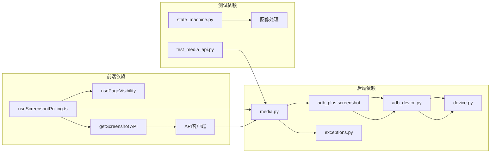
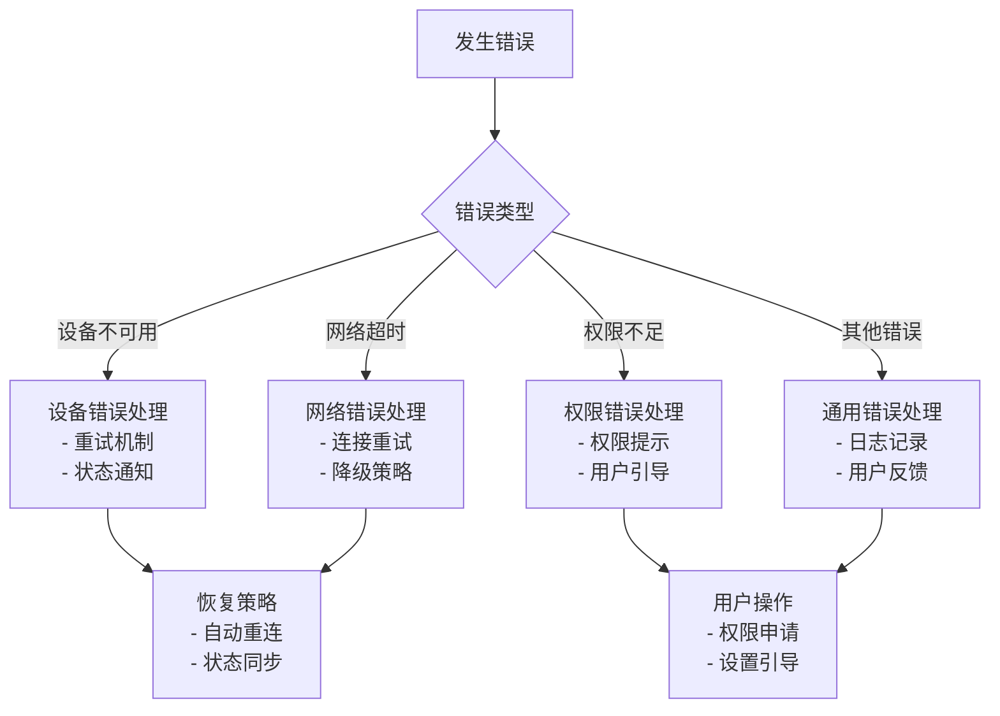

# 屏幕截图轮询服务

<cite>
**本文档引用的文件**
- [useScreenshotPolling.ts](file://frontend/src/hooks/useScreenshotPolling.ts)
- [media.py](file://AutoGLM_GUI/api/media.py)
- [screenshot.py](file://AutoGLM_GUI/adb_plus/screenshot.py)
- [adb_device.py](file://AutoGLM_GUI/devices/adb_device.py)
- [device.py](file://AutoGLM_GUI/adb_plus/device.py)
- [exceptions.py](file://AutoGLM_GUI/exceptions.py)
- [test_media_api.py](file://tests/test_media_api.py)
- [state_machine.py](file://tests/integration/state_machine.py)
- [sse.ts](file://frontend/src/lib/sse.ts)
</cite>

## 目录
1. [简介](#简介)
2. [项目结构](#项目结构)
3. [核心组件](#核心组件)
4. [架构概览](#架构概览)
5. [详细组件分析](#详细组件分析)
6. [依赖关系分析](#依赖关系分析)
7. [性能考虑](#性能考虑)
8. [故障排除指南](#故障排除指南)
9. [结论](#结论)

## 简介

屏幕截图轮询服务是一个完整的实时屏幕监控系统，通过React Hook实现前端轮询机制，结合后端异步处理和设备管理，为用户提供流畅的屏幕预览体验。该系统支持多设备管理、智能轮询控制、错误重试机制和性能优化策略。

系统的核心价值在于：
- **实时性**：通过轮询机制提供接近实时的屏幕预览
- **可靠性**：内置错误处理和重试机制确保服务稳定性
- **可扩展性**：支持多设备并发管理和异步处理
- **用户体验**：智能页面可见性检测避免不必要的资源消耗

## 项目结构

屏幕截图轮询服务跨越前后端两个主要部分，采用分层架构设计：

**图表来源**
- [useScreenshotPolling.ts:1-75](file://frontend/src/hooks/useScreenshotPolling.ts#L1-L75)
- [media.py:79-118](file://AutoGLM_GUI/api/media.py#L79-L118)
- [screenshot.py:172-208](file://AutoGLM_GUI/adb_plus/screenshot.py#L172-L208)

**章节来源**
- [useScreenshotPolling.ts:1-75](file://frontend/src/hooks/useScreenshotPolling.ts#L1-L75)
- [media.py:79-118](file://AutoGLM_GUI/api/media.py#L79-L118)

## 核心组件

### 前端轮询Hook

`useScreenshotPolling` 是整个系统的核心组件，负责管理轮询状态和数据流。

**关键特性：**
- **智能轮询控制**：基于设备ID、启用状态和页面可见性进行条件判断
- **防重复请求**：使用引用标志防止并发请求冲突
- **内存安全**：自动清理定时器和取消未完成的请求
- **错误处理**：统一的异常捕获和日志记录

**配置参数：**
- `deviceId`: 设备唯一标识符
- `enabled`: 轮询启用开关
- `pollDelayMs`: 轮询间隔（毫秒）

### 后端API处理器

媒体API负责处理截图请求，实现设备管理和截图捕获的协调。

**处理流程：**
1. 设备可用性检查
2. 截图捕获执行
3. 数据格式化返回
4. 错误状态处理

### 设备管理器

ADB设备管理器提供统一的设备接口，支持本地和远程设备的截图操作。

**功能特性：**
- 设备状态监控
- 连接状态验证
- 异常设备处理

**章节来源**
- [useScreenshotPolling.ts:5-13](file://frontend/src/hooks/useScreenshotPolling.ts#L5-L13)
- [media.py:79-118](file://AutoGLM_GUI/api/media.py#L79-L118)
- [adb_device.py:43-60](file://AutoGLM_GUI/devices/adb_device.py#L43-L60)

## 架构概览

系统采用分层架构，从前端用户界面到后端设备管理形成完整的数据流：

**图表来源**
- [useScreenshotPolling.ts:24-72](file://frontend/src/hooks/useScreenshotPolling.ts#L24-L72)
- [media.py:79-118](file://AutoGLM_GUI/api/media.py#L79-L118)
- [screenshot.py:172-208](file://AutoGLM_GUI/adb_plus/screenshot.py#L172-L208)

## 详细组件分析

### 轮询Hook实现详解

`useScreenshotPolling` Hook是系统的核心控制器，实现了复杂的轮询逻辑：

**图表来源**
- [useScreenshotPolling.ts:24-72](file://frontend/src/hooks/useScreenshotPolling.ts#L24-L72)

**关键实现细节：**

1. **状态管理**：使用React状态钩子管理截图数据和加载状态
2. **并发控制**：通过引用标志防止同时发起多个请求
3. **生命周期管理**：在组件卸载时自动清理所有资源
4. **错误恢复**：捕获并记录错误，但不影响轮询继续进行

### 后端处理流程

后端API处理器实现了完整的请求处理链路：

**图表来源**
- [media.py:79-118](file://AutoGLM_GUI/api/media.py#L79-L118)
- [screenshot.py:172-208](file://AutoGLM_GUI/adb_plus/screenshot.py#L172-L208)

**章节来源**
- [useScreenshotPolling.ts:15-75](file://frontend/src/hooks/useScreenshotPolling.ts#L15-L75)
- [media.py:79-118](file://AutoGLM_GUI/api/media.py#L79-L118)

### 设备管理架构

设备管理系统提供了统一的设备抽象层：

**图表来源**
- [adb_device.py:37-60](file://AutoGLM_GUI/devices/adb_device.py#L37-L60)
- [exceptions.py:4-7](file://AutoGLM_GUI/exceptions.py#L4-L7)

**章节来源**
- [device.py:10-50](file://AutoGLM_GUI/adb_plus/device.py#L10-L50)
- [adb_device.py:43-60](file://AutoGLM_GUI/devices/adb_device.py#L43-L60)

## 依赖关系分析

系统的依赖关系呈现清晰的层次结构：

**图表来源**
- [useScreenshotPolling.ts:1-3](file://frontend/src/hooks/useScreenshotPolling.ts#L1-L3)
- [media.py:79-89](file://AutoGLM_GUI/api/media.py#L79-L89)

**章节来源**
- [test_media_api.py:124-221](file://tests/test_media_api.py#L124-L221)
- [state_machine.py:47-70](file://tests/integration/state_machine.py#L47-L70)

## 性能考虑

### 轮询优化策略

系统采用了多项性能优化措施来确保高效运行：

1. **智能轮询控制**
   - 页面不可见时暂停轮询
   - 支持动态调整轮询间隔
   - 防止并发请求冲突

2. **内存管理**
   - 自动清理定时器资源
   - 及时释放未使用的截图数据
   - 组件卸载时的完整资源回收

3. **网络优化**
   - 基于Base64的数据传输
   - 异步非阻塞的请求处理
   - 超时控制和重试机制

### 性能监控

系统内置了性能监控机制，可以跟踪关键指标：

- **轮询频率控制**：根据网络状况动态调整
- **内存使用监控**：跟踪截图数据的内存占用
- **错误率统计**：记录设备连接和截图失败情况

**章节来源**
- [useScreenshotPolling.ts:20-22](file://frontend/src/hooks/useScreenshotPolling.ts#L20-L22)
- [device.py:24-46](file://AutoGLM_GUI/adb_plus/device.py#L24-L46)

## 故障排除指南

### 常见问题及解决方案

#### 轮询频率过高

**问题表现：**
- CPU使用率过高
- 网络带宽占用严重
- 设备响应缓慢

**解决方案：**
1. 增加轮询间隔时间
2. 实现自适应轮询策略
3. 添加节流机制

#### 网络延迟问题

**问题表现：**
- 截图加载缓慢
- 用户界面卡顿
- 轮询超时错误

**解决方案：**
1. 实现请求超时控制
2. 添加重试机制
3. 优化图像压缩算法

#### 内存占用过高

**问题表现：**
- 浏览器内存泄漏
- 应用程序崩溃
- 性能逐渐下降

**解决方案：**
1. 实现截图数据缓存管理
2. 定期清理过期数据
3. 使用弱引用避免循环引用

### 错误处理机制

系统实现了多层次的错误处理：

**图表来源**
- [media.py:99-118](file://AutoGLM_GUI/api/media.py#L99-L118)
- [exceptions.py:4-7](file://AutoGLM_GUI/exceptions.py#L4-L7)

**章节来源**
- [test_media_api.py:205-221](file://tests/test_media_api.py#L205-L221)
- [state_machine.py:47-70](file://tests/integration/state_machine.py#L47-L70)

### 调试和诊断

系统提供了完善的调试工具：

1. **日志记录**：详细的错误日志和性能指标
2. **状态监控**：实时显示轮询状态和设备信息
3. **性能分析**：跟踪关键操作的执行时间和资源使用

**章节来源**
- [useScreenshotPolling.ts:44-46](file://frontend/src/hooks/useScreenshotPolling.ts#L44-L46)
- [media.py:109-118](file://AutoGLM_GUI/api/media.py#L109-L118)

## 结论

屏幕截图轮询服务是一个设计精良的实时监控系统，通过前后端协同实现了高效的屏幕预览功能。系统的主要优势包括：

**技术优势：**
- **模块化设计**：清晰的分层架构便于维护和扩展
- **异步处理**：非阻塞的请求处理提升用户体验
- **错误恢复**：完善的错误处理机制确保系统稳定性

**性能优势：**
- **资源优化**：智能的资源管理和内存控制
- **网络优化**：高效的网络通信和数据传输
- **并发控制**：合理的并发处理避免资源竞争

**用户体验优势：**
- **响应迅速**：低延迟的屏幕预览
- **稳定可靠**：持续稳定的轮询服务
- **易于使用**：简单的API接口和配置选项

该系统为类似的应用场景提供了优秀的参考实现，其设计理念和架构模式值得在其他项目中借鉴和应用。