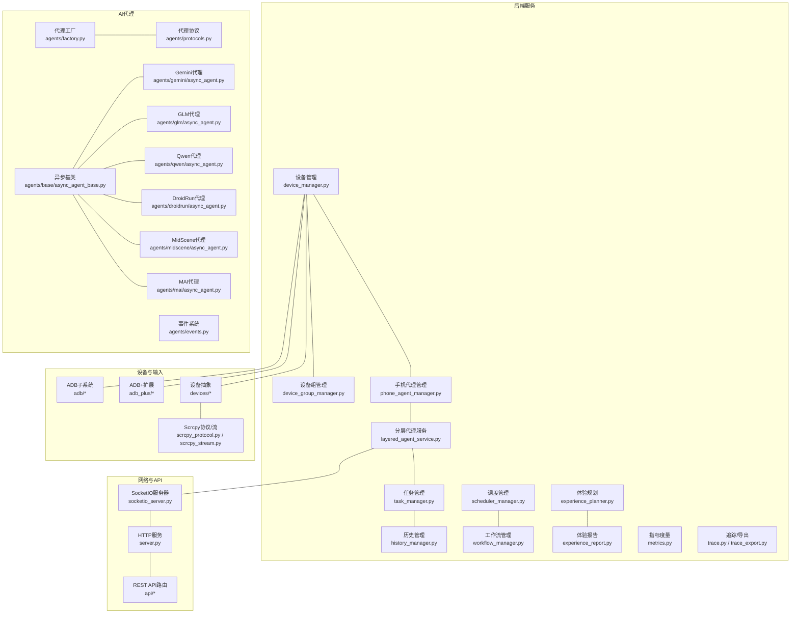
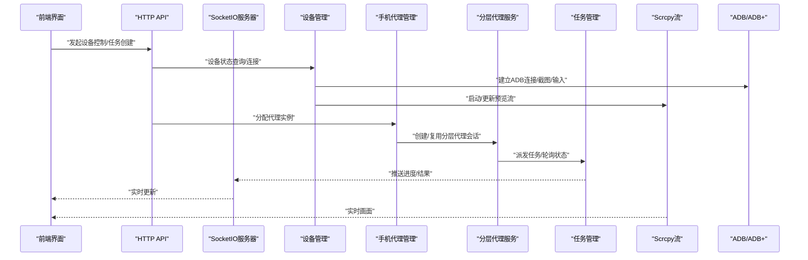
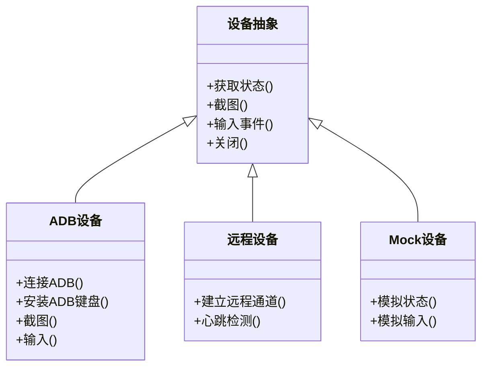
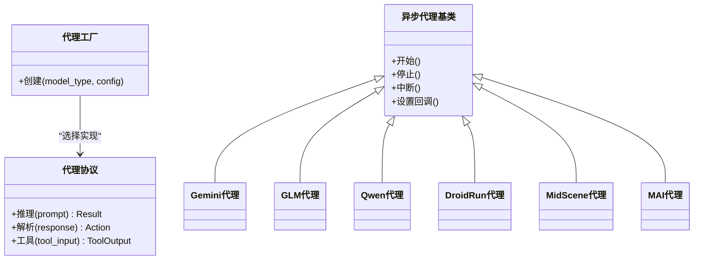
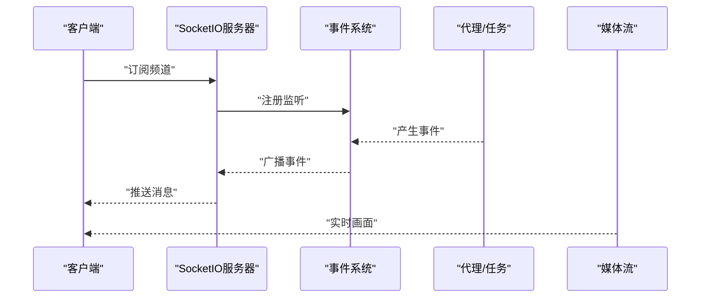
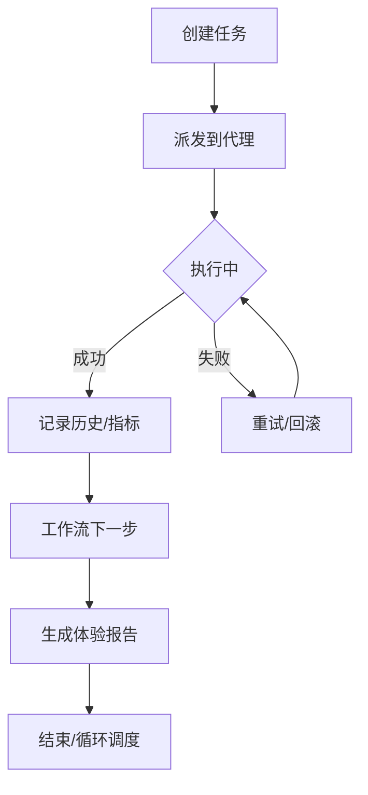
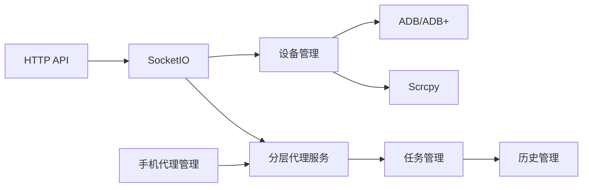

# 核心功能

<cite>
**本文引用的文件**
- [__main__.py](file://AutoGLM_GUI/__main__.py)
- [device_manager.py](file://AutoGLM_GUI/device_manager.py)
- [device_group_manager.py](file://AutoGLM_GUI/device_group_manager.py)
- [adb_manager.py](file://AutoGLM_GUI/adb_manager.py)
- [phone_agent_manager.py](file://AutoGLM_GUI/phone_agent_manager.py)
- [socketio_server.py](file://AutoGLM_GUI/socketio_server.py)
- [server.py](file://AutoGLM_GUI/server.py)
- [adb_device.py](file://AutoGLM_GUI/devices/adb_device.py)
- [remote_device.py](file://AutoGLM_GUI/devices/remote_device.py)
- [mock_device.py](file://AutoGLM_GUI/devices/mock_device.py)
- [async_agent_base.py](file://AutoGLM_GUI/agents/base/async_agent_base.py)
- [async_agent.py](file://AutoGLM_GUI/agents/gemini/async_agent.py)
- [async_agent.py](file://AutoGLM_GUI/agents/glm/async_agent.py)
- [async_agent.py](file://AutoGLM_GUI/agents/qwen/async_agent.py)
- [async_agent.py](file://AutoGLM_GUI/agents/droidrun/async_agent.py)
- [async_agent.py](file://AutoGLM_GUI/agents/midscene/async_agent.py)
- [async_agent.py](file://AutoGLM_GUI/agents/mai/async_agent.py)
- [factory.py](file://AutoGLM_GUI/agents/factory.py)
- [protocols.py](file://AutoGLM_GUI/agents/protocols.py)
- [events.py](file://AutoGLM_GUI/agents/events.py)
- [layered_agent_service.py](file://AutoGLM_GUI/layered_agent_service.py)
- [task_manager.py](file://AutoGLM_GUI/task_manager.py)
- [history_manager.py](file://AutoGLM_GUI/history_manager.py)
- [experience_planner.py](file://AutoGLM_GUI/experience_planner.py)
- [experience_report.py](file://AutoGLM_GUI/experience_report.py)
- [scheduler_manager.py](file://AutoGLM_GUI/scheduler_manager.py)
- [workflow_manager.py](file://AutoGLM_GUI/workflow_manager.py)
- [metrics.py](file://AutoGLM_GUI/metrics.py)
- [trace.py](file://AutoGLM_GUI/trace.py)
- [trace_export.py](file://AutoGLM_GUI/trace_export.py)
- [adb_terminal_repl.py](file://AutoGLM_GUI/adb_terminal_repl.py)
- [adb_terminal_service.py](file://AutoGLM_GUI/adb_terminal_service.py)
- [adb/connection.py](file://AutoGLM_GUI/adb/connection.py)
- [adb/device.py](file://AutoGLM_GUI/adb/device.py)
- [adb/input.py](file://AutoGLM_GUI/adb/input.py)
- [adb/screenshot.py](file://AutoGLM_GUI/adb/screenshot.py)
- [adb_plus/device.py](file://AutoGLM_GUI/adb_plus/device.py)
- [adb_plus/display.py](file://AutoGLM_GUI/adb_plus/display.py)
- [adb_plus/ip.py](file://AutoGLM_GUI/adb_plus/ip.py)
- [adb_plus/pair.py](file://AutoGLM_GUI/adb_plus/pair.py)
- [adb_plus/qr_pair.py](file://AutoGLM_GUI/adb_plus/qr_pair.py)
- [adb_plus/touch.py](file://AutoGLM_GUI/adb_plus/touch.py)
- [adb_plus/serial.py](file://AutoGLM_GUI/adb_plus/serial.py)
- [adb_plus/version.py](file://AutoGLM_GUI/adb_plus/version.py)
- [adb_plus/mdns.py](file://AutoGLM_GUI/adb_plus/mdns.py)
- [adb_plus/keyboard_installer.py](file://AutoGLM_GUI/adb_plus/keyboard_installer.py)
- [adb_plus/screenshot.py](file://AutoGLM_GUI/adb_plus/screenshot.py)
- [scrcpy_protocol.py](file://AutoGLM_GUI/scrcpy_protocol.py)
- [scrcpy_stream.py](file://AutoGLM_GUI/scrcpy_stream.py)
- [config.py](file://AutoGLM_GUI/config.py)
- [config_manager.py](file://AutoGLM_GUI/config_manager.py)
- [schemas.py](file://AutoGLM_GUI/schemas.py)
- [types.py](file://AutoGLM_GUI/types.py)
- [exceptions.py](file://AutoGLM_GUI/exceptions.py)
- [logger.py](file://AutoGLM_GUI/logger.py)
- [version.py](file://AutoGLM_GUI/version.py)
- [prompt_config.py](file://AutoGLM_GUI/prompt_config.py)
- [prompts.py](file://AutoGLM_GUI/prompts.py)
- [i18n.py](file://AutoGLM_GUI/i18n.py)
- [platform_utils.py](file://AutoGLM_GUI/platform_utils.py)
- [device_metadata_manager.py](file://AutoGLM_GUI/device_metadata_manager.py)
- [models/device_group.py](file://AutoGLM_GUI/models/device_group.py)
- [models/history.py](file://AutoGLM_GUI/models/history.py)
- [models/scheduled_task.py](file://AutoGLM_GUI/models/scheduled_task.py)
- [api/devices.py](file://AutoGLM_GUI/api/devices.py)
- [api/control.py](file://AutoGLM_GUI/api/control.py)
- [api/agents.py](file://AutoGLM_GUI/api/agents.py)
- [api/workflows.py](file://AutoGLM_GUI/api/workflows.py)
- [api/tasks.py](file://AutoGLM_GUI/api/tasks.py)
- [api/history.py](file://AutoGLM_GUI/api/history.py)
- [api/metrics.py](file://AutoGLM_GUI/api/metrics.py)
- [api/scheduled_tasks.py](file://AutoGLM_GUI/api/scheduled_tasks.py)
- [api/terminal.py](file://AutoGLM_GUI/api/terminal.py)
- [api/health.py](file://AutoGLM_GUI/api/health.py)
- [api/version.py](file://AutoGLM_GUI/api/version.py)
- [api/experience.py](file://AutoGLM_GUI/api/experience.py)
- [api/mcp.py](file://AutoGLM_GUI/api/mcp.py)
- [api/media.py](file://AutoGLM_GUI/api/media.py)
- [api/layered_agent.py](file://AutoGLM_GUI/api/layered_agent.py)
- [api/terminal.py](file://AutoGLM_GUI/api/terminal.py)
- [api/terminal_service.py](file://AutoGLM_GUI/api/terminal_service.py)
</cite>

## 目录
1. [简介](#简介)
2. [项目结构](#项目结构)
3. [核心组件](#核心组件)
4. [架构总览](#架构总览)
5. [详细组件分析](#详细组件分析)
6. [依赖分析](#依赖分析)
7. [性能考虑](#性能考虑)
8. [故障排查指南](#故障排查指南)
9. [结论](#结论)
10. [附录](#附录)

## 简介
本文件聚焦AutoGLM-GUI的核心功能，围绕设备管理、AI代理系统与实时通信系统进行深入解析。文档从系统架构、组件职责、数据流与处理逻辑入手，结合具体源码路径，帮助初学者快速上手，同时为资深开发者提供足够的技术深度与可操作的参考。

## 项目结构
AutoGLM-GUI采用模块化分层设计：后端服务（设备、代理、任务、历史、调度、工作流）与前端界面通过SocketIO与REST API交互；ADB与Scrcpy负责设备侧控制与预览；多模型适配器通过统一工厂与协议抽象接入。

图表来源
- [device_manager.py](file://AutoGLM_GUI/device_manager.py)
- [device_group_manager.py](file://AutoGLM_GUI/device_group_manager.py)
- [phone_agent_manager.py](file://AutoGLM_GUI/phone_agent_manager.py)
- [layered_agent_service.py](file://AutoGLM_GUI/layered_agent_service.py)
- [task_manager.py](file://AutoGLM_GUI/task_manager.py)
- [history_manager.py](file://AutoGLM_GUI/history_manager.py)
- [scheduler_manager.py](file://AutoGLM_GUI/scheduler_manager.py)
- [workflow_manager.py](file://AutoGLM_GUI/workflow_manager.py)
- [experience_planner.py](file://AutoGLM_GUI/experience_planner.py)
- [experience_report.py](file://AutoGLM_GUI/experience_report.py)
- [metrics.py](file://AutoGLM_GUI/metrics.py)
- [trace.py](file://AutoGLM_GUI/trace.py)
- [trace_export.py](file://AutoGLM_GUI/trace_export.py)
- [adb_manager.py](file://AutoGLM_GUI/adb_manager.py)
- [adb/connection.py](file://AutoGLM_GUI/adb/connection.py)
- [adb/device.py](file://AutoGLM_GUI/adb/device.py)
- [adb_plus/device.py](file://AutoGLM_GUI/adb_plus/device.py)
- [scrcpy_protocol.py](file://AutoGLM_GUI/scrcpy_protocol.py)
- [scrcpy_stream.py](file://AutoGLM_GUI/scrcpy_stream.py)
- [devices/adb_device.py](file://AutoGLM_GUI/devices/adb_device.py)
- [devices/remote_device.py](file://AutoGLM_GUI/devices/remote_device.py)
- [devices/mock_device.py](file://AutoGLM_GUI/devices/mock_device.py)
- [agents/factory.py](file://AutoGLM_GUI/agents/factory.py)
- [agents/protocols.py](file://AutoGLM_GUI/agents/protocols.py)
- [agents/events.py](file://AutoGLM_GUI/agents/events.py)
- [agents/base/async_agent_base.py](file://AutoGLM_GUI/agents/base/async_agent_base.py)
- [agents/gemini/async_agent.py](file://AutoGLM_GUI/agents/gemini/async_agent.py)
- [agents/glm/async_agent.py](file://AutoGLM_GUI/agents/glm/async_agent.py)
- [agents/qwen/async_agent.py](file://AutoGLM_GUI/agents/qwen/async_agent.py)
- [agents/droidrun/async_agent.py](file://AutoGLM_GUI/agents/droidrun/async_agent.py)
- [agents/midscene/async_agent.py](file://AutoGLM_GUI/agents/midscene/async_agent.py)
- [agents/mai/async_agent.py](file://AutoGLM_GUI/agents/mai/async_agent.py)
- [socketio_server.py](file://AutoGLM_GUI/socketio_server.py)
- [server.py](file://AutoGLM_GUI/server.py)
- [api/devices.py](file://AutoGLM_GUI/api/devices.py)
- [api/control.py](file://AutoGLM_GUI/api/control.py)
- [api/agents.py](file://AutoGLM_GUI/api/agents.py)
- [api/workflows.py](file://AutoGLM_GUI/api/workflows.py)
- [api/tasks.py](file://AutoGLM_GUI/api/tasks.py)
- [api/history.py](file://AutoGLM_GUI/api/history.py)
- [api/metrics.py](file://AutoGLM_GUI/api/metrics.py)
- [api/scheduled_tasks.py](file://AutoGLM_GUI/api/scheduled_tasks.py)
- [api/terminal.py](file://AutoGLM_GUI/api/terminal.py)
- [api/health.py](file://AutoGLM_GUI/api/health.py)
- [api/version.py](file://AutoGLM_GUI/api/version.py)
- [api/experience.py](file://AutoGLM_GUI/api/experience.py)
- [api/mcp.py](file://AutoGLM_GUI/api/mcp.py)
- [api/media.py](file://AutoGLM_GUI/api/media.py)
- [api/layered_agent.py](file://AutoGLM_GUI/api/layered_agent.py)

章节来源
- [__main__.py](file://AutoGLM_GUI/__main__.py)
- [server.py](file://AutoGLM_GUI/server.py)
- [socketio_server.py](file://AutoGLM_GUI/socketio_server.py)

## 核心组件
- 设备管理：负责设备发现、连接、状态维护、元数据管理与释放回收。
- AI代理系统：统一工厂与协议抽象，支持多模型（Gemini、GLM、Qwen、DroidRun、MidScene、MAI）异步执行，提供事件驱动与会话管理。
- 实时通信：基于SocketIO与HTTP API，提供设备控制、任务下发、媒体传输、日志与指标推送。
- 任务与工作流：任务编排、历史记录、调度与体验规划闭环。
- ADB与Scrcpy：设备侧输入、截图、显示与流式预览。
- 配置与元数据：集中配置、国际化、平台工具与版本信息。

章节来源
- [device_manager.py](file://AutoGLM_GUI/device_manager.py)
- [device_group_manager.py](file://AutoGLM_GUI/device_group_manager.py)
- [phone_agent_manager.py](file://AutoGLM_GUI/phone_agent_manager.py)
- [agents/factory.py](file://AutoGLM_GUI/agents/factory.py)
- [agents/protocols.py](file://AutoGLM_GUI/agents/protocols.py)
- [socketio_server.py](file://AutoGLM_GUI/socketio_server.py)
- [server.py](file://AutoGLM_GUI/server.py)
- [adb_manager.py](file://AutoGLM_GUI/adb_manager.py)
- [scrcpy_protocol.py](file://AutoGLM_GUI/scrcpy_protocol.py)
- [scrcpy_stream.py](file://AutoGLM_GUI/scrcpy_stream.py)
- [config.py](file://AutoGLM_GUI/config.py)
- [config_manager.py](file://AutoGLM_GUI/config_manager.py)
- [device_metadata_manager.py](file://AutoGLM_GUI/device_metadata_manager.py)

## 架构总览
系统以“设备—代理—任务—历史/调度/工作流”为主线，配合“ADB/Scrcpy—SocketIO/API”的基础设施层，形成前后端协同的自动化执行框架。

图表来源
- [server.py](file://AutoGLM_GUI/server.py)
- [socketio_server.py](file://AutoGLM_GUI/socketio_server.py)
- [device_manager.py](file://AutoGLM_GUI/device_manager.py)
- [phone_agent_manager.py](file://AutoGLM_GUI/phone_agent_manager.py)
- [layered_agent_service.py](file://AutoGLM_GUI/layered_agent_service.py)
- [task_manager.py](file://AutoGLM_GUI/task_manager.py)
- [scrcpy_stream.py](file://AutoGLM_GUI/scrcpy_stream.py)
- [adb/connection.py](file://AutoGLM_GUI/adb/connection.py)
- [adb_plus/device.py](file://AutoGLM_GUI/adb_plus/device.py)

## 详细组件分析

### 设备管理系统
- 职责边界
  - 设备生命周期管理：发现、连接、初始化、心跳、断开、释放。
  - 设备抽象：ADB设备、远程设备、Mock设备三类实现，统一接口。
  - 元数据管理：设备名称、分辨率、序列号、IP等持久化与缓存。
  - 组管理：设备分组、批量操作、权限隔离。
- 关键流程
  - 连接建立：优先ADB直连，失败则尝试ADB+（QR配对、mDNS、IP直连）。
  - 预览流：Scrcpy协议建立视频流，支持旋转、缩放与帧率控制。
  - 截图与输入：ADB截图与输入模拟，ADB+键盘安装与触控增强。
- 数据结构与复杂度
  - 设备字典：O(1)查找；设备组列表：按需过滤。
  - ADB命令队列：串行或并发受控，避免竞态。
- 错误处理
  - 连接超时、设备离线、ADB不可用、Scrcpy异常均需降级与重试策略。
- 性能要点
  - 截图与流解码在后台线程/进程执行；预览帧率自适应；输入延迟最小化。

图表来源
- [devices/adb_device.py](file://AutoGLM_GUI/devices/adb_device.py)
- [devices/remote_device.py](file://AutoGLM_GUI/devices/remote_device.py)
- [devices/mock_device.py](file://AutoGLM_GUI/devices/mock_device.py)

章节来源
- [device_manager.py](file://AutoGLM_GUI/device_manager.py)
- [device_group_manager.py](file://AutoGLM_GUI/device_group_manager.py)
- [device_metadata_manager.py](file://AutoGLM_GUI/device_metadata_manager.py)
- [adb_manager.py](file://AutoGLM_GUI/adb_manager.py)
- [adb/connection.py](file://AutoGLM_GUI/adb/connection.py)
- [adb/device.py](file://AutoGLM_GUI/adb/device.py)
- [adb_plus/device.py](file://AutoGLM_GUI/adb_plus/device.py)
- [adb_plus/pair.py](file://AutoGLM_GUI/adb_plus/pair.py)
- [adb_plus/qr_pair.py](file://AutoGLM_GUI/adb_plus/qr_pair.py)
- [adb_plus/mdns.py](file://AutoGLM_GUI/adb_plus/mdns.py)
- [adb_plus/ip.py](file://AutoGLM_GUI/adb_plus/ip.py)
- [adb_plus/keyboard_installer.py](file://AutoGLM_GUI/adb_plus/keyboard_installer.py)
- [adb_plus/touch.py](file://AutoGLM_GUI/adb_plus/touch.py)
- [adb_plus/screenshot.py](file://AutoGLM_GUI/adb_plus/screenshot.py)
- [scrcpy_protocol.py](file://AutoGLM_GUI/scrcpy_protocol.py)
- [scrcpy_stream.py](file://AutoGLM_GUI/scrcpy_stream.py)

### AI代理系统
- 工厂与协议
  - 工厂根据模型类型选择对应代理实现，统一构造参数与生命周期。
  - 协议定义通用接口（如推理、解析、工具调用），便于替换与扩展。
- 异步执行与事件
  - 基类提供异步上下文、错误传播、超时与中断机制。
  - 事件系统用于跨模块广播状态变化（如开始、进度、完成、错误）。
- 多模型适配
  - Gemini/GLM/Qwen/DroidRun/MidScene/MAI各具提示词工程与动作映射策略，但共享统一的调用模式。
- 会话与分层代理
  - 分层代理服务负责多轮对话、上下文记忆与跨代理协作。

图表来源
- [agents/factory.py](file://AutoGLM_GUI/agents/factory.py)
- [agents/protocols.py](file://AutoGLM_GUI/agents/protocols.py)
- [agents/base/async_agent_base.py](file://AutoGLM_GUI/agents/base/async_agent_base.py)
- [agents/gemini/async_agent.py](file://AutoGLM_GUI/agents/gemini/async_agent.py)
- [agents/glm/async_agent.py](file://AutoGLM_GUI/agents/glm/async_agent.py)
- [agents/qwen/async_agent.py](file://AutoGLM_GUI/agents/qwen/async_agent.py)
- [agents/droidrun/async_agent.py](file://AutoGLM_GUI/agents/droidrun/async_agent.py)
- [agents/midscene/async_agent.py](file://AutoGLM_GUI/agents/midscene/async_agent.py)
- [agents/mai/async_agent.py](file://AutoGLM_GUI/agents/mai/async_agent.py)

章节来源
- [phone_agent_manager.py](file://AutoGLM_GUI/phone_agent_manager.py)
- [layered_agent_service.py](file://AutoGLM_GUI/layered_agent_service.py)
- [agents/events.py](file://AutoGLM_GUI/agents/events.py)
- [agents/protocols.py](file://AutoGLM_GUI/agents/protocols.py)
- [agents/factory.py](file://AutoGLM_GUI/agents/factory.py)

### 实时通信系统
- SocketIO
  - 服务端监听设备/任务/代理事件，向客户端推送增量状态与媒体流。
  - 客户端订阅频道，接收实时画面、日志、指标与通知。
- HTTP API
  - 提供设备管理、控制、代理会话、任务、历史、调度、工作流、终端、健康检查、版本、体验、MCP、媒体、分层代理等REST接口。
- 流媒体
  - Scrcpy协议负责视频帧编码与传输；ADB+截图作为补充。

图表来源
- [socketio_server.py](file://AutoGLM_GUI/socketio_server.py)
- [agents/events.py](file://AutoGLM_GUI/agents/events.py)
- [scrcpy_stream.py](file://AutoGLM_GUI/scrcpy_stream.py)
- [api/devices.py](file://AutoGLM_GUI/api/devices.py)
- [api/control.py](file://AutoGLM_GUI/api/control.py)
- [api/agents.py](file://AutoGLM_GUI/api/agents.py)
- [api/workflows.py](file://AutoGLM_GUI/api/workflows.py)
- [api/tasks.py](file://AutoGLM_GUI/api/tasks.py)
- [api/history.py](file://AutoGLM_GUI/api/history.py)
- [api/metrics.py](file://AutoGLM_GUI/api/metrics.py)
- [api/scheduled_tasks.py](file://AutoGLM_GUI/api/scheduled_tasks.py)
- [api/terminal.py](file://AutoGLM_GUI/api/terminal.py)
- [api/health.py](file://AutoGLM_GUI/api/health.py)
- [api/version.py](file://AutoGLM_GUI/api/version.py)
- [api/experience.py](file://AutoGLM_GUI/api/experience.py)
- [api/mcp.py](file://AutoGLM_GUI/api/mcp.py)
- [api/media.py](file://AutoGLM_GUI/api/media.py)
- [api/layered_agent.py](file://AutoGLM_GUI/api/layered_agent.py)

章节来源
- [socketio_server.py](file://AutoGLM_GUI/socketio_server.py)
- [server.py](file://AutoGLM_GUI/server.py)
- [api/devices.py](file://AutoGLM_GUI/api/devices.py)
- [api/control.py](file://AutoGLM_GUI/api/control.py)
- [api/agents.py](file://AutoGLM_GUI/api/agents.py)
- [api/workflows.py](file://AutoGLM_GUI/api/workflows.py)
- [api/tasks.py](file://AutoGLM_GUI/api/tasks.py)
- [api/history.py](file://AutoGLM_GUI/api/history.py)
- [api/metrics.py](file://AutoGLM_GUI/api/metrics.py)
- [api/scheduled_tasks.py](file://AutoGLM_GUI/api/scheduled_tasks.py)
- [api/terminal.py](file://AutoGLM_GUI/api/terminal.py)
- [api/health.py](file://AutoGLM_GUI/api/health.py)
- [api/version.py](file://AutoGLM_GUI/api/version.py)
- [api/experience.py](file://AutoGLM_GUI/api/experience.py)
- [api/mcp.py](file://AutoGLM_GUI/api/mcp.py)
- [api/media.py](file://AutoGLM_GUI/api/media.py)
- [api/layered_agent.py](file://AutoGLM_GUI/api/layered_agent.py)

### 任务与工作流
- 任务管理：任务创建、状态机推进、失败重试、取消与中断。
- 历史管理：记录任务轨迹、截图、日志与中间结果。
- 调度管理：定时任务、周期性任务与资源节流。
- 工作流管理：步骤编排、条件分支、并行与串行组合。
- 体验规划与报告：基于历史与指标生成体验报告，指导优化。

图表来源
- [task_manager.py](file://AutoGLM_GUI/task_manager.py)
- [history_manager.py](file://AutoGLM_GUI/history_manager.py)
- [scheduler_manager.py](file://AutoGLM_GUI/scheduler_manager.py)
- [workflow_manager.py](file://AutoGLM_GUI/workflow_manager.py)
- [experience_planner.py](file://AutoGLM_GUI/experience_planner.py)
- [experience_report.py](file://AutoGLM_GUI/experience_report.py)
- [metrics.py](file://AutoGLM_GUI/metrics.py)

章节来源
- [task_manager.py](file://AutoGLM_GUI/task_manager.py)
- [history_manager.py](file://AutoGLM_GUI/history_manager.py)
- [scheduler_manager.py](file://AutoGLM_GUI/scheduler_manager.py)
- [workflow_manager.py](file://AutoGLM_GUI/workflow_manager.py)
- [experience_planner.py](file://AutoGLM_GUI/experience_planner.py)
- [experience_report.py](file://AutoGLM_GUI/experience_report.py)
- [metrics.py](file://AutoGLM_GUI/metrics.py)

### ADB与Scrcpy
- ADB子系统：连接、设备枚举、截图、输入、安装/卸载、权限与调试桥。
- ADB+扩展：QR配对、mDNS自动发现、IP直连、键盘安装、触控增强、版本与序列号解析。
- Scrcpy协议：视频编码、控制通道、帧率与分辨率自适应、音频转发（可选）。

章节来源
- [adb_manager.py](file://AutoGLM_GUI/adb_manager.py)
- [adb/connection.py](file://AutoGLM_GUI/adb/connection.py)
- [adb/device.py](file://AutoGLM_GUI/adb/device.py)
- [adb/input.py](file://AutoGLM_GUI/adb/input.py)
- [adb/screenshot.py](file://AutoGLM_GUI/adb/screenshot.py)
- [adb_plus/device.py](file://AutoGLM_GUI/adb_plus/device.py)
- [adb_plus/display.py](file://AutoGLM_GUI/adb_plus/display.py)
- [adb_plus/ip.py](file://AutoGLM_GUI/adb_plus/ip.py)
- [adb_plus/pair.py](file://AutoGLM_GUI/adb_plus/pair.py)
- [adb_plus/qr_pair.py](file://AutoGLM_GUI/adb_plus/qr_pair.py)
- [adb_plus/touch.py](file://AutoGLM_GUI/adb_plus/touch.py)
- [adb_plus/serial.py](file://AutoGLM_GUI/adb_plus/serial.py)
- [adb_plus/version.py](file://AutoGLM_GUI/adb_plus/version.py)
- [adb_plus/mdns.py](file://AutoGLM_GUI/adb_plus/mdns.py)
- [adb_plus/keyboard_installer.py](file://AutoGLM_GUI/adb_plus/keyboard_installer.py)
- [adb_plus/screenshot.py](file://AutoGLM_GUI/adb_plus/screenshot.py)
- [scrcpy_protocol.py](file://AutoGLM_GUI/scrcpy_protocol.py)
- [scrcpy_stream.py](file://AutoGLM_GUI/scrcpy_stream.py)

### 配置与元数据
- 配置中心：集中管理模型参数、设备阈值、网络与超时设置。
- 国际化：语言切换与文案加载。
- 平台工具：跨平台兼容性封装。
- 版本与追踪：版本号、构建信息与追踪埋点。

章节来源
- [config.py](file://AutoGLM_GUI/config.py)
- [config_manager.py](file://AutoGLM_GUI/config_manager.py)
- [i18n.py](file://AutoGLM_GUI/i18n.py)
- [platform_utils.py](file://AutoGLM_GUI/platform_utils.py)
- [version.py](file://AutoGLM_GUI/version.py)
- [trace.py](file://AutoGLM_GUI/trace.py)
- [trace_export.py](file://AutoGLM_GUI/trace_export.py)

## 依赖分析
- 组件耦合
  - 设备管理与ADB/Scrcpy强耦合，但通过设备抽象降低上层依赖。
  - 代理系统通过工厂与协议解耦具体模型实现。
  - 实时通信层独立于业务逻辑，仅依赖事件系统。
- 外部依赖
  - ADB工具链、Scrcpy二进制、模型API网关。
- 潜在环路
  - 事件广播应避免循环触发；代理与任务间通过回调解耦。

图表来源
- [device_manager.py](file://AutoGLM_GUI/device_manager.py)
- [adb_plus/device.py](file://AutoGLM_GUI/adb_plus/device.py)
- [scrcpy_stream.py](file://AutoGLM_GUI/scrcpy_stream.py)
- [phone_agent_manager.py](file://AutoGLM_GUI/phone_agent_manager.py)
- [layered_agent_service.py](file://AutoGLM_GUI/layered_agent_service.py)
- [task_manager.py](file://AutoGLM_GUI/task_manager.py)
- [history_manager.py](file://AutoGLM_GUI/history_manager.py)
- [server.py](file://AutoGLM_GUI/server.py)
- [socketio_server.py](file://AutoGLM_GUI/socketio_server.py)

## 性能考虑
- I/O密集型优化
  - ADB命令批量化与去抖动；Scrcpy帧率动态调节；媒体解码异步化。
- 内存与GC
  - 截图与视频帧及时释放；长会话定期清理上下文。
- 网络与并发
  - SocketIO连接池与消息队列；API限流与背压；代理并发数上限。
- 可观测性
  - 指标采集与追踪埋点；异常链路告警。

## 故障排查指南
- 设备连接失败
  - 检查ADB授权、USB/无线模式、防火墙；尝试ADB+QR配对或mDNS发现。
- Scrcpy画面卡顿
  - 降低分辨率/帧率；关闭音频；检查编码器与网络带宽。
- 代理推理异常
  - 查看模型API响应与鉴权；确认提示词与动作映射正确；启用重试与降级。
- 实时通信中断
  - 检查SocketIO连接状态与心跳；确认事件监听未被阻塞。
- 任务执行失败
  - 查看历史记录与指标；定位失败节点；必要时人工干预。

章节来源
- [exceptions.py](file://AutoGLM_GUI/exceptions.py)
- [logger.py](file://AutoGLM_GUI/logger.py)
- [adb_plus/pair.py](file://AutoGLM_GUI/adb_plus/pair.py)
- [adb_plus/qr_pair.py](file://AutoGLM_GUI/adb_plus/qr_pair.py)
- [adb_plus/mdns.py](file://AutoGLM_GUI/adb_plus/mdns.py)
- [scrcpy_protocol.py](file://AutoGLM_GUI/scrcpy_protocol.py)
- [socketio_server.py](file://AutoGLM_GUI/socketio_server.py)

## 结论
AutoGLM-GUI通过清晰的模块划分与协议抽象，实现了设备、代理、任务与通信的高内聚低耦合。建议在生产环境中强化可观测性与容错策略，并持续优化ADB/Scrcpy与代理推理的性能瓶颈。

## 附录
- 关键API与使用模式
  - 设备管理：创建/删除设备、查询状态、批量操作。
  - 控制接口：点击/滑动/输入文本/截图/重启应用。
  - 代理会话：创建/销毁会话、发送消息、获取动作。
  - 任务与工作流：创建任务、查询进度、取消/中断。
  - 历史与指标：查询历史、导出轨迹、查看统计。
  - 终端与媒体：打开ADB终端、上传/下载媒体。
  - 健康检查与版本：服务可用性与版本信息。
  - MCP与媒体：外部工具集成与媒体处理。
  - 分层代理：多轮对话与上下文管理。

章节来源
- [api/devices.py](file://AutoGLM_GUI/api/devices.py)
- [api/control.py](file://AutoGLM_GUI/api/control.py)
- [api/agents.py](file://AutoGLM_GUI/api/agents.py)
- [api/workflows.py](file://AutoGLM_GUI/api/workflows.py)
- [api/tasks.py](file://AutoGLM_GUI/api/tasks.py)
- [api/history.py](file://AutoGLM_GUI/api/history.py)
- [api/metrics.py](file://AutoGLM_GUI/api/metrics.py)
- [api/scheduled_tasks.py](file://AutoGLM_GUI/api/scheduled_tasks.py)
- [api/terminal.py](file://AutoGLM_GUI/api/terminal.py)
- [api/health.py](file://AutoGLM_GUI/api/health.py)
- [api/version.py](file://AutoGLM_GUI/api/version.py)
- [api/experience.py](file://AutoGLM_GUI/api/experience.py)
- [api/mcp.py](file://AutoGLM_GUI/api/mcp.py)
- [api/media.py](file://AutoGLM_GUI/api/media.py)
- [api/layered_agent.py](file://AutoGLM_GUI/api/layered_agent.py)