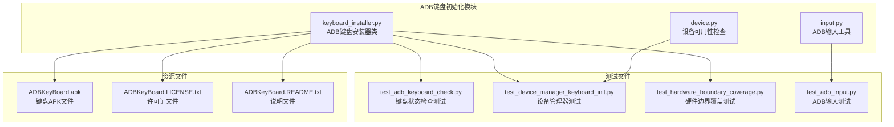
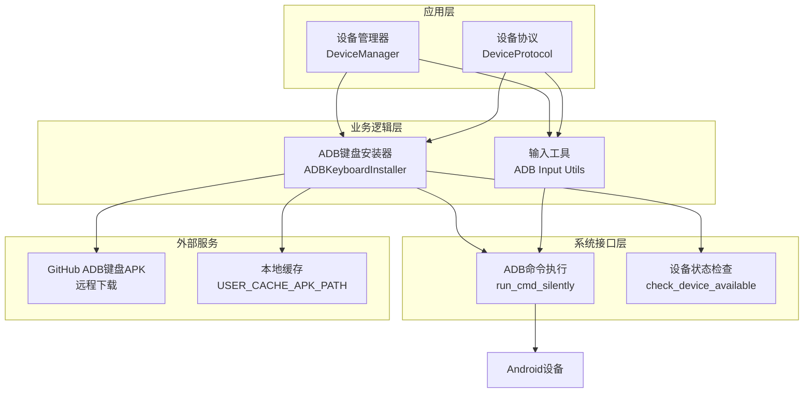
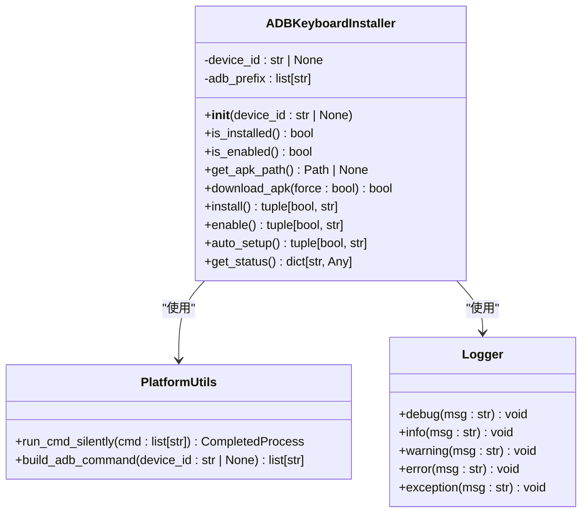
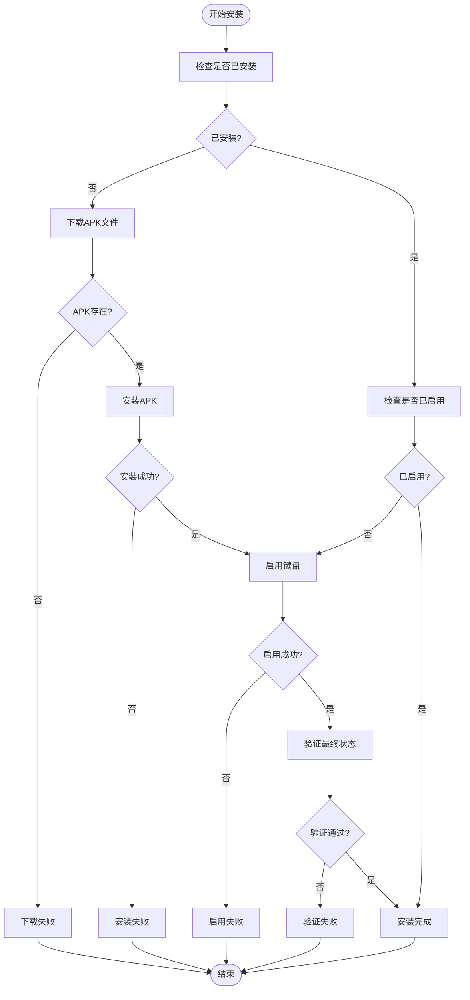
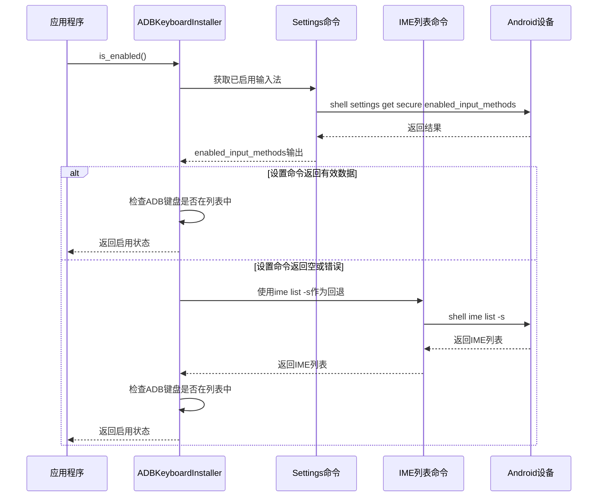
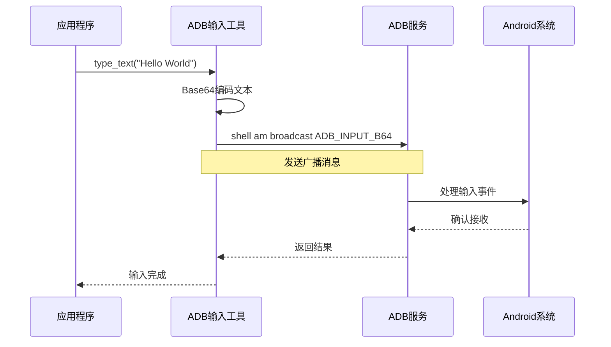
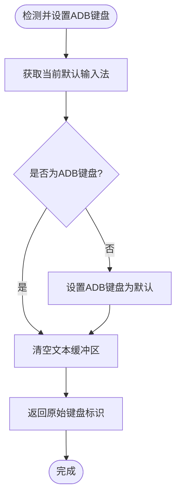
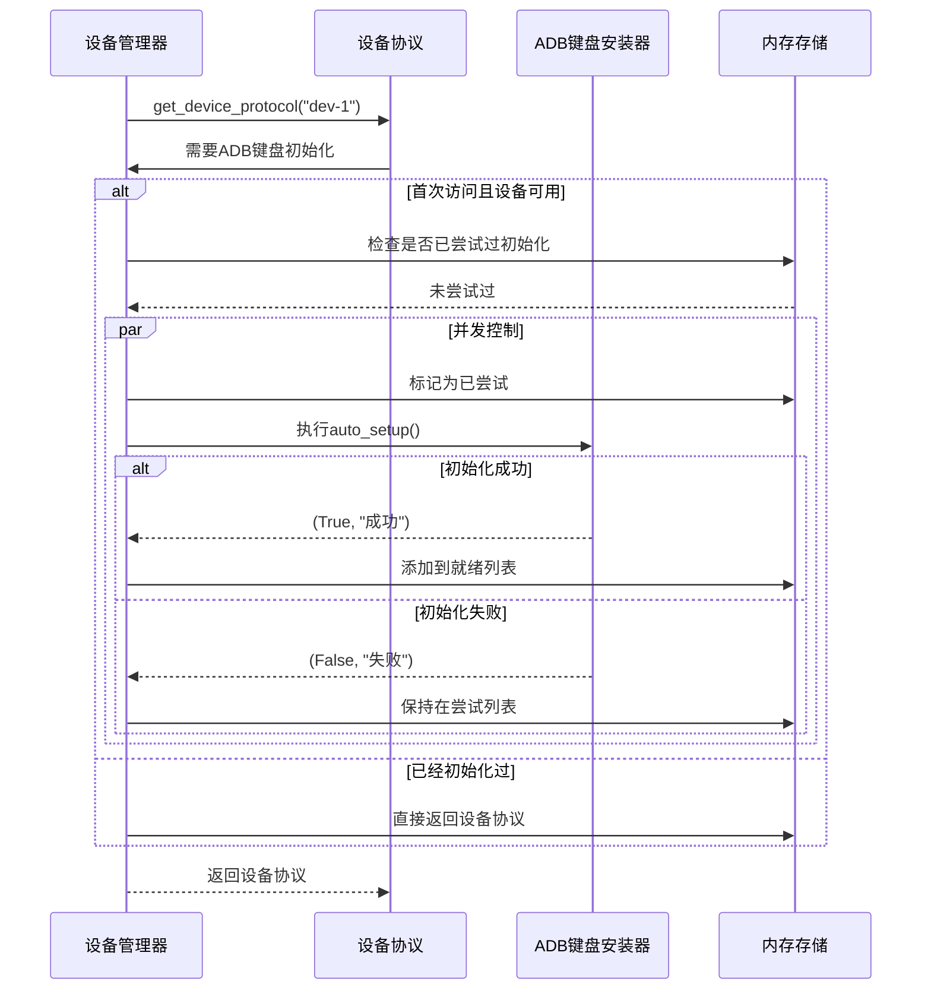
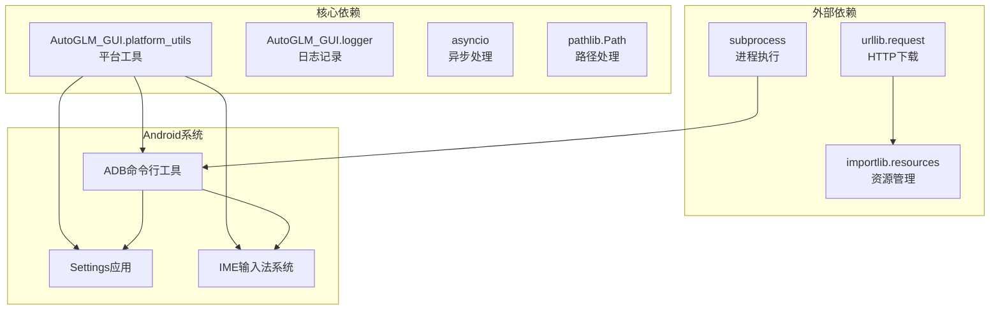

# ADB键盘初始化

<cite>
**本文档引用的文件**
- [keyboard_installer.py](file://AutoGLM_GUI/adb_plus/keyboard_installer.py)
- [input.py](file://AutoGLM_GUI/adb/input.py)
- [device.py](file://AutoGLM_GUI/adb_plus/device.py)
- [test_adb_keyboard_check.py](file://tests/test_adb_keyboard_check.py)
- [test_device_manager_keyboard_init.py](file://tests/test_device_manager_keyboard_init.py)
- [test_hardware_boundary_coverage.py](file://tests/test_hardware_boundary_coverage.py)
- [test_adb_input.py](file://tests/test_adb_input.py)
</cite>

## 目录
1. [简介](#简介)
2. [项目结构](#项目结构)
3. [核心组件](#核心组件)
4. [架构概览](#架构概览)
5. [详细组件分析](#详细组件分析)
6. [依赖关系分析](#依赖关系分析)
7. [性能考虑](#性能考虑)
8. [故障排除指南](#故障排除指南)
9. [结论](#结论)

## 简介

ADB键盘初始化是AutoGLM-GUI中一个关键的功能模块，负责自动安装和配置ADB键盘输入法，为Android设备提供可靠的文本输入支持。该功能通过智能检测设备状态、自动下载APK包、安装和启用ADB键盘，以及管理键盘状态来确保用户能够顺畅地进行文本输入操作。

本功能特别针对不同Android设备的兼容性问题进行了优化，包括处理OEM厂商的安全限制、设备权限管理、以及在各种网络环境下的APK下载策略。该模块的设计充分考虑了错误处理、重试机制和并发控制，为用户提供稳定可靠的服务。

## 项目结构

ADB键盘初始化功能主要分布在以下文件中：



**图表来源**
- [keyboard_installer.py:1-411](file://AutoGLM_GUI/adb_plus/keyboard_installer.py#L1-L411)
- [input.py:1-97](file://AutoGLM_GUI/adb/input.py#L1-L97)
- [device.py:1-51](file://AutoGLM_GUI/adb_plus/device.py#L1-L51)

**章节来源**
- [keyboard_installer.py:1-411](file://AutoGLM_GUI/adb_plus/keyboard_installer.py#L1-L411)
- [input.py:1-97](file://AutoGLM_GUI/adb/input.py#L1-L97)
- [device.py:1-51](file://AutoGLM_GUI/adb_plus/device.py#L1-L51)

## 核心组件

ADB键盘初始化功能由以下几个核心组件构成：

### ADBKeyboardInstaller类
这是整个功能的核心类，提供了完整的ADB键盘生命周期管理：
- **安装检测**：检查ADB键盘是否已安装
- **状态验证**：验证ADB键盘是否已启用
- **自动安装**：下载、安装和启用ADB键盘
- **状态查询**：获取详细的安装状态信息

### 输入工具模块
提供直接的ADB输入功能：
- **文本输入**：通过广播方式发送文本
- **键盘检测**：检测并设置ADB键盘
- **键盘恢复**：恢复原始键盘设置

### 设备管理器集成
与设备管理系统无缝集成：
- **首次访问触发**：在设备首次被访问时自动初始化
- **并发控制**：防止重复初始化和竞态条件
- **错误隔离**：即使初始化失败也不影响主流程

**章节来源**
- [keyboard_installer.py:26-345](file://AutoGLM_GUI/adb_plus/keyboard_installer.py#L26-L345)
- [input.py:10-97](file://AutoGLM_GUI/adb/input.py#L10-L97)
- [test_device_manager_keyboard_init.py:18-37](file://tests/test_device_manager_keyboard_init.py#L18-L37)

## 架构概览

ADB键盘初始化采用分层架构设计，确保功能的模块化和可维护性：



**图表来源**
- [keyboard_installer.py:29-43](file://AutoGLM_GUI/adb_plus/keyboard_installer.py#L29-L43)
- [input.py:15-16](file://AutoGLM_GUI/adb/input.py#L15-L16)
- [device.py:10-50](file://AutoGLM_GUI/adb_plus/device.py#L10-L50)

该架构实现了以下关键特性：
- **解耦设计**：各层职责明确，便于独立测试和维护
- **错误隔离**：底层异常不会影响上层功能
- **可扩展性**：新增功能不影响现有代码结构
- **并发安全**：通过状态管理和锁机制避免竞态条件

## 详细组件分析

### ADBKeyboardInstaller类详解

#### 类结构和方法



**图表来源**
- [keyboard_installer.py:26-445](file://AutoGLM_GUI/adb_plus/keyboard_installer.py#L26-L445)

#### 安装流程分析

ADB键盘的安装流程是一个复杂的多步骤过程，具有完善的错误处理和状态管理：



**图表来源**
- [keyboard_installer.py:279-345](file://AutoGLM_GUI/adb_plus/keyboard_installer.py#L279-L345)

#### 状态检测机制

ADB键盘的状态检测采用了双重验证机制，确保在不同设备上的可靠性：



**图表来源**
- [keyboard_installer.py:67-118](file://AutoGLM_GUI/adb_plus/keyboard_installer.py#L67-L118)

#### 并发控制和重试机制

为了确保在高并发场景下的稳定性，ADB键盘初始化实现了多重保护机制：

| 保护机制 | 实现方式 | 作用 |
|---------|---------|------|
| 设备状态检查 | `check_device_available()` | 防止对不可用设备的操作 |
| 并发访问控制 | 设备序列化访问 | 避免多个线程同时操作同一设备 |
| 异常隔离 | 详细的try-catch块 | 防止单点故障影响整体功能 |
| 资源清理 | 自动清理下载的APK文件 | 防止磁盘空间浪费 |

**章节来源**
- [keyboard_installer.py:45-118](file://AutoGLM_GUI/adb_plus/keyboard_installer.py#L45-L118)
- [keyboard_installer.py:207-277](file://AutoGLM_GUI/adb_plus/keyboard_installer.py#L207-L277)
- [keyboard_installer.py:279-345](file://AutoGLM_GUI/adb_plus/keyboard_installer.py#L279-L345)

### 输入工具模块分析

#### 文本输入流程

ADB输入工具提供了高效的文本输入功能，通过广播机制直接向Android系统发送文本：



**图表来源**
- [input.py:10-38](file://AutoGLM_GUI/adb/input.py#L10-L38)

#### 键盘切换机制

输入工具还提供了智能的键盘切换功能，确保在需要时使用ADB键盘：



**图表来源**
- [input.py:52-81](file://AutoGLM_GUI/adb/input.py#L52-L81)

**章节来源**
- [input.py:10-97](file://AutoGLM_GUI/adb/input.py#L10-L97)

### 设备管理器集成

#### 初始化触发机制

设备管理器实现了智能的初始化触发机制，确保只在必要时进行ADB键盘初始化：



**图表来源**
- [test_device_manager_keyboard_init.py:88-101](file://tests/test_device_manager_keyboard_init.py#L88-L101)

#### 并发控制策略

设备管理器通过内存中的集合来实现并发控制：

| 内存集合 | 用途 | 数据类型 |
|---------|------|---------|
| `_adb_keyboard_attempted_serials` | 记录已尝试初始化的设备序列号 | `set[str]` |
| `_adb_keyboard_ready_serials` | 记录初始化成功的设备序列号 | `set[str]` |
| `_device_id_to_serial` | 设备ID到序列号的映射 | `dict[str, str]` |

这种设计确保了：
- **去重效果**：同一设备不会被重复初始化
- **幂等性**：多次调用不会产生副作用
- **内存效率**：使用集合实现O(1)查找时间

**章节来源**
- [test_device_manager_keyboard_init.py:13-16](file://tests/test_device_manager_keyboard_init.py#L13-L16)
- [test_device_manager_keyboard_init.py:88-151](file://tests/test_device_manager_keyboard_init.py#L88-L151)

## 依赖关系分析

ADB键盘初始化功能的依赖关系相对简单但层次清晰：



**图表来源**
- [keyboard_installer.py:7-13](file://AutoGLM_GUI/adb_plus/keyboard_installer.py#L7-L13)
- [input.py:3-6](file://AutoGLM_GUI/adb/input.py#L3-L6)

### 关键依赖说明

#### 平台工具依赖
- `run_cmd_silently()`: 提供统一的命令执行接口
- `build_adb_command()`: 构建带设备ID的ADB命令

#### 资源管理依赖
- `importlib.resources.files()`: 在Python 3.9+中使用
- `importlib.resources.as_file()`: 获取临时文件路径
- 旧版本兼容性处理：支持较老的importlib.resources实现

#### 系统集成依赖
- ADB命令行工具：所有Android设备操作的基础
- Settings应用：用于检查和修改输入法设置
- IME系统：Android的输入法框架

**章节来源**
- [keyboard_installer.py:130-164](file://AutoGLM_GUI/adb_plus/keyboard_installer.py#L130-L164)
- [input.py:6,15](file://AutoGLM_GUI/adb/input.py#L6,L15)

## 性能考虑

ADB键盘初始化功能在设计时充分考虑了性能优化：

### 异步处理优化
- **异步命令执行**：使用`asyncio.run()`执行阻塞的ADB命令
- **超时控制**：设备可用性检查设置了5秒超时
- **并发限制**：通过内存状态控制避免重复初始化

### 缓存策略
- **APK缓存**：下载的APK保存在用户缓存目录
- **状态缓存**：设备初始化状态在内存中缓存
- **资源缓存**：打包的APK资源优先使用

### 网络优化
- **断点续传**：APK下载支持断点续传
- **重试机制**：网络错误时自动重试
- **超时设置**：合理的网络请求超时时间

## 故障排除指南

### 常见问题及解决方案

#### 安装失败
**问题描述**：ADB键盘安装过程中出现错误

**可能原因**：
- APK文件损坏或下载失败
- 设备存储空间不足
- 权限不足无法写入APK文件

**解决方案**：
1. 检查APK文件完整性
2. 清理设备存储空间
3. 重新授权ADB权限
4. 手动删除缓存的APK文件

#### 权限不足
**问题描述**：某些设备报告权限不足错误

**可能原因**：
- 设备启用了严格的安全策略
- 用户没有授予必要的系统权限
- OEM厂商限制了某些系统操作

**解决方案**：
1. 在设备设置中启用开发者选项
2. 授予ADB调试权限
3. 尝试不同的ADB连接方式
4. 检查设备的系统版本兼容性

#### 状态不一致
**问题描述**：设备显示状态与实际状态不符

**可能原因**：
- 缓存的状态信息过期
- 并发操作导致的状态竞争
- 设备重启后状态丢失

**解决方案**：
1. 清除设备的状态缓存
2. 重新启动ADB服务
3. 手动验证设备状态
4. 检查是否有其他应用修改了输入法设置

#### 网络下载失败
**问题描述**：无法从GitHub下载ADB键盘APK

**可能原因**：
- 网络连接不稳定
- GitHub服务器访问受限
- 防火墙阻止了下载

**解决方案**：
1. 检查网络连接状态
2. 尝试手动下载APK文件
3. 配置代理服务器
4. 使用本地缓存的APK文件

### 调试和诊断

#### 日志分析
ADB键盘初始化功能提供了详细的日志记录，可以通过以下方式查看：

1. **安装状态日志**：检查APK文件是否存在和可访问
2. **命令执行日志**：查看每个ADB命令的执行结果
3. **错误日志**：分析具体的错误信息和堆栈跟踪

#### 状态检查
可以使用以下方法检查ADB键盘的当前状态：

```python
installer = ADBKeyboardInstaller("device_id")
status = installer.get_status()
print(f"安装状态: {status['installed']}")
print(f"启用状态: {status['enabled']}")
print(f"APK路径: {status['apk_path']}")
```

#### 性能监控
通过监控以下指标来评估ADB键盘初始化的性能：

- **初始化时间**：从开始到完成的总时间
- **重试次数**：网络或命令执行失败的重试次数
- **成功率**：成功完成初始化的比例

**章节来源**
- [keyboard_installer.py:63-65](file://AutoGLM_GUI/adb_plus/keyboard_installer.py#L63-L65)
- [keyboard_installer.py:116-118](file://AutoGLM_GUI/adb_plus/keyboard_installer.py#L116-L118)
- [keyboard_installer.py:235-238](file://AutoGLM_GUI/adb_plus/keyboard_installer.py#L235-L238)

## 结论

ADB键盘初始化功能通过精心设计的架构和完善的错误处理机制，为AutoGLM-GUI提供了稳定可靠的Android设备文本输入支持。该功能的主要优势包括：

### 技术优势
- **高兼容性**：针对不同Android版本和OEM设备进行了专门优化
- **强健性**：完善的错误处理和重试机制确保功能的可靠性
- **易用性**：自动化的安装和配置减少了用户的操作复杂度
- **可维护性**：模块化的代码结构便于后续维护和扩展

### 架构特点
- **分层设计**：清晰的层次结构确保了功能的模块化
- **并发安全**：通过多种机制防止竞态条件和状态不一致
- **资源管理**：有效的缓存和清理策略优化了资源使用
- **错误隔离**：各层之间的错误隔离提高了系统的稳定性

### 应用价值
ADB键盘初始化功能不仅提升了用户体验，还为AutoGLM-GUI的自动化测试和设备管理提供了重要的基础设施支持。通过这个功能，用户可以更加专注于核心业务逻辑，而不必担心底层的设备配置问题。

未来的发展方向包括进一步优化性能、增强对新设备的支持、以及提供更多的自定义配置选项。随着Android生态系统的不断发展，ADB键盘初始化功能也将持续演进以适应新的挑战和需求。