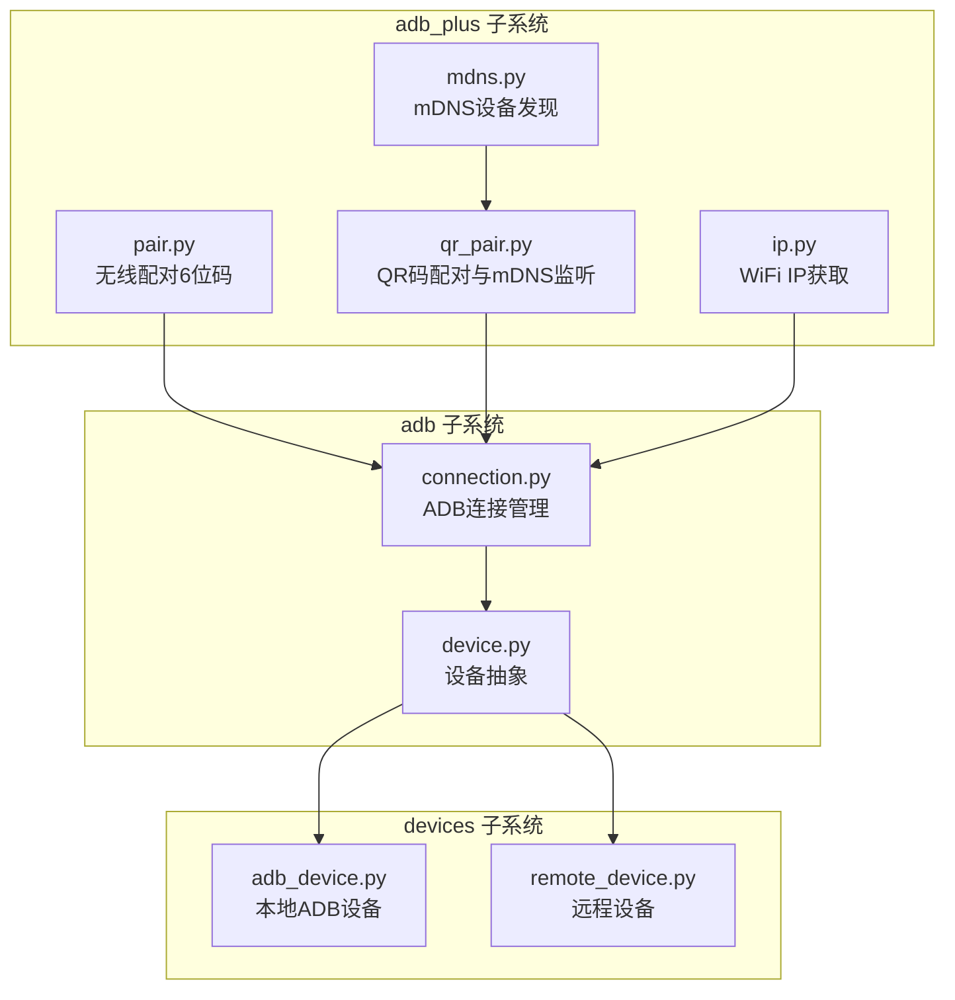
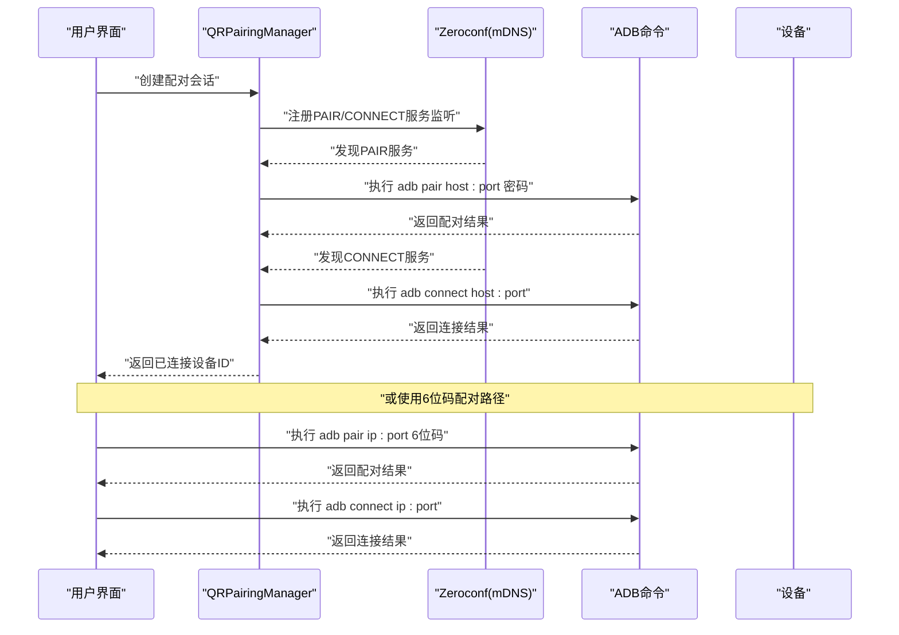
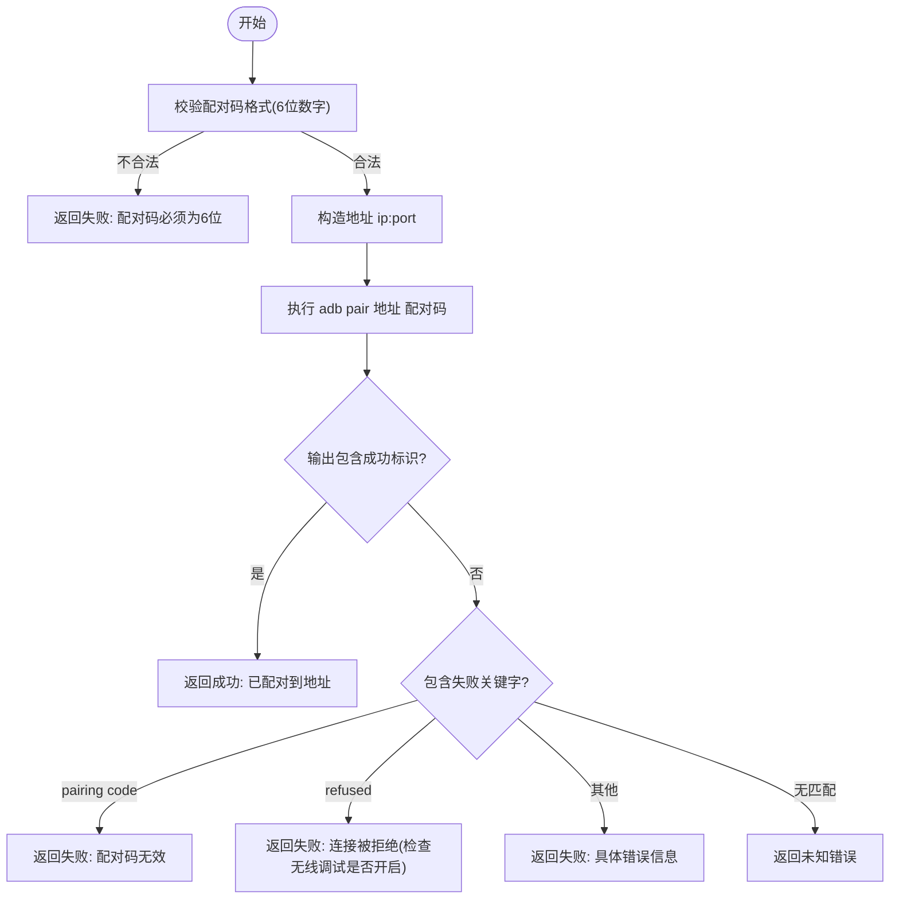
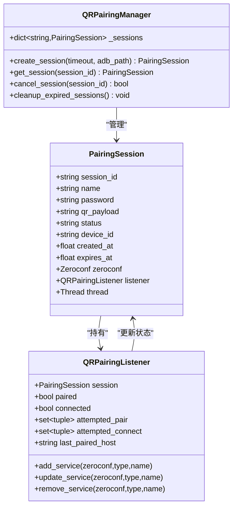
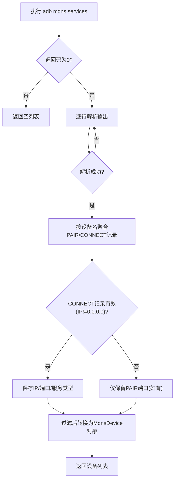
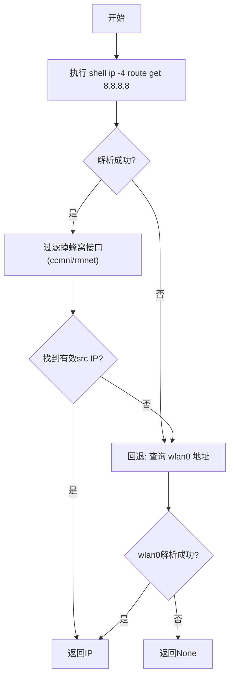
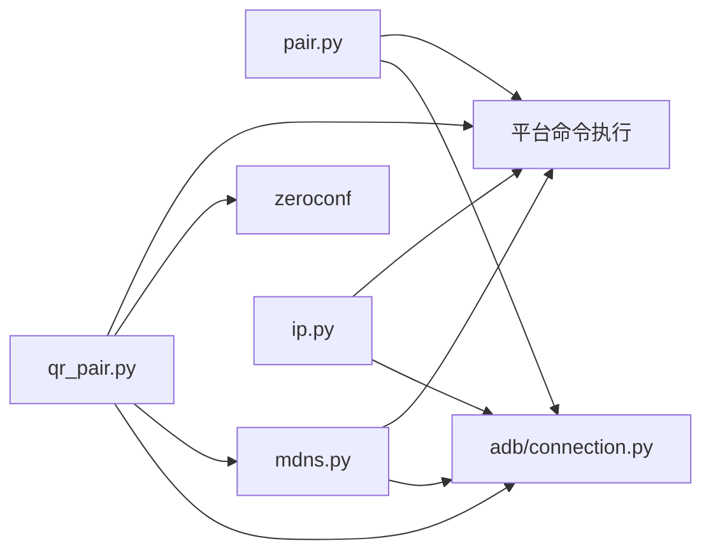

# WiFi配对与连接

<cite>
**本文引用的文件**
- [pair.py](file://AutoGLM_GUI/adb_plus/pair.py)
- [qr_pair.py](file://AutoGLM_GUI/adb_plus/qr_pair.py)
- [mdns.py](file://AutoGLM_GUI/adb_plus/mdns.py)
- [ip.py](file://AutoGLM_GUI/adb_plus/ip.py)
- [connection.py](file://AutoGLM_GUI/adb/connection.py)
- [device.py](file://AutoGLM_GUI/adb/device.py)
- [adb_device.py](file://AutoGLM_GUI/devices/adb_device.py)
- [remote_device.py](file://AutoGLM_GUI/devices/remote_device.py)
- [test_qr_pairing.py](file://tests/test_qr_pairing.py)
- [test_adb_pair_helpers.py](file://tests/test_adb_pair_helpers.py)
</cite>

## 目录
1. [简介](#简介)
2. [项目结构](#项目结构)
3. [核心组件](#核心组件)
4. [架构总览](#架构总览)
5. [详细组件分析](#详细组件分析)
6. [依赖关系分析](#依赖关系分析)
7. [性能考量](#性能考量)
8. [故障排查指南](#故障排查指南)
9. [结论](#结论)
10. [附录](#附录)

## 简介
本文件面向AutoGLM-GUI的WiFi配对与连接功能，系统性阐述以下能力：
- 基于Android 11+无线调试的配对机制（6位配对码）
- 基于QR码的自动化配对与连接（含mDNS服务发现）
- 设备IP地址获取策略（优先WiFi，规避蜂窝接口）
- 与ADB命令链路的集成方式与错误处理
- 常见问题定位与解决建议

目标是帮助初学者快速上手，同时为开发者提供足够的技术深度与可追溯的源码路径。

## 项目结构
与WiFi配对和连接相关的核心模块位于AutoGLM_GUI/adb_plus目录下，围绕“配对”“QR配对”“mDNS发现”“IP获取”四个子系统协同工作；设备侧通过adb子系统进行连接管理。

图表来源
- [pair.py:1-96](file://AutoGLM_GUI/adb_plus/pair.py#L1-L96)
- [qr_pair.py:1-374](file://AutoGLM_GUI/adb_plus/qr_pair.py#L1-L374)
- [mdns.py:1-195](file://AutoGLM_GUI/adb_plus/mdns.py#L1-L195)
- [ip.py:1-138](file://AutoGLM_GUI/adb_plus/ip.py#L1-L138)
- [connection.py](file://AutoGLM_GUI/adb/connection.py)
- [device.py](file://AutoGLM_GUI/adb/device.py)
- [adb_device.py](file://AutoGLM_GUI/devices/adb_device.py)
- [remote_device.py](file://AutoGLM_GUI/devices/remote_device.py)

章节来源
- [pair.py:1-96](file://AutoGLM_GUI/adb_plus/pair.py#L1-L96)
- [qr_pair.py:1-374](file://AutoGLM_GUI/adb_plus/qr_pair.py#L1-L374)
- [mdns.py:1-195](file://AutoGLM_GUI/adb_plus/mdns.py#L1-L195)
- [ip.py:1-138](file://AutoGLM_GUI/adb_plus/ip.py#L1-L138)

## 核心组件
- 无线配对（6位码）：提供同步与异步两种配对入口，校验配对码格式，执行adb pair并解析输出，返回布尔结果与消息。
- QR码配对：生成会话凭据，启动mDNS监听器，自动发现配对/连接服务，完成adb pair与adb connect，维护会话状态机。
- mDNS发现：解析adb mdns services输出，合并同一设备名的不同服务记录，提取有效IP:端口与配对端口。
- IP获取：优先通过路由表选择非蜂窝接口的WiFi源地址，回退到wlan0地址解析，避免0.0.0.0与无效接口。

章节来源
- [pair.py:6-96](file://AutoGLM_GUI/adb_plus/pair.py#L6-L96)
- [qr_pair.py:199-374](file://AutoGLM_GUI/adb_plus/qr_pair.py#L199-L374)
- [mdns.py:96-195](file://AutoGLM_GUI/adb_plus/mdns.py#L96-L195)
- [ip.py:45-138](file://AutoGLM_GUI/adb_plus/ip.py#L45-L138)

## 架构总览
下图展示从用户触发到设备连接的端到端流程，包括QR码配对与传统6位码配对两条路径。

图表来源
- [qr_pair.py:199-374](file://AutoGLM_GUI/adb_plus/qr_pair.py#L199-L374)
- [pair.py:6-96](file://AutoGLM_GUI/adb_plus/pair.py#L6-L96)

## 详细组件分析

### 组件A：基于6位码的无线配对（pair_device）
- 功能要点
  - 输入参数：设备IP、配对端口（与连接端口不同）、6位数字配对码、ADB路径
  - 行为：校验配对码格式，执行adb pair，解析成功/失败分支，返回布尔结果与消息
  - 异常处理：捕获异常并返回错误信息
- 调用关系
  - 依赖平台工具执行外部命令
  - 返回值用于上层逻辑决定是否继续adb connect
- 使用模式
  - 适用于已知IP与配对端口的场景
  - 需确保设备已启用无线调试且显示配对端口

图表来源
- [pair.py:6-96](file://AutoGLM_GUI/adb_plus/pair.py#L6-L96)

章节来源
- [pair.py:6-96](file://AutoGLM_GUI/adb_plus/pair.py#L6-L96)

### 组件B：QR码配对与mDNS监听（QRPairingManager）
- 功能要点
  - 会话管理：生成随机名称与密码，构造QR载荷，维护会话状态（监听/配对/已配对/连接中/已连接/超时/错误）
  - mDNS监听：监听PAIR/CONNECT两类服务，自动选择IPv4地址，去重尝试，按序执行adb pair与adb connect
  - 生命周期：支持取消、过期清理、守护线程
- 关键类与职责
  - PairingSession：承载会话数据与状态
  - QRPairingListener：服务发现回调，负责触发adb命令
  - QRPairingManager：全局单例，管理会话与后台清理任务

图表来源
- [qr_pair.py:34-374](file://AutoGLM_GUI/adb_plus/qr_pair.py#L34-L374)

章节来源
- [qr_pair.py:199-374](file://AutoGLM_GUI/adb_plus/qr_pair.py#L199-L374)

### 组件C：mDNS设备发现（discover_mdns_devices）
- 功能要点
  - 执行adb mdns services，解析输出为设备列表
  - 合并同一设备名下的PAIR/CONNECT服务，提取有效IP与端口
  - 特别处理PAIR服务中的配对端口（即使IP为0.0.0.0）
- 输出模型
  - MdnsDevice：包含设备名、IP、连接端口、是否具备PAIR服务、PAIR端口等字段

图表来源
- [mdns.py:96-195](file://AutoGLM_GUI/adb_plus/mdns.py#L96-L195)

章节来源
- [mdns.py:96-195](file://AutoGLM_GUI/adb_plus/mdns.py#L96-L195)

### 组件D：WiFi IP获取（get_wifi_ip）
- 功能要点
  - 优先策略：通过路由表查询到8.8.8.8的出站接口，排除蜂窝接口（ccmni/rmnet），提取src IP
  - 回退策略：查询wlan0接口地址，正则提取IPv4
  - 返回None表示未找到合适IP或发生异常
- 异步版本：提供非阻塞实现，便于在请求流中使用

图表来源
- [ip.py:45-138](file://AutoGLM_GUI/adb_plus/ip.py#L45-L138)

章节来源
- [ip.py:45-138](file://AutoGLM_GUI/adb_plus/ip.py#L45-L138)

### 组件E：设备连接管理（adb子系统）
- 连接管理：封装ADB连接生命周期，与设备抽象配合，支持本地与远程设备
- 设备抽象：统一设备接口，区分本地ADB设备与远程设备

章节来源
- [connection.py](file://AutoGLM_GUI/adb/connection.py)
- [device.py](file://AutoGLM_GUI/adb/device.py)
- [adb_device.py](file://AutoGLM_GUI/devices/adb_device.py)
- [remote_device.py](file://AutoGLM_GUI/devices/remote_device.py)

## 依赖关系分析
- 模块内聚与耦合
  - pair.py与qr_pair.py均依赖平台工具执行外部命令，但qr_pair.py进一步依赖zeroconf进行mDNS监听
  - mdns.py与qr_pair.py共享mDNS服务类型常量，形成弱耦合
  - ip.py与qr_pair.py、pair.py在设备IP可用性方面存在间接协作
- 外部依赖
  - ADB命令行工具（adb pair/connect/mdns/services）
  - zeroconf（mDNS服务发现）
  - 平台命令执行工具（run_cmd_silently/_sync）

图表来源
- [pair.py:3-4](file://AutoGLM_GUI/adb_plus/pair.py#L3-L4)
- [qr_pair.py:17-20](file://AutoGLM_GUI/adb_plus/qr_pair.py#L17-L20)
- [mdns.py:9-10](file://AutoGLM_GUI/adb_plus/mdns.py#L9-L10)
- [ip.py:8-9](file://AutoGLM_GUI/adb_plus/ip.py#L8-L9)

## 性能考量
- mDNS监听
  - 使用守护线程与定期清理任务，避免资源泄漏
  - 监听循环以小周期轮询，平衡响应速度与CPU占用
- 命令执行
  - 设置合理超时（配对约25s，连接约20s，mdns约5s），防止阻塞
  - 异步变体适合高并发请求场景
- IP获取
  - 优先路由查询减少正则扫描次数，回退到wlan0作为最终手段

## 故障排查指南
- 配对失败（6位码）
  - 配对码无效：确认设备端显示的6位码，注意大小写与输入法差异
  - 连接被拒绝：检查设备是否已启用无线调试，确保配对端口正确
  - 未知错误：查看返回消息中的具体ADB输出，结合日志定位
- QR配对失败
  - 未发现PAIR服务：确认设备无线调试已开启，网络环境允许mDNS广播
  - 未发现CONNECT服务：等待设备完成配对后广播CONNECT服务
  - 超时：适当延长会话超时时间，检查防火墙与网络策略
- IP获取错误
  - 返回None：可能为设备尚未分配有效WiFi地址或接口被过滤，检查路由表与wlan0状态
- 端口冲突
  - 配对端口与连接端口不同，若手动指定错误端口会导致失败
  - 使用mDNS发现获取准确端口，避免手工猜测

章节来源
- [pair.py:28-60](file://AutoGLM_GUI/adb_plus/pair.py#L28-L60)
- [qr_pair.py:147-197](file://AutoGLM_GUI/adb_plus/qr_pair.py#L147-L197)
- [mdns.py:136-194](file://AutoGLM_GUI/adb_plus/mdns.py#L136-L194)
- [ip.py:53-89](file://AutoGLM_GUI/adb_plus/ip.py#L53-L89)

## 结论
AutoGLM-GUI的WiFi配对与连接方案提供了两条稳健路径：传统6位码配对与QR码自动化配对。前者适合已知设备信息的场景，后者通过mDNS自动发现与会话状态机实现“即扫即连”。配合IP获取与设备抽象，整体方案在易用性与可靠性之间取得良好平衡。建议在生产环境中结合日志与超时策略，针对不同网络环境进行适配与测试。

## 附录
- 测试参考
  - QR配对测试：覆盖会话创建、mDNS监听、配对/连接流程与超时清理
  - 配对辅助测试：覆盖6位码格式校验、错误分支与异常处理

章节来源
- [test_qr_pairing.py](file://tests/test_qr_pairing.py)
- [test_adb_pair_helpers.py](file://tests/test_adb_pair_helpers.py)