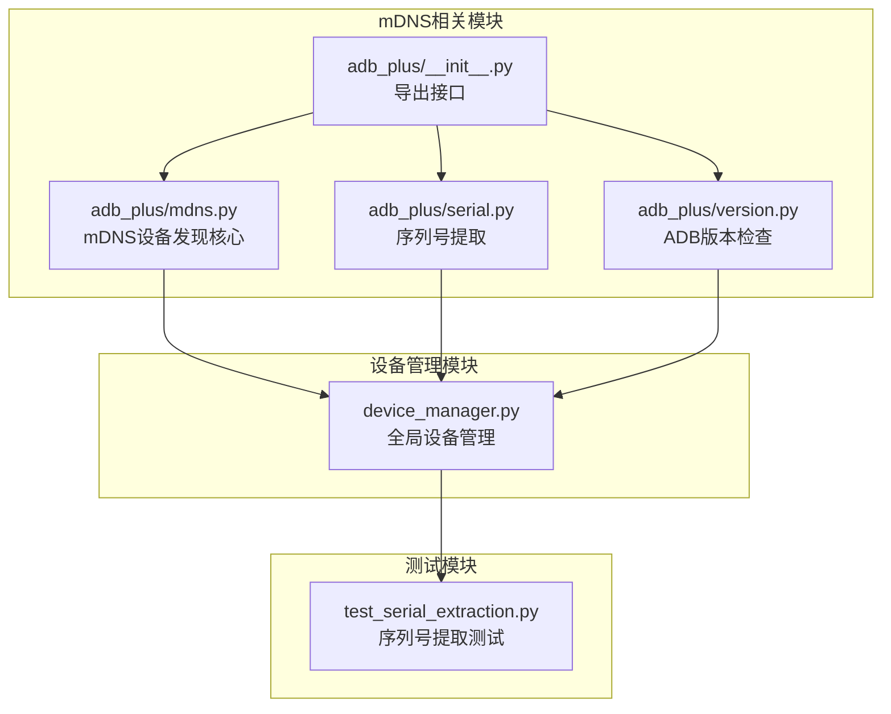
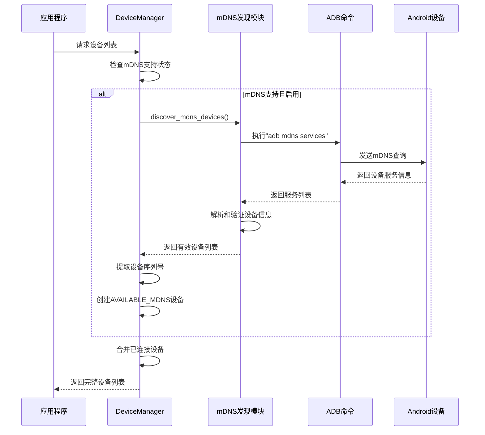
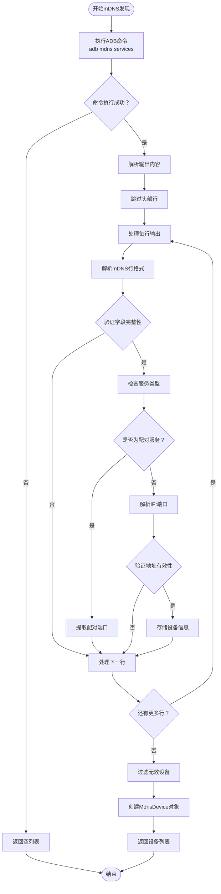
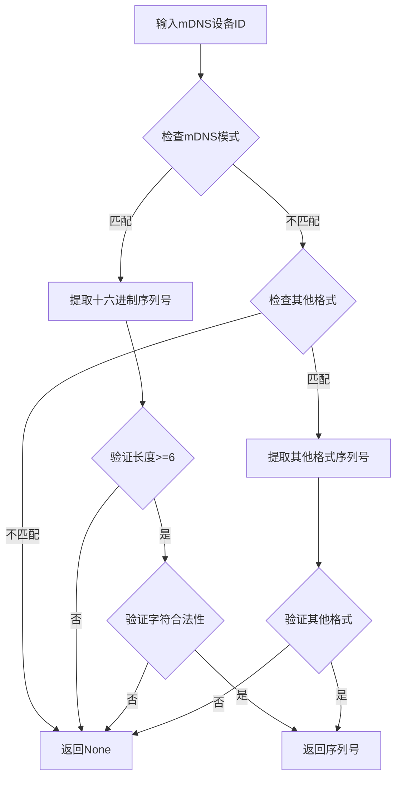
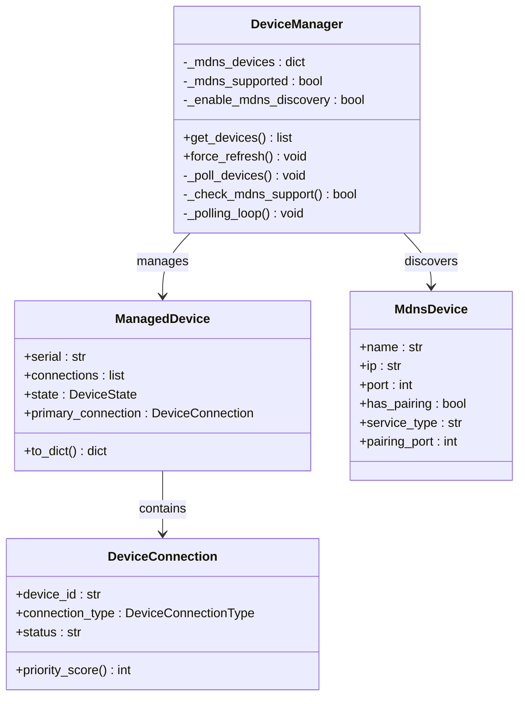
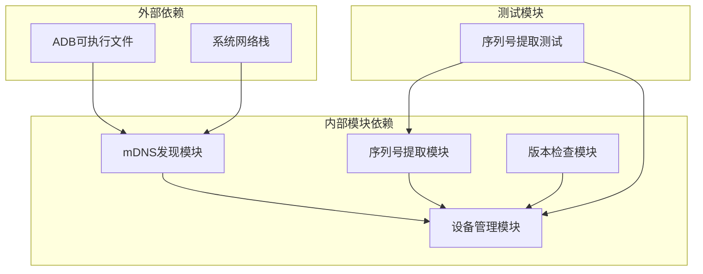

# mDNS网络发现

<cite>
**本文档引用的文件**
- [mdns.py](file://AutoGLM_GUI/adb_plus/mdns.py)
- [device_manager.py](file://AutoGLM_GUI/device_manager.py)
- [serial.py](file://AutoGLM_GUI/adb_plus/serial.py)
- [version.py](file://AutoGLM_GUI/adb_plus/version.py)
- [__init__.py](file://AutoGLM_GUI/adb_plus/__init__.py)
- [test_serial_extraction.py](file://tests/test_serial_extraction.py)
</cite>

## 目录
1. [简介](#简介)
2. [项目结构](#项目结构)
3. [核心组件](#核心组件)
4. [架构概览](#架构概览)
5. [详细组件分析](#详细组件分析)
6. [依赖关系分析](#依赖关系分析)
7. [性能考虑](#性能考虑)
8. [故障排除指南](#故障排除指南)
9. [结论](#结论)

## 简介

AutoGLM-GUI的mDNS网络发现功能是一个基于多播DNS协议的无线ADB设备自动发现系统。该功能允许应用程序在本地网络中自动检测支持无线调试的Android设备，无需物理连接即可发现和管理设备。

mDNS（Multicast DNS）是一种基于DNS查询的本地网络发现协议，它允许设备在没有传统DNS服务器的情况下通过UDP多播方式发现彼此。在Android无线调试场景中，当设备启用无线调试时，会通过mDNS广播其ADB服务，其他设备或计算机可以监听这些广播来发现可用的ADB连接点。

## 项目结构

mDNS功能主要分布在以下模块中：

**图表来源**
- [mdns.py:1-195](file://AutoGLM_GUI/adb_plus/mdns.py#L1-L195)
- [device_manager.py:1-800](file://AutoGLM_GUI/device_manager.py#L1-L800)

**章节来源**
- [mdns.py:1-195](file://AutoGLM_GUI/adb_plus/mdns.py#L1-L195)
- [device_manager.py:1-800](file://AutoGLM_GUI/device_manager.py#L1-L800)

## 核心组件

### MdnsDevice数据类

MdnsDevice是mDNS发现的核心数据结构，用于表示通过mDNS发现的ADB设备：

| 属性名 | 类型 | 描述 | 示例值 |
|--------|------|------|--------|
| name | str | 设备的mDNS服务名称 | "adb-243a09b7-cbCO6P" |
| ip | str | 设备IP地址 | "192.168.130.187" |
| port | int | ADB连接端口 | 34553 |
| has_pairing | bool | 是否支持配对服务 | True |
| service_type | str | 服务类型标识 | "_adb-tls-connect._tcp" |
| pairing_port | int | 配对端口号（可选） | None |

### discover_mdns_devices函数

这是mDNS发现的主要入口函数，负责执行以下操作：

1. **命令执行**：调用`adb mdns services`命令获取设备列表
2. **输出解析**：解析mDNS服务输出格式
3. **设备合并**：按设备名称合并多个服务记录
4. **地址验证**：验证IP地址和端口的有效性
5. **结果过滤**：过滤掉无效或不完整的设备记录

**章节来源**
- [mdns.py:15-25](file://AutoGLM_GUI/adb_plus/mdns.py#L15-L25)
- [mdns.py:96-194](file://AutoGLM_GUI/adb_plus/mdns.py#L96-L194)

## 架构概览

mDNS网络发现的整体架构采用分层设计，从底层的mDNS服务发现到上层的设备管理：

**图表来源**
- [device_manager.py:416-433](file://AutoGLM_GUI/device_manager.py#L416-L433)
- [device_manager.py:601-669](file://AutoGLM_GUI/device_manager.py#L601-L669)
- [mdns.py:96-194](file://AutoGLM_GUI/adb_plus/mdns.py#L96-L194)

## 详细组件分析

### mDNS服务发现流程

mDNS发现过程包含多个处理阶段，每个阶段都有特定的验证和过滤逻辑：

**图表来源**
- [mdns.py:126-189](file://AutoGLM_GUI/adb_plus/mdns.py#L126-L189)

### 设备序列号提取机制

Android设备的序列号提取是mDNS功能的关键部分，支持多种序列号格式：

**图表来源**
- [serial.py:7-127](file://AutoGLM_GUI/adb_plus/serial.py#L7-L127)

### 设备管理集成

DeviceManager将mDNS发现的设备整合到全局设备管理系统中：

**图表来源**
- [device_manager.py:249-300](file://AutoGLM_GUI/device_manager.py#L249-L300)
- [device_manager.py:122-196](file://AutoGLM_GUI/device_manager.py#L122-L196)
- [mdns.py:15-25](file://AutoGLM_GUI/adb_plus/mdns.py#L15-L25)

**章节来源**
- [device_manager.py:416-433](file://AutoGLM_GUI/device_manager.py#L416-L433)
- [device_manager.py:601-669](file://AutoGLM_GUI/device_manager.py#L601-L669)

## 依赖关系分析

mDNS功能的依赖关系相对简单但层次清晰：

**图表来源**
- [mdns.py:9-12](file://AutoGLM_GUI/adb_plus/mdns.py#L9-L12)
- [device_manager.py:423-426](file://AutoGLM_GUI/device_manager.py#L423-L426)

### 关键依赖项

1. **ADB命令依赖**：需要系统中安装有效的ADB工具
2. **网络栈依赖**：需要支持UDP多播的网络环境
3. **Python标准库**：正则表达式、数据类、类型注解等

**章节来源**
- [mdns.py:3-12](file://AutoGLM_GUI/adb_plus/mdns.py#L3-L12)
- [device_manager.py:423-426](file://AutoGLM_GUI/device_manager.py#L423-L426)

## 性能考虑

### 轮询策略

DeviceManager采用指数退避策略来优化mDNS发现的性能：

- **基础轮询间隔**：10秒
- **最大轮询间隔**：60秒  
- **退避倍数**：2.0
- **连续失败次数**：影响当前轮询间隔

### 内存管理

- **设备缓存**：mDNS设备在60秒内无更新会被清理
- **线程安全**：使用重入锁保护设备状态
- **并发处理**：设备序列号提取使用线程池并行处理

### 网络效率

- **单次命令调用**：每次轮询只执行一次`adb mdns services`命令
- **输出解析优化**：使用字典进行设备去重和合并
- **错误容错**：任何异常都会优雅降级返回空列表

## 故障排除指南

### 常见问题及解决方案

#### mDNS不支持问题

**症状**：mDNS设备无法被发现，日志显示"ADB mDNS discovery not available"

**原因**：
- ADB版本低于30.0.0
- 系统缺少mDNS支持
- 网络环境不支持UDP多播

**解决方案**：
1. 升级ADB到30.0.0或更高版本
2. 检查系统网络设置
3. 确认防火墙允许UDP多播通信

#### 网络连接异常

**症状**：设备列表为空，但ADB命令可以正常执行

**原因**：
- 设备未启用无线调试
- 设备与主机不在同一网络
- 网络设备阻止了mDNS流量

**解决方案**：
1. 在设备上启用"无线调试"
2. 确保设备和主机在同一WiFi网络
3. 检查路由器设置，允许mDNS流量

#### 设备解析失败

**症状**：mDNS服务被发现但序列号提取失败

**原因**：
- 设备ID格式不符合预期
- 序列号格式不合法
- 正则表达式匹配失败

**解决方案**：
1. 检查设备ID格式
2. 验证序列号长度（至少6个字符）
3. 确认序列号只包含十六进制字符

### 调试技巧

1. **启用详细日志**：查看`logger.debug`输出了解详细处理过程
2. **手动测试ADB命令**：直接运行`adb mdns services`验证环境
3. **检查网络连通性**：使用`ping`和`netstat`验证网络状态
4. **验证设备状态**：确认设备无线调试已正确启用

**章节来源**
- [mdns.py:191-194](file://AutoGLM_GUI/adb_plus/mdns.py#L191-L194)
- [device_manager.py:667-669](file://AutoGLM_GUI/device_manager.py#L667-L669)

## 结论

AutoGLM-GUI的mDNS网络发现功能提供了一个健壮、高效的无线ADB设备发现解决方案。通过合理的架构设计和错误处理机制，该功能能够在各种网络环境中稳定工作。

### 主要优势

1. **零配置发现**：自动检测网络中的无线ADB设备
2. **快速响应**：轮询间隔可配置，支持快速设备发现
3. **错误容错**：优雅处理各种异常情况
4. **性能优化**：指数退避策略减少资源消耗

### 技术特点

- 支持Android 11+的无线调试功能
- 兼容不同格式的设备ID
- 提供详细的日志和调试信息
- 与现有设备管理系统无缝集成

该功能为用户提供了便捷的无线设备管理体验，特别适用于多设备管理和自动化场景。通过持续的优化和改进，mDNS发现功能将继续提升用户体验和系统可靠性。