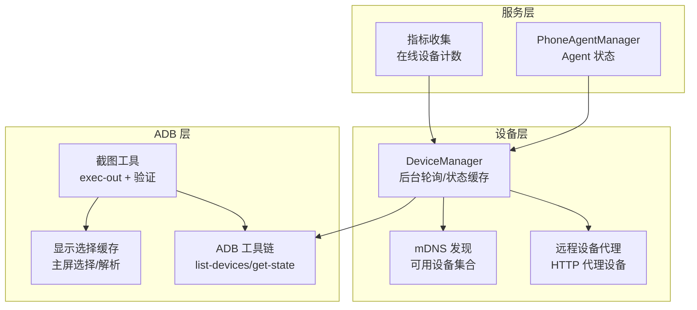
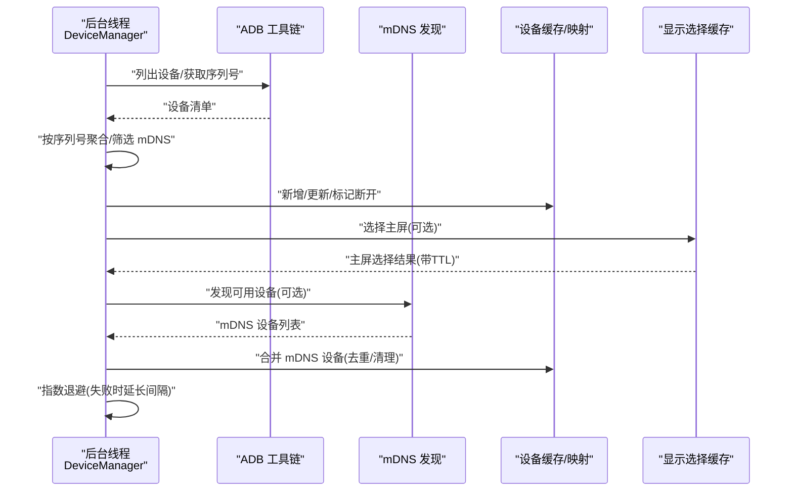
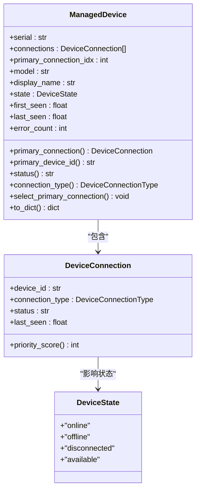
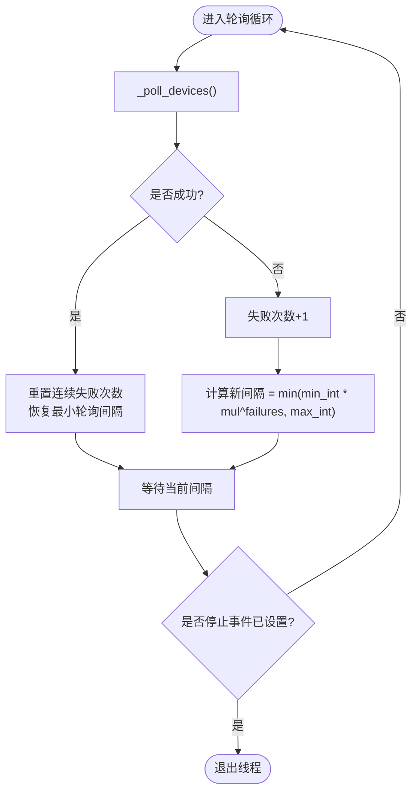
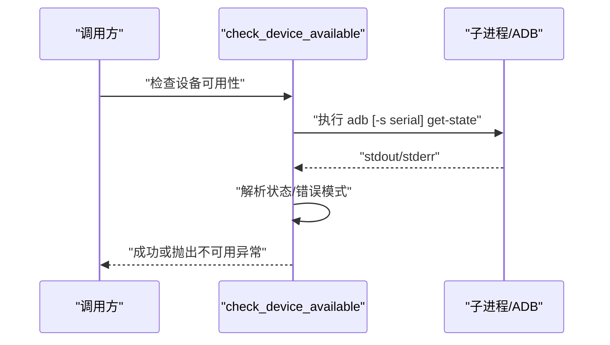
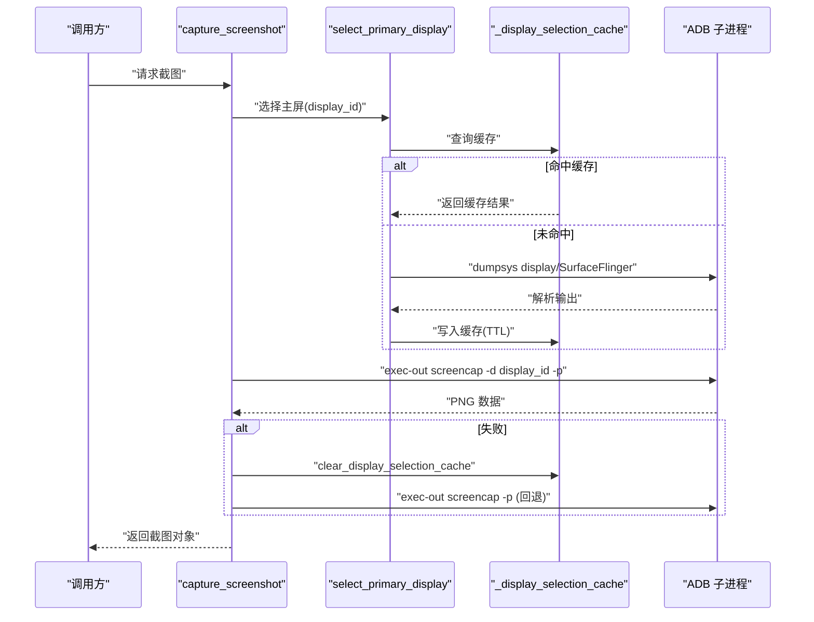
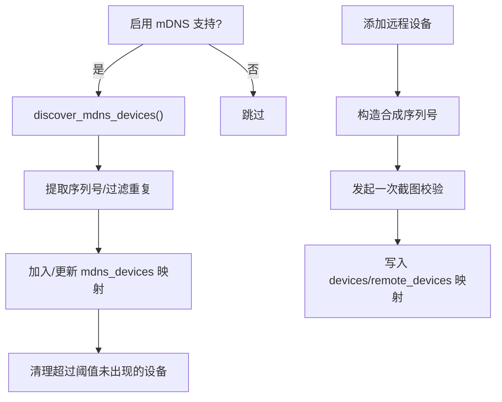
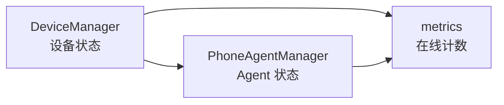
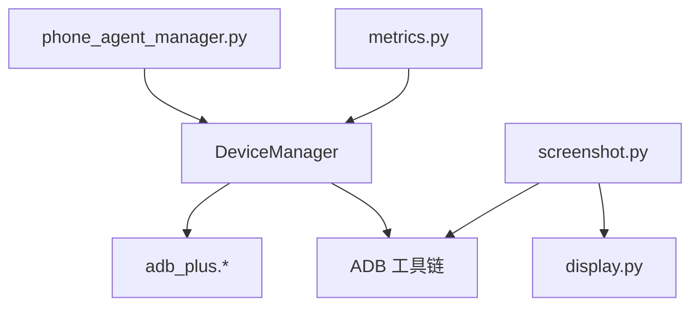

# 状态监控与缓存

<cite>
**本文引用的文件**
- [device_manager.py](file://AutoGLM_GUI/device_manager.py)
- [display.py](file://AutoGLM_GUI/adb_plus/display.py)
- [device.py](file://AutoGLM_GUI/adb_plus/device.py)
- [screenshot.py](file://AutoGLM_GUI/adb_plus/screenshot.py)
- [metrics.py](file://AutoGLM_GUI/metrics.py)
- [phone_agent_manager.py](file://AutoGLM_GUI/phone_agent_manager.py)
- [adb_plus/__init__.py](file://AutoGLM_GUI/adb_plus/__init__.py)
- [adb_plus/pair.py](file://AutoGLM_GUI/adb_plus/pair.py)
- [adb_plus/ip.py](file://AutoGLM_GUI/adb_plus/ip.py)
- [adb_plus/serial.py](file://AutoGLM_GUI/adb_plus/serial.py)
- [adb_plus/touch.py](file://AutoGLM_GUI/adb_plus/touch.py)
- [adb_plus/version.py](file://AutoGLM_GUI/adb_plus/version.py)
- [adb_plus/screenshot.py](file://AutoGLM_GUI/adb_plus/screenshot.py)
- [adb_plus/display.py](file://AutoGLM_GUI/adb_plus/display.py)
- [adb_plus/device.py](file://AutoGLM_GUI/adb_plus/device.py)
- [adb_plus/mdns.py](file://AutoGLM_GUI/adb_plus/mdns.py)
- [adb_plus/keyboard_installer.py](file://AutoGLM_GUI/adb_plus/keyboard_installer.py)
- [adb_plus/qr_pair.py](file://AutoGLM_GUI/adb_plus/qr_pair.py)
- [adb_plus/serial.py](file://AutoGLM_GUI/adb_plus/serial.py)
- [adb_plus/timing.py](file://AutoGLM_GUI/adb_plus/timing.py)
- [adb_plus/version.py](file://AutoGLM_GUI/adb_plus/version.py)
- [adb_plus/display.py](file://AutoGLM_GUI/adb_plus/display.py)
- [adb_plus/device.py](file://AutoGLM_GUI/adb_plus/device.py)
- [adb_plus/screenshot.py](file://AutoGLM_GUI/adb_plus/screenshot.py)
- [adb_plus/pair.py](file://AutoGLM_GUI/adb_plus/pair.py)
- [adb_plus/ip.py](file://AutoGLM_GUI/adb_plus/ip.py)
- [adb_plus/serial.py](file://AutoGLM_GUI/adb_plus/serial.py)
- [adb_plus/touch.py](file://AutoGLM_GUI/adb_plus/touch.py)
- [adb_plus/version.py](file://AutoGLM_GUI/adb_plus/version.py)
- [adb_plus/mdns.py](file://AutoGLM_GUI/adb_plus/mdns.py)
- [adb_plus/keyboard_installer.py](file://AutoGLM_GUI/adb_plus/keyboard_installer.py)
- [adb_plus/qr_pair.py](file://AutoGLM_GUI/adb_plus/qr_pair.py)
- [adb_plus/serial.py](file://AutoGLM_GUI/adb_plus/serial.py)
- [adb_plus/timing.py](file://AutoGLM_GUI/adb_plus/timing.py)
- [adb_plus/version.py](file://AutoGLM_GUI/adb_plus/version.py)
</cite>

## 目录
1. [简介](#简介)
2. [项目结构](#项目结构)
3. [核心组件](#核心组件)
4. [架构总览](#架构总览)
5. [详细组件分析](#详细组件分析)
6. [依赖分析](#依赖分析)
7. [性能考虑](#性能考虑)
8. [故障排查指南](#故障排查指南)
9. [结论](#结论)
10. [附录](#附录)

## 简介
本文件聚焦于 AutoGLM-GUI 的“状态监控与缓存”能力，系统性阐述以下主题：
- 设备状态枚举与含义
- 在线/离线检测机制与错误计数
- 指数退避的轮询策略与后台线程工作原理
- 缓存策略（显示选择缓存、设备列表缓存、mDNS 发现缓存）
- 状态同步与多来源合并（本地 ADB + mDNS + 远程代理）
- 常见问题与解决方案（轮询失败、缓存不一致、状态延迟）

目标是让初学者快速上手，同时为有经验的开发者提供足够的技术深度与可操作的参考路径。

## 项目结构
围绕状态监控与缓存的关键模块如下：
- 设备管理与轮询：DeviceManager（单例、后台线程、指数退避、设备聚合）
- 显示选择缓存：adb_plus.display（主屏选择、缓存 TTL、解析逻辑）
- 设备可用性检查：adb_plus.device（get-state 快速探测）
- 截图与缓存联动：adb_plus.screenshot（截图前选择主屏、失败回退、缓存失效）
- 指标与可观测性：metrics（设备在线状态指标）
- 代理设备与远程发现：adb_plus.mdns、adb_plus/pair、adb_plus/ip、adb_plus/serial 等

**图表来源**
- [device_manager.py:249-345](file://AutoGLM_GUI/device_manager.py#L249-L345)
- [display.py:75-102](file://AutoGLM_GUI/adb_plus/display.py#L75-L102)
- [screenshot.py:42-117](file://AutoGLM_GUI/adb_plus/screenshot.py#L42-L117)
- [metrics.py:360-370](file://AutoGLM_GUI/metrics.py#L360-L370)
- [phone_agent_manager.py:200-210](file://AutoGLM_GUI/phone_agent_manager.py#L200-L210)

**章节来源**
- [device_manager.py:249-345](file://AutoGLM_GUI/device_manager.py#L249-L345)
- [display.py:75-102](file://AutoGLM_GUI/adb_plus/display.py#L75-L102)
- [screenshot.py:42-117](file://AutoGLM_GUI/adb_plus/screenshot.py#L42-L117)
- [metrics.py:360-370](file://AutoGLM_GUI/metrics.py#L360-L370)
- [phone_agent_manager.py:200-210](file://AutoGLM_GUI/phone_agent_manager.py#L200-L210)

## 核心组件
- 设备状态枚举 DeviceState：online（在线）、offline（离线）、disconnected（断开）、available（仅通过 mDNS 可见）
- 轮询与缓存：DeviceManager 后台线程每固定间隔拉取设备列表，聚合同一序列号的多个连接端点，维护主连接优先级与状态
- 指数退避：连续失败时动态延长轮询间隔，成功后重置
- 显示选择缓存：主屏选择结果按 (adb_path, device_id) 缓存，带 TTL，避免频繁 dumpsys
- 设备可用性检查：快速执行 get-state，超时/异常即判定不可用
- 指标输出：根据 DeviceState 统计在线设备数量

**章节来源**
- [device_manager.py:79-86](file://AutoGLM_GUI/device_manager.py#L79-L86)
- [device_manager.py:275-282](file://AutoGLM_GUI/device_manager.py#L275-L282)
- [device_manager.py:435-454](file://AutoGLM_GUI/device_manager.py#L435-L454)
- [display.py:17-48](file://AutoGLM_GUI/adb_plus/display.py#L17-L48)
- [device.py:10-51](file://AutoGLM_GUI/adb_plus/device.py#L10-L51)
- [metrics.py:360-370](file://AutoGLM_GUI/metrics.py#L360-L370)

## 架构总览
下图展示从轮询到状态同步、再到缓存与指标的整体流程。

**图表来源**
- [device_manager.py:435-669](file://AutoGLM_GUI/device_manager.py#L435-L669)
- [display.py:75-102](file://AutoGLM_GUI/adb_plus/display.py#L75-L102)

**章节来源**
- [device_manager.py:435-669](file://AutoGLM_GUI/device_manager.py#L435-L669)
- [display.py:75-102](file://AutoGLM_GUI/adb_plus/display.py#L75-L102)

## 详细组件分析

### 设备状态与枚举
- DeviceState：online/offline/disconnected/available
- ManagedDevice：聚合同一序列号的多个连接端点，维护主连接、模型、显示名、状态、时间戳与错误计数
- DeviceConnection：连接端点（USB/WiFi/远程），含优先级评分（类型优先级 + 状态优先级）

**图表来源**
- [device_manager.py:79-196](file://AutoGLM_GUI/device_manager.py#L79-L196)

**章节来源**
- [device_manager.py:79-196](file://AutoGLM_GUI/device_manager.py#L79-L196)

### 后台轮询线程与指数退避
- 启动/停止：start_polling()/stop_polling()，守护线程，可优雅退出
- 轮询循环：_polling_loop()，周期性调用 _poll_devices()，成功则重置退避，失败则递增退避倍数
- 退避参数：最小/最大间隔、倍数、连续失败次数
- 设备更新：按序列号聚合，区分新增/更新/移除；mDNS 设备单独维护并定期清理

**图表来源**
- [device_manager.py:435-454](file://AutoGLM_GUI/device_manager.py#L435-L454)
- [device_manager.py:670-683](file://AutoGLM_GUI/device_manager.py#L670-L683)

**章节来源**
- [device_manager.py:315-345](file://AutoGLM_GUI/device_manager.py#L315-L345)
- [device_manager.py:435-454](file://AutoGLM_GUI/device_manager.py#L435-L454)
- [device_manager.py:670-683](file://AutoGLM_GUI/device_manager.py#L670-L683)

### 设备可用性检查与错误计数
- 快速检查：adb get-state，超时/非 device 即视为不可用
- 错误计数：ManagedDevice.error_count 记录连续轮询失败次数，成功后清零
- 状态映射：当主连接 status 为 "device" 时为 online，否则 offline

**图表来源**
- [device.py:10-51](file://AutoGLM_GUI/adb_plus/device.py#L10-L51)

**章节来源**
- [device.py:10-51](file://AutoGLM_GUI/adb_plus/device.py#L10-L51)
- [device_manager.py:142-143](file://AutoGLM_GUI/device_manager.py#L142-L143)
- [device_manager.py:571-575](file://AutoGLM_GUI/device_manager.py#L571-L575)

### 显示选择缓存与截图联动
- 缓存键：(adb_path, device_id)，TTL 默认约 60 秒
- 选择逻辑：解析 dumpsys display 与 SurfaceFlinger 输出，优先选择“开启且分辨率最高”的显示器
- 截图流程：先尝试带 display_id 的 screencap，失败则清除缓存并回退到无 display_id 再试
- 异步版本：select_primary_display_async/_select_primary_display_uncached_async 支持异步路径

**图表来源**
- [screenshot.py:42-117](file://AutoGLM_GUI/adb_plus/screenshot.py#L42-L117)
- [display.py:75-102](file://AutoGLM_GUI/adb_plus/display.py#L75-L102)
- [display.py:308-332](file://AutoGLM_GUI/adb_plus/display.py#L308-L332)

**章节来源**
- [display.py:17-48](file://AutoGLM_GUI/adb_plus/display.py#L17-L48)
- [display.py:75-102](file://AutoGLM_GUI/adb_plus/display.py#L75-L102)
- [display.py:308-332](file://AutoGLM_GUI/adb_plus/display.py#L308-L332)
- [screenshot.py:42-117](file://AutoGLM_GUI/adb_plus/screenshot.py#L42-L117)

### mDNS 发现与远程设备集成
- mDNS 发现：支持时从 ADB 查询，提取序列号，若与已连接设备冲突则过滤 mDNS 连接
- 可用设备集合：独立维护，超过一定时间未出现则清理
- 远程设备：通过 HTTP 代理访问，添加/删除时建立映射并进行一次连通性校验

**图表来源**
- [device_manager.py:601-669](file://AutoGLM_GUI/device_manager.py#L601-L669)
- [device_manager.py:866-902](file://AutoGLM_GUI/device_manager.py#L866-L902)
- [device_manager.py:903-991](file://AutoGLM_GUI/device_manager.py#L903-L991)

**章节来源**
- [device_manager.py:601-669](file://AutoGLM_GUI/device_manager.py#L601-L669)
- [device_manager.py:866-902](file://AutoGLM_GUI/device_manager.py#L866-L902)
- [device_manager.py:903-991](file://AutoGLM_GUI/device_manager.py#L903-L991)

### 指标与状态同步
- 指标：统计 DeviceState.ONLINE 的设备数量，便于健康检查与运维观测
- Agent 状态：PhoneAgentManager 维护 Agent 的 IDLE/BUSY/ERROR/INITIALIZING 等状态，与设备状态协同

**图表来源**
- [metrics.py:360-370](file://AutoGLM_GUI/metrics.py#L360-L370)
- [phone_agent_manager.py:200-210](file://AutoGLM_GUI/phone_agent_manager.py#L200-L210)

**章节来源**
- [metrics.py:360-370](file://AutoGLM_GUI/metrics.py#L360-L370)
- [phone_agent_manager.py:200-210](file://AutoGLM_GUI/phone_agent_manager.py#L200-L210)

## 依赖分析
- DeviceManager 依赖 ADB 工具链与 adb_plus 工具（序列号提取、mDNS、WiFi 连接、配对等）
- 显示选择缓存与截图强耦合，截图失败会触发缓存失效与回退
- 指标模块依赖 DeviceState 进行统计

**图表来源**
- [device_manager.py:15-21](file://AutoGLM_GUI/device_manager.py#L15-L21)
- [screenshot.py:17-27](file://AutoGLM_GUI/adb_plus/screenshot.py#L17-L27)
- [display.py:9-14](file://AutoGLM_GUI/adb_plus/display.py#L9-L14)
- [metrics.py:360-370](file://AutoGLM_GUI/metrics.py#L360-L370)
- [phone_agent_manager.py:200-210](file://AutoGLM_GUI/phone_agent_manager.py#L200-L210)

**章节来源**
- [device_manager.py:15-21](file://AutoGLM_GUI/device_manager.py#L15-L21)
- [screenshot.py:17-27](file://AutoGLM_GUI/adb_plus/screenshot.py#L17-L27)
- [display.py:9-14](file://AutoGLM_GUI/adb_plus/display.py#L9-L14)
- [metrics.py:360-370](file://AutoGLM_GUI/metrics.py#L360-L370)
- [phone_agent_manager.py:200-210](file://AutoGLM_GUI/phone_agent_manager.py#L200-L210)

## 性能考虑
- 轮询频率与退避：默认 10s 起步，最大 60s，避免在 ADB 不可用时过度轮询
- 并发优化：设备序列号提取使用线程池，限制最大并发以平衡吞吐与资源
- 缓存命中：显示选择缓存减少 dumpsys 调用频次，提高截图与流媒体稳定性
- 回退策略：截图失败自动清除缓存并回退，降低失败传播

[本节为通用建议，无需特定文件引用]

## 故障排查指南
- 轮询失败
  - 现象：日志提示轮询失败并延长间隔
  - 排查：确认 ADB 是否可用、网络连通性、权限
  - 参考路径：[device_manager.py:670-683](file://AutoGLM_GUI/device_manager.py#L670-L683)
- 缓存不一致
  - 现象：主屏选择错误或分辨率异常
  - 排查：调用 clear_display_selection_cache 清理缓存，或缩短 TTL
  - 参考路径：[display.py:63-73](file://AutoGLM_GUI/adb_plus/display.py#L63-L73)
- 状态延迟
  - 现象：设备断开后仍显示 online
  - 排查：等待轮询周期或调用 force_refresh() 触发即时刷新
  - 参考路径：[device_manager.py:399-413](file://AutoGLM_GUI/device_manager.py#L399-L413)
- 设备不可用
  - 现象：get-state 非 device 或超时
  - 排查：检查设备授权、USB/WiFi 连接、ADB 版本
  - 参考路径：[device.py:10-51](file://AutoGLM_GUI/adb_plus/device.py#L10-L51)
- 远程设备连接失败
  - 现象：添加/连接远程设备报错
  - 排查：确认 base_url、设备 ID、网络可达性
  - 参考路径：[device_manager.py:866-902](file://AutoGLM_GUI/device_manager.py#L866-L902), [device_manager.py:903-991](file://AutoGLM_GUI/device_manager.py#L903-L991)

**章节来源**
- [device_manager.py:399-413](file://AutoGLM_GUI/device_manager.py#L399-L413)
- [device_manager.py:670-683](file://AutoGLM_GUI/device_manager.py#L670-L683)
- [display.py:63-73](file://AutoGLM_GUI/adb_plus/display.py#L63-L73)
- [device.py:10-51](file://AutoGLM_GUI/adb_plus/device.py#L10-L51)
- [device_manager.py:866-902](file://AutoGLM_GUI/device_manager.py#L866-L902)
- [device_manager.py:903-991](file://AutoGLM_GUI/device_manager.py#L903-L991)

## 结论
AutoGLM-GUI 的状态监控与缓存体系以 DeviceManager 为核心，结合指数退避、显示选择缓存与 mDNS/远程设备集成，实现了稳定高效的设备状态感知与可视化。通过合理的轮询策略与缓存机制，系统在复杂网络环境下仍能保持较低的资源占用与较高的可用性。建议在生产环境中合理配置轮询间隔与 TTL，并配合指标监控与告警，确保状态一致性与用户体验。

[本节为总结，无需特定文件引用]

## 附录
- 关键配置项（示例）
  - 轮询间隔：最小/最大间隔、退避倍数、连续失败次数
  - 显示选择缓存：TTL（秒）
  - mDNS 设备清理：超过阈值未出现则清理
- 常用接口参考路径
  - 启停轮询：[device_manager.py:315-345](file://AutoGLM_GUI/device_manager.py#L315-L345)
  - 强制刷新：[device_manager.py:399-413](file://AutoGLM_GUI/device_manager.py#L399-L413)
  - 清理显示缓存：[display.py:63-73](file://AutoGLM_GUI/adb_plus/display.py#L63-L73)
  - 设备可用性检查：[device.py:10-51](file://AutoGLM_GUI/adb_plus/device.py#L10-L51)
  - 截图与回退：[screenshot.py:42-117](file://AutoGLM_GUI/adb_plus/screenshot.py#L42-L117)

**章节来源**
- [device_manager.py:275-282](file://AutoGLM_GUI/device_manager.py#L275-L282)
- [display.py:17-48](file://AutoGLM_GUI/adb_plus/display.py#L17-L48)
- [device_manager.py:315-345](file://AutoGLM_GUI/device_manager.py#L315-L345)
- [device_manager.py:399-413](file://AutoGLM_GUI/device_manager.py#L399-L413)
- [display.py:63-73](file://AutoGLM_GUI/adb_plus/display.py#L63-L73)
- [device.py:10-51](file://AutoGLM_GUI/adb_plus/device.py#L10-L51)
- [screenshot.py:42-117](file://AutoGLM_GUI/adb_plus/screenshot.py#L42-L117)