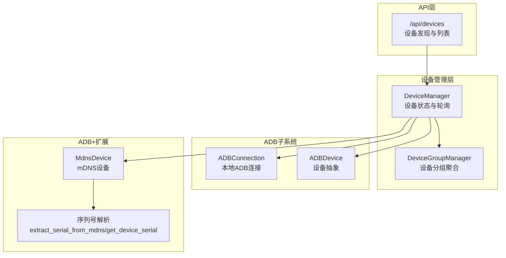
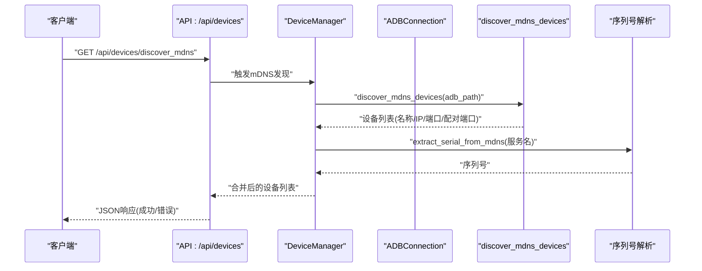
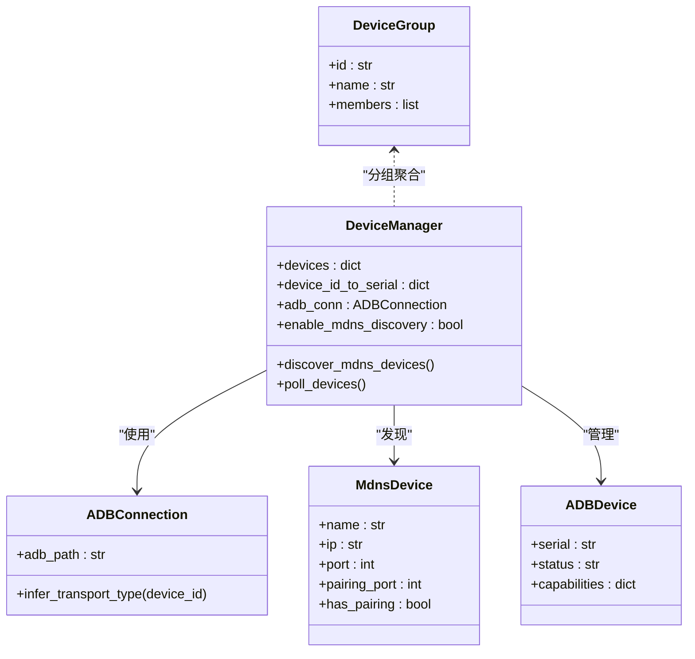
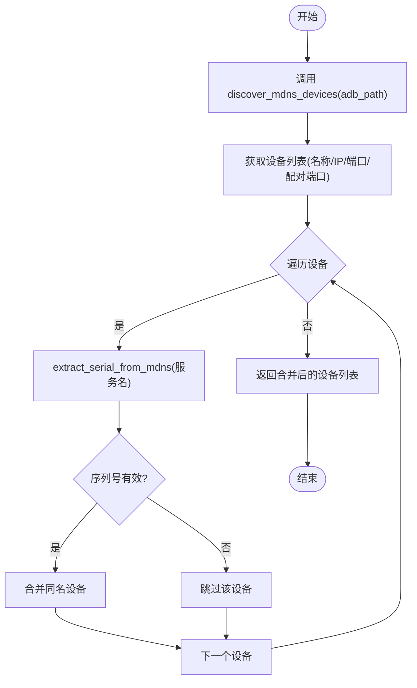
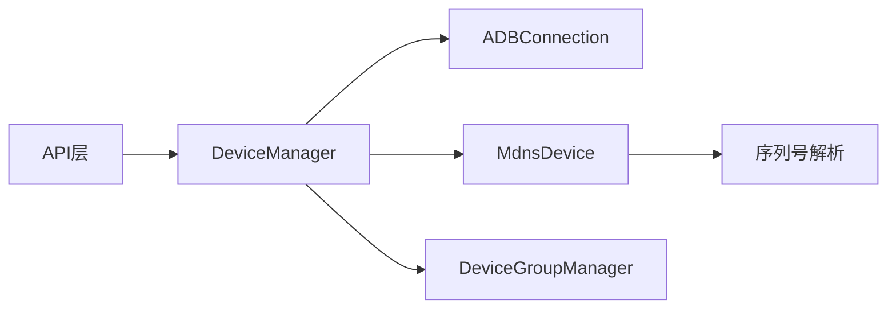

# 设备发现与枚举

<cite>
**本文档引用的文件**
- [device_manager.py](file://AutoGLM_GUI/device_manager.py)
- [device_group_manager.py](file://AutoGLM_GUI/device_group_manager.py)
- [adb_manager.py](file://AutoGLM_GUI/adb_manager.py)
- [adb/connection.py](file://AutoGLM_GUI/adb/connection.py)
- [adb/device.py](file://AutoGLM_GUI/adb/device.py)
- [adb_plus/mdns.py](file://AutoGLM_GUI/adb_plus/mdns.py)
- [adb_plus/serial.py](file://AutoGLM_GUI/adb_plus/serial.py)
- [api/devices.py](file://AutoGLM_GUI/api/devices.py)
- [devices/adb_device.py](file://AutoGLM_GUI/devices/adb_device.py)
- [devices/mock_device.py](file://AutoGLM_GUI/devices/mock_device.py)
- [devices/remote_device.py](file://AutoGLM_GUI/devices/remote_device.py)
- [models/device_group.py](file://AutoGLM_GUI/models/device_group.py)
- [test_devices_api.py](file://tests/test_devices_api.py)
- [test_device_manager_keyboard_init.py](file://tests/test_device_manager_keyboard_init.py)
</cite>

## 目录
1. [简介](#简介)
2. [项目结构](#项目结构)
3. [核心组件](#核心组件)
4. [架构总览](#架构总览)
5. [详细组件分析](#详细组件分析)
6. [依赖关系分析](#依赖关系分析)
7. [性能考虑](#性能考虑)
8. [故障排除指南](#故障排除指南)
9. [结论](#结论)

## 简介
本章节面向AutoGLM-GUI的“设备发现与枚举”能力，系统性阐述其在本地USB直连、无线ADB（mDNS）以及远程设备场景下的发现机制、调用关系、接口与使用模式。文档重点覆盖：
- ADB设备列表获取流程与设备序列号提取
- 设备分组聚合策略与管理器职责
- 与ADB工具链的集成关系：设备状态过滤、连接类型识别
- 常见问题定位与解决方案（设备无法发现、序列号解析失败等）

本节不直接分析具体源码文件，故无“章节来源”。

## 项目结构
围绕设备发现与枚举的关键模块分布如下：
- 设备管理层：负责设备状态维护、轮询、分组与对外暴露
- ADB子系统：封装本地ADB连接、设备抽象与工具链交互
- ADB+扩展：提供mDNS无线设备发现、序列号解析等增强能力
- API层：对外提供设备发现、设备列表、分组管理等REST接口
- 设备模型与协议：统一设备抽象、连接类型与状态定义

图表来源
- [device_manager.py:259-291](file://AutoGLM_GUI/device_manager.py#L259-L291)
- [adb/connection.py:0-50](file://AutoGLM_GUI/adb/connection.py#L0-L50)
- [adb/device.py](file://AutoGLM_GUI/adb/device.py)
- [adb_plus/mdns.py:0-106](file://AutoGLM_GUI/adb_plus/mdns.py#L0-L106)
- [adb_plus/serial.py](file://AutoGLM_GUI/adb_plus/serial.py)
- [api/devices.py:262-262](file://AutoGLM_GUI/api/devices.py#L262-L262)

章节来源
- [device_manager.py:259-291](file://AutoGLM_GUI/device_manager.py#L259-L291)
- [adb/connection.py:0-50](file://AutoGLM_GUI/adb/connection.py#L0-L50)
- [adb_plus/mdns.py:0-106](file://AutoGLM_GUI/adb_plus/mdns.py#L0-L106)
- [api/devices.py:262-262](file://AutoGLM_GUI/api/devices.py#L262-L262)

## 核心组件
- 设备管理器（DeviceManager）
  - 职责：维护设备字典、设备ID到序列号映射、轮询线程与退避策略、ADB连接与mDNS支持开关
  - 关键字段：设备存储、反向映射、轮询控制、ADB路径、ADB连接实例、mDNS支持状态与设备缓存、特性开关
  - 参考路径：[device_manager.py:259-291](file://AutoGLM_GUI/device_manager.py#L259-L291)

- 设备分组管理器（DeviceGroupManager）
  - 职责：按规则对设备进行分组聚合，便于多设备协同与展示
  - 参考路径：[device_group_manager.py](file://AutoGLM_GUI/device_group_manager.py)

- ADB连接管理（ADBConnection）
  - 职责：封装本地USB与ADB TCP/IP连接，推断传输类型
  - 参考路径：[adb/connection.py:0-50](file://AutoGLM_GUI/adb/connection.py#L0-L50)

- ADB设备抽象（ADBDevice）
  - 职责：统一设备操作接口，承载设备状态与能力
  - 参考路径：[devices/adb_device.py](file://AutoGLM_GUI/devices/adb_device.py)

- mDNS设备发现（MdnsDevice + discover_mdns_devices）
  - 职责：通过mDNS扫描无线ADB设备，合并同名设备，返回设备信息
  - 参考路径：[adb_plus/mdns.py:0-106](file://AutoGLM_GUI/adb_plus/mdns.py#L0-L106)

- 序列号解析（extract_serial_from_mdns / get_device_serial）
  - 职责：从mDNS服务名或设备标识中提取设备序列号
  - 参考路径：[adb_plus/serial.py](file://AutoGLM_GUI/adb_plus/serial.py)

- 设备模型（DeviceGroup）
  - 职责：描述设备分组的数据结构
  - 参考路径：[models/device_group.py](file://AutoGLM_GUI/models/device_group.py)

章节来源
- [device_manager.py:259-291](file://AutoGLM_GUI/device_manager.py#L259-L291)
- [device_group_manager.py](file://AutoGLM_GUI/device_group_manager.py)
- [adb/connection.py:0-50](file://AutoGLM_GUI/adb/connection.py#L0-L50)
- [devices/adb_device.py](file://AutoGLM_GUI/devices/adb_device.py)
- [adb_plus/mdns.py:0-106](file://AutoGLM_GUI/adb_plus/mdns.py#L0-L106)
- [adb_plus/serial.py](file://AutoGLM_GUI/adb_plus/serial.py)
- [models/device_group.py](file://AutoGLM_GUI/models/device_group.py)

## 架构总览
设备发现与枚举的整体流程如下：
- 启动时初始化DeviceManager，建立ADB连接与mDNS支持开关
- 定期轮询ADB设备列表，更新设备状态与映射
- 当启用mDNS时，周期性扫描无线ADB设备，解析序列号并合并同名设备
- 对外通过API提供设备发现与列表查询
- 设备分组管理器根据策略对设备进行聚合

图表来源
- [api/devices.py:262-262](file://AutoGLM_GUI/api/devices.py#L262-L262)
- [device_manager.py:259-291](file://AutoGLM_GUI/device_manager.py#L259-L291)
- [adb_plus/mdns.py:95-106](file://AutoGLM_GUI/adb_plus/mdns.py#L95-L106)
- [adb_plus/serial.py](file://AutoGLM_GUI/adb_plus/serial.py)

章节来源
- [api/devices.py:262-262](file://AutoGLM_GUI/api/devices.py#L262-L262)
- [device_manager.py:259-291](file://AutoGLM_GUI/device_manager.py#L259-L291)
- [adb_plus/mdns.py:95-106](file://AutoGLM_GUI/adb_plus/mdns.py#L95-L106)

## 详细组件分析

### 设备发现机制（ADB设备列表与mDNS无线设备）
- ADB设备列表获取
  - DeviceManager通过ADBConnection定期拉取设备列表，维护设备字典与ID到序列号映射
  - 支持指数退避策略以降低频繁失败时的负载
  - 参考路径：[device_manager.py:259-291](file://AutoGLM_GUI/device_manager.py#L259-L291)

- mDNS无线设备发现
  - 使用discover_mdns_devices扫描局域网内无线ADB设备，返回设备名称、IP、端口、配对端口等信息
  - 对同名设备进行合并，避免重复展示
  - 参考路径：[adb_plus/mdns.py:95-106](file://AutoGLM_GUI/adb_plus/mdns.py#L95-L106)

- 序列号提取
  - 通过extract_serial_from_mdns从服务名或设备标识中提取序列号，作为设备唯一标识
  - 参考路径：[adb_plus/serial.py](file://AutoGLM_GUI/adb_plus/serial.py)

- 设备状态过滤与连接类型识别
  - ADBConnection可推断传输类型（USB/TCP），用于区分本地直连与无线ADB
  - 参考路径：[adb/connection.py:31-31](file://AutoGLM_GUI/adb/connection.py#L31-L31)

章节来源
- [device_manager.py:259-291](file://AutoGLM_GUI/device_manager.py#L259-L291)
- [adb_plus/mdns.py:95-106](file://AutoGLM_GUI/adb_plus/mdns.py#L95-L106)
- [adb_plus/serial.py](file://AutoGLM_GUI/adb_plus/serial.py)
- [adb/connection.py:31-31](file://AutoGLM_GUI/adb/connection.py#L31-L31)

### 设备分组聚合
- DeviceGroupManager负责将多个设备按规则聚合，形成逻辑分组，便于统一管理与展示
- DeviceGroup模型描述分组属性与成员关系
- 参考路径：
  - [device_group_manager.py](file://AutoGLM_GUI/device_group_manager.py)
  - [models/device_group.py](file://AutoGLM_GUI/models/device_group.py)

章节来源
- [device_group_manager.py](file://AutoGLM_GUI/device_group_manager.py)
- [models/device_group.py](file://AutoGLM_GUI/models/device_group.py)

### API接口与使用模式
- /api/devices/discover_mdns
  - 功能：触发mDNS无线设备发现，返回设备列表与配对端口等信息
  - 返回：success（布尔）、error（字符串或null）、devices（设备数组）
  - 异常处理：当后端不可用时返回success=false且devices为空，error包含错误信息
  - 参考路径：[api/devices.py:262-262](file://AutoGLM_GUI/api/devices.py#L262-L262)、[test_devices_api.py:397-446](file://tests/test_devices_api.py#L397-L446)

- /api/devices
  - 功能：获取当前已知设备列表（含本地与mDNS发现结果）
  - 参数：可能包含过滤条件（如仅显示在线设备）
  - 返回：设备数组，包含序列号、连接类型、状态等
  - 参考路径：[api/devices.py:94-117](file://AutoGLM_GUI/api/devices.py#L94-L117)

- /api/devices/groups
  - 功能：获取设备分组列表与成员
  - 返回：分组数组，每个分组包含设备集合
  - 参考路径：[api/devices.py:58-94](file://AutoGLM_GUI/api/devices.py#L58-L94)

章节来源
- [api/devices.py:58-117](file://AutoGLM_GUI/api/devices.py#L58-L117)
- [api/devices.py:262-262](file://AutoGLM_GUI/api/devices.py#L262-L262)
- [test_devices_api.py:397-446](file://tests/test_devices_api.py#L397-L446)

### 类与数据模型关系

图表来源
- [device_manager.py:259-291](file://AutoGLM_GUI/device_manager.py#L259-L291)
- [adb/connection.py:0-50](file://AutoGLM_GUI/adb/connection.py#L0-L50)
- [adb_plus/mdns.py:16-16](file://AutoGLM_GUI/adb_plus/mdns.py#L16-L16)
- [devices/adb_device.py](file://AutoGLM_GUI/devices/adb_device.py)
- [models/device_group.py](file://AutoGLM_GUI/models/device_group.py)

章节来源
- [device_manager.py:259-291](file://AutoGLM_GUI/device_manager.py#L259-L291)
- [adb/connection.py:0-50](file://AutoGLM_GUI/adb/connection.py#L0-L50)
- [adb_plus/mdns.py:16-16](file://AutoGLM_GUI/adb_plus/mdns.py#L16-L16)
- [devices/adb_device.py](file://AutoGLM_GUI/devices/adb_device.py)
- [models/device_group.py](file://AutoGLM_GUI/models/device_group.py)

### 复杂逻辑流程图（mDNS设备发现与序列号提取）

图表来源
- [adb_plus/mdns.py:95-106](file://AutoGLM_GUI/adb_plus/mdns.py#L95-L106)
- [adb_plus/serial.py](file://AutoGLM_GUI/adb_plus/serial.py)

章节来源
- [adb_plus/mdns.py:95-106](file://AutoGLM_GUI/adb_plus/mdns.py#L95-L106)
- [adb_plus/serial.py](file://AutoGLM_GUI/adb_plus/serial.py)

## 依赖关系分析
- 组件耦合
  - DeviceManager依赖ADBConnection进行本地设备枚举；依赖MdnsDevice与序列号解析进行无线设备发现
  - API层依赖DeviceManager提供设备状态与分组信息
  - DeviceGroupManager独立于ADB实现，仅消费设备元数据

- 外部依赖
  - ADB工具链：通过ADBConnection与系统adb命令交互
  - mDNS服务：依赖系统网络栈与零配置服务发现

图表来源
- [api/devices.py:58-117](file://AutoGLM_GUI/api/devices.py#L58-L117)
- [device_manager.py:259-291](file://AutoGLM_GUI/device_manager.py#L259-L291)
- [adb_plus/mdns.py:95-106](file://AutoGLM_GUI/adb_plus/mdns.py#L95-L106)
- [adb_plus/serial.py](file://AutoGLM_GUI/adb_plus/serial.py)

章节来源
- [api/devices.py:58-117](file://AutoGLM_GUI/api/devices.py#L58-L117)
- [device_manager.py:259-291](file://AutoGLM_GUI/device_manager.py#L259-L291)

## 性能考虑
- 轮询与退避
  - DeviceManager内置指数退避策略，避免频繁失败导致的资源浪费
  - 参考路径：[device_manager.py:277-282](file://AutoGLM_GUI/device_manager.py#L277-L282)

- mDNS发现频率
  - 建议合理设置轮询间隔，避免过多网络扫描
  - 参考路径：[device_manager.py:275-275](file://AutoGLM_GUI/device_manager.py#L275-L275)

- 设备去重与合并
  - mDNS发现阶段即进行同名设备合并，减少后续处理开销
  - 参考路径：[adb_plus/mdns.py:95-106](file://AutoGLM_GUI/adb_plus/mdns.py#L95-L106)

本节为通用指导，未直接分析具体代码片段，故无“章节来源”。

## 故障排除指南
- 设备无法发现
  - 检查ADB服务是否可用与adb路径配置
  - 确认mDNS功能开关与网络环境
  - 参考路径：[device_manager.py:289-291](file://AutoGLM_GUI/device_manager.py#L289-L291)

- 序列号解析失败
  - 验证mDNS服务名格式与extract_serial_from_mdns输入
  - 查看异常分支与日志输出
  - 参考路径：[adb_plus/serial.py](file://AutoGLM_GUI/adb_plus/serial.py)

- API返回错误
  - 当mDNS后端不可用时，接口会返回success=false且error包含具体信息
  - 参考路径：[test_devices_api.py:425-446](file://tests/test_devices_api.py#L425-L446)

- 连接类型识别异常
  - 检查设备ID格式，确保可被ADBConnection正确推断传输类型
  - 参考路径：[adb/connection.py:31-31](file://AutoGLM_GUI/adb/connection.py#L31-L31)

章节来源
- [device_manager.py:289-291](file://AutoGLM_GUI/device_manager.py#L289-L291)
- [adb_plus/serial.py](file://AutoGLM_GUI/adb_plus/serial.py)
- [test_devices_api.py:425-446](file://tests/test_devices_api.py#L425-L446)
- [adb/connection.py:31-31](file://AutoGLM_GUI/adb/connection.py#L31-L31)

## 结论
AutoGLM-GUI的设备发现与枚举体系通过DeviceManager统一调度，结合ADBConnection与mDNS能力，实现了本地USB直连与无线ADB设备的自动发现与管理。配合DeviceGroupManager的分组聚合与API层的标准化接口，既满足初学者的易用性需求，也为高级用户提供了灵活的扩展空间。建议在生产环境中合理配置轮询间隔与退避策略，确保在网络波动场景下的稳定性。