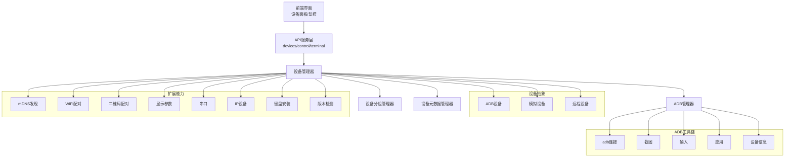
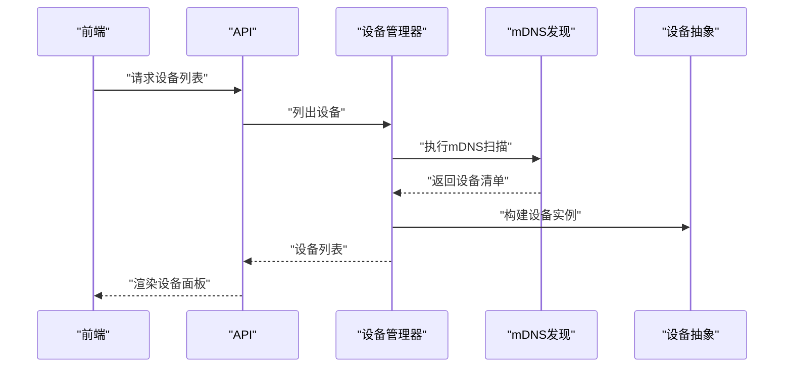
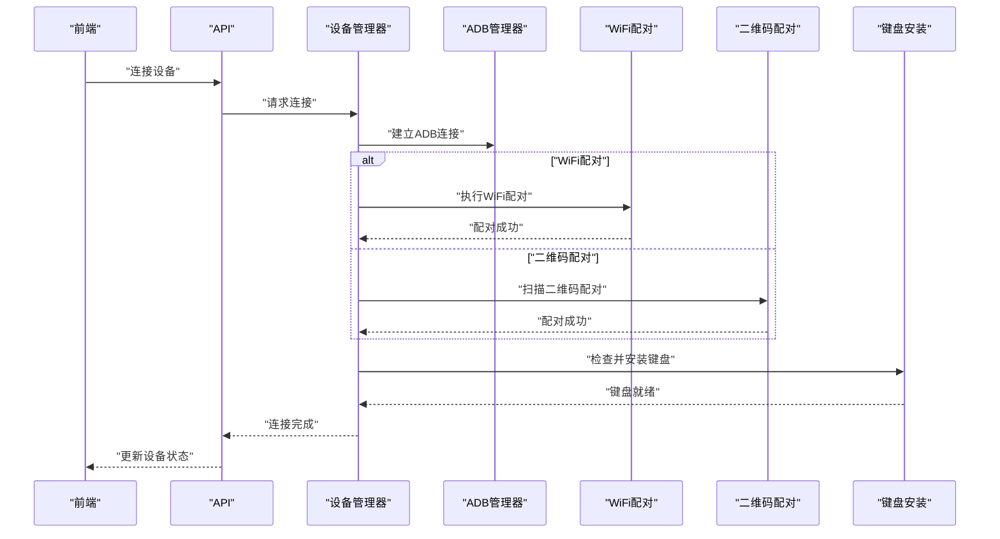
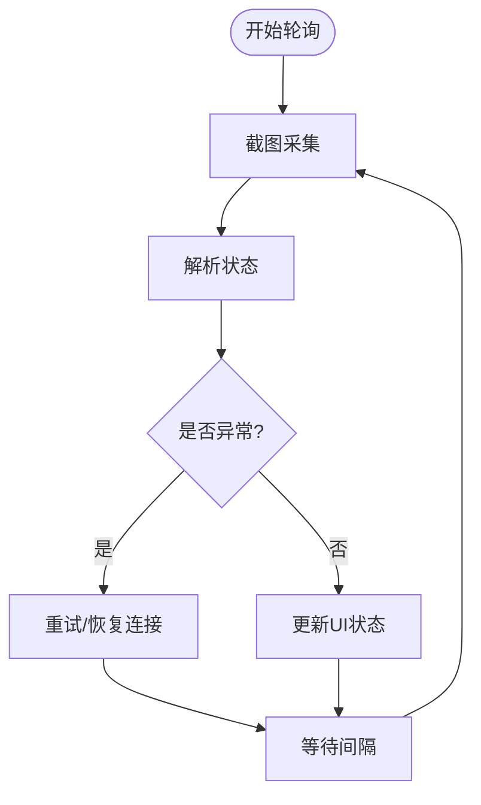
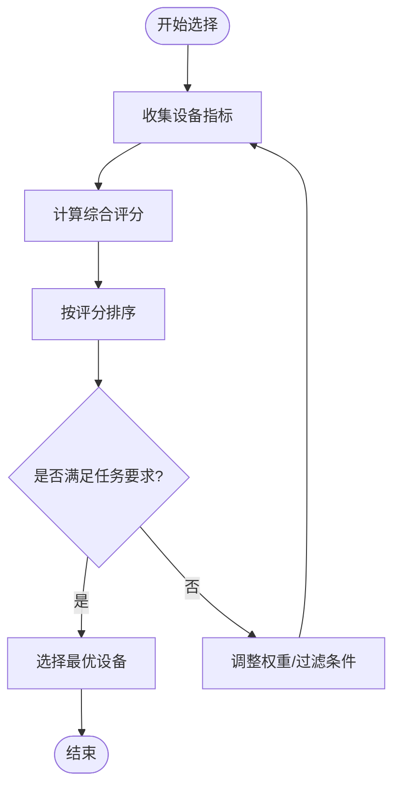
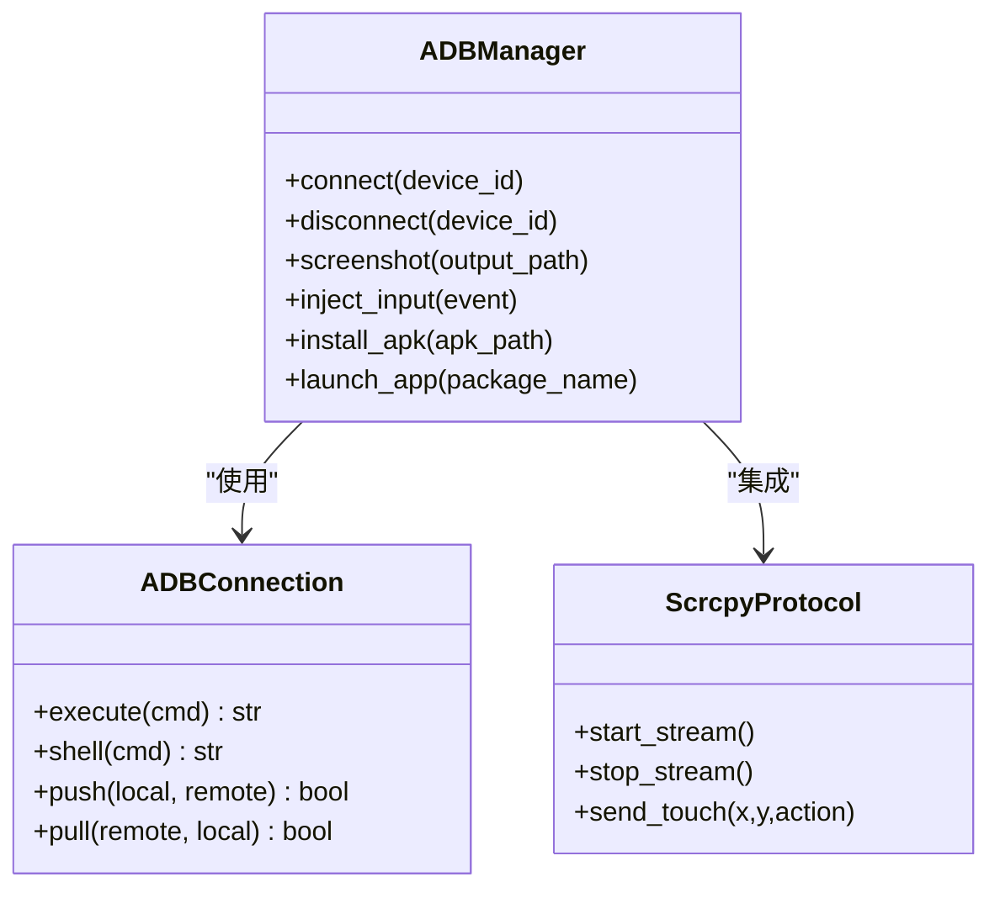
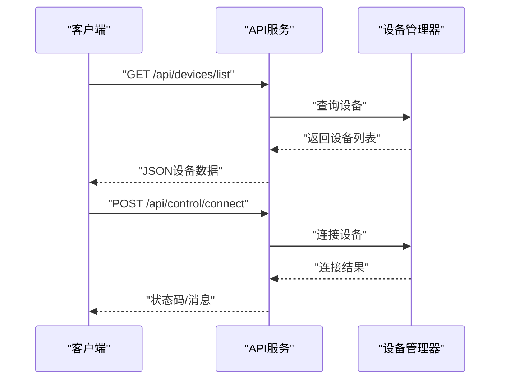
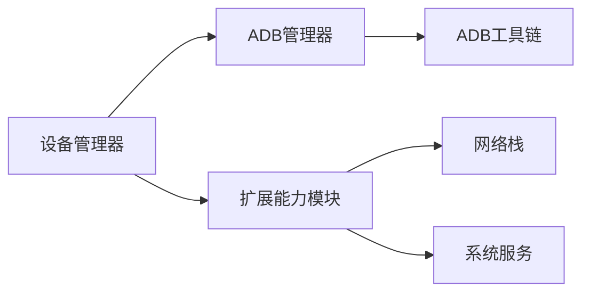

# 设备管理系统

<cite>
**本文档引用的文件**
- [device_manager.py](file://AutoGLM_GUI/device_manager.py)
- [adb_manager.py](file://AutoGLM_GUI/adb_manager.py)
- [adb_device.py](file://AutoGLM_GUI/devices/adb_device.py)
- [mock_device.py](file://AutoGLM_GUI/devices/mock_device.py)
- [remote_device.py](file://AutoGLM_GUI/devices/remote_device.py)
- [mdns.py](file://AutoGLM_GUI/adb_plus/mdns.py)
- [pair.py](file://AutoGLM_GUI/adb_plus/pair.py)
- [qr_pair.py](file://AutoGLM_GUI/adb_plus/qr_pair.py)
- [device.py](file://AutoGLM_GUI/adb_plus/device.py)
- [connection.py](file://AutoGLM_GUI/adb/connection.py)
- [device.py](file://AutoGLM_GUI/adb/device.py)
- [screenshot.py](file://AutoGLM_GUI/adb/screenshot.py)
- [input.py](file://AutoGLM_GUI/adb/input.py)
- [apps.py](file://AutoGLM_GUI/adb/apps.py)
- [display.py](file://AutoGLM_GUI/adb_plus/display.py)
- [serial.py](file://AutoGLM_GUI/adb_plus/serial.py)
- [ip.py](file://AutoGLM_GUI/adb_plus/ip.py)
- [keyboard_installer.py](file://AutoGLM_GUI/adb_plus/keyboard_installer.py)
- [version.py](file://AutoGLM_GUI/adb_plus/version.py)
- [devices.py](file://AutoGLM_GUI/api/devices.py)
- [control.py](file://AutoGLM_GUI/api/control.py)
- [terminal.py](file://AutoGLM_GUI/api/terminal.py)
- [config.py](file://AutoGLM_GUI/config.py)
- [config_manager.py](file://AutoGLM_GUI/config_manager.py)
- [device_group_manager.py](file://AutoGLM_GUI/device_group_manager.py)
- [device_metadata_manager.py](file://AutoGLM_GUI/device_metadata_manager.py)
- [types.py](file://AutoGLM_GUI/types.py)
- [exceptions.py](file://AutoGLM_GUI/exceptions.py)
- [logger.py](file://AutoGLM_GUI/logger.py)
- [platform_utils.py](file://AutoGLM_GUI/platform_utils.py)
</cite>

## 目录
1. [简介](#简介)
2. [项目结构](#项目结构)
3. [核心组件](#核心组件)
4. [架构总览](#架构总览)
5. [详细组件分析](#详细组件分析)
6. [依赖关系分析](#依赖关系分析)
7. [性能考虑](#性能考虑)
8. [故障排除指南](#故障排除指南)
9. [结论](#结论)

## 简介
本文件系统性梳理 AutoGLM-GUI 的设备管理系统，重点覆盖以下方面：
- 设备发现机制：包括 mDNS 发现、序列号识别、IP 设备接入等
- 连接管理：ADB 连接生命周期、WiFi 配对、二维码配对、键盘安装等
- 状态监控：设备状态同步、截图轮询、输入事件处理
- 设备优先级选择算法：基于网络环境、稳定性、性能的综合排序策略
- 与 ADB 工具链的集成：adb 命令封装、scrcpy 协议对接
- 常见问题与解决方案：连接失败、状态同步延迟、键盘初始化异常等

本文件既面向初学者提供清晰的概念与流程图解，也为资深开发者提供代码级的调用关系、接口定义与实现细节。

## 项目结构
设备管理相关模块主要分布在以下路径：
- 核心管理层：device_manager.py、adb_manager.py、device_group_manager.py、device_metadata_manager.py
- 设备抽象层：devices/adb_device.py、devices/mock_device.py、devices/remote_device.py
- ADB 工具链：adb/*（连接、设备信息、截图、输入、应用）
- 扩展能力：adb_plus/*（mDNS、配对、显示、串口、IP、键盘安装、版本）
- API 层：api/devices.py、api/control.py、api/terminal.py
- 配置与类型：config.py、config_manager.py、types.py
- 辅助工具：platform_utils.py、logger.py、exceptions.py

```mermaid
graph TB
subgraph "设备管理层"
DM["device_manager.py"]
ADM["adb_manager.py"]
DGM["device_group_manager.py"]
DMM["device_metadata_manager.py"]
end
subgraph "设备抽象层"
AD["devices/adb_device.py"]
MD["devices/mock_device.py"]
RD["devices/remote_device.py"]
end
subgraph "ADB工具链"
AC["adb/connection.py"]
ADdev["adb/device.py"]
AS["adb/screenshot.py"]
AI["adb/input.py"]
AA["adb/apps.py"]
end
subgraph "扩展能力"
AMdns["adb_plus/mdns.py"]
APair["adb_plus/pair.py"]
AQR["adb_plus/qr_pair.py"]
ADev["adb_plus/device.py"]
ADisp["adb_plus/display.py"]
ASer["adb_plus/serial.py"]
AIP["adb_plus/ip.py"]
AKbd["adb_plus/keyboard_installer.py"]
AVer["adb_plus/version.py"]
end
subgraph "API层"
APIdev["api/devices.py"]
APIctl["api/control.py"]
APIterm["api/terminal.py"]
end
DM --> ADM
DM --> DGM
DM --> DMM
ADM --> AC
ADM --> ADdev
ADM --> AS
ADM --> AI
ADM --> AA
ADM --> ADev
DM --> AD
DM --> MD
DM --> RD
DM --> AMdns
DM --> APair
DM --> AQR
DM --> ADisp
DM --> ASer
DM --> AIP
DM --> AKbd
DM --> AVer
DM --> APIdev
DM --> APIctl
DM --> APIterm
```

图表来源
- [device_manager.py](file://AutoGLM_GUI/device_manager.py)
- [adb_manager.py](file://AutoGLM_GUI/adb_manager.py)
- [adb/connection.py](file://AutoGLM_GUI/adb/connection.py)
- [adb/device.py](file://AutoGLM_GUI/adb/device.py)
- [adb/screenshot.py](file://AutoGLM_GUI/adb/screenshot.py)
- [adb/input.py](file://AutoGLM_GUI/adb/input.py)
- [adb/apps.py](file://AutoGLM_GUI/adb/apps.py)
- [adb_plus/mdns.py](file://AutoGLM_GUI/adb_plus/mdns.py)
- [adb_plus/pair.py](file://AutoGLM_GUI/adb_plus/pair.py)
- [adb_plus/qr_pair.py](file://AutoGLM_GUI/adb_plus/qr_pair.py)
- [adb_plus/device.py](file://AutoGLM_GUI/adb_plus/device.py)
- [adb_plus/display.py](file://AutoGLM_GUI/adb_plus/display.py)
- [adb_plus/serial.py](file://AutoGLM_GUI/adb_plus/serial.py)
- [adb_plus/ip.py](file://AutoGLM_GUI/adb_plus/ip.py)
- [adb_plus/keyboard_installer.py](file://AutoGLM_GUI/adb_plus/keyboard_installer.py)
- [adb_plus/version.py](file://AutoGLM_GUI/adb_plus/version.py)
- [api/devices.py](file://AutoGLM_GUI/api/devices.py)
- [api/control.py](file://AutoGLM_GUI/api/control.py)
- [api/terminal.py](file://AutoGLM_GUI/api/terminal.py)

章节来源
- [device_manager.py](file://AutoGLM_GUI/device_manager.py)
- [adb_manager.py](file://AutoGLM_GUI/adb_manager.py)
- [config.py](file://AutoGLM_GUI/config.py)

## 核心组件
- 设备管理器（device_manager）：统一编排设备发现、连接、状态监控与释放；协调分组与元数据管理。
- ADB 管理器（adb_manager）：封装 adb 工具链交互，负责设备连接、截图、输入、应用操作等。
- 设备抽象（devices/*）：定义通用设备接口，支持本地 ADB、模拟设备与远程设备。
- 扩展能力（adb_plus/*）：提供 mDNS 发现、WiFi 配对、二维码配对、显示参数、串口、IP、键盘安装、版本检测等。
- API 层（api/*）：对外暴露设备查询、控制与终端能力，供前端与外部系统调用。

章节来源
- [device_manager.py](file://AutoGLM_GUI/device_manager.py)
- [adb_manager.py](file://AutoGLM_GUI/adb_manager.py)
- [devices/adb_device.py](file://AutoGLM_GUI/devices/adb_device.py)
- [devices/mock_device.py](file://AutoGLM_GUI/devices/mock_device.py)
- [devices/remote_device.py](file://AutoGLM_GUI/devices/remote_device.py)
- [adb_plus/mdns.py](file://AutoGLM_GUI/adb_plus/mdns.py)
- [adb_plus/pair.py](file://AutoGLM_GUI/adb_plus/pair.py)
- [adb_plus/qr_pair.py](file://AutoGLM_GUI/adb_plus/qr_pair.py)
- [api/devices.py](file://AutoGLM_GUI/api/devices.py)
- [api/control.py](file://AutoGLM_GUI/api/control.py)
- [api/terminal.py](file://AutoGLM_GUI/api/terminal.py)

## 架构总览
设备管理系统的运行时架构如下：

图表来源
- [device_manager.py](file://AutoGLM_GUI/device_manager.py)
- [adb_manager.py](file://AutoGLM_GUI/adb_manager.py)
- [devices/adb_device.py](file://AutoGLM_GUI/devices/adb_device.py)
- [adb/connection.py](file://AutoGLM_GUI/adb/connection.py)
- [adb/screenshot.py](file://AutoGLM_GUI/adb/screenshot.py)
- [adb/input.py](file://AutoGLM_GUI/adb/input.py)
- [adb/apps.py](file://AutoGLM_GUI/adb/apps.py)
- [adb/device.py](file://AutoGLM_GUI/adb/device.py)
- [adb_plus/mdns.py](file://AutoGLM_GUI/adb_plus/mdns.py)
- [adb_plus/pair.py](file://AutoGLM_GUI/adb_plus/pair.py)
- [adb_plus/qr_pair.py](file://AutoGLM_GUI/adb_plus/qr_pair.py)
- [adb_plus/display.py](file://AutoGLM_GUI/adb_plus/display.py)
- [adb_plus/serial.py](file://AutoGLM_GUI/adb_plus/serial.py)
- [adb_plus/ip.py](file://AutoGLM_GUI/adb_plus/ip.py)
- [adb_plus/keyboard_installer.py](file://AutoGLM_GUI/adb_plus/keyboard_installer.py)
- [adb_plus/version.py](file://AutoGLM_GUI/adb_plus/version.py)

## 详细组件分析

### 设备发现机制
- mDNS 发现：通过多播 DNS 广播解析设备主机名，获取可用设备列表。适用于局域网内设备自动发现。
- 序列号识别：从设备输出中提取序列号，作为唯一标识符进行连接与状态跟踪。
- IP 设备接入：支持通过 IP:端口直连设备，常用于 WiFi 配对后的稳定连接。
- 扩展发现：结合串口（USB）与显示参数，辅助判断设备类型与连接方式。

图表来源
- [device_manager.py](file://AutoGLM_GUI/device_manager.py)
- [adb_plus/mdns.py](file://AutoGLM_GUI/adb_plus/mdns.py)
- [devices/adb_device.py](file://AutoGLM_GUI/devices/adb_device.py)

章节来源
- [adb_plus/mdns.py](file://AutoGLM_GUI/adb_plus/mdns.py)
- [adb_plus/serial.py](file://AutoGLM_GUI/adb_plus/serial.py)
- [adb_plus/ip.py](file://AutoGLM_GUI/adb_plus/ip.py)
- [devices/adb_device.py](file://AutoGLM_GUI/devices/adb_device.py)

### 连接管理
- ADB 连接生命周期：建立连接、心跳检测、异常重连、断开清理。
- WiFi 配对流程：设备端生成配对码 → 客户端发起配对 → 成功后切换到稳定 TCP 连接。
- 二维码配对：扫描二维码触发配对，简化无键盘场景下的连接。
- 键盘安装：在首次连接或需要输入法时，自动安装 ADBKeyBoard APK 并初始化权限。

图表来源
- [device_manager.py](file://AutoGLM_GUI/device_manager.py)
- [adb_manager.py](file://AutoGLM_GUI/adb_manager.py)
- [adb_plus/pair.py](file://AutoGLM_GUI/adb_plus/pair.py)
- [adb_plus/qr_pair.py](file://AutoGLM_GUI/adb_plus/qr_pair.py)
- [adb_plus/keyboard_installer.py](file://AutoGLM_GUI/adb_plus/keyboard_installer.py)

章节来源
- [adb_manager.py](file://AutoGLM_GUI/adb_manager.py)
- [adb_plus/pair.py](file://AutoGLM_GUI/adb_plus/pair.py)
- [adb_plus/qr_pair.py](file://AutoGLM_GUI/adb_plus/qr_pair.py)
- [adb_plus/keyboard_installer.py](file://AutoGLM_GUI/adb_plus/keyboard_installer.py)

### 状态监控
- 截图轮询：周期性拉取设备屏幕快照，用于实时预览与状态判断。
- 输入事件处理：封装点击、滑动、文本输入等操作，确保与设备输入法兼容。
- 设备元数据：记录设备名称、分辨率、系统版本、连接方式等，用于优化选择策略。

图表来源
- [adb/screenshot.py](file://AutoGLM_GUI/adb/screenshot.py)
- [adb/input.py](file://AutoGLM_GUI/adb/input.py)
- [device_metadata_manager.py](file://AutoGLM_GUI/device_metadata_manager.py)

章节来源
- [adb/screenshot.py](file://AutoGLM_GUI/adb/screenshot.py)
- [adb/input.py](file://AutoGLM_GUI/adb/input.py)
- [device_metadata_manager.py](file://AutoGLM_GUI/device_metadata_manager.py)

### 设备优先级选择算法
- 评估维度：网络稳定性（WiFi/USB）、设备性能（分辨率、帧率）、使用频率、任务适配度。
- 排序策略：优先 USB 设备，其次 WiFi 设备；在相同连接方式下，优先高分辨率、低延迟设备；若存在任务偏好（如需要输入法），优先已安装键盘的设备。
- 动态调整：根据连接成功率、截图延迟、输入响应时间动态调整权重。

图表来源
- [device_manager.py](file://AutoGLM_GUI/device_manager.py)
- [device_metadata_manager.py](file://AutoGLM_GUI/device_metadata_manager.py)
- [device_group_manager.py](file://AutoGLM_GUI/device_group_manager.py)

章节来源
- [device_manager.py](file://AutoGLM_GUI/device_manager.py)
- [device_metadata_manager.py](file://AutoGLM_GUI/device_metadata_manager.py)
- [device_group_manager.py](file://AutoGLM_GUI/device_group_manager.py)

### ADB 工具链集成
- adb 命令封装：统一管理 adb 连接、设备查询、应用安装与启动、输入事件发送、截图保存等。
- scrcpy 协议对接：通过 scrcpy 实现设备投屏与控制，配合本系统的状态监控与任务调度。
- 版本检测：检测本地 ADB 与设备侧版本，避免不兼容导致的连接失败。

图表来源
- [adb_manager.py](file://AutoGLM_GUI/adb_manager.py)
- [adb/connection.py](file://AutoGLM_GUI/adb/connection.py)
- [adb/screenshot.py](file://AutoGLM_GUI/adb/screenshot.py)
- [adb/input.py](file://AutoGLM_GUI/adb/input.py)
- [adb/apps.py](file://AutoGLM_GUI/adb/apps.py)
- [scrcpy_protocol.py](file://AutoGLM_GUI/scrcpy_protocol.py)

章节来源
- [adb_manager.py](file://AutoGLM_GUI/adb_manager.py)
- [adb/connection.py](file://AutoGLM_GUI/adb/connection.py)
- [adb/screenshot.py](file://AutoGLM_GUI/adb/screenshot.py)
- [adb/input.py](file://AutoGLM_GUI/adb/input.py)
- [adb/apps.py](file://AutoGLM_GUI/adb/apps.py)
- [scrcpy_protocol.py](file://AutoGLM_GUI/scrcpy_protocol.py)

### API 使用模式
- 设备查询：GET /api/devices/list 返回当前可用设备列表。
- 设备控制：POST /api/control/connect 触发连接；POST /api/control/disconnect 断开连接。
- 终端能力：WebSocket /api/terminal 提供交互式终端会话。

图表来源
- [api/devices.py](file://AutoGLM_GUI/api/devices.py)
- [api/control.py](file://AutoGLM_GUI/api/control.py)
- [device_manager.py](file://AutoGLM_GUI/device_manager.py)

章节来源
- [api/devices.py](file://AutoGLM_GUI/api/devices.py)
- [api/control.py](file://AutoGLM_GUI/api/control.py)
- [api/terminal.py](file://AutoGLM_GUI/api/terminal.py)

## 依赖关系分析
- 模块耦合：设备管理器对 ADB 管理器与扩展能力模块有强依赖；扩展能力模块之间相对独立，通过设备抽象层解耦。
- 外部依赖：ADB 工具链、scrcpy、系统网络栈（mDNS、TCP/IP）。
- 风险点：网络不稳定导致的连接抖动、ADB 版本不兼容、键盘安装失败。

图表来源
- [device_manager.py](file://AutoGLM_GUI/device_manager.py)
- [adb_manager.py](file://AutoGLM_GUI/adb_manager.py)
- [adb_plus/mdns.py](file://AutoGLM_GUI/adb_plus/mdns.py)
- [adb_plus/pair.py](file://AutoGLM_GUI/adb_plus/pair.py)

章节来源
- [device_manager.py](file://AutoGLM_GUI/device_manager.py)
- [adb_manager.py](file://AutoGLM_GUI/adb_manager.py)

## 性能考虑
- 连接建立：优先使用 USB 连接以降低延迟；WiFi 连接需关注丢包与带宽波动。
- 截图策略：根据任务需求动态调整截图频率，避免过度占用带宽与 CPU。
- 输入法兼容：键盘安装后缓存状态，减少重复安装开销。
- 分组与元数据：合理使用分组与元数据缓存，避免频繁 IO。

## 故障排除指南
- 设备连接失败
  - 检查 ADB 是否正确安装与版本兼容。
  - 确认设备已开启开发者选项与 USB 调试。
  - 尝试重新配对（WiFi/二维码）。
- 状态同步延迟
  - 降低截图频率或启用硬件加速。
  - 检查网络质量，必要时切换到 USB 连接。
- 键盘初始化异常
  - 确认 APK 文件完整且可安装。
  - 检查设备存储空间与权限设置。
- 日志定位
  - 查看日志模块输出，定位具体异常阶段与错误码。

章节来源
- [exceptions.py](file://AutoGLM_GUI/exceptions.py)
- [logger.py](file://AutoGLM_GUI/logger.py)
- [platform_utils.py](file://AutoGLM_GUI/platform_utils.py)

## 结论
AutoGLM-GUI 的设备管理系统通过“设备管理器 + ADB 管理器 + 扩展能力”的分层设计，实现了从发现、连接、监控到控制的全链路能力。结合 mDNS、WiFi/二维码配对与键盘安装等特性，系统在复杂网络环境下仍能保持较高的稳定性与易用性。建议在生产环境中持续优化连接策略与状态监控参数，并完善异常处理与可观测性。