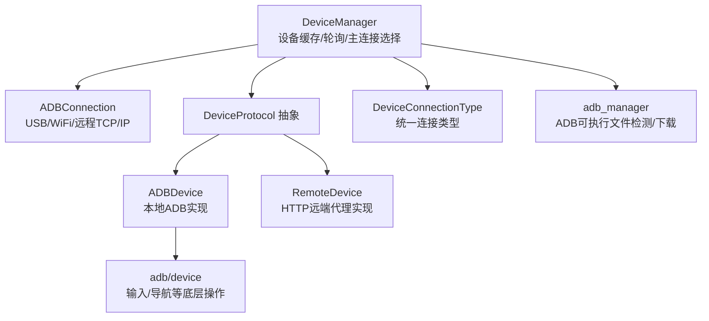
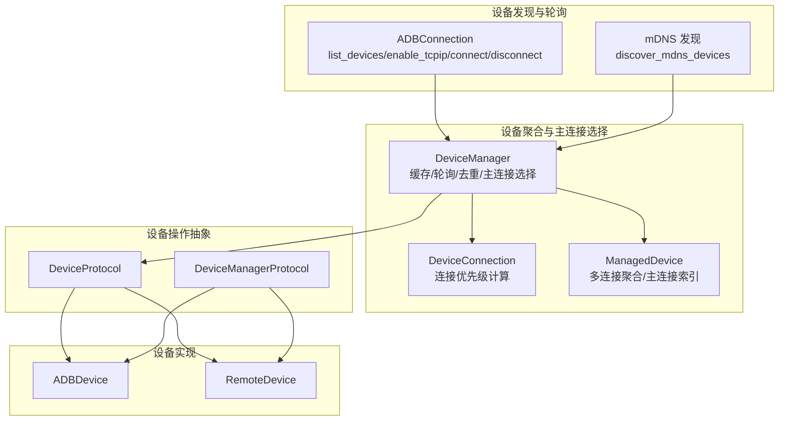
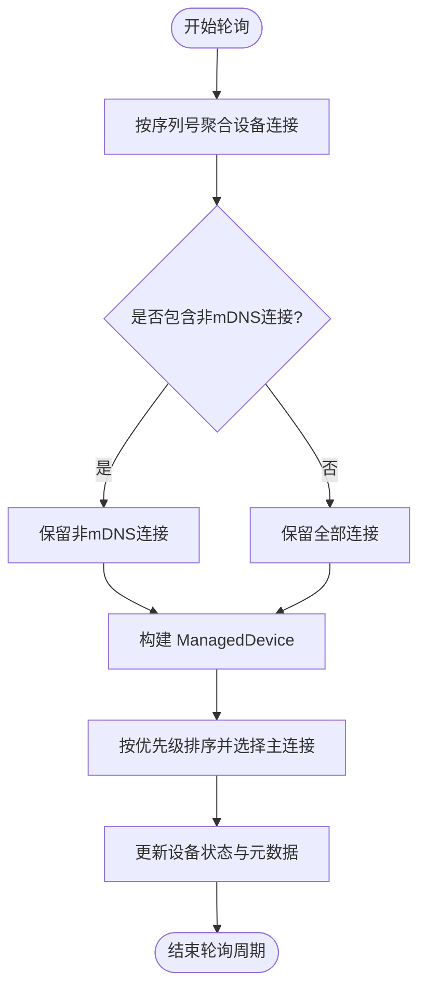
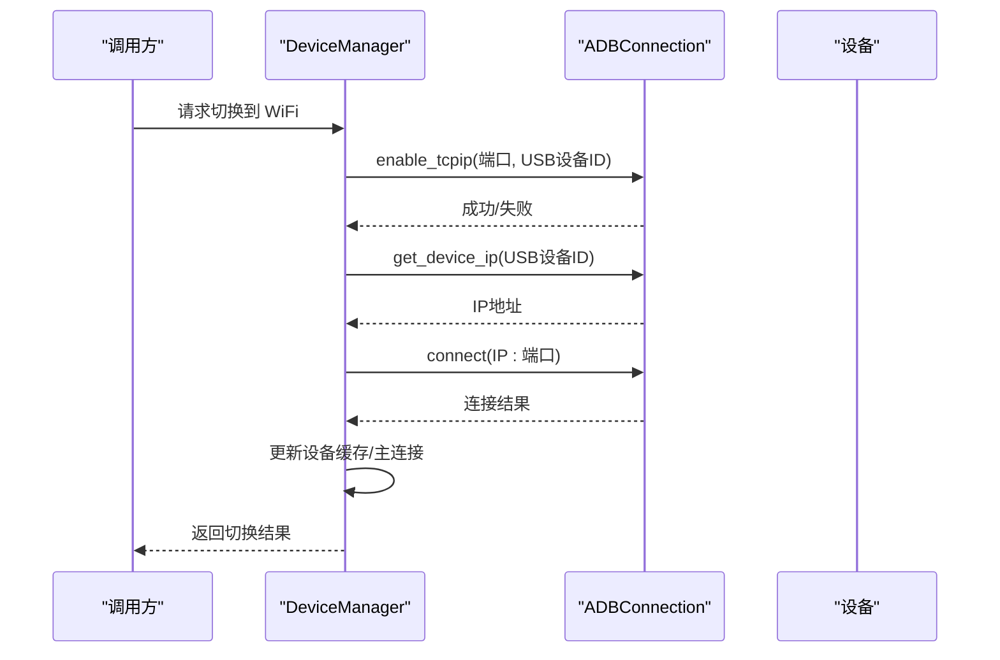
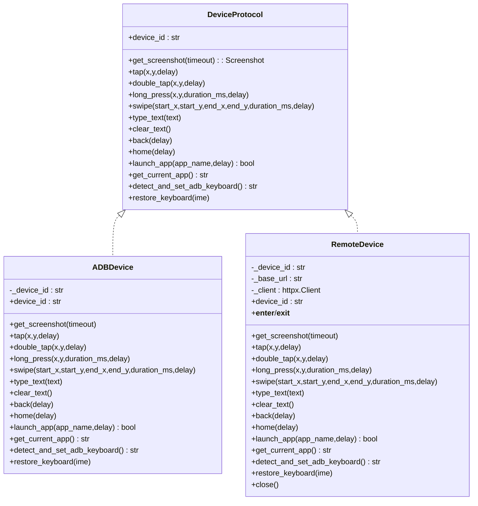
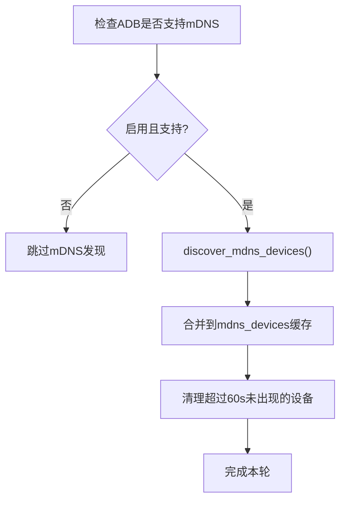
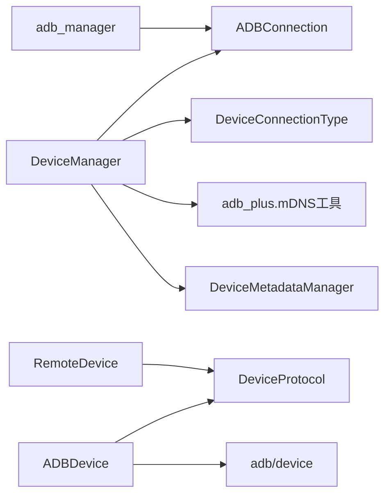

# 连接管理与切换

<cite>
**本文引用的文件**
- [device_manager.py](file://AutoGLM_GUI/device_manager.py)
- [adb/connection.py](file://AutoGLM_GUI/adb/connection.py)
- [types.py](file://AutoGLM_GUI/types.py)
- [device_protocol.py](file://AutoGLM_GUI/device_protocol.py)
- [devices/adb_device.py](file://AutoGLM_GUI/devices/adb_device.py)
- [devices/remote_device.py](file://AutoGLM_GUI/devices/remote_device.py)
- [adb_manager.py](file://AutoGLM_GUI/adb_manager.py)
- [adb/device.py](file://AutoGLM_GUI/adb/device.py)
- [device_group_manager.py](file://AutoGLM_GUI/device_group_manager.py)
</cite>

## 目录
1. [简介](#简介)
2. [项目结构](#项目结构)
3. [核心组件](#核心组件)
4. [架构总览](#架构总览)
5. [详细组件分析](#详细组件分析)
6. [依赖分析](#依赖分析)
7. [性能考虑](#性能考虑)
8. [故障排查指南](#故障排查指南)
9. [结论](#结论)
10. [附录](#附录)

## 简介
本章节面向“连接管理与切换”主题，系统阐述 AutoGLM-GUI 中设备连接管理机制、连接类型切换、主连接选择与状态维护等关键能力。文档覆盖 USB 连接、WiFi 连接、远程连接（HTTP 远端代理）三类路径，解释连接优先级算法、后台轮询与指数退避策略、以及与不同设备类型的集成关系。同时给出常见问题与解决方案，帮助初学者快速上手，也为资深开发者提供足够的技术深度。

## 项目结构
围绕连接管理与切换的关键模块如下：
- 设备管理与轮询：DeviceManager（集中缓存、状态聚合、主连接选择、后台轮询、指数退避）
- ADB 连接层：ADBConnection（本地 ADB 子进程调用，支持 USB/WiFi/远程 TCP/IP）
- 设备协议抽象：DeviceProtocol/DeviceManagerProtocol（统一设备操作接口）
- 设备实现：ADBDevice、RemoteDevice（本地 ADB 实现、HTTP 远端代理实现）
- 类型与枚举：DeviceConnectionType（统一连接类型枚举）
- ADB 工具：adb_manager（ADB 可执行文件检测与下载）、adb/device（输入/导航等底层操作）
- 设备分组：DeviceGroupManager（设备分组与持久化）

图表来源
- [device_manager.py:249-791](file://AutoGLM_GUI/device_manager.py#L249-L791)
- [adb/connection.py:49-343](file://AutoGLM_GUI/adb/connection.py#L49-L343)
- [device_protocol.py:49-267](file://AutoGLM_GUI/device_protocol.py#L49-L267)
- [devices/adb_device.py:14-287](file://AutoGLM_GUI/devices/adb_device.py#L14-L287)
- [devices/remote_device.py:21-207](file://AutoGLM_GUI/devices/remote_device.py#L21-L207)
- [types.py:129-143](file://AutoGLM_GUI/types.py#L129-L143)
- [adb_manager.py:33-143](file://AutoGLM_GUI/adb_manager.py#L33-L143)
- [adb/device.py:11-277](file://AutoGLM_GUI/adb/device.py#L11-L277)

章节来源
- [device_manager.py:249-791](file://AutoGLM_GUI/device_manager.py#L249-L791)
- [adb/connection.py:49-343](file://AutoGLM_GUI/adb/connection.py#L49-L343)
- [types.py:129-143](file://AutoGLM_GUI/types.py#L129-L143)
- [device_protocol.py:49-267](file://AutoGLM_GUI/device_protocol.py#L49-L267)
- [devices/adb_device.py:14-287](file://AutoGLM_GUI/devices/adb_device.py#L14-L287)
- [devices/remote_device.py:21-207](file://AutoGLM_GUI/devices/remote_device.py#L21-L207)
- [adb_manager.py:33-143](file://AutoGLM_GUI/adb_manager.py#L33-L143)
- [adb/device.py:11-277](file://AutoGLM_GUI/adb/device.py#L11-L277)

## 核心组件
- DeviceManager：全局设备管理器，负责后台轮询、设备状态缓存、多连接聚合、主连接选择、指数退避、mDNS 发现与合并展示。
- ADBConnection：封装 ADB 子进程调用，支持 connect/disconnect/list_devices/enable_tcpip/get_device_ip 等。
- DeviceProtocol/DeviceManagerProtocol：定义统一的设备与设备管理器接口，屏蔽具体实现差异。
- ADBDevice/RemoteDevice：分别对接本地 ADB 与 HTTP 远端代理，提供截图、点击、滑动、应用启动等操作。
- DeviceConnectionType：统一连接类型枚举（USB/WiFi/REMOTE），用于 UI 展示与状态判断。
- adb_manager：在无系统 ADB 时自动下载平台工具链中的 ADB 并缓存。
- adb/device：提供底层输入与导航命令封装。

章节来源
- [device_manager.py:249-791](file://AutoGLM_GUI/device_manager.py#L249-L791)
- [adb/connection.py:49-343](file://AutoGLM_GUI/adb/connection.py#L49-L343)
- [device_protocol.py:49-267](file://AutoGLM_GUI/device_protocol.py#L49-L267)
- [devices/adb_device.py:14-287](file://AutoGLM_GUI/devices/adb_device.py#L14-L287)
- [devices/remote_device.py:21-207](file://AutoGLM_GUI/devices/remote_device.py#L21-L207)
- [types.py:129-143](file://AutoGLM_GUI/types.py#L129-L143)
- [adb_manager.py:33-143](file://AutoGLM_GUI/adb_manager.py#L33-L143)
- [adb/device.py:11-277](file://AutoGLM_GUI/adb/device.py#L11-L277)

## 架构总览
下图展示了连接管理与切换的总体架构：DeviceManager 作为中枢，聚合来自 ADB 的设备信息与状态；当设备具备多种连接方式（如 USB/WiFi/mDNS）时，DeviceManager 会进行去重与优先级排序，选择最优主连接；对外通过 DeviceProtocol 提供统一操作接口，内部可路由到 ADBDevice 或 RemoteDevice。

图表来源
- [device_manager.py:435-791](file://AutoGLM_GUI/device_manager.py#L435-L791)
- [adb/connection.py:140-343](file://AutoGLM_GUI/adb/connection.py#L140-L343)
- [device_protocol.py:49-267](file://AutoGLM_GUI/device_protocol.py#L49-L267)
- [devices/adb_device.py:14-287](file://AutoGLM_GUI/devices/adb_device.py#L14-L287)
- [devices/remote_device.py:21-207](file://AutoGLM_GUI/devices/remote_device.py#L21-L207)

## 详细组件分析

### 设备连接优先级与主连接选择
DeviceManager 在每次轮询后，会对每个设备的多个连接进行优先级排序，选择最佳主连接用于后续 API/Agent 操作。优先级规则如下：
- 连接类型优先级：USB > WIFI > REMOTE
- 状态优先级：device > offline > unauthorized
- 最终分数 = 类型优先级 + 状态优先级

图表来源
- [device_manager.py:455-669](file://AutoGLM_GUI/device_manager.py#L455-L669)

章节来源
- [device_manager.py:88-180](file://AutoGLM_GUI/device_manager.py#L88-L180)
- [device_manager.py:167-180](file://AutoGLM_GUI/device_manager.py#L167-L180)

### ADB 连接管理（USB/WiFi/远程 TCP/IP）
ADBConnection 提供以下核心能力：
- connect(address, timeout)：连接远端设备（格式 host:port，默认 5555）
- disconnect(address|None)：断开指定地址或全部连接
- list_devices()：列出已连接设备及连接类型（USB/WiFi/REMOTE）
- enable_tcpip(port, device_id)：启用 USB 设备的 TCP/IP 模式
- get_device_ip(device_id)：获取设备 IP 地址
- restart_server()：重启 ADB 服务

图表来源
- [device_manager.py:687-791](file://AutoGLM_GUI/device_manager.py#L687-L791)
- [adb/connection.py:74-139](file://AutoGLM_GUI/adb/connection.py#L74-L139)
- [adb/connection.py:234-286](file://AutoGLM_GUI/adb/connection.py#L234-L286)

章节来源
- [adb/connection.py:74-139](file://AutoGLM_GUI/adb/connection.py#L74-L139)
- [adb/connection.py:140-189](file://AutoGLM_GUI/adb/connection.py#L140-L189)
- [adb/connection.py:234-286](file://AutoGLM_GUI/adb/connection.py#L234-L286)
- [device_manager.py:687-791](file://AutoGLM_GUI/device_manager.py#L687-L791)

### 设备协议与实现（ADBDevice/RemoteDevice）
DeviceProtocol 定义了统一的设备操作接口，DeviceManager 通过该接口屏蔽底层差异，向上提供一致的设备访问能力。ADBDevice 与 RemoteDevice 分别实现本地 ADB 与 HTTP 远端代理两种路径。

图表来源
- [device_protocol.py:49-213](file://AutoGLM_GUI/device_protocol.py#L49-L213)
- [devices/adb_device.py:14-202](file://AutoGLM_GUI/devices/adb_device.py#L14-L202)
- [devices/remote_device.py:21-161](file://AutoGLM_GUI/devices/remote_device.py#L21-L161)

章节来源
- [device_protocol.py:49-213](file://AutoGLM_GUI/device_protocol.py#L49-L213)
- [devices/adb_device.py:14-202](file://AutoGLM_GUI/devices/adb_device.py#L14-L202)
- [devices/remote_device.py:21-161](file://AutoGLM_GUI/devices/remote_device.py#L21-L161)

### mDNS 发现与可用设备展示
DeviceManager 支持通过 mDNS 发现局域网内可用设备（仅在线路中存在更清晰连接时才保留 mDNS）。mDNS 设备以 AVAILABLE_MDNS 状态加入缓存，不会与已连接设备冲突，且会在一段时间未出现后清理。

图表来源
- [device_manager.py:601-669](file://AutoGLM_GUI/device_manager.py#L601-L669)

章节来源
- [device_manager.py:416-433](file://AutoGLM_GUI/device_manager.py#L416-L433)
- [device_manager.py:601-669](file://AutoGLM_GUI/device_manager.py#L601-L669)

### 设备分组与连接切换的协同
DeviceGroupManager 提供设备分组与持久化，便于用户在多个设备间进行逻辑分组管理。结合 DeviceManager 的主连接选择，可在分组内进行连接切换与状态同步。

章节来源
- [device_group_manager.py:26-357](file://AutoGLM_GUI/device_group_manager.py#L26-L357)

## 依赖分析
- DeviceManager 依赖：
  - adb/connection.py：ADB 子进程调用与设备列表解析
  - adb_plus（导入 discover_mdns_devices/extract_serial_from_mdns）：mDNS 发现
  - types.py：DeviceConnectionType 统一连接类型
  - device_metadata_manager：显示名等元数据
- ADBDevice/RemoteDevice 依赖 DeviceProtocol 抽象，实现具体设备操作
- adb_manager：在无系统 ADB 时自动下载平台工具链中的 ADB

图表来源
- [device_manager.py:416-433](file://AutoGLM_GUI/device_manager.py#L416-L433)
- [device_manager.py:601-669](file://AutoGLM_GUI/device_manager.py#L601-L669)
- [types.py:129-143](file://AutoGLM_GUI/types.py#L129-L143)
- [devices/adb_device.py:14-287](file://AutoGLM_GUI/devices/adb_device.py#L14-L287)
- [devices/remote_device.py:21-207](file://AutoGLM_GUI/devices/remote_device.py#L21-L207)
- [adb_manager.py:33-143](file://AutoGLM_GUI/adb_manager.py#L33-L143)

章节来源
- [device_manager.py:416-433](file://AutoGLM_GUI/device_manager.py#L416-L433)
- [device_manager.py:601-669](file://AutoGLM_GUI/device_manager.py#L601-L669)
- [types.py:129-143](file://AutoGLM_GUI/types.py#L129-L143)
- [devices/adb_device.py:14-287](file://AutoGLM_GUI/devices/adb_device.py#L14-L287)
- [devices/remote_device.py:21-207](file://AutoGLM_GUI/devices/remote_device.py#L21-L207)
- [adb_manager.py:33-143](file://AutoGLM_GUI/adb_manager.py#L33-L143)

## 性能考虑
- 后台轮询与指数退避：DeviceManager 内置轮询线程，失败时采用指数退避（最小/最大间隔、倍数），避免频繁 ADB 调用造成资源浪费。
- 并发与去重：轮询阶段对设备进行并行串行处理，过滤掉重复的 mDNS 连接，减少无效状态更新。
- 主连接选择：优先级算法在连接类型与状态之间取得平衡，保证在设备不稳定或授权受限时仍能选择可用连接。

章节来源
- [device_manager.py:315-345](file://AutoGLM_GUI/device_manager.py#L315-L345)
- [device_manager.py:435-454](file://AutoGLM_GUI/device_manager.py#L435-L454)
- [device_manager.py:670-684](file://AutoGLM_GUI/device_manager.py#L670-L684)
- [device_manager.py:455-669](file://AutoGLM_GUI/device_manager.py#L455-L669)

## 故障排查指南
- ADB 不可用或找不到
  - 现象：设备列表为空、轮询失败、无法切换 WiFi
  - 处理：使用 adb_manager 自动下载平台工具链中的 ADB；确认系统 PATH 或缓存目录中存在 adb；必要时重启 ADB 服务器
  - 参考
    - [adb_manager.py:33-143](file://AutoGLM_GUI/adb_manager.py#L33-L143)
    - [adb/connection.py:288-318](file://AutoGLM_GUI/adb/connection.py#L288-L318)
- 连接不稳定/频繁断连
  - 现象：设备状态在 online/offline 间抖动
  - 处理：检查网络质量与防火墙设置；确认设备端已启用无线调试；DeviceManager 已内置指数退避，可观察日志恢复行为
  - 参考
    - [device_manager.py:670-684](file://AutoGLM_GUI/device_manager.py#L670-L684)
- 切换失败（WiFi）
  - 现象：enable_tcpip 成功但 connect 失败
  - 处理：确认设备 IP 获取成功；检查目标 IP/端口可达性；确认设备端无线调试端口正确；必要时手动连接
  - 参考
    - [device_manager.py:687-791](file://AutoGLM_GUI/device_manager.py#L687-L791)
    - [adb/connection.py:234-286](file://AutoGLM_GUI/adb/connection.py#L234-L286)
- 状态不同步（mDNS）
  - 现象：设备列表中出现 mDNS 可用设备但未连接
  - 处理：等待轮询周期；确认设备已通过 USB/WiFi 正常连接；mDNS 设备会在超时后被清理
  - 参考
    - [device_manager.py:601-669](file://AutoGLM_GUI/device_manager.py#L601-L669)
- 远端设备不可达
  - 现象：RemoteDevice 请求失败
  - 处理：检查 Device Agent 服务状态与网络连通性；确认 base_url 与设备 ID 正确
  - 参考
    - [devices/remote_device.py:163-207](file://AutoGLM_GUI/devices/remote_device.py#L163-L207)

章节来源
- [adb_manager.py:33-143](file://AutoGLM_GUI/adb_manager.py#L33-L143)
- [adb/connection.py:288-318](file://AutoGLM_GUI/adb/connection.py#L288-L318)
- [device_manager.py:670-684](file://AutoGLM_GUI/device_manager.py#L670-L684)
- [device_manager.py:687-791](file://AutoGLM_GUI/device_manager.py#L687-L791)
- [devices/remote_device.py:163-207](file://AutoGLM_GUI/devices/remote_device.py#L163-L207)

## 结论
AutoGLM-GUI 的连接管理与切换以 DeviceManager 为核心，结合 ADBConnection 与 DeviceProtocol 抽象，实现了对 USB/WiFi/REMOTE 三种连接路径的统一管理。通过优先级算法与后台轮询，系统能够在设备多连接、网络波动等复杂场景下保持稳定与高效。配合 mDNS 发现与设备分组，用户可以灵活地在不同设备间切换并维持一致的操作体验。

## 附录
- 关键接口与返回值摘要
  - ADBConnection.connect(address, timeout) → (success: bool, message: str)
  - ADBConnection.disconnect(address|None) → (success: bool, message: str)
  - ADBConnection.enable_tcpip(port, device_id) → (success: bool, message: str)
  - DeviceManager.connect_wifi(device_id, port) → (success: bool, message: str, wifi_device_id|None)
  - DeviceManager.connect_wifi_manual(ip, port) → (success: bool, message: str, device_id|None)
  - DeviceManager.disconnect_wifi(device_id) → (success: bool, message: str)
  - DeviceProtocol.get_screenshot(timeout) → Screenshot
  - DeviceProtocol.tap/double_tap/long_press/swipe/type_text/clear_text/back/home/launch_app/get_current_app/detect_and_set_adb_keyboard/restore_keyboard

章节来源
- [adb/connection.py:74-139](file://AutoGLM_GUI/adb/connection.py#L74-L139)
- [device_manager.py:687-791](file://AutoGLM_GUI/device_manager.py#L687-L791)
- [device_protocol.py:68-213](file://AutoGLM_GUI/device_protocol.py#L68-L213)