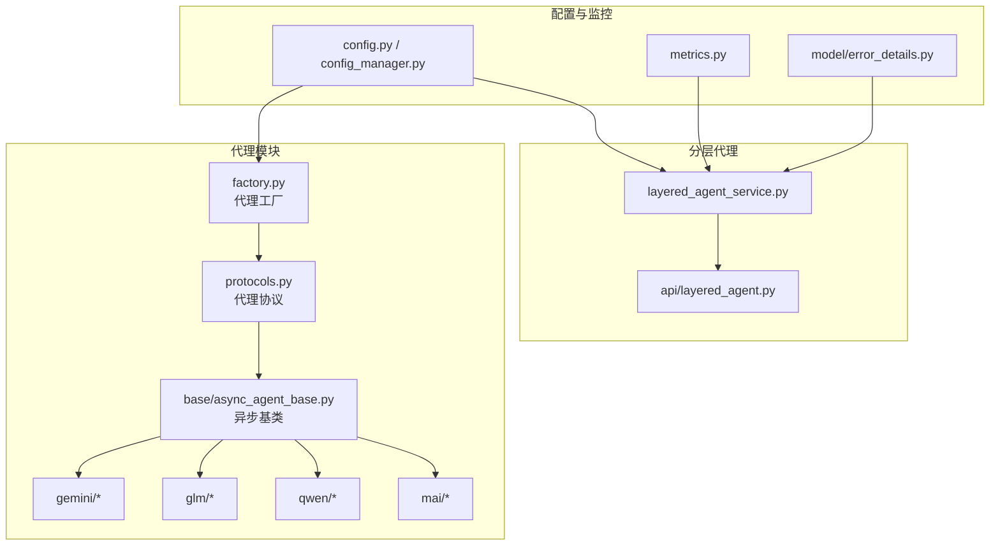
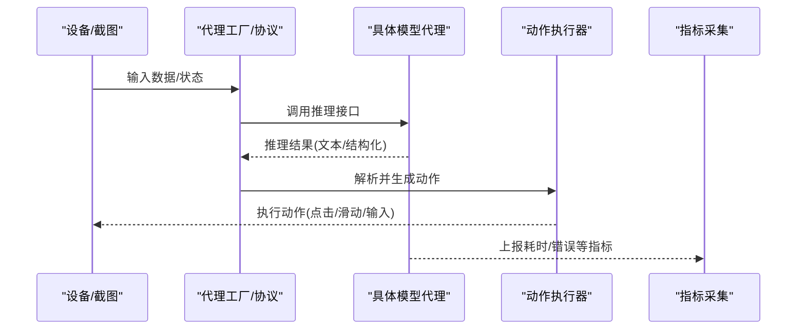
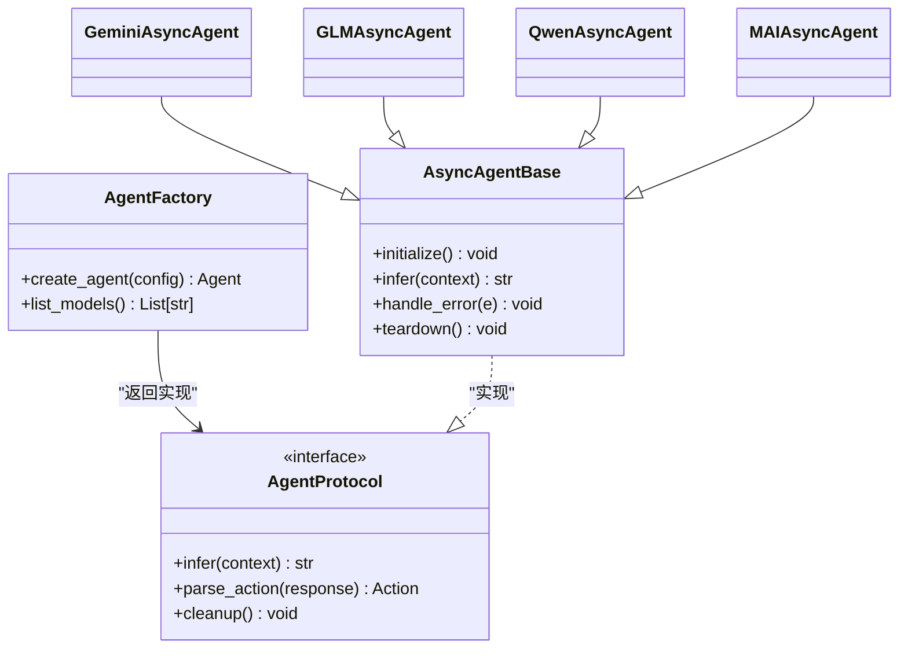
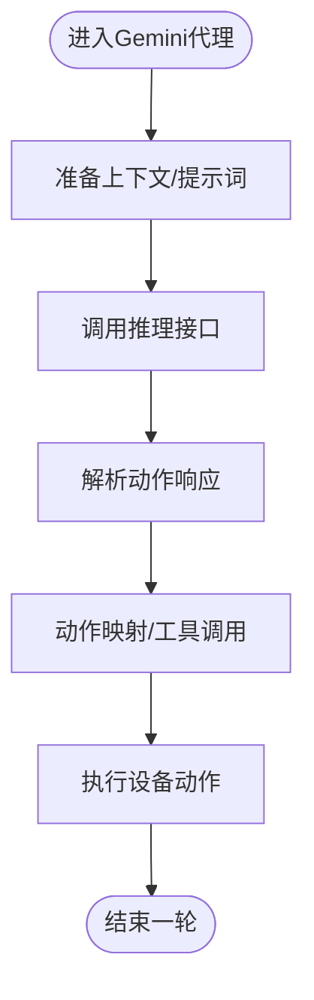
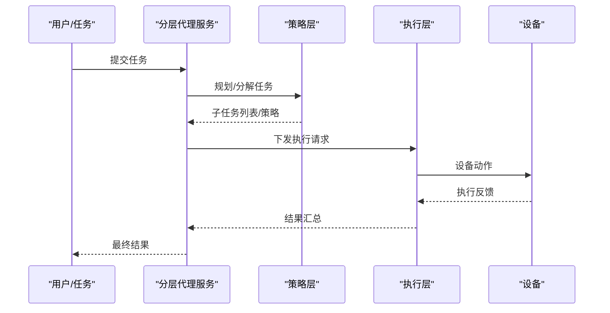
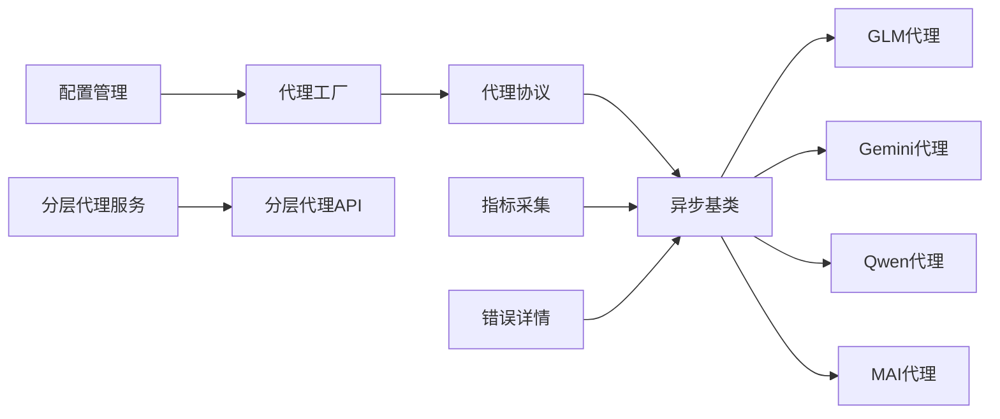
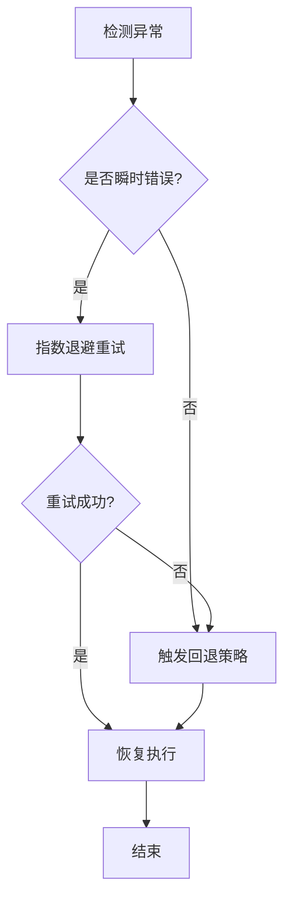

# AI代理使用

<cite>
**本文引用的文件**
- [AGENTS.md](file://AGENTS.md)
- [AI_USAGE.md](file://AI_USAGE.md)
- [README.md](file://README.md)
- [README_EN.md](file://README_EN.md)
- [AutoGLM_GUI/agents/__init__.py](file://AutoGLM_GUI/agents/__init__.py)
- [AutoGLM_GUI/agents/factory.py](file://AutoGLM_GUI/agents/factory.py)
- [AutoGLM_GUI/agents/protocols.py](file://AutoGLM_GUI/agents/protocols.py)
- [AutoGLM_GUI/agents/base/async_agent_base.py](file://AutoGLM_GUI/agents/base/async_agent_base.py)
- [AutoGLM_GUI/agents/gemini/async_agent.py](file://AutoGLM_GUI/agents/gemini/async_agent.py)
- [AutoGLM_GUI/agents/gemini/models.py](file://AutoGLM_GUI/agents/gemini/models.py)
- [AutoGLM_GUI/agents/gemini/prompts.py](file://AutoGLM_GUI/agents/gemini/prompts.py)
- [AutoGLM_GUI/agents/gemini/action_mapper.py](file://AutoGLM_GUI/agents/gemini/action_mapper.py)
- [AutoGLM_GUI/agents/gemini/tools.py](file://AutoGLM_GUI/agents/gemini/tools.py)
- [AutoGLM_GUI/agents/glm/async_agent.py](file://AutoGLM_GUI/agents/glm/async_agent.py)
- [AutoGLM_GUI/agents/glm/parser.py](file://AutoGLM_GUI/agents/glm/parser.py)
- [AutoGLM_GUI/agents/glm/prompts_en.py](file://AutoGLM_GUI/agents/glm/prompts_en.py)
- [AutoGLM_GUI/agents/qwen/async_agent.py](file://AutoGLM_GUI/agents/qwen/async_agent.py)
- [AutoGLM_GUI/agents/qwen/parser.py](file://AutoGLM_GUI/agents/qwen/parser.py)
- [AutoGLM_GUI/agents/qwen/prompts_en.py](file://AutoGLM_GUI/agents/qwen/prompts_en.py)
- [AutoGLM_GUI/agents/qwen/prompts_zh.py](file://AutoGLM_GUI/agents/qwen/prompts_zh.py)
- [AutoGLM_GUI/agents/mai/async_agent.py](file://AutoGLM_GUI/agents/mai/async_agent.py)
- [AutoGLM_GUI/agents/mai/parser.py](file://AutoGLM_GUI/agents/mai/parser.py)
- [AutoGLM_GUI/agents/mai/prompts.py](file://AutoGLM_GUI/agents/mai/prompts.py)
- [AutoGLM_GUI/agents/mai/traj_memory.py](file://AutoGLM_GUI/agents/mai/traj_memory.py)
- [AutoGLM_GUI/layered_agent_service.py](file://AutoGLM_GUI/layered_agent_service.py)
- [AutoGLM_GUI/api/layered_agent.py](file://AutoGLM_GUI/api/layered_agent.py)
- [AutoGLM_GUI/config.py](file://AutoGLM_GUI/config.py)
- [AutoGLM_GUI/config_manager.py](file://AutoGLM_GUI/config_manager.py)
- [AutoGLM_GUI/model/error_details.py](file://AutoGLM_GUI/model/error_details.py)
- [AutoGLM_GUI/metrics.py](file://AutoGLM_GUI/metrics.py)
- [AutoGLM_GUI/exceptions.py](file://AutoGLM_GUI/exceptions.py)
- [docs/docs/features/layered-agent.md](file://docs/docs/features/layered-agent.md)
- [docs/docs/configuration.md](file://docs/docs/configuration.md)
- [docs/docs/troubleshooting/model-api.md](file://docs/docs/troubleshooting/model-api.md)
- [tests/test_gemini_agent.py](file://tests/test_gemini_agent.py)
- [tests/test_glm_async_agent.py](file://tests/test_glm_async_agent.py)
- [tests/test_qwen_agent.py](file://tests/test_qwen_agent.py)
</cite>

## 目录
1. [简介](#简介)
2. [项目结构](#项目结构)
3. [核心组件](#核心组件)
4. [架构总览](#架构总览)
5. [详细组件分析](#详细组件分析)
6. [依赖关系分析](#依赖关系分析)
7. [性能考虑](#性能考虑)
8. [故障排除指南](#故障排除指南)
9. [结论](#结论)
10. [附录](#附录)

## 简介
本指南面向AutoGLM-GUI的AI代理系统使用者与维护者，围绕GLM、Gemini、Qwen、MAI四类代理模型，系统讲解其特性、配置方法、参数调优与性能优化策略；阐明经典模式与分层代理模式的差异与选型；给出典型应用场景下的使用建议与最佳实践；覆盖错误处理、重试与故障恢复；以及性能监控与调试技巧。内容基于仓库中代理实现、配置管理、分层代理服务与测试用例等源码进行提炼总结。

## 项目结构
AutoGLM-GUI的AI代理体系位于AutoGLM_GUI/agents目录下，按模型类型拆分为独立子模块，并通过工厂与协议抽象统一接入。分层代理模式由独立的服务与API模块提供，配合配置管理与指标采集模块，形成从设备交互到LLM推理再到动作执行的闭环。

图示来源
- [AutoGLM_GUI/agents/factory.py](file://AutoGLM_GUI/agents/factory.py)
- [AutoGLM_GUI/agents/protocols.py](file://AutoGLM_GUI/agents/protocols.py)
- [AutoGLM_GUI/agents/base/async_agent_base.py](file://AutoGLM_GUI/agents/base/async_agent_base.py)
- [AutoGLM_GUI/agents/gemini/async_agent.py](file://AutoGLM_GUI/agents/gemini/async_agent.py)
- [AutoGLM_GUI/agents/glm/async_agent.py](file://AutoGLM_GUI/agents/glm/async_agent.py)
- [AutoGLM_GUI/agents/qwen/async_agent.py](file://AutoGLM_GUI/agents/qwen/async_agent.py)
- [AutoGLM_GUI/agents/mai/async_agent.py](file://AutoGLM_GUI/agents/mai/async_agent.py)
- [AutoGLM_GUI/layered_agent_service.py](file://AutoGLM_GUI/layered_agent_service.py)
- [AutoGLM_GUI/api/layered_agent.py](file://AutoGLM_GUI/api/layered_agent.py)
- [AutoGLM_GUI/config.py](file://AutoGLM_GUI/config.py)
- [AutoGLM_GUI/config_manager.py](file://AutoGLM_GUI/config_manager.py)
- [AutoGLM_GUI/metrics.py](file://AutoGLM_GUI/metrics.py)
- [AutoGLM_GUI/model/error_details.py](file://AutoGLM_GUI/model/error_details.py)

章节来源
- [AutoGLM_GUI/agents/__init__.py](file://AutoGLM_GUI/agents/__init__.py)
- [AutoGLM_GUI/agents/factory.py](file://AutoGLM_GUI/agents/factory.py)
- [AutoGLM_GUI/agents/protocols.py](file://AutoGLM_GUI/agents/protocols.py)
- [AutoGLM_GUI/agents/base/async_agent_base.py](file://AutoGLM_GUI/agents/base/async_agent_base.py)
- [AutoGLM_GUI/layered_agent_service.py](file://AutoGLM_GUI/layered_agent_service.py)
- [AutoGLM_GUI/api/layered_agent.py](file://AutoGLM_GUI/api/layered_agent.py)
- [AutoGLM_GUI/config.py](file://AutoGLM_GUI/config.py)
- [AutoGLM_GUI/config_manager.py](file://AutoGLM_GUI/config_manager.py)
- [AutoGLM_GUI/metrics.py](file://AutoGLM_GUI/metrics.py)
- [AutoGLM_GUI/model/error_details.py](file://AutoGLM_GUI/model/error_details.py)

## 核心组件
- 代理工厂：根据配置动态选择具体代理实现，屏蔽模型差异。
- 代理协议：定义统一的异步接口契约，确保各模型代理可互换。
- 异步基类：封装通用的生命周期、上下文管理、错误处理与日志。
- 模型代理：GLM、Gemini、Qwen、MAI各自实现推理、解析与动作映射。
- 分层代理服务：在多轮对话与复杂任务中协调高层策略与底层执行。
- 配置与监控：集中化配置加载、运行时参数注入与指标采集上报。

章节来源
- [AutoGLM_GUI/agents/factory.py](file://AutoGLM_GUI/agents/factory.py)
- [AutoGLM_GUI/agents/protocols.py](file://AutoGLM_GUI/agents/protocols.py)
- [AutoGLM_GUI/agents/base/async_agent_base.py](file://AutoGLM_GUI/agents/base/async_agent_base.py)
- [AutoGLM_GUI/layered_agent_service.py](file://AutoGLM_GUI/layered_agent_service.py)
- [AutoGLM_GUI/config.py](file://AutoGLM_GUI/config.py)
- [AutoGLM_GUI/config_manager.py](file://AutoGLM_GUI/config_manager.py)
- [AutoGLM_GUI/metrics.py](file://AutoGLM_GUI/metrics.py)

## 架构总览
下图展示从设备输入到代理决策与动作执行的整体流程，以及分层代理在多轮任务中的角色。

图示来源
- [AutoGLM_GUI/agents/factory.py](file://AutoGLM_GUI/agents/factory.py)
- [AutoGLM_GUI/agents/protocols.py](file://AutoGLM_GUI/agents/protocols.py)
- [AutoGLM_GUI/agents/base/async_agent_base.py](file://AutoGLM_GUI/agents/base/async_agent_base.py)
- [AutoGLM_GUI/metrics.py](file://AutoGLM_GUI/metrics.py)

## 详细组件分析

### 代理工厂与协议
- 工厂职责：依据配置项选择GLM/Gemini/Qwen/MAI代理实现，支持运行时切换与回退策略。
- 协议契约：定义异步推理、动作解析、会话清理等接口，保证不同模型代理的兼容性。
- 基类能力：统一异常捕获、超时控制、重试与退避、日志埋点与指标上报。

图示来源
- [AutoGLM_GUI/agents/factory.py](file://AutoGLM_GUI/agents/factory.py)
- [AutoGLM_GUI/agents/protocols.py](file://AutoGLM_GUI/agents/protocols.py)
- [AutoGLM_GUI/agents/base/async_agent_base.py](file://AutoGLM_GUI/agents/base/async_agent_base.py)
- [AutoGLM_GUI/agents/gemini/async_agent.py](file://AutoGLM_GUI/agents/gemini/async_agent.py)
- [AutoGLM_GUI/agents/glm/async_agent.py](file://AutoGLM_GUI/agents/glm/async_agent.py)
- [AutoGLM_GUI/agents/qwen/async_agent.py](file://AutoGLM_GUI/agents/qwen/async_agent.py)
- [AutoGLM_GUI/agents/mai/async_agent.py](file://AutoGLM_GUI/agents/mai/async_agent.py)

章节来源
- [AutoGLM_GUI/agents/factory.py](file://AutoGLM_GUI/agents/factory.py)
- [AutoGLM_GUI/agents/protocols.py](file://AutoGLM_GUI/agents/protocols.py)
- [AutoGLM_GUI/agents/base/async_agent_base.py](file://AutoGLM_GUI/agents/base/async_agent_base.py)

### Gemini代理
- 特点：面向多模态与复杂指令理解，具备工具调用与动作映射能力。
- 关键模块：
  - 推理与提示词：负责组织上下文与引导输出格式。
  - 动作映射：将模型输出转换为设备可执行的动作序列。
  - 工具集：封装常用任务的工具函数以提升执行效率。
- 适用场景：需要强理解与跨步骤规划的任务，如应用内导航、消息交互等。

图示来源
- [AutoGLM_GUI/agents/gemini/async_agent.py](file://AutoGLM_GUI/agents/gemini/async_agent.py)
- [AutoGLM_GUI/agents/gemini/prompts.py](file://AutoGLM_GUI/agents/gemini/prompts.py)
- [AutoGLM_GUI/agents/gemini/action_mapper.py](file://AutoGLM_GUI/agents/gemini/action_mapper.py)
- [AutoGLM_GUI/agents/gemini/tools.py](file://AutoGLM_GUI/agents/gemini/tools.py)

章节来源
- [AutoGLM_GUI/agents/gemini/async_agent.py](file://AutoGLM_GUI/agents/gemini/async_agent.py)
- [AutoGLM_GUI/agents/gemini/models.py](file://AutoGLM_GUI/agents/gemini/models.py)
- [AutoGLM_GUI/agents/gemini/prompts.py](file://AutoGLM_GUI/agents/gemini/prompts.py)
- [AutoGLM_GUI/agents/gemini/action_mapper.py](file://AutoGLM_GUI/agents/gemini/action_mapper.py)
- [AutoGLM_GUI/agents/gemini/tools.py](file://AutoGLM_GUI/agents/gemini/tools.py)

### GLM代理
- 特点：强调结构化解析与稳健的输出格式，适合对动作解析稳定性要求高的场景。
- 关键模块：
  - 推理与提示词：英文提示词模板，明确输出结构与约束。
  - 解析器：将模型输出解析为标准动作对象，包含容错与回退逻辑。
- 适用场景：需要高可靠动作解析与可重复性的自动化任务。

章节来源
- [AutoGLM_GUI/agents/glm/async_agent.py](file://AutoGLM_GUI/agents/glm/async_agent.py)
- [AutoGLM_GUI/agents/glm/parser.py](file://AutoGLM_GUI/agents/glm/parser.py)
- [AutoGLM_GUI/agents/glm/prompts_en.py](file://AutoGLM_GUI/agents/glm/prompts_en.py)

### Qwen代理
- 特点：支持多语言提示词，兼顾中文与英文场景；解析器负责将模型输出映射为动作。
- 关键模块：
  - 提示词（中英文）：针对不同语言环境提供适配的上下文与约束。
  - 解析器：标准化动作输出，保障执行一致性。
- 适用场景：多语言混合任务或需要本地化提示词的场景。

章节来源
- [AutoGLM_GUI/agents/qwen/async_agent.py](file://AutoGLM_GUI/agents/qwen/async_agent.py)
- [AutoGLM_GUI/agents/qwen/parser.py](file://AutoGLM_GUI/agents/qwen/parser.py)
- [AutoGLM_GUI/agents/qwen/prompts_en.py](file://AutoGLM_GUI/agents/qwen/prompts_en.py)
- [AutoGLM_GUI/agents/qwen/prompts_zh.py](file://AutoGLM_GUI/agents/qwen/prompts_zh.py)

### MAI代理
- 特点：引入轨迹记忆机制，适合需要历史上下文与连续交互的任务。
- 关键模块：
  - 推理与提示词：组织当前状态与历史轨迹。
  - 解析器：解析动作输出。
  - 轨迹记忆：维护与更新交互轨迹，辅助后续决策。
- 适用场景：长链路交互、需要上下文延续的任务。

章节来源
- [AutoGLM_GUI/agents/mai/async_agent.py](file://AutoGLM_GUI/agents/mai/async_agent.py)
- [AutoGLM_GUI/agents/mai/parser.py](file://AutoGLM_GUI/agents/mai/parser.py)
- [AutoGLM_GUI/agents/mai/prompts.py](file://AutoGLM_GUI/agents/mai/prompts.py)
- [AutoGLM_GUI/agents/mai/traj_memory.py](file://AutoGLM_GUI/agents/mai/traj_memory.py)

### 分层代理模式
- 经典模式：单代理直接与设备交互，适合简单、确定性强的任务。
- 分层模式：通过分层代理服务协调高层策略与底层执行，适合复杂、多轮、需要中间评估与回退的任务。
- 选择策略：
  - 任务复杂度高、需要多轮规划与评估：优先分层模式。
  - 任务简单、延迟敏感且稳定：经典模式更合适。
  - 可根据配置开关与运行时参数灵活切换。

图示来源
- [AutoGLM_GUI/layered_agent_service.py](file://AutoGLM_GUI/layered_agent_service.py)
- [AutoGLM_GUI/api/layered_agent.py](file://AutoGLM_GUI/api/layered_agent.py)

章节来源
- [AutoGLM_GUI/layered_agent_service.py](file://AutoGLM_GUI/layered_agent_service.py)
- [AutoGLM_GUI/api/layered_agent.py](file://AutoGLM_GUI/api/layered_agent.py)
- [docs/docs/features/layered-agent.md](file://docs/docs/features/layered-agent.md)

## 依赖关系分析
- 低耦合高内聚：各模型代理通过协议与工厂解耦，便于替换与扩展。
- 外部依赖：代理实现依赖配置管理与指标模块，错误详情模块提供统一错误描述。
- 运行时依赖：分层代理服务依赖API模块与配置管理，形成闭环。

图示来源
- [AutoGLM_GUI/agents/factory.py](file://AutoGLM_GUI/agents/factory.py)
- [AutoGLM_GUI/agents/protocols.py](file://AutoGLM_GUI/agents/protocols.py)
- [AutoGLM_GUI/agents/base/async_agent_base.py](file://AutoGLM_GUI/agents/base/async_agent_base.py)
- [AutoGLM_GUI/config_manager.py](file://AutoGLM_GUI/config_manager.py)
- [AutoGLM_GUI/metrics.py](file://AutoGLM_GUI/metrics.py)
- [AutoGLM_GUI/model/error_details.py](file://AutoGLM_GUI/model/error_details.py)
- [AutoGLM_GUI/layered_agent_service.py](file://AutoGLM_GUI/layered_agent_service.py)
- [AutoGLM_GUI/api/layered_agent.py](file://AutoGLM_GUI/api/layered_agent.py)

章节来源
- [AutoGLM_GUI/agents/factory.py](file://AutoGLM_GUI/agents/factory.py)
- [AutoGLM_GUI/agents/protocols.py](file://AutoGLM_GUI/agents/protocols.py)
- [AutoGLM_GUI/agents/base/async_agent_base.py](file://AutoGLM_GUI/agents/base/async_agent_base.py)
- [AutoGLM_GUI/config_manager.py](file://AutoGLM_GUI/config_manager.py)
- [AutoGLM_GUI/metrics.py](file://AutoGLM_GUI/metrics.py)
- [AutoGLM_GUI/model/error_details.py](file://AutoGLM_GUI/model/error_details.py)
- [AutoGLM_GUI/layered_agent_service.py](file://AutoGLM_GUI/layered_agent_service.py)
- [AutoGLM_GUI/api/layered_agent.py](file://AutoGLM_GUI/api/layered_agent.py)

## 性能考虑
- 参数调优
  - 温度与采样策略：在需要稳定输出的任务中降低温度，在需要多样性与探索的任务中适度提高。
  - 上下文长度：合理设置历史窗口与提示词长度，避免超出模型上下文上限导致性能下降。
  - 并发与批处理：在设备交互允许的情况下合并动作请求，减少往返次数。
- 资源与超时
  - 设置合理的推理超时与重试间隔，避免长时间阻塞。
  - 对网络不稳定场景启用指数退避与最大重试次数限制。
- 指标监控
  - 记录推理耗时、动作成功率、错误类型分布，用于定位瓶颈与回归。
  - 在分层模式下区分策略层与执行层的耗时占比，优化关键路径。

章节来源
- [AutoGLM_GUI/metrics.py](file://AutoGLM_GUI/metrics.py)
- [AutoGLM_GUI/agents/base/async_agent_base.py](file://AutoGLM_GUI/agents/base/async_agent_base.py)
- [AutoGLM_GUI/config.py](file://AutoGLM_GUI/config.py)

## 故障排除指南
- 错误分类与描述
  - 使用统一的错误详情模块记录模型连接失败、解析异常、动作执行失败等类型。
  - 区分瞬时错误（网络抖动、限流）与持久错误（配置错误、模型不兼容）。
- 重试与回退
  - 对瞬时错误采用指数退避重试；超过阈值后触发回退策略（切换代理、降级参数）。
  - 在分层模式下，策略层失败时回退到更保守的执行策略。
- 故障恢复
  - 自动重启代理实例、刷新会话上下文、清理异常状态。
  - 记录故障前后的关键日志与截图，辅助复盘。
- 常见问题定位
  - 模型API相关问题：检查密钥、端点、版本与配额。
  - 解析失败：核对提示词模板、输出格式约束与解析器实现。
  - 执行失败：确认设备状态、权限与动作合法性。

图示来源
- [AutoGLM_GUI/model/error_details.py](file://AutoGLM_GUI/model/error_details.py)
- [AutoGLM_GUI/exceptions.py](file://AutoGLM_GUI/exceptions.py)
- [AutoGLM_GUI/agents/base/async_agent_base.py](file://AutoGLM_GUI/agents/base/async_agent_base.py)
- [docs/docs/troubleshooting/model-api.md](file://docs/docs/troubleshooting/model-api.md)

章节来源
- [AutoGLM_GUI/model/error_details.py](file://AutoGLM_GUI/model/error_details.py)
- [AutoGLM_GUI/exceptions.py](file://AutoGLM_GUI/exceptions.py)
- [AutoGLM_GUI/agents/base/async_agent_base.py](file://AutoGLM_GUI/agents/base/async_agent_base.py)
- [docs/docs/troubleshooting/model-api.md](file://docs/docs/troubleshooting/model-api.md)

## 结论
AutoGLM-GUI的AI代理系统通过协议与工厂实现了多模型的统一接入，结合分层代理模式可覆盖从简单到复杂的多样化任务。建议在稳定任务中优先使用经典模式，在复杂多轮任务中采用分层模式；通过合理的参数调优、完善的监控与健壮的错误处理，持续提升系统的可靠性与性能。

## 附录
- 使用建议与最佳实践
  - 场景选择：简单任务用GLM/Qwen；需要工具调用与多模态理解用Gemini；需要历史上下文用MAI。
  - 配置优先：先验证模型连通性与提示词有效性，再逐步调整参数。
  - 监控先行：建立关键指标看板，及时发现异常波动。
  - 回归保障：对关键任务编写测试用例，确保代理行为可预期。
- 参考文档与测试
  - 代理功能与特性说明：参见项目文档与测试用例。

章节来源
- [AGENTS.md](file://AGENTS.md)
- [AI_USAGE.md](file://AI_USAGE.md)
- [README.md](file://README.md)
- [README_EN.md](file://README_EN.md)
- [tests/test_gemini_agent.py](file://tests/test_gemini_agent.py)
- [tests/test_glm_async_agent.py](file://tests/test_glm_async_agent.py)
- [tests/test_qwen_agent.py](file://tests/test_qwen_agent.py)
- [docs/docs/configuration.md](file://docs/docs/configuration.md)
- [docs/docs/features/layered-agent.md](file://docs/docs/features/layered-agent.md)