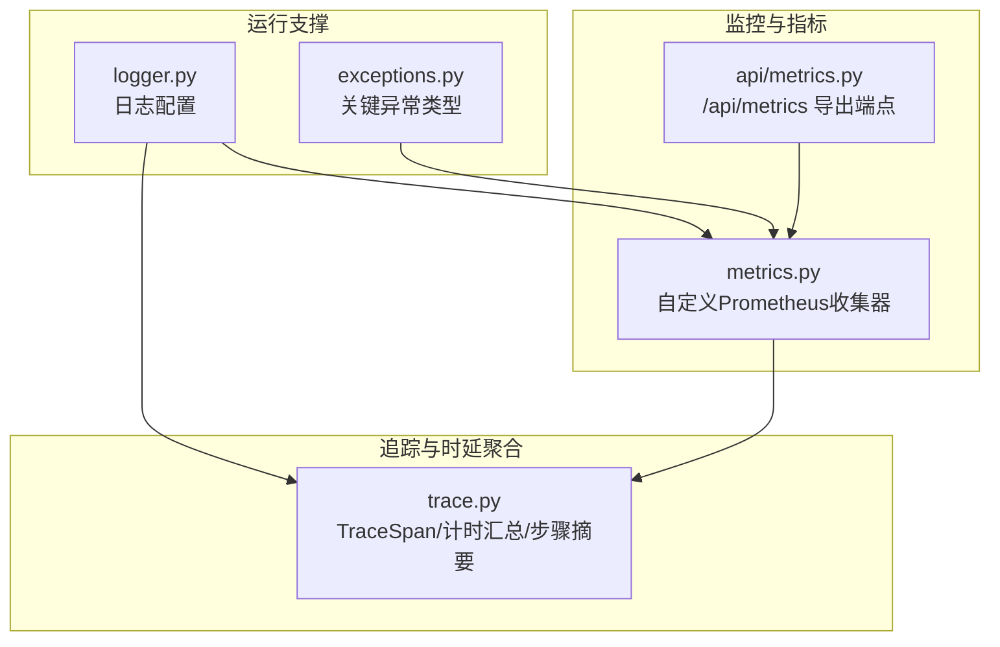
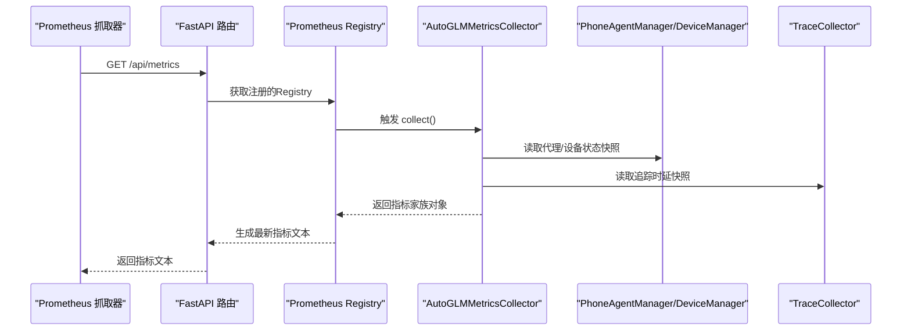
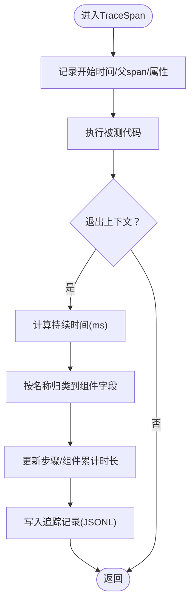
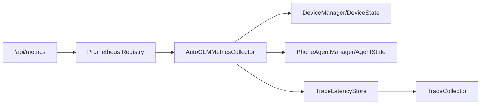

# 代理性能监控

<cite>
**本文引用的文件**
- [metrics.py](file://AutoGLM_GUI/metrics.py)
- [api/metrics.py](file://AutoGLM_GUI/api/metrics.py)
- [trace.py](file://AutoGLM_GUI/trace.py)
- [logger.py](file://AutoGLM_GUI/logger.py)
- [exceptions.py](file://AutoGLM_GUI/exceptions.py)
</cite>

## 目录
1. [简介](#简介)
2. [项目结构](#项目结构)
3. [核心组件](#核心组件)
4. [架构总览](#架构总览)
5. [详细组件分析](#详细组件分析)
6. [依赖分析](#依赖分析)
7. [性能考量](#性能考量)
8. [故障排查指南](#故障排查指南)
9. [结论](#结论)
10. [附录](#附录)

## 简介
本文件面向AutoGLM-GUI的“代理性能监控”，系统性阐述其性能指标体系与监控数据采集机制，覆盖任务/步骤/组件三个层级的时延统计、代理与设备状态指标、以及基于Prometheus的导出能力。同时给出CPU/内存/网络等资源使用监控建议、代理响应时间、准确率与稳定性评估方法、异常检测与告警思路、故障诊断流程，以及批量性能测试与基准测试的实施策略。

## 项目结构
围绕性能监控的关键模块包括：
- 指标导出：Prometheus指标注册与导出端点
- 追踪与计时：轻量级span-based追踪，按步骤与组件聚合时延
- 日志与异常：统一日志配置与关键异常类型
- 性能指标：代理状态、设备在线数、流式会话数、构建信息等

**图表来源**
- [metrics.py:179-466](file://AutoGLM_GUI/metrics.py#L179-L466)
- [api/metrics.py:11-36](file://AutoGLM_GUI/api/metrics.py#L11-L36)
- [trace.py:55-913](file://AutoGLM_GUI/trace.py#L55-L913)
- [logger.py:16-87](file://AutoGLM_GUI/logger.py#L16-L87)
- [exceptions.py:1-98](file://AutoGLM_GUI/exceptions.py#L1-L98)

**章节来源**
- [metrics.py:179-466](file://AutoGLM_GUI/metrics.py#L179-L466)
- [api/metrics.py:11-36](file://AutoGLM_GUI/api/metrics.py#L11-L36)
- [trace.py:55-913](file://AutoGLM_GUI/trace.py#L55-L913)
- [logger.py:16-87](file://AutoGLM_GUI/logger.py#L16-L87)
- [exceptions.py:1-98](file://AutoGLM_GUI/exceptions.py#L1-L98)

## 核心组件
- 自定义Prometheus收集器：负责在每次抓取时聚合当前状态，导出代理/设备/构建信息与追踪时延直方图。
- 追踪与计时：通过TraceSpan记录各阶段耗时，并按步骤与组件进行聚合，支持生成任务与步骤级时延摘要。
- 指标导出端点：FastAPI路由提供/text文本格式的Prometheus指标输出。
- 日志与异常：集中化日志配置与关键异常类型，便于问题定位与告警联动。

**章节来源**
- [metrics.py:179-466](file://AutoGLM_GUI/metrics.py#L179-L466)
- [trace.py:55-913](file://AutoGLM_GUI/trace.py#L55-L913)
- [api/metrics.py:11-36](file://AutoGLM_GUI/api/metrics.py#L11-L36)
- [logger.py:16-87](file://AutoGLM_GUI/logger.py#L16-L87)
- [exceptions.py:1-98](file://AutoGLM_GUI/exceptions.py#L1-L98)

## 架构总览
下图展示从请求到指标导出的整体链路，强调“按需收集”“线程安全”“可扩展”的设计原则。

**图表来源**
- [api/metrics.py:11-36](file://AutoGLM_GUI/api/metrics.py#L11-L36)
- [metrics.py:194-219](file://AutoGLM_GUI/metrics.py#L194-L219)
- [metrics.py:221-310](file://AutoGLM_GUI/metrics.py#L221-L310)
- [metrics.py:312-404](file://AutoGLM_GUI/metrics.py#L312-L404)
- [metrics.py:419-465](file://AutoGLM_GUI/metrics.py#L419-L465)

## 详细组件分析

### 指标体系与导出
- 代理相关指标
  - autoglm_agents_total：按设备与状态（如BUSY/IDLE等）分组的代理计数
  - autoglm_agents_busy_count：当前忙碌代理数量
  - autoglm_streaming_sessions_active：当前活跃流式会话数
  - autoglm_agent_last_used_timestamp_seconds / autoglm_agent_created_timestamp_seconds：代理最近使用与创建时间戳
- 设备相关指标
  - autoglm_devices_total：按序列号、型号、状态、连接类型、状态标签的设备计数
  - autoglm_devices_online_count：在线设备数
  - autoglm_device_connections_total：按连接类型与状态的连接计数
  - autoglm_device_unauthorized_connections_total：未授权连接总数
  - autoglm_device_last_seen_timestamp_seconds：设备最后可见时间戳
- 追踪时延指标
  - autoglm_trace_task_duration_seconds：任务级时延直方图（按source）
  - autoglm_trace_step_duration_seconds：步骤级时延直方图（按source）
  - autoglm_trace_component_duration_seconds：组件级时延直方图（按source, component）
- 构建信息
  - autoglm_build_info：版本与Python版本标签

这些指标均通过自定义Collector在每次抓取时按需计算，避免后台轮询带来的复杂度与内存泄漏风险。

**章节来源**
- [metrics.py:221-310](file://AutoGLM_GUI/metrics.py#L221-L310)
- [metrics.py:312-404](file://AutoGLM_GUI/metrics.py#L312-L404)
- [metrics.py:419-465](file://AutoGLM_GUI/metrics.py#L419-L465)
- [metrics.py:406-417](file://AutoGLM_GUI/metrics.py#L406-L417)

### 追踪与时延聚合
- TraceSpan：以上下文管理器形式包裹执行片段，自动记录开始/结束时间与属性；退出时写入追踪记录并更新当前TraceCollector中的步骤/组件时延。
- 步骤与组件分类
  - 步骤级字段：total_duration_ms、screenshot_duration_ms、current_app_duration_ms、llm_duration_ms、parse_action_duration_ms、execute_action_duration_ms、update_context_duration_ms、adb_duration_ms、sleep_duration_ms、other_duration_ms
  - 组件映射：将具体span名称归类到上述字段，例如“step.llm”对应llm_duration_ms、“sleep.*”对应sleep_duration_ms、“adb.*”（除特定例外）对应adb_duration_ms
- 聚合与导出
  - 支持查询当前trace的步骤摘要与整体摘要
  - 提供record_trace_latency_metrics接口将聚合结果写入内部存储，随后在collect中导出为直方图

**图表来源**
- [trace.py:757-864](file://AutoGLM_GUI/trace.py#L757-L864)
- [trace.py:579-608](file://AutoGLM_GUI/trace.py#L579-L608)
- [trace.py:512-554](file://AutoGLM_GUI/trace.py#L512-L554)

**章节来源**
- [trace.py:55-913](file://AutoGLM_GUI/trace.py#L55-L913)
- [metrics.py:491-507](file://AutoGLM_GUI/metrics.py#L491-L507)

### 指标导出端点
- FastAPI路由/api/metrics：调用get_metrics_registry并生成latest文本格式，供Prometheus定期抓取
- 建议抓取配置示例已在端点注释中给出，包括job_name、scrape_interval、static_configs与metrics_path

**章节来源**
- [api/metrics.py:11-36](file://AutoGLM_GUI/api/metrics.py#L11-L36)

### 日志与异常
- 日志：集中化配置控制台与文件输出，支持旋转、保留与压缩；错误日单独落盘以便审计
- 异常：DeviceNotAvailableError、DeviceBusyError、AgentNotInitializedError、AgentInitializationError等，用于快速定位设备/代理初始化/占用等问题

**章节来源**
- [logger.py:16-87](file://AutoGLM_GUI/logger.py#L16-L87)
- [exceptions.py:1-98](file://AutoGLM_GUI/exceptions.py#L1-L98)

## 依赖分析
- 指标导出依赖
  - Prometheus客户端：生成latest文本
  - 自定义Collector：读取PhoneAgentManager与DeviceManager状态快照
  - 追踪时延：依赖TraceCollector的聚合结果
- 追踪依赖
  - 线程锁保护共享状态
  - JSONL文件写入用于回放与诊断

**图表来源**
- [api/metrics.py:30-36](file://AutoGLM_GUI/api/metrics.py#L30-L36)
- [metrics.py:223-309](file://AutoGLM_GUI/metrics.py#L223-L309)
- [metrics.py:422-465](file://AutoGLM_GUI/metrics.py#L422-L465)
- [trace.py:557-679](file://AutoGLM_GUI/trace.py#L557-L679)

**章节来源**
- [api/metrics.py:30-36](file://AutoGLM_GUI/api/metrics.py#L30-L36)
- [metrics.py:223-309](file://AutoGLM_GUI/metrics.py#L223-L309)
- [metrics.py:422-465](file://AutoGLM_GUI/metrics.py#L422-L465)
- [trace.py:557-679](file://AutoGLM_GUI/trace.py#L557-L679)

## 性能考量
- 指标收集策略
  - 按需收集：每次抓取才计算，避免后台轮询导致的内存泄漏与标签卡迪纳尔性问题
  - 快照与浅拷贝：对共享状态做快照，缩短锁持有时间
  - 线程安全：内部使用锁保护共享状态，collect仅做只读操作
- 时延聚合
  - 使用直方图桶与累计计数，支持p50/p95/p99等分位
  - 组件级拆分便于定位瓶颈（LLM、ADB、解析、执行等）
- 资源使用监控建议
  - CPU/内存/网络：建议结合系统级监控工具（如Prometheus Node Exporter、cAdvisor、APM）采集进程级指标，与代理指标联动分析
  - 网络：关注模型服务延迟抖动、重试与超时行为
  - I/O：ADB截图/回放文件大小与磁盘IO对吞吐影响较大，应限制截图捕获策略
- 准确率与稳定性
  - 准确率：可通过历史任务成功率、动作执行成功/失败比、错误类型分布评估
  - 稳定性：以任务/步骤时延标准差、失败率、重试次数衡量
- 告警阈值
  - 基于历史分位与SLA设定阈值，结合趋势与突发检测触发告警

[本节为通用性能指导，不直接分析具体文件]

## 故障排查指南
- 常见异常与处理
  - 设备不可用：检查设备连接状态、驱动与权限
  - 设备繁忙：等待或调整并发策略
  - 代理未初始化：确认模型配置、密钥与网络连通性
  - 初始化失败：核对配置文件与环境变量
- 日志与追踪
  - 启用AUTOGLM_TRACE_ENABLED/AUTOGLM_TRACE_REPLAY_ENABLED，观察JSONL追踪文件与回放目录
  - 结合错误日志定位异常堆栈与上下文
- 指标辅助诊断
  - 若autoglm_devices_online_count骤降，可能为设备离线或授权问题
  - 若autoglm_agents_busy_count长期偏高且autoglm_trace_task_duration_seconds分位上升，可能存在队列积压或单步耗时过长
  - 若autoglm_trace_component_duration_seconds中LLM分量占比过高，优先优化提示词与模型参数

**章节来源**
- [exceptions.py:1-98](file://AutoGLM_GUI/exceptions.py#L1-L98)
- [logger.py:16-87](file://AutoGLM_GUI/logger.py#L16-L87)
- [trace.py:55-913](file://AutoGLM_GUI/trace.py#L55-L913)
- [metrics.py:312-404](file://AutoGLM_GUI/metrics.py#L312-L404)

## 结论
AutoGLM-GUI通过“按需收集+直方图聚合”的指标体系，实现了对代理与设备状态、任务/步骤/组件时延的全面观测。结合Prometheus导出与JSONL追踪，既能满足日常稳定性监控，也能支撑深度性能分析与故障诊断。建议在现有基础上补充系统级资源监控与自动化告警，形成端到端的可观测性闭环。

[本节为总结性内容，不直接分析具体文件]

## 附录

### 指标清单与含义
- 代理类
  - autoglm_agents_total：按设备与状态的代理计数
  - autoglm_agents_busy_count：忙碌代理数
  - autoglm_streaming_sessions_active：活跃流式会话数
  - autoglm_agent_last_used_timestamp_seconds / autoglm_agent_created_timestamp_seconds：代理时间戳
- 设备类
  - autoglm_devices_total：按序列号/型号/状态/连接类型的设备计数
  - autoglm_devices_online_count：在线设备数
  - autoglm_device_connections_total：连接计数
  - autoglm_device_unauthorized_connections_total：未授权连接数
  - autoglm_device_last_seen_timestamp_seconds：设备最后可见时间
- 追踪时延类
  - autoglm_trace_task_duration_seconds：任务时延直方图
  - autoglm_trace_step_duration_seconds：步骤时延直方图
  - autoglm_trace_component_duration_seconds：组件时延直方图（screenshot/llm/parse_action/execute_action/adb/sleep/other）
- 构建信息
  - autoglm_build_info：版本与Python版本

**章节来源**
- [metrics.py:221-404](file://AutoGLM_GUI/metrics.py#L221-L404)
- [metrics.py:419-465](file://AutoGLM_GUI/metrics.py#L419-L465)

### 批量性能测试与基准测试策略
- 场景设计
  - 多设备并发：模拟多设备同时执行典型任务，观察吞吐与延迟分位
  - 长时稳定：持续运行N小时，监测失败率、重启次数与指标漂移
  - 压力边界：逐步提升并发与任务复杂度，定位瓶颈点
- 指标采集
  - 代理/设备指标：Prometheus抓取
  - 系统资源：Node Exporter/cAdvisor采集CPU/内存/网络/磁盘
  - 应用层指标：动作成功率、平均/分位时延、错误分布
- 回归与对比
  - 对比不同模型/参数/设备配置下的指标差异
  - 记录基线，建立回归阈值

[本节为通用策略说明，不直接分析具体文件]